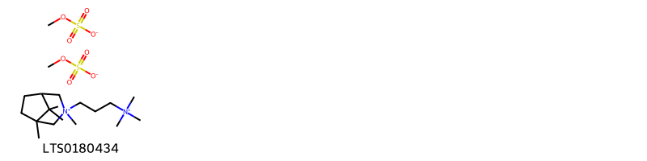
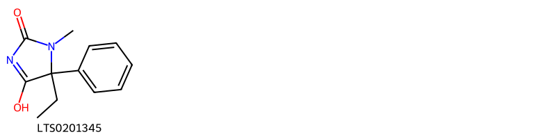
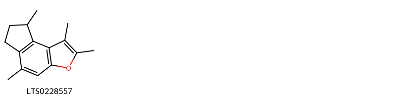
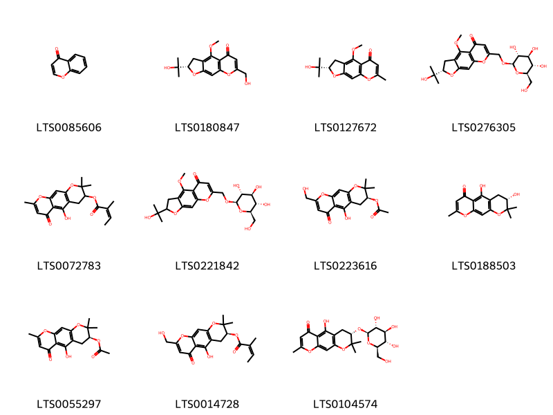
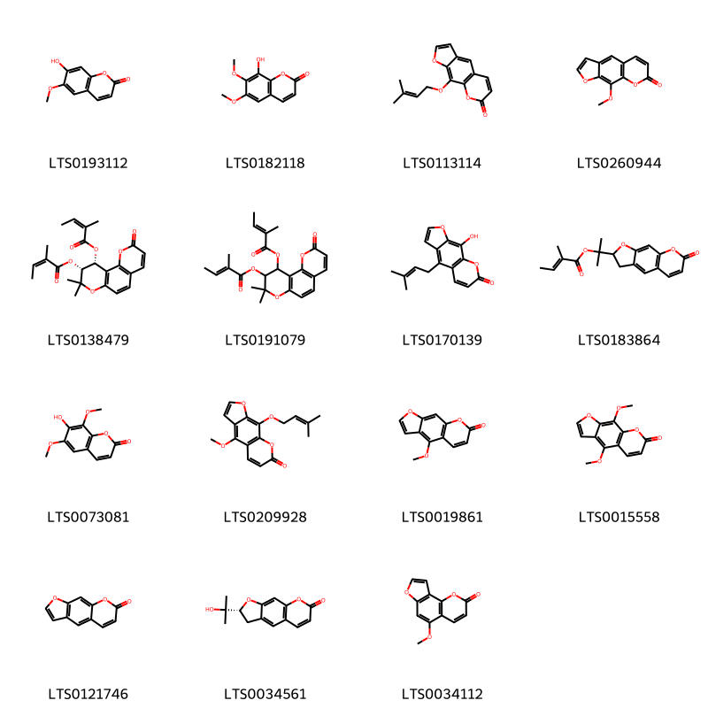
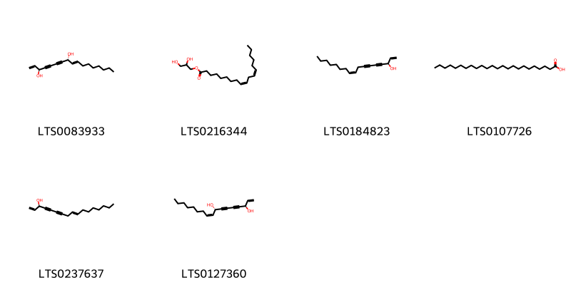
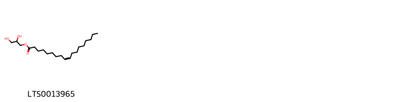
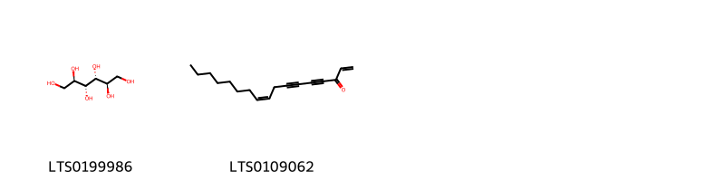

!!! abstract "Tóm tắt"
    Phòng Phong( Rễ) có tên khoa học là Radix Saposhnikoviae divaricatae, thuộc họ Hoa tán (Apiaceae). Phân bố chủ yếu tại Trung Quốc và được trồng nhiều ở các tỉnh Tứ Xuyên, Quý Châu, Vân Nam (Trung Quốc). Hiện tại ở Việt Nam đều là nhập từ Trung Quốc. Theo kinh nghiệm thì phòng phong sắc có tác dụng hạ sốt khoảng 2 tiếng rưỡi. Còn trong Đông Y thuốc chữa cảm mạo biểu chứng ra mồ hôi, dùng chữa nhức đầu choáng váng, mắt mờ, trừ phong, đau các khớp xương. Tác dụng dược lý mới tìm thấy là hạ nhiệt và ức chế miễn dịch. Thành phần hóa học trong phòng phong bao gồm  13 chất coumarin, chromon và polyacetylen, chủ yếu là khellaceton dieste. Đã phân lập được 5 hợp chất là umbelliferon, silindin, anomalin, nodakenin và acid ferulic.

## Thông tin về thực vật

### Đặc điểm thực vật

Dược liệu **Phòng Phong (Rễ)** từ bộ phận **** từ loài *poshnikovia divaricata (Turcz.) Schischk.* thuộc họ N/A. Cây xuyên phòng phong (Ligusticum brachylobum) là một cây sống lâu năm cao tới 1m. Từ gốc ra những lá có cuống dài 10-15cm, phía dưới cuống phát triển thành bẹ ôm lấy thân. Lá 2-3 lần xẻ lông chim. Cụm hoa hình tán kép gồm 25-30 tán nhỏ, dài ngắn không đều, dài từ 5- 8cm, mỗi tán nhỏ mang 25-30 hoa màu trắng. Quả kép gồm 2 phần quả, hình trứng dẹt không có lông. trên lưng có sống chạy dọc, giữa sống có 3 ống tinh dầu, mặt tiếp xúc có 5-6 ống tinh dầu, hai bên mép phát triển thành cánh.

Cây phòng phong hay thiên phòng phong (Ledebouriella seseloides) cũng là một cây sống lâu năm, cao 0,3-0,8m, lá mọc so le, có cuống dài, phía dưới cũng phát triển thành bẹ ôm vào thần, phiến lá xẻ lông chim 2-3 lần trông giống lá ngải cứu. Cụm hoa hình tán kép, mỗi tán kép có 5-7 tán nhỏ, cuống tán nhỏ không đều nhau. Mỗi tán nhỏ có 4-9 hoa nhỏ màu trắng. Quả kép gồm 2 phân quả, hai quả dính nhau trông như hình chuông; trên lưng quả có sống chạy dọc. giữa sống có một ống tinh dầu, mặt tiếp xúc giữa 2 phân quả có 1 ống tinh dầu.

Cây vân phòng phong hay phòng phong lá tre-trúc diệp phòng phong (Seseli delavayi) là một cây sống lâu năm cao 0,3-0,5m, lá kép 2-3 lần xẻ lông chim có cuống dài, thủy lá giống lá trẻ dài 7-10cm, rộng 2-4cm, mép nguyên. Cụm hoa hình tán kép gồm 5-8 tán nhỏ, mỗi tán nhỏ gồm 10-20 hoa nhỏ có cuống dài ngắn không đều. Hoa màu trắng. Quả hình trứng dài màu tím nâu, trên lưng phân quả có sống chạy dọc, giữa sống quả có 3 ống tinh dầu, ở mặt tiếp xúc giữa 2 phân quả có 5 ống tinh dầu. 

!!! info "Phân loại thực vật của *N/A*"
    - **Kingdom:** N/A
    - **Phylum:** N/A
    - **Order:** N/A
    - **Family:** N/A
    - **Genus:** N/A
    - **Species:** *N/A*

*Tài liệu tham khảo:* "Những cây thuốc và vị thuốc Việt Nam" - Đỗ Tất Lợi

 

### Loài thay thế (Nếu có)

### Phân bố trên thế giới
**Từ vườn thực vật KEW: **: Amur, Buryatiya, China North-Central, Chita, Inner Mongolia, Kazakhstan, Korea, Manchuria, Mongolia, Primorye

**Từ CSDL GIBF** Không có kết quả phù hợp

### Phân bố tại Việt Nam
** "Những cây thuốc và vị thuốc Việt Nam" - Đỗ Tất Lợi**: chưa có tại Việt Nam vẫn phải nhập về từ Trung Quốc

**Từ CSDL GIBF**: Không có ghi nhận ở Việt Nam

---

## Thông tin về dược liệu 

### Định danh

!!! info "Thông tin về tên gọi của phòng phong"
    - Dược liệu tiếng Việt: phòng phong
    - Dược liệu tiếng Trung: 防风 (Fang Feng)
    - Dược liệu tiếng Anh: Saposhnikovia Divaricata [Syn. Ledebouriella Seseloides]
    - Dược liệu latin thông dụng: Radix Saposhnikoviae divaricataenRadix Saposhnikoviae
    - Dược liệu latin kiểu DĐVN: radix saposhnikoviae divaricatae
    - Dược liệu latin kiểu DĐVN: Radix Saposhnikoviae
    - Dược liệu latin kiểu thông tư: Radix Saposhnikoviae divaricatae
    - Bộ phận dùng:  (Radix)

### Mô tả dược liệu 
- **Theo dược điển Việt nam V:** Rễ có hình nón hay hình trụ dài, dần thắt nhỏ lại về phía dưới, hơi ngoằn ngoèo, dài 15 cm đến 30 cm, đường kính 0,5 cm đến 2 cm. Mặt ngoài màu nâu xám, sần sùi với những vân ngang, lớp vỏ ngoài thường bong tróc ra, nhiều nốt bì khổng trắng và những u lồi do vết rễ con để lại. Phần đầu rễ mang nhiều vân lồi hình vòng cung, đôi khi là những túm gốc cuống lá dạng sợi có màu nâu, dài 2 cm đến 3 cm. Thể chất nhẹ, dễ gãy, vết gãy không đều, vỏ ngoài màu nâu và có vết nứt, lõi màu vàng nhạt. Mùi thơm, vị đặc trưng, hơi ngọt. Dược liệu sau khi đã thái lát: Các lát hình tròn hoặc hình elip. Bên ngoài màu nâu xám có các nếp nhăn dọc, sần sùi, đôi khi có các u lồi ngang kéo dài giống các lỗ vỏ, các lát đầu rễ có mang các gổc cuống lá dạng sợi. Mặt cắt màu nâu nhạt và phần vỏ bị nứt, khe nứt màu vàng nhạt, phần gỗ có các tia xuyên tâm. Mùi thơm, vị hơi ngọt.

- **Mô tả dược liệu theo thông tư chế biến dược liệu theo phương pháp cổ truyền:** 

### Chế biến 

- **Chế biến theo dược điển việt nam V**: Thu hoạch vào mùa xuân hay mùa thu khi cây có hoa, đào lấy rễ, loại vỏ rễ con và đất, phơi khô. Bào chế Loại vỏ tạp chất, rửa sạch, ủ mềm, thái lát dày và phơi khô. nn

- **Chế biến theo thông tư:** 

--- 

## Thành phần hóa học

- Theo tài liệu của GS. Đỗ Tất Lợi:  (1) Có chứa 13 chất coumarin, chromon và polyacetylen, chủ yếu là khellaceton dieste. Đã phân lập được 5 hợp chất là umbelliferon, silindin, anomalin, nodakenin và acid ferulic 
(2) prim- O-glucosylcimifugin(C22H28O11) và 5-O-rnethylvisamrninosid (C22H28O10)
    
- Theo cơ sở dữ liệu lotus: Từ loài *N/A* đã phân lập và xác định được 43 hoạt chất thuộc về các nhóm Organooxygen compounds, Benzofurans, Azepanes, Benzopyrans, Steroids and steroid derivatives, Coumarins and derivatives, Benzene and substituted derivatives, Azolidines, Fatty Acyls, Indoles and derivatives, Glycerolipids, Flavonoids, Purine nucleosides. 

|    | chemicalTaxonomyClassyfireClass     |   smiles_count |
|---:|:------------------------------------|---------------:|
|  0 | Azepanes                            |              1 |
|  1 | Azolidines                          |              1 |
|  2 | Benzene and substituted derivatives |              1 |
|  3 | Benzofurans                         |              1 |
|  4 | Benzopyrans                         |             11 |
|  5 | Coumarins and derivatives           |             15 |
|  6 | Fatty Acyls                         |              6 |
|  7 | Flavonoids                          |              1 |
|  8 | Glycerolipids                       |              1 |
|  9 | Indoles and derivatives             |              1 |
| 10 | Organooxygen compounds              |              2 |
| 11 | Purine nucleosides                  |              1 |
| 12 | Steroids and steroid derivatives    |              1 |

### Nhóm Azepanes
<figure markdown="span">
    { width=100% }
    <figcaption>Hình ảnh cấu trúc hóa học của 1 hoạt chất thuộc nhóm Azepanes gồm ['trimethidinium methosulfate (LTS0180434)'].</figcaption>
</figure>
### Nhóm Azolidines
<figure markdown="span">
    { width=100% }
    <figcaption>Hình ảnh cấu trúc hóa học của 1 hoạt chất thuộc nhóm Azolidines gồm ['methetoin (LTS0201345)'].</figcaption>
</figure>
### Nhóm Benzene and substituted derivatives
<figure markdown="span">
    { width=100% }
    <figcaption>Hình ảnh cấu trúc hóa học của 1 hoạt chất thuộc nhóm Benzene and substituted derivatives gồm ['vanillic acid (LTS0229113)'].</figcaption>
</figure>
### Nhóm Benzofurans
<figure markdown="span">
    { width=100% }
    <figcaption>Hình ảnh cấu trúc hóa học của 1 hoạt chất thuộc nhóm Benzofurans gồm ['1,2,5,8-tetramethyl-6h,7h,8h-indeno[5,4-b]furan (LTS0228557)'].</figcaption>
</figure>
### Nhóm Benzopyrans
<figure markdown="span">
    { width=100% }
    <figcaption>Hình ảnh cấu trúc hóa học của 11 hoạt chất thuộc nhóm Benzopyrans gồm ['4h-1-benzopyran-4-one (LTS0085606)', 'cimifugin (LTS0180847)', '5-o-methylvisamminol (LTS0127672)', '(2s)-2-(2-hydroxypropan-2-yl)-4-methoxy-7-({[(2r,3r,4s,5s,6r)-3,4,5-trihydroxy-6-(hydroxymethyl)oxan-2-yl]oxy}methyl)-2h,3h-furo[3,2-g]chromen-5-one (LTS0276305)', '5-hydroxy-2,2,8-trimethyl-6-oxo-3h,4h-pyrano[3,2-g]chromen-3-yl (2z)-2-methylbut-2-enoate (LTS0072783)', '2-(2-hydroxypropan-2-yl)-4-methoxy-7-({[(2r,3r,4s,5s,6r)-3,4,5-trihydroxy-6-(hydroxymethyl)oxan-2-yl]oxy}methyl)-2h,3h-furo[3,2-g]chromen-5-one (LTS0221842)', '(3s)-5-hydroxy-8-(hydroxymethyl)-2,2-dimethyl-6-oxo-3h,4h-pyrano[3,2-g]chromen-3-yl acetate (LTS0223616)', 'hamaudol (LTS0188503)', '(3s)-5-hydroxy-2,2,8-trimethyl-6-oxo-3h,4h-pyrano[3,2-g]chromen-3-yl acetate (LTS0055297)', '(3s)-5-hydroxy-8-(hydroxymethyl)-2,2-dimethyl-6-oxo-3h,4h-pyrano[3,2-g]chromen-3-yl (2z)-2-methylbut-2-enoate (LTS0014728)', 'sec-o-glucosylhamaudol (LTS0104574)'].</figcaption>
</figure>
### Nhóm Coumarins and derivatives
<figure markdown="span">
    { width=100% }
    <figcaption>Hình ảnh cấu trúc hóa học của 15 hoạt chất thuộc nhóm Coumarins and derivatives gồm ['scopoletin (LTS0193112)', 'fraxidin (LTS0182118)', 'imperatorin (LTS0113114)', 'methoxsalen (LTS0260944)', '(9r,10r)-8,8-dimethyl-10-{[(2z)-2-methylbut-2-enoyl]oxy}-2-oxo-9h,10h-pyrano[2,3-h]chromen-9-yl (2z)-2-methylbut-2-enoate (LTS0138479)', '8,8-dimethyl-10-{[(2e)-2-methylbut-2-enoyl]oxy}-2-oxo-9h,10h-pyrano[2,3-h]chromen-9-yl (2e)-2-methylbut-2-enoate (LTS0191079)', 'alloimperatorin (LTS0170139)', '(+/-)-sprengelianine (LTS0183864)', 'isofraxidin (LTS0073081)', 'phellopterin (LTS0209928)', 'bergapten (LTS0019861)', 'isopimpinellin (LTS0015558)', 'psoralen (LTS0121746)', '(-)-marmesin (LTS0034561)', 'isobergapten (LTS0034112)'].</figcaption>
</figure>
### Nhóm Fatty Acyls
<figure markdown="span">
    { width=100% }
    <figcaption>Hình ảnh cấu trúc hóa học của 6 hoạt chất thuộc nhóm Fatty Acyls gồm ['(3s,8r)-heptadeca-1,9-dien-4,6-diyne-3,8-diol (LTS0083933)', 'glyceryl 1-linoleate (LTS0216344)', 'falcarinol (LTS0184823)', 'lignoceric acid (LTS0107726)', '(z)-falcarinol (LTS0237637)', 'falcarindiol (LTS0127360)'].</figcaption>
</figure>
### Nhóm Flavonoids
<figure markdown="span">
    { width=100% }
    <figcaption>Hình ảnh cấu trúc hóa học của 1 hoạt chất thuộc nhóm Flavonoids gồm ['wogonin (LTS0176185)'].</figcaption>
</figure>
### Nhóm Glycerolipids
<figure markdown="span">
    { width=100% }
    <figcaption>Hình ảnh cấu trúc hóa học của 1 hoạt chất thuộc nhóm Glycerolipids gồm ['oleoyl glycerol (LTS0013965)'].</figcaption>
</figure>
### Nhóm Indoles and derivatives
<figure markdown="span">
    { width=100% }
    <figcaption>Hình ảnh cấu trúc hóa học của 1 hoạt chất thuộc nhóm Indoles and derivatives gồm ['n-[2-(5-methoxy-1h-indol-3-yl)ethyl]ethanimidic acid (LTS0219322)'].</figcaption>
</figure>
### Nhóm Organooxygen compounds
<figure markdown="span">
    { width=100% }
    <figcaption>Hình ảnh cấu trúc hóa học của 2 hoạt chất thuộc nhóm Organooxygen compounds gồm ['mannitol (LTS0199986)', 'falcarinone (LTS0109062)'].</figcaption>
</figure>
### Nhóm Purine nucleosides
<figure markdown="span">
    { width=100% }
    <figcaption>Hình ảnh cấu trúc hóa học của 1 hoạt chất thuộc nhóm Purine nucleosides gồm ['adenosine (LTS0014061)'].</figcaption>
</figure>
### Nhóm Steroids and steroid derivatives
<figure markdown="span">
    { width=100% }
    <figcaption>Hình ảnh cấu trúc hóa học của 1 hoạt chất thuộc nhóm Steroids and steroid derivatives gồm ['stigmast-5-en-3-ol, (3β)- (LTS0204616)'].</figcaption>
</figure>

---

## Tác dụng dược lý

Theo tài liệu "Những cây thuốc và vị thuốc Việt Nam" - Đỗ Tất Lợi:- Hạ nhiệt
- Ức chế miễn dịch

Theo tài liệu quốc tế: To induce diaphoresis, to dispel wind, to alleviate rheumatic conditions, and to relieve spasm.

---

## Dược điển Việt Nam V

### Soi bột:
Bột có màu nâu nhạt. Soi kính hiển vi thấy: Ống tiết đường kính 17 μm đến 60 μm. chứa chất tiết vàng nâu. Các bó libe-gỗ của gốc cuống lá thường đi kèm các bó sợi. Mảnh mạch mạng đường kính 10 μm đến 40 μm. Tế bào mô cứng màu vàng lục, hình bầu dục hay dạng chữ nhật có thành dày.
<!-- Hình ảnh soi bột sẽ được tự động chèn vào đây sau -->
### Vi phẫu:
Lớp bần gồm 5 đến 40 lớp tế bào hình chữ nhật, dài 15 μm đến 50 μm, rộng 7 μm đến 12 μm, thành mỏng. Mô mềm lục bì hẹp gồm 5 đến 7 lớp tế bào chữ nhật dài, có nhiều ống tiết hình bầu dục. Vùng các bó libe có rất nhiều ống tiết có đường kính 35 μm đến 75 μm, ống tiết có hình tròn hay bầu dục, mỗi ổng tiểt có 4 đến 10 tế bào tiết bao quanh, ống tiết chứa chất tiết màu vàng; các tia libe thường uốn lượn và bị dồn ép ở phần ngoài. Tầng phát sinh libe-gỗ liên tục. Mạch gỗ nhiều, xếp thành tia. Tủy vẫn còn mô mềm với ít ổng tiết hay gỗ chiếm tâm.
<!-- Hình ảnh vi phẫu sẽ được tự động chèn vào đây sau -->
### Định tính

Phương pháp sắc ký lớp mỏng (Phụ lục 5.4). Bản mỏng: Silica gel GF254. Dung môi khai triển: Cloroform – methanol (4 : 1). Dung dịch thử: Lấy 1 g bột dược liệu, thêm 20 ml aceton (TT), siêu âm 20 min, lọc, cô dịch lọc trong cách thủy đến cắn, hòa cắn trong 1 ml ethanol 96 % (TT). Dung dịch đối chiếu: Lấy 1 g bột Phòng phong (mẫu chuẩn), tiến hành chiết như mô tả ờ phần Dung dịch thử hoặc hòa tan 5-O-methylvisamminosid chuẩn và prim-O-glucosyicimifugin chuẩn trong ethanol 96 % (TT) để được dung dịch chuẩn hỗn hợp có nồng độ mỗi chất chuẩn 1 mg/1 ml. Cách tiến hành: Chấm riêng biệt lên bản mỏng 10 μl mỗi dung dịch trên. Sau khi triển khai sắc ký đến khi dung môi đi được khoảng 12 cm, lấy bản mỏng ra để khô ờ nhiệt độ phòng. Quan sát bản mỏng dưới ánh sáng tử ngoại ở bước sóng 254 nm. Trên sắc ký đồ của dung dịch thử phải có các vết cùng màu sắc và giá trị Rf với các vết trên sắc ký đồ của dung dịch đối chiểu.

### Định lượng

Chất chiết được trong dược liệu Không dưới 13,0 % tính theo dược liệu khô kiệt. Tiến hành theo phương pháp chiết nóng (Phụ lục 12.10), dùng ethanol 96 % (TT) làm dung môi. Định lượng Phương pháp sắc ký lỏng (Phụ lục 5.3). Pha động: Methanol – nước (40 : 60). Dung dịch thử: Lấy chính xác khoảng 0,25 g bột dược liệu (qua rây có cỡ mắt rây 0,180 mm) vào bình nón nút mài, thêm chính xác 10 ml methanol 50% (TT). Đậy nút và cân. Đun hồi lưu trên cách thủy 2 h. Để nguội và cân lại. Bổ sung methanol (TT) để được khối lượng ban đầu, lắc đều, lọc qua màng lọc 0,45 μm. Dung dịch chuẩn: Hòatanriêngbiệt-O-methylvisamminosid chuẩn và prim-O-glucosylcimifugin chuẩn trong methanol (TT) để được hai dung dịch chuẩn có nồng độ mỗi chất chuẩn chính xác khoảng 60 mg/ml. Điều kiện sắc ký: Cột kích thước (25 cm X 4,6 mm) nhồi pha tĩnh C (5 μm). Detector quang phổ tử ngoại đặt ở bước sóng 254 nm. Thể tích tiêm: 5 μl. Tốc độ dòng: 1.0 ml/min. Cách tiến hành: Tiến hành sắc ký dung dịch chuẩn. Tính số đĩa lý thuyết của cột theo pic cùa prim-O-glucosylcimifugin. Số đĩa lý thuyết của cột không được nhỏ hơn 2000. Tiến hành sắc ký lần lượt với các dung dịch chuẩn, dung dịch thử. Tính hàm lượng 5-O-methylvisamminosid chuẩn và prim-O-glycosylcimifugm trong dược liệu dựa vào diện tích pic 5 O-methylvisamminosid chuẩn và prim-O-glyeosylcimifugin trên sắc ký đồ của dung dịch thử, sắc ký đồ dung dịch chuẩn và hàm lượng C22H28O10 trong 5-O-methylvisamminosid chuẩn và hàm lượng C22H28O11 trong prim-O-glycosylcimifugin chuẩn. Dược liệu phải chứa không ít hơn 0,24 % tổng hàm lượng prim- O-glucosvlctmifugin(C22H28O11)và5-O-rnethylvisamrninosid (C22H28O10) tính theo dược liệu khô kiệt.

### Thông tin khác 
- ** Độ ẩm: ** Không quá 10,0 % (Phụ lục 9.6, 2 g, 105 °C, 5 h).

- ** Bảo quản:** Nơi khô mát, tránh mọt.nn
## Dược điển Hồng kong

<!-- PDF sẽ được tự động chèn vào đây sau -->

---

## Y dược học cổ truyền

- **Tên vị thuốc:** 
- **Tính vị quy kinh:** Tân, cam, ôn. Vào kinh can, phế, vị, bàng quang.
- **Công năng chủ trị:** Giải biểu trừ phong hàn, trừ phong thấp, trừ co thắt. 
Chủ trị: Đau đầu do hàn, mày đay, phong thấp tê đau, uốn ván.
- **Chú ý:** 
- **Kiêng kỵ:** 

