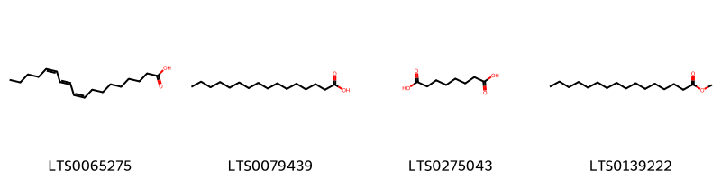
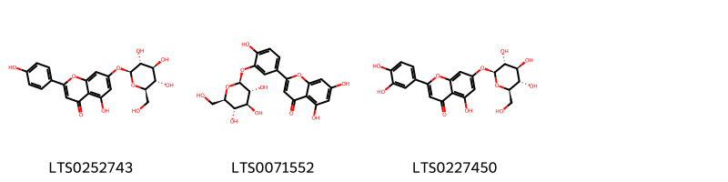
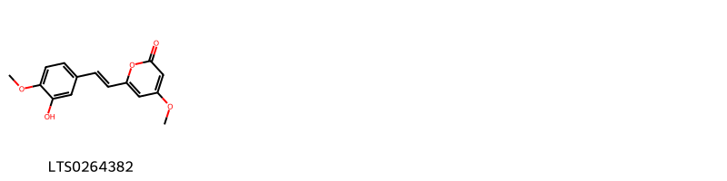
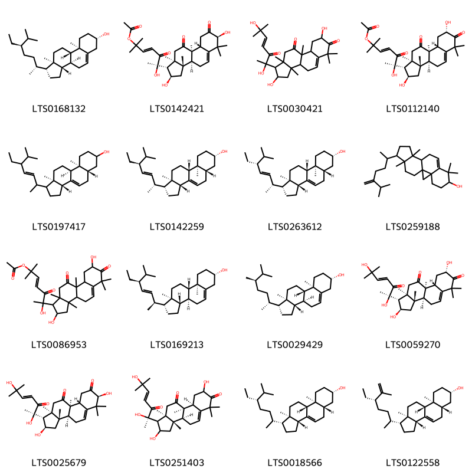

!!! abstract "Tóm tắt"
    Fructus Trichosanthis (Quả qua lâu) thuộc họ Cucurbitaceae (họ Bí), là loài cây bản địa tại Campuchia, Trung Quốc, Nhật Bản, Hàn Quốc, Lào và Việt Nam, đặc biệt được phát hiện nhiều ở Cao Bằng. Trong y học cổ truyền, quả qua lâu được dùng để thanh nhiệt, trừ đờm, tiêu viêm, giải độc, hỗ trợ tiêu hóa, và giảm đau. Vỏ quả phơi khô chữa ho, thổ huyết, sốt nóng, phù thũng và vàng da. Thành phần chính gồm alkaloids, triterpenoids, saponins, polysaccharides, hợp chất phenolic, flavonoids, và amino acids.

## Thông tin về thực vật

### Đặc điểm thực vật

Dược liệu **Qua Lâu (Quả)** từ bộ phận **nan** từ loài *Trichosanthes kirilowii Maxim.* thuộc họ Cucurbitaceae. Quả to bằng quả dưa gang, dài 8-10cm, đường kính 5-7cm, da quả màu xanh, có vằn trắng dọc theo quả. Khi chín, và có màu đỏ, bổ lấy hạt, phơi khô. Trong một quả có rất nhiều hạt, hình trứng dẹt, dài 1,2- 1,5cm, rộng 6-10cm dày ước 4mm, mặt ngoài màu nâu nhạt. ở đầu nhọn có một tế là một vết lõm trắng. Quanh mép có dìa chừng 1mm. Nhìn qua kính lúp, mặt hạt có vết răn. Bóc vỏ cứng ở ngoài sẽ thấy lớp vỏ mỏng màu xanh. Vị nhạt không mùi. 

!!! info "Phân loại thực vật của *Trichosanthes kirilowii*"
    - **Kingdom:** Plantae
    - **Phylum:** Tracheophyta
    - **Order:** Cucurbitales
    - **Family:** Cucurbitaceae
    - **Genus:** Trichosanthes
    - **Species:** *Trichosanthes kirilowii*

*Tài liệu tham khảo:* "Những cây thuốc và vị thuốc Việt Nam" - Đỗ Tất Lợi

 

### Loài thay thế (Nếu có)

Dược liệu này cũng có thể từ loài *Trichosanthes rosthornii Harms*, thông tin về phân loại thực vật loài này như sau:
!!! info "Thông tin về phân loại thực vật của *Trichosanthes rosthornii*"
    - **kingdom:** Plantae
    - **phylum:** Tracheophyta
    - **order:** Cucurbitales
    - **family:** Cucurbitaceae
    - **genus:** Trichosanthes
    - **species:** *Trichosanthes rosthornii*

Hình ảnh của loài *Trichosanthes rosthornii Harms*:

### Phân bố trên thế giới
**Từ vườn thực vật KEW: **: Cây bản địa ở: Cambodia, China North-Central, China Southeast, Inner Mongolia, Japan, Korea, Laos, Nansei-shoto, Vietnam
Di thực tới: North Caucasus

**Từ CSDL GIBF** Japan, Korea, Republic of, United States of America, China

### Phân bố tại Việt Nam
** "Những cây thuốc và vị thuốc Việt Nam" - Đỗ Tất Lợi**: Hiện nay ta mới phát hiện và thu mua ở Cao Bằng

**Từ CSDL GIBF**: Không có ghi nhận ở Việt Nam

---

## Thông tin về dược liệu 

### Định danh

!!! info "Thông tin về tên gọi của nan"
    - Dược liệu tiếng Việt: nan
    - Dược liệu tiếng Trung: nan (nan)
    - Dược liệu tiếng Anh: nan
    - Dược liệu latin thông dụng: nan
    - Dược liệu latin kiểu DĐVN: fructus trichosanthis
    - Dược liệu latin kiểu DĐVN: nan
    - Dược liệu latin kiểu thông tư: nan
    - Bộ phận dùng: nan (nan)

### Mô tả dược liệu 
- **Theo dược điển Việt nam V:** nan

- **Mô tả dược liệu theo thông tư chế biến dược liệu theo phương pháp cổ truyền:** nan

### Chế biến 

- **Chế biến theo dược điển việt nam V**: nan

- **Chế biến theo thông tư:** nan

--- 

## Thành phần hóa học

- Theo tài liệu của GS. Đỗ Tất Lợi:  (1) Nhóm hóa học: Alkaloids; Triterpenoids và Saponins; Polysaccharides; hợp chất Phenolic và Flavonoids; Amino acids
(2) Tên hoạt chất là biomaker: Không có thông tin
    
- Theo cơ sở dữ liệu lotus: Từ loài *Trichosanthes kirilowii* đã phân lập và xác định được 39 hoạt chất thuộc về các nhóm Organooxygen compounds, Steroids and steroid derivatives, Fatty Acyls, Prenol lipids, Kavalactones, Flavonoids. 

|    | chemicalTaxonomyClassyfireClass   |   smiles_count |
|---:|:----------------------------------|---------------:|
|  0 | Fatty Acyls                       |              4 |
|  1 | Flavonoids                        |              3 |
|  2 | Kavalactones                      |              1 |
|  3 | Organooxygen compounds            |              7 |
|  4 | Prenol lipids                     |              7 |
|  5 | Steroids and steroid derivatives  |             16 |

### Nhóm Fatty Acyls
<figure markdown="span">
    { width=100% }
    <figcaption>Hình ảnh cấu trúc hóa học của 4 hoạt chất thuộc nhóm Fatty Acyls gồm ['punicic acid (LTS0065275)', 'palmitic acid (LTS0079439)', 'suberic acid (LTS0275043)', 'methyl palmitate (LTS0139222)'].</figcaption>
</figure>
### Nhóm Flavonoids
<figure markdown="span">
    { width=100% }
    <figcaption>Hình ảnh cấu trúc hóa học của 3 hoạt chất thuộc nhóm Flavonoids gồm ['apigenin 7-o-β-glucoside (LTS0252743)', "luteolin 3'-glucoside (LTS0071552)", 'luteolin 7-o-glucoside (LTS0227450)'].</figcaption>
</figure>
### Nhóm Kavalactones
<figure markdown="span">
    { width=100% }
    <figcaption>Hình ảnh cấu trúc hóa học của 1 hoạt chất thuộc nhóm Kavalactones gồm ['6-[2-(3-hydroxy-4-methoxyphenyl)ethenyl]-4-methoxypyran-2-one (LTS0264382)'].</figcaption>
</figure>
### Nhóm Organooxygen compounds
<figure markdown="span">
    { width=100% }
    <figcaption>Hình ảnh cấu trúc hóa học của 7 hoạt chất thuộc nhóm Organooxygen compounds gồm ['(+)-glucose (LTS0262158)', '(3r,4ar,6bs,8as,11r,12ar,12bs,14bs)-11-(hydroxymethyl)-4,4,6b,8a,11,12b,14b-heptamethyl-1,2,3,4a,5,6,7,8,9,10,12,12a,13,14-tetradecahydropicen-3-ol (LTS0214104)', '(2s,4as,6as,8ar,12as,14as,14br)-10-hydroxy-2,4a,6a,9,9,12a,14a-heptamethyl-1,3,4,5,6,7,8,8a,10,11,12,13,14,14b-tetradecahydropicene-2-carboxylic acid (LTS0267212)', 'glucose (LTS0013597)', '(2r,4as,6as,8ar,10s,12as,14as,14br)-10-hydroxy-2,4a,6a,9,9,12a,14a-heptamethyl-1,3,4,5,6,7,8,8a,10,11,12,13,14,14b-tetradecahydropicene-2-carboxylic acid (LTS0076929)', '(3r,4ar,6bs,8as,11r,12ar,12bs,14bs)-11-(hydroxymethyl)-4,4,6b,8a,11,12b,14b-heptamethyl-1,2,3,4a,7,8,9,10,12,12a,13,14-dodecahydropicen-3-ol (LTS0217291)', '(3s,4ar,6bs,8as,11r,12ar,12bs,14bs)-11-(hydroxymethyl)-4,4,6b,8a,11,12b,14b-heptamethyl-1,2,3,4a,5,6,7,8,9,10,12,12a,13,14-tetradecahydropicen-3-ol (LTS0227171)'].</figcaption>
</figure>
### Nhóm Prenol lipids
<figure markdown="span">
    { width=100% }
    <figcaption>Hình ảnh cấu trúc hóa học của 7 hoạt chất thuộc nhóm Prenol lipids gồm ['(3r,6bs,8as,11r,12ar,12bs,14br)-11-(hydroxymethyl)-4,4,6b,8a,11,12b,14b-heptamethyl-1,2,3,7,8,9,10,12,12a,13-decahydropicen-3-ol (LTS0053905)', '(3s,4ar,6bs,8as,11r,12ar,12bs,14bs)-11-(hydroxymethyl)-4,4,6b,8a,11,12b,14b-heptamethyl-1,2,3,4a,5,7,8,9,10,12,12a,13-dodecahydropicen-3-ol (LTS0127768)', '(3s,5s)-5-[(1s)-1-[(1s,3r,6s,8r,11s,12s,15r,16r)-6-hydroxy-7,7,12,16-tetramethylpentacyclo[9.7.0.0¹,³.0³,⁸.0¹²,¹⁶]octadecan-15-yl]ethyl]-2,2-dimethyloxolan-3-ol (LTS0225581)', '(3s,5r)-5-[(1s)-1-[(1s,3r,6s,8r,11s,12s,15r,16r)-6-hydroxy-7,7,12,16-tetramethylpentacyclo[9.7.0.0¹,³.0³,⁸.0¹²,¹⁶]octadecan-15-yl]ethyl]-2,2-dimethyloxolan-3-ol (LTS0072405)', '(4s)-4-hydroxy-4-(3-hydroxybut-1-en-1-yl)-3,5,5-trimethylcyclohex-2-en-1-one (LTS0225700)', 'karounidiol (LTS0196828)', '(6s,9r)-vomifoliol (LTS0052786)'].</figcaption>
</figure>
### Nhóm Steroids and steroid derivatives
<figure markdown="span">
    { width=100% }
    <figcaption>Hình ảnh cấu trúc hóa học của 16 hoạt chất thuộc nhóm Steroids and steroid derivatives gồm ['sitosterol (LTS0168132)', '(3e,6r)-6-[(1r,2r,3as,3bs,7s,9ar,9br,11ar)-2,7-dihydroxy-3a,6,6,9b,11a-pentamethyl-8,10-dioxo-1h,2h,3h,3bh,4h,7h,9h,9ah,11h-cyclopenta[a]phenanthren-1-yl]-6-hydroxy-2-methyl-5-oxohept-3-en-2-yl acetate (LTS0142421)', '1-(2,6-dihydroxy-6-methyl-3-oxohept-4-en-2-yl)-2,8-dihydroxy-3a,6,6,9b,11a-pentamethyl-1h,2h,3h,3bh,4h,8h,9h,9ah,11h-cyclopenta[a]phenanthrene-7,10-dione (LTS0030421)', 'cucurbitacin b (LTS0112140)', '(3ar,5as,9as,9bs,11ar)-1-(5-ethyl-6-methylhept-3-en-2-yl)-9a,11a-dimethyl-1h,2h,3h,3ah,5h,5ah,6h,7h,8h,9h,9bh,10h,11h-cyclopenta[a]phenanthren-7-ol (LTS0197417)', 'chondrillasterol (LTS0142259)', 'spinasterol (LTS0263612)', '7,7,12,16-tetramethyl-15-(6-methyl-5-methylideneheptan-2-yl)pentacyclo[9.7.0.0¹,³.0³,⁸.0¹²,¹⁶]octadec-8-en-6-ol (LTS0259188)', '6-{2,8-dihydroxy-3a,6,6,9b,11a-pentamethyl-7,10-dioxo-1h,2h,3h,3bh,4h,8h,9h,9ah,11h-cyclopenta[a]phenanthren-1-yl}-6-hydroxy-2-methyl-5-oxohept-3-en-2-yl acetate (LTS0086953)', '(1r,3as,3bs,7s,9ar,9bs,11ar)-1-[(2s,3e,5s)-5-ethyl-6-methylhept-3-en-2-yl]-9a,11a-dimethyl-1h,2h,3h,3ah,3bh,4h,6h,7h,8h,9h,9bh,10h,11h-cyclopenta[a]phenanthren-7-ol (LTS0169213)', 'campesterol (LTS0029429)', 'cucurbitacin d (LTS0059270)', '(1r,2r,3as,3bs,7s,9ar,9br,11ar)-1-[(2r,4e)-2,6-dihydroxy-6-methyl-3-oxohept-4-en-2-yl]-2,7-dihydroxy-3a,6,6,9b,11a-pentamethyl-1h,2h,3h,3bh,4h,7h,9h,9ah,11h-cyclopenta[a]phenanthrene-8,10-dione (LTS0025679)', '(3as,3bs,9as,9br,11ar)-1-[(2r)-2,6-dihydroxy-6-methyl-3-oxohept-4-en-2-yl]-2,8-dihydroxy-3a,6,6,9b,11a-pentamethyl-1h,2h,3h,3bh,4h,8h,9h,9ah,11h-cyclopenta[a]phenanthrene-7,10-dione (LTS0251403)', '(1r,3ar,5as,7s,9as,9br,11ar)-1-[(5s)-5-ethyl-6-methylheptan-2-yl]-9a,11a-dimethyl-1h,2h,3h,3ah,5h,5ah,6h,7h,8h,9h,9bh,10h,11h-cyclopenta[a]phenanthren-7-ol (LTS0018566)', '(1r,3ar,5as,7s,9as,9br,11ar)-1-[(5s)-5-ethyl-6-methylhept-6-en-2-yl]-9a,11a-dimethyl-1h,2h,3h,3ah,5h,5ah,6h,7h,8h,9h,9bh,10h,11h-cyclopenta[a]phenanthren-7-ol (LTS0122558)'].</figcaption>
</figure>

---

## Tác dụng dược lý

Theo tài liệu "Những cây thuốc và vị thuốc Việt Nam" - Đỗ Tất Lợi:- Vỏ quả phơi khô được dùng chữa ho, thổ huyết, sốt nóng, khát nước. 
- Còn dùng chữa thuỷ thũng, hoàng đản.

Theo tài liệu quốc tế: nan

---

## Dược điển Việt Nam V

### Soi bột:
nan
<!-- Hình ảnh soi bột sẽ được tự động chèn vào đây sau -->
### Vi phẫu:
nan
<!-- Hình ảnh vi phẫu sẽ được tự động chèn vào đây sau -->
### Định tính

nan

### Định lượng

nan

### Thông tin khác 
- ** Độ ẩm: ** nan

- ** Bảo quản:** nan
## Dược điển Hồng kong

<!-- PDF sẽ được tự động chèn vào đây sau -->

---

## Y dược học cổ truyền

- **Tên vị thuốc:** nan
- **Tính vị quy kinh:** Cam, vi khô, hàn. Vào các kinh phế, vị, đại tràng.
- **Công năng chủ trị:** Thanh nhiệt, trừ đàm, nhuận táo, tán kết. Chủ trị: Ho đờm do phế nhiệt, đau thắt ngực, kết hung đầy bĩ ngực và thượng vị, nhũ ung, phế ung, trường ung, đại tiện bí kết.
- **Chú ý:** nan
- **Kiêng kỵ:** nan

