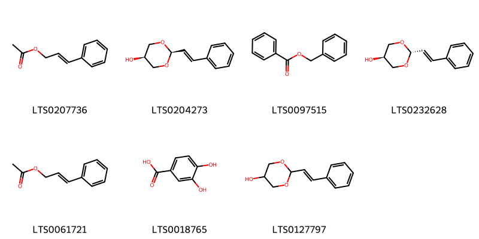
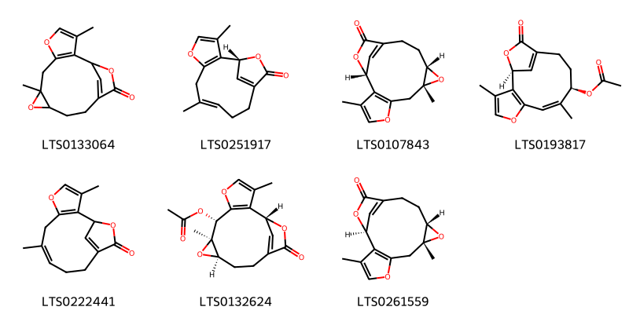
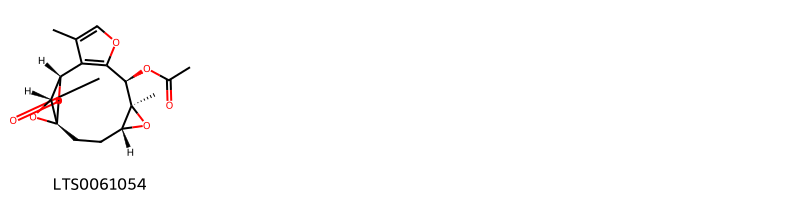
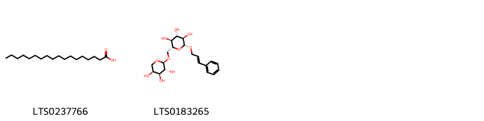
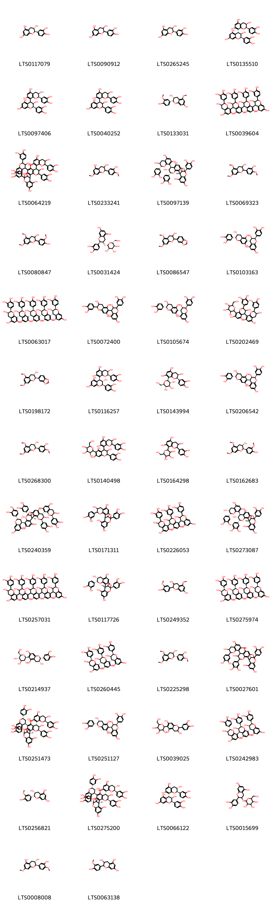
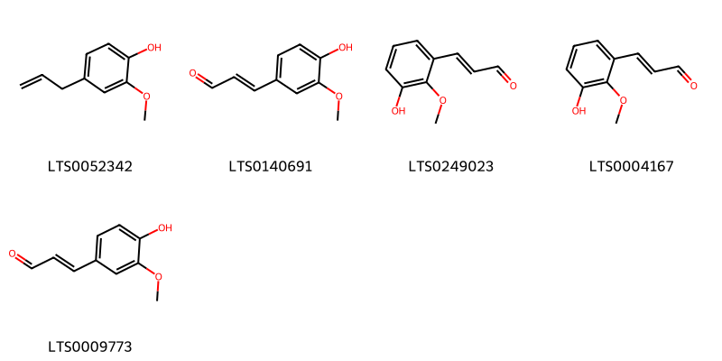
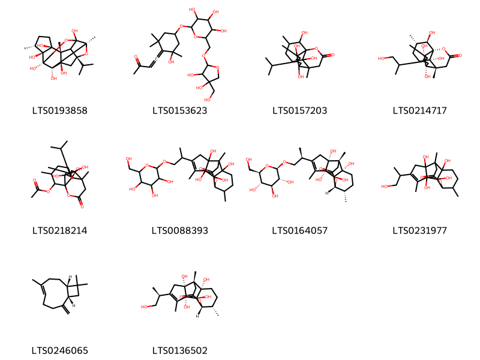

!!! abstract "Tóm tắt"
    Ramulus Cinnamomi (cành quế) thuộc họ Lauraceae (Long não), phân bố chủ yếu dọc dãy Trường Sơn từ Thanh Hóa đến Quảng Ngãi. Trong dân gian và y học cổ truyền, cành quế được dùng điều trị cảm mạo, phong hàn, đau bụng, xoa bóp giảm đau cơ và khớp. Tác dụng dược lý bao gồm kích thích tuần hoàn, tăng nhu động ruột, chống viêm, kháng khuẩn, và hỗ trợ tiêu hóa. Thành phần chính là tinh dầu (cinnamaldehyde), hợp chất phenolic, flavonoids, và coumarins, với cinnamaldehyde là biomarker quan trọng.

## Thông tin về thực vật

### Đặc điểm thực vật

Dược liệu **Quế (Cành)** từ bộ phận **nan** từ loài *Cinnamomum cassia Presl* thuộc họ Lauraceae. Quế là một cây cao từ 12-20cm. Cành mọc trong năm có 4 cạnh, dẹt, nhấn. Lá hơi hình trứng hai đầu hẹp lại, hơi nhọn, có 3 gần rất rõ chạy từ cuống đến đầu lá, mặt dưới phủ những vẩy nhỏ. Phiến lá dài 12-15cm, rộng 5cm. Cuống dài chừng 15mm. Hoa màu trắng mọc thành chùy ở kẽ lá hay đầu cành. Quả hạch hình trứng dài chừng 1cm, lúc đầu xanh lục, khi chín ngả màu nâu tím, mặt quả bóng, về phía cuống còn sót để hoa có lòng. 

!!! info "Phân loại thực vật của *N/A*"
    - **Kingdom:** Plantae
    - **Phylum:** Tracheophyta
    - **Order:** Laurales
    - **Family:** Lauraceae
    - **Genus:** N/A
    - **Species:** *N/A*

*Tài liệu tham khảo:* "Những cây thuốc và vị thuốc Việt Nam" - Đỗ Tất Lợi

 

### Loài thay thế (Nếu có)

Dược liệu này cũng có thể từ loài *Cinnamomum zeylanicum Blume*, thông tin về phân loại thực vật loài này như sau:
!!! info "Thông tin về phân loại thực vật của *Cinnamomum verum*"
    - **kingdom:** Plantae
    - **phylum:** Tracheophyta
    - **order:** Laurales
    - **family:** Lauraceae
    - **genus:** Cinnamomum
    - **species:** *Cinnamomum verum*

Hình ảnh của loài *Cinnamomum zeylanicum Blume*:

Dược liệu này cũng có thể từ loài *Cinnamomum loureirii Nees.*, thông tin về phân loại thực vật loài này như sau:
!!! info "Thông tin về phân loại thực vật của *Cinnamomum loureiroi*"
    - **kingdom:** Plantae
    - **phylum:** Tracheophyta
    - **order:** Laurales
    - **family:** Lauraceae
    - **genus:** Cinnamomum
    - **species:** *Cinnamomum loureiroi*

Hình ảnh của loài *Cinnamomum loureirii Nees.*:

### Phân bố trên thế giới
**Từ vườn thực vật KEW: **: Bản địa: Vietnam
Di thực: Không

**Từ CSDL GIBF** Australia, Spain, Puerto Rico, Chile, Bhutan, Brazil, New Zealand, Hong Kong, India, Argentina, Ethiopia, Mexico, Italy, Greece, Colombia, China, Türkiye, United Kingdom of Great Britain and Northern Ireland, Japan, South Africa, Uruguay, United States of America, Chinese Taipei, Portugal, France, Canada

### Phân bố tại Việt Nam
** "Những cây thuốc và vị thuốc Việt Nam" - Đỗ Tất Lợi**: Theo tài liệu "Những cây thuốc và vị thuốc Việt Nam" - Đỗ Tất Lợi, loại quế này mọc hoang và được trồng ở khắp vùng rừng núi của Việt Nam, nhưng chủ yếu ở dọc dãy núi Trường Sơn từ bắc Thanh Hóa, Nghệ An, Hà Tĩnh tới nam Quảng Nam, Quảng Ngãi.

**Từ CSDL GIBF**: Không có ghi nhận ở Việt Nam

---

## Thông tin về dược liệu 

### Định danh

!!! info "Thông tin về tên gọi của nan"
    - Dược liệu tiếng Việt: nan
    - Dược liệu tiếng Trung: nan (nan)
    - Dược liệu tiếng Anh: nan
    - Dược liệu latin thông dụng: nan
    - Dược liệu latin kiểu DĐVN: ramulus cinnamomi
    - Dược liệu latin kiểu DĐVN: nan
    - Dược liệu latin kiểu thông tư: nan
    - Bộ phận dùng: nan (nan)

### Mô tả dược liệu 
- **Theo dược điển Việt nam V:** nan

- **Mô tả dược liệu theo thông tư chế biến dược liệu theo phương pháp cổ truyền:** nan

### Chế biến 

- **Chế biến theo dược điển việt nam V**: nan

- **Chế biến theo thông tư:** nan

--- 

## Thành phần hóa học

- Theo tài liệu của GS. Đỗ Tất Lợi:  (1) Nhóm hóa học: Tinh dầu; Hợp chất Phenolic; Flavonoids; Coumarins
(2)- Dược điển Việt Nam: aldehyd cinnamic 
- Dược điển Hongkong: cinnamaldehyde, Cinnamic acid
    
- Theo cơ sở dữ liệu lotus: Từ loài *N/A* đã phân lập và xác định được 124 hoạt chất thuộc về các nhóm Dihydrofurans, Cinnamic acids and derivatives, Cinnamyl alcohols, Organooxygen compounds, Steroids and steroid derivatives, Fatty Acyls, Coumarins and derivatives, Neoflavonoids, Cinnamaldehydes, Furanoid lignans, Benzene and substituted derivatives, Phenols, Prenol lipids, Dioxanes, Phenylpropanoic acids, Flavonoids. 

|    | chemicalTaxonomyClassyfireClass     |   smiles_count |
|---:|:------------------------------------|---------------:|
|  0 | Benzene and substituted derivatives |              7 |
|  1 | Cinnamaldehydes                     |              7 |
|  2 | Cinnamic acids and derivatives      |              7 |
|  3 | Cinnamyl alcohols                   |              2 |
|  4 | Coumarins and derivatives           |              1 |
|  5 | Dihydrofurans                       |              7 |
|  6 | Dioxanes                            |              1 |
|  7 | Fatty Acyls                         |              2 |
|  8 | Flavonoids                          |             54 |
|  9 | Furanoid lignans                    |              2 |
| 10 | Neoflavonoids                       |              2 |
| 11 | Organooxygen compounds              |             15 |
| 12 | Phenols                             |              5 |
| 13 | Phenylpropanoic acids               |              1 |
| 14 | Prenol lipids                       |             10 |
| 15 | Steroids and steroid derivatives    |              1 |

### Nhóm Benzene and substituted derivatives
<figure markdown="span">
    { width=100% }
    <figcaption>Hình ảnh cấu trúc hóa học của 7 hoạt chất thuộc nhóm Benzene and substituted derivatives gồm ['cinnamyl acetate (LTS0207736)', '(2s,5s)-2-[(1e)-2-phenylethenyl]-1,3-dioxan-5-ol (LTS0204273)', 'benzyl benzoate (LTS0097515)', '(2r,5r)-2-[(1e)-2-phenylethenyl]-1,3-dioxan-5-ol (LTS0232628)', '3-phenyl-2-propenyl acetate (LTS0061721)', '3,4-dihydroxybenzoic acid (LTS0018765)', '2-(2-phenylethenyl)-1,3-dioxan-5-ol (LTS0127797)'].</figcaption>
</figure>
### Nhóm Cinnamaldehydes
<figure markdown="span">
    { width=100% }
    <figcaption>Hình ảnh cấu trúc hóa học của 7 hoạt chất thuộc nhóm Cinnamaldehydes gồm ['3-(2-hydroxyphenyl)prop-2-enal (LTS0196582)', '3-phenyl-2-propenal (LTS0204346)', '(2e)-3-(2-hydroxyphenyl)prop-2-enal (LTS0196725)', '(z)-3-phenyl-2-propenal (LTS0238808)', '2-methoxycinnamaldehyde (LTS0195380)', '3-(2-methoxyphenyl)prop-2-enal (LTS0007230)', 'cinnamal (LTS0271313)'].</figcaption>
</figure>
### Nhóm Cinnamic acids and derivatives
<figure markdown="span">
    { width=100% }
    <figcaption>Hình ảnh cấu trúc hóa học của 7 hoạt chất thuộc nhóm Cinnamic acids and derivatives gồm ['cinnamic acid (LTS0128130)', 'trans-2-hydroxycinnamic acid (LTS0142397)', 'phenylacrylic acid (LTS0097258)', '3-(2-methoxyphenyl)prop-2-enoic acid (LTS0095780)', 'o-coumaric acid (LTS0065925)', '(2s,3r,4s,5s,6r)-3,4,5-trihydroxy-6-({[(2s,3r,4s,5s)-3,4,5-trihydroxyoxan-2-yl]oxy}methyl)oxan-2-yl (2e)-3-phenylprop-2-enoate (LTS0004266)', '3,4,5-trihydroxy-6-{[(3,4,5-trihydroxyoxan-2-yl)oxy]methyl}oxan-2-yl 3-phenylprop-2-enoate (LTS0266014)'].</figcaption>
</figure>
### Nhóm Cinnamyl alcohols
<figure markdown="span">
    { width=100% }
    <figcaption>Hình ảnh cấu trúc hóa học của 2 hoạt chất thuộc nhóm Cinnamyl alcohols gồm ['3-phenyl-2-propen-1-ol (LTS0069711)', 'cinnamyl alcohol (LTS0010678)'].</figcaption>
</figure>
### Nhóm Coumarins and derivatives
<figure markdown="span">
    { width=100% }
    <figcaption>Hình ảnh cấu trúc hóa học của 1 hoạt chất thuộc nhóm Coumarins and derivatives gồm ['2h-1-benzopyran-2-one (LTS0069773)'].</figcaption>
</figure>
### Nhóm Dihydrofurans
<figure markdown="span">
    { width=100% }
    <figcaption>Hình ảnh cấu trúc hóa học của 7 hoạt chất thuộc nhóm Dihydrofurans gồm ['3,8-dimethyl-5,9,15-trioxatetracyclo[11.2.1.0²,⁶.0⁸,¹⁰]hexadeca-2(6),3,13(16)-trien-14-one (LTS0133064)', 'linderalactone (LTS0251917)', '(1r,8r,10s)-3,8-dimethyl-5,9,15-trioxatetracyclo[11.2.1.0²,⁶.0⁸,¹⁰]hexadeca-2(6),3,13(16)-trien-14-one (LTS0107843)', '(1s,7z,9r)-3,8-dimethyl-13-oxo-5,14-dioxatricyclo[10.2.1.0²,⁶]pentadeca-2(6),3,7,12(15)-tetraen-9-yl acetate (LTS0193817)', '3,8-dimethyl-5,14-dioxatricyclo[10.2.1.0²,⁶]pentadeca-2(6),3,8,12(15)-tetraen-13-one (LTS0222441)', '(1r,7r,8r,10r)-3,8-dimethyl-14-oxo-5,9,15-trioxatetracyclo[11.2.1.0²,⁶.0⁸,¹⁰]hexadeca-2(6),3,13(16)-trien-7-yl acetate (LTS0132624)', '(1s,8r,10s)-3,8-dimethyl-5,9,15-trioxatetracyclo[11.2.1.0²,⁶.0⁸,¹⁰]hexadeca-2(6),3,13(16)-trien-14-one (LTS0261559)'].</figcaption>
</figure>
### Nhóm Dioxanes
<figure markdown="span">
    { width=100% }
    <figcaption>Hình ảnh cấu trúc hóa học của 1 hoạt chất thuộc nhóm Dioxanes gồm ['(1r,4r,6s,7r,13s,14r)-6,11-dimethyl-16-oxo-5,9,15,17-tetraoxapentacyclo[11.2.2.0¹,¹⁴.0⁴,⁶.0⁸,¹²]heptadeca-8(12),10-dien-7-yl acetate (LTS0061054)'].</figcaption>
</figure>
### Nhóm Fatty Acyls
<figure markdown="span">
    { width=100% }
    <figcaption>Hình ảnh cấu trúc hóa học của 2 hoạt chất thuộc nhóm Fatty Acyls gồm ['stearic acid (LTS0237766)', 'rosavin (LTS0183265)'].</figcaption>
</figure>
### Nhóm Flavonoids
<figure markdown="span">
    { width=100% }
    <figcaption>Hình ảnh cấu trúc hóa học của 54 hoạt chất thuộc nhóm Flavonoids gồm ['(+)-catechol (LTS0117079)', 'catechol (LTS0090912)', 'ent-epicatechin (LTS0265245)', '(2r,3r,4r)-2-(3,4-dihydroxyphenyl)-4-[(2r,3r)-2-(3,4-dihydroxyphenyl)-3,5,7-trihydroxy-3,4-dihydro-2h-1-benzopyran-8-yl]-3,4-dihydro-2h-1-benzopyran-3,5,7-triol (LTS0135510)', '(2r,3r)-2-(3,4-dihydroxyphenyl)-4-[(2r,3r)-2-(3,4-dihydroxyphenyl)-3,5,7-trihydroxy-3,4-dihydro-2h-1-benzopyran-8-yl]-3,4-dihydro-2h-1-benzopyran-3,5,7-triol (LTS0097406)', '2-(3,4-dihydroxyphenyl)-4-[2-(3,4-dihydroxyphenyl)-3,5,7-trihydroxy-3,4-dihydro-2h-1-benzopyran-8-yl]-3,4-dihydro-2h-1-benzopyran-3,5,7-triol (LTS0040252)', '(2r,3r)-2-(4-hydroxy-3-methoxyphenyl)-5-methoxy-3,4-dihydro-2h-1-benzopyran-3,7-diol (LTS0133031)', '2-(3,4-dihydroxyphenyl)-8-[2-(3,4-dihydroxyphenyl)-3,5,7-trihydroxy-3,4-dihydro-2h-1-benzopyran-4-yl]-4-[2-(3,4-dihydroxyphenyl)-4-[2-(3,4-dihydroxyphenyl)-3,5,7-trihydroxy-3,4-dihydro-2h-1-benzopyran-8-yl]-3,5,7-trihydroxy-3,4-dihydro-2h-1-benzopyran-8-yl]-3,4-dihydro-2h-1-benzopyran-3,5,7-triol (LTS0039604)', '5,13-bis(3,4-dihydroxyphenyl)-10-[2-(3,4-dihydroxyphenyl)-3,5,7-trihydroxy-3,4-dihydro-2h-1-benzopyran-4-yl]-7-[2-(3,4-dihydroxyphenyl)-3,5,7-trihydroxy-3,4-dihydro-2h-1-benzopyran-8-yl]-4,12,14-trioxapentacyclo[11.7.1.0²,¹¹.0³,⁸.0¹⁵,²⁰]henicosa-2(11),3(8),9,15,17,19-hexaene-6,9,17,19,21-pentol (LTS0064219)', '2-(3-hydroxy-4-methoxyphenyl)-7-methoxy-3,4-dihydro-2h-1-benzopyran-3,5-diol (LTS0233241)', 'cinnamtannin d-1 (LTS0097139)', '2-(3-hydroxy-4-methoxyphenyl)-5,7-dimethoxy-3,4-dihydro-2h-1-benzopyran-3-ol (LTS0069323)', '2-(4-hydroxy-3-methoxyphenyl)-5,7-dimethoxy-3,4-dihydro-2h-1-benzopyran-3-ol (LTS0080847)', '(2r,3r,4s,5s,6r)-2-{[(2r,3r)-2-(3,4-dihydroxyphenyl)-5,7-dihydroxy-3,4-dihydro-2h-1-benzopyran-3-yl]oxy}-6-(hydroxymethyl)oxane-3,4,5-triol (LTS0031424)', '2-(2h-1,3-benzodioxol-5-yl)-5,7-dimethoxy-3,4-dihydro-2h-1-benzopyran-3-ol (LTS0086547)', '(2r,3r,4s)-2-(3,4-dihydroxyphenyl)-4-[(2r,3r)-2-(3,4-dihydroxyphenyl)-3,5,7-trihydroxy-3,4-dihydro-2h-1-benzopyran-6-yl]-3,4-dihydro-2h-1-benzopyran-3,5,7-triol (LTS0103163)', '(2r,3r,4r)-2-(3,4-dihydroxyphenyl)-8-[(2r,3r,4r)-2-(3,4-dihydroxyphenyl)-3,5,7-trihydroxy-3,4-dihydro-2h-1-benzopyran-4-yl]-4-[(2r,3r,4r)-2-(3,4-dihydroxyphenyl)-4-[(2r,3r,4s)-2-(3,4-dihydroxyphenyl)-4-[(2r,3r)-2-(3,4-dihydroxyphenyl)-3,5,7-trihydroxy-3,4-dihydro-2h-1-benzopyran-8-yl]-3,5,7-trihydroxy-3,4-dihydro-2h-1-benzopyran-8-yl]-3,5,7-trihydroxy-3,4-dihydro-2h-1-benzopyran-8-yl]-3,4-dihydro-2h-1-benzopyran-3,5,7-triol (LTS0063017)', '2-(3,4-dihydroxyphenyl)-4-[2-(3,4-dihydroxyphenyl)-3,5,7-trihydroxy-3,4-dihydro-2h-1-benzopyran-6-yl]-3,4-dihydro-2h-1-benzopyran-3,5,7-triol (LTS0072400)', '(2r,3r,4s)-2-(3,4-dihydroxyphenyl)-4-[(2r,3s)-2-(3,4-dihydroxyphenyl)-3,5,7-trihydroxy-3,4-dihydro-2h-1-benzopyran-6-yl]-3,4-dihydro-2h-1-benzopyran-3,5,7-triol (LTS0105674)', '2-(3,4-dihydroxyphenyl)-4-[2-(3,4-dihydroxyphenyl)-3,5,7-trihydroxy-3,4-dihydro-2h-1-benzopyran-8-yl]-8-[3,4,5-trihydroxy-6-(hydroxymethyl)oxan-2-yl]-3,4-dihydro-2h-1-benzopyran-3,5,7-triol (LTS0202469)', '(2r,3s)-2-(2h-1,3-benzodioxol-5-yl)-5,7-dimethoxy-3,4-dihydro-2h-1-benzopyran-3-ol (LTS0198172)', '(2r,3s,4s)-2-(3,4-dihydroxyphenyl)-4-[(2r,3r)-2-(3,4-dihydroxyphenyl)-3,5,7-trihydroxy-3,4-dihydro-2h-1-benzopyran-8-yl]-3,4-dihydro-2h-1-benzopyran-3,5,7-triol (LTS0116257)', '(2r,3r)-2-(3,4-dihydroxyphenyl)-8-[(2s,3r,4r,5s,6r)-3,4,5-trihydroxy-6-(hydroxymethyl)oxan-2-yl]-3,4-dihydro-2h-1-benzopyran-3,5,7-triol (LTS0143994)', '(2r,3r,4r)-2-(3,4-dihydroxyphenyl)-4-[(2r,3s)-2-(3,4-dihydroxyphenyl)-3,5,7-trihydroxy-3,4-dihydro-2h-1-benzopyran-6-yl]-3,4-dihydro-2h-1-benzopyran-3,5,7-triol (LTS0206542)', '(2r,3s)-2-(3-hydroxy-4-methoxyphenyl)-5,7-dimethoxy-3,4-dihydro-2h-1-benzopyran-3-ol (LTS0268300)', '2-(3,4-dihydroxyphenyl)-4-[2-(3,4-dihydroxyphenyl)-3,5,7-trihydroxy-3,4-dihydro-2h-1-benzopyran-8-yl]-6-[3,4,5-trihydroxy-6-(hydroxymethyl)oxan-2-yl]-3,4-dihydro-2h-1-benzopyran-3,5,7-triol (LTS0140498)', '2-(3,4-dihydroxyphenyl)-8-[3,4,5-trihydroxy-6-(hydroxymethyl)oxan-2-yl]-3,4-dihydro-2h-1-benzopyran-3,5,7-triol (LTS0164298)', '(2r,3r)-2-(4-hydroxy-3-methoxyphenyl)-5,7-dimethoxy-3,4-dihydro-2h-1-benzopyran-3-ol (LTS0162683)', 'cinnamtannin b2 (LTS0240359)', 'procyanidin a1 (LTS0171311)', 'procyanidin c2 (LTS0226053)', 'cinnamtannin b1 (LTS0273087)', '2-(3,4-dihydroxyphenyl)-8-[2-(3,4-dihydroxyphenyl)-3,5,7-trihydroxy-3,4-dihydro-2h-1-benzopyran-4-yl]-4-[2-(3,4-dihydroxyphenyl)-4-[2-(3,4-dihydroxyphenyl)-4-[2-(3,4-dihydroxyphenyl)-3,5,7-trihydroxy-3,4-dihydro-2h-1-benzopyran-8-yl]-3,5,7-trihydroxy-3,4-dihydro-2h-1-benzopyran-8-yl]-3,5,7-trihydroxy-3,4-dihydro-2h-1-benzopyran-8-yl]-3,4-dihydro-2h-1-benzopyran-3,5,7-triol (LTS0257031)', 'proanthocyanidin a2 (LTS0117726)', '2-(4-hydroxy-3-methoxyphenyl)-5-methoxy-3,4-dihydro-2h-1-benzopyran-3,7-diol (LTS0249352)', '(2r,3r,4r)-2-(3,4-dihydroxyphenyl)-8-[(2r,3r,4r)-2-(3,4-dihydroxyphenyl)-3,5,7-trihydroxy-3,4-dihydro-2h-1-benzopyran-4-yl]-4-[(2r,3r,4s)-2-(3,4-dihydroxyphenyl)-4-[(2r,3r)-2-(3,4-dihydroxyphenyl)-3,5,7-trihydroxy-3,4-dihydro-2h-1-benzopyran-8-yl]-3,5,7-trihydroxy-3,4-dihydro-2h-1-benzopyran-8-yl]-3,4-dihydro-2h-1-benzopyran-3,5,7-triol (LTS0275974)', '(2r,3r)-2-(3,4-dihydroxyphenyl)-6-[(2s,3r,4r,5s,6r)-3,4,5-trihydroxy-6-(hydroxymethyl)oxan-2-yl]-3,4-dihydro-2h-1-benzopyran-3,5,7-triol (LTS0214937)', 'procyanidin c1 (LTS0260445)', '(2s,3r)-2-(3-hydroxy-4-methoxyphenyl)-5,7-dimethoxy-3,4-dihydro-2h-1-benzopyran-3-ol (LTS0225298)', '5,13-bis(3,4-dihydroxyphenyl)-7-[2-(3,4-dihydroxyphenyl)-3,5,7-trihydroxy-3,4-dihydro-2h-1-benzopyran-8-yl]-4,12,14-trioxapentacyclo[11.7.1.0²,¹¹.0³,⁸.0¹⁵,²⁰]henicosa-2,8,10,15,17,19-hexaene-6,9,17,19,21-pentol (LTS0027601)', 'parameritannin a-1 (LTS0251473)', '(2r,3r,4r)-2-(3,4-dihydroxyphenyl)-4-[(2r,3r)-2-(3,4-dihydroxyphenyl)-3,5,7-trihydroxy-3,4-dihydro-2h-1-benzopyran-6-yl]-3,4-dihydro-2h-1-benzopyran-3,5,7-triol (LTS0251127)', '2-(3,4-dihydroxyphenyl)-6-[3,4,5-trihydroxy-6-(hydroxymethyl)oxan-2-yl]-3,4-dihydro-2h-1-benzopyran-3,5,7-triol (LTS0039025)', '(2r,3r,4r)-2-(3,4-dihydroxyphenyl)-8-[(2r,3r,4r)-2-(3,4-dihydroxyphenyl)-3,5,7-trihydroxy-3,4-dihydro-2h-1-benzopyran-4-yl]-4-[(2s,3r)-2-(3,4-dihydroxyphenyl)-3,5,7-trihydroxy-3,4-dihydro-2h-1-benzopyran-8-yl]-3,4-dihydro-2h-1-benzopyran-3,5,7-triol (LTS0242983)', 'symplocosidin (LTS0256821)', 'cassiatannin a (LTS0275200)', '(2r,3r,4r)-2-(3,4-dihydroxyphenyl)-4-[(2r,3s)-2-(3,4-dihydroxyphenyl)-3,5,7-trihydroxy-3,4-dihydro-2h-1-benzopyran-8-yl]-3,4-dihydro-2h-1-benzopyran-3,5,7-triol (LTS0066122)', '2-{[2-(3,4-dihydroxyphenyl)-5,7-dihydroxy-3,4-dihydro-2h-1-benzopyran-3-yl]oxy}-6-(hydroxymethyl)oxane-3,4,5-triol (LTS0015699)', "catechin 7,4'-dimethyl ether (LTS0008008)", '2-(4-hydroxy-3-methoxyphenyl)-3,4-dihydro-2h-1-benzopyran-3,5,7-triol (LTS0063138)', '2-(3-hydroxy-4-methoxyphenyl)-3,4-dihydro-2h-1-benzopyran-3,5,7-triol (LTS0121270)', "catechin 4'-methyl ether (LTS0018707)", '(2r,3r,4s)-2-(3,4-dihydroxyphenyl)-4-[(2r,3r)-2-(3,4-dihydroxyphenyl)-3,5,7-trihydroxy-3,4-dihydro-2h-1-benzopyran-8-yl]-8-[(2s,3r,4r,5s,6r)-3,4,5-trihydroxy-6-(hydroxymethyl)oxan-2-yl]-3,4-dihydro-2h-1-benzopyran-3,5,7-triol (LTS0004781)', '(2r,3r,4r)-2-(3,4-dihydroxyphenyl)-4-[(2r,3r)-2-(3,4-dihydroxyphenyl)-3,5,7-trihydroxy-3,4-dihydro-2h-1-benzopyran-8-yl]-6-[(2s,3r,4r,5s,6r)-3,4,5-trihydroxy-6-(hydroxymethyl)oxan-2-yl]-3,4-dihydro-2h-1-benzopyran-3,5,7-triol (LTS0254947)'].</figcaption>
</figure>
### Nhóm Furanoid lignans
<figure markdown="span">
    { width=100% }
    <figcaption>Hình ảnh cấu trúc hóa học của 2 hoạt chất thuộc nhóm Furanoid lignans gồm ['syringaresinol (LTS0116280)', '(+)-syringaresinol (LTS0158868)'].</figcaption>
</figure>
### Nhóm Neoflavonoids
<figure markdown="span">
    { width=100% }
    <figcaption>Hình ảnh cấu trúc hóa học của 2 hoạt chất thuộc nhóm Neoflavonoids gồm ['2-{[6-hydroxy-4-(4-hydroxy-3,5-dimethoxyphenyl)-2-(hydroxymethyl)-5,7-dimethoxy-3,4-dihydro-2h-1-benzopyran-3-yl]methoxy}-6-(hydroxymethyl)oxane-3,4,5-triol (LTS0113220)', '(2r,3r,4s,5s,6r)-2-{[(2r,3s,4s)-6-hydroxy-4-(4-hydroxy-3,5-dimethoxyphenyl)-2-(hydroxymethyl)-5,7-dimethoxy-3,4-dihydro-2h-1-benzopyran-3-yl]methoxy}-6-(hydroxymethyl)oxane-3,4,5-triol (LTS0108470)'].</figcaption>
</figure>
### Nhóm Organooxygen compounds
<figure markdown="span">
    { width=100% }
    <figcaption>Hình ảnh cấu trúc hóa học của 15 hoạt chất thuộc nhóm Organooxygen compounds gồm ['3-(2-{[(2s,3r,4s,5s,6r)-3,4,5-trihydroxy-6-(hydroxymethyl)oxan-2-yl]oxy}phenyl)propanoic acid (LTS0136515)', '(2r,3s,4s,5r,6s)-2-({[(2r,3r,4r)-3,4-dihydroxy-4-(hydroxymethyl)oxolan-2-yl]oxy}methyl)-6-(3,4,5-trimethoxyphenoxy)oxane-3,4,5-triol (LTS0127559)', '(2r,3r,4r,5s,6r)-5-{[(2s,3r,4r)-3,4-dihydroxy-4-(hydroxymethyl)oxolan-2-yl]oxy}-6-(hydroxymethyl)-2-(2-phenylethoxy)oxane-3,4-diol (LTS0169640)', '1,4,4-trimethyltricyclo[5.3.1.0²,⁶]undecan-11-ol (LTS0148379)', '(2s,3r,4s,5s,6r)-3,4,5-trihydroxy-6-(hydroxymethyl)oxan-2-yl 3-(2-hydroxyphenyl)propanoate (LTS0153346)', 'methyl 3-(2-{[3,4,5-trihydroxy-6-(hydroxymethyl)oxan-2-yl]oxy}phenyl)propanoate (LTS0148798)', '3,4,5-trihydroxy-6-(hydroxymethyl)oxan-2-yl 3-(2-hydroxyphenyl)propanoate (LTS0246040)', '2-[(5-{[2-(benzyloxy)-6-({[3,4-dihydroxy-4-(hydroxymethyl)oxolan-2-yl]oxy}methyl)-4,5-dihydroxyoxan-3-yl]oxy}-3,4-dihydroxy-6-[2-(3-hydroxyprop-1-en-1-yl)phenoxy]oxan-2-yl)methoxy]-6-methyloxane-3,4,5-triol (LTS0210339)', 'methyl 3-(2-{[(2s,3r,4s,5s,6r)-3,4,5-trihydroxy-6-(hydroxymethyl)oxan-2-yl]oxy}phenyl)propanoate (LTS0218623)', '(2r,3r,4r,5r,6s)-2-{[(2r,3s,4s,5r,6s)-5-{[(2s,3s,4r,5r,6s)-2-(benzyloxy)-6-({[(2r,3r,4r)-3,4-dihydroxy-4-(hydroxymethyl)oxolan-2-yl]oxy}methyl)-4,5-dihydroxyoxan-3-yl]oxy}-3,4-dihydroxy-6-{2-[(1e)-3-hydroxyprop-1-en-1-yl]phenoxy}oxan-2-yl]methoxy}-6-methyloxane-3,4,5-triol (LTS0227461)', '3-[(1e)-4-hydroxy-3-(hydroxymethyl)but-1-en-1-yl]-2,4-dimethyl-4-({[3,4,5-trihydroxy-6-(hydroxymethyl)oxan-2-yl]oxy}methyl)cyclohex-2-en-1-one (LTS0062579)', '2-({[3,4-dihydroxy-4-(hydroxymethyl)oxolan-2-yl]oxy}methyl)-6-(3,4,5-trimethoxyphenoxy)oxane-3,4,5-triol (LTS0016161)', '5-{[3,4-dihydroxy-4-(hydroxymethyl)oxolan-2-yl]oxy}-6-(hydroxymethyl)-2-(2-phenylethoxy)oxane-3,4-diol (LTS0244971)', '(2r,3r,4r,5r,6s)-2-{[(2r,3s,4s,5r,6s)-5-{[(2r,3r,4s,5s,6r)-2-(benzyloxy)-6-({[(2r,3r,4r)-3,4-dihydroxy-4-(hydroxymethyl)oxolan-2-yl]oxy}methyl)-4,5-dihydroxyoxan-3-yl]oxy}-3,4-dihydroxy-6-{2-[(1e)-3-hydroxyprop-1-en-1-yl]phenoxy}oxan-2-yl]methoxy}-6-methyloxane-3,4,5-triol (LTS0030847)', '3-(2-{[3,4,5-trihydroxy-6-(hydroxymethyl)oxan-2-yl]oxy}phenyl)propanoic acid (LTS0130065)'].</figcaption>
</figure>
### Nhóm Phenols
<figure markdown="span">
    { width=100% }
    <figcaption>Hình ảnh cấu trúc hóa học của 5 hoạt chất thuộc nhóm Phenols gồm ['eugenol (LTS0052342)', 'coniferyl aldehyde (LTS0140691)', '3-(3-hydroxy-2-methoxyphenyl)prop-2-enal (LTS0249023)', '(2e)-3-(3-hydroxy-2-methoxyphenyl)prop-2-enal (LTS0004167)', 'coniferaldehyde (LTS0009773)'].</figcaption>
</figure>
### Nhóm Phenylpropanoic acids
<figure markdown="span">
    { width=100% }
    <figcaption>Hình ảnh cấu trúc hóa học của 1 hoạt chất thuộc nhóm Phenylpropanoic acids gồm ['melilotic acid (LTS0176151)'].</figcaption>
</figure>
### Nhóm Prenol lipids
<figure markdown="span">
    { width=100% }
    <figcaption>Hình ảnh cấu trúc hóa học của 10 hoạt chất thuộc nhóm Prenol lipids gồm ['cinncassiol e (LTS0193858)', '4-(4-{[6-({[3,4-dihydroxy-4-(hydroxymethyl)oxolan-2-yl]oxy}methyl)-3,4,5-trihydroxyoxan-2-yl]oxy}-2-hydroxy-2,6,6-trimethylcyclohexylidene)but-3-en-2-one (LTS0153623)', '2,6,8,12-tetrahydroxy-4-isopropyl-3,7,11-trimethyl-13-oxatetracyclo[5.5.3.0¹,⁸.0²,⁶]pentadec-3-en-14-one (LTS0157203)', 'cinncassiol a (LTS0214717)', '2,6,8-trihydroxy-4-isopropyl-3,7,11-trimethyl-14-oxo-13-oxatetracyclo[5.5.3.0¹,⁸.0²,⁶]pentadec-3-en-12-yl acetate (LTS0218214)', '9,10,11,15-tetrahydroxy-1,6,12-trimethyl-13-(1-{[3,4,5-trihydroxy-6-(hydroxymethyl)oxan-2-yl]oxy}propan-2-yl)-4-oxatetracyclo[7.6.0.0⁵,¹⁰.0¹¹,¹⁵]pentadec-12-en-3-one (LTS0088393)', '(1r,5r,6s,9s,10r,11r,15r)-9,10,11,15-tetrahydroxy-1,6,12-trimethyl-13-[(2s)-1-{[(2r,3r,4s,5s,6r)-3,4,5-trihydroxy-6-(hydroxymethyl)oxan-2-yl]oxy}propan-2-yl]-4-oxatetracyclo[7.6.0.0⁵,¹⁰.0¹¹,¹⁵]pentadec-12-en-3-one (LTS0164057)', '9,10,11,15-tetrahydroxy-13-(1-hydroxypropan-2-yl)-1,6,12-trimethyl-4-oxatetracyclo[7.6.0.0⁵,¹⁰.0¹¹,¹⁵]pentadec-12-en-3-one (LTS0231977)', '(1s,4e,9s)-4,11,11-trimethyl-8-methylidenebicyclo[7.2.0]undec-4-ene (LTS0246065)', '(1r,5r,6s,9s,10r,11r,15r)-9,10,11,15-tetrahydroxy-13-[(2s)-1-hydroxypropan-2-yl]-1,6,12-trimethyl-4-oxatetracyclo[7.6.0.0⁵,¹⁰.0¹¹,¹⁵]pentadec-12-en-3-one (LTS0136502)'].</figcaption>
</figure>
### Nhóm Steroids and steroid derivatives
<figure markdown="span">
    { width=100% }
    <figcaption>Hình ảnh cấu trúc hóa học của 1 hoạt chất thuộc nhóm Steroids and steroid derivatives gồm ['stigmast-5-en-3-ol, (3β)- (LTS0204616)'].</figcaption>
</figure>

---

## Tác dụng dược lý

Theo tài liệu "Những cây thuốc và vị thuốc Việt Nam" - Đỗ Tất Lợi:- Kích thích làm cho sự tuần hoàn mau lên (huyết dược lưu thông), hô hấp cũng mạnh lên. 
- Gây co mạch. Sự bài tiết cũng được tăng lên. 
- Gây co bóp tử cung và tăng nhu động ruột. Tinh dầu có chất sát trùng mạnh.
- Chữa cả đau mắt, họ hen, bởi bổ cho phụ nữ sau sinh nở, bệnh đau bụng đi tả nguy hiểm đến tính mệnh.
- Chữa đau đầu và đau dạ dày
- Hỗ trợ kinh nguyệt
- Kháng khuẩn và sát trùng
- Chống viêm và giảm đau
- Chống ung thư
- Hạ sốt
- Kích thích tiêu hóa và lợi tiểu
- Điều trị các bệnh hô hấp
- Tăng cường sinh lực

Theo tài liệu quốc tế: nan

---

## Dược điển Việt Nam V

### Soi bột:
nan
<!-- Hình ảnh soi bột sẽ được tự động chèn vào đây sau -->
### Vi phẫu:
nan
<!-- Hình ảnh vi phẫu sẽ được tự động chèn vào đây sau -->
### Định tính

nan

### Định lượng

nan

### Thông tin khác 
- ** Độ ẩm: ** nan

- ** Bảo quản:** nan
## Dược điển Hồng kong

<!-- PDF sẽ được tự động chèn vào đây sau -->

---

## Y dược học cổ truyền

- **Tên vị thuốc:** nan
- **Tính vị quy kinh:** Tân, cam, ôn. Vào kinh phế, tâm, bàng quang.
- **Công năng chủ trị:** Giải biểu hàn, thông dương khí, ôn thông kinh mạch, hóa khí. Chủ trị: Cảm mạo phong hàn, khí huyết ứ trệ, phù, đái không thông lợi.
- **Chú ý:** nan
- **Kiêng kỵ:** nan

