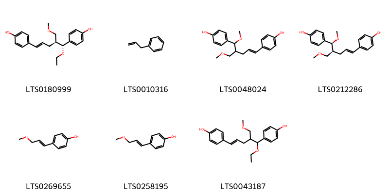
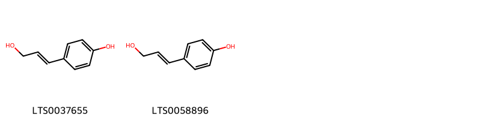
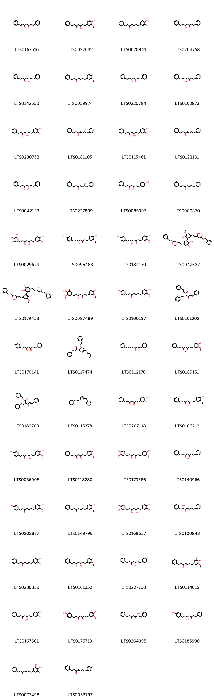
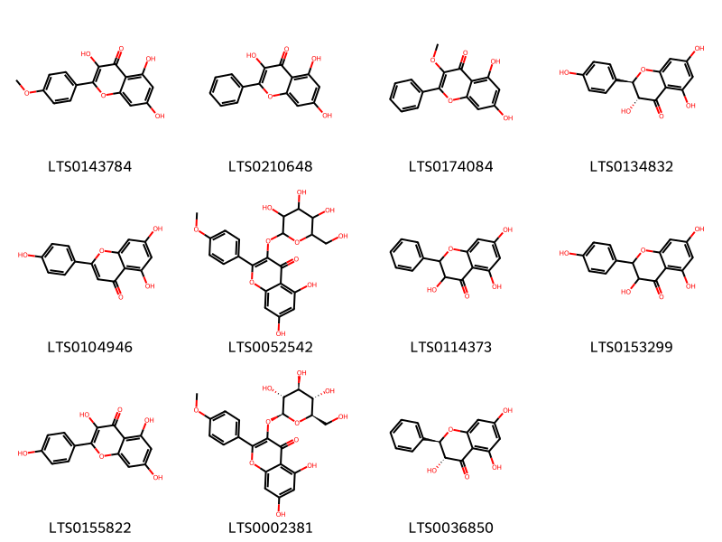
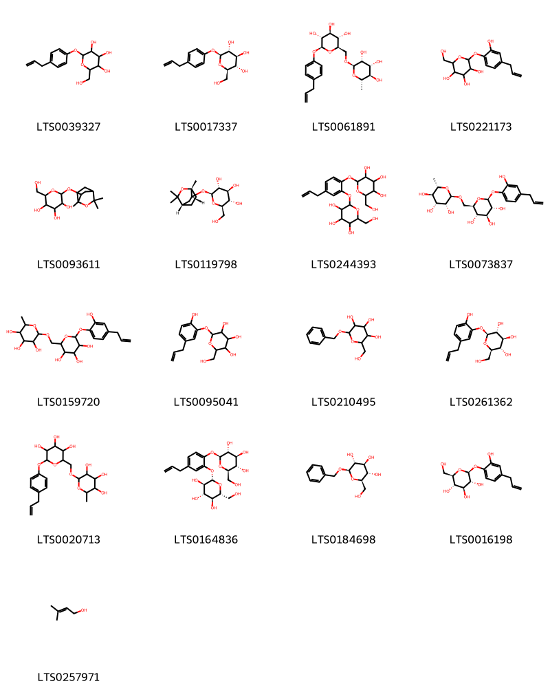
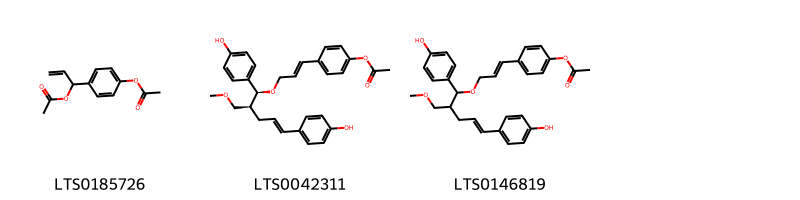
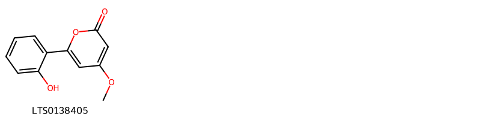

!!! abstract "Tóm tắt"
    - Cây Riềng có tên khoa học là Alpinia officinarum thuộc họ Gừng (Zingiberaceae).
- Phân bố: Cây riềng được trồng rộng rãi ở các nước Đông Nam Á, bao gồm cả Việt Nam. Cây thường được trồng ở vườn nhà, các vùng đất ẩm và có khí hậu nhiệt đới.
- Thành phần hóa học: 
 +  Tinh dầu: Chứa cineol, methyl cinnamat, galangol,... có tác dụng kháng khuẩn, giảm đau, chống viêm.
 + Flavonoid: Chứa galangin, kaempferol,... có tác dụng chống oxy hóa, bảo vệ tế bào, giảm viêm.
 + Diarylheptanoid: Có tác dụng chống viêm, giảm đau, bảo vệ gan.
- Tác dụng dược lý:
  + Kích thích tiêu hóa: Giúp tăng tiết dịch vị, tăng cường nhu động ruột.
  + Chống viêm, giảm đau: Giảm đau nhức xương khớp, giảm đau bụng kinh.
  + Kháng khuẩn, chống nấm: Giúp điều trị các bệnh ngoài da như mụn nhọt, ngứa.
  + Chống oxy hóa: Bảo vệ tế bào, ngăn ngừa lão hóa.
  + Bảo vệ gan: Giảm tổn thương gan.
- Kinh nghiệm sử dụng dân gian và y học cổ truyền
  + Điều trị các bệnh về đường tiêu hóa: Đầy hơi, chướng bụng, khó tiêu.
  + Giảm đau nhức xương khớp: Viêm khớp, đau lưng.
  + Hỗ trợ điều trị cảm cúm: Giảm sốt, long đờm.
  + Chữa các bệnh ngoài da: Mụn nhọt, ngứa.

## Thông tin về thực vật

### Đặc điểm thực vật

Dược liệu **Riềng (Thân Rễ)** từ bộ phận **** từ loài *Alpinia officinarum Hance* thuộc họ Zingiberaceae. - Cây cỏ, nhỏ, cao 0.7 - 1.2m.
- Thân rễ mọc bò ngang, dài 12 - 18mm, màu đỏ nâu, phủ nhiều vẩy, chia thành nhiều đốt không đều nhau, màu trắng nhạt.
- Lá không có cuống, có bẹ, hình mác dài, nhẵn, dài 22 - 40cm, rộng 24mm.
- Cụm hoa hình chùy, mọc ở đầu cành, có lông măng dài chừng 10cm. 
- Hoa rất sít nhau, mặt trong màu trắng, mép hơi mỏng, kèm 2 lá bắc hình mo, một có màu xanh, một có mà trắng.
- Tràng hình ống, có 3 thùy tù, hình thon, dài từ 15 - 20mm, rộng từ 4 - 5mm, thùy giữa chỉ hơi lớn hơn các thùy khác; cánh môi hình trứng, dài 20mm, rộng 15 - 18mm, màu trắng, có vạch màu đỏ sim.
- Quả hình cầu, có lông.
- Hạt có áo hạt. 

!!! info "Phân loại thực vật của *Alpinia officinarum*"
    - **Kingdom:** Plantae
    - **Phylum:** Tracheophyta
    - **Order:** Zingiberales
    - **Family:** Zingiberaceae
    - **Genus:** Alpinia
    - **Species:** *Alpinia officinarum*

*Tài liệu tham khảo:* "Những cây thuốc và vị thuốc Việt Nam" - Đỗ Tất Lợi

 

### Loài thay thế (Nếu có)

### Phân bố trên thế giới
**Từ vườn thực vật KEW: **: Cambodia, China Southeast, Hainan, Myanmar

**Từ CSDL GIBF** nan, Iran (Islamic Republic of), Viet Nam, China, Hong Kong, Norway, Myanmar, United States of America, unknown or invalid, India, Sri Lanka

### Phân bố tại Việt Nam
** "Những cây thuốc và vị thuốc Việt Nam" - Đỗ Tất Lợi**: Cây Riềng mọc hoang và được trồng ở khắp Việt Nam.

**Từ CSDL GIBF**: Hải Phòng

---

## Thông tin về dược liệu 

### Định danh

!!! info "Thông tin về tên gọi của riềng"
    - Dược liệu tiếng Việt: riềng
    - Dược liệu tiếng Trung: 高粱姜 (Gao Liang Jiang)
    - Dược liệu tiếng Anh: Lesser Galangal Rhizome
    - Dược liệu latin thông dụng: Rhizoma Alpiniae officinari
    - Dược liệu latin kiểu DĐVN: rhizoma alpiniae officinari
    - Dược liệu latin kiểu DĐVN: 
    - Dược liệu latin kiểu thông tư: 
    - Bộ phận dùng:  (Rhizoma)

### Mô tả dược liệu 
- **Theo dược điển Việt nam V:** Thân rễ hình trụ, thường cong và phân nhánh nhiều, dài 5 cm đến 9 em hoặc hơn, đường kính 2 cm đến 4 cm. Mặt ngoài màu nâu đỏ đến nâu sẫm, có nhiều nếp nhăn dọc và những mấu vòng màu xám; mỗi mấu dài 0,2 cm đến 1 cm, mang vết tích của rễ con. Thể chất dai, chắc, khó bẻ gẫy. Mặt gẫy màu vàng xám hay nâu đỏ. Vùng trụ chiếm 1/3 mặt cắt của thân rễ. Mùi thơm, vị hăng, cay.

- **Mô tả dược liệu theo thông tư chế biến dược liệu theo phương pháp cổ truyền:** 

### Chế biến 

- **Chế biến theo dược điển việt nam V**: Thu hoạch vào cuối mùa hạ, đầu mùa thu, loại bỏ các rễ sợi và các bè vảy lá còn sót lại. Rửa sạch, cắt đoạn và phơi khô. Bào chế Lấy dược liệu khô, loại bỏ tạp chất, rửa sạch, ủ mềm, thái lát mỏng và phơi khô.nn

- **Chế biến theo thông tư:** 

--- 

## Thành phần hóa học

- Theo tài liệu của GS. Đỗ Tất Lợi:  - Tinh dầu: Chiếm khoảng 1-3% khối lượng khô của riềng. Tinh dầu riềng có mùi thơm đặc trưng và chứa nhiều hợp chất hữu cơ có hoạt tính sinh học như:
 + Cineol: Có tác dụng kháng khuẩn, giảm đau, chống viêm.
 + Methyl cinnamat: Có hương thơm đặc trưng của riềng, giúp kích thích tiêu hóa.
 + Galangol: Một chất có vị cay, có tác dụng kích thích tiêu hóa, chống đầy hơi.
- Flavonoid: Đây là nhóm hợp chất có tác dụng chống oxy hóa mạnh, bảo vệ tế bào, giảm viêm và chống ung thư. Các flavonoid thường gặp trong riềng như:
 + Galangin: Có tác dụng chống viêm, giảm đau, bảo vệ gan.
 + Kaempferol: Có tác dụng chống oxy hóa, chống viêm, chống ung thư.
- Diarylheptanoid: Nhóm hợp chất này có tác dụng chống viêm, giảm đau, bảo vệ gan và có tiềm năng chống ung thư.
- Các thành phần khác: Ngoài ra, riềng còn chứa các chất như protein, lipid, vitamin, khoáng chất,... góp phần tạo nên giá trị dinh dưỡng và dược liệu của loại cây này.
    
- Theo cơ sở dữ liệu lotus: Từ loài *Alpinia officinarum* đã phân lập và xác định được 129 hoạt chất thuộc về các nhóm Pyrans, Cinnamyl alcohols, Organooxygen compounds, Diarylheptanoids, Steroids and steroid derivatives, Fatty Acyls, Benzene and substituted derivatives, Indoles and derivatives, Phenols, Phenol esters, Phenylpropanoic acids, Flavonoids. 

|    | chemicalTaxonomyClassyfireClass     |   smiles_count |
|---:|:------------------------------------|---------------:|
|  0 | Benzene and substituted derivatives |              7 |
|  1 | Cinnamyl alcohols                   |              2 |
|  2 | Diarylheptanoids                    |             74 |
|  3 | Fatty Acyls                         |              6 |
|  4 | Flavonoids                          |             11 |
|  5 | Indoles and derivatives             |              1 |
|  6 | Organooxygen compounds              |             17 |
|  7 | Phenol esters                       |              3 |
|  8 | Phenols                             |              2 |
|  9 | Phenylpropanoic acids               |              2 |
| 10 | Pyrans                              |              1 |
| 11 | Steroids and steroid derivatives    |              3 |

### Nhóm Benzene and substituted derivatives
<figure markdown="span">
    { width=100% }
    <figcaption>Hình ảnh cấu trúc hóa học của 7 hoạt chất thuộc nhóm Benzene and substituted derivatives gồm ['4-[(1r,2s,4e)-1-ethoxy-5-(4-hydroxyphenyl)-2-(methoxymethyl)pent-4-en-1-yl]phenol (LTS0180999)', 'allylbenzene (LTS0010316)', '4-[5-(4-hydroxyphenyl)-5-methoxy-4-(methoxymethyl)pent-1-en-1-yl]phenol (LTS0048024)', '4-[(1e,4s,5s)-5-(4-hydroxyphenyl)-5-methoxy-4-(methoxymethyl)pent-1-en-1-yl]phenol (LTS0212286)', '4-[(1e)-3-methoxyprop-1-en-1-yl]phenol (LTS0269655)', '4-(3-methoxyprop-1-en-1-yl)phenol (LTS0258195)', '4-[1-ethoxy-5-(4-hydroxyphenyl)-2-(methoxymethyl)pent-4-en-1-yl]phenol (LTS0043187)'].</figcaption>
</figure>
### Nhóm Cinnamyl alcohols
<figure markdown="span">
    { width=100% }
    <figcaption>Hình ảnh cấu trúc hóa học của 2 hoạt chất thuộc nhóm Cinnamyl alcohols gồm ['4-hydroxycinnamyl alcohol (LTS0037655)', 'p-coumaryl alcohol (LTS0058896)'].</figcaption>
</figure>
### Nhóm Diarylheptanoids
<figure markdown="span">
    { width=100% }
    <figcaption>Hình ảnh cấu trúc hóa học của 74 hoạt chất thuộc nhóm Diarylheptanoids gồm ['5-hydroxy-1,7-diphenylhept-6-en-3-one (LTS0167516)', '5-hydroxy-7-(4-hydroxy-3-methoxyphenyl)-1-phenylheptan-3-one (LTS0097032)', '7-(4-hydroxy-3-methoxyphenyl)-1-phenylhept-4-en-3-one (LTS0070941)', '(5r)-5-hydroxy-1,7-diphenylheptan-3-one (LTS0204758)', '1,7-diphenylheptane-3,5-diol (LTS0142550)', '(4e)-7-(4-hydroxy-3-methoxyphenyl)-1-phenylhept-4-en-3-one (LTS0059974)', '(5s,6e)-5-hydroxy-1,7-diphenylhept-6-en-3-one (LTS0220784)', '5-hydroxy-1,7-diphenylheptan-3-one (LTS0162873)', '(5s)-5-hydroxy-7-(4-hydroxy-3-methoxyphenyl)-1-phenylheptan-3-one (LTS0230752)', '(4e,6r)-6-hydroxy-1,7-diphenylhept-4-en-3-one (LTS0181105)', '(4z)-5-hydroxy-7-(4-hydroxy-3-methoxyphenyl)-1-phenylhept-4-en-3-one (LTS0115461)', '(4e)-1,7-diphenylhept-4-en-3-one (LTS0122131)', '5-methoxy-1,7-diphenylheptan-3-one (LTS0042133)', '(4e,6s)-6-hydroxy-1,7-diphenylhept-4-en-3-one (LTS0237809)', '(5s)-7-(4-hydroxyphenyl)-5-methoxy-1-phenylheptan-3-one (LTS0085997)', '(5e)-1,7-diphenylhept-5-en-3-one (LTS0080870)', '7-(3,4-dihydroxy-5-methoxyphenyl)-5-hydroxy-1-(4-hydroxy-3-methoxyphenyl)heptan-3-one (LTS0029629)', '(5r)-5-hydroxy-1-(4-hydroxy-3-methoxyphenyl)-7-(4-hydroxyphenyl)heptan-3-one (LTS0096483)', '5-hydroxy-1-(4-hydroxy-3-methoxyphenyl)-7-(4-hydroxyphenyl)heptan-3-one (LTS0184170)', "7-[2',6-dihydroxy-3',5-dimethoxy-5'-(3-methoxy-5-oxo-7-phenylheptyl)-[1,1'-biphenyl]-3-yl]-5-methoxy-1-phenylheptan-3-one (LTS0042637)", "(5r)-7-{2',6-dihydroxy-3',5-dimethoxy-5'-[(3r)-3-methoxy-5-oxo-7-phenylheptyl]-[1,1'-biphenyl]-3-yl}-5-methoxy-1-phenylheptan-3-one (LTS0179453)", '(5r)-7-(3,4-dihydroxy-5-methoxyphenyl)-5-hydroxy-1-(4-hydroxy-3-methoxyphenyl)heptan-3-one (LTS0087489)', '7-(4-hydroxy-3-methoxyphenyl)-1-(4-hydroxyphenyl)hept-4-en-3-one (LTS0100197)', '(1e,4r)-1,7-diphenyl-4-(2-phenylethyl)hept-1-ene-3,5-dione (LTS0101202)', '(5s)-5-hydroxy-7-(4-hydroxyphenyl)-1-phenylheptan-3-one (LTS0170141)', '1-[(1r,6r)-4-(4-methylpent-3-en-1-yl)-6-(2-phenylethyl)cyclohex-3-en-1-yl]-3-phenylpropan-1-one (LTS0117474)', '1,7-diphenylhept-1-en-3-one (LTS0112176)', '7-(4-hydroxy-3-methoxyphenyl)-5-methoxy-1-phenylheptan-3-one (LTS0189151)', '1,7-diphenyl-4-(2-phenylethyl)hept-1-ene-3,5-dione (LTS0182709)', '2-benzyl-5-(2-phenylethyl)furan (LTS0115378)', '5-hydroxy-1-(4-hydroxy-3-methoxyphenyl)-7-phenylhepta-4,6-dien-3-one (LTS0207118)', '(5s)-7-(4-hydroxy-3-methoxyphenyl)-1-(4-hydroxyphenyl)-5-methoxyheptan-3-one (LTS0106212)', '(5r)-5-hydroxy-7-(4-hydroxy-3-methoxyphenyl)-1-(4-hydroxyphenyl)heptan-3-one (LTS0036908)', '1-(4-hydroxy-3-methoxyphenyl)-7-phenylheptane-3,5-diol (LTS0118280)', '(5s)-5-hydroxy-1,7-bis(4-hydroxy-3-methoxyphenyl)heptan-3-one (LTS0173586)', '(5r)-5-methoxy-1,7-diphenylheptan-3-one (LTS0140966)', '(4e)-7-(4-hydroxy-3-methoxyphenyl)-1-(4-hydroxyphenyl)hept-4-en-3-one (LTS0202837)', '(5e)-7-(4-hydroxy-3-methoxyphenyl)-1-phenylhept-5-en-3-one (LTS0149796)', '4-[3,5-dihydroxy-7-(4-hydroxy-3-methoxyphenyl)heptyl]benzene-1,2-diol (LTS0169657)', '(2s,4e)-2-hydroxy-1,7-diphenylhept-4-en-3-one (LTS0100843)', '7-(4-hydroxy-3-methoxyphenyl)-1-phenylhept-5-en-3-one (LTS0236839)', '(3s,5r)-1-(4-hydroxy-3-methoxyphenyl)-7-phenylheptane-3,5-diol (LTS0161352)', '(5s)-5-methoxy-1,7-diphenylheptan-3-one (LTS0227730)', '7-(3,4-dihydroxy-5-methoxyphenyl)-1-phenylhept-4-en-3-one (LTS0114615)', '(5r)-7-(4-hydroxy-3-methoxyphenyl)-5-methoxy-1-phenylheptan-3-one (LTS0167601)', '5-hydroxy-7-(4-hydroxy-3-methoxyphenyl)-1-(4-hydroxyphenyl)heptan-3-one (LTS0176713)', '6-hydroxy-1,7-diphenylhept-4-en-3-one (LTS0264395)', '(5r)-5-hydroxy-7-(4-hydroxyphenyl)-1-phenylheptan-3-one (LTS0185990)', '(4e)-7-(3,4-dihydroxy-5-methoxyphenyl)-1-phenylhept-4-en-3-one (LTS0077498)', '(4e)-7-(4-hydroxyphenyl)-1-phenylhept-4-en-3-one (LTS0053797)', '(5s)-5-hydroxy-1,7-diphenylheptan-3-one (LTS0206466)', '(4z,6e)-5-hydroxy-1-(4-hydroxy-3-methoxyphenyl)-7-phenylhepta-4,6-dien-3-one (LTS0203880)', '1-[2,6-bis(2-phenylethyl)-5-(3-phenylpropanoyl)pyridin-3-yl]-3-phenylpropan-1-one (LTS0207856)', '5-hydroxy-7-(4-hydroxy-3-methoxyphenyl)-1-phenylhept-4-en-3-one (LTS0087744)', '2-methoxy-4-{[5-(2-phenylethyl)furan-2-yl]methyl}phenol (LTS0212046)', '1-(4-hydroxyphenyl)-7-phenylheptane-3,5-diol (LTS0082634)', '(3r,5r)-1,7-diphenylheptane-3,5-diol (LTS0218693)', '6-hydroxy-7-(4-hydroxy-3-methoxyphenyl)-1-phenylhept-4-en-3-one (LTS0056496)', '7-(4-hydroxy-3-methoxyphenyl)-1-(4-hydroxyphenyl)-5-methoxyheptan-3-one (LTS0183607)', '7-(4-hydroxyphenyl)-1-phenylhept-4-en-3-one (LTS0228143)', '5-hydroxy-7-(4-hydroxyphenyl)-1-phenylheptan-3-one (LTS0169950)', '1,7-diphenylhept-5-en-3-one (LTS0030575)', '2-hydroxy-1,7-diphenylhept-4-en-3-one (LTS0005639)', '(3s)-1-(4-hydroxyphenyl)-5-oxo-7-phenylheptan-3-yl acetate (LTS0061542)', '7-(4-hydroxyphenyl)-5-methoxy-1-phenylheptan-3-one (LTS0000788)', 'hexahydrocurcumin (LTS0000795)', '(1e)-1,7-diphenylhept-1-en-3-one (LTS0009549)', '7-(4-hydroxy-3-methoxyphenyl)-1-phenylheptan-3-one (LTS0248082)', '(3r,5r)-1-(4-hydroxyphenyl)-7-phenylheptane-3,5-diol (LTS0209257)', '4-[(3r,5s)-3,5-dihydroxy-7-(4-hydroxy-3-methoxyphenyl)heptyl]benzene-1,2-diol (LTS0225520)', '1,7-diphenylhept-4-en-3-one (LTS0095720)', '(4e,6r)-6-hydroxy-7-(4-hydroxy-3-methoxyphenyl)-1-phenylhept-4-en-3-one (LTS0264235)', '(5r)-5-hydroxy-7-(4-hydroxy-3-methoxyphenyl)-1-phenylheptan-3-one (LTS0127678)', '(5s)-5-hydroxy-7-(4-hydroxy-3-methoxyphenyl)-1-(4-hydroxyphenyl)heptan-3-one (LTS0043308)'].</figcaption>
</figure>
### Nhóm Fatty Acyls
<figure markdown="span">
    { width=100% }
    <figcaption>Hình ảnh cấu trúc hóa học của 6 hoạt chất thuộc nhóm Fatty Acyls gồm ['(1s,2s)-1-(4-hydroxyphenyl)-2-[(2e)-3-(4-hydroxyphenyl)prop-2-en-1-yl]propane-1,3-diol (LTS0162309)', '1-(4-hydroxyphenyl)-2-[3-(4-hydroxyphenyl)prop-2-en-1-yl]propane-1,3-diol (LTS0096015)', '(2r,3s,4s,5r,6r)-2-(hydroxymethyl)-6-[(3-methylbut-2-en-1-yl)oxy]oxane-3,4,5-triol (LTS0197992)', '4-[(1e,4s,5s)-5-hydroxy-5-(4-hydroxyphenyl)-4-(methoxymethyl)pent-1-en-1-yl]phenol (LTS0250804)', '2-(hydroxymethyl)-6-[(3-methylbut-2-en-1-yl)oxy]oxane-3,4,5-triol (LTS0066109)', '4-[5-hydroxy-5-(4-hydroxyphenyl)-4-(methoxymethyl)pent-1-en-1-yl]phenol (LTS0046300)'].</figcaption>
</figure>
### Nhóm Flavonoids
<figure markdown="span">
    { width=100% }
    <figcaption>Hình ảnh cấu trúc hóa học của 11 hoạt chất thuộc nhóm Flavonoids gồm ['kaempferide (LTS0143784)', 'galangin (LTS0210648)', 'galangin 3-methyl ether (LTS0174084)', '(+)-dihydrokaempferol (LTS0134832)', 'chamomile (LTS0104946)', '5,7-dihydroxy-2-(4-methoxyphenyl)-3-{[3,4,5-trihydroxy-6-(hydroxymethyl)oxan-2-yl]oxy}chromen-4-one (LTS0052542)', '3,5,7-trihydroxyflavanone (LTS0114373)', 'aromadendrin (LTS0153299)', 'kaempherol (LTS0155822)', '5,7-dihydroxy-2-(4-methoxyphenyl)-3-{[(2s,3r,4s,5s,6r)-3,4,5-trihydroxy-6-(hydroxymethyl)oxan-2-yl]oxy}chromen-4-one (LTS0002381)', 'pinobanksin (LTS0036850)'].</figcaption>
</figure>
### Nhóm Indoles and derivatives
<figure markdown="span">
    { width=100% }
    <figcaption>Hình ảnh cấu trúc hóa học của 1 hoạt chất thuộc nhóm Indoles and derivatives gồm ['indomethacin (LTS0192710)'].</figcaption>
</figure>
### Nhóm Organooxygen compounds
<figure markdown="span">
    { width=100% }
    <figcaption>Hình ảnh cấu trúc hóa học của 17 hoạt chất thuộc nhóm Organooxygen compounds gồm ['2-(hydroxymethyl)-6-[4-(prop-2-en-1-yl)phenoxy]oxane-3,4,5-triol (LTS0039327)', '(2r,3s,4s,5r,6s)-2-(hydroxymethyl)-6-[4-(prop-2-en-1-yl)phenoxy]oxane-3,4,5-triol (LTS0017337)', '(2s,3r,4s,5s,6r)-2-[4-(prop-2-en-1-yl)phenoxy]-6-({[(2r,3r,4r,5r,6s)-3,4,5-trihydroxy-6-methyloxan-2-yl]oxy}methyl)oxane-3,4,5-triol (LTS0061891)', '2-[2-hydroxy-4-(prop-2-en-1-yl)phenoxy]-6-(hydroxymethyl)oxane-3,4,5-triol (LTS0221173)', '2-(hydroxymethyl)-6-({1,3,3-trimethyl-2-oxabicyclo[2.2.2]octan-6-yl}oxy)oxane-3,4,5-triol (LTS0093611)', '(2r,3s,4s,5r,6s)-2-(hydroxymethyl)-6-{[(1r,4s,6r)-1,3,3-trimethyl-2-oxabicyclo[2.2.2]octan-6-yl]oxy}oxane-3,4,5-triol (LTS0119798)', '2-(hydroxymethyl)-6-[4-(prop-2-en-1-yl)-2-{[3,4,5-trihydroxy-6-(hydroxymethyl)oxan-2-yl]oxy}phenoxy]oxane-3,4,5-triol (LTS0244393)', '(2s,3r,4s,5s,6r)-2-[2-hydroxy-4-(prop-2-en-1-yl)phenoxy]-6-({[(2r,3r,4r,5r,6s)-3,4,5-trihydroxy-6-methyloxan-2-yl]oxy}methyl)oxane-3,4,5-triol (LTS0073837)', '2-[2-hydroxy-4-(prop-2-en-1-yl)phenoxy]-6-{[(3,4,5-trihydroxy-6-methyloxan-2-yl)oxy]methyl}oxane-3,4,5-triol (LTS0159720)', '2-[2-hydroxy-5-(prop-2-en-1-yl)phenoxy]-6-(hydroxymethyl)oxane-3,4,5-triol (LTS0095041)', 'benzyl glucopyranoside (LTS0210495)', '(2s,3r,4s,5s,6r)-2-[2-hydroxy-5-(prop-2-en-1-yl)phenoxy]-6-(hydroxymethyl)oxane-3,4,5-triol (LTS0261362)', '2-[4-(prop-2-en-1-yl)phenoxy]-6-{[(3,4,5-trihydroxy-6-methyloxan-2-yl)oxy]methyl}oxane-3,4,5-triol (LTS0020713)', '(2r,3s,4s,5r,6s)-2-(hydroxymethyl)-6-[4-(prop-2-en-1-yl)-2-{[(2s,3r,4s,5s,6r)-3,4,5-trihydroxy-6-(hydroxymethyl)oxan-2-yl]oxy}phenoxy]oxane-3,4,5-triol (LTS0164836)', 'benzyl β-d-glucoside (LTS0184698)', '(2s,3r,4s,5s,6r)-2-[2-hydroxy-4-(prop-2-en-1-yl)phenoxy]-6-(hydroxymethyl)oxane-3,4,5-triol (LTS0016198)', 'prenol (LTS0257971)'].</figcaption>
</figure>
### Nhóm Phenol esters
<figure markdown="span">
    { width=100% }
    <figcaption>Hình ảnh cấu trúc hóa học của 3 hoạt chất thuộc nhóm Phenol esters gồm ['1-[4-(acetyloxy)phenyl]prop-2-en-1-yl acetate (LTS0185726)', '4-[(1e)-3-{[(1s,2s,4e)-1,5-bis(4-hydroxyphenyl)-2-(methoxymethyl)pent-4-en-1-yl]oxy}prop-1-en-1-yl]phenyl acetate (LTS0042311)', '4-(3-{[1,5-bis(4-hydroxyphenyl)-2-(methoxymethyl)pent-4-en-1-yl]oxy}prop-1-en-1-yl)phenyl acetate (LTS0146819)'].</figcaption>
</figure>
### Nhóm Phenols
<figure markdown="span">
    { width=100% }
    <figcaption>Hình ảnh cấu trúc hóa học của 2 hoạt chất thuộc nhóm Phenols gồm ['4-allylpyrocatechol (LTS0106385)', 'zingerone (LTS0266587)'].</figcaption>
</figure>
### Nhóm Phenylpropanoic acids
<figure markdown="span">
    { width=100% }
    <figcaption>Hình ảnh cấu trúc hóa học của 2 hoạt chất thuộc nhóm Phenylpropanoic acids gồm ['3-phenylpropionic acid (LTS0121890)', '2-phenylpropionic acid (LTS0122325)'].</figcaption>
</figure>
### Nhóm Pyrans
<figure markdown="span">
    { width=100% }
    <figcaption>Hình ảnh cấu trúc hóa học của 1 hoạt chất thuộc nhóm Pyrans gồm ['6-(2-hydroxyphenyl)-4-methoxypyran-2-one (LTS0138405)'].</figcaption>
</figure>
### Nhóm Steroids and steroid derivatives
<figure markdown="span">
    { width=100% }
    <figcaption>Hình ảnh cấu trúc hóa học của 3 hoạt chất thuộc nhóm Steroids and steroid derivatives gồm ['stigmast-5-en-3-ol (LTS0071224)', 'sitoindoside i (LTS0071215)', '(6-{[1-(5-ethyl-6-methylheptan-2-yl)-9a,11a-dimethyl-1h,2h,3h,3ah,3bh,4h,6h,7h,8h,9h,9bh,10h,11h-cyclopenta[a]phenanthren-7-yl]oxy}-3,4,5-trihydroxyoxan-2-yl)methyl hexadecanoate (LTS0197284)'].</figcaption>
</figure>

---

## Tác dụng dược lý

Theo tài liệu "Những cây thuốc và vị thuốc Việt Nam" - Đỗ Tất Lợi:- Kích thích tiêu hóa
- Chống viêm, giảm đau
- Kháng khuẩn, chống nấm
- Chống oxy hóa
- Bảo vệ gan
- Giảm đau bụng kinh
- Tăng cường hệ miễn dịch
- Điều trị các bệnh về đường tiêu hóa
- Hỗ trợ điều trị cảm cúm
- Chữa các bệnh ngoài da: Mụn nhọt, ngứa, eczema.
- Hỗ trợ điều trị ung thư

Theo tài liệu quốc tế: To dispel cold and warm the middle-jiao, alleviate pain and relieve vomiting.

---

## Dược điển Việt Nam V

### Soi bột:
Mảnh biểu bì gồm các tế bào hình đa giác, màu vàng nâu, Mảnh mô mềm gồm những tế bào hình nhiều cạnh rải rác có chứa tế bào tiết tinh dầu màu vàng nhạt. Tinh bột hình que ngắn, tròn ờ hai đầu. Sợi có thành mỏng. Khối nhựa màu nâu đỏ. Mảnh mạch vạch, mạch vòng, mạch điểm.nn
<!-- Hình ảnh soi bột sẽ được tự động chèn vào đây sau -->
### Vi phẫu:
Biểu bì gồm một lớp tế bào hình chữ nhật, nhỏ xếp tương đối đều đặn, một số tế bào còn chứa khối nhựa màu nâu đỏ. Mô mềm vỏ khuyết. Nội bì thấy rõ, sát lớp nội bì là lớp trụ bì. Các bó libe-gỗ rải rác trong phần mô mềm vỏ và mô mềm ruột, tập trung nhiều nhất ờ sát lớp nội bì. Mỗi bó hình tròn hay hình trứng có mạch gỗ và libe ờ giữa, bao quanh là các sợi, rải rác có các mạch gỗ bị cắt dọc. Nhiều tế bào tiết tinh dầu rải rác khắp mô mềm ruột và mô mềm vỏ.nn
<!-- Hình ảnh vi phẫu sẽ được tự động chèn vào đây sau -->
### Định tính

A. Lấy 5 g bột dược liệu cho vào bình nón nút mài, thêm 20 ml ethanol 96 % (TT), đun sôi, lắc đều, lọc. Lấy 2 ml dịch lọc, thêm vài giọt dung dịch sắt (III) clorid 1 % (TT), xuất hiện màu xanh đen. Lấy 5 ml dịch lọc cho vào chén sứ, cô đến cắn. Hòa cắn với 5 ml thuốc thử xanthydrol {Lấy 10 mg xanthydrol (TT) hòa tan trong 99 ml acid acetic (TT), thêm 1 ml acid hydrocloric (TT), dùng trong vòng 1 ngày đến 2 ngày}, chuyển vào ống nghiệm. Đậy ống nghiệm bằng nút bông rồi nhúng vào nước nóng trong 3 min đến 5 min, dung dịch xuất hiện màu đỏ mận. B. Phương pháp sắc ký lớp mỏng (Phụ lục 5.4). Bản mỏng: Silica gel F2U- Dung môi khai triển: Ether dầu hỏa (30 °C đến 60 °C) –  ethyl acetat (8 : 2). Dung dịch thử: Lấy 2 g bột dược liệu, thêm 5 ml cloroform (TT), lắc trong 5 min, lọc, cô dịch lọc còn khoảng 0,5 ml, lấy dịch này làm dung dịch thử. Dung dịch đổi chiếu: Lấy 2 g bột Riềng (mẫu chuẩn), chiết như mô tả ở phần Dung dịch thử. Cách tiến hành: Chấm riêng biệt lên bản mỏng 5 μl mỗi dung dịch trên. Sau khi khai triển xong, lấy bản mỏng ra để khô ờ nhiệt độ phòng rồi phun thuốc thử vanilin – sulfuric (TT). Sấy bàn mỏng ờ 110 °C cho đến khi xuất hiện vết. Quan sát dưới ánh sáng thường. Trên sắc ký đồ của dung dịch thử phải có các vết (ít nhất 5 vết) cùng màu sắc và giá trị Rf với các vết trên sắc ký đồ của dung dịch đối chiếu.

### Định lượng

Chất chiết được trong dược liệu Không dưới 5,0 %, tính theo dược liệu khô kiệt. Tiến hành theo phương pháp chiết lạnh (Phụ lục 12.10). Dùng ethanol 90 % (TT) làm dung môi.

### Thông tin khác 
- ** Độ ẩm: ** Không quá 13,0 % (Phụ lục 12.13).

- ** Bảo quản:** Nơi khô mát.nn
## Dược điển Hồng kong

<!-- PDF sẽ được tự động chèn vào đây sau -->

---

## Y dược học cổ truyền

- **Tên vị thuốc:** 
- **Tính vị quy kinh:** Tân, nhiệt. Quy vào các kinh tỳ, vị.
- **Công năng chủ trị:** - Công năng: Ôn trung tán hàn, tiêu thực và chỉ thống. 
- Chủ trị: Thượng vị đau lạnh, nôn mửa, vị hàn ợ chua.
- **Chú ý:** 
- **Kiêng kỵ:** Nôn mửa do vị hỏa và hoắc loạn do tràng nhiệt không nên dùng.nn

