!!! abstract "Tóm tắt"
    Râu ngô (Styli et stigmata Maydis) là phần vòi và núm phơi khô của hoa cây ngô (Zea mays L.) đã cho bắp. Cây được cho là bắt nguồn từ Mexico và Guatemala rồi nhanh chóng được di thựa đến khắp nơi trên thế giới. Ngày nay, ngô là loại cây cho hạt được trồng rộng rãi nhất thế giới. Tại Việt nam, ngô được trồng ở khắp các địa phương, đặc biệt là các tỉnh trung du và miền núi; là một trong bốn loại lương thực chính của nước ta. Râu ngô có 2,5% chất béo, 0,12% tinh dầu, 3,8% chất gôm, 2,7% chất nhựa, 1,5% glucosid đắng, 3,18% saponin, cryptoxanthin, các vitamin c và K, sitosterol, stigmasterol, nhiều acid hữu cơ (acid malic, acid tartric…) anthocyan. Có tác dụng lợi tiểu, tăng thải trừ clorid, tăng bài tiết mật, làm giảm lượng bilirubin và tăng lượng prothrombin trong máu trên động vật thí nghiệm. Trong dân gian, râu ngô là một thành phần trong bài thuốc điều trị viêm túi mật, viêm gan, thuốc thông tiểu tiện dùng trong các bệnh về tim, đau thận, tê thấp, sỏi thận…

## Thông tin về thực vật

### Đặc điểm thực vật

Dược liệu **Râu Ngô (Râu Ngô)** từ bộ phận **nan** từ loài *Zea mays L.* thuộc họ Poaceae. Cây thảo lớn, cao 2 – 3m. Thân thẳng, đặc, nhẵn, không phân nhánh, các đốt ở gốc mang rễ. Lá hình dải, dài 30 – 40cm, thường gập xuống, gốc nhẵn sát thân, đầu thuôn nhọn, hai mặt nháp, mép có lông dạng mi, gân giữa nổi rõ; bẹ lá nhẵn, mép có lông mềm, lưỡi bẹ ngắn, có lông mi.
	Cụm hoa đực mọc ở ngọn thân thành chùy, cuống có lông; bông nhỏ hình bầu dục mang 2 hoa, hoa có 3 nhị, bao phân thuôn, mày mềm hình mũi mác, có lông. Cụm hoa cái mọc ở kẽ lá thành bông dày hình trụ, không cuống; bông nhỏ rất ngắn mang 1 hoa, hoa ở dưới  rỗng, các hoa ở trên có bầu và vòi nhụy dài, mày mềm, khá rộng.
	Quả cứng, bóng, màu vàng, đôi khi màu đỏ hoặc nâu, tím, xếp thành nhiều dãy, bao bọc bởi mày, có vòi tồn tại rất dài và mảnh.
	Mùa hoa quả: tháng 6 – 8. 

!!! info "Phân loại thực vật của *Zea mays*"
    - **Kingdom:** Plantae
    - **Phylum:** Tracheophyta
    - **Order:** Poales
    - **Family:** Poaceae
    - **Genus:** Zea
    - **Species:** *Zea mays*

*Tài liệu tham khảo:* Tài liệu khác

 

### Loài thay thế (Nếu có)

### Phân bố trên thế giới
**Từ vườn thực vật KEW: **: Native to:
Guatemala, Mexico Central, Mexico Southwest

Introduced into:
Afghanistan, Alabama, Albania, Aldabra, Algeria, Amur, Andaman Is., Angola, Argentina Northeast, Arizona, Arkansas, Aruba, Assam, Austria, Azores, Bahamas, Baleares, Baltic States, Bangladesh, Belarus, Belgium, Belize, Benin, Bismarck Archipelago, Bolivia, Borneo, Brazil North, Brazil Northeast, Brazil South, Brazil Southeast, Brazil West-Central, Bulgaria, Burkina, Burundi, California, Cambodia, Cameroon, Canary Is., Caroline Is., Cayman Is., Central African Republic, Central European Russia, Chad, Chagos Archipelago, China North-Central, China South-Central, China Southeast, Christmas I., Colombia, Colorado, Comoros, Connecticut, Corse, Costa Rica, Cuba, Cyprus, Czechoslovakia, Djibouti, Dominican Republic, East European Russia, East Himalaya, Ecuador, Egypt, Equatorial Guinea, Ethiopia, Fiji, Florida, France, French Guiana, Galápagos, Gambia, Georgia, Germany, Ghana, Great Britain, Greece, Guinea, Guinea-Bissau, Gulf of Guinea Is., Hainan, Haiti, Hawaii, Honduras, Hungary, Idaho, Illinois, India, Indiana, Iowa, Iraq, Ireland, Italy, Ivory Coast, Jamaica, Japan, Jawa, Kansas, Kazakhstan, Kentucky, Khabarovsk, Kirgizstan, Korea, Kriti, Krym, Laos, Leeward Is., Lesser Sunda Is., Louisiana, Madagascar, Maine, Malaya, Mali, Maluku, Manchuria, Marianas, Marshall Is., Maryland, Massachusetts, Mauritius, Mexico Gulf, Mexico Northeast, Mexico Northwest, Mexico Southeast, Minnesota, Mississippi, Missouri, Montana, Morocco, Mozambique, Myanmar, Nansei-shoto, Nebraska, Nepal, Netherlands, Netherlands Antilles, Nevada, New Caledonia, New Guinea, New Hampshire, New Jersey, New Mexico, New York, Nicaragua, Niger, Nigeria, Niue, North Carolina, North Caucasus, Northwest European Russia, Ohio, Oman, Ontario, Oregon, Pakistan, Panamá, Pennsylvania, Peru, Philippines, Pitcairn Is., Poland, Portugal, Primorye, Puerto Rico, Queensland, Québec, Rhode I., Rodrigues, Romania, Rwanda, Réunion, Sakhalin, Samoa, Sardegna, Seychelles, Sicilia, Sierra Leone, Somalia, South Carolina, South European Russia, Spain, Sri Lanka, Sudan, Switzerland, Tadzhikistan, Tanzania, Tennessee, Texas, Thailand, Togo, Transcaucasus, Trinidad-Tobago, Tunisia, Turkey, Turkey-in-Europe, Turkmenistan, Ukraine, Uruguay, Utah, Uzbekistan, Vanuatu, Venezuelan Antilles, Vermont, Vietnam, Virginia, Wake I., Washington, West Himalaya, West Virginia, Western Australia, Windward Is., Wisconsin, Wyoming, Yemen, Yugoslavia, Zambia, Zaïre

**Từ CSDL GIBF** nan, Poland, Australia, Belgium, Austria, Spain, Norway, Germany, Thailand, Netherlands, Denmark, Bolivia (Plurinational State of), Honduras, Guatemala, Indonesia, Slovakia, Luxembourg, Romania, Ukraine, India, Argentina, Sweden, Ethiopia, Mexico, Hungary, Costa Rica, Panama, Colombia, Belarus, Kyrgyzstan, Ecuador, China, Türkiye, United Kingdom of Great Britain and Northern Ireland, Peru, French Guiana, Mozambique, Estonia, Russian Federation, Czechia, Kenya, Finland, Switzerland, United States of America, Chinese Taipei, France, Benin, Portugal, Canada

### Phân bố tại Việt Nam
** Tài liệu khác**: Ở Việt Nam, ngô được coi là cây trồng cổ và phổ biến, được trồng ở khắp các địa phương, đặc biệt là các tỉnh trung du và miền núi.

**Từ CSDL GIBF**: Không có ghi nhận ở Việt Nam

---

## Thông tin về dược liệu 

### Định danh

!!! info "Thông tin về tên gọi của nan"
    - Dược liệu tiếng Việt: nan
    - Dược liệu tiếng Trung: nan (nan)
    - Dược liệu tiếng Anh: nan
    - Dược liệu latin thông dụng: nan
    - Dược liệu latin kiểu DĐVN: styli et stigmata maydis
    - Dược liệu latin kiểu DĐVN: nan
    - Dược liệu latin kiểu thông tư: nan
    - Bộ phận dùng: nan (nan)

### Mô tả dược liệu 
- **Theo dược điển Việt nam V:** nan

- **Mô tả dược liệu theo thông tư chế biến dược liệu theo phương pháp cổ truyền:** nan

### Chế biến 

- **Chế biến theo dược điển việt nam V**: nan

- **Chế biến theo thông tư:** nan

--- 

## Thành phần hóa học

- Theo tài liệu của GS. Đỗ Tất Lợi:  (1) Chất béo, tinh dầu, gôm, nhựa, glucosid đắng, saponin, cryptoxanthin, vitamin, phytosterol, acid hữu cơ...
(2) Dược điển Việt Nam V không đề cập đến biomaker. 
3 dược điển còn lại không có loài dược liệu này.
    
- Theo cơ sở dữ liệu lotus: Từ loài *Zea mays* đã phân lập và xác định được 497 hoạt chất thuộc về các nhóm Fluorenes, Lactones, Benzodiazepines, Stilbenes, Imidazopyrimidines, Coumarins and derivatives, Benzene and substituted derivatives, Indoles and derivatives, Heteroaromatic compounds, Organic phosphoric acids and derivatives, Pyrans, Organonitrogen compounds, Steroids and steroid derivatives, Phenols, Pteridines and derivatives, Cinnamic acids and derivatives, Purine nucleosides, Organooxygen compounds, Isoflavonoids, Prenol lipids, Fatty Acyls, Benzoxazines, Quinolines and derivatives, Glycerophospholipids, Furanoid lignans, Pyrrolines, Naphthalenes, Dibenzylbutane lignans, Polycyclic hydrocarbons, Carboxylic acids and derivatives, Benzoxazoles, Naphthopyrans, Diazines, Unsaturated hydrocarbons, Flavonoids, 2-arylbenzofuran flavonoids. 

|    | chemicalTaxonomyClassyfireClass          |   smiles_count |
|---:|:-----------------------------------------|---------------:|
|  0 |                                          |              1 |
|  1 | 2-arylbenzofuran flavonoids              |              1 |
|  2 | Benzene and substituted derivatives      |             22 |
|  3 | Benzodiazepines                          |              2 |
|  4 | Benzoxazines                             |              4 |
|  5 | Benzoxazoles                             |              5 |
|  6 | Carboxylic acids and derivatives         |             16 |
|  7 | Cinnamic acids and derivatives           |             19 |
|  8 | Coumarins and derivatives                |              2 |
|  9 | Diazines                                 |              1 |
| 10 | Dibenzylbutane lignans                   |              2 |
| 11 | Fatty Acyls                              |             30 |
| 12 | Flavonoids                               |             42 |
| 13 | Fluorenes                                |              1 |
| 14 | Furanoid lignans                         |              3 |
| 15 | Glycerophospholipids                     |              1 |
| 16 | Heteroaromatic compounds                 |              1 |
| 17 | Imidazopyrimidines                       |              6 |
| 18 | Indoles and derivatives                  |             18 |
| 19 | Isoflavonoids                            |              1 |
| 20 | Lactones                                 |              4 |
| 21 | Naphthalenes                             |              2 |
| 22 | Naphthopyrans                            |              2 |
| 23 | Organic phosphoric acids and derivatives |              1 |
| 24 | Organonitrogen compounds                 |              3 |
| 25 | Organooxygen compounds                   |             51 |
| 26 | Phenols                                  |              8 |
| 27 | Polycyclic hydrocarbons                  |              1 |
| 28 | Prenol lipids                            |            101 |
| 29 | Pteridines and derivatives               |              1 |
| 30 | Purine nucleosides                       |             10 |
| 31 | Pyrans                                   |              1 |
| 32 | Pyrrolines                               |              1 |
| 33 | Quinolines and derivatives               |              1 |
| 34 | Steroids and steroid derivatives         |            129 |
| 35 | Stilbenes                                |              1 |
| 36 | Unsaturated hydrocarbons                 |              1 |

### Nhóm 
<figure markdown="span">
    { width=100% }
    <figcaption>Hình ảnh cấu trúc hóa học của 1 hoạt chất thuộc nhóm  gồm ['trigonelline (LTS0040106)'].</figcaption>
</figure>
### Nhóm 2-arylbenzofuran flavonoids
<figure markdown="span">
    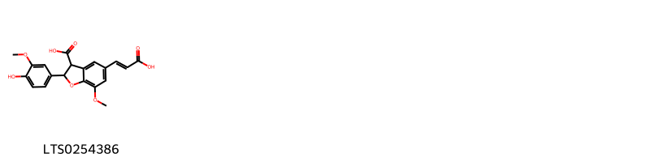{ width=100% }
    <figcaption>Hình ảnh cấu trúc hóa học của 1 hoạt chất thuộc nhóm 2-arylbenzofuran flavonoids gồm ['5-[(1e)-2-carboxyeth-1-en-1-yl]-2-(4-hydroxy-3-methoxyphenyl)-7-methoxy-2,3-dihydro-1-benzofuran-3-carboxylic acid (LTS0254386)'].</figcaption>
</figure>
### Nhóm Benzene and substituted derivatives
<figure markdown="span">
    { width=100% }
    <figcaption>Hình ảnh cấu trúc hóa học của 22 hoạt chất thuộc nhóm Benzene and substituted derivatives gồm ['methyl phenylacetate (LTS0085009)', 'syringic acid (LTS0210036)', 'propyl gallate (LTS0038913)', 'α-phenylbutyric acid (LTS0194202)', '2-phenyl-ethanol (LTS0206341)', 'benzaldehyde (LTS0094193)', '3,4,5-trihydroxy-2-propylbenzoic acid (LTS0129562)', 'diferulic acid (LTS0164735)', 'ortho-xylene (LTS0161849)', '3-hydroxybenzoic acid (LTS0176105)', 'p-hydroxybenzoic acid (LTS0263634)', 'ethyl phenylacetate (LTS0196222)', 'phenylacetaldehyde (LTS0245512)', 'diphenyl (LTS0227788)', 'methyl salicylate (LTS0128373)', '3,4-dihydroxybenzoic acid (LTS0018765)', 'ω-phenylacetic acid (LTS0091846)', '4-(6-hydroxy-5,5-dimethylcyclohex-1-en-1-yl)benzoic acid (LTS0026905)', '4-[(6r)-6-hydroxy-5,5-dimethylcyclohex-1-en-1-yl]benzoic acid (LTS0233212)', 'vanillic acid (LTS0229113)', '(2e)-2-{4-[(1z)-2-carboxyeth-1-en-1-yl]-2-methoxyphenoxy}-3-(4-hydroxy-3-methoxyphenyl)prop-2-enoic acid (LTS0021835)', 'salicyclic acid (LTS0116548)'].</figcaption>
</figure>
### Nhóm Benzodiazepines
<figure markdown="span">
    { width=100% }
    <figcaption>Hình ảnh cấu trúc hóa học của 2 hoạt chất thuộc nhóm Benzodiazepines gồm ['diazepam (LTS0079460)', 'lomax (LTS0185942)'].</figcaption>
</figure>
### Nhóm Benzoxazines
<figure markdown="span">
    { width=100% }
    <figcaption>Hình ảnh cấu trúc hóa học của 4 hoạt chất thuộc nhóm Benzoxazines gồm ['7-methoxy-2h-1,4-benzoxazine-2,3-diol (LTS0161763)', 'dimboa (LTS0045907)', '(2r)-7-methoxy-2h-1,4-benzoxazine-2,3-diol (LTS0098152)', '(2s)-2,4-dihydroxy-7-methoxy-2h-1,4-benzoxazin-3-one (LTS0132890)'].</figcaption>
</figure>
### Nhóm Benzoxazoles
<figure markdown="span">
    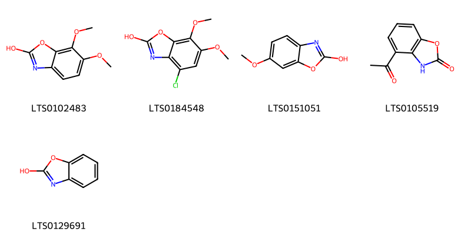{ width=100% }
    <figcaption>Hình ảnh cấu trúc hóa học của 5 hoạt chất thuộc nhóm Benzoxazoles gồm ['6,7-dimethoxy-1,3-benzoxazol-2-ol (LTS0102483)', '4-chloro-6,7-dimethoxy-1,3-benzoxazol-2-ol (LTS0184548)', '6-methoxy-1,3-benzoxazol-2-ol (LTS0151051)', '4-acetyl-3h-1,3-benzoxazol-2-one (LTS0105519)', '1,3-benzoxazol-2-ol (LTS0129691)'].</figcaption>
</figure>
### Nhóm Carboxylic acids and derivatives
<figure markdown="span">
    { width=100% }
    <figcaption>Hình ảnh cấu trúc hóa học của 16 hoạt chất thuộc nhóm Carboxylic acids and derivatives gồm ['gamma(amino)-butyric acid (LTS0118818)', 'ethyl acetate (LTS0196824)', 'l-lysine (LTS0068734)', '(2s)-2-amino-3-(6-benzyl-2-imino-1h-purin-9-yl)propanoic acid (LTS0121081)', '(1r,2s,3s,4r,8r,9r,11r)-8-formyl-11-hydroxy-4-methyl-12-methylidenetetracyclo[9.2.2.0¹,⁹.0³,⁸]pentadecane-2,4-dicarboxylic acid (LTS0133191)', '(1r,2s,3s,4r,8s,9s,11s,12s)-12-(hydroxymethyl)-4,8-dimethyltetracyclo[9.2.2.0¹,⁹.0³,⁸]pentadecane-2,4-dicarboxylic acid (LTS0145918)', '8-formyl-11-hydroxy-4-methyl-12-methylidenetetracyclo[9.2.2.0¹,⁹.0³,⁸]pentadecane-2,4-dicarboxylic acid (LTS0166036)', 'aconitic acid (LTS0039736)', '(1r,2s,3r,4r,8r,9r,11r)-11-hydroxy-4-methyl-12-methylidenetetracyclo[9.2.2.0¹,⁹.0³,⁸]pentadecane-2,4,8-tricarboxylic acid (LTS0140727)', '11-hydroxy-4-methyl-12-methylidenetetracyclo[9.2.2.0¹,⁹.0³,⁸]pentadecane-2,4,8-tricarboxylic acid (LTS0240559)', '11-hydroxy-4,8-dimethyl-12-methylidenetetracyclo[9.2.2.0¹,⁹.0³,⁸]pentadecane-2,4-dicarboxylic acid (LTS0044152)', 'l-cystathionine (LTS0062382)', '(2s)-2-amino-4-{[(1r)-1-(carboxymethyl-c-hydroxycarbonimidoyl)-2-sulfanylethyl]-c-hydroxycarbonimidoyl}butanoic acid (LTS0008500)', '12-(hydroxymethyl)-4,8-dimethyltetracyclo[9.2.2.0¹,⁹.0³,⁸]pentadecane-2,4-dicarboxylic acid (LTS0024028)', 'aconitate (LTS0252302)', '(1r,2s,3s,4r,8s,9s,11r)-11-hydroxy-4,8-dimethyl-12-methylidenetetracyclo[9.2.2.0¹,⁹.0³,⁸]pentadecane-2,4-dicarboxylic acid (LTS0044756)'].</figcaption>
</figure>
### Nhóm Cinnamic acids and derivatives
<figure markdown="span">
    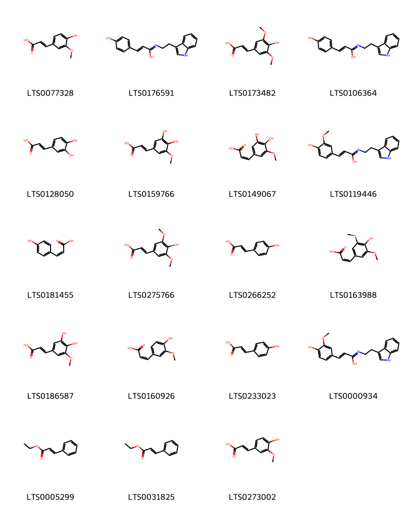{ width=100% }
    <figcaption>Hình ảnh cấu trúc hóa học của 19 hoạt chất thuộc nhóm Cinnamic acids and derivatives gồm ['ferulic acid (LTS0077328)', '(2e)-3-(4-hydroxyphenyl)-n-[2-(1h-indol-3-yl)ethyl]prop-2-enimidic acid (LTS0176591)', 'sinapinate (LTS0173482)', '3-(4-hydroxyphenyl)-n-[2-(1h-indol-3-yl)ethyl]prop-2-enimidic acid (LTS0106364)', '3,4-dihydroxycinnamic acid (LTS0128050)', '5-hydroxyferulate (LTS0159766)', '(2z)-3-(3,4-dihydroxy-5-methoxyphenyl)prop-2-enoic acid (LTS0149067)', '(2e)-3-(4-hydroxy-3-methoxyphenyl)-n-[2-(1h-indol-3-yl)ethyl]prop-2-enimidic acid (LTS0119446)', 'cis-p-coumaric acid (LTS0181455)', 'sinapoyl alcohol (LTS0275766)', 'para-coumaric acid (LTS0266252)', '(z)-sinapic acid (LTS0163988)', '5-hydroxyferulic acid (LTS0186587)', 'cis-ferulic acid (LTS0160926)', 'hydroxycinnamic acid (LTS0233023)', '3-(4-hydroxy-3-methoxyphenyl)-n-[2-(1h-indol-3-yl)ethyl]prop-2-enimidic acid (LTS0000934)', 'ethyl 3-phenylprop-2-enoate (LTS0005299)', 'ethyl cinnamate (LTS0031825)', 'ferulic acid (LTS0273002)'].</figcaption>
</figure>
### Nhóm Coumarins and derivatives
<figure markdown="span">
    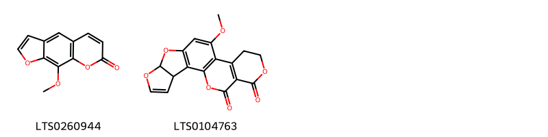{ width=100% }
    <figcaption>Hình ảnh cấu trúc hóa học của 2 hoạt chất thuộc nhóm Coumarins and derivatives gồm ['methoxsalen (LTS0260944)', 'aflatoxin (LTS0104763)'].</figcaption>
</figure>
### Nhóm Diazines
<figure markdown="span">
    { width=100% }
    <figcaption>Hình ảnh cấu trúc hóa học của 1 hoạt chất thuộc nhóm Diazines gồm ['pirod (LTS0008205)'].</figcaption>
</figure>
### Nhóm Dibenzylbutane lignans
<figure markdown="span">
    { width=100% }
    <figcaption>Hình ảnh cấu trúc hóa học của 2 hoạt chất thuộc nhóm Dibenzylbutane lignans gồm ['(2s,3r)-2,3-bis[(4-hydroxy-3-methoxyphenyl)(¹³c)methyl](1-¹³c)butane-1,4-diol (LTS0268699)', 'secoisolariciresinol (LTS0086727)'].</figcaption>
</figure>
### Nhóm Fatty Acyls
<figure markdown="span">
    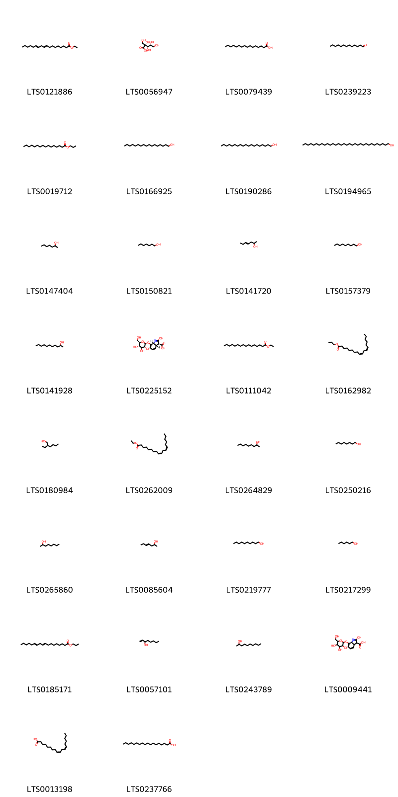{ width=100% }
    <figcaption>Hình ảnh cấu trúc hóa học của 30 hoạt chất thuộc nhóm Fatty Acyls gồm ['ethyl octadeca-9,12-dienoate (LTS0121886)', '2-carboxy-d-arabinitol (LTS0056947)', 'palmitic acid (LTS0079439)', 'tridecanal (LTS0239223)', 'hexadecanoic acid, propylester (LTS0019712)', '1-heptadecanol (LTS0166925)', 'nonadecanol (LTS0190286)', 'dotriacontanol (LTS0194965)', '2-heptanol (LTS0147404)', 'heptanol (LTS0150821)', '(4e)-hept-4-en-2-ol (LTS0141720)', 'nonan-1-ol (LTS0157379)', '2-undecanol (LTS0141928)', '(3s,3as,7ar)-2-hydroxy-7-{[(2s,3r,4s,5s,6r)-3,4,5-trihydroxy-6-(hydroxymethyl)oxan-2-yl]oxy}-3a,7a-dihydro-3h-indole-3-carboxylic acid (LTS0225152)', 'ethyl palmitate (LTS0111042)', 'propyl linoleate (LTS0162982)', '2-ethylhexanol (LTS0180984)', 'ethyl linoleate (LTS0262009)', '2-nonanol (LTS0264829)', 'octanol (LTS0250216)', '2-octanol (LTS0265860)', 'hept-4-en-2-ol (LTS0085604)', 'decanol (LTS0219777)', 'hexanol (LTS0217299)', 'propyl octadeca-9,12-dienoate (LTS0185171)', '1-octen-3-ol (LTS0057101)', 'decan-2-ol (LTS0243789)', '2-hydroxy-7-{[3,4,5-trihydroxy-6-(hydroxymethyl)oxan-2-yl]oxy}-3a,7a-dihydro-3h-indole-3-carboxylic acid (LTS0009441)', 'linoleic (LTS0013198)', 'stearic acid (LTS0237766)'].</figcaption>
</figure>
### Nhóm Flavonoids
<figure markdown="span">
    { width=100% }
    <figcaption>Hình ảnh cấu trúc hóa học của 42 hoạt chất thuộc nhóm Flavonoids gồm ['2-(3,4-dihydroxyphenyl)-5,7-dihydroxy-6-[(2r,3s,4s,6s)-4-hydroxy-6-methyl-5-oxo-3-{[(2s,3r,4r,5r,6s)-3,4,5-trihydroxy-6-methyloxan-2-yl]oxy}oxan-2-yl]chromen-4-one (LTS0223651)', '6-[(2r,3s,4r,5s,6s)-4,5-dihydroxy-6-methyl-3-{[(2s,3r,4r,5r,6s)-3,4,5-trihydroxy-6-methyloxan-2-yl]oxy}oxan-2-yl]-2-(3,4-dihydroxyphenyl)-5,7-dihydroxychromen-4-one (LTS0202371)', '6-[(2r,4r,5s,6s)-4,5-dihydroxy-6-methyloxan-2-yl]-5,7-dihydroxy-2-(3-hydroxy-4-methoxyphenyl)chromen-4-one (LTS0063888)', '5,7-dihydroxy-2-(4-hydroxy-3-methoxyphenyl)-6-[(2s,3r,4r,6s)-4-hydroxy-6-methyl-5-oxo-3-{[(2s,3r,4r,5r,6s)-3,4,5-trihydroxy-6-methyloxan-2-yl]oxy}oxan-2-yl]chromen-4-one (LTS0192698)', 'maysin (LTS0132611)', '5,7-dihydroxy-2-(4-hydroxy-3-methoxyphenyl)-6-{4-hydroxy-6-methyl-5-oxo-3-[(3,4,5-trihydroxy-6-methyloxan-2-yl)oxy]oxan-2-yl}chromen-4-one (LTS0076001)', '3-{[(2s,3r,4s,5s,6r)-4,5-dihydroxy-6-(hydroxymethyl)-3-{[(2s,3r,4r,5r,6s)-3,4,5-trihydroxy-6-methyloxan-2-yl]oxy}oxan-2-yl]oxy}-5,7-dihydroxy-2-(4-hydroxy-3-methoxyphenyl)chromen-4-one (LTS0061611)', '2-(3,4-dihydroxyphenyl)-5-hydroxy-3,7-bis({[3,4,5-trihydroxy-6-(hydroxymethyl)oxan-2-yl]oxy})chromen-4-one (LTS0206247)', 'chrysoeriol (LTS0095766)', '6-[(2s,3s,4r,5r,6r)-4,5-dihydroxy-6-methyl-3-{[(2s,3s,4r,5r,6s)-3,4,5-trihydroxy-6-methyloxan-2-yl]oxy}oxan-2-yl]-2-(3,4-dihydroxyphenyl)-5,7-dihydroxychromen-4-one (LTS0047207)', '6-{4,5-dihydroxy-6-methyl-3-[(3,4,5-trihydroxy-6-methyloxan-2-yl)oxy]oxan-2-yl}-2-(3,4-dihydroxyphenyl)-5,7-dihydroxychromen-4-one (LTS0157517)', '6-{4,5-dihydroxy-6-methyl-3-[(3,4,5-trihydroxy-6-methyloxan-2-yl)oxy]oxan-2-yl}-5,7-dihydroxy-2-(4-hydroxy-3-methoxyphenyl)chromen-4-one (LTS0177750)', '6-[(2r,3s,4r,5s,6s)-4,5-dihydroxy-6-methyl-3-{[(2s,3r,4r,5r,6s)-3,4,5-trihydroxy-6-methyloxan-2-yl]oxy}oxan-2-yl]-5,7-dihydroxy-2-(4-hydroxy-3-methoxyphenyl)chromen-4-one (LTS0087910)', '5,7-dihydroxy-2-(4-hydroxy-3-methoxyphenyl)-6-[(2r,3s,4s,6s)-4-hydroxy-6-methyl-5-oxo-3-{[(2s,3r,4r,5r,6s)-3,4,5-trihydroxy-6-methyloxan-2-yl]oxy}oxan-2-yl]chromen-4-one (LTS0105906)', '2-(3,4-dihydroxyphenyl)-5,7-dihydroxy-3-{[3,4,5-trihydroxy-6-(hydroxymethyl)oxan-2-yl]oxy}chromen-4-one (LTS0195312)', '5,7-dihydroxy-2-(4-hydroxy-3-methoxyphenyl)-6-(3,4,5-trihydroxy-6-methyloxan-2-yl)chromen-4-one (LTS0179333)', '6-[(2s,3s,4s,5s,6r)-4,5-dihydroxy-6-methyl-3-{[(2s,3s,4r,5r,6r)-3,4,5-trihydroxy-6-methyloxan-2-yl]oxy}oxan-2-yl]-5,7-dihydroxy-2-(4-hydroxy-3-methoxyphenyl)chromen-4-one (LTS0114570)', '3-{[(2s,3r,4s,5r,6r)-4-[(2-carboxyacetyl)oxy]-6-{[(2-carboxyacetyl)oxy]methyl}-3,5-dihydroxyoxan-2-yl]oxy}-2-(3,4-dihydroxyphenyl)-5,7-dihydroxy-1λ⁴-chromen-1-ylium (LTS0132043)', '3-{[4,5-dihydroxy-6-(hydroxymethyl)-3-[(3,4,5-trihydroxy-6-methyloxan-2-yl)oxy]oxan-2-yl]oxy}-2-(3,4-dihydroxyphenyl)-5,7-dihydroxychromen-4-one (LTS0139403)', '5,7-dihydroxy-2-(4-hydroxy-3-{[3,4,5-trihydroxy-6-(hydroxymethyl)oxan-2-yl]oxy}phenyl)-3-{[3,4,5-trihydroxy-6-(hydroxymethyl)oxan-2-yl]oxy}chromen-4-one (LTS0147787)', '6-[(2r,4r,5s,6s)-4,5-dihydroxy-6-methyloxan-2-yl]-5-hydroxy-2-(3-hydroxy-4-methoxyphenyl)-7-{[(2s,3r,4s,5s,6r)-3,4,5-trihydroxy-6-(hydroxymethyl)oxan-2-yl]oxy}chromen-4-one (LTS0188009)', '5,7-dihydroxy-2-(3-methoxy-4-{[3,4,5-trihydroxy-6-(hydroxymethyl)oxan-2-yl]oxy}phenyl)-3-{[3,4,5-trihydroxy-6-(hydroxymethyl)oxan-2-yl]oxy}chromen-4-one (LTS0245945)', '6-[(2r,3s,4r,5r,6s)-4,5-dihydroxy-6-methyl-3-{[(2s,3r,4r,5r,6s)-3,4,5-trihydroxy-6-methyloxan-2-yl]oxy}oxan-2-yl]-2-(3,4-dihydroxyphenyl)-5,7-dihydroxychromen-4-one (LTS0176895)', '5,7-dihydroxy-2-(4-hydroxy-3-oxidophenyl)-3-{[(2s,3r,4s,5s,6r)-3,4,5-trihydroxy-6-(hydroxymethyl)oxan-2-yl]oxy}-1λ⁴-chromen-1-ylium (LTS0083222)', 'cyanidin 3-glucoside (LTS0217835)', '5,7-dihydroxy-2-(4-hydroxy-3-{[(2s,3r,4s,5s,6r)-3,4,5-trihydroxy-6-(hydroxymethyl)oxan-2-yl]oxy}phenyl)-3-{[(2s,3r,4s,5s,6r)-3,4,5-trihydroxy-6-(hydroxymethyl)oxan-2-yl]oxy}chromen-4-one (LTS0045791)', '6-[(2s,3s,4s,5s,6r)-4,5-dihydroxy-6-methyl-3-{[(2s,3s,4r,5r,6s)-3,4,5-trihydroxy-6-methyloxan-2-yl]oxy}oxan-2-yl]-2-(3,4-dihydroxyphenyl)-5,7-dihydroxychromen-4-one (LTS0192785)', '3-{[(2s,3r,4s,5s,6r)-4,5-dihydroxy-6-(hydroxymethyl)-3-{[(2s,3r,4r,5r,6s)-3,4,5-trihydroxy-6-methyloxan-2-yl]oxy}oxan-2-yl]oxy}-2-(3,4-dihydroxyphenyl)-5,7-dihydroxychromen-4-one (LTS0203991)', '3-{[4,5-dihydroxy-6-(hydroxymethyl)-3-[(3,4,5-trihydroxy-6-methyloxan-2-yl)oxy]oxan-2-yl]oxy}-5,7-dihydroxy-2-(4-hydroxy-3-methoxyphenyl)chromen-4-one (LTS0095279)', '6-[(2r,3s,5s)-4,5-dihydroxy-6-methyl-3-{[(2s,3s,5r)-3,4,5-trihydroxy-6-methyloxan-2-yl]oxy}oxan-2-yl]-2-(3,4-dihydroxyphenyl)-5,7-dihydroxychromen-4-one (LTS0073207)', 'chrysanthemin (LTS0221391)', '2-(3,4-dihydroxyphenyl)-5,7-dihydroxy-3-{[(2r,3r,4s,5s,6r)-3,4,5-trihydroxy-6-(hydroxymethyl)oxan-2-yl]oxy}chromen-4-one (LTS0086516)', '2-(3,4-dihydroxyphenyl)-5,7-dihydroxy-3-{[(2s,3r,4r,5r,6s)-3,4,5-trihydroxy-6-(hydroxymethyl)oxan-2-yl]oxy}chromen-4-one (LTS0241372)', 'astragalin (LTS0249588)', '6-(4,5-dihydroxy-6-methyloxan-2-yl)-5,7-dihydroxy-2-(3-hydroxy-4-methoxyphenyl)chromen-4-one (LTS0242251)', 'quercetin 3,7-diglucoside (LTS0059170)', '6-(4,5-dihydroxy-6-methyloxan-2-yl)-5-hydroxy-2-(3-hydroxy-4-methoxyphenyl)-7-{[3,4,5-trihydroxy-6-(hydroxymethyl)oxan-2-yl]oxy}chromen-4-one (LTS0047223)', '5,7-dihydroxy-2-(4-hydroxy-3-methoxyphenyl)-3-{[(2s,3r,4r,5s,6r)-3,4,5-trihydroxy-6-(hydroxymethyl)oxan-2-yl]oxy}-1λ⁴-chromen-1-ylium (LTS0005321)', '5,7-dihydroxy-2-(3-methoxy-4-{[(2s,3r,4s,5s,6r)-3,4,5-trihydroxy-6-(hydroxymethyl)oxan-2-yl]oxy}phenyl)-3-{[(2s,3r,4r,5s,6r)-3,4,5-trihydroxy-6-(hydroxymethyl)oxan-2-yl]oxy}chromen-4-one (LTS0004780)', '5,7-dihydroxy-2-(4-hydroxy-3-methoxyphenyl)-6-[(2r,3s,4r,5s,6s)-3,4,5-trihydroxy-6-methyloxan-2-yl]chromen-4-one (LTS0229536)', '5,7-dihydroxy-2-(3-methoxy-4-{[(2s,3r,4s,5s,6r)-3,4,5-trihydroxy-6-(hydroxymethyl)oxan-2-yl]oxy}phenyl)-3-{[(2s,3r,4s,5s,6r)-3,4,5-trihydroxy-6-(hydroxymethyl)oxan-2-yl]oxy}chromen-4-one (LTS0022429)', '2-(3,4-dihydroxyphenyl)-5,7-dihydroxy-6-{4-hydroxy-6-methyl-5-oxo-3-[(3,4,5-trihydroxy-6-methyloxan-2-yl)oxy]oxan-2-yl}chromen-4-one (LTS0019198)'].</figcaption>
</figure>
### Nhóm Fluorenes
<figure markdown="span">
    { width=100% }
    <figcaption>Hình ảnh cấu trúc hóa học của 1 hoạt chất thuộc nhóm Fluorenes gồm ['fluorene (LTS0020156)'].</figcaption>
</figure>
### Nhóm Furanoid lignans
<figure markdown="span">
    { width=100% }
    <figcaption>Hình ảnh cấu trúc hóa học của 3 hoạt chất thuộc nhóm Furanoid lignans gồm ['pinoresinol (LTS0057431)', 'matairesinol (LTS0193475)', 'lariciresinol (LTS0010950)'].</figcaption>
</figure>
### Nhóm Glycerophospholipids
<figure markdown="span">
    { width=100% }
    <figcaption>Hình ảnh cấu trúc hóa học của 1 hoạt chất thuộc nhóm Glycerophospholipids gồm ['2,3-bis[(9e)-nonadec-9-enoyloxy]propoxy(2-(trimethylammonio)ethoxy)phosphinic acid (LTS0223825)'].</figcaption>
</figure>
### Nhóm Heteroaromatic compounds
<figure markdown="span">
    { width=100% }
    <figcaption>Hình ảnh cấu trúc hóa học của 1 hoạt chất thuộc nhóm Heteroaromatic compounds gồm ['amylfuran (LTS0044471)'].</figcaption>
</figure>
### Nhóm Imidazopyrimidines
<figure markdown="span">
    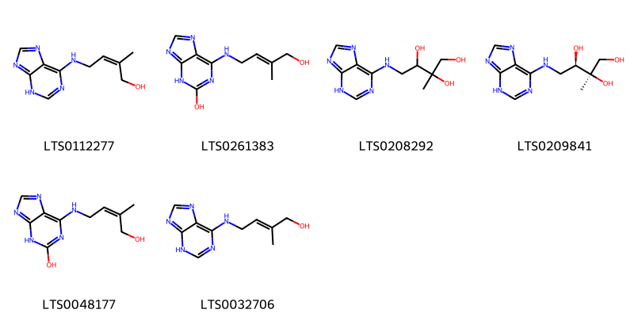{ width=100% }
    <figcaption>Hình ảnh cấu trúc hóa học của 6 hoạt chất thuộc nhóm Imidazopyrimidines gồm ['2-methyl-4-(3h-purin-6-ylamino)but-2-en-1-ol (LTS0112277)', '6-{[(2e)-4-hydroxy-3-methylbut-2-en-1-yl]amino}-3h-purin-2-ol (LTS0261383)', '2-methyl-4-(3h-purin-6-ylamino)butane-1,2,3-triol (LTS0208292)', '(2r,3r)-2-methyl-4-(3h-purin-6-ylamino)butane-1,2,3-triol (LTS0209841)', '6-[(4-hydroxy-3-methylbut-2-en-1-yl)amino]-3h-purin-2-ol (LTS0048177)', 'zeatine (LTS0032706)'].</figcaption>
</figure>
### Nhóm Indoles and derivatives
<figure markdown="span">
    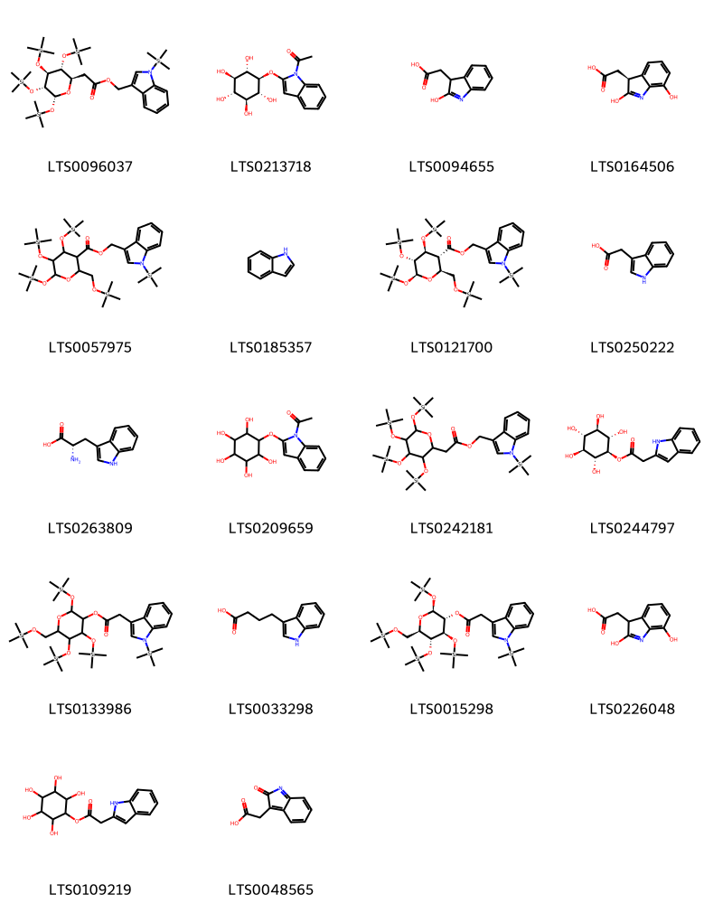{ width=100% }
    <figcaption>Hình ảnh cấu trúc hóa học của 18 hoạt chất thuộc nhóm Indoles and derivatives gồm ['[1-(trimethylsilyl)indol-3-yl]methyl 2-[(2r,3r,4s,5r,6r)-3,4,5,6-tetrakis[(trimethylsilyl)oxy]oxan-2-yl]acetate (LTS0096037)', '1-(2-{[(1r,2r,3s,4s,5r,6s)-2,3,4,5,6-pentahydroxycyclohexyl]oxy}indol-1-yl)ethanone (LTS0213718)', '(2-hydroxy-3h-indol-3-yl)acetic acid (LTS0094655)', '[(3s)-2,7-dihydroxy-3h-indol-3-yl]acetic acid (LTS0164506)', '[1-(trimethylsilyl)indol-3-yl]methyl 4,5,6-tris[(trimethylsilyl)oxy]-2-{[(trimethylsilyl)oxy]methyl}oxane-3-carboxylate (LTS0057975)', 'indole (LTS0185357)', '[1-(trimethylsilyl)indol-3-yl]methyl (2s,3r,4s,5r,6s)-4,5,6-tris[(trimethylsilyl)oxy]-2-{[(trimethylsilyl)oxy]methyl}oxane-3-carboxylate (LTS0121700)', 'β-indole-3-acetic acid (LTS0250222)', 'l-tryptophan (LTS0263809)', '1-{2-[(2,3,4,5,6-pentahydroxycyclohexyl)oxy]indol-1-yl}ethanone (LTS0209659)', '[1-(trimethylsilyl)indol-3-yl]methyl 2-{3,4,5,6-tetrakis[(trimethylsilyl)oxy]oxan-2-yl}acetate (LTS0242181)', '(1r,2r,3s,4s,5r,6s)-2,3,4,5,6-pentahydroxycyclohexyl 2-(1h-indol-2-yl)acetate (LTS0244797)', '2,4,5-tris[(trimethylsilyl)oxy]-6-{[(trimethylsilyl)oxy]methyl}oxan-3-yl 2-[1-(trimethylsilyl)indol-3-yl]acetate (LTS0133986)', '3-indolebutyric acid (LTS0033298)', '(2s,3r,4r,5r,6r)-2,4,5-tris[(trimethylsilyl)oxy]-6-{[(trimethylsilyl)oxy]methyl}oxan-3-yl 2-[1-(trimethylsilyl)indol-3-yl]acetate (LTS0015298)', '(2,7-dihydroxy-3h-indol-3-yl)acetic acid (LTS0226048)', '2,3,4,5,6-pentahydroxycyclohexyl 2-(1h-indol-2-yl)acetate (LTS0109219)', '(2-oxoindol-3-yl)acetic acid (LTS0048565)'].</figcaption>
</figure>
### Nhóm Isoflavonoids
<figure markdown="span">
    { width=100% }
    <figcaption>Hình ảnh cấu trúc hóa học của 1 hoạt chất thuộc nhóm Isoflavonoids gồm ['genistein (LTS0106538)'].</figcaption>
</figure>
### Nhóm Lactones
<figure markdown="span">
    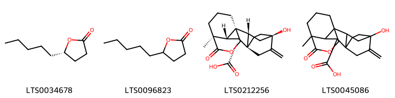{ width=100% }
    <figcaption>Hình ảnh cấu trúc hóa học của 4 hoạt chất thuộc nhóm Lactones gồm ['aldehyde c-18 (LTS0034678)', 'gamma-nonalactone (LTS0096823)', '(1r,2r,4r,7r,8s,9s,10s)-4-hydroxy-10-methyl-5-methylidene-11-oxo-12-oxapentacyclo[8.3.3.2⁴,⁷.0¹,⁹.0²,⁷]octadecane-8-carboxylic acid (LTS0212256)', '4-hydroxy-10-methyl-5-methylidene-11-oxo-12-oxapentacyclo[8.3.3.2⁴,⁷.0¹,⁹.0²,⁷]octadecane-8-carboxylic acid (LTS0045086)'].</figcaption>
</figure>
### Nhóm Naphthalenes
<figure markdown="span">
    { width=100% }
    <figcaption>Hình ảnh cấu trúc hóa học của 2 hoạt chất thuộc nhóm Naphthalenes gồm ['naphthalene (LTS0254484)', '2-methylnaphthalene (LTS0036975)'].</figcaption>
</figure>
### Nhóm Naphthopyrans
<figure markdown="span">
    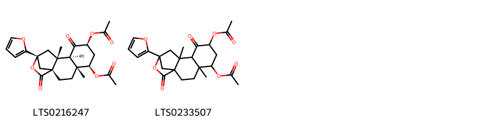{ width=100% }
    <figcaption>Hình ảnh cấu trúc hóa học của 2 hoạt chất thuộc nhóm Naphthopyrans gồm ['(1r,4r,5r,7s,9r,10r,12r)-7-(acetyloxy)-12-(furan-2-yl)-4,10-dimethyl-8,14-dioxo-13-oxatetracyclo[10.2.1.0¹,¹⁰.0⁴,⁹]pentadecan-5-yl acetate (LTS0216247)', '7-(acetyloxy)-12-(furan-2-yl)-4,10-dimethyl-8,14-dioxo-13-oxatetracyclo[10.2.1.0¹,¹⁰.0⁴,⁹]pentadecan-5-yl acetate (LTS0233507)'].</figcaption>
</figure>
### Nhóm Organic phosphoric acids and derivatives
<figure markdown="span">
    { width=100% }
    <figcaption>Hình ảnh cấu trúc hóa học của 1 hoạt chất thuộc nhóm Organic phosphoric acids and derivatives gồm ['3-phosphoshikimic acid (LTS0223919)'].</figcaption>
</figure>
### Nhóm Organonitrogen compounds
<figure markdown="span">
    { width=100% }
    <figcaption>Hình ảnh cấu trúc hóa học của 3 hoạt chất thuộc nhóm Organonitrogen compounds gồm ['putrescine (LTS0238763)', '(9z,12z)-n-(2-hydroxyethyl)octadeca-9,12-dienimidic acid (LTS0115325)', 'spermidine (LTS0061428)'].</figcaption>
</figure>
### Nhóm Organooxygen compounds
<figure markdown="span">
    { width=100% }
    <figcaption>Hình ảnh cấu trúc hóa học của 51 hoạt chất thuộc nhóm Organooxygen compounds gồm ['[(3s)-2,3-dihydroxy-7-{[(2s,3r,4s,5s,6r)-3,4,5-trihydroxy-6-(hydroxymethyl)oxan-2-yl]oxy}indol-3-yl]acetic acid (LTS0218028)', 'decanal (LTS0128361)', 'octanal (LTS0055983)', '4-hydroxy-2-{[3,4,5-trihydroxy-6-(hydroxymethyl)oxan-2-yl]oxy}-2h-1,4-benzoxazin-3-one (LTS0056199)', 'phytic acid (LTS0210346)', 'amyl alcohol (LTS0193146)', '4,7-dimethoxy-2-{[3,4,5-trihydroxy-6-(hydroxymethyl)oxan-2-yl]oxy}-2h-1,4-benzoxazin-3-one (LTS0123169)', '2-[(5-chloro-3-hydroxy-7-methoxy-2h-1,4-benzoxazin-2-yl)oxy]-6-(hydroxymethyl)oxane-3,4,5-triol (LTS0207259)', '(2s,3r,4s,5s,6r)-2-{[(2s)-3-hydroxy-7-methoxy-2h-1,4-benzoxazin-2-yl]oxy}-6-(hydroxymethyl)oxane-3,4,5-triol (LTS0073467)', '2-octanone (LTS0129079)', 'hept-4-en-2-one (LTS0098783)', 'diboa-glucoside (LTS0101735)', '2-heptanone (LTS0087207)', 'geosmin (LTS0091389)', 'dimboa-glucoside (LTS0189156)', '2-methylbutanal (LTS0098841)', '(2s,3r,4r,5r,6s)-4,5,6-trihydroxy-3-{[(2s,3r,4r,5r,6s)-3,4,5-trihydroxy-6-methyloxan-2-yl]oxy}oxane-2-carboxylic acid (LTS0186166)', '2-hydroxy-8-{[(2s,3r,4s,5s,6r)-3,4,5-trihydroxy-6-(hydroxymethyl)oxan-2-yl]oxy}quinoline-4-carboxylic acid (LTS0035132)', '2-decanone (LTS0127177)', '(2,3-dihydroxy-7-{[3,4,5-trihydroxy-6-(hydroxymethyl)oxan-2-yl]oxy}indol-3-yl)acetic acid (LTS0144263)', 'pent-1-en-2-ol (LTS0139059)', '(2s,3r,4s,5s,6r)-2-{[(2s)-5-chloro-3-hydroxy-7-methoxy-2h-1,4-benzoxazin-2-yl]oxy}-6-(hydroxymethyl)oxane-3,4,5-triol (LTS0139514)', 'dodecanal (LTS0229257)', '4-hydroxy-7,8-dimethoxy-2-{[3,4,5-trihydroxy-6-(hydroxymethyl)oxan-2-yl]oxy}-2h-1,4-benzoxazin-3-one (LTS0188541)', 'nonanal (LTS0244398)', 'aldehyde c11 (LTS0045537)', '(2r,3r,4s,5s,6s)-2-{[(2r)-3-hydroxy-7-methoxy-2h-1,4-benzoxazin-2-yl]oxy}-6-(hydroxymethyl)oxane-3,4,5-triol (LTS0062995)', '4-methyl-3-pentanone (LTS0213310)', '2-pentanol (LTS0217254)', '1-hexen-3-ol (LTS0074606)', '(2r)-4-hydroxy-7,8-dimethoxy-2-{[(2s,3r,4s,5s,6r)-3,4,5-trihydroxy-6-(hydroxymethyl)oxan-2-yl]oxy}-2h-1,4-benzoxazin-3-one (LTS0072602)', '(2s)-4,7-dimethoxy-2-{[(2s,3r,4s,5s,6r)-3,4,5-trihydroxy-6-(hydroxymethyl)oxan-2-yl]oxy}-2h-1,4-benzoxazin-3-one (LTS0221192)', '2-pentenal, 2-methyl- (LTS0184149)', 'chlorogenic acid (LTS0226495)', '[(1r,2r,3s,4r,5s,6s)-2,3,4,5,6-pentakis(phosphonooxy)cyclohexyl]oxyphosphonic acid (LTS0234844)', 'hexanal (LTS0238624)', 'apocynin (LTS0211279)', '2-[(3-hydroxy-7-methoxy-2h-1,4-benzoxazin-2-yl)oxy]-6-(hydroxymethyl)oxane-3,4,5-triol (LTS0249430)', '2-hexanol (LTS0106528)', '2-methyl-1-butanol (LTS0029080)', '3-hexen-2-one (LTS0133323)', '[(3r)-2,3-dihydroxy-7-{[(2s,3r,4s,5s,6r)-3,4,5-trihydroxy-6-(hydroxymethyl)oxan-2-yl]oxy}indol-3-yl]acetic acid (LTS0001419)', '4-hydroxy-7-methoxy-2-{[3,4,5-trihydroxy-6-(hydroxymethyl)oxan-2-yl]oxy}-2h-1,4-benzoxazin-3-one (LTS0010779)', '3-pentanone (LTS0030661)', '2-nonanone (LTS0245014)', '(2s,3r,4s,5s,6r)-2-[(2-hydroxy-1,3-benzoxazol-6-yl)oxy]-6-(hydroxymethyl)oxane-3,4,5-triol (LTS0258855)', 'hexanone (LTS0108749)', 'heptanal (LTS0031416)', 'undecan-2-one (LTS0244143)', '2-[(2-hydroxy-1,3-benzoxazol-6-yl)oxy]-6-(hydroxymethyl)oxane-3,4,5-triol (LTS0250498)', 'isoamyl alcohol (LTS0112297)'].</figcaption>
</figure>
### Nhóm Phenols
<figure markdown="span">
    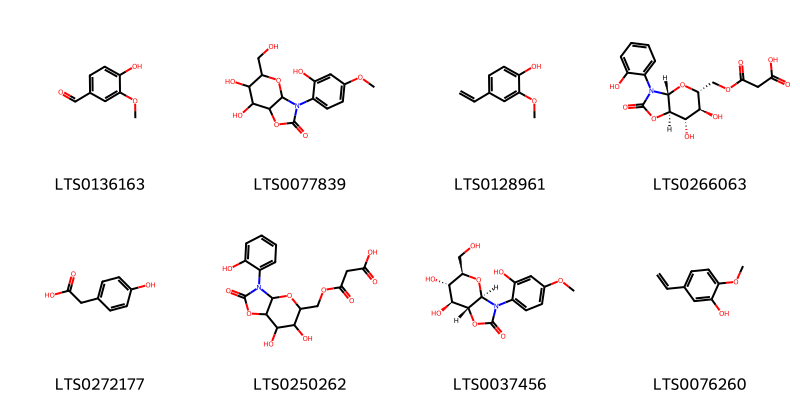{ width=100% }
    <figcaption>Hình ảnh cấu trúc hóa học của 8 hoạt chất thuộc nhóm Phenols gồm ['vanillin (LTS0136163)', '6,7-dihydroxy-3-(2-hydroxy-4-methoxyphenyl)-5-(hydroxymethyl)-tetrahydro-3ah-pyrano[2,3-d][1,3]oxazol-2-one (LTS0077839)', '2-methoxy-4-vinyl-phenol (LTS0128961)', '3-{[(3ar,5r,6s,7s,7ar)-6,7-dihydroxy-3-(2-hydroxyphenyl)-2-oxo-tetrahydro-3ah-pyrano[2,3-d][1,3]oxazol-5-yl]methoxy}-3-oxopropanoic acid (LTS0266063)', '4-hydroxyphenylacetic acid (LTS0272177)', '3-{[6,7-dihydroxy-3-(2-hydroxyphenyl)-2-oxo-tetrahydro-3ah-pyrano[2,3-d][1,3]oxazol-5-yl]methoxy}-3-oxopropanoic acid (LTS0250262)', '(3ar,5r,6s,7s,7ar)-6,7-dihydroxy-3-(2-hydroxy-4-methoxyphenyl)-5-(hydroxymethyl)-tetrahydro-3ah-pyrano[2,3-d][1,3]oxazol-2-one (LTS0037456)', '5-ethenyl-2-methoxyphenol (LTS0076260)'].</figcaption>
</figure>
### Nhóm Polycyclic hydrocarbons
<figure markdown="span">
    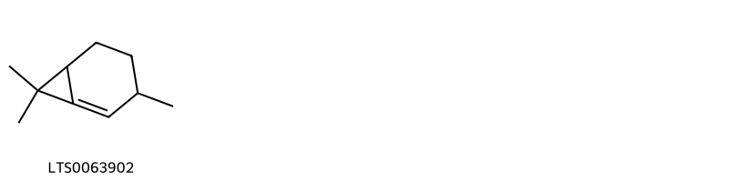{ width=100% }
    <figcaption>Hình ảnh cấu trúc hóa học của 1 hoạt chất thuộc nhóm Polycyclic hydrocarbons gồm ['carene (LTS0063902)'].</figcaption>
</figure>
### Nhóm Prenol lipids
<figure markdown="span">
    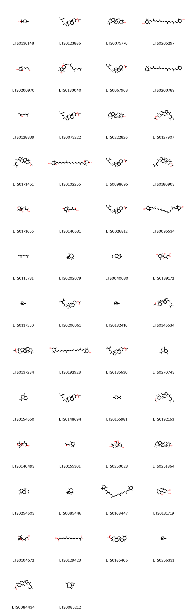{ width=100% }
    <figcaption>Hình ảnh cấu trúc hóa học của 101 hoạt chất thuộc nhóm Prenol lipids gồm ['terpineol (LTS0136148)', '1-(5-ethyl-6-methylheptan-2-yl)-9a,11a-dimethyl-1h,2h,3h,3ah,3bh,4h,6h,7h,8h,9h,9bh,10h,11h-cyclopenta[a]phenanthren-7-yl acetate (LTS0123886)', 'β-amyrin (LTS0075776)', 'carotenoid (LTS0205297)', 'xanthoxin (LTS0200970)', '(2r)-2,5,7,8-tetramethyl-2-[(4s,8s)-4,8,12-trimethyltridecyl]-3,4-dihydro-1-benzopyran-6-ol (LTS0130040)', 'stigmastanol acetate (LTS0067968)', '(+)-α-carotene (LTS0200789)', 'linalool, (+-)- (LTS0128839)', '1-(5-ethyl-6-methylhept-3-en-2-yl)-9a,11a-dimethyl-tetradecahydro-1h-cyclopenta[a]phenanthren-7-yl acetate (LTS0073222)', 'amyrin (LTS0222826)', '1-(5-ethyl-6-methylheptan-2-yl)-6,9a,11a-trimethyl-1h,2h,3h,3ah,5h,5ah,6h,7h,8h,9h,9bh,10h,11h-cyclopenta[a]phenanthren-7-yl acetate (LTS0127907)', '1-(5,6-dimethylhept-4-en-2-yl)-3a,6,6,9a,11a-pentamethyl-dodecahydro-1h-cyclopenta[a]phenanthren-7-yl acetate (LTS0171451)', 'violaxanthin (LTS0102265)', 'β-sitosteryl acetate (LTS0098695)', '(1r,3as,3br,5ar,7r,9ar,9bs,11ar)-1-[(2r,4e)-5,6-dimethylhept-4-en-2-yl]-3a,6,6,9a,11a-pentamethyl-dodecahydro-1h-cyclopenta[a]phenanthren-7-yl acetate (LTS0180903)', '5-{3,8-dihydroxy-1,5-dimethyl-6-oxabicyclo[3.2.1]octan-8-yl}-3-methylpenta-2,4-dienoic acid (LTS0171655)', 'abscisic acid,  (LTS0140631)', 'stigmasteryl acetate (LTS0026812)', '4-[(9e,11e,13e,15e,17e)-18-(4-hydroxy-2,6,6-trimethylcyclohex-1-en-1-yl)-3,7,12,16-tetramethyloctadeca-1,3,5,7,9,11,13,15,17-nonaen-1-yl]-3,5,5-trimethylcyclohex-3-en-1-ol (LTS0095534)', 'α-myrcene (LTS0115731)', 'longifolene (LTS0202079)', '8-isopropyl-1,2-dimethyltetracyclo[4.4.0.0²,⁴.0³,⁷]decane (LTS0040030)', '5-[1-hydroxy-6-(hydroxymethyl)-2,6-dimethyl-4-oxocyclohex-2-en-1-yl]-3-methylpenta-2,4-dienoic acid (LTS0189172)', 'β-pinene (LTS0117550)', '(1r,3as,3bs,7s,9ar,9bs,11ar)-1-[(2r,5e)-5-isopropylhept-5-en-2-yl]-9a,11a-dimethyl-1h,2h,3h,3ah,3bh,4h,6h,7h,8h,9h,9bh,10h,11h-cyclopenta[a]phenanthren-7-yl acetate (LTS0206061)', 'α pinene (LTS0132416)', '(1r,3as,3br,5ar,7r,9ar,9bs,11ar)-1-[(2r,5s)-5,6-dimethylhept-6-en-2-yl]-3a,6,6,9a,11a-pentamethyl-dodecahydro-1h-cyclopenta[a]phenanthren-7-yl acetate (LTS0146534)', 'β-amyrin acetate (LTS0137234)', 'zeaxanthin (LTS0192928)', '1-(5-isopropylhept-5-en-2-yl)-9a,11a-dimethyl-1h,2h,3h,3ah,3bh,4h,6h,7h,8h,9h,9bh,10h,11h-cyclopenta[a]phenanthren-7-yl acetate (LTS0135630)', '4-isopropyl-1,6-dimethyl-2,3,4,4a,7,8-hexahydronaphthalene (LTS0270743)', '4-isopropyl-1,6-dimethyl-3,4,4a,7,8,8a-hexahydronaphthalene (LTS0154650)', '1-(5-ethyl-6-methylhept-5-en-2-yl)-9a,11a-dimethyl-1h,2h,3h,3ah,3bh,4h,6h,7h,8h,9h,9bh,10h,11h-cyclopenta[a]phenanthren-7-yl acetate (LTS0148694)', 'limonene,  (LTS0155981)', '(1r,3ar,5as,6s,7s,9as,9br,11ar)-1-[(2r,5r)-5-ethyl-6-methylheptan-2-yl]-6,9a,11a-trimethyl-1h,2h,3h,3ah,5h,5ah,6h,7h,8h,9h,9bh,10h,11h-cyclopenta[a]phenanthren-7-yl acetate (LTS0192163)', '(2z,4e)-5-[(1s,5s,8s)-8-hydroxy-1,5-dimethyl-3-oxo-6-oxabicyclo[3.2.1]octan-8-yl]-3-methylpenta-2,4-dienoic acid (LTS0140493)', 'β-ionone (LTS0155301)', 'gibberellin a29 (LTS0250023)', 'β-amyrin (LTS0251864)', 'α-ylangene (LTS0254603)', '(2s,7s)-3,3,7-trimethyl-8-methylidenetricyclo[5.4.0.0²,⁹]undecane (LTS0085446)', 'β,β-carotene (LTS0168447)', '(1s)-1-[(2s,4as,4br,5r,8as,10as)-5-hydroxy-2,4b,8,8-tetramethyl-decahydro-1h-phenanthren-2-yl]ethane-1,2-diol (LTS0131719)', '5-{8-hydroxy-1,5-dimethyl-3-oxo-6-oxabicyclo[3.2.1]octan-8-yl}-3-methylpenta-2,4-dienoic acid (LTS0104572)', 'crocetin (LTS0129423)', '4,4,6a,6b,8a,11,12,14b-octamethyl-2,3,4a,5,6,7,8,9,10,11,12,12a,14,14a-tetradecahydro-1h-picen-3-yl acetate (LTS0185406)', '6,6-dimethyl-4-methylidenebicyclo[3.1.1]hept-2-ene (LTS0256331)', '1-(5,6-dimethylhept-6-en-2-yl)-3a,6,6,9a,11a-pentamethyl-dodecahydro-1h-cyclopenta[a]phenanthren-7-yl acetate (LTS0084434)', 'caryophyllene (LTS0085212)', '2,4a,8,8-tetramethyl-1h,1ah,4h,5h-cyclopropa[e]naphthalene (LTS0267234)', '1-(5-isopropylhept-5-en-2-yl)-9a,11a-dimethyl-1h,2h,3h,3ah,5h,5ah,6h,7h,8h,9h,9bh,10h,11h-cyclopenta[a]phenanthren-7-yl acetate (LTS0265077)', 'β-carotene (LTS0275716)', '1-(5-ethyl-6-methylhept-3-en-2-yl)-9a,11a-dimethyl-1h,2h,3h,3ah,3bh,4h,6h,7h,8h,9h,9bh,10h,11h-cyclopenta[a]phenanthren-7-yl acetate (LTS0242194)', '(1r,3as,3bs,7s,9ar,9bs,11ar)-1-[(2r,5z)-5-isopropylhept-5-en-2-yl]-9a,11a-dimethyl-1h,2h,3h,3ah,3bh,4h,6h,7h,8h,9h,9bh,10h,11h-cyclopenta[a]phenanthren-7-yl acetate (LTS0195939)', 'vitamin e (LTS0263269)', '(1s)-8-isopropyl-1,3-dimethyltricyclo[4.4.0.0²,⁷]dec-3-ene (LTS0199723)', 'β-farnesene (LTS0067925)', 'abscisic acid (LTS0200774)', 'antheraxanthin (LTS0210072)', "(+)-8'-hydroxyabscisic acid (LTS0241618)", '(s)-(+)-abscisic acid (LTS0260851)', '(2z,4e)-5-[(1s,3r,5s,8s)-3,8-dihydroxy-1,5-dimethyl-6-oxabicyclo[3.2.1]octan-8-yl]-3-methylpenta-2,4-dienoic acid (LTS0208352)', '(1r,3ar,5as,7s,9as,9br,11ar)-1-[(2r,5r)-5-ethyl-6-methylheptan-2-yl]-9a,11a-dimethyl-1h,2h,3h,3ah,5h,5ah,6h,7h,8h,9h,9bh,10h,11h-cyclopenta[a]phenanthren-7-yl acetate (LTS0232290)', 'α-copaene (LTS0207598)', '3a,6,6,9a,11a-pentamethyl-1-(6-methyl-5-methylideneheptan-2-yl)-dodecahydro-1h-cyclopenta[a]phenanthren-7-yl acetate (LTS0220832)', '4,4,6a,6b,8a,11,11,14b-octamethyl-1,2,3,4a,5,6,7,8,9,10,12,12a,14,14a-tetradecahydropicen-3-yl acetate (LTS0153642)', 'thymol (LTS0168527)', 'neoxanthin (LTS0227522)', '(1r,3as,3bs,7s,9ar,9bs,11ar)-1-[(2r)-5-ethyl-6-methylhept-5-en-2-yl]-9a,11a-dimethyl-1h,2h,3h,3ah,3bh,4h,6h,7h,8h,9h,9bh,10h,11h-cyclopenta[a]phenanthren-7-yl acetate (LTS0240784)', '(1r,5as,7s,9as,11ar)-1-[(2r,5r)-5-ethyl-6-methylheptan-2-yl]-9a,11a-dimethyl-tetradecahydro-1h-cyclopenta[a]phenanthren-7-yl (2e)-3-(4-hydroxy-3-methoxyphenyl)prop-2-enoate (LTS0029467)', '(9z)-β-carotene (LTS0252839)', '(1r,3as,3br,5ar,7r,9ar,9bs,11ar)-3a,6,6,9a,11a-pentamethyl-1-[(2r)-6-methyl-5-methylideneheptan-2-yl]-dodecahydro-1h-cyclopenta[a]phenanthren-7-yl acetate (LTS0241348)', 'β-copaene (LTS0255787)', 'geraniol (LTS0258838)', '1-(5-ethyl-6-methylhept-6-en-2-yl)-9a,11a-dimethyl-1h,2h,3h,3ah,3bh,4h,6h,7h,8h,9h,9bh,10h,11h-cyclopenta[a]phenanthren-7-yl acetate (LTS0050233)', '1-(5-ethyl-6-methylheptan-2-yl)-9a,11a-dimethyl-1h,2h,3h,3ah,5h,5ah,6h,7h,8h,9h,9bh,10h,11h-cyclopenta[a]phenanthren-7-yl acetate (LTS0159669)', '(1r,2s,7s,8s)-8-isopropyl-1,3-dimethyltricyclo[4.4.0.0²,⁷]dec-3-ene (LTS0190031)', 'phytoene (LTS0186029)', 'all-trans-phytofluene (LTS0269894)', 'caryophyllene (LTS0131870)', '1-(5-ethyl-6-methylheptan-2-yl)-9a,11a-dimethyl-tetradecahydro-1h-cyclopenta[a]phenanthren-7-yl acetate (LTS0263148)', 'α-muurolene (LTS0022607)', 'neoxanthin (LTS0000701)', '(6e,10e,14e,18e,22e,26e)-2,6,10,14,19,23,27,31-octamethyldotriaconta-2,6,10,14,18,22,26,30-octaene (LTS0007754)', 'carvacrol (LTS0012882)', '(1r,3ar,5as,7s,9as,9br,11ar)-1-[(2r,5z)-5-isopropylhept-5-en-2-yl]-9a,11a-dimethyl-1h,2h,3h,3ah,5h,5ah,6h,7h,8h,9h,9bh,10h,11h-cyclopenta[a]phenanthren-7-yl acetate (LTS0012138)', '1-(5-hydroxy-2,4b,8,8-tetramethyl-decahydro-1h-phenanthren-2-yl)ethane-1,2-diol (LTS0223614)', '(1r,3as,3bs,7s,9ar,9bs,11ar)-1-[(2r,5s)-5-ethyl-6-methylhept-6-en-2-yl]-9a,11a-dimethyl-1h,2h,3h,3ah,3bh,4h,6h,7h,8h,9h,9bh,10h,11h-cyclopenta[a]phenanthren-7-yl acetate (LTS0254936)', 'delta-cadinene (LTS0019321)', 'α-amyrin acetate (LTS0224810)', 'α-amyrin (LTS0088267)', 'epsilon-carotene (LTS0100429)', '2-trans,4-trans-xanthoxin (LTS0019226)', '(4e)-5-[(1s)-1-hydroxy-2,6,6-trimethyl-4-oxocyclohex-2-en-1-yl]-3-methylpenta-2,4-dienoic acid (LTS0268716)', 'α-citral (LTS0246122)', '4-[18-(4-hydroxy-2,6,6-trimethylcyclohex-1-en-1-yl)-3,7,12,16-tetramethyloctadeca-1,3,5,7,9,11,13,15,17-nonaen-1-yl]-3,5,5-trimethylcyclohex-3-en-1-ol (LTS0119930)', 'geranylacetone (LTS0231623)', '(1r,3as,3br,5as,7s,9as,9bs,11ar)-1-[(2r,3e,5s)-5-ethyl-6-methylhept-3-en-2-yl]-9a,11a-dimethyl-tetradecahydro-1h-cyclopenta[a]phenanthren-7-yl acetate (LTS0017316)', '5-(1-hydroxy-2,6,6-trimethyl-4-oxocyclohex-2-en-1-yl)-3-methylpenta-2,4-dienoic acid (LTS0021517)', 'neurosporene (LTS0117305)'].</figcaption>
</figure>
### Nhóm Pteridines and derivatives
<figure markdown="span">
    { width=100% }
    <figcaption>Hình ảnh cấu trúc hóa học của 1 hoạt chất thuộc nhóm Pteridines and derivatives gồm ['7,8-dimethylbenzo[g]pteridine-2,4-diol (LTS0108677)'].</figcaption>
</figure>
### Nhóm Purine nucleosides
<figure markdown="span">
    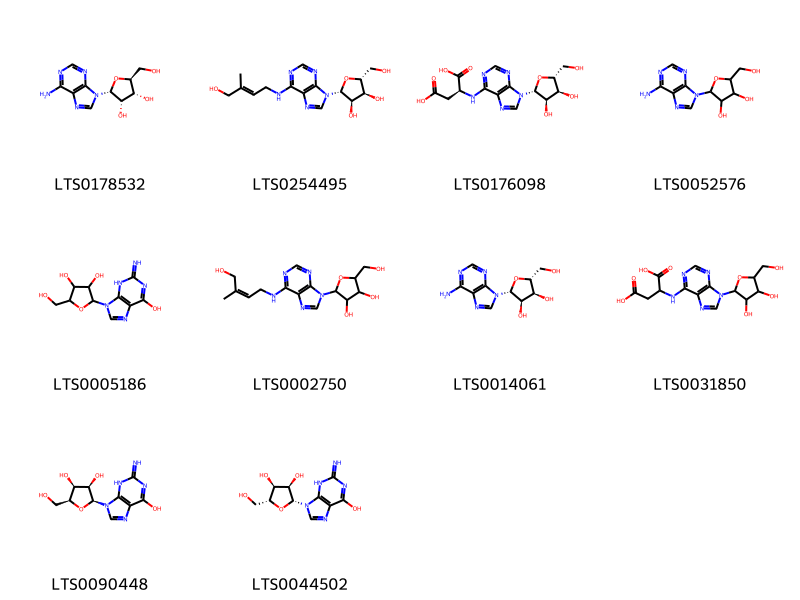{ width=100% }
    <figcaption>Hình ảnh cấu trúc hóa học của 10 hoạt chất thuộc nhóm Purine nucleosides gồm ['(2r,3s,4r,5s)-2-(6-aminopurin-9-yl)-5-(hydroxymethyl)oxolane-3,4-diol (LTS0178532)', 'zeatin riboside (LTS0254495)', 'atp - adenosine triphosphate (LTS0176098)', 'adenosine (LTS0052576)', '2-(6-hydroxy-2-imino-3h-purin-9-yl)-5-(hydroxymethyl)oxolane-3,4-diol (LTS0005186)', '2-{6-[(4-hydroxy-3-methylbut-2-en-1-yl)amino]purin-9-yl}-5-(hydroxymethyl)oxolane-3,4-diol (LTS0002750)', 'adenosine (LTS0014061)', '2-({9-[3,4-dihydroxy-5-(hydroxymethyl)oxolan-2-yl]purin-6-yl}amino)butanedioic acid (LTS0031850)', '(2s,3r,4s,5s)-2-(6-hydroxy-2-imino-3h-purin-9-yl)-5-(hydroxymethyl)oxolane-3,4-diol (LTS0090448)', 'ribonucleoside (LTS0044502)'].</figcaption>
</figure>
### Nhóm Pyrans
<figure markdown="span">
    { width=100% }
    <figcaption>Hình ảnh cấu trúc hóa học của 1 hoạt chất thuộc nhóm Pyrans gồm ['chelidonic acid (LTS0084071)'].</figcaption>
</figure>
### Nhóm Pyrrolines
<figure markdown="span">
    { width=100% }
    <figcaption>Hình ảnh cấu trúc hóa học của 1 hoạt chất thuộc nhóm Pyrrolines gồm ['3-(2,3-dihydropyrrol-1-yl)propan-1-amine (LTS0060475)'].</figcaption>
</figure>
### Nhóm Quinolines and derivatives
<figure markdown="span">
    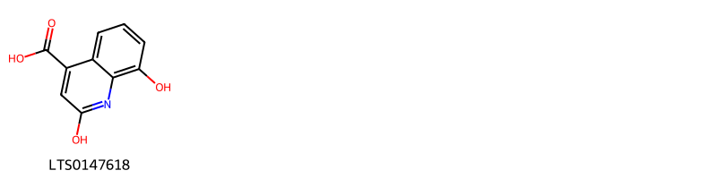{ width=100% }
    <figcaption>Hình ảnh cấu trúc hóa học của 1 hoạt chất thuộc nhóm Quinolines and derivatives gồm ['2,8-dihydroxyquinoline-4-carboxylic acid (LTS0147618)'].</figcaption>
</figure>
### Nhóm Steroids and steroid derivatives
<figure markdown="span">
    { width=100% }
    <figcaption>Hình ảnh cấu trúc hóa học của 129 hoạt chất thuộc nhóm Steroids and steroid derivatives gồm ['(1r,3ar,5as,7s,9as,9br,11ar)-1-[(2r,5r)-5,6-dimethylheptan-2-yl]-9a,11a-dimethyl-1h,2h,3h,3ah,5h,5ah,6h,7h,8h,9h,9bh,10h,11h-cyclopenta[a]phenanthren-7-ol (LTS0127706)', '1-(5-ethyl-6-methylheptan-2-yl)-7-hydroxy-9a,11a-dimethyl-1h,2h,3h,3ah,3bh,6h,7h,8h,9h,9bh,10h,11h-cyclopenta[a]phenanthren-4-one (LTS0132900)', '1-(5,6-dimethylhept-4-en-2-yl)-9a,11a-dimethyl-1h,2h,3h,3ah,3bh,4h,6h,7h,8h,9h,9bh,10h,11h-cyclopenta[a]phenanthren-7-ol (LTS0205458)', 'castasterone (LTS0111493)', 'stigmast-5-en-3-ol (LTS0071224)', 'delta7-avenasterol (LTS0199292)', '(1r,3as,3bs,7s,9ar,9bs,11ar)-9a,11a-dimethyl-1-[(2r)-6-methyl-5-methylideneheptan-2-yl]-1h,2h,3h,3ah,3bh,4h,6h,7h,8h,9h,9bh,10h,11h-cyclopenta[a]phenanthren-7-yl acetate (LTS0085151)', '(1r,3ar,5as,7s,9as,9br,11ar)-1-[(2r,4e)-5,6-dimethylhept-4-en-2-yl]-9a,11a-dimethyl-1h,2h,3h,3ah,5h,5ah,6h,7h,8h,9h,9bh,10h,11h-cyclopenta[a]phenanthren-7-yl acetate (LTS0071811)', '(1r,3ar,5as,6s,7s,9as,9br,11ar)-1-[(2r,4e)-5,6-dimethylhept-4-en-2-yl]-6,9a,11a-trimethyl-1h,2h,3h,3ah,5h,5ah,6h,7h,8h,9h,9bh,10h,11h-cyclopenta[a]phenanthren-7-yl acetate (LTS0077490)', 'cholesteryl acetate (LTS0080498)', '6,9a,11a-trimethyl-1-(6-methylheptan-2-yl)-1h,2h,3h,3ah,5h,5ah,6h,7h,8h,9h,9bh,10h,11h-cyclopenta[a]phenanthren-7-yl acetate (LTS0045283)', '1-(5,6-dimethylhept-4-en-2-yl)-9a,11a-dimethyl-1h,2h,3h,3ah,5h,5ah,6h,7h,8h,9h,9bh,10h,11h-cyclopenta[a]phenanthren-7-ol (LTS0103355)', '6-deoxoteasterone (LTS0090422)', 'teasterone (LTS0028563)', '2,3-dimethyl 4,5-bis(benzoyloxy)-7-ethenyl-8a,9-dihydroxy-1,1,4a,7-tetramethyl-8-oxo-octahydro-2h-phenanthrene-2,3-dicarboxylate (LTS0167819)', 'sitosterol (LTS0168132)', 'avenasterol (LTS0103350)', '1-(5-ethyl-6-methylhept-5-en-2-yl)-9a,11a-dimethyl-1h,2h,3h,3ah,3bh,4h,6h,7h,8h,9h,9bh,10h,11h-cyclopenta[a]phenanthren-7-ol (LTS0033754)', '1-(5-ethyl-6-methylhept-6-en-2-yl)-9a,11a-dimethyl-1h,2h,3h,3ah,3bh,4h,6h,7h,8h,9h,9bh,10h,11h-cyclopenta[a]phenanthren-7-ol (LTS0067478)', '7β-hydroxysitosterol (LTS0119261)', '9a,11a-dimethyl-1-(6-methylheptan-2-yl)-tetradecahydro-1h-cyclopenta[a]phenanthren-7-yl acetate (LTS0118479)', '1-(5,6-dimethylhept-6-en-2-yl)-9a,11a-dimethyl-1h,2h,3h,3ah,3bh,4h,6h,7h,8h,9h,9bh,10h,11h-cyclopenta[a]phenanthren-7-ol (LTS0184081)', '9a,11a-dimethyl-1-(6-methyl-5-methylideneheptan-2-yl)-1h,2h,3h,3ah,3bh,4h,6h,7h,8h,9h,9bh,10h,11h-cyclopenta[a]phenanthren-7-ol (LTS0204366)', '24-α-methylcholesterol (LTS0106857)', '(1r,3bs,5as,7s,9ar,9bs,11as)-1-[(2s,3r,4r,5s)-3,4-dihydroxy-5,6-dimethylheptan-2-yl]-7-hydroxy-9a,11a-dimethyl-tetradecahydrocyclopenta[a]phenanthren-5-one (LTS0053235)', '1-(5,6-dimethylhept-4-en-2-yl)-9a,11a-dimethyl-1h,2h,3h,3ah,3bh,4h,6h,7h,8h,9h,9bh,10h,11h-cyclopenta[a]phenanthren-7-yl acetate (LTS0034959)', '2-{7-hydroxy-9a,11a-dimethyl-tetradecahydro-1h-cyclopenta[a]phenanthren-1-yl}-5,6-dimethylheptan-3-ol (LTS0249062)', '1-(5-ethyl-6-methylheptan-2-yl)-9a,11a-dimethyl-1h,2h,3h,3ah,5h,5ah,6h,7h,8h,9h,9bh,10h,11h-cyclopenta[a]phenanthren-7-ol (LTS0266132)', 'stigmast-5-en-3-ol, (3β)- (LTS0204616)', '22,23-dihydrobrassicasterol (LTS0204629)', '(1s,3r,6s,8r,11s,12s,15r,16r)-15-[(2r,4e)-5,6-dimethylhept-4-en-2-yl]-7,7,12,16-tetramethylpentacyclo[9.7.0.0¹,³.0³,⁸.0¹²,¹⁶]octadecan-6-yl acetate (LTS0139288)', '1-(5,6-dimethylhept-3-en-2-yl)-9a,11a-dimethyl-1h,2h,3h,3ah,3bh,4h,6h,7h,8h,9h,9bh,10h,11h-cyclopenta[a]phenanthren-7-ol (LTS0137934)', '(1s,3r,6s,8r,11s,12s,15r,16r)-7,7,12,16-tetramethyl-15-[(2r)-6-methyl-5-methylideneheptan-2-yl]pentacyclo[9.7.0.0¹,³.0³,⁸.0¹²,¹⁶]octadecan-6-yl acetate (LTS0199596)', '(1r,3as,3bs,5as,7s,9ar,9bs,11ar)-1-[(2s,3r,4r,5s)-3,4-dihydroxy-5,6-dimethylheptan-2-yl]-7-hydroxy-9a,11a-dimethyl-tetradecahydrocyclopenta[a]phenanthren-5-one (LTS0155239)', '7,7,12,16-tetramethyl-15-(6-methyl-5-methylideneheptan-2-yl)pentacyclo[9.7.0.0¹,³.0³,⁸.0¹²,¹⁶]octadecan-6-yl acetate (LTS0163383)', '(1s,3r,6s,8s,11s,12s,15r,16r)-15-[(2r,5r)-5,6-dimethylheptan-2-yl]-12,16-dimethylpentacyclo[9.7.0.0¹,³.0³,⁸.0¹²,¹⁶]octadecan-6-ol (LTS0146791)', '1-(5,6-dimethylheptan-2-yl)-9a,11a-dimethyl-tetradecahydro-1h-cyclopenta[a]phenanthren-7-ol (LTS0078929)', '(1r,3ar,5as,7s,9as,9br,11ar)-1-[(2r,4e)-5,6-dimethylhept-4-en-2-yl]-9a,11a-dimethyl-1h,2h,3h,3ah,5h,5ah,6h,7h,8h,9h,9bh,10h,11h-cyclopenta[a]phenanthren-7-ol (LTS0237783)', '7,12,16-trimethyl-15-(6-methyl-5-methylideneheptan-2-yl)pentacyclo[9.7.0.0¹,³.0³,⁸.0¹²,¹⁶]octadecan-6-yl acetate (LTS0095008)', '15-(5,6-dimethylhept-6-en-2-yl)-7,7,12,16-tetramethylpentacyclo[9.7.0.0¹,³.0³,⁸.0¹²,¹⁶]octadecan-6-yl acetate (LTS0238500)', '6-deoxotyphasterol (LTS0115342)', 'campesteryl acetate (LTS0088991)', '(1r,3as,3br,5as,7s,9as,9bs,11ar)-9a,11a-dimethyl-1-[(2r)-6-methylheptan-2-yl]-tetradecahydro-1h-cyclopenta[a]phenanthren-7-yl acetate (LTS0157338)', '15-(5,6-dimethylhept-6-en-2-yl)-7,7,12,16-tetramethylpentacyclo[9.7.0.0¹,³.0³,⁸.0¹²,¹⁶]octadecan-6-ol (LTS0091769)', 'stigmasta-5,24-dien-3β-ol (LTS0089699)', 'lathosterol (LTS0229886)', '(1r,3as,3br,5as,7s,9as,9bs,11ar)-1-[(2r,5r)-5,6-dimethylheptan-2-yl]-9a,11a-dimethyl-tetradecahydro-1h-cyclopenta[a]phenanthren-7-yl (2e)-3-(4-hydroxyphenyl)prop-2-enoate (LTS0180240)', '(1r,3as,3bs,7s,9ar,9bs,11ar)-1-[(2r,4e)-5,6-dimethylhept-4-en-2-yl]-9a,11a-dimethyl-1h,2h,3h,3ah,3bh,4h,6h,7h,8h,9h,9bh,10h,11h-cyclopenta[a]phenanthren-7-ol (LTS0104153)', '(1r,3ar,5as,6s,7s,9as,11ar)-3a,6,9a,11a-tetramethyl-1-[(2r)-6-methyl-5-methylideneheptan-2-yl]-1h,2h,3h,4h,5h,5ah,6h,7h,8h,9h,10h,11h-cyclopenta[a]phenanthren-7-yl acetate (LTS0265517)', 'fucosterol (LTS0178887)', '(3ar,3br,9ar,9bs,11ar)-1-(5-ethyl-6-methylheptan-2-yl)-9a,11a-dimethyl-1h,2h,3h,3ah,3bh,4h,6h,7h,8h,9h,9bh,10h,11h-cyclopenta[a]phenanthren-7-ol (LTS0126002)', '(1r,3as,3bs,5as,7r,9ar,9bs,11ar)-1-[(2s,3r,4r,5s)-3,4-dihydroxy-5,6-dimethylheptan-2-yl]-7-hydroxy-9a,11a-dimethyl-tetradecahydrocyclopenta[a]phenanthren-5-one (LTS0173949)', 'cycloartanol (LTS0176903)', '(1r,3ar,5as,7s,9as,9br,11ar)-9a,11a-dimethyl-1-[(2r)-6-methyl-5-methylideneheptan-2-yl]-1h,2h,3h,3ah,5h,5ah,6h,7h,8h,9h,9bh,10h,11h-cyclopenta[a]phenanthren-7-yl acetate (LTS0090612)', '7,7,12,16-tetramethyl-15-(6-methyl-5-methylideneheptan-2-yl)pentacyclo[9.7.0.0¹,³.0³,⁸.0¹²,¹⁶]octadec-8-en-6-ol (LTS0259188)', 'fecosterol (LTS0185843)', '3a,6,9a,11a-tetramethyl-1-(6-methyl-5-methylideneheptan-2-yl)-1h,2h,3h,4h,5h,5ah,6h,7h,8h,9h,10h,11h-cyclopenta[a]phenanthren-7-yl acetate (LTS0190745)', '1-(5,6-dimethylhept-4-en-2-yl)-9a,11a-dimethyl-1h,2h,3h,3ah,5h,5ah,6h,7h,8h,9h,9bh,10h,11h-cyclopenta[a]phenanthren-7-yl acetate (LTS0190875)', '1-(5,6-dimethylhept-6-en-2-yl)-9a,11a-dimethyl-1h,2h,3h,3ah,3bh,4h,6h,7h,8h,9h,9bh,10h,11h-cyclopenta[a]phenanthren-7-yl acetate (LTS0261913)', '(1r,3as,3bs,7s,9ar,9bs,11ar)-1-[(2r,5s)-5-ethyl-6-methylhept-6-en-2-yl]-9a,11a-dimethyl-1h,2h,3h,3ah,3bh,4h,6h,7h,8h,9h,9bh,10h,11h-cyclopenta[a]phenanthren-7-ol (LTS0190573)', '(3r,6s,8r,11s,12s,15r,16r)-7,7,12,16-tetramethyl-15-[(2r)-6-methylhept-5-en-2-yl]pentacyclo[9.7.0.0¹,³.0³,⁸.0¹²,¹⁶]octadecan-6-ol (LTS0062833)', '2-{7-hydroxy-9a,11a-dimethyl-tetradecahydro-1h-cyclopenta[a]phenanthren-1-yl}-5,6-dimethylheptane-3,4-diol (LTS0234823)', '1-(5,6-dimethylhept-5-en-2-yl)-9a,11a-dimethyl-1h,2h,3h,3ah,3bh,4h,6h,7h,8h,9h,9bh,10h,11h-cyclopenta[a]phenanthren-7-yl acetate (LTS0102962)', '2,3-dimethyl (2r,3s,4s,4as,4bs,5r,7r,8ar,9r,10as)-4,5-bis(benzoyloxy)-7-ethenyl-8a,9-dihydroxy-1,1,4a,7-tetramethyl-8-oxo-octahydro-2h-phenanthrene-2,3-dicarboxylate (LTS0214933)', 'episterol (LTS0072150)', '1-(5-ethyl-6-methylheptan-2-yl)-9a,11a-dimethyl-1h,2h,3h,3ah,3bh,4h,5h,8h,9h,9bh,10h,11h-cyclopenta[a]phenanthren-7-one (LTS0212002)', '24-α-ethylcholesterol (LTS0232294)', 'cycloartenol (LTS0060131)', '7,7,12,16-tetramethyl-15-(6-methyl-5-methylideneheptan-2-yl)pentacyclo[9.7.0.0¹,³.0³,⁸.0¹²,¹⁶]octadecan-6-ol (LTS0084326)', '1-(5-isopropylhept-5-en-2-yl)-9a,11a-dimethyl-1h,2h,3h,3ah,3bh,4h,6h,7h,8h,9h,9bh,10h,11h-cyclopenta[a]phenanthren-7-ol (LTS0210884)', '(1s,3r,6s,8r,11s,12s,15r,16r)-7,7,12,16-tetramethyl-15-[(2r)-6-methylhept-5-en-2-yl]pentacyclo[9.7.0.0¹,³.0³,⁸.0¹²,¹⁶]octadecan-6-yl acetate (LTS0217131)', '(1s,3r,6s,7s,8s,11s,12s,15r,16r)-7,12,16-trimethyl-15-[(2r)-6-methyl-5-methylideneheptan-2-yl]pentacyclo[9.7.0.0¹,³.0³,⁸.0¹²,¹⁶]octadecan-6-yl acetate (LTS0230221)', '9a,11a-dimethyl-1-(6-methyl-5-methylideneheptan-2-yl)-1h,2h,3h,3ah,5h,5ah,6h,7h,8h,9h,9bh,10h,11h-cyclopenta[a]phenanthren-7-yl acetate (LTS0211208)', 'campestanyl ferulate (LTS0219822)', '1-(5,6-dimethylhept-3-en-2-yl)-9a,11a-dimethyl-1h,2h,3h,3ah,3bh,4h,6h,7h,8h,9h,9bh,10h,11h-cyclopenta[a]phenanthren-7-yl acetate (LTS0221626)', 'cyclolaudenol (LTS0231558)', 'coprostanol (LTS0165323)', '1-(5-ethyl-6-methylhept-3-en-2-yl)-9a,11a-dimethyl-tetradecahydro-1h-cyclopenta[a]phenanthren-7-ol (LTS0217688)', 'β-sitostenone (LTS0049492)', '(1s,3r,6s,8r,11s,12s,15r,16r)-15-[(2r,5s)-5,6-dimethylhept-6-en-2-yl]-7,7,12,16-tetramethylpentacyclo[9.7.0.0¹,³.0³,⁸.0¹²,¹⁶]octadecan-6-yl acetate (LTS0230214)', '(1s,3r,6s,8s,11s,12s,15r,16r)-12,16-dimethyl-15-(6-methyl-5-methylideneheptan-2-yl)pentacyclo[9.7.0.0¹,³.0³,⁸.0¹²,¹⁶]octadecan-6-ol (LTS0232772)', 'campestanol (LTS0233243)', '9a,11a-dimethyl-1-(6-methyl-5-methylideneheptan-2-yl)-1h,2h,3h,3ah,3bh,4h,6h,7h,8h,9h,9bh,10h,11h-cyclopenta[a]phenanthren-7-yl acetate (LTS0231831)', '(1r,3as,3bs,7s,9ar,9bs,11ar)-1-[(2r,5s)-5,6-dimethylhept-6-en-2-yl]-9a,11a-dimethyl-1h,2h,3h,3ah,3bh,4h,6h,7h,8h,9h,9bh,10h,11h-cyclopenta[a]phenanthren-7-ol (LTS0000507)', '1-(5-ethyl-6-methylheptan-2-yl)-9a,11a-dimethyl-1h,2h,3h,3ah,3bh,4h,6h,7h,8h,9h,9bh,10h,11h-cyclopenta[a]phenanthrene-4,7-diol (LTS0170874)', '(1r,3as,3bs,7s,9ar,9bs,11ar)-1-[(2s,3e,5s)-5-ethyl-6-methylhept-3-en-2-yl]-9a,11a-dimethyl-1h,2h,3h,3ah,3bh,4h,6h,7h,8h,9h,9bh,10h,11h-cyclopenta[a]phenanthren-7-ol (LTS0169213)', '(1r,3as,3bs,7s,9ar,9bs,11ar)-1-[(2r,4e)-5,6-dimethylhept-4-en-2-yl]-9a,11a-dimethyl-1h,2h,3h,3ah,3bh,4h,6h,7h,8h,9h,9bh,10h,11h-cyclopenta[a]phenanthren-7-yl acetate (LTS0168064)', 'cholesteryl acetate (LTS0004289)', 'campesterol (LTS0029429)', '1-(5,6-dimethylhept-4-en-2-yl)-6,9a,11a-trimethyl-1h,2h,3h,3ah,5h,5ah,6h,7h,8h,9h,9bh,10h,11h-cyclopenta[a]phenanthren-7-yl acetate (LTS0043893)', 'avenasterol (LTS0237196)', '9a,11a-dimethyl-1-(6-methyl-5-methylideneheptan-2-yl)-1h,2h,3h,3ah,5h,5ah,6h,7h,8h,9h,9bh,10h,11h-cyclopenta[a]phenanthren-7-ol (LTS0055082)', 'phytosterol (LTS0029311)', '(1r,3as,3bs,7s,9ar,9bs,11ar)-1-[(2r,5s)-5,6-dimethylhept-6-en-2-yl]-9a,11a-dimethyl-1h,2h,3h,3ah,3bh,4h,6h,7h,8h,9h,9bh,10h,11h-cyclopenta[a]phenanthren-7-yl acetate (LTS0250493)', 'typhasterol (LTS0030045)', '(1r,3as,3bs,7s,9ar,9bs,11ar)-1-[(2r,3e,5r)-5,6-dimethylhept-3-en-2-yl]-9a,11a-dimethyl-1h,2h,3h,3ah,3bh,4h,6h,7h,8h,9h,9bh,10h,11h-cyclopenta[a]phenanthren-7-yl acetate (LTS0173928)', 'stigmasterol (LTS0024262)', '(1r,3as,3bs,7s,9ar,9bs,11ar)-1-[(2r,5s)-5,6-dimethylheptan-2-yl]-9a,11a-dimethyl-1h,2h,3h,3ah,3bh,4h,6h,7h,8h,9h,9bh,10h,11h-cyclopenta[a]phenanthren-7-yl acetate (LTS0243478)', 'dihydrocholesterol (LTS0048168)', '(3β,5α)-stigmast-7-en-3-ol (LTS0245097)', '(1r,3as,3br,5as,7s,9as,9bs,11ar)-1-[(2r,3e,5s)-5-ethyl-6-methylhept-3-en-2-yl]-9a,11a-dimethyl-tetradecahydro-1h-cyclopenta[a]phenanthren-7-ol (LTS0245732)', '(1r,3as,3bs,7s,9bs)-1-[(2r,5r)-5,6-dimethylheptan-2-yl]-9a,11a-dimethyl-1h,2h,3h,3ah,3bh,4h,6h,7h,8h,9h,9bh,10h,11h-cyclopenta[a]phenanthren-7-ol (LTS0057877)', 'campesterol (LTS0046755)', 'cycloartenol (LTS0269561)', '(1r,3as,3bs,7s,9ar,9bs,11ar)-1-[(2r)-5,6-dimethylhept-5-en-2-yl]-9a,11a-dimethyl-1h,2h,3h,3ah,3bh,4h,6h,7h,8h,9h,9bh,10h,11h-cyclopenta[a]phenanthren-7-yl acetate (LTS0039572)', '6-deoxocathasterone (LTS0015048)', '(1r,3ar,5as,6s,7s,9as,9br,11ar)-1-[(2r,5r)-5,6-dimethylheptan-2-yl]-6,9a,11a-trimethyl-1h,2h,3h,3ah,5h,5ah,6h,7h,8h,9h,9bh,10h,11h-cyclopenta[a]phenanthren-7-yl acetate (LTS0031913)', '(1r,3as,3bs,7s,9ar,9bs,11ar)-1-[(2r,5r)-5-ethyl-6-methylheptan-2-yl]-7-hydroxy-9a,11a-dimethyl-1h,2h,3h,3ah,3bh,6h,7h,8h,9h,9bh,10h,11h-cyclopenta[a]phenanthren-4-one (LTS0030881)', '15-(5,6-dimethylhept-4-en-2-yl)-7,7,12,16-tetramethylpentacyclo[9.7.0.0¹,³.0³,⁸.0¹²,¹⁶]octadecan-6-ol (LTS0063057)', '(1r,3ar,5as,6s,7s,9as,9br,11ar)-6,9a,11a-trimethyl-1-[(2r)-6-methylheptan-2-yl]-1h,2h,3h,3ah,5h,5ah,6h,7h,8h,9h,9bh,10h,11h-cyclopenta[a]phenanthren-7-yl acetate (LTS0014587)', '1-(5,6-dimethylheptan-2-yl)-9a,11a-dimethyl-tetradecahydro-1h-cyclopenta[a]phenanthren-7-yl acetate (LTS0003789)', '24-methylenecholesterol (LTS0016921)', 'brassicasterol (LTS0014226)', '1-(3,4-dihydroxy-5,6-dimethylheptan-2-yl)-7,8-dihydroxy-9a,11a-dimethyl-tetradecahydrocyclopenta[a]phenanthren-5-one (LTS0020071)', 'epicholestrol (LTS0000908)', 'fungisterol (LTS0020786)', '1-(5,6-dimethylheptan-2-yl)-9a,11a-dimethyl-1h,2h,3h,3ah,3bh,4h,6h,7h,8h,9h,9bh,10h,11h-cyclopenta[a]phenanthren-7-yl acetate (LTS0239510)', '24-methylenecycloartanol (LTS0018584)', '1-(5,6-dimethylheptan-2-yl)-6,9a,11a-trimethyl-1h,2h,3h,3ah,5h,5ah,6h,7h,8h,9h,9bh,10h,11h-cyclopenta[a]phenanthren-7-yl acetate (LTS0233166)', '15-(5,6-dimethylhept-4-en-2-yl)-7,7,12,16-tetramethylpentacyclo[9.7.0.0¹,³.0³,⁸.0¹²,¹⁶]octadecan-6-yl acetate (LTS0235740)', 'cholesterol (LTS0102304)', '(1r,3as,3br,5as,7s,9as,9bs,11ar)-1-[(2r,5r)-5,6-dimethylheptan-2-yl]-9a,11a-dimethyl-tetradecahydro-1h-cyclopenta[a]phenanthren-7-yl acetate (LTS0257745)', '7,7,12,16-tetramethyl-15-(6-methylhept-5-en-2-yl)pentacyclo[9.7.0.0¹,³.0³,⁸.0¹²,¹⁶]octadecan-6-yl acetate (LTS0026455)', '24-ethyl coprostanol (LTS0045337)', 'stigmastanol (LTS0110500)', 'cycloeucalenol (LTS0125739)', '(1s,3r,6s,8r,11s,12s,15r,16r)-15-[(2r,4e)-5,6-dimethylhept-4-en-2-yl]-7,7,12,16-tetramethylpentacyclo[9.7.0.0¹,³.0³,⁸.0¹²,¹⁶]octadecan-6-ol (LTS0245021)', '(1r,3ar,5as,6s,7s,9as,11ar)-3a,6,9a,11a-tetramethyl-1-[(2r)-6-methyl-5-methylideneheptan-2-yl]-1h,2h,3h,4h,5h,5ah,6h,7h,8h,9h,10h,11h-cyclopenta[a]phenanthren-7-ol (LTS0243203)', '(1r,3as,3bs,4s,7s,9ar,9bs,11ar)-1-[(2r,5r)-5-ethyl-6-methylheptan-2-yl]-9a,11a-dimethyl-1h,2h,3h,3ah,3bh,4h,6h,7h,8h,9h,9bh,10h,11h-cyclopenta[a]phenanthrene-4,7-diol (LTS0256662)'].</figcaption>
</figure>
### Nhóm Stilbenes
<figure markdown="span">
    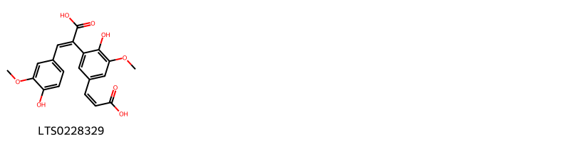{ width=100% }
    <figcaption>Hình ảnh cấu trúc hóa học của 1 hoạt chất thuộc nhóm Stilbenes gồm ['(2e)-2-{5-[(1z)-2-carboxyeth-1-en-1-yl]-2-hydroxy-3-methoxyphenyl}-3-(4-hydroxy-3-methoxyphenyl)prop-2-enoic acid (LTS0228329)'].</figcaption>
</figure>
### Nhóm Unsaturated hydrocarbons
<figure markdown="span">
    { width=100% }
    <figcaption>Hình ảnh cấu trúc hóa học của 1 hoạt chất thuộc nhóm Unsaturated hydrocarbons gồm ['bazzanene (LTS0080333)'].</figcaption>
</figure>

---

## Tác dụng dược lý

Theo tài liệu Tài liệu khác:- Lợi tiểu
- Tăng thải trừ clorid
- Tăng bài tiết mật
- Làm giảm lượng bilirubin 
- Làm tăng lượng prothrombin trong máu và do đó làm máu chóng đông.

Theo tài liệu quốc tế: nan

---

## Dược điển Việt Nam V

### Soi bột:
nan
<!-- Hình ảnh soi bột sẽ được tự động chèn vào đây sau -->
### Vi phẫu:
nan
<!-- Hình ảnh vi phẫu sẽ được tự động chèn vào đây sau -->
### Định tính

nan

### Định lượng

nan

### Thông tin khác 
- ** Độ ẩm: ** nan

- ** Bảo quản:** nan
## Dược điển Hồng kong

<!-- PDF sẽ được tự động chèn vào đây sau -->

---

## Y dược học cổ truyền

- **Tên vị thuốc:** nan
- **Tính vị quy kinh:** Vị ngọt. Tính bình. Vào kinh thận và bàng quang.
- **Công năng chủ trị:** Lợi tiểu, thông mật, hạ huyết áp, hạ đường huyết, cầm máu.
Chủ trị: Tiểu tiện buốt, dắt; nước tiểu vàng đỏ, sỏi đường tiết niệu, viêm gan, viêm túi mật, sỏi mật, tăng huyết áp, tiểu đường, chảy máu cam.
- **Chú ý:** nan
- **Kiêng kỵ:** nan

