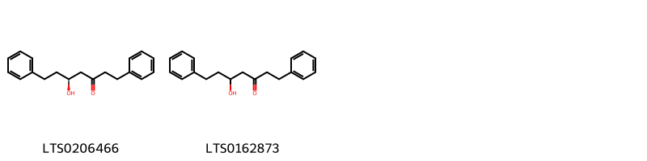
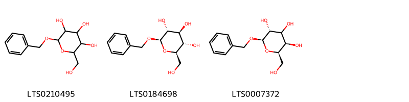
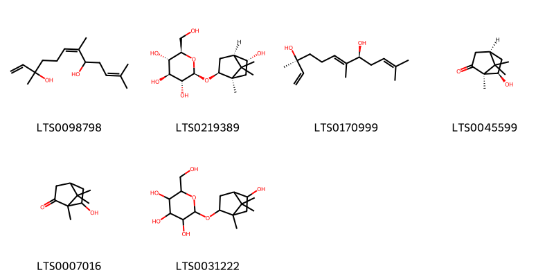

!!! abstract "Tóm tắt"
    Sa nhân là cây thân thảo, tên khoa học là Amomum villosum Lour thuộc họ Gừng (Zingiberaceae). Phân bố ở Đông Nam Trung Quốc, Lào, Thái Lan, Việt Nam. Tại Việt Nam, sa nhân mọc hoang và được trồng ở nhiều tỉnh miền núi nước ta, miền Bắc cũng như miền Trung. Theo tài liệu cổ, nhân có vị cay, tính ôn, vào các kinh tỳ, thận và vị, có tác dụng hành khí, điều trung, hòa vị, làm cho tiêu hóa được dễ dàng. Dùng trong những trường hợp đau bụng, đầy bụng, ăn không tiêu, tả lỵ. Một số thành phần hóa học đã được phát hiện và xác định cấu trúc của Saponin và tinh dầu.

## Thông tin về thực vật

### Đặc điểm thực vật

Dược liệu **Sa Nhân (Quả)** từ bộ phận **nan** từ loài *Amomum villosum Lour* thuộc họ Zingiberaceae. Sa nhân là một loại cỏ có thể cao tới 2-3m, gần giống cây riềng nhưng thân rễ không phát triển thành củ như riềng. Lá xanh thẫm, mặt nhẫn bóng, dài 15-35cm, rộng 4-7cm.
Hoa màu trắng đốm tía, mọc thành chùm ở gốc; từ rễ nảy ra một mầm, ngọn mang hoa gần sát mặt đất, mỗi gốc 3-6 chùm hoa, mỗi chùm 4-6 hoa. Quả là một nang 3 ngăn, đậu vào tháng 5, chín vào tháng 7-8 (6-7 âm lịch), hình trứng, to nhất bằng đầu ngón tay cái, trung bình bằng đầu ngón tay giữa, dài 1,5-2cm, đường kính 1- 1,5cm. Mặt ngoài vỏ có gai rất đều, không có cái cao cái thấp, kẽ gai cũng đều nhau, bóp mạnh sẽ vỡ thành 3 mảnh. Hạt dính theo lối đính phôi trung trụ. Mùa hoa: tháng 4-5. 

!!! info "Phân loại thực vật của *Wurfbainia villosa*"
    - **Kingdom:** Plantae
    - **Phylum:** Tracheophyta
    - **Order:** Zingiberales
    - **Family:** Zingiberaceae
    - **Genus:** Wurfbainia
    - **Species:** *Wurfbainia villosa*

*Tài liệu tham khảo:* "Những cây thuốc và vị thuốc Việt Nam" - Đỗ Tất Lợi

 

### Loài thay thế (Nếu có)

Dược liệu này cũng có thể từ loài *Amomum longiligulare T. L. Wu*, thông tin về phân loại thực vật loài này như sau:
!!! info "Thông tin về phân loại thực vật của *Wurfbainia longiligularis*"
    - **kingdom:** Plantae
    - **phylum:** Tracheophyta
    - **order:** Zingiberales
    - **family:** Zingiberaceae
    - **genus:** Wurfbainia
    - **species:** *Wurfbainia longiligularis*

Hình ảnh của loài *Amomum longiligulare T. L. Wu*:

### Phân bố trên thế giới
**Từ vườn thực vật KEW: **: Native to:
China Southeast, Hainan, Laos, Thailand, Vietnam

**Từ CSDL GIBF** nan, Korea, Republic of, Myanmar, China, Viet Nam, United States of America, India, Lao People’s Democratic Republic

### Phân bố tại Việt Nam
** "Những cây thuốc và vị thuốc Việt Nam" - Đỗ Tất Lợi**: Sa nhân mọc hoang và được trồng ở nhiều tỉnh miền núi nước ta, miền Bắc cũng như miền Trung.

**Từ CSDL GIBF**: Lam Dong

---

## Thông tin về dược liệu 

### Định danh

!!! info "Thông tin về tên gọi của nan"
    - Dược liệu tiếng Việt: nan
    - Dược liệu tiếng Trung: nan (nan)
    - Dược liệu tiếng Anh: nan
    - Dược liệu latin thông dụng: nan
    - Dược liệu latin kiểu DĐVN: fructus amomi
    - Dược liệu latin kiểu DĐVN: nan
    - Dược liệu latin kiểu thông tư: nan
    - Bộ phận dùng: nan (nan)

### Mô tả dược liệu 
- **Theo dược điển Việt nam V:** nan

- **Mô tả dược liệu theo thông tư chế biến dược liệu theo phương pháp cổ truyền:** nan

### Chế biến 

- **Chế biến theo dược điển việt nam V**: nan

- **Chế biến theo thông tư:** nan

--- 

## Thành phần hóa học

- Theo tài liệu của GS. Đỗ Tất Lợi:  (1) Saponin và tinh dầu 2 – 3% gồm: D-camphor, D-borneol, D-bornylacetat, D-limonen
(2) Bornyl acetat
    
- Theo cơ sở dữ liệu lotus: Từ loài *Wurfbainia villosa* đã phân lập và xác định được 31 hoạt chất thuộc về các nhóm Tannins, Organooxygen compounds, Diarylheptanoids, Prenol lipids, Purine nucleosides. 

|    | chemicalTaxonomyClassyfireClass   |   smiles_count |
|---:|:----------------------------------|---------------:|
|  0 | Diarylheptanoids                  |              2 |
|  1 | Organooxygen compounds            |              3 |
|  2 | Prenol lipids                     |              6 |
|  3 | Purine nucleosides                |              2 |
|  4 | Tannins                           |              2 |

### Nhóm Diarylheptanoids
<figure markdown="span">
    { width=100% }
    <figcaption>Hình ảnh cấu trúc hóa học của 2 hoạt chất thuộc nhóm Diarylheptanoids gồm ['(5s)-5-hydroxy-1,7-diphenylheptan-3-one (LTS0206466)', '5-hydroxy-1,7-diphenylheptan-3-one (LTS0162873)'].</figcaption>
</figure>
### Nhóm Organooxygen compounds
<figure markdown="span">
    { width=100% }
    <figcaption>Hình ảnh cấu trúc hóa học của 3 hoạt chất thuộc nhóm Organooxygen compounds gồm ['benzyl glucopyranoside (LTS0210495)', 'benzyl β-d-glucoside (LTS0184698)', '(2r,3r,5r,6r)-2-(benzyloxy)-6-(hydroxymethyl)oxane-3,4,5-triol (LTS0007372)'].</figcaption>
</figure>
### Nhóm Prenol lipids
<figure markdown="span">
    { width=100% }
    <figcaption>Hình ảnh cấu trúc hóa học của 6 hoạt chất thuộc nhóm Prenol lipids gồm ['3,7,11-trimethyldodeca-1,6,10-triene-3,8-diol (LTS0098798)', '(2r,3r,4s,5s,6r)-2-{[(1r,2s,4r,5r)-5-hydroxy-1,7,7-trimethylbicyclo[2.2.1]heptan-2-yl]oxy}-6-(hydroxymethyl)oxane-3,4,5-triol (LTS0219389)', '(3s,6e,8s)-3,7,11-trimethyldodeca-1,6,10-triene-3,8-diol (LTS0170999)', '(+)-6-endo-hydroxycamphor (LTS0045599)', '6-hydroxycamphor (LTS0007016)', '2-({5-hydroxy-1,7,7-trimethylbicyclo[2.2.1]heptan-2-yl}oxy)-6-(hydroxymethyl)oxane-3,4,5-triol (LTS0031222)'].</figcaption>
</figure>
### Nhóm Purine nucleosides
<figure markdown="span">
    { width=100% }
    <figcaption>Hình ảnh cấu trúc hóa học của 2 hoạt chất thuộc nhóm Purine nucleosides gồm ['adenosine (LTS0052576)', 'adenosine (LTS0014061)'].</figcaption>
</figure>
### Nhóm Tannins
<figure markdown="span">
    { width=100% }
    <figcaption>Hình ảnh cấu trúc hóa học của 2 hoạt chất thuộc nhóm Tannins gồm ['3,4,5-trihydroxy-6-(hydroxymethyl)oxan-2-yl 4-hydroxy-3-methoxybenzoate (LTS0100270)', '1-o-vanilloyl-β-d-glucose (LTS0258367)'].</figcaption>
</figure>

---

## Tác dụng dược lý

Theo tài liệu "Những cây thuốc và vị thuốc Việt Nam" - Đỗ Tất Lợi:- Kháng khuẩn
- Kháng viêm
- Giảm đau
- Chống co thắt, Cải thiện chức năng dạ dàyTăng cường tuần hoàn máu

Theo tài liệu quốc tế: nan

---

## Dược điển Việt Nam V

### Soi bột:
nan
<!-- Hình ảnh soi bột sẽ được tự động chèn vào đây sau -->
### Vi phẫu:
nan
<!-- Hình ảnh vi phẫu sẽ được tự động chèn vào đây sau -->
### Định tính

nan

### Định lượng

nan

### Thông tin khác 
- ** Độ ẩm: ** nan

- ** Bảo quản:** nan
## Dược điển Hồng kong

<!-- PDF sẽ được tự động chèn vào đây sau -->

---

## Y dược học cổ truyền

- **Tên vị thuốc:** nan
- **Tính vị quy kinh:** Tân, ôn. Vào các kinh tỳ, vị thận.
- **Công năng chủ trị:** Hành khí hòa thấp, ôn trung tán hàn, khai vị tiêu thực, an thai.

Chủ trị: Ăn không tiêu, đau bụng lạnh, nôn mửa, tiêu chảy thuộc hàn, đau nhức xương khớp, cơ nhục, động thai.
- **Chú ý:** nan
- **Kiêng kỵ:** nan

