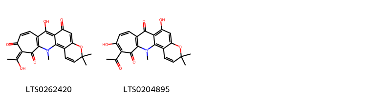
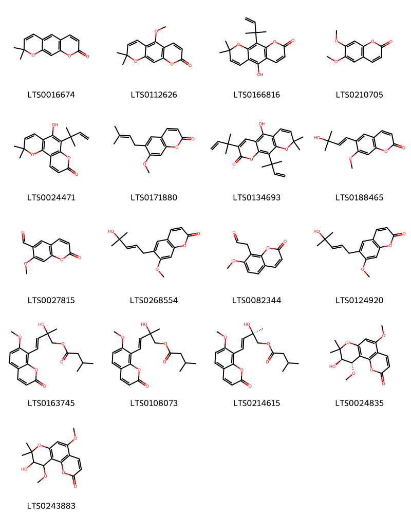
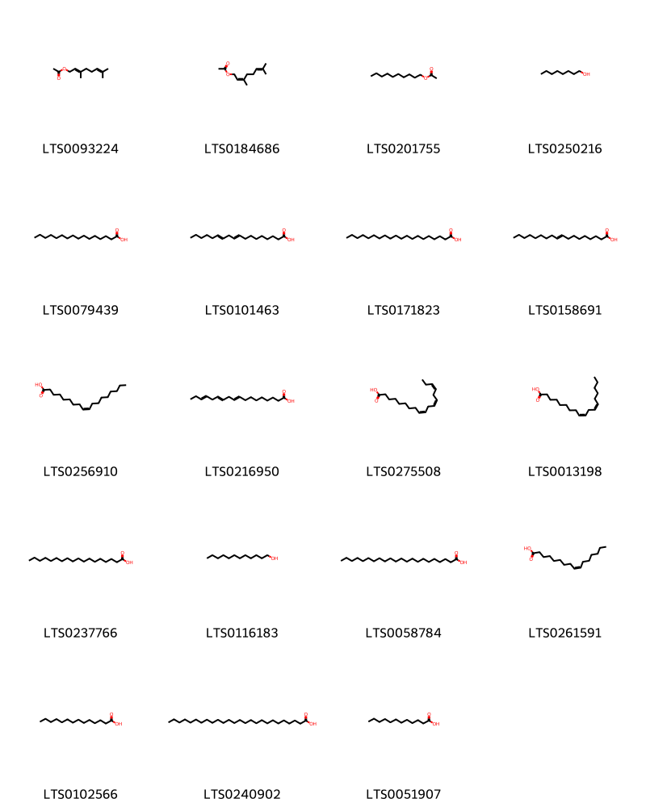
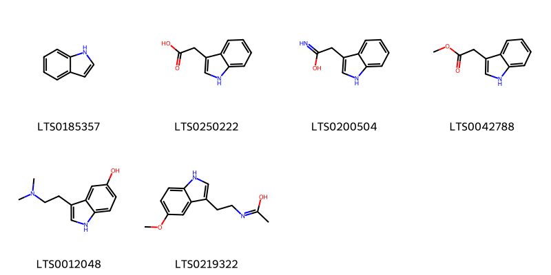
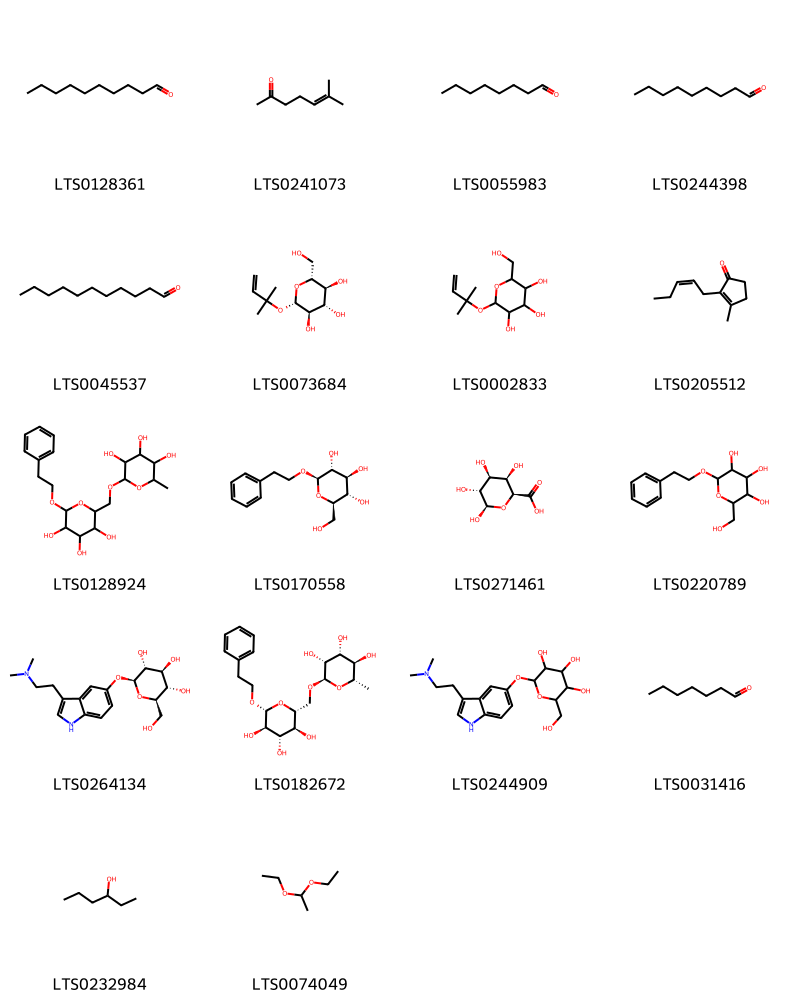
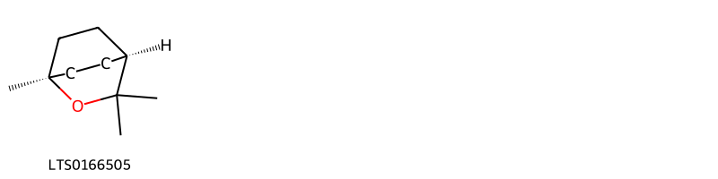
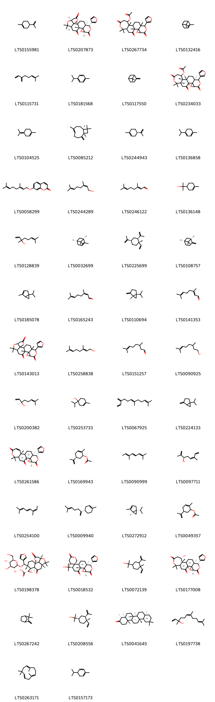
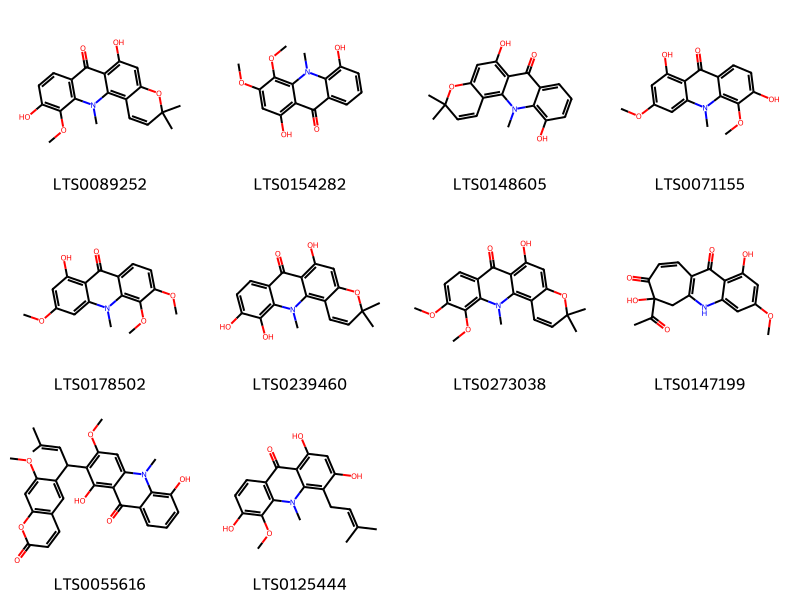
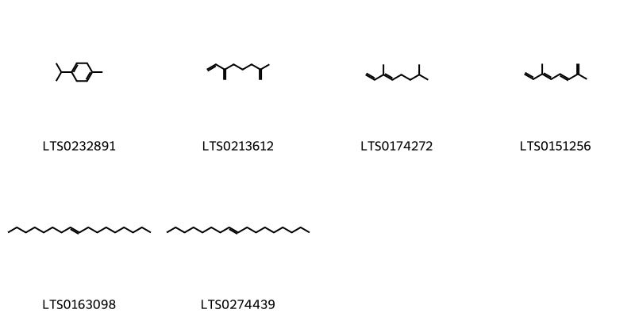

!!! abstract "Tóm tắt"
    Thanh bì là vỏ quả xanh hoặc vỏ chưa chín của Citrus reticulata Blanco (quýt) hoặc Citrus sinensis Osbeck (cam), thuộc họ Rutaceae (Họ Cam). Dược liệu phân bố rộng rãi ở Đông Nam Á và các vùng nhiệt đới, tại Việt Nam được trồng phổ biến ở nhiều địa phương. Thành phần chính gồm tinh dầu (limonene), flavonoid (hesperidin, naringin), có tác dụng kích thích tiêu hóa, giảm đầy hơi, chống viêm, kháng khuẩn, và hỗ trợ điều trị ho đờm. Trong y học cổ truyền, thanh bì được sử dụng để điều trị đau tức vùng hông sườn, kinh nguyệt không đều và rối loạn tiêu hóa.

## Thông tin về thực vật

### Đặc điểm thực vật

Dược liệu **Thanh Bì (Vỏ Quả Xanh)** từ bộ phận **nan** từ loài *Citrus reticulata Blanco* thuộc họ Rutaceae. Quít là một cây nhỏ, lá mọc so le, đơn, mép có răng cưa, vỏ có mùi thơm đặc biệt. Hoa nhỏ, màu trắng, mọc đơn độc ở kẽ lá. Quả hình cầu hai đầu dẹt, màu vàng cam hay vàng đỏ, vỏ mỏng nhẫn hay hơi sần sùi, dễ bóc. Mùi thơm ngon, nhiều hạt 

!!! info "Phân loại thực vật của *Citrus reticulata*"
    - **Kingdom:** Plantae
    - **Phylum:** Tracheophyta
    - **Order:** Sapindales
    - **Family:** Rutaceae
    - **Genus:** Citrus
    - **Species:** *Citrus reticulata*

*Tài liệu tham khảo:* "Những cây thuốc và vị thuốc Việt Nam" - Đỗ Tất Lợi

 

### Loài thay thế (Nếu có)

### Phân bố trên thế giới
**Từ vườn thực vật KEW: **: Thanh bì phân bố chủ yếu ở các vùng nhiệt đới và cận nhiệt đới, bao gồm Trung Quốc, Ấn Độ và các nước Đông Nam Á

**Từ CSDL GIBF** nan, Réunion, Benin, Australia, Spain, Croatia, Belgium, Norfolk Island, Cyprus, Nigeria, Germany, Madagascar, Guinea, Bhutan, Bolivia (Plurinational State of), Brazil, New Zealand, Angola, India, Mexico, Costa Rica, Italy, Seychelles, Greece, Nicaragua, Colombia, French Polynesia, China, Türkiye, Congo, Democratic Republic of the, Japan, Peru, Mayotte, Niue, El Salvador, United States of America, Portugal, France, Venezuela (Bolivarian Republic of), Canada

### Phân bố tại Việt Nam
** "Những cây thuốc và vị thuốc Việt Nam" - Đỗ Tất Lợi**: Được trồng ở khắp nơi trong nước ta. Nhiều nhất tại các tỉnh Nghệ An, Hà Tĩnh, Quảng Bình, Quảng Trị, Thừa Thiên, Nam Định, Hà Nam, Bắc Cạn, Thái Nguyên, Bắc Giang, Bắc Ninh v.v... Tại Trung Quốc, ngoài cây cùng loài với quít của ta, người ta còn trống một số loài quít khác và cũng cho vị trần bì và quất hạch như cây đại hồng cam (Citrus chachiensis hay Citrus nobilis var. chachiensis Wong), cây phúc quyết (Citrus tangeriana Hort et Tanaka hay Citrus reticulata var, deliciosa H. H. Hu) và cây châu quyết (Citrus erythrosa Tanaka hay Citrus reticulata Blanco var. erythrosa H. H. Hu). Ở Việt Nam, ngoài cây quít ngọt, ta còn dùng vỏ nhiều lọai cây quít khác chưa ai xác định tên khoa học, như quít giấy, quít tàu, quít nuốm,...

**Từ CSDL GIBF**: Không có ghi nhận ở Việt Nam

---

## Thông tin về dược liệu 

### Định danh

!!! info "Thông tin về tên gọi của nan"
    - Dược liệu tiếng Việt: nan
    - Dược liệu tiếng Trung: nan (nan)
    - Dược liệu tiếng Anh: nan
    - Dược liệu latin thông dụng: nan
    - Dược liệu latin kiểu DĐVN: pericarpium citri diliciosae
    - Dược liệu latin kiểu DĐVN: nan
    - Dược liệu latin kiểu thông tư: nan
    - Bộ phận dùng: nan (nan)

### Mô tả dược liệu 
- **Theo dược điển Việt nam V:** nan

- **Mô tả dược liệu theo thông tư chế biến dược liệu theo phương pháp cổ truyền:** nan

### Chế biến 

- **Chế biến theo dược điển việt nam V**: nan

- **Chế biến theo thông tư:** nan

--- 

## Thành phần hóa học

- Theo tài liệu của GS. Đỗ Tất Lợi:  (1)Nhóm hóa học: Flavonoid, alkaloid, tinh dầu.
(2)Tên hoạt chất:
Hesperidin và naringin là các biomarker chính trong dược liệu, có tác dụng chống viêm, kháng khuẩn.
    
- Theo cơ sở dữ liệu lotus: Từ loài *Citrus reticulata* đã phân lập và xác định được 402 hoạt chất thuộc về các nhóm Linear 1,3-diarylpropanoids, Lactones, Imidazopyrimidines, Benzopyrans, Coumarins and derivatives, Benzene and substituted derivatives, Indoles and derivatives, Dihydrofurans, Oxanes, Saccharolipids, Steroids and steroid derivatives, Phenols, Organooxygen compounds, Cyclobutane lignans, Fatty Acyls, Prenol lipids, Quinolines and derivatives, Saturated hydrocarbons, Carboxylic acids and derivatives, Naphthopyrans, Unsaturated hydrocarbons, Flavonoids. 

|    | chemicalTaxonomyClassyfireClass     |   smiles_count |
|---:|:------------------------------------|---------------:|
|  0 | Benzene and substituted derivatives |             14 |
|  1 | Benzopyrans                         |              2 |
|  2 | Carboxylic acids and derivatives    |             10 |
|  3 | Coumarins and derivatives           |             17 |
|  4 | Cyclobutane lignans                 |              2 |
|  5 | Dihydrofurans                       |              1 |
|  6 | Fatty Acyls                         |             19 |
|  7 | Flavonoids                          |             75 |
|  8 | Imidazopyrimidines                  |              1 |
|  9 | Indoles and derivatives             |              6 |
| 10 | Lactones                            |              1 |
| 11 | Linear 1,3-diarylpropanoids         |              2 |
| 12 | Naphthopyrans                       |              1 |
| 13 | Organooxygen compounds              |             18 |
| 14 | Oxanes                              |              1 |
| 15 | Phenols                             |              2 |
| 16 | Prenol lipids                       |            190 |
| 17 | Quinolines and derivatives          |             10 |
| 18 | Saccharolipids                      |              4 |
| 19 | Saturated hydrocarbons              |              2 |
| 20 | Steroids and steroid derivatives    |             18 |
| 21 | Unsaturated hydrocarbons            |              6 |

### Nhóm Benzene and substituted derivatives
<figure markdown="span">
    { width=100% }
    <figcaption>Hình ảnh cấu trúc hóa học của 14 hoạt chất thuộc nhóm Benzene and substituted derivatives gồm ['methyl anthranilate (LTS0069354)', 'phenylacetonitrile (LTS0082558)', 'benzene (LTS0177573)', 'ethylbenzene (LTS0122434)', 'n-phenylcarboximidic acid (LTS0143643)', 'benzaldehyde (LTS0094193)', '2-phenyl-ethanol (LTS0206341)', 'phenylacetaldehyde (LTS0245512)', 'hordenine (LTS0007857)', 'tyramine (LTS0111335)', 'n-methylanthranilic acid (LTS0121854)', 'methyl salicylate (LTS0128373)', 'p-cymen-8-ol (LTS0223641)', 'dimethyl anthranilate (LTS0093066)'].</figcaption>
</figure>
### Nhóm Benzopyrans
<figure markdown="span">
    { width=100% }
    <figcaption>Hình ảnh cấu trúc hóa học của 2 hoạt chất thuộc nhóm Benzopyrans gồm ['2-hydroxy-7-(1-hydroxyethylidene)-10,15,15-trimethyl-16-oxa-10-azatetracyclo[9.8.0.0³,⁹.0¹²,¹⁷]nonadeca-1,3(9),4,11,13,17-hexaene-6,8,19-trione (LTS0262420)', '7-acetyl-6,19-dihydroxy-10,15,15-trimethyl-16-oxa-10-azatetracyclo[9.8.0.0³,⁹.0¹²,¹⁷]nonadeca-1(19),3(9),4,6,11,13,17-heptaene-2,8-dione (LTS0204895)'].</figcaption>
</figure>
### Nhóm Carboxylic acids and derivatives
<figure markdown="span">
    { width=100% }
    <figcaption>Hình ảnh cấu trúc hóa học của 10 hoạt chất thuộc nhóm Carboxylic acids and derivatives gồm ['1,1-dimethylpyrrolidin-1-ium-2-carboxylate (LTS0052231)', 'stachydrine (LTS0190320)', 'glycocyamine (LTS0275175)', '4-guanidinobutyric acid (LTS0236153)', 'l-arginine (LTS0064737)', 'guanidinosuccinic acid (LTS0172937)', 'n-amidino-l-aspartic acid (LTS0014971)', 'creatine (LTS0246540)', '(3s,6s,9s,12s,15s,18s)-15-benzyl-9-[(2s)-butan-2-yl]-3,18-bis[(1r)-1-hydroxyethyl]-6-methyl-12-(2-methylpropyl)-1,4,7,10,13,16,19-heptaazacyclohenicosa-1,4,7,10,13,16,19-heptaene-2,5,8,11,14,17,20-heptol (LTS0220193)', '15-benzyl-3,18-bis(1-hydroxyethyl)-6-methyl-12-(2-methylpropyl)-9-(sec-butyl)-1,4,7,10,13,16,19-heptaazacyclohenicosa-1,4,7,10,13,16,19-heptaene-2,5,8,11,14,17,20-heptol (LTS0055428)'].</figcaption>
</figure>
### Nhóm Coumarins and derivatives
<figure markdown="span">
    { width=100% }
    <figcaption>Hình ảnh cấu trúc hóa học của 17 hoạt chất thuộc nhóm Coumarins and derivatives gồm ['xanthyletin (LTS0016674)', 'xanthoxyletin (LTS0112626)', 'nor-dentatin (LTS0166816)', 'scoparone (LTS0210705)', '5-hydroxy-2,2-dimethyl-6-(2-methylbut-3-en-2-yl)pyrano[2,3-h]chromen-8-one (LTS0024471)', 'suberosin (LTS0171880)', '5-hydroxy-8,8-dimethyl-3,10-bis(2-methylbut-3-en-2-yl)pyrano[3,2-g]chromen-2-one (LTS0134693)', '6-[(1e)-3-hydroxy-3-methylbut-1-en-1-yl]-7-methoxychromen-2-one (LTS0188465)', '7-methoxy-2-oxochromene-6-carbaldehyde (LTS0027815)', '6-(4-hydroxy-4-methylpent-2-en-1-yl)-7-methoxychromen-2-one (LTS0268554)', '2-(7-methoxy-2-oxochromen-8-yl)acetaldehyde (LTS0082344)', '6-[(2e)-4-hydroxy-4-methylpent-2-en-1-yl]-7-methoxychromen-2-one (LTS0124920)', '2-hydroxy-4-(7-methoxy-2-oxochromen-8-yl)-2-methylbut-3-en-1-yl 3-methylbutanoate (LTS0163745)', '(3e)-2-hydroxy-4-(7-methoxy-2-oxochromen-8-yl)-2-methylbut-3-en-1-yl 3-methylbutanoate (LTS0108073)', '(2r,3e)-2-hydroxy-4-(7-methoxy-2-oxochromen-8-yl)-2-methylbut-3-en-1-yl 3-methylbutanoate (LTS0214615)', '(9r,10s)-9-hydroxy-5,10-dimethoxy-8,8-dimethyl-9h,10h-pyrano[2,3-h]chromen-2-one (LTS0024835)', '9-hydroxy-5,10-dimethoxy-8,8-dimethyl-9h,10h-pyrano[2,3-h]chromen-2-one (LTS0243883)'].</figcaption>
</figure>
### Nhóm Cyclobutane lignans
<figure markdown="span">
    { width=100% }
    <figcaption>Hình ảnh cấu trúc hóa học của 2 hoạt chất thuộc nhóm Cyclobutane lignans gồm ['8-[2,3-diacetyl-4-(7-methoxy-2-oxochromen-8-yl)cyclobutyl]-7-methoxychromen-2-one (LTS0261353)', '8-[(1s,2r,3s,4r)-2,3-diacetyl-4-(7-methoxy-2-oxochromen-8-yl)cyclobutyl]-7-methoxychromen-2-one (LTS0061374)'].</figcaption>
</figure>
### Nhóm Dihydrofurans
<figure markdown="span">
    { width=100% }
    <figcaption>Hình ảnh cấu trúc hóa học của 1 hoạt chất thuộc nhóm Dihydrofurans gồm ['vitamin c (LTS0022555)'].</figcaption>
</figure>
### Nhóm Fatty Acyls
<figure markdown="span">
    { width=100% }
    <figcaption>Hình ảnh cấu trúc hóa học của 19 hoạt chất thuộc nhóm Fatty Acyls gồm ['geranyl acetate (LTS0093224)', '3,7-dimethylocta-2,6-dien-1-yl acetate (LTS0184686)', 'decyl acetate (LTS0201755)', 'octanol (LTS0250216)', 'palmitic acid (LTS0079439)', '9,12-octadecadienoic acid (LTS0101463)', 'arachidic acid (LTS0171823)', '9 octadecenoic acid (LTS0158691)', 'oleic acid (LTS0256910)', 'octadeca-9,12,15-trienoic acid (LTS0216950)', 'α-linolenic acid (LTS0275508)', 'linoleic (LTS0013198)', 'stearic acid (LTS0237766)', '1-dodecanol (LTS0116183)', 'behenic acid (LTS0058784)', 'palmitoleic acid (LTS0261591)', 'myristic acid (LTS0102566)', 'hexacosanoic acid (LTS0240902)', 'lauric acid (LTS0051907)'].</figcaption>
</figure>
### Nhóm Flavonoids
<figure markdown="span">
    { width=100% }
    <figcaption>Hình ảnh cấu trúc hóa học của 75 hoạt chất thuộc nhóm Flavonoids gồm ['tangeretin (LTS0134301)', 'nobiletin (LTS0100173)', 'hesperidin (LTS0261835)', 'sinensetin (LTS0085325)', '(2s)-5-hydroxy-2-(3-hydroxy-4-methoxyphenyl)-7-{[(2s,3r,4s,5s,6r)-3,4,5-trihydroxy-6-({[(2r,3r,4s,5r,6s)-3,4,5-trihydroxy-6-methyloxan-2-yl]oxy}methyl)oxan-2-yl]oxy}-2,3-dihydro-1-benzopyran-4-one (LTS0091118)', 'narirutin (LTS0259265)', 'isosinensetin (LTS0052178)', 'diosmin (LTS0240372)', '3-rutinosyl quercetin (LTS0032845)', 'eriocitrin (LTS0210425)', 'naringin (LTS0165229)', '(2s)-2-(3,4-dihydroxyphenyl)-5-hydroxy-7-{[(3r,4s,5s,6r)-3,4,5-trihydroxy-6-({[(2s,3r,4r,5r,6s)-3,4,5-trihydroxy-6-methyloxan-2-yl]oxy}methyl)oxan-2-yl]oxy}-2,3-dihydro-1-benzopyran-4-one (LTS0096238)', '(2s)-7-{[(2s,3s,4s,5s,6r)-4,5-dihydroxy-6-(hydroxymethyl)-3-{[(2s,3s,4r,5r,6s)-3,4,5-trihydroxy-6-methyloxan-2-yl]oxy}oxan-2-yl]oxy}-5-hydroxy-2-(4-hydroxyphenyl)-2,3-dihydro-1-benzopyran-4-one (LTS0138617)', '7-{[4,5-dihydroxy-6-(hydroxymethyl)-3-{[(2s)-3,4,5-trihydroxy-6-methyloxan-2-yl]oxy}oxan-2-yl]oxy}-5-hydroxy-2-(3-hydroxy-4-methoxyphenyl)-2,3-dihydro-1-benzopyran-4-one (LTS0014248)', 'neohesperidin (LTS0129178)', 'apigenin trimethyl ether (LTS0044540)', 'asahina (LTS0068303)', 'chamomile (LTS0104946)', 'kaempherol (LTS0155822)', '(2s)-5-hydroxy-2-(4-methoxyphenyl)-7-{[(2s,3r,4s,5s,6r)-3,4,5-trihydroxy-6-({[(2r,3r,4r,5r,6s)-3,4,5-trihydroxy-6-methyloxan-2-yl]oxy}methyl)oxan-2-yl]oxy}-2,3-dihydro-1-benzopyran-4-one (LTS0187794)', 'rhoifolin (LTS0029806)', '3-methoxynobiletin (LTS0144095)', '(2s)-5-hydroxy-2-(4-hydroxyphenyl)-8,8-dimethyl-2h,3h-pyrano[2,3-f]chromen-4-one (LTS0044786)', 'citflavanone (LTS0122503)', '5-hydroxy-2-(4-hydroxyphenyl)-7-{[(2s,5s)-3,4,5-trihydroxy-6-({[(2r,5r)-3,4,5-trihydroxy-6-methyloxan-2-yl]oxy}methyl)oxan-2-yl]oxy}chromen-4-one (LTS0015495)', 'demethylnobiletin (LTS0209649)', '5-hydroxy-2-(4-hydroxyphenyl)-7-[(3,4,5-trihydroxy-6-{[(3,4,5-trihydroxy-6-methyloxan-2-yl)oxy]methyl}oxan-2-yl)oxy]-2,3-dihydro-1-benzopyran-4-one (LTS0252145)', 'lonchocarpol a (LTS0012096)', 'rutin (LTS0042292)', '5,7-dihydroxy-2-(4-hydroxyphenyl)-6,8-bis(3-methylbut-2-en-1-yl)-2,3-dihydro-1-benzopyran-4-one (LTS0093397)', '7-{[4,5-dihydroxy-6-(hydroxymethyl)-3-[(3,4,5-trihydroxy-6-methyloxan-2-yl)oxy]oxan-2-yl]oxy}-5-hydroxy-2-(3-hydroxy-4-methoxyphenyl)-2,3-dihydro-1-benzopyran-4-one (LTS0265383)', 'quercetagetin (LTS0009041)', 'gardenin b (LTS0017705)', '2-(3,4-dimethoxyphenyl)-5-hydroxy-6,7-dimethoxychromen-4-one (LTS0032351)', 'natsudaidain (LTS0074569)', 'vicenin-2 (LTS0103522)', '7-{[4,5-dihydroxy-6-(hydroxymethyl)-3-{[(2s)-3,4,5-trihydroxy-6-methyloxan-2-yl]oxy}oxan-2-yl]oxy}-5-hydroxy-2-(3-hydroxy-4-methoxyphenyl)chromen-4-one (LTS0204500)', '5,7-dihydroxy-2-(4-hydroxyphenyl)-6,8-bis[3,4,5-trihydroxy-6-(hydroxymethyl)oxan-2-yl]chromen-4-one (LTS0255367)', '6-demethoxytangeretin (LTS0140420)', 'diosmetin (LTS0252065)', 'limocitrin (LTS0210192)', 'vicenin 2 (LTS0181160)', '5,7-dihydroxy-2-(4-hydroxy-3-methoxyphenyl)-8-methoxy-3-{[(2s,3r,4s,5s,6r)-3,4,5-trihydroxy-6-(hydroxymethyl)oxan-2-yl]oxy}chromen-4-one (LTS0048451)', '2-(3,4-dimethoxyphenyl)-7-hydroxy-5,6,8-trimethoxychromen-4-one (LTS0021289)', 'sudachitin (LTS0143767)', 'citrusinol (LTS0128978)', '8-methoxycirsilineol (LTS0128792)', '2-(3-hydroxy-4-methoxyphenyl)-5,6,7,8-tetramethoxychromen-4-one (LTS0187030)', '2-(3,4-dimethoxyphenyl)-7-hydroxy-5,6-dimethoxychromen-4-one (LTS0009749)', '5,7-dihydroxy-2-(4-hydroxy-3-methoxyphenyl)-8-methoxy-3-{[3,4,5-trihydroxy-6-(hydroxymethyl)oxan-2-yl]oxy}chromen-4-one (LTS0056093)', '5,7-dihydroxy-2-(3-hydroxy-4-methoxyphenyl)-3-{[(2s,3r,4s,5s,6r)-3,4,5-trihydroxy-6-({[(2r,3r,4r,5r,6s)-3,4,5-trihydroxy-6-methyloxan-2-yl]oxy}methyl)oxan-2-yl]oxy}chromen-4-one (LTS0073565)', '5,7-dihydroxy-2-(4-hydroxyphenyl)-3,6-bis[(2s,3r,4r,5s,6r)-3,4,5-trihydroxy-6-(hydroxymethyl)oxan-2-yl]chromen-4-one (LTS0098024)', '2-(3,4-dihydroxy-5-methoxyphenyl)-5,7-dihydroxy-3-[(3,4,5-trihydroxy-6-{[(3,4,5-trihydroxy-6-methyloxan-2-yl)oxy]methyl}oxan-2-yl)oxy]chromen-4-one (LTS0201865)', 'haplogenin (LTS0106614)', '2-(3,4-dihydroxy-5-methoxyphenyl)-5,7-dihydroxy-3-{[(2s,3r,4s,5s,6r)-3,4,5-trihydroxy-6-({[(2r,3r,4r,5r,6s)-3,4,5-trihydroxy-6-methyloxan-2-yl]oxy}methyl)oxan-2-yl]oxy}chromen-4-one (LTS0025756)', 'cirsimaritin (LTS0146305)', '5,7-dihydroxy-2-(4-hydroxy-3-methoxyphenyl)-8-methoxy-3-[(3,4,5-trihydroxy-6-methyloxan-2-yl)oxy]chromen-4-one (LTS0141275)', '5,7-dihydroxy-2-(4-hydroxyphenyl)-3,6-bis[3,4,5-trihydroxy-6-(hydroxymethyl)oxan-2-yl]chromen-4-one (LTS0106245)', 'narcissin (LTS0177843)', 'corniculatusin (LTS0195081)', 'acacetin (LTS0020151)', '2-(3,4-dimethoxyphenyl)-6-hydroxy-3,5,7,8-tetramethoxychromen-4-one (LTS0210770)', '5,7-dihydroxy-2-(4-hydroxy-3-methoxyphenyl)-8-methoxy-3-{[(2s,3r,4r,5r,6s)-3,4,5-trihydroxy-6-methyloxan-2-yl]oxy}chromen-4-one (LTS0235065)', '2-(4-hydroxyphenyl)-3,6-dimethoxy-8,8-dimethylpyrano[2,3-h]chromen-4-one (LTS0075526)', 'eupatorin (LTS0073269)', '3-o-methylalnusin (LTS0177853)', '8-hydroxy-5,7-dimethoxy-2-(4-methoxyphenyl)chromen-4-one (LTS0139922)', 'salvigenin (LTS0020289)', '7-hydroxy-5,6,8-trimethoxy-2-(4-methoxyphenyl)chromen-4-one (LTS0048603)', '2-(4-hydroxyphenyl)-5,6,7,8-tetramethoxychromen-4-one (LTS0152316)', 'cirsilineol (LTS0092903)', '5-hydroxy-2-(4-hydroxyphenyl)-7,8-dimethoxychromen-4-one (LTS0162703)', '5-hydroxy-7,8-dimethoxy-2-(4-methoxyphenyl)chromen-4-one (LTS0252570)', 'gardenin d (LTS0004523)', 'linderoflavone b (LTS0243635)'].</figcaption>
</figure>
### Nhóm Imidazopyrimidines
<figure markdown="span">
    { width=100% }
    <figcaption>Hình ảnh cấu trúc hóa học của 1 hoạt chất thuộc nhóm Imidazopyrimidines gồm ['caffeine (LTS0075508)'].</figcaption>
</figure>
### Nhóm Indoles and derivatives
<figure markdown="span">
    { width=100% }
    <figcaption>Hình ảnh cấu trúc hóa học của 6 hoạt chất thuộc nhóm Indoles and derivatives gồm ['indole (LTS0185357)', 'β-indole-3-acetic acid (LTS0250222)', '2-(1h-indol-3-yl)acetamide (LTS0200504)', 'methyl indole-3-acetate (LTS0042788)', 'bufotenine (LTS0012048)', 'n-[2-(5-methoxy-1h-indol-3-yl)ethyl]ethanimidic acid (LTS0219322)'].</figcaption>
</figure>
### Nhóm Lactones
<figure markdown="span">
    { width=100% }
    <figcaption>Hình ảnh cấu trúc hóa học của 1 hoạt chất thuộc nhóm Lactones gồm ["(5'r,7'r)-5'-[(s)-furan-3-yl(hydroxy)methyl]-5',7',11',11'-tetramethyl-8',15'-dioxo-12',16'-dioxaspiro[oxirane-2,6'-tetracyclo[8.7.0.0¹,¹³.0²,⁷]heptadecane]-3-carboxylic acid (LTS0025169)"].</figcaption>
</figure>
### Nhóm Linear 1_3-diarylpropanoids
<figure markdown="span">
    { width=100% }
    <figcaption>Hình ảnh cấu trúc hóa học của Không tìm thấy chú thích hoạt chất thuộc nhóm Linear 1_3-diarylpropanoids gồm Không tìm thấy chú thích.</figcaption>
</figure>
### Nhóm Naphthopyrans
<figure markdown="span">
    { width=100% }
    <figcaption>Hình ảnh cấu trúc hóa học của 1 hoạt chất thuộc nhóm Naphthopyrans gồm ['methyl (3s)-3-[(1r,2s,6s,10s,11s,14s)-11-(furan-3-yl)-3-hydroxy-2,6,10-trimethyl-4,13-dioxo-12,15-dioxatetracyclo[8.5.0.0¹,¹⁴.0²,⁷]pentadecan-6-yl]-3-hydroxypropanoate (LTS0194427)'].</figcaption>
</figure>
### Nhóm Organooxygen compounds
<figure markdown="span">
    { width=100% }
    <figcaption>Hình ảnh cấu trúc hóa học của 18 hoạt chất thuộc nhóm Organooxygen compounds gồm ['decanal (LTS0128361)', '6-methyl-5-hepten-2-one (LTS0241073)', 'octanal (LTS0055983)', 'nonanal (LTS0244398)', 'aldehyde c11 (LTS0045537)', '(2r,3s,4s,5r,6s)-2-(hydroxymethyl)-6-[(2-methylbut-3-en-2-yl)oxy]oxane-3,4,5-triol (LTS0073684)', '2-(hydroxymethyl)-6-[(2-methylbut-3-en-2-yl)oxy]oxane-3,4,5-triol (LTS0002833)', 'jasmone (LTS0205512)', '2-methyl-6-{[3,4,5-trihydroxy-6-(2-phenylethoxy)oxan-2-yl]methoxy}oxane-3,4,5-triol (LTS0128924)', '(2r,3s,4s,5r,6r)-2-(hydroxymethyl)-6-(2-phenylethoxy)oxane-3,4,5-triol (LTS0170558)', 'β-d-galactopyranuronic acid (LTS0271461)', '2-(hydroxymethyl)-6-(2-phenylethoxy)oxane-3,4,5-triol (LTS0220789)', '(2s,3r,4s,5s,6r)-2-({3-[2-(dimethylamino)ethyl]-1h-indol-5-yl}oxy)-6-(hydroxymethyl)oxane-3,4,5-triol (LTS0264134)', '(2s,3r,4r,5r,6r)-2-methyl-6-{[(2r,3s,4s,5r,6r)-3,4,5-trihydroxy-6-(2-phenylethoxy)oxan-2-yl]methoxy}oxane-3,4,5-triol (LTS0182672)', '2-({3-[2-(dimethylamino)ethyl]-1h-indol-5-yl}oxy)-6-(hydroxymethyl)oxane-3,4,5-triol (LTS0244909)', 'heptanal (LTS0031416)', '3-hexanol (LTS0232984)', 'polyacetal (LTS0074049)'].</figcaption>
</figure>
### Nhóm Oxanes
<figure markdown="span">
    { width=100% }
    <figcaption>Hình ảnh cấu trúc hóa học của 1 hoạt chất thuộc nhóm Oxanes gồm ['1,8-cineole (LTS0166505)'].</figcaption>
</figure>
### Nhóm Phenols
<figure markdown="span">
    { width=100% }
    <figcaption>Hình ảnh cấu trúc hóa học của 2 hoạt chất thuộc nhóm Phenols gồm ['α-hydroquinone (LTS0063684)', 'synephrine (LTS0189530)'].</figcaption>
</figure>
### Nhóm Prenol lipids
<figure markdown="span">
    { width=100% }
    <figcaption>Hình ảnh cấu trúc hóa học của 190 hoạt chất thuộc nhóm Prenol lipids gồm ['limonene,  (LTS0155981)', 'limonin (LTS0207873)', '7-(furan-3-yl)-1,8,12,17,17-pentamethyl-5,15,20-trioxo-3,6,16-trioxapentacyclo[9.9.0.0²,⁴.0²,⁸.0¹²,¹⁸]icosan-13-yl acetate (LTS0267734)', 'α pinene (LTS0132416)', 'α-myrcene (LTS0115731)', 'cymene (LTS0181568)', 'β-pinene (LTS0117550)', '(1r,2r,8s,11s,12r,18s)-7-(furan-3-yl)-1,8,12,17,17-pentamethyl-5,15,20-trioxo-3,6,16-trioxapentacyclo[9.9.0.0²,⁴.0²,⁸.0¹²,¹⁸]icosan-13-yl acetate (LTS0234033)', 'terpinolene (LTS0104525)', 'caryophyllene (LTS0085212)', 'α-limonene (LTS0244943)', 'terpinene (LTS0136858)', 'auraptene (LTS0058299)', 'nerol (LTS0244289)', 'α-citral (LTS0246122)', 'terpineol (LTS0136148)', 'linalool, (+-)- (LTS0128839)', '(-)-α-pinene (LTS0032699)', 'β-elemene (LTS0225699)', '(-)-β-pinene (LTS0108757)', 'α-thujene (LTS0185078)', 'neral (LTS0165243)', '(+)-sabinene (LTS0110694)', '3,7-dimethyl-2,6-octadienal (LTS0141353)', 'limonin (LTS0143013)', 'geraniol (LTS0258838)', 'citronella (LTS0151257)', 'citronellol, (+-)- (LTS0090925)', '(-)-linalool (LTS0200382)', '4-terpineol (LTS0253733)', 'β-farnesene (LTS0067925)', 'sabinene (LTS0224133)', 'obacunone (LTS0261586)', '(1s,5s)-carvyl acetate (LTS0169943)', 'allo-ocimene (LTS0090999)', '(3r,5z)-2,6-dimethylocta-1,5,7-trien-3-ol (LTS0097711)', '(4e,6z)-alloocimene (LTS0254100)', '(-)-β-bisabolene (LTS0009940)', '(+)-α-thujene (LTS0272912)', 'carvyl acetate (LTS0049357)', 'limonin 17-β-d-glucopyranoside (LTS0198378)', 'ichangin (LTS0018532)', '2-[4-ethenyl-4-methyl-3-(prop-1-en-2-yl)cyclohexyl]propan-2-ol (LTS0072139)', '(1r,2r,4s,7s,8s,11r,12r,13s,18r)-7-(furan-3-yl)-13-hydroxy-1,8,12,17,17-pentamethyl-3,6,16-trioxapentacyclo[9.9.0.0²,⁴.0²,⁸.0¹²,¹⁸]icosane-5,15,20-trione (LTS0177008)', 'camphene (LTS0267242)', 'elemol (LTS0208556)', '(-)-friedelin (LTS0041645)', 'nerolidol (LTS0197738)', 'humulene (LTS0263171)', 'phellandrene (LTS0157173)', "(1r,3'r,5ar,7ar,9s,11ar,11br)-1-(acetyloxy)-9-[furan-3-yl({[(2r,3r,4s,5s,6r)-3,4,5-trihydroxy-6-(hydroxymethyl)oxan-2-yl]oxy})methyl]-5,5,7a,9,11b-pentamethyl-3,7-dioxo-hexahydro-1h-spiro[naphtho[2,1-c]oxepine-8,2'-oxirane]-3'-carboxylic acid (LTS0107449)", 'nerolidol (LTS0155191)', 'cryptoxanthin (LTS0132646)', "(1r,7ar,9s,11br)-1-(acetyloxy)-9-[(s)-furan-3-yl(hydroxy)methyl]-5,5,7a,9,11b-pentamethyl-3,7-dioxo-hexahydro-1h-spiro[naphtho[2,1-c]oxepine-8,2'-oxirane]-3'-carboxylic acid (LTS0156866)", 'linalyl acetate (LTS0167325)', 'β-ocimene (LTS0242381)', 'α-curcumene (LTS0019880)', 'all-trans-phytofluene (LTS0269894)', 'sabinene hydrate (LTS0236165)', '(+)-α-carotene (LTS0200789)', 'trans-β-ocimene (LTS0049765)', 'β-carotene (LTS0275716)', 'thymol (LTS0168527)', '3,7-dimethyl-2,6-octadien-1-ol (LTS0215566)', 'α-thujene (LTS0176954)', 'lily of valley (LTS0051762)', '(+)-linalool (LTS0196043)', 'α-copaene (LTS0207598)', '(1r,2s,7s,8s)-8-isopropyl-1,3-dimethyltricyclo[4.4.0.0²,⁷]dec-3-ene (LTS0190031)', 'friedelin (LTS0213494)', 'violaxanthin (LTS0102265)', '(-)-limonene (LTS0205325)', '(1s,4s)-4-isopropyl-1,6-dimethyl-1,2,3,4-tetrahydronaphthalene (LTS0139634)', '7-(furan-3-yl)-1,8,12,17,17-pentamethyl-3,6,16-trioxapentacyclo[9.9.0.0²,⁴.0²,⁸.0¹²,¹⁸]icos-13-ene-5,15,20-trione (LTS0163399)', '(+)-gamma-cadinene (LTS0103949)', 'gibberellin a19 (LTS0044672)', 'gibberellin a20 (LTS0041124)', '4-isopropyl-6-methyl-1-methylidene-3,4,4a,7,8,8a-hexahydro-2h-naphthalene (LTS0111070)', '4-ethenyl-1-isopropyl-4-methyl-3-(prop-1-en-2-yl)cyclohex-1-ene (LTS0080134)', '(-)-citronellol (LTS0142531)', 'carveol (LTS0263183)', '(5s)-1-isopropyl-4-methylidenebicyclo[3.1.0]hexane (LTS0129854)', 'elemene (LTS0090837)', 'β-copaene (LTS0255787)', 'nomilin (LTS0125101)', 'lycopene (LTS0116567)', 'isopentenyl pyrophosphate (LTS0270004)', '(+)-α-pinene (LTS0211102)', 'perillaldehyde,  (LTS0028488)', 'geranyl diphosphate (LTS0051684)', "9-[furan-3-yl({[3,4,5-trihydroxy-6-(hydroxymethyl)oxan-2-yl]oxy})methyl]-5,5,7a,9,11b-pentamethyl-3,7-dioxo-6,10,11,11a-tetrahydro-5ah-spiro[naphtho[2,1-c]oxepine-8,2'-oxirane]-3'-carboxylic acid (LTS0098739)", '(6e)-2,6-dimethyl-10-methylidenedodeca-2,6-diene (LTS0154516)', 'gibberellin a1 (LTS0013777)', '4,11,11-trimethyl-8-methylidenebicyclo[7.2.0]undec-4-ene (LTS0256716)', 'β-selinene (LTS0096341)', '2-[(1s,3s,4s)-4-ethenyl-4-methyl-3-(prop-1-en-2-yl)cyclohexyl]propan-2-ol (LTS0219497)', 'β-elemene (LTS0260361)', '(-)-trans-carveol (LTS0156471)', 'farnesene (LTS0057150)', '4-(4-hydroxy-2,2,6-trimethyl-6-{[3,4,5-trihydroxy-6-(hydroxymethyl)oxan-2-yl]oxy}cyclohexylidene)but-3-en-2-one (LTS0193227)', 'gibberellin a25 (LTS0075482)', '1-ethenyl-1,2-dimethyl-2-(prop-1-en-2-yl)-4-(propan-2-ylidene)cyclohexane (LTS0102139)', '(1s,2s)-1-ethenyl-1-methyl-2-(prop-1-en-2-yl)-4-(propan-2-ylidene)cyclohexane (LTS0135613)', "(3'r,5as,7ar,8s,9s,11ar,11br)-9-[(s)-furan-3-yl({[(2r,3r,4s,5s,6r)-3,4,5-trihydroxy-6-(hydroxymethyl)oxan-2-yl]oxy})methyl]-5,5,7a,9,11b-pentamethyl-3,7-dioxo-6,10,11,11a-tetrahydro-5ah-spiro[naphtho[2,1-c]oxepine-8,2'-oxirane]-3'-carboxylic acid (LTS0075058)", '(-)-camphene (LTS0067556)', 'gibberellin a4 (LTS0029910)', '(-)-4-terpineol (LTS0111954)', 'gibberellin a53 (LTS0204462)', 'citroside b (LTS0127892)', '12-hydroxy-11-methyl-6-methylidene-16-oxo-15-oxapentacyclo[9.3.2.1⁵,⁸.0¹,¹⁰.0²,⁸]heptadecane-9-carboxylic acid (LTS0206002)', 'gibberellin a24 (LTS0193150)', '2,6,6-trimethyl-3,3-bis({2,6,6-trimethylbicyclo[3.1.1]hept-1-en-3-yl})bicyclo[3.1.1]hept-1-ene (LTS0141045)', '5,12-dihydroxy-11-methyl-6-methylidene-16-oxo-15-oxapentacyclo[9.3.2.1⁵,⁸.0¹,¹⁰.0²,⁸]heptadecane-9-carboxylic acid (LTS0230984)', '12-hydroxy-4,8-dimethyl-13-methylidenetetracyclo[10.2.1.0¹,⁹.0³,⁸]pentadecane-2,4-dicarboxylic acid (LTS0176089)', '5-hydroxy-11-methyl-6-methylidene-12-oxo-13-oxapentacyclo[9.3.3.1⁵,⁸.0¹,¹⁰.0²,⁸]octadecane-9-carboxylic acid (LTS0185226)', '(1r,2s,5s,8s,9s,10r,11s,12s)-5,12-dihydroxy-11-methyl-6-methylidene-16-oxo-15-oxapentacyclo[9.3.2.1⁵,⁸.0¹,¹⁰.0²,⁸]heptadecane-9-carboxylic acid (LTS0161788)', 'gibberellin a44 (LTS0078749)', 'tetramethylcyclohexanepropanol (LTS0232605)', '3,5,5-trimethyl-4-(3,7,12,16-tetramethylheptadeca-1,3,5,7,9,11,13,15-octaen-1-yl)cyclohex-3-en-1-ol (LTS0246981)', 'gibberellin a9 (LTS0243888)', "(1s,2s,3'r,4ar,5r,6r,8ar)-5-[(1s)-1-(acetyloxy)-3-methoxy-3-oxopropyl]-2-[(s)-furan-3-yl({[(2r,3r,4s,5s,6r)-3,4,5-trihydroxy-6-(hydroxymethyl)oxan-2-yl]oxy})methyl]-6-(2-hydroxypropan-2-yl)-2,5,8a-trimethyl-8-oxo-tetrahydro-3h-spiro[naphthalene-1,2'-oxirane]-3'-carboxylic acid (LTS0035730)", "5-[1-(acetyloxy)-3-methoxy-3-oxopropyl]-2-[furan-3-yl({[3,4,5-trihydroxy-6-(hydroxymethyl)oxan-2-yl]oxy})methyl]-6-(2-hydroxypropan-2-yl)-2,5,8a-trimethyl-8-oxo-tetrahydro-3h-spiro[naphthalene-1,2'-oxirane]-3'-carboxylic acid (LTS0008495)", '8-formyl-4-methyl-13-methylidenetetracyclo[10.2.1.0¹,⁹.0³,⁸]pentadecane-2,4-dicarboxylic acid (LTS0018915)', '(1s,2s,3s,4s,5s,8r,9r,12s)-8-formyl-5,12-dihydroxy-4-methyl-13-methylidenetetracyclo[10.2.1.0¹,⁹.0³,⁸]pentadecane-2,4-dicarboxylic acid (LTS0025469)', '8-formyl-5,12-dihydroxy-4-methyl-13-methylidenetetracyclo[10.2.1.0¹,⁹.0³,⁸]pentadecane-2,4-dicarboxylic acid (LTS0114398)', '(1r,2r,7s,10r,13r,14r,20s)-19-(2-hydroxy-5-oxo-2h-furan-3-yl)-9,9,13,20-tetramethyl-4,8,15,18-tetraoxahexacyclo[11.9.0.0²,⁷.0²,¹⁰.0¹⁴,¹⁶.0¹⁴,²⁰]docosane-5,12,17-trione (LTS0268674)', '(1s,2r,4s,7s,8s,11r,12r,13r,18r,20r)-7-(furan-3-yl)-20-hydroxy-1,8,12,17,17-pentamethyl-5,15,19-trioxo-3,6,16-trioxapentacyclo[9.9.0.0²,⁴.0²,⁸.0¹²,¹⁸]icosan-13-yl acetate (LTS0192729)', '1,5,5-trimethyl-6-[(1e,3e,5e,7e,9e)-3,7,12,16-tetramethyl-18-(2,6,6-trimethylcyclohex-1-en-1-yl)octadeca-1,3,5,7,9,11,13,15,17-nonaen-1-yl]-7-oxabicyclo[4.1.0]heptan-3-ol (LTS0172886)', '5-isopropyl-2-methylcyclohex-2-en-1-one (LTS0076097)', '7-(furan-3-yl)-20-hydroxy-1,8,12,17,17-pentamethyl-5,15,19-trioxo-3,6,16-trioxapentacyclo[9.9.0.0²,⁴.0²,⁸.0¹²,¹⁸]icosan-13-yl acetate (LTS0208652)', '3,5,5-trimethyl-4-[(1e,3e,5e,7e,9e)-3,7,12,16-tetramethyl-18-(2,6,6-trimethylcyclohex-1-en-1-yl)octadeca-1,3,5,7,9,11,13,15,17-nonaen-1-yl]cyclohex-3-en-1-ol (LTS0132454)', '(2r,7ar)-4,4,7a-trimethyl-2-[(2e,4e,6e,8e,10e,12e,14e,16e)-6,11,15-trimethyl-17-(2,6,6-trimethylcyclohex-1-en-1-yl)heptadeca-2,4,6,8,10,12,14,16-octaen-2-yl]-2,5,6,7-tetrahydro-1-benzofuran (LTS0080353)', '4-[18-(4-hydroxy-2,2,6-trimethylcyclohexyl)-3,7,12,16-tetramethyloctadeca-1,3,5,7,9,11,13,15,17-nonaen-1-yl]-3,5,5-trimethylcyclohex-3-en-1-ol (LTS0182319)', '(6e,8e,10e,12e,14e,16e,18e,22e,26e)-2,6,10,14,19,23,27,31-octamethyldotriaconta-2,6,8,10,12,14,16,18,22,26,30-undecaene (LTS0178208)', 'delta-carotene (LTS0070421)', '4-[(9e,11e,13e,15e,17e)-18-(4-hydroxy-2,6,6-trimethylcyclohex-1-en-1-yl)-3,7,12,16-tetramethyloctadeca-1,3,5,7,9,11,13,15,17-nonaen-1-yl]-3,5,5-trimethylcyclohex-3-en-1-ol (LTS0095534)', '2-[(2e,4e,6e,8e)-17-(4-hydroxy-2,6,6-trimethylcyclohex-1-en-1-yl)-6,11,15-trimethylheptadeca-2,4,6,8,10,12,14,16-octaen-2-yl]-4,4,7a-trimethyl-2,5,6,7-tetrahydro-1-benzofuran-6-ol (LTS0119891)', '(2s,6s,7ar)-2-[(2e,4e,6e,8e,10e,12e,14e)-17-[(1s,4s,6r)-4-hydroxy-2,2,6-trimethyl-7-oxabicyclo[4.1.0]heptan-1-yl]-6,11,15-trimethylheptadeca-2,4,6,8,10,12,14-heptaen-2-yl]-4,4,7a-trimethyl-2,5,6,7-tetrahydro-1-benzofuran-6-ol (LTS0182023)', '(s)-cryptoxanthin (LTS0148325)', '(r)-(-)-carvotanacetone (LTS0150094)', 'zeaxanthin (LTS0192928)', '(1r)-4-[(1e,3e,5e,7e,9e,11e,13e,15e,17e)-18-[(1r,4s,6r)-4-hydroxy-2,2,6-trimethylcyclohexyl]-3,7,12,16-tetramethyloctadeca-1,3,5,7,9,11,13,15,17-nonaen-1-yl]-3,5,5-trimethylcyclohex-3-en-1-ol (LTS0247041)', 'apocarotenal (LTS0146481)', '(1s,2r,4s)-1-[(1e,3e,5e,7e,9e,11e,13e,15e,17e)-18-[(4r)-4-hydroxy-2,6,6-trimethylcyclohex-1-en-1-yl]-3,7,12,16-tetramethyloctadeca-1,3,5,7,9,11,13,15,17-nonaen-1-yl]-2,6,6-trimethylcyclohexane-1,2,4-triol (LTS0151492)', '7-(furan-3-yl)-13,20-dihydroxy-1,8,12,17,17-pentamethyl-3,6,16-trioxapentacyclo[9.9.0.0²,⁴.0²,⁸.0¹²,¹⁸]icosane-5,15,19-trione (LTS0230515)', '(4r)-4-isopropylcyclohex-1-ene-1-carbaldehyde (LTS0231554)', '(1s,2r,4s)-1-[(1e,3e,5e,7e,9e,11e,13e,15e)-16-[(2r,6s,7ar)-6-hydroxy-4,4,7a-trimethyl-2,5,6,7-tetrahydro-1-benzofuran-2-yl]-3,7,12-trimethylheptadeca-1,3,5,7,9,11,13,15-octaen-1-yl]-2,6,6-trimethylcyclohexane-1,2,4-triol (LTS0158698)', '6-[(5e,7e,9e,11e,13e,15e,17e)-18-(4-hydroxy-2,6,6-trimethylcyclohex-1-en-1-yl)-3,7,12,16-tetramethyloctadeca-3,5,7,9,11,13,15,17-octaen-1-yl]-1,5,5-trimethyl-7-oxabicyclo[4.1.0]heptan-3-ol (LTS0159668)', '[(2r,3s,4s,5r,6s)-6-{[(2r,3s,4r,5r,6r)-6-{[(3s,6ar,6bs,8ar,11r,12s,12ar,14as,14br)-4,4,6a,6b,8a,11,12,14b-octamethyl-14-oxo-1,2,3,6,7,8,9,10,11,12,12a,14a-dodecahydropicen-3-yl]oxy}-4,5-dihydroxy-2-(hydroxymethyl)oxan-3-yl]oxy}-3,4,5-trihydroxyoxan-2-yl]methyl 3,4-dihydroxybenzoate (LTS0184290)', '3,5,5-trimethyl-4-[(9e,11e,13e,15e,17e)-3,7,12,16-tetramethyl-18-{2,2,6-trimethyl-7-oxabicyclo[4.1.0]heptan-1-yl}octadeca-1,3,5,7,9,11,13,15,17-nonaen-1-yl]cyclohex-3-en-1-ol (LTS0121645)', '(1r,3s,6s)-6-[(3e,5e,7e,9e,11e,13e,15e,17e)-18-[(4r)-4-hydroxy-2,6,6-trimethylcyclohex-1-en-1-yl]-3,7,12,16-tetramethyloctadeca-3,5,7,9,11,13,15,17-octaen-1-yl]-1,5,5-trimethyl-7-oxabicyclo[4.1.0]heptan-3-ol (LTS0105561)', 'phellandral (LTS0209940)', '3,5,5-trimethyl-4-[(1e,3e,5e,7e,9e)-3,7,12,16-tetramethyl-18-(2,6,6-trimethylcyclohex-2-en-1-yl)octadeca-1,3,5,7,9,11,13,15,17-nonaen-1-yl]cyclohex-3-en-1-ol (LTS0210642)', '(4e,6e,8e,10e,12e,14e,16e)-2,6,11,15-tetramethyl-17-(2,6,6-trimethylcyclohex-1-en-1-yl)heptadeca-2,4,6,8,10,12,14,16-octaenal (LTS0059203)', '(1r)-3,5,5-trimethyl-4-[(1e,3e,5e,7e,9e,11e,13e,15e,17e)-3,7,12,16-tetramethyl-18-[(1s,6r)-2,2,6-trimethyl-7-oxabicyclo[4.1.0]heptan-1-yl]octadeca-1,3,5,7,9,11,13,15,17-nonaen-1-yl]cyclohex-3-en-1-ol (LTS0053801)', '2-[(2e,4e,6e,8e,10e,12e)-17-{4-hydroxy-2,2,6-trimethyl-7-oxabicyclo[4.1.0]heptan-1-yl}-6,11,15-trimethylheptadeca-2,4,6,8,10,12,14-heptaen-2-yl]-4,4,7a-trimethyl-2,5,6,7-tetrahydro-1-benzofuran-6-ol (LTS0264417)', '(1s,2s,4r,7s,8s,11r,12s,13s,18r,20r)-7-(furan-3-yl)-13,20-dihydroxy-1,8,12,17,17-pentamethyl-3,6,16-trioxapentacyclo[9.9.0.0²,⁴.0²,⁸.0¹²,¹⁸]icosane-5,15,19-trione (LTS0081833)', '(1s,2s,5r)-5-isopropyl-2-methylbicyclo[3.1.0]hexan-2-ol (LTS0071189)', '6-[(9e,11e,13e,15e)-16-(6-hydroxy-4,4,7a-trimethyl-2,5,6,7-tetrahydro-1-benzofuran-2-yl)-3,7,12-trimethylheptadeca-1,3,5,7,9,11,13,15-octaen-1-ylidene]-1,5,5-trimethylcyclohexane-1,3-diol (LTS0233322)', '2,6,10,14,19,23,27,31-octamethyldotriaconta-2,6,8,10,12,14,16,18,20,22,24,26,30-tridecaene (LTS0219851)', 'α-sinensal (LTS0220235)', '(1r,3s)-6-[(3e,5e,7e,9e,11e,13e,15e)-16-[(2r,6s,7ar)-6-hydroxy-4,4,7a-trimethyl-2,5,6,7-tetrahydro-1-benzofuran-2-yl]-3,7,12-trimethylheptadeca-1,3,5,7,9,11,13,15-octaen-1-ylidene]-1,5,5-trimethylcyclohexane-1,3-diol (LTS0076274)', 'selinene (LTS0197809)', '(3s)-6-[(1e,3e,5e,7e,9e,11e,13e,15e,17e)-18-[(4r)-4-hydroxy-2,6,6-trimethylcyclohex-1-en-1-yl]-3,7,12,16-tetramethyloctadeca-1,3,5,7,9,11,13,15,17-nonaen-1-yl]-1,5,5-trimethyl-7-oxabicyclo[4.1.0]heptan-3-ol (LTS0209322)', 'sabinene hydrate (LTS0215494)', '1-[(1e,3e,5e,7e,9e)-18-(4-hydroxy-2,6,6-trimethylcyclohex-1-en-1-yl)-3,7,12,16-tetramethyloctadeca-1,3,5,7,9,11,13,15,17-nonaen-1-yl]-2,6,6-trimethylcyclohexane-1,2,4-triol (LTS0248546)', 'zeinoxanthin (LTS0058984)', '6-[(9e,11e,13e,15e,17e)-18-{4-hydroxy-2,2,6-trimethyl-7-oxabicyclo[4.1.0]heptan-1-yl}-3,7,12,16-tetramethyloctadeca-1,3,5,7,9,11,13,15,17-nonaen-1-yl]-1,5,5-trimethyl-7-oxabicyclo[4.1.0]heptan-3-ol (LTS0252861)', '(4e,6e,8e,10e,12e,14e,16e)-17-(4-hydroxy-2,6,6-trimethylcyclohex-1-en-1-yl)-2,6,11,15-tetramethylheptadeca-2,4,6,8,10,12,14,16-octaenal (LTS0186763)', '1,5,5-trimethyl-6-[(9e,11e,13e,15e,17e)-3,7,12,16-tetramethyl-18-(2,6,6-trimethylcyclohex-1-en-1-yl)octadeca-1,3,5,7,9,11,13,15,17-nonaen-1-yl]cyclohex-1-ene (LTS0265372)', '4,4,7a-trimethyl-2-[(2e,4e,6e,8e)-6,11,15-trimethyl-17-(2,6,6-trimethylcyclohex-1-en-1-yl)heptadeca-2,4,6,8,10,12,14,16-octaen-2-yl]-2,5,6,7-tetrahydro-1-benzofuran (LTS0002459)', 'delta-carotene (LTS0133990)', "(3s,5r,8r,3'r)-mutatoxanthin (LTS0245321)", '(1s,2r,4s,7s,8s,11r,12r,13r,18r,20r)-7-(furan-3-yl)-13,20-dihydroxy-1,8,12,17,17-pentamethyl-3,6,16-trioxapentacyclo[9.9.0.0²,⁴.0²,⁸.0¹²,¹⁸]icosane-5,15,19-trione (LTS0061954)', '2,6,10,14,19,23,27,31-octamethyldotriaconta-2,6,8,10,12,14,16,18,22,26,30-undecaene (LTS0003966)', 'neoxanthin (LTS0000701)', '(1s,3s,6r)-6-[(1e,3e,5e,7e,9e,11e,13e,15e,17e)-18-[(1r,4s,6s)-4-hydroxy-2,2,6-trimethyl-7-oxabicyclo[4.1.0]heptan-1-yl]-3,7,12,16-tetramethyloctadeca-1,3,5,7,9,11,13,15,17-nonaen-1-yl]-1,5,5-trimethyl-7-oxabicyclo[4.1.0]heptan-3-ol (LTS0059125)', '(1r)-3,5,5-trimethyl-4-[(1e,3e,5e,7e,9e,11e,13e)-3,7,12,16-tetramethylheptadeca-1,3,5,7,9,11,13,15-octaen-1-yl]cyclohex-3-en-1-ol (LTS0013700)', 'β-citraurin (LTS0011056)', '1-[(9e,11e,13e,15e)-16-(6-hydroxy-4,4,7a-trimethyl-2,5,6,7-tetrahydro-1-benzofuran-2-yl)-3,7,12-trimethylheptadeca-1,3,5,7,9,11,13,15-octaen-1-yl]-2,6,6-trimethylcyclohexane-1,2,4-triol (LTS0110672)', 'α-selinene (LTS0024564)', '[6-({6-[(4,4,6a,6b,8a,11,12,14b-octamethyl-14-oxo-1,2,3,6,7,8,9,10,11,12,12a,14a-dodecahydropicen-3-yl)oxy]-4,5-dihydroxy-2-(hydroxymethyl)oxan-3-yl}oxy)-3,4,5-trihydroxyoxan-2-yl]methyl 3,4-dihydroxybenzoate (LTS0017095)', '(4e)-5-[(1s)-1-hydroxy-2,6,6-trimethyl-4-oxocyclohex-2-en-1-yl]-3-methylpenta-2,4-dienoic acid (LTS0268716)', '6-[(3e,5e,7e,9e)-18-{4-hydroxy-2,2,6-trimethyl-7-oxabicyclo[4.1.0]heptan-1-yl}-3,7,12,16-tetramethyloctadeca-1,3,5,7,9,11,13,15,17-nonaen-1-ylidene]-1,5,5-trimethylcyclohexane-1,3-diol (LTS0114386)', '(1s,3s,6r)-6-[(3e,5e,7e,9e,11e,13e,15e,17e)-18-[(4r)-4-hydroxy-2,6,6-trimethylcyclohex-1-en-1-yl]-3,7,12,16-tetramethyloctadeca-3,5,7,9,11,13,15,17-octaen-1-yl]-1,5,5-trimethyl-7-oxabicyclo[4.1.0]heptan-3-ol (LTS0104241)', 'phytofluene (LTS0267709)', '(1r)-4-[(1e,3e,5e,7e,9e,11e,13e,15e,17e)-18-[(4r)-4-hydroxy-2,6,6-trimethylcyclohex-1-en-1-yl]-3,7,12,16-tetramethyloctadeca-1,3,5,7,9,11,13,15,17-nonaen-1-yl]-3,5,5-trimethylcyclohex-2-en-1-ol (LTS0035691)', 'methyl 2-[(1r,2r,4s,7s,8s,11r,12r,13s,16r,17s)-7-(furan-3-yl)-17-hydroxy-1,8,12,15,15-pentamethyl-5,18-dioxo-3,6,14-trioxapentacyclo[9.7.0.0²,⁴.0²,⁸.0¹²,¹⁶]octadecan-13-yl]acetate (LTS0047876)', '1,3,3-trimethyl-2-[(9e,11e,13e,15e,17e)-3,7,12,16-tetramethyl-18-(2,6,6-trimethylcyclohex-1-en-1-yl)octadeca-1,3,5,7,9,11,13,15,17-nonaen-1-yl]cyclohex-1-ene (LTS0110068)', '(1r,3s,6s)-1,5,5-trimethyl-6-[(1e,3e,5e,7e,9e,11e,13e,15e,17e)-3,7,12,16-tetramethyl-18-(2,6,6-trimethylcyclohex-1-en-1-yl)octadeca-1,3,5,7,9,11,13,15,17-nonaen-1-yl]-7-oxabicyclo[4.1.0]heptan-3-ol (LTS0091117)'].</figcaption>
</figure>
### Nhóm Quinolines and derivatives
<figure markdown="span">
    { width=100% }
    <figcaption>Hình ảnh cấu trúc hóa học của 10 hoạt chất thuộc nhóm Quinolines and derivatives gồm ['7,11-dihydroxy-6-methoxy-2,2,5-trimethyl-1-oxa-5-azatetraphen-10-one (LTS0089252)', '1,5-dihydroxy-3,4-dimethoxy-10-methylacridin-9-one (LTS0154282)', '5-hydroxynoracronycine (LTS0148605)', '1,6-dihydroxy-3,5-dimethoxy-10-methylacridin-9-one (LTS0071155)', '1-hydroxy-3,5,6-trimethoxy-10-methylacridin-9-one (LTS0178502)', '6,7,11-trihydroxy-2,2,5-trimethyl-1-oxa-5-azatetraphen-10-one (LTS0239460)', '11-hydroxy-6,7-dimethoxy-2,2,5-trimethyl-1-oxa-5-azatetraphen-10-one (LTS0273038)', '7-acetyl-1,7-dihydroxy-3-methoxy-5h,6h-cyclohepta[b]quinoline-8,11-dione (LTS0147199)', '1,5-dihydroxy-3-methoxy-2-[1-(7-methoxy-2-oxochromen-6-yl)-3-methylbut-2-en-1-yl]-10-methylacridin-9-one (LTS0055616)', '1,3,6-trihydroxy-5-methoxy-10-methyl-4-(3-methylbut-2-en-1-yl)acridin-9-one (LTS0125444)'].</figcaption>
</figure>
### Nhóm Saccharolipids
<figure markdown="span">
    { width=100% }
    <figcaption>Hình ảnh cấu trúc hóa học của 4 hoạt chất thuộc nhóm Saccharolipids gồm ["(2s,3's,4ar,5r,6r,8ar)-5-[(1r)-1-(acetyloxy)-2-carboxyethyl]-2-[(s)-furan-3-yl({[(2r,3r,4s,5s,6r)-3,4,5-trihydroxy-6-(hydroxymethyl)oxan-2-yl]oxy})methyl]-6-(2-hydroxypropan-2-yl)-2,5,8a-trimethyl-8-oxo-tetrahydro-3h-spiro[naphthalene-1,2'-oxirane]-3'-carboxylic acid (LTS0175497)", "(1r,2s,3's,4ar,5r,6r,8ar)-5-[(1r)-1-(acetyloxy)-2-carboxyethyl]-2-[(s)-furan-3-yl({[(2r,3r,4s,5s,6r)-3,4,5-trihydroxy-6-(hydroxymethyl)oxan-2-yl]oxy})methyl]-6-(2-hydroxypropan-2-yl)-2,5,8a-trimethyl-8-oxo-tetrahydro-3h-spiro[naphthalene-1,2'-oxirane]-3'-carboxylic acid (LTS0095919)", "5-[1-(acetyloxy)-2-carboxyethyl]-2-[furan-3-yl({[3,4,5-trihydroxy-6-(hydroxymethyl)oxan-2-yl]oxy})methyl]-6-(2-hydroxypropan-2-yl)-2,5,8a-trimethyl-8-oxo-tetrahydro-3h-spiro[naphthalene-1,2'-oxirane]-3'-carboxylic acid (LTS0027486)", "(1s,2s,3'r,4ar,5r,6r,8ar)-5-[(1r)-1-(acetyloxy)-2-carboxyethyl]-2-[(s)-furan-3-yl({[(2r,3r,4s,5s,6r)-3,4,5-trihydroxy-6-(hydroxymethyl)oxan-2-yl]oxy})methyl]-6-(2-hydroxypropan-2-yl)-2,5,8a-trimethyl-8-oxo-tetrahydro-3h-spiro[naphthalene-1,2'-oxirane]-3'-carboxylic acid (LTS0182851)"].</figcaption>
</figure>
### Nhóm Saturated hydrocarbons
<figure markdown="span">
    { width=100% }
    <figcaption>Hình ảnh cấu trúc hóa học của 2 hoạt chất thuộc nhóm Saturated hydrocarbons gồm ['pentadecane (LTS0210146)', 'heptadecane (LTS0038303)'].</figcaption>
</figure>
### Nhóm Steroids and steroid derivatives
<figure markdown="span">
    { width=100% }
    <figcaption>Hình ảnh cấu trúc hóa học của 18 hoạt chất thuộc nhóm Steroids and steroid derivatives gồm ['stigmast-5-en-3-ol (LTS0071224)', 'stigmast-5-en-3-ol, (3β)- (LTS0204616)', 'phytosterol (LTS0029311)', '(1r,3as,3bs,7s,9bs)-1-[(2r,5r)-5,6-dimethylheptan-2-yl]-9a,11a-dimethyl-1h,2h,3h,3ah,3bh,4h,6h,7h,8h,9h,9bh,10h,11h-cyclopenta[a]phenanthren-7-ol (LTS0057877)', 'campesterol (LTS0046755)', 'cholesterol (LTS0102304)', '3-[(1r,2r,5r,6r,7r,10s,11s,14s)-11-(furan-3-yl)-5-(2-hydroxypropan-2-yl)-2,6,10-trimethyl-3,13-dioxo-12,15-dioxatetracyclo[8.5.0.0¹,¹⁴.0²,⁷]pentadecan-6-yl]-3-hydroxypropanoic acid (LTS0161988)', '(1s,3ar,3br,7r,9as,9br,11ar)-1-[(2r,5r)-5-ethyl-6-methylheptan-2-yl]-9a,11a-dimethyl-1h,2h,3h,3ah,3bh,4h,6h,7h,8h,9h,9bh,10h,11h-cyclopenta[a]phenanthren-7-ol (LTS0234781)', '19-(furan-3-yl)-9,9,13,20-tetramethyl-4,8,15-trioxahexacyclo[11.9.0.0²,⁷.0²,¹⁰.0¹⁴,¹⁶.0¹⁴,²⁰]docosane-5,12,17-trione (LTS0193865)', '(1r,2r,7s,10r,13r,14r,16s,19r,20s)-19-(5-hydroxy-2-oxo-5h-furan-3-yl)-9,9,13,20-tetramethyl-4,8,15,18-tetraoxahexacyclo[11.9.0.0²,⁷.0²,¹⁰.0¹⁴,¹⁶.0¹⁴,²⁰]docosane-5,12,17-trione (LTS0136246)', '(1r,2r,7s,10r,13r,14r,16s,19s,20s)-19-(furan-3-yl)-9,9,13,20-tetramethyl-4,8,15-trioxahexacyclo[11.9.0.0²,⁷.0²,¹⁰.0¹⁴,¹⁶.0¹⁴,²⁰]docosane-5,12,17-trione (LTS0204402)', '(2r,3s,4r,5r,6r)-6-{[(1r,3as,3br,7s,9ar,9bs,11ar)-3a,6,6,9a,11a-pentamethyl-1-[(2r)-6-methylheptan-2-yl]-1h,2h,3h,3bh,4h,7h,8h,9h,9bh,10h,11h-cyclopenta[a]phenanthren-7-yl]oxy}-4,5-dihydroxy-2-(hydroxymethyl)oxan-3-yl icosanoate (LTS0123885)', '(2r,3s,4r,5r,6r)-6-{[(1r,3as,3bs,7s,9ar,9bs,11ar)-1-[(2r,5r)-5-ethyl-6-methylheptan-2-yl]-9a,11a-dimethyl-1h,2h,3h,3ah,3bh,4h,6h,7h,8h,9h,9bh,10h,11h-cyclopenta[a]phenanthren-7-yl]oxy}-4,5-dihydroxy-2-(hydroxymethyl)oxan-3-yl icosanoate (LTS0174673)', 'methyl 2-[7-(furan-3-yl)-17-hydroxy-1,8,12,15,15-pentamethyl-5,18-dioxo-3,6,14-trioxapentacyclo[9.7.0.0²,⁴.0²,⁸.0¹²,¹⁶]octadecan-13-yl]acetate (LTS0256097)', '6-{[1-(5-ethyl-6-methylheptan-2-yl)-9a,11a-dimethyl-1h,2h,3h,3ah,3bh,4h,6h,7h,8h,9h,9bh,10h,11h-cyclopenta[a]phenanthren-7-yl]oxy}-4,5-dihydroxy-2-(hydroxymethyl)oxan-3-yl icosanoate (LTS0227837)', 'methyl (3s)-3-[(1r,2s,3r,6r,10s,11s,14s)-11-(furan-3-yl)-3-hydroxy-5-(2-hydroxypropan-2-yl)-2,6,10-trimethyl-4,13-dioxo-12,15-dioxatetracyclo[8.5.0.0¹,¹⁴.0²,⁷]pentadecan-6-yl]-3-hydroxypropanoate (LTS0059255)', '6-{[3a,6,6,9a,11a-pentamethyl-1-(6-methylheptan-2-yl)-1h,2h,3h,3bh,4h,7h,8h,9h,9bh,10h,11h-cyclopenta[a]phenanthren-7-yl]oxy}-4,5-dihydroxy-2-(hydroxymethyl)oxan-3-yl icosanoate (LTS0016289)', 'methyl 2-[7-(furan-3-yl)-18-hydroxy-1,8,12,15,15-pentamethyl-5,17-dioxo-3,6,14-trioxapentacyclo[9.7.0.0²,⁴.0²,⁸.0¹²,¹⁶]octadecan-13-yl]acetate (LTS0051303)'].</figcaption>
</figure>
### Nhóm Unsaturated hydrocarbons
<figure markdown="span">
    { width=100% }
    <figcaption>Hình ảnh cấu trúc hóa học của 6 hoạt chất thuộc nhóm Unsaturated hydrocarbons gồm ['α terpinene (LTS0232891)', '2-methyl-6-methylideneocta-1,7-diene (LTS0213612)', '(3e)-3,7-dimethylocta-1,3-diene (LTS0174272)', 'cosmene (LTS0151256)', 'heptadec-8-ene (LTS0163098)', '(8e)-heptadec-8-ene (LTS0274439)'].</figcaption>
</figure>

---

## Tác dụng dược lý

Theo tài liệu "Những cây thuốc và vị thuốc Việt Nam" - Đỗ Tất Lợi:- Giảm đầy bụng, tiêu hóa kém.
- Điều trị ho, cảm cúm, nghẹt mũi.
- Chống viêm, kháng khuẩn.
- Hỗ trợ tiêu hóa, cải thiện chức năng gan.

Theo tài liệu quốc tế: nan

---

## Dược điển Việt Nam V

### Soi bột:
nan
<!-- Hình ảnh soi bột sẽ được tự động chèn vào đây sau -->
### Vi phẫu:
nan
<!-- Hình ảnh vi phẫu sẽ được tự động chèn vào đây sau -->
### Định tính

nan

### Định lượng

nan

### Thông tin khác 
- ** Độ ẩm: ** nan

- ** Bảo quản:** nan
## Dược điển Hồng kong

<!-- PDF sẽ được tự động chèn vào đây sau -->

---

## Y dược học cổ truyền

- **Tên vị thuốc:** nan
- **Tính vị quy kinh:** Vị đắng, tính ấm, quy kinh tỳ, phế.
- **Công năng chủ trị:** - Trị ho, tiêu đờm, cải thiện chức năng tiêu hóa.
- Hỗ trợ điều trị chứng đầy bụng, khó tiêu, nôn mửa.
- Chống viêm, giảm ho, thông mũi.
- **Chú ý:** nan
- **Kiêng kỵ:** nan

