!!! abstract "Tóm tắt"
    Dược liệu thanh cao hoa vàng (Folium Artemisiae annuae) là sử dụng Lá đã phơi hay sấy khô của cây Thanh cao hoa vàng (Artemisia annua L.), họ Cúc (Asteraceae). Cây sống lâu năm. Mọc hoang thành từng đám ở vùng đồi núi ven suối, ven sông. Cao từ 1,5-2m. Lá xẻ lông chim 2 lần, thành phiến hẹp, phủ lông mềm. Có mùi thơm. Cụm hoa hình cầu hợp thành một chùy kép. Lá bắc tổng bao, hình trứng hoặc hình bầu dục. Hoa màu vàng nhạt, mỗi cụm hoa gồm 6 hoa: Giữa là hoa lưỡng tính, xung quanh là hoa cái. Hoa chỉ có kích thước 0,5-1mm. Quả bế hình trứng, dài 1mm. Mặt vỏ có tuyến chứa tinh dầu. Trên thị trường tại Trung Quốc, thường bị trộn một cây khác gọi là hoàng cao hay xú cao cũng họ Cúc nhưng lá quanh năm màu vàng lục và có mùi hồi, còn cây thanh cao hoa vàng thật thì chỉ về mùa thu lá mới vàng, còn trước đó có màu lục. Cây thanh cao hoa vàng mọc hoang dại ở nước ta từ lâu đời, nhưng thường mọc lẫn với một số loài khác tương tự nên chỉ được xác định là Artemisia apiaceae Hance (hay Artemisia panvifolia). Thực tế thanh cao hoa vàng chỉ là 1 trong 4 loài Artemisia đều có ở Việt nam nhưng rất dễ làm lẫn là Artemisia apiaceae, A. Annua, A. Capillaris và A. Campestris. Trước năm 1980, cây thanh cao chưa được chú ý sử dụng lắm cho nên cũng không ai chú ý phát hiện đính chính lại. Sau năm 1979, do tiếng vang của những kết quả thu được ở Trung Quốc về tác dụng chữa sốt rét của loài thanh cao hoa vàng của Trung Quốc, Viện Khoa học Việt nam, sau đó Trung tâm kiểm nghiệm nghiên cứu dược quân đội phát hiện một số cây mang tên thanh cao, thanh cao ở vùng Lạng Sơn chính là loài Artemisia apiaceae L. Ngoài Lạng Sơn, thanh cao hoa vàng còn mọc ở Cao Bằng, Lào Cai và đang được trồng thử ở vùng đồng bằng sông Hồng. Thanh cao hoa vàng còn thấy mọc hoang ở Liên Xô cũ, Iran, Mông Cổ, Ấn Độ, Nhật Bản, Bắc Mỹ và một số nước thuộc vùng Đông Nam châu Á. Trong phần trên mặt đất của cây thanh cao mọc hoang dại có khoảng 0,6% tinh dầu. Tinh dầu màu vàng nhạt gồm khoảng 35 thành phần, trong đó đã nhận dạng khoảng 20 chất với 12 cấu từ chính chiếm trên 73% tổng hàm lượng tinh dầu campho (23,75%), 1-8 cineol (15,44%), β farnesen (9,59%), β caryophyllen (6,29%), β cubeben (5,59%), artemisia ceton (4,42%), β myrcen (4,38%), p- cymem (4,08%)… phần trên mặt đất của thanh cao hoa vàng dại còn chiết được chất artemisinin (C15H22O5) là một sesquiterpen lacton chứa nhóm peroxyt nội, chính nhóm này quyết định tác dụng diệt ký sinh trùng sốt rét. Theo khoa học hiện nay, thanh cao hoa vàng dùng làm nguyên liệu chiết artemisinin để chữa sốt, sốt rét dưới dạng thuốc viên. Đơn thuốc có thanh cao dùng trong nhân dân như Thanh cao miết giáp thang: Thanh cao 12g, miết giáp 16g, tri mẫu 12g, sinh địa 20g, đan bì 12g. Sắc uống trị sốt rét (ngược tật), còn dùng trị các chứng ổn nhiệt với các triệu chứng đêm sốt nóng, ngày không sốt, lúc nhiệt thoái không có mồ hôi, lưỡi đỏ, rêu lưỡi vàng, môi miệng khô ráo. Chữa sốt chỉ dùng một vị thanh cao (Bản thảo cương mục trích từ Trửu hậu phương): Thanh cao 1 nắm (khoảng 20g), nước 2 thăng (300ml). Sắc uống chữa sốt, sốt rét.

## Thông tin về thực vật

### Đặc điểm thực vật

Dược liệu **Thanh Cao Hoa Vàng (Lá)** từ bộ phận **nan** từ loài *Artemisia annua L.* thuộc họ Asteraceae. Cây sống lâu năm. Mọc hoang thành từng đám ở vùng đồi núi ven suối, ven sông. Cao từ 1,5-2m. Lá xẻ lông chim 2 lần, thành phiến hẹp, phủ lông mềm. Có mùi thơm. Cụm hoa hình cầu hợp thành một chùy kép. Lá bắc tổng bao, hình trứng hoặc hình bầu dục. Hoa màu vàng nhạt, mỗi cụm hoa gồm 6 hoa: Giữa là hoa lưỡng tính, xung quanh là hoa cái. Hoa chỉ có kích thước 0,5-1mm. Quả bế hình trứng, dài 1mm. Mặt vỏ có tuyến chứa tinh dầu. Trên thị trường tại Trung Quốc, thường bị trộn một cây khác gọi là hoàng cao hay xú cao cũng họ Cúc nhưng lá quanh năm màu vàng lục và có mùi hồi, còn cây thanh cao hoa vàng thật thì chỉ về mùa thu lá mới vàng, còn trước đó có màu lục. 

!!! info "Phân loại thực vật của *Artemisia annua*"
    - **Kingdom:** Plantae
    - **Phylum:** Tracheophyta
    - **Order:** Asterales
    - **Family:** Asteraceae
    - **Genus:** Artemisia
    - **Species:** *Artemisia annua*

*Tài liệu tham khảo:* "Những cây thuốc và vị thuốc Việt Nam" - Đỗ Tất Lợi

 

### Loài thay thế (Nếu có)

### Phân bố trên thế giới
**Từ vườn thực vật KEW: **: - Native to: Afghanistan, Algeria, Altay, Amur, Borneo, Bulgaria, Buryatiya, Central European Russia, China North-Central, China South-Central, China Southeast, Chita, Cyprus, East European Russia, East Himalaya, Egypt, Greece, Hainan, India, Inner Mongolia, Iran, Iraq, Irkutsk, Japan, Jawa, Kazakhstan, Khabarovsk, Kirgizstan, Korea, Krasnoyarsk, Krym, Lebanon-Syria, Lesser Sunda Is., Libya, Malaya, Maluku, Manchuria, Mongolia, Morocco, Myanmar, Nepal, North Caucasus, Northwest European Russia, Pakistan, Philippines, Primorye, Qinghai, Romania, South European Russia, Sulawesi, Sumatera, Tadzhikistan, Taiwan, Tibet, Transcaucasus, Tunisia, Turkey, Turkey-in-Europe, Turkmenistan, Tuva, Uzbekistan, Vietnam, West Himalaya, Western Sahara, Xinjiang.
- Introduced into: Alabama, Albania, Argentina Northeast, Argentina Northwest, Argentina South, Arizona, Arkansas, Austria, Baltic States, Belarus, Belgium, California, Chile Central, Chile North, Chile South, Colorado, Connecticut, Corse, Czechoslovakia, Delaware, Denmark, District of Columbia, Ecuador, France, Georgia, Germany, Great Britain, Hungary, Idaho, Illinois, Indiana, Iowa, Italy, Kansas, Kentucky, Laos, Louisiana, Maine, Maryland, Massachusetts, Michigan, Mississippi, Missouri, Montana, Nebraska, Netherlands, New Brunswick, New Hampshire, New Jersey, New York, New Zealand North, North Carolina, Ohio, Oklahoma, Ontario, Oregon, Paraguay, Pennsylvania, Peru, Poland, Québec, Sicilia, Spain, Switzerland, Tennessee, Texas, Ukraine, Uruguay, Utah, Vermont, Virginia, Washington, West Virginia, Wisconsin, Wyoming, Yugoslavia.

**Từ CSDL GIBF** nan, Poland, Uzbekistan, Spain, Belgium, Germany, Netherlands, Georgia, Korea, Republic of, Slovakia, Romania, Ukraine, Argentina, Mongolia, Hungary, Italy, China, Russian Federation, Switzerland, United States of America, France, Kazakhstan

### Phân bố tại Việt Nam
** "Những cây thuốc và vị thuốc Việt Nam" - Đỗ Tất Lợi**: Cây thanh cao hoa vàng mọc hoang dại ở nước ta từ lâu đời, nhưng thường mọc lẫn với một số loài khác tương tự nên chỉ được xác định là Artemisia apiaceae Hance (hay Artemisia panvifolia). Thực tế thanh cao hoa vàng chỉ là 1 trong 4 loài Artemisia đều có ở Việt nam nhưng rất dễ làm lẫn là Artemisia apiaceae, A. Annua, A. Capillaris và A. Campestris. Trước năm 1980, cây thanh cao chưa được chú ý sử dụng lắm cho nên cũng không ai chú ý phát hiện đính chính lại. Sau năm 1979, do tiếng vang của những kết quả thu được ở Trung Quốc về tác dụng chữa sốt rét của loài thanh cao hoa vàng của Trung Quốc, Viện Khoa học Việt nam, sau đó Trung tâm kiểm nghiệm nghiên cứu dược quân đội phát hiện một số cây mang tên thanh cao, thanh cao ở vùng Lạng Sơn chính là loài Artemisia apiaceae L. Ngoài Lạng Sơn, thanh cao hoa vàng còn mọc ở Cao Bằng, Lào Cai và đang được trồng thử ở vùng đồng bằng sông Hồng. Thanh cao hoa vàng còn thấy mọc hoang ở Liên Xô cũ, Iran, Mông Cổ, Ấn Độ, Nhật Bản, Bắc Mỹ và một số nước thuộc vùng Đông Nam châu Á. Đang được nghiên cứu trồng mở rộng làm nguyên liệu chiết artemisinin chữa sốt rét và sốt.

**Từ CSDL GIBF**: Không có ghi nhận ở Việt Nam

---

## Thông tin về dược liệu 

### Định danh

!!! info "Thông tin về tên gọi của nan"
    - Dược liệu tiếng Việt: nan
    - Dược liệu tiếng Trung: nan (nan)
    - Dược liệu tiếng Anh: nan
    - Dược liệu latin thông dụng: nan
    - Dược liệu latin kiểu DĐVN: folium artemisiae annuae
    - Dược liệu latin kiểu DĐVN: nan
    - Dược liệu latin kiểu thông tư: nan
    - Bộ phận dùng: nan (nan)

### Mô tả dược liệu 
- **Theo dược điển Việt nam V:** nan

- **Mô tả dược liệu theo thông tư chế biến dược liệu theo phương pháp cổ truyền:** nan

### Chế biến 

- **Chế biến theo dược điển việt nam V**: nan

- **Chế biến theo thông tư:** nan

--- 

## Thành phần hóa học

- Theo tài liệu của GS. Đỗ Tất Lợi:  - nhóm hóa học:
Trong phần trên mặt đất của cây thanh cao mọc hoang dại có khoảng 0,6% tinh dầu. Tinh dầu màu vàng nhạt gồm khoảng 35 thành phần, trong đó đã nhận dạng khoảng 20 chất với 12 cấu từ chính chiếm trên 73% tổng hàm lượng tinh dầu campho (23,75%), 1-8 cineol (15,44%), β farnesen (9,59%), β caryophyllen (6,29%), β cubeben (5,59%), artemisia ceton (4,42%), β myrcen (4,38%), p- cymem (4,08%)…
Từ phần trên mặt đất của thanh cao hoa vàng dại các tác giả còn chiết được chất artemisinin với tỷ lệ 0,3 đến 0,4% so với dược liệu khô. Artemisinin (C15H22O5) là một sesquiterpen lacton chứa nhóm peroxyt nội, được các nhà khoa học Trung Quốc với sự tài trợ của Liên hiệp quốc đã chiết xuất được từ thân lá cây thanh cao hoa vàng từ 1972, có tác dụng chữa sốt rét và được đặt tên là artemisinin. Tinh thể hình kim không mẫu, điểm nóng chảy 156-157°C, α17D =66,3 có công thức thô C15H22O5, chứa nhóm peroxyt nội, chính nhóm này quyết định tác dụng diệt ký sinh trùng sốt rét. Artemisinin khó tan trong nước và trong dấu, có thể bị phá hủy trong dung môi phân cực do vòng lacton bị mở. Artemisinin hòa tan và khá bên trong các dung môi không phân cực, không bị phá hủy ngay cả ở nhiệt độ cao hơn nhiệt độ nóng chảy của nó vì vậy có thể tinh chế artemisinin bằng phương pháp thăng hoa. Có thể định lượng artemisinin bằng phương pháp chuẩn độ kiếm và phương pháp sắc ký lỏng cao áp.
- biomarker: Artemisinin
    
- Theo cơ sở dữ liệu lotus: Từ loài *Artemisia annua* đã phân lập và xác định được 427 hoạt chất thuộc về các nhóm Lactones, Imidazopyrimidines, Benzopyrans, Coumarins and derivatives, Benzene and substituted derivatives, Indoles and derivatives, Dihydrofurans, Pyrans, Oxanes, Oxacyclic compounds, Steroids and steroid derivatives, Epoxides, Phenols, Phenol ethers, Cinnamic acids and derivatives, Tetralins, Organooxygen compounds, Prenol lipids, Fatty Acyls, Dioxolopyrans, Quinolines and derivatives, Cinnamaldehydes, Saturated hydrocarbons, Oxepanes, Anthracenes, Carboxylic acids and derivatives, Unsaturated hydrocarbons, Flavonoids, 2-arylbenzofuran flavonoids. 

|    | chemicalTaxonomyClassyfireClass     |   smiles_count |
|---:|:------------------------------------|---------------:|
|  0 | 2-arylbenzofuran flavonoids         |              3 |
|  1 | Anthracenes                         |              3 |
|  2 | Benzene and substituted derivatives |              4 |
|  3 | Benzopyrans                         |              2 |
|  4 | Carboxylic acids and derivatives    |              8 |
|  5 | Cinnamaldehydes                     |              6 |
|  6 | Cinnamic acids and derivatives      |              1 |
|  7 | Coumarins and derivatives           |              3 |
|  8 | Dihydrofurans                       |              4 |
|  9 | Dioxolopyrans                       |              5 |
| 10 | Epoxides                            |              1 |
| 11 | Fatty Acyls                         |             19 |
| 12 | Flavonoids                          |             52 |
| 13 | Imidazopyrimidines                  |              1 |
| 14 | Indoles and derivatives             |              1 |
| 15 | Lactones                            |             19 |
| 16 | Organooxygen compounds              |             11 |
| 17 | Oxacyclic compounds                 |              1 |
| 18 | Oxanes                              |              2 |
| 19 | Oxepanes                            |              4 |
| 20 | Phenol ethers                       |              1 |
| 21 | Phenols                             |              5 |
| 22 | Prenol lipids                       |            251 |
| 23 | Pyrans                              |              1 |
| 24 | Quinolines and derivatives          |              1 |
| 25 | Saturated hydrocarbons              |              9 |
| 26 | Steroids and steroid derivatives    |              5 |
| 27 | Tetralins                           |              1 |
| 28 | Unsaturated hydrocarbons            |              3 |

### Nhóm 2-arylbenzofuran flavonoids
<figure markdown="span">
    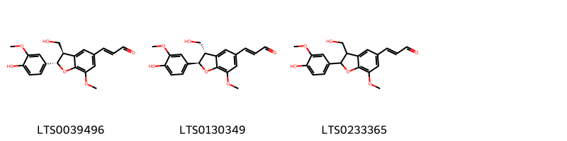{ width=100% }
    <figcaption>Hình ảnh cấu trúc hóa học của 3 hoạt chất thuộc nhóm 2-arylbenzofuran flavonoids gồm ['balanophonin (LTS0039496)', '(2e)-3-[(2r,3s)-2-(4-hydroxy-3-methoxyphenyl)-3-(hydroxymethyl)-7-methoxy-2,3-dihydro-1-benzofuran-5-yl]prop-2-enal (LTS0130349)', '3-[2-(4-hydroxy-3-methoxyphenyl)-3-(hydroxymethyl)-7-methoxy-2,3-dihydro-1-benzofuran-5-yl]prop-2-enal (LTS0233365)'].</figcaption>
</figure>
### Nhóm Anthracenes
<figure markdown="span">
    { width=100% }
    <figcaption>Hình ảnh cấu trúc hóa học của 3 hoạt chất thuộc nhóm Anthracenes gồm ['turkey rhubarb (LTS0160968)', 'emodin (LTS0163480)', 'physcion (LTS0052688)'].</figcaption>
</figure>
### Nhóm Benzene and substituted derivatives
<figure markdown="span">
    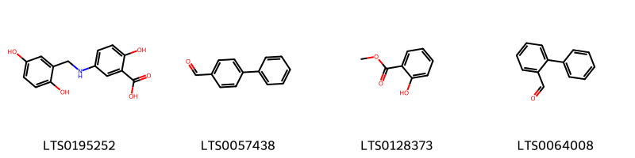{ width=100% }
    <figcaption>Hình ảnh cấu trúc hóa học của 4 hoạt chất thuộc nhóm Benzene and substituted derivatives gồm ['lavendustin c (LTS0195252)', '4-biphenylaldehyde (LTS0057438)', 'methyl salicylate (LTS0128373)', "[1,1'-biphenyl]-2-carbaldehyde (LTS0064008)"].</figcaption>
</figure>
### Nhóm Benzopyrans
<figure markdown="span">
    { width=100% }
    <figcaption>Hình ảnh cấu trúc hóa học của 2 hoạt chất thuộc nhóm Benzopyrans gồm ['chromene-2,2,6-triol (LTS0157870)', '6-methoxychromene-2,2-diol (LTS0121113)'].</figcaption>
</figure>
### Nhóm Carboxylic acids and derivatives
<figure markdown="span">
    { width=100% }
    <figcaption>Hình ảnh cấu trúc hóa học của 8 hoạt chất thuộc nhóm Carboxylic acids and derivatives gồm ['(1r,4r,4as,8ar)-4-methyl-7-methylidene-octahydro-1h-naphthalene-1-carboxylic acid (LTS0270684)', '2-(1-carboxy-n-{4-[(2s)-2-(carboxyamino)-2-({4-[3-hydroxy-2-(methoxycarbonyl)phenoxy]butyl}-c-hydroxycarbonimidoyl)ethyl]phenyl}formamido)benzoic acid (LTS0150168)', '(4s)-3,3,6-trimethylhepta-1,5-dien-4-yl acetate (LTS0130898)', '(1r,4r,4as,8s,8as)-8-(formyloxy)-4-methyl-7-methylidene-octahydro-1h-naphthalene-1-carboxylic acid (LTS0030860)', '3,3,6-trimethylhepta-1,5-dien-4-yl acetate (LTS0244885)', '8-(formyloxy)-4-methyl-7-methylidene-octahydro-1h-naphthalene-1-carboxylic acid (LTS0057379)', '4,13-dimethyl-8-methylidene-10,11-dioxatricyclo[7.4.1.0⁵,¹⁴]tetradecan-12-one (LTS0135933)', '4-methyl-7-methylidene-octahydro-1h-naphthalene-1-carboxylic acid (LTS0005709)'].</figcaption>
</figure>
### Nhóm Cinnamaldehydes
<figure markdown="span">
    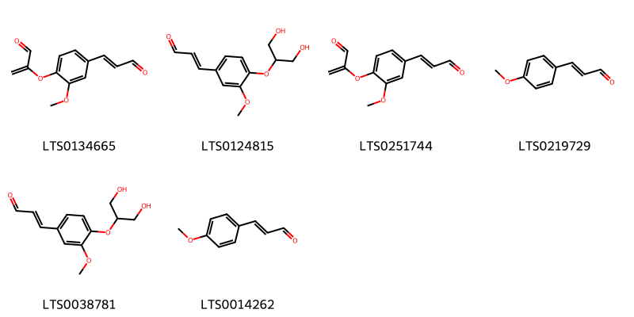{ width=100% }
    <figcaption>Hình ảnh cấu trúc hóa học của 6 hoạt chất thuộc nhóm Cinnamaldehydes gồm ['2-[2-methoxy-4-(3-oxoprop-1-en-1-yl)phenoxy]prop-2-enal (LTS0134665)', '3-{4-[(1,3-dihydroxypropan-2-yl)oxy]-3-methoxyphenyl}prop-2-enal (LTS0124815)', '2-{2-methoxy-4-[(1e)-3-oxoprop-1-en-1-yl]phenoxy}prop-2-enal (LTS0251744)', '4-methoxycinnamaldehyde (LTS0219729)', '(2e)-3-{4-[(1,3-dihydroxypropan-2-yl)oxy]-3-methoxyphenyl}prop-2-enal (LTS0038781)', '3-(4-methoxyphenyl)-2-propenal (LTS0014262)'].</figcaption>
</figure>
### Nhóm Cinnamic acids and derivatives
<figure markdown="span">
    { width=100% }
    <figcaption>Hình ảnh cấu trúc hóa học của 1 hoạt chất thuộc nhóm Cinnamic acids and derivatives gồm ['para-coumaric acid (LTS0266252)'].</figcaption>
</figure>
### Nhóm Coumarins and derivatives
<figure markdown="span">
    { width=100% }
    <figcaption>Hình ảnh cấu trúc hóa học của 3 hoạt chất thuộc nhóm Coumarins and derivatives gồm ['2h-1-benzopyran-2-one (LTS0069773)', 'isofraxidin (LTS0073081)', 'scopoletin (LTS0193112)'].</figcaption>
</figure>
### Nhóm Dihydrofurans
<figure markdown="span">
    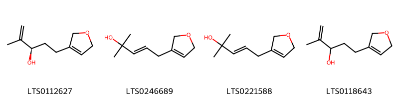{ width=100% }
    <figcaption>Hình ảnh cấu trúc hóa học của 4 hoạt chất thuộc nhóm Dihydrofurans gồm ['(3r)-5-(2,5-dihydrofuran-3-yl)-2-methylpent-1-en-3-ol (LTS0112627)', '5-(2,5-dihydrofuran-3-yl)-2-methylpent-3-en-2-ol (LTS0246689)', '(3e)-5-(2,5-dihydrofuran-3-yl)-2-methylpent-3-en-2-ol (LTS0221588)', '5-(2,5-dihydrofuran-3-yl)-2-methylpent-1-en-3-ol (LTS0118643)'].</figcaption>
</figure>
### Nhóm Dioxolopyrans
<figure markdown="span">
    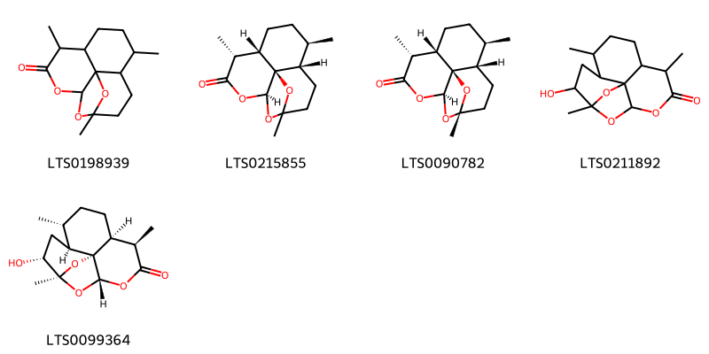{ width=100% }
    <figcaption>Hình ảnh cấu trúc hóa học của 5 hoạt chất thuộc nhóm Dioxolopyrans gồm ['1,5,9-trimethyl-11,14,15-trioxatetracyclo[10.2.1.0⁴,¹³.0⁸,¹³]pentadecan-10-one (LTS0198939)', '(4s,5r,8s,9r,12s,13r)-1,5,9-trimethyl-11,14,15-trioxatetracyclo[10.2.1.0⁴,¹³.0⁸,¹³]pentadecan-10-one (LTS0215855)', '2-deoxyartemisinin (LTS0090782)', '2-hydroxy-1,5,9-trimethyl-11,14,15-trioxatetracyclo[10.2.1.0⁴,¹³.0⁸,¹³]pentadecan-10-one (LTS0211892)', '(1s,2r,4s,5r,8s,9r,12s,13r)-2-hydroxy-1,5,9-trimethyl-11,14,15-trioxatetracyclo[10.2.1.0⁴,¹³.0⁸,¹³]pentadecan-10-one (LTS0099364)'].</figcaption>
</figure>
### Nhóm Epoxides
<figure markdown="span">
    { width=100% }
    <figcaption>Hình ảnh cấu trúc hóa học của 1 hoạt chất thuộc nhóm Epoxides gồm ['(1r,3e,7e,11r)-1,5,5,7-tetramethyl-12-oxabicyclo[9.1.0]dodeca-3,7-diene (LTS0027633)'].</figcaption>
</figure>
### Nhóm Fatty Acyls
<figure markdown="span">
    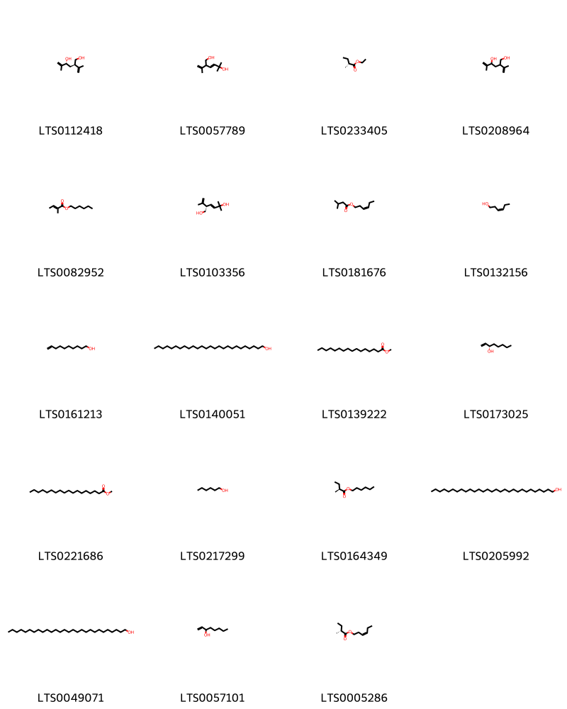{ width=100% }
    <figcaption>Hình ảnh cấu trúc hóa học của 19 hoạt chất thuộc nhóm Fatty Acyls gồm ['(2r,4r)-5-methyl-2-(prop-1-en-2-yl)hex-5-ene-1,4-diol (LTS0112418)', '5-methyl-2-(prop-1-en-2-yl)hex-3-ene-1,5-diol (LTS0057789)', 'ethyl (2r)-2-methylbutanoate (LTS0233405)', '5-methyl-2-(prop-1-en-2-yl)hex-5-ene-1,4-diol (LTS0208964)', 'hexyl (2e)-2-methylbut-2-enoate (LTS0082952)', '(2s,3e)-5-methyl-2-(prop-1-en-2-yl)hex-3-ene-1,5-diol (LTS0103356)', 'cis-3-hexenyl isovalerate (LTS0181676)', 'cis-3-hexenol (LTS0132156)', '9-decen-1-ol (LTS0161213)', 'ceryl alcohol (LTS0140051)', 'methyl palmitate (LTS0139222)', 'oct-1-en-3s-ol (LTS0173025)', 'methyl stearate (LTS0221686)', 'hexanol (LTS0217299)', 'hexyl (2s)-2-methylbutanoate (LTS0164349)', 'nonacosanol (LTS0205992)', 'octacosanol (LTS0049071)', '1-octen-3-ol (LTS0057101)', '(3z)-hex-3-en-1-yl (2r)-2-methylbutanoate (LTS0005286)'].</figcaption>
</figure>
### Nhóm Flavonoids
<figure markdown="span">
    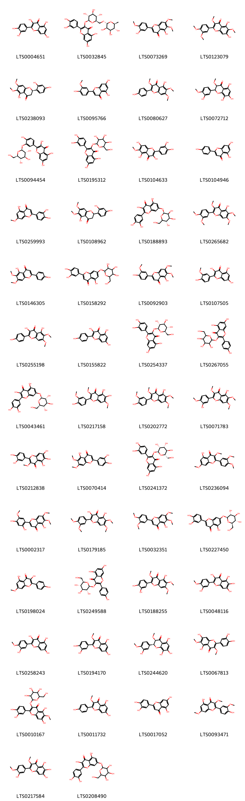{ width=100% }
    <figcaption>Hình ảnh cấu trúc hóa học của 52 hoạt chất thuộc nhóm Flavonoids gồm ['quercetin (LTS0004651)', '3-rutinosyl quercetin (LTS0032845)', 'eupatorin (LTS0073269)', 'bonanzin (LTS0123079)', '(2r)-2-(2,4-dihydroxyphenyl)-5-hydroxy-6,7-dimethoxy-2,3-dihydro-1-benzopyran-4-one (LTS0238093)', 'chrysoeriol (LTS0095766)', 'penduletin (LTS0080627)', '5,7,8-trihydroxy-2-(3-hydroxy-4-methoxyphenyl)-3-methoxy-2,3-dihydro-1-benzopyran-4-one (LTS0072712)', '3,5,7-trihydroxy-2-(4-hydroxy-3-{[(2s,3r,4s,5s,6r)-3,4,5-trihydroxy-6-(hydroxymethyl)oxan-2-yl]oxy}phenyl)chromen-4-one (LTS0094454)', '2-(3,4-dihydroxyphenyl)-5,7-dihydroxy-3-{[3,4,5-trihydroxy-6-(hydroxymethyl)oxan-2-yl]oxy}chromen-4-one (LTS0195312)', 'patuletin (LTS0104633)', 'chamomile (LTS0104946)', 'luteolin 7-methyl ether (LTS0259993)', '2-(2,4-dihydroxyphenyl)-5-hydroxy-6,7-dimethoxy-2,3-dihydro-1-benzopyran-4-one (LTS0108962)', 'quercimeritrin (LTS0188893)', 'artemetin (LTS0265682)', 'cirsimaritin (LTS0146305)', '2-(3,4-dihydroxyphenyl)-5-hydroxy-7-{[3,4,5-trihydroxy-6-(hydroxymethyl)oxan-2-yl]oxy}chromen-4-one (LTS0158292)', 'cirsilineol (LTS0092903)', 'isorhamnetin (LTS0107505)', 'eupalitin (LTS0255198)', 'kaempherol (LTS0155822)', 'isoquercetin (LTS0254337)', 'trifolin (LTS0267055)', 'quercimeritrin (LTS0043461)', 'chrysosplenol c (LTS0217158)', 'chrysosplenetin (LTS0202772)', 'casticin (LTS0071783)', 'quercetagetin 3-methyl ether (LTS0212838)', 'cirsiliol (LTS0070414)', '2-(3,4-dihydroxyphenyl)-5,7-dihydroxy-3-{[(2s,3r,4r,5r,6s)-3,4,5-trihydroxy-6-(hydroxymethyl)oxan-2-yl]oxy}chromen-4-one (LTS0241372)', 'retusin (LTS0236094)', 'arcapillin (LTS0002317)', '2-(3,4-dimethoxyphenyl)-3,5-dihydroxy-6,7-dimethoxychromen-4-one (LTS0179185)', '2-(3,4-dimethoxyphenyl)-5-hydroxy-6,7-dimethoxychromen-4-one (LTS0032351)', 'luteolin 7-o-glucoside (LTS0227450)', 'rhamnocitrin (LTS0198024)', 'astragalin (LTS0249588)', 'chrysosplenol d (LTS0188255)', "quercetagetin 4'-methyl ether (LTS0048116)", 'tamarixetin (LTS0258243)', 'quercetin 3-methyl ether (LTS0194170)', '(2s,3r)-5,7,8-trihydroxy-2-(3-hydroxy-4-methoxyphenyl)-3-methoxy-2,3-dihydro-1-benzopyran-4-one (LTS0244620)', 'axillarin (LTS0067813)', '2-(3,4-dihydroxyphenyl)-5,7-dihydroxy-6-methoxy-3-{[3,4,5-trihydroxy-6-(hydroxymethyl)oxan-2-yl]oxy}chromen-4-one (LTS0010167)', 'isokaempferide (LTS0011732)', 'luteolin (LTS0017052)', 'pachypodol (LTS0093471)', '5,6,7-trihydroxy-2-(3-hydroxy-4-methoxyphenyl)-3-methoxychromen-4-one (LTS0217584)', 'quercimeritrin (LTS0208490)', '3,5,7-trihydroxy-2-(4-hydroxy-3-{[3,4,5-trihydroxy-6-(hydroxymethyl)oxan-2-yl]oxy}phenyl)chromen-4-one (LTS0105577)', 'tomentin (LTS0028795)'].</figcaption>
</figure>
### Nhóm Imidazopyrimidines
<figure markdown="span">
    { width=100% }
    <figcaption>Hình ảnh cấu trúc hóa học của 1 hoạt chất thuộc nhóm Imidazopyrimidines gồm ['zeatine (LTS0032706)'].</figcaption>
</figure>
### Nhóm Indoles and derivatives
<figure markdown="span">
    { width=100% }
    <figcaption>Hình ảnh cấu trúc hóa học của 1 hoạt chất thuộc nhóm Indoles and derivatives gồm ['n-[2-(5-methoxy-1h-indol-3-yl)ethyl]ethanimidic acid (LTS0219322)'].</figcaption>
</figure>
### Nhóm Lactones
<figure markdown="span">
    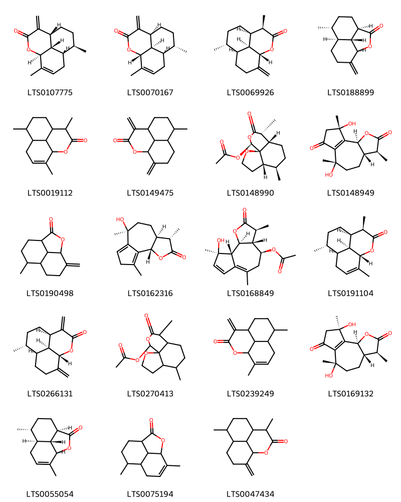{ width=100% }
    <figcaption>Hình ảnh cấu trúc hóa học của 19 hoạt chất thuộc nhóm Lactones gồm ['(1s,5r,8r,9s,13s)-8,12-dimethyl-4-methylidene-2-oxatricyclo[7.3.1.0⁵,¹³]tridec-11-en-3-one (LTS0107775)', '(1r,5s,8s,9r,13r)-8,12-dimethyl-4-methylidene-2-oxatricyclo[7.3.1.0⁵,¹³]tridec-11-en-3-one (LTS0070167)', '(1s,4r,5r,8r,9s,13s)-4,8-dimethyl-12-methylidene-2-oxatricyclo[7.3.1.0⁵,¹³]tridecan-3-one (LTS0069926)', '(1r,4r,7r,8s,12r)-7-methyl-11-methylidene-2-oxatricyclo[6.3.1.0⁴,¹²]dodecan-3-one (LTS0188899)', '4,8,12-trimethyl-2-oxatricyclo[7.3.1.0⁵,¹³]tridec-11-en-3-one (LTS0019112)', '8-methyl-4,12-dimethylidene-2-oxatricyclo[7.3.1.0⁵,¹³]tridecan-3-one (LTS0149475)', '(1r,5s,6r,9s,10r,13s)-6,10-dimethyl-11-oxo-2,12-dioxatricyclo[7.4.0.0¹,⁵]tridecan-13-yl acetate (LTS0148990)', '(3s,3as,6s,9s,9bs)-6,9-dihydroxy-3,6,9-trimethyl-3h,3ah,4h,5h,8h,9bh-azuleno[4,5-b]furan-2,7-dione (LTS0148949)', '7-methyl-11-methylidene-2-oxatricyclo[6.3.1.0⁴,¹²]dodecan-3-one (LTS0190498)', 'artabsin (LTS0162316)', 'matricin (LTS0168849)', '(1s,4r,5r,8r,9s,13s)-4,8,12-trimethyl-2-oxatricyclo[7.3.1.0⁵,¹³]tridec-11-en-3-one (LTS0191104)', '(1s,5r,8r,9s,13s)-8-methyl-4,12-dimethylidene-2-oxatricyclo[7.3.1.0⁵,¹³]tridecan-3-one (LTS0266131)', '6,10-dimethyl-11-oxo-2,12-dioxatricyclo[7.4.0.0¹,⁵]tridecan-13-yl acetate (LTS0270413)', '8,12-dimethyl-4-methylidene-2-oxatricyclo[7.3.1.0⁵,¹³]tridec-11-en-3-one (LTS0239249)', '(3s,3as,6s,9r,9bs)-6,9-dihydroxy-3,6,9-trimethyl-3h,3ah,4h,5h,8h,9bh-azuleno[4,5-b]furan-2,7-dione (LTS0169132)', '(1r,4r,7r,8s,12r)-7,11-dimethyl-2-oxatricyclo[6.3.1.0⁴,¹²]dodec-10-en-3-one (LTS0055054)', '7,11-dimethyl-2-oxatricyclo[6.3.1.0⁴,¹²]dodec-10-en-3-one (LTS0075194)', '4,8-dimethyl-12-methylidene-2-oxatricyclo[7.3.1.0⁵,¹³]tridecan-3-one (LTS0047434)'].</figcaption>
</figure>
### Nhóm Organooxygen compounds
<figure markdown="span">
    { width=100% }
    <figcaption>Hình ảnh cấu trúc hóa học của 11 hoạt chất thuộc nhóm Organooxygen compounds gồm ['octanal (LTS0055983)', '1-(2-hydroxy-6-methoxy-4-{[3,4,5-trihydroxy-6-(hydroxymethyl)oxan-2-yl]oxy}phenyl)ethanone (LTS0038662)', 'xanthoxylin (LTS0150432)', 'isoartemisia ketone (LTS0154009)', '1-(2-hydroxy-6-methoxy-4-{[(2s,3r,4s,5s,6r)-3,4,5-trihydroxy-6-(hydroxymethyl)oxan-2-yl]oxy}phenyl)ethanone (LTS0179806)', '(1r,4r,4as,8s,8as)-8-hydroxy-4-methyl-7-methylidene-octahydro-1h-naphthalene-1-carboxylic acid (LTS0254124)', 'jasmone (LTS0205512)', '3,3,6-trimethylhepta-1,5-dien-4-ol (LTS0238559)', '(3s)-3-ethenyl-2,5-dimethylhex-4-en-2-ol (LTS0039165)', '8-hydroxy-4-methyl-7-methylidene-octahydro-1h-naphthalene-1-carboxylic acid (LTS0078747)', 'tricosan-2-one (LTS0031212)'].</figcaption>
</figure>
### Nhóm Oxacyclic compounds
<figure markdown="span">
    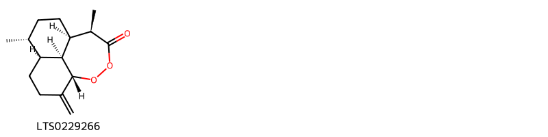{ width=100% }
    <figcaption>Hình ảnh cấu trúc hóa học của 1 hoạt chất thuộc nhóm Oxacyclic compounds gồm ['(1r,4r,5s,9s,13r,14s)-4,13-dimethyl-8-methylidene-10,11-dioxatricyclo[7.4.1.0⁵,¹⁴]tetradecan-12-one (LTS0229266)'].</figcaption>
</figure>
### Nhóm Oxanes
<figure markdown="span">
    { width=100% }
    <figcaption>Hình ảnh cấu trúc hóa học của 2 hoạt chất thuộc nhóm Oxanes gồm ['1,8-cineole (LTS0166505)', 'eucalyptol (LTS0051374)'].</figcaption>
</figure>
### Nhóm Oxepanes
<figure markdown="span">
    { width=100% }
    <figcaption>Hình ảnh cấu trúc hóa học của 4 hoạt chất thuộc nhóm Oxepanes gồm ['1-{2-hydroxy-1a,4-dimethyl-hexahydro-2h-indeno[4,5-b]oxiren-6a-yl}-2-methylpropan-1-one (LTS0040133)', '(1r,5s,8r,9s,12r,14r)-8,12-dimethyl-4-methylidene-2,13-dioxatetracyclo[7.5.0.0¹,⁵.0¹²,¹⁴]tetradecane (LTS0172443)', '1-[(1ar,2r,3as,4r,6as,6bs)-2-hydroxy-1a,4-dimethyl-hexahydro-2h-indeno[4,5-b]oxiren-6a-yl]-2-methylpropan-1-one (LTS0125198)', '8,12-dimethyl-4-methylidene-2,13-dioxatetracyclo[7.5.0.0¹,⁵.0¹²,¹⁴]tetradecane (LTS0245892)'].</figcaption>
</figure>
### Nhóm Phenol ethers
<figure markdown="span">
    { width=100% }
    <figcaption>Hình ảnh cấu trúc hóa học của 1 hoạt chất thuộc nhóm Phenol ethers gồm ['anethole (LTS0033696)'].</figcaption>
</figure>
### Nhóm Phenols
<figure markdown="span">
    { width=100% }
    <figcaption>Hình ảnh cấu trúc hóa học của 5 hoạt chất thuộc nhóm Phenols gồm ['vanillin (LTS0136163)', 'eugenol (LTS0052342)', 'coniferyl aldehyde (LTS0140691)', '5-nonadecylbenzene-1,3-diol (LTS0268622)', 'coniferaldehyde (LTS0009773)'].</figcaption>
</figure>
### Nhóm Prenol lipids
<figure markdown="span">
    { width=100% }
    <figcaption>Hình ảnh cấu trúc hóa học của 251 hoạt chất thuộc nhóm Prenol lipids gồm ['(-)-germacrene d (LTS0059194)', '8-isopropyl-1-methyl-5-methylidenecyclodeca-1,6-diene (LTS0018398)', 'α-myrcene (LTS0115731)', 'terpinolene (LTS0104525)', 'cymene (LTS0181568)', 'α pinene (LTS0132416)', 'phellandrene (LTS0157173)', 'caryophyllene (LTS0085212)', 'thymol (LTS0168527)', 'carvacrol (LTS0012882)', '(7ar)-1,1,7-trimethyl-4-methylidene-octahydrocyclopropa[e]azulen-7-ol (LTS0091612)', '4,11,11-trimethyl-8-methylidenebicyclo[7.2.0]undec-4-ene (LTS0256716)', 'terpineol (LTS0136148)', '4-hydroxy-7-isopropyl-4-methyl-octahydroindene-1-carboxylic acid (LTS0130204)', '(2r,4ar,5r,8r,8as)-5-hydroxy-5-isopropyl-3,8-dimethyl-2,4a,6,7,8,8a-hexahydro-1h-naphthalen-2-yl acetate (LTS0128840)', '(2z)-6-methylidene-2-(4-methylpent-3-en-1-yl)octa-2,7-dien-1-yl acetate (LTS0200841)', 'vulgarin (LTS0062007)', '4,8,12-trimethyl-2,13-dioxatetracyclo[7.5.0.0¹,⁵.0¹²,¹⁴]tetradecan-3-one (LTS0130101)', '(3r,3as,6r,6as,9s,10r,10as)-9,10-dihydroxy-3,6,9-trimethyl-octahydro-3h-naphtho[4a,4-b]furan-2-one (LTS0132739)', 'epi-friedelanol (LTS0114491)', 'farnesene (LTS0057150)', '(1ar,3as,7bs)-1,1,3a,7-tetramethyl-1ah,2h,3h,4h,5h,6h,7bh-cyclopropa[a]naphthalene (LTS0064435)', 'β-amyrin (LTS0075776)', '2-[(4r,4as)-4,7-dimethyl-2,3,4,4a,5,6-hexahydronaphthalen-1-yl]prop-2-enoic acid (LTS0128139)', '6-methylidene-2-(4-methylpent-3-en-1-yl)octa-2,7-dien-1-yl acetate (LTS0137154)', '2-[(1ar,3as,4r,7r,7as,7bs)-1a,4-dimethyl-octahydro-2h-naphtho[1,2-b]oxiren-7-yl]prop-2-enoic acid (LTS0203123)', '(6e)-3,7,11-trimethyldodeca-1,6,10-trien-3-yl acetate (LTS0193692)', '(2r)-2-[(1s,3s,4r)-4-methyl-2-oxo-3-(3-oxobutyl)cyclohexyl]propanoic acid (LTS0236993)', 'myrtenol (LTS0130529)', '(6ar,6bs,8ar,11r,12s,12ar,14br)-4,4,6a,6b,8a,11,12,14b-octamethyl-1,2,4a,5,6,7,8,9,10,11,12,12a,14,14a-tetradecahydropicen-3-one (LTS0125709)', 'anabsinthin (LTS0075454)', '(1s,2r,4r,6s)-1,7,7-trimethyltricyclo[2.2.1.0²,⁶]heptane (LTS0080510)', '4-ethenyl-1-isopropyl-4-methyl-3-(prop-1-en-2-yl)cyclohex-1-ene (LTS0080134)', '(2r)-2-[(1s,3s,4r)-4-methyl-2-oxo-3-(3-oxobutyl)cyclohexyl]propyl formate (LTS0064098)', '(1r,2r,7s,8r)-2,6,6-trimethyl-9-methylidenetricyclo[5.4.0.0²,⁸]undecane (LTS0080386)', 'linalool, (+-)- (LTS0128839)', '(3as,6r,6as,10ar)-6,9-dimethyl-3-methylidene-3ah,4h,5h,6h,6ah,7h,8h-naphtho[4a,4-b]furan-2-one (LTS0082478)', '(2r)-6-methyl-2-[(1r)-4-methylcyclohex-3-en-1-yl]hept-5-en-2-ol (LTS0087338)', 'artemorin (LTS0070726)', 'amyrin (LTS0222826)', '(1s,2r,5s,8s,9s,12s,13r,14r,15r,16r,17s,19s,22s,23s,26s,27r)-12,16-dihydroxy-3,8,12,17,19,23-hexamethyl-6,18,25-trioxaoctacyclo[13.11.1.0¹,¹⁷.0²,¹⁴.0⁴,¹³.0⁵,⁹.0¹⁹,²⁷.0²²,²⁶]heptacos-3-ene-7,24-dione (LTS0070691)', '(3s,4ar,6ar,6bs,8ar,12as,14ar,14br)-4,4,6a,6b,8a,11,11,14b-octamethyl-1,2,3,4a,5,6,7,8,9,10,12,12a,14,14a-tetradecahydropicen-3-yl acetate (LTS0085387)', '3-methyl-4-(1,4,6-trimethyl-2-oxocyclohept-3-en-1-yl)but-2-enoic acid (LTS0032926)', '2-[2-formyl-4-methyl-3-(3-oxobutyl)cyclohexyl]prop-2-enoic acid (LTS0100905)', '(1r,2e,6z,9e)-3,7,11,11-tetramethylcycloundeca-2,6,9-trien-1-ol (LTS0010188)', '(+)-absinthin (LTS0187528)', '(+)-cis-sabinol (LTS0081558)', 'caryophyllene oxide (LTS0159789)', 'α-humulene (LTS0076944)', 'guaiene (LTS0039431)', '(1s,2s,4ar,5r,8as)-2-isopropyl-4a-methyl-8-methylidene-octahydronaphthalene-1,5-diol (LTS0071183)', '6-isopropyl-8a-methyl-4-methylidene-1,2,3,4a,5,8-hexahydronaphthalen-1-ol (LTS0097356)', '(1s,5r,9r)-10,10-dimethyl-2,6-dimethylidenebicyclo[7.2.0]undecan-5-ol (LTS0065243)', '2-(4,7-dimethyl-8-oxo-2,3,4,4a,5,8a-hexahydro-1h-naphthalen-1-yl)propanoic acid (LTS0110166)', '(+)-borneol (LTS0189059)', '(2r)-2-[(1r,4r,4as,8as)-4,7-dimethyl-8-oxo-2,3,4,4a,5,8a-hexahydro-1h-naphthalen-1-yl]propanoic acid (LTS0028902)', 'phytol (LTS0096073)', '(3as,6as,9r,10as)-9,10-dihydroxy-3,6,9-trimethyl-octahydro-3h-naphtho[4a,4-b]furan-2-one (LTS0027371)', '(1s,2s,5r,8r)-2,5,8-trimethyl-6-methylidenetricyclo[6.3.0.0¹,⁵]undecane (LTS0045069)', 'β-selinene (LTS0096341)', 'camphor (LTS0091905)', '(3r,3as,6r,6as,10r,10as)-10-hydroxy-3,6,9-trimethyl-3h,3ah,4h,5h,6h,6ah,7h,10h-naphtho[4a,4-b]furan-2-one (LTS0042443)', '(-)-α-pinene (LTS0032699)', '2-(7-hydroperoxy-4,7-dimethyl-2,3,4,4a,5,6-hexahydro-1h-naphthalen-1-yl)propanoic acid (LTS0196212)', '2-(4,7-dimethyl-3,4,4a,5,6,8a-hexahydro-2h-naphthalen-1-ylidene)propanal (LTS0119584)', 'trans-β-ocimene (LTS0049765)', '(3ar,6s,6ar,10as)-6,9-dimethyl-3-methylidene-3ah,4h,5h,6h,6ah,7h,8h-naphtho[4a,4-b]furan-2-one (LTS0086792)', '(3r,4ar,8ar)-8a-methyl-5-methylidene-3-(prop-1-en-2-yl)-hexahydro-1h-naphthalene-4a-peroxol (LTS0045343)', 'β-pinene (LTS0117550)', '5-(2-hydroxypropan-2-yl)-3,8-dimethyl-1,2,4a,5,6,7,8,8a-octahydronaphthalen-2-yl 2-methylpropanoate (LTS0090869)', '(1s,2s,7s,8s)-2,6,6,9-tetramethyltricyclo[5.4.0.0²,⁸]undec-9-ene (LTS0049232)', 'artemisinin (LTS0118909)', '2-[2-formyl-4-methyl-3-(3-oxobutyl)cyclohexyl]propanoic acid (LTS0130561)', '(3r,3as,5ar,6r,9s,9as,9bs)-6-hydroxy-3,5a,9-trimethyl-octahydro-3h-naphtho[1,2-b]furan-2,8-dione (LTS0109177)', 'myrtenal (LTS0202475)', '(3r,3as,6r,6as,9r,10s,10as)-9,10-dihydroxy-3,6,9-trimethyl-octahydro-3h-naphtho[4a,4-b]furan-2-one (LTS0203931)', '2-isopropyl-4a-methyl-8-methylidene-octahydronaphthalene-1,5-diol (LTS0190508)', 'fenchol (LTS0261470)', 'humulene (LTS0263171)', '8a-methyl-5-methylidene-3-(prop-1-en-2-yl)-hexahydro-1h-naphthalene-4a-peroxol (LTS0141428)', '(1r,4r,5s,9s,13r,14s)-4,13-dimethyl-8-(propan-2-ylidene)-10,11-dioxatricyclo[7.4.1.0⁵,¹⁴]tetradecan-12-one (LTS0261182)', '4-isopropyl-1,6-dimethyl-2,3,4,4a,7,8-hexahydronaphthalene (LTS0270743)', '(1r,3s,5r)-6,6-dimethyl-2-methylidenebicyclo[3.1.1]heptan-3-ol (LTS0165758)', '(3r,6e)-nerolidol (LTS0145065)', '(5s)-1-isopropyl-4-methylidenebicyclo[3.1.0]hexane (LTS0129854)', '4,4,6b,8a,11,12,12b,14b-octamethyl-2,3,4a,5,7,8,9,10,11,12,12a,13,14,14a-tetradecahydro-1h-picen-3-ol (LTS0151229)', '(+)-artemisinin (LTS0269880)', 'cedryl acetate (LTS0152860)', 'camphene (LTS0267242)', '(6e)-2,6-dimethyl-10-methylidenedodeca-2,6-diene (LTS0154516)', '(2r)-2-[(1s,4r,4as,7r)-7-hydroperoxy-4,7-dimethyl-2,3,4,4a,5,6-hexahydro-1h-naphthalen-1-yl]propanoic acid (LTS0159217)', 'limonene,  (LTS0155981)', '(+)-4-terpineol (LTS0140257)', '2-[4-methyl-2-oxo-3-(3-oxobutyl)cyclohexyl]propanoic acid (LTS0150052)', '10-epi-gamma-eudesmol (LTS0149523)', '(1s,4r,4ar,8ar)-1-methyl-6-methylidene-4-(prop-1-en-2-yl)-octahydronaphthalen-2-one (LTS0159951)', 'pinocarvone (LTS0084836)', 'β-amyrin (LTS0251864)', 'elemene (LTS0090837)', '2-[(1z,4r,4as,8as)-4,7-dimethyl-3,4,4a,5,6,8a-hexahydro-2h-naphthalen-1-ylidene]propanal (LTS0112609)', '(1r,5s,8r,9s,12r,14r)-8,12-dimethyl-4-methylidene-2,13-dioxatetracyclo[7.5.0.0¹,⁵.0¹²,¹⁴]tetradecan-3-one (LTS0160646)', 'β-elemene (LTS0225699)', 'gamma-eudesmol (LTS0147389)', '2-[4-methyl-2-oxo-3-(3-oxobutyl)cyclohexyl]propyl formate (LTS0089919)', '(2s,7r,11r)-7,11,15-trimethyl-3-methylidenehexadecane-1,2-diol (LTS0086258)', '(1ar,4ar,7s,7as,7br)-1,1,7-trimethyl-4-methylidene-octahydrocyclopropa[e]azulen-7-ol (LTS0243368)', '(-)-β-pinene (LTS0108757)', '(1s,4r,5r,8r,9s,12r,13s)-1,5,9-trimethyl-11,14,15,16-tetraoxatetracyclo[10.3.1.0⁴,¹³.0⁸,¹³]hexadecan-10-one (LTS0099690)', '(3r,3as,6r,6as,10ar)-3,6,9-trimethyl-3h,3ah,4h,5h,6h,6ah,7h,8h-naphtho[4a,4-b]furan-2-one (LTS0165121)', 'methyl 2-(4,7-dimethyl-1,2,3,4,4a,5,6,8a-octahydronaphthalen-1-yl)prop-2-enoate (LTS0178783)', '(+)-delta(3)-carene (LTS0250199)', '4-terpineol (LTS0253733)', '(+)-artemisinic alcohol (LTS0185402)', '(-)-cis-sabinol (LTS0271116)', '4,4a,6b,8a,11,11,12b,14a-octamethyl-hexadecahydropicen-3-ol (LTS0182128)', '(1r,2s,5r,7r,9r)-2,6,6-trimethyl-8-methylidenetricyclo[5.3.1.0¹,⁵]undecan-9-ol (LTS0233369)', '2-[(1s,4r,4as,8r,8ar)-8,8a-dihydroxy-4,7-dimethyl-2,3,4,4a,5,8-hexahydro-1h-naphthalen-1-yl]prop-2-enoic acid (LTS0095441)', 'verlotorin (LTS0248258)', '10-hydroxy-3,6-dimethyl-9-methylidene-octahydro-3h-naphtho[4a,4-b]furan-2-one (LTS0105920)', 'borneol (LTS0264960)', '(3r,3as,6r,6as,10as)-3,6,6a,9-tetramethyl-3h,3ah,4h,5h,6h,7h,8h-naphtho[4a,4-b]furan-2-one (LTS0178355)', '5-hydroxy-5-isopropyl-3,8-dimethyl-2,4a,6,7,8,8a-hexahydro-1h-naphthalen-2-yl acetate (LTS0167018)', '(1r,4s,5s,8r,9s,12r,14r)-4,8,12-trimethyl-2,13-dioxatetracyclo[7.5.0.0¹,⁵.0¹²,¹⁴]tetradecan-3-one (LTS0095172)', '10-hydroxy-3,6,9-trimethyl-3h,3ah,4h,5h,6h,6ah,7h,10h-naphtho[4a,4-b]furan-2-one (LTS0182327)', 'tricyclene (LTS0179930)', '(2r)-2-[(1r,4r,4as,8as)-4,7-dimethyl-1,2,3,4,4a,5,6,8a-octahydronaphthalen-1-yl]propanoic acid (LTS0243876)', '(2r)-2-[(1ar,3as,4r,7r,7as,7bs)-1a,4-dimethyl-octahydro-2h-naphtho[1,2-b]oxiren-7-yl]propanoic acid (LTS0155791)', 'α-thujene (LTS0176954)', '(1s,4r,5s,8r,9s,12r,14r)-4,8,12-trimethyl-2,13-dioxatetracyclo[7.5.0.0¹,⁵.0¹²,¹⁴]tetradecan-3-one (LTS0125930)', '(3r,3as,6r,6as,10s,10as)-10-hydroxy-3,6,9-trimethyl-3h,3ah,4h,5h,6h,6ah,7h,10h-naphtho[4a,4-b]furan-2-one (LTS0116392)', 'α-bisabolol (LTS0250984)', '1,1,3a,7-tetramethyl-1ah,2h,3h,4h,5h,6h,7bh-cyclopropa[a]naphthalene (LTS0273480)', 'artemisinic acid (LTS0061450)', 'cedrol (LTS0221015)', '2-[(1r,4r,4as,8as)-4,7-dimethyl-1,2,3,4,4a,5,6,8a-octahydronaphthalen-1-yl]prop-2-enoic acid (LTS0247705)', '(1r,4as,8ar)-6-isopropyl-8a-methyl-4-methylidene-1,2,3,4a,5,8-hexahydronaphthalen-1-ol (LTS0242811)', '(1s,4s)-1-methyl-4-(prop-1-en-2-yl)cyclohex-2-en-1-ol (LTS0243152)', '4,4,6a,6b,8a,11,12,14b-octamethyl-1,2,4a,5,6,7,8,9,10,11,12,12a,14,14a-tetradecahydropicen-3-one (LTS0264434)', '(2z)-3-methyl-4-[(1s,6s)-1,4,6-trimethyl-2-oxocyclohept-3-en-1-yl]but-2-enoic acid (LTS0037452)', 'methyl 2-[(1r,4r,4as,8ar)-4,7-dimethyl-1,2,3,4,4a,5,6,8a-octahydronaphthalen-1-yl]prop-2-enoate (LTS0072904)', '2-[(2r,4as,8as)-4a,8-dimethyl-2,3,4,8a-tetrahydro-1h-naphthalen-2-yl]propan-2-yl acetate (LTS0266861)', 'β-farnesene (LTS0067925)', 'thujone (LTS0197087)', '2-[(1s,4s,4as,8r,8ar)-8,8a-dihydroxy-4,7-dimethyl-2,3,4,4a,5,8-hexahydro-1h-naphthalen-1-yl]prop-2-enoic acid (LTS0217677)', '(1s,2s,5r)-5-isopropyl-2-methylbicyclo[3.1.0]hexan-2-ol (LTS0071189)', '(1r,4r,5s,8r,9s,12r,14r)-4,8,12-trimethyl-2,13-dioxatetracyclo[7.5.0.0¹,⁵.0¹²,¹⁴]tetradecan-3-one (LTS0201404)', 'camphene hydrate (LTS0071319)', '(1z,6z,8s)-8-isopropyl-1-methyl-5-methylidenecyclodeca-1,6-diene (LTS0065195)', 'β-caryophyllene oxide (LTS0213960)', 'artemisinic acid (LTS0224622)', 'α-copaene (LTS0207598)', '(3as,6r,6as,10as)-6,9-dimethyl-3-methylidene-3ah,4h,5h,6h,6ah,7h,8h-naphtho[4a,4-b]furan-2-one (LTS0090953)', '1-methyl-6-methylidene-4-(prop-1-en-2-yl)-octahydronaphthalen-2-one (LTS0087578)', '(2r)-2-[(1r,2r,3s,4r)-2-formyl-4-methyl-3-(3-oxobutyl)cyclohexyl]propanoic acid (LTS0218235)', 'sabinene (LTS0224133)', '(3r,7r,11s)-3,7,11,15-tetramethylhexadec-1-en-3-ol (LTS0263568)', '2-[(1r,4s)-4,7-dimethyl-1,2,3,4,4a,5,6,8a-octahydronaphthalen-1-yl]prop-2-en-1-ol (LTS0212183)', '4,4,6a,6b,8a,11,11,14b-octamethyl-1,2,3,4a,5,6,7,8,9,10,12,12a,14,14a-tetradecahydropicen-3-yl acetate (LTS0153642)', '(1s,2r)-8-isopropyl-1,3-dimethyltricyclo[4.4.0.0²,⁷]dec-3-ene (LTS0167051)', 'spathulenol (LTS0235578)', 'α-thujene (LTS0185078)', '(-)-chrysanthenone (LTS0047554)', 'elemol (LTS0208556)', '(4ar,6ar,6br,8ar,12s,12ar,12br,14ar,14br)-4,4,6a,6b,8a,12,14b-heptamethyl-11-methylidene-tetradecahydro-1h-picen-3-one (LTS0139052)', 'oleanolic acid (LTS0141130)', '(2z)-5-[(1s,5s,6r)-2,6-dimethylbicyclo[3.1.1]hept-2-en-6-yl]-2-methylpent-2-en-1-yl acetate (LTS0160691)', '(3r,3as,9s,11as)-9-hydroxy-3,6,10-trimethyl-3h,3ah,4h,5h,8h,9h,11ah-cyclodeca[b]furan-2-one (LTS0172915)', 'cuminaldehyde (LTS0037806)', '3,6,9-trimethyl-3h,3ah,4h,5h,6h,6ah,7h,8h-naphtho[4a,4-b]furan-2-one (LTS0238243)', 'cedrenol (LTS0063661)', '(-)-friedelin (LTS0041645)', '[(8s,8ar)-8-isopropyl-5-methyl-3,4,6,7,8,8a-hexahydronaphthalen-2-yl]methanol (LTS0189246)', '2-[(1r,3s)-2,2-dimethyl-3-(3-oxobutyl)cyclopropyl]cyclopent-2-en-1-one (LTS0162412)', '8a-methyl-5-methylidene-3-(prop-1-en-2-yl)-hexahydro-1h-naphthalen-4a-ol (LTS0042822)', '(9s,12s,16r,17s,19s,23s,26s)-12,16-dihydroxy-3,8,12,17,19,23-hexamethyl-6,18,25-trioxaoctacyclo[13.11.1.0¹,¹⁷.0²,¹⁴.0⁴,¹³.0⁵,⁹.0¹⁹,²⁷.0²²,²⁶]heptacos-3-ene-7,24-dione (LTS0236573)', 'cedrol (LTS0251071)', '(+)-β-thujone (LTS0180873)', '7-(1-hydroxypropan-2-yl)-1a,4-dimethyl-octahydronaphtho[1,2-b]oxiren-7a-ol (LTS0235284)', '(-)-α-phellandrene (LTS0226766)', '(2r)-2-[(1ar,3as,4r,7s,7ar,7bs)-7a-hydroxy-1a,4-dimethyl-octahydronaphtho[1,2-b]oxiren-7-yl]propanoic acid (LTS0045344)', '(1r,4s,6r,10s)-4,12,12-trimethyl-9-methylidene-5-oxatricyclo[8.2.0.0⁴,⁶]dodecane (LTS0057919)', '3,7,11,15-tetramethylhexadec-2-en-1-ol (LTS0056933)', '(2z)-5-[(1s,5s,6r)-2,6-dimethylbicyclo[3.1.1]hept-2-en-6-yl]-2-methylpent-2-en-1-ol (LTS0036359)', '(2e,6e)-farnesyl acetate (LTS0257483)', 'β-ocimene (LTS0242381)', '2-{7a-hydroxy-1a,4-dimethyl-octahydronaphtho[1,2-b]oxiren-7-yl}propanoic acid (LTS0053581)', '6-isopropyl-8a-methyl-4-methylidene-1,2,3,6,7,8-hexahydronaphthalen-1-ol (LTS0177653)', '(3as,11ar)-10-methyl-3,6-dimethylidene-3ah,4h,5h,8h,9h,11ah-cyclodeca[b]furan-2,7-dione (LTS0046643)', '(1r,2s,7s,8s)-8-isopropyl-1,3-dimethyltricyclo[4.4.0.0²,⁷]dec-3-ene (LTS0190031)', '(+)-α-terpineol (LTS0258249)', '(+)-β-cedrene (LTS0009064)', '(2s,4r)-1,7,7-trimethylbicyclo[2.2.1]heptan-2-ol (LTS0010050)', '(2r,4as,5r,8r,8as)-5-(2-hydroxypropan-2-yl)-3,8-dimethyl-1,2,4a,5,6,7,8,8a-octahydronaphthalen-2-yl 2-methylpropanoate (LTS0058663)', '(3r,3as,6r,6as,10s,10as)-10-hydroxy-3,6-dimethyl-9-methylidene-octahydro-3h-naphtho[4a,4-b]furan-2-one (LTS0011993)', '(1r,5s,8r,9s,12s,14s)-8,12-dimethyl-4-methylidene-2,13-dioxatetracyclo[7.5.0.0¹,⁵.0¹²,¹⁴]tetradecan-3-one (LTS0064525)', 'β-cadinene (LTS0049088)', '(2s)-2-[(1ar,3as,4r,7r,7as,7bs)-1a,4-dimethyl-octahydro-2h-naphtho[1,2-b]oxiren-7-yl]propanoic acid (LTS0111222)', '9,10-dihydroxy-3,6,9-trimethyl-octahydro-3h-naphtho[4a,4-b]furan-2-one (LTS0049131)', '(3r,3as,6r,6as,10as)-3,6,9-trimethyl-3h,3ah,4h,5h,6h,6ah,7h,8h-naphtho[4a,4-b]furan-2-one (LTS0135022)', '(1r,4s,5r,8s,12s,13r)-1,5-dimethyl-9-methylidene-11,14,15,16-tetraoxatetracyclo[10.3.1.0⁴,¹³.0⁸,¹³]hexadecan-10-one (LTS0261320)', '2-(4,7-dimethyl-1,2,3,4,4a,5,6,8a-octahydronaphthalen-1-yl)prop-2-enoic acid (LTS0006574)', '(3r,4ar,8ar)-8a-methyl-5-methylidene-3-(prop-1-en-2-yl)-hexahydro-1h-naphthalen-4a-ol (LTS0136167)', 'α-amyrenone (LTS0040451)', 'terpinene (LTS0136858)', '(1ar,3as,4r,7s,7ar,7bs)-7-[(2r)-1-hydroxypropan-2-yl]-1a,4-dimethyl-octahydronaphtho[1,2-b]oxiren-7a-ol (LTS0061729)', '(1r,13r)-1,5,9-trimethyl-11,14,15,16-tetraoxatetracyclo[10.3.1.0⁴,¹³.0⁸,¹³]hexadecan-10-one (LTS0006080)', '(3r)-6,6-dimethyl-2-methylidenebicyclo[3.1.1]heptan-3-ol (LTS0009265)', '2-{1a,4-dimethyl-octahydro-2h-naphtho[1,2-b]oxiren-7-yl}propanoic acid (LTS0013765)', 'd-camphor (LTS0002057)', '(3r,3as,6r,6as,9r,10r,10as)-9,10-dihydroxy-3,6,9-trimethyl-octahydro-3h-naphtho[4a,4-b]furan-2-one (LTS0260822)', 'fenchone (LTS0126716)', '4,4,6a,6b,8a,12,14b-heptamethyl-11-methylidene-tetradecahydro-1h-picen-3-one (LTS0018560)', '2-[(1r,2r,3s,4r)-2-formyl-4-methyl-3-(3-oxobutyl)cyclohexyl]prop-2-enoic acid (LTS0014968)', 'isophytol (LTS0015331)', 'chrysanthenone (LTS0001245)', '8,12-dimethyl-4-methylidene-2,13-dioxatetracyclo[7.5.0.0¹,⁵.0¹²,¹⁴]tetradecan-3-one (LTS0004732)', '(1s,5s,9r)-10,10-dimethyl-2,6-dimethylidenebicyclo[7.2.0]undecan-5-ol (LTS0261777)', '(1r,8r)-2,6,6-trimethyl-9-methylidenetricyclo[5.4.0.0²,⁸]undecane (LTS0053574)', '(1r,4ar,7r,8ar)-1,4a-dimethyl-7-(prop-1-en-2-yl)-octahydronaphthalen-1-ol (LTS0233803)', 'ketopelenolide a (LTS0032403)', '(3as,6as,10as)-10-hydroxy-3,6-dimethyl-9-methylidene-octahydro-3h-naphtho[4a,4-b]furan-2-one (LTS0252561)', '2-[(2r,4as)-4a,8-dimethyl-2,3,4,8a-tetrahydro-1h-naphthalen-2-yl]propan-2-ol (LTS0233882)', '(1r,2r,5s,7r,9s)-2,6,6-trimethyl-8-methylidenetricyclo[5.3.1.0¹,⁵]undecan-9-yl acetate (LTS0084847)', 'dihydroartemisinic acid (LTS0028805)', 'bicyclogermacrene (LTS0099340)', '2-[(2r,4as,8as)-4a,8-dimethyl-2,3,4,8a-tetrahydro-1h-naphthalen-2-yl]propan-2-ol (LTS0025074)', 'delta-cadinene (LTS0019321)', '(1s,2r,5s,7r,8s)-8-(hydroxymethyl)-2,6,6-trimethyltricyclo[5.3.1.0¹,⁵]undecan-8-ol (LTS0098176)', '6,9-dimethyl-3-methylidene-3ah,4h,5h,6h,6ah,7h,8h-naphtho[4a,4-b]furan-2-one (LTS0240471)', 'pinocarveol (LTS0090950)', '(3r,6r,6as,9s,10r,10as)-9,10-dihydroxy-3,6,9-trimethyl-octahydro-3h-naphtho[4a,4-b]furan-2-one (LTS0020541)', 'α-selinene (LTS0024564)', '(1s,4s,6s,10r)-4,12,12-trimethyl-9-methylidene-5-oxatricyclo[8.2.0.0⁴,⁶]dodecane (LTS0111074)', 'α-amyrin (LTS0088267)', 'friedelin (LTS0213494)', '3,6,6a,9-tetramethyl-3h,3ah,4h,5h,6h,7h,8h-naphtho[4a,4-b]furan-2-one (LTS0233671)', '(3s,6e)-3,7,11-trimethyldodeca-1,6,10-trien-3-yl acetate (LTS0098607)', '(8r)-8,12-dimethyl-4-methylidene-2,13-dioxatetracyclo[7.5.0.0¹,⁵.0¹²,¹⁴]tetradecan-3-one (LTS0256603)', '(z)-β-farnesene (LTS0254048)', '8-(hydroxymethyl)-2,6,6-trimethyltricyclo[5.3.1.0¹,⁵]undecan-8-ol (LTS0242914)', '(1s,5r,8r,11s)-5,7,7,11-tetramethyltricyclo[6.3.0.0¹,⁵]undec-2-ene (LTS0120832)', '(-)-β-cubebene (LTS0123697)', 'β-guaiene (LTS0017269)', '2-{1a,4-dimethyl-octahydro-2h-naphtho[1,2-b]oxiren-7-yl}prop-2-enoic acid (LTS0018695)', '(3r,3as,9r,10s,11ar)-9-hydroxy-3,6,10-trimethyl-3h,3ah,4h,5h,8h,9h,10h,11h,11ah-cyclodeca[b]furan-2-one (LTS0118590)', '(1s,3ar,4r,7s,7as)-4-hydroxy-7-isopropyl-4-methyl-octahydroindene-1-carboxylic acid (LTS0048589)', '(3s,3ar,6s,6ar,10ar)-3,6,9-trimethyl-3h,3ah,4h,5h,6h,6ah,7h,8h-naphtho[4a,4-b]furan-2-one (LTS0022469)', 'oleanolic acid (LTS0117717)', '7,11,15-trimethyl-3-methylidenehexadecane-1,2-diol (LTS0023467)', '(1r,6s,8ar)-6-isopropyl-8a-methyl-4-methylidene-1,2,3,6,7,8-hexahydronaphthalen-1-ol (LTS0256879)', 'e,e-farnesal (LTS0118407)'].</figcaption>
</figure>
### Nhóm Pyrans
<figure markdown="span">
    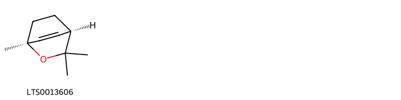{ width=100% }
    <figcaption>Hình ảnh cấu trúc hóa học của 1 hoạt chất thuộc nhóm Pyrans gồm ['(1s,4r)-1,3,3-trimethyl-2-oxabicyclo[2.2.2]oct-5-ene (LTS0013606)'].</figcaption>
</figure>
### Nhóm Quinolines and derivatives
<figure markdown="span">
    { width=100% }
    <figcaption>Hình ảnh cấu trúc hóa học của 1 hoạt chất thuộc nhóm Quinolines and derivatives gồm ['(2e)-3-(1h-1,3-benzodiazol-2-yl)-1-(6-chloro-2-hydroxy-4-phenylquinolin-3-yl)prop-2-en-1-one (LTS0134094)'].</figcaption>
</figure>
### Nhóm Saturated hydrocarbons
<figure markdown="span">
    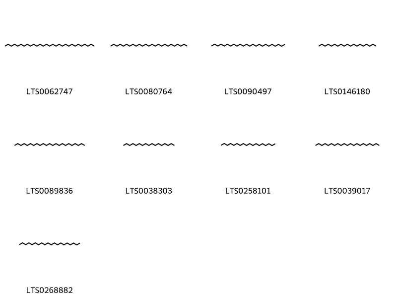{ width=100% }
    <figcaption>Hình ảnh cấu trúc hóa học của 9 hoạt chất thuộc nhóm Saturated hydrocarbons gồm ['nonacosane (LTS0062747)', 'pentacosane (LTS0080764)', 'tetracosane (LTS0090497)', 'nonadecane (LTS0146180)', 'tricosane (LTS0089836)', 'heptadecane (LTS0038303)', 'octadecane (LTS0258101)', 'heneicosane (LTS0039017)', 'eicosane (LTS0268882)'].</figcaption>
</figure>
### Nhóm Steroids and steroid derivatives
<figure markdown="span">
    { width=100% }
    <figcaption>Hình ảnh cấu trúc hóa học của 5 hoạt chất thuộc nhóm Steroids and steroid derivatives gồm ['stigmast-5-en-3-ol (LTS0071224)', 'stigmast-5-en-3-ol, (3β)- (LTS0204616)', 'sitosterol (LTS0168132)', 'phytosterol (LTS0029311)', 'stigmasterol (LTS0024262)'].</figcaption>
</figure>
### Nhóm Tetralins
<figure markdown="span">
    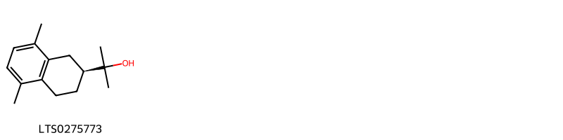{ width=100% }
    <figcaption>Hình ảnh cấu trúc hóa học của 1 hoạt chất thuộc nhóm Tetralins gồm ['2-[(2s)-5,8-dimethyl-1,2,3,4-tetrahydronaphthalen-2-yl]propan-2-ol (LTS0275773)'].</figcaption>
</figure>
### Nhóm Unsaturated hydrocarbons
<figure markdown="span">
    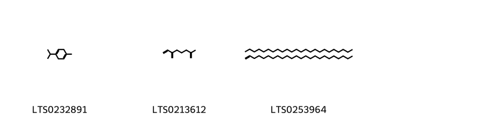{ width=100% }
    <figcaption>Hình ảnh cấu trúc hóa học của 3 hoạt chất thuộc nhóm Unsaturated hydrocarbons gồm ['α terpinene (LTS0232891)', '2-methyl-6-methylideneocta-1,7-diene (LTS0213612)', '1-tetracosene; tetracosane (LTS0253964)'].</figcaption>
</figure>

---

## Tác dụng dược lý

Theo tài liệu "Những cây thuốc và vị thuốc Việt Nam" - Đỗ Tất Lợi:- Bệnh lao
- dạ dày
- da
- bệnh ghẻ
- đổ mồ hôi đêm
- vàng da
- sốt
- mắt
- khó tiêu
- kiết lỵ
- thuốc trị đầy hơi
- thuốc diệt khuẩn
- áp xe

Theo tài liệu quốc tế: nan

---

## Dược điển Việt Nam V

### Soi bột:
nan
<!-- Hình ảnh soi bột sẽ được tự động chèn vào đây sau -->
### Vi phẫu:
nan
<!-- Hình ảnh vi phẫu sẽ được tự động chèn vào đây sau -->
### Định tính

nan

### Định lượng

nan

### Thông tin khác 
- ** Độ ẩm: ** nan

- ** Bảo quản:** nan
## Dược điển Hồng kong

<!-- PDF sẽ được tự động chèn vào đây sau -->

---

## Y dược học cổ truyền

- **Tên vị thuốc:** nan
- **Tính vị quy kinh:** Theo các tài liệu cổ, thanh cao có vị đắng (khổ), tính hàn (lạnh). Vào hai kinh can và đởm.
- **Công năng chủ trị:** Có tác dụng thanh thư tịch uế, trừ phục nhiệt ở âm phận. Dùng chữa những trường hợp cốt trưng lao nhiệt (đau xương, nóng), đạo hãn (mồ hôi trộm), ngược tật (sốt rét), lở ngứa. Còn dùng chữa cảm mạo, thanh nhiệt, giúp sự tiêu hoá, lợi gan mật. Dùng riêng hay phối hợp với một số vị thuốc khác.
- **Chú ý:** nan
- **Kiêng kỵ:** nan

