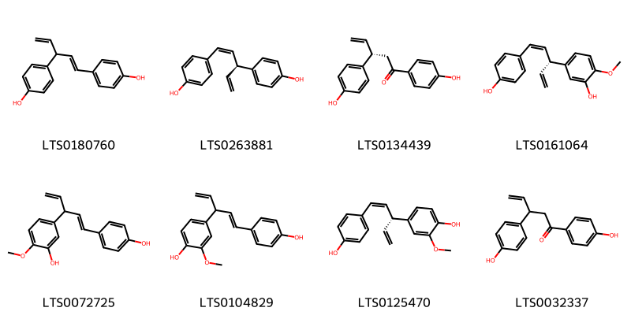
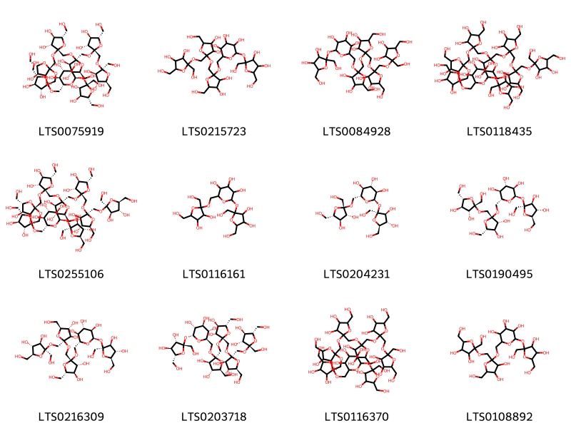
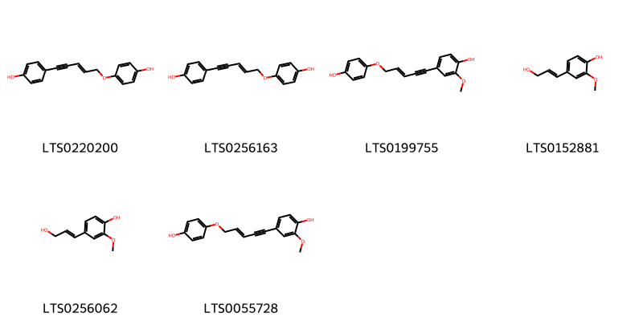
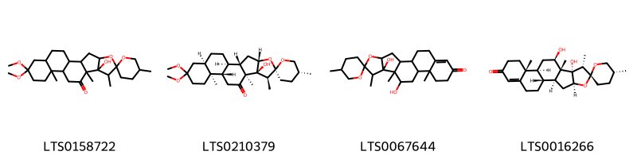
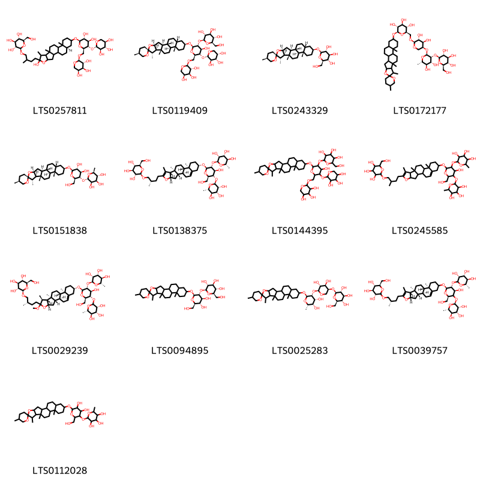

!!! abstract "Tóm tắt"
    Thiên môn đông, có tên khoa học là Radix Asparagi cochinchinensis, thuộc họ Asparagaceae. Cây được tìm thấy mọc hoang ở khắp nơi VIệt Nam, nhiều nhất ở các tỉnh Cao Bằng, Lạng Sơn, Thanh Hóa, Bắc Thái, Nam Hà. Bộ phận sử dụng là rễ, chứa hoạt chất chủ yếu là asparagin. Cây có tác dụng giúp lợi tiểu; trong y học hiện đại được ứng dụng kháng khuẩn, giảm ho và ức chế khối u.

## Thông tin về thực vật

### Đặc điểm thực vật

Dược liệu **Thiên Môn Đông (Rễ)** từ bộ phận **nan** từ loài *Asparagus cochinchinensis (Lour) Merr* thuộc họ Asparagaceae. Loại dây leo, sống lâu năm. Dưới đất có rất nhiều rễ củ hình thôi mẫm. Thân mang nhiều cành 3 cạnh, dài nhọn, biến đổi, trông như lá. Lá rất nhỏ, trông như vảy. Mùa hạ ở kẽ lá mọc hoa trắng nhỏ. Quả là một quả mọng màu đỏ khi chín 

!!! info "Phân loại thực vật của *Asparagus cochinchinensis*"
    - **Kingdom:** Plantae
    - **Phylum:** Tracheophyta
    - **Order:** Asparagales
    - **Family:** Asparagaceae
    - **Genus:** Asparagus
    - **Species:** *Asparagus cochinchinensis*

*Tài liệu tham khảo:* "Những cây thuốc và vị thuốc Việt Nam" - Đỗ Tất Lợi

 

### Loài thay thế (Nếu có)

### Phân bố trên thế giới
**Từ vườn thực vật KEW: **: Cambodia, China North-Central, China South-Central, China Southeast, Hainan, Japan, Korea, Laos, Nansei-shoto, Philippines, Taiwan, Tibet, Vietnam

**Từ CSDL GIBF** Korea, Republic of, China, Hong Kong, Japan, Chinese Taipei, Ukraine

### Phân bố tại Việt Nam
** "Những cây thuốc và vị thuốc Việt Nam" - Đỗ Tất Lợi**: Mọc hoang ở khắp nơi. Nhiều nhất ở Cao Bằng, Lạng Sơn, Thanh Hóa, Bắc Thái, Nam Hà

**Từ CSDL GIBF**: Không có ghi nhận ở Việt Nam

---

## Thông tin về dược liệu 

### Định danh

!!! info "Thông tin về tên gọi của nan"
    - Dược liệu tiếng Việt: nan
    - Dược liệu tiếng Trung: nan (nan)
    - Dược liệu tiếng Anh: nan
    - Dược liệu latin thông dụng: nan
    - Dược liệu latin kiểu DĐVN: radix asparagi cochinchinensis
    - Dược liệu latin kiểu DĐVN: nan
    - Dược liệu latin kiểu thông tư: nan
    - Bộ phận dùng: nan (nan)

### Mô tả dược liệu 
- **Theo dược điển Việt nam V:** nan

- **Mô tả dược liệu theo thông tư chế biến dược liệu theo phương pháp cổ truyền:** nan

### Chế biến 

- **Chế biến theo dược điển việt nam V**: nan

- **Chế biến theo thông tư:** nan

--- 

## Thành phần hóa học

- Theo tài liệu của GS. Đỗ Tất Lợi:  (1) Nhóm hóa học: Asparagin, tinh bột, sacaroza 
(2) Asparagine
    
- Theo cơ sở dữ liệu lotus: Từ loài *Asparagus cochinchinensis* đã phân lập và xác định được 43 hoạt chất thuộc về các nhóm Organooxygen compounds, Steroids and steroid derivatives, Prenol lipids, Phenols. 

|    | chemicalTaxonomyClassyfireClass   |   smiles_count |
|---:|:----------------------------------|---------------:|
|  0 |                                   |              8 |
|  1 | Organooxygen compounds            |             12 |
|  2 | Phenols                           |              6 |
|  3 | Prenol lipids                     |              4 |
|  4 | Steroids and steroid derivatives  |             13 |

### Nhóm 
<figure markdown="span">
    { width=100% }
    <figcaption>Hình ảnh cấu trúc hóa học của 8 hoạt chất thuộc nhóm  gồm ['nyasol (LTS0180760)', 'cis-hinokiresinol (LTS0263881)', '(3s)-1,3-bis(4-hydroxyphenyl)pent-4-en-1-one (LTS0134439)', '5-[(3r,4z)-5-(4-hydroxyphenyl)penta-1,4-dien-3-yl]-2-methoxyphenol (LTS0161064)', '5-[1-(4-hydroxyphenyl)penta-1,4-dien-3-yl]-2-methoxyphenol (LTS0072725)', '4-[1-(4-hydroxyphenyl)penta-1,4-dien-3-yl]-2-methoxyphenol (LTS0104829)', '4-[(3r,4z)-5-(4-hydroxyphenyl)penta-1,4-dien-3-yl]-2-methoxyphenol (LTS0125470)', '1,3-bis(4-hydroxyphenyl)pent-4-en-1-one (LTS0032337)'].</figcaption>
</figure>
### Nhóm Organooxygen compounds
<figure markdown="span">
    { width=100% }
    <figcaption>Hình ảnh cấu trúc hóa học của 12 hoạt chất thuộc nhóm Organooxygen compounds gồm ['(2r,3r,4s,5s,6r)-2-{[(2s,3s,4s,5r)-3,4-dihydroxy-2,5-bis(hydroxymethyl)oxolan-2-yl]oxy}-6-({[(2s,3r,4r,5s)-2-({[(2s,3r,4r,5s)-2-({[(2s,3r,4r,5s)-2-({[(2s,3r,4r,5s)-2-({[(2s,3r,4r,5s)-2-({[(2s,3r,4r,5s)-3,4-dihydroxy-2,5-bis(hydroxymethyl)oxolan-2-yl]oxy}methyl)-3,4-dihydroxy-5-(hydroxymethyl)oxolan-2-yl]oxy}methyl)-3,4-dihydroxy-5-(hydroxymethyl)oxolan-2-yl]oxy}methyl)-3,4-dihydroxy-5-(hydroxymethyl)oxolan-2-yl]oxy}methyl)-3,4-dihydroxy-5-(hydroxymethyl)oxolan-2-yl]oxy}methyl)-3,4-dihydroxy-5-(hydroxymethyl)oxolan-2-yl]oxy}methyl)oxane-3,4,5-triol (LTS0075919)', '2-{[3,4-dihydroxy-2,5-bis(hydroxymethyl)oxolan-2-yl]oxy}-6-({[2-({[2-({[3,4-dihydroxy-2,5-bis(hydroxymethyl)oxolan-2-yl]oxy}methyl)-3,4-dihydroxy-5-(hydroxymethyl)oxolan-2-yl]oxy}methyl)-3,4-dihydroxy-5-(hydroxymethyl)oxolan-2-yl]oxy}methyl)oxane-3,4,5-triol (LTS0215723)', '2-{[3,4-dihydroxy-2,5-bis(hydroxymethyl)oxolan-2-yl]oxy}-6-({[2-({[2-({[2-({[3,4-dihydroxy-2,5-bis(hydroxymethyl)oxolan-2-yl]oxy}methyl)-3,4-dihydroxy-5-(hydroxymethyl)oxolan-2-yl]oxy}methyl)-3,4-dihydroxy-5-(hydroxymethyl)oxolan-2-yl]oxy}methyl)-3,4-dihydroxy-5-(hydroxymethyl)oxolan-2-yl]oxy}methyl)oxane-3,4,5-triol (LTS0084928)', '2-{[3,4-dihydroxy-2,5-bis(hydroxymethyl)oxolan-2-yl]oxy}-6-({[2-({[2-({[2-({[2-({[2-({[2-({[3,4-dihydroxy-2,5-bis(hydroxymethyl)oxolan-2-yl]oxy}methyl)-3,4-dihydroxy-5-(hydroxymethyl)oxolan-2-yl]oxy}methyl)-3,4-dihydroxy-5-(hydroxymethyl)oxolan-2-yl]oxy}methyl)-3,4-dihydroxy-5-(hydroxymethyl)oxolan-2-yl]oxy}methyl)-3,4-dihydroxy-5-(hydroxymethyl)oxolan-2-yl]oxy}methyl)-3,4-dihydroxy-5-(hydroxymethyl)oxolan-2-yl]oxy}methyl)-3,4-dihydroxy-5-(hydroxymethyl)oxolan-2-yl]oxy}methyl)oxane-3,4,5-triol (LTS0118435)', '(2r,3r,4s,5s,6r)-2-{[(2s,3s,4s,5r)-3,4-dihydroxy-2,5-bis(hydroxymethyl)oxolan-2-yl]oxy}-6-({[(2s,3r,4r,5s)-2-({[(2s,3r,4r,5s)-2-({[(2s,3r,4r,5s)-2-({[(2s,3r,4r,5s)-2-({[(2s,3r,4r,5s)-2-({[(2s,3r,4r,5s)-2-({[(2s,3r,4r,5s)-3,4-dihydroxy-2,5-bis(hydroxymethyl)oxolan-2-yl]oxy}methyl)-3,4-dihydroxy-5-(hydroxymethyl)oxolan-2-yl]oxy}methyl)-3,4-dihydroxy-5-(hydroxymethyl)oxolan-2-yl]oxy}methyl)-3,4-dihydroxy-5-(hydroxymethyl)oxolan-2-yl]oxy}methyl)-3,4-dihydroxy-5-(hydroxymethyl)oxolan-2-yl]oxy}methyl)-3,4-dihydroxy-5-(hydroxymethyl)oxolan-2-yl]oxy}methyl)-3,4-dihydroxy-5-(hydroxymethyl)oxolan-2-yl]oxy}methyl)oxane-3,4,5-triol (LTS0255106)', '2-{[3,4-dihydroxy-2,5-bis(hydroxymethyl)oxolan-2-yl]oxy}-6-({[3,4-dihydroxy-2,5-bis(hydroxymethyl)oxolan-2-yl]oxy}methyl)oxane-3,4,5-triol (LTS0116161)', '(2r,3r,4s,5s,6r)-2-{[(2s,3s,4s,5r)-3,4-dihydroxy-2,5-bis(hydroxymethyl)oxolan-2-yl]oxy}-6-({[(2s,3r,4r,5s)-3,4-dihydroxy-2,5-bis(hydroxymethyl)oxolan-2-yl]oxy}methyl)oxane-3,4,5-triol (LTS0204231)', '(2r,3r,4s,5s,6r)-2-{[(2s,3s,4s,5r)-3,4-dihydroxy-2,5-bis(hydroxymethyl)oxolan-2-yl]oxy}-6-({[(2s,3r,4r,5s)-2-({[(2s,3r,4r,5s)-3,4-dihydroxy-2,5-bis(hydroxymethyl)oxolan-2-yl]oxy}methyl)-3,4-dihydroxy-5-(hydroxymethyl)oxolan-2-yl]oxy}methyl)oxane-3,4,5-triol (LTS0190495)', '(2r,3r,4s,5s,6r)-2-{[(2s,3s,4s,5r)-3,4-dihydroxy-2,5-bis(hydroxymethyl)oxolan-2-yl]oxy}-6-({[(2s,3r,4r,5s)-2-({[(2s,3r,4r,5s)-2-({[(2s,3r,4r,5s)-3,4-dihydroxy-2,5-bis(hydroxymethyl)oxolan-2-yl]oxy}methyl)-3,4-dihydroxy-5-(hydroxymethyl)oxolan-2-yl]oxy}methyl)-3,4-dihydroxy-5-(hydroxymethyl)oxolan-2-yl]oxy}methyl)oxane-3,4,5-triol (LTS0216309)', '(2r,3r,4s,5s,6r)-2-{[(2s,3s,4s,5r)-3,4-dihydroxy-2,5-bis(hydroxymethyl)oxolan-2-yl]oxy}-6-({[(2s,3r,4r,5s)-2-({[(2s,3r,4r,5s)-2-({[(2s,3r,4r,5s)-2-({[(2s,3r,4r,5s)-3,4-dihydroxy-2,5-bis(hydroxymethyl)oxolan-2-yl]oxy}methyl)-3,4-dihydroxy-5-(hydroxymethyl)oxolan-2-yl]oxy}methyl)-3,4-dihydroxy-5-(hydroxymethyl)oxolan-2-yl]oxy}methyl)-3,4-dihydroxy-5-(hydroxymethyl)oxolan-2-yl]oxy}methyl)oxane-3,4,5-triol (LTS0203718)', '2-{[3,4-dihydroxy-2,5-bis(hydroxymethyl)oxolan-2-yl]oxy}-6-({[2-({[2-({[2-({[2-({[2-({[3,4-dihydroxy-2,5-bis(hydroxymethyl)oxolan-2-yl]oxy}methyl)-3,4-dihydroxy-5-(hydroxymethyl)oxolan-2-yl]oxy}methyl)-3,4-dihydroxy-5-(hydroxymethyl)oxolan-2-yl]oxy}methyl)-3,4-dihydroxy-5-(hydroxymethyl)oxolan-2-yl]oxy}methyl)-3,4-dihydroxy-5-(hydroxymethyl)oxolan-2-yl]oxy}methyl)-3,4-dihydroxy-5-(hydroxymethyl)oxolan-2-yl]oxy}methyl)oxane-3,4,5-triol (LTS0116370)', '2-{[3,4-dihydroxy-2,5-bis(hydroxymethyl)oxolan-2-yl]oxy}-6-({[2-({[3,4-dihydroxy-2,5-bis(hydroxymethyl)oxolan-2-yl]oxy}methyl)-3,4-dihydroxy-5-(hydroxymethyl)oxolan-2-yl]oxy}methyl)oxane-3,4,5-triol (LTS0108892)'].</figcaption>
</figure>
### Nhóm Phenols
<figure markdown="span">
    { width=100% }
    <figcaption>Hình ảnh cấu trúc hóa học của 6 hoạt chất thuộc nhóm Phenols gồm ['4-[5-(4-hydroxyphenoxy)pent-3-en-1-yn-1-yl]phenol (LTS0220200)', '4-[(3e)-5-(4-hydroxyphenoxy)pent-3-en-1-yn-1-yl]phenol (LTS0256163)', '4-[5-(4-hydroxyphenoxy)pent-3-en-1-yn-1-yl]-2-methoxyphenol (LTS0199755)', 'coniferyl alcohol (LTS0152881)', '4-(3-hydroxyprop-1-en-1-yl)-2-methoxyphenol (LTS0256062)', '4-[(3e)-5-(4-hydroxyphenoxy)pent-3-en-1-yn-1-yl]-2-methoxyphenol (LTS0055728)'].</figcaption>
</figure>
### Nhóm Prenol lipids
<figure markdown="span">
    { width=100% }
    <figcaption>Hình ảnh cấu trúc hóa học của 4 hoạt chất thuộc nhóm Prenol lipids gồm ["8'-hydroxy-16',16'-dimethoxy-5,7',9',13'-tetramethyl-5'-oxaspiro[oxane-2,6'-pentacyclo[10.8.0.0²,⁹.0⁴,⁸.0¹³,¹⁸]icosan]-10'-one (LTS0158722)", "(1'r,2r,2's,4's,5r,7's,8's,9's,12's,13's,18'r)-8'-hydroxy-16',16'-dimethoxy-5,7',9',13'-tetramethyl-5'-oxaspiro[oxane-2,6'-pentacyclo[10.8.0.0²,⁹.0⁴,⁸.0¹³,¹⁸]icosan]-10'-one (LTS0210379)", "8',10'-dihydroxy-5,7',9',13'-tetramethyl-5'-oxaspiro[oxane-2,6'-pentacyclo[10.8.0.0²,⁹.0⁴,⁸.0¹³,¹⁸]icosan]-17'-en-16'-one (LTS0067644)", "(1'r,2r,2's,4's,5r,7's,8's,9'r,10'r,12's,13'r)-8',10'-dihydroxy-5,7',9',13'-tetramethyl-5'-oxaspiro[oxane-2,6'-pentacyclo[10.8.0.0²,⁹.0⁴,⁸.0¹³,¹⁸]icosan]-17'-en-16'-one (LTS0016266)"].</figcaption>
</figure>
### Nhóm Steroids and steroid derivatives
<figure markdown="span">
    { width=100% }
    <figcaption>Hình ảnh cấu trúc hóa học của 13 hoạt chất thuộc nhóm Steroids and steroid derivatives gồm ['(2r,3r,4s,5s,6r)-2-{4-[(18r)-16-{[(2r,3r,4r,5s,6r)-3,4-dihydroxy-5-{[(2s,3r,4s,5r)-3,4,5-trihydroxyoxan-2-yl]oxy}-6-({[(2s,3r,4s,5s)-3,4,5-trihydroxyoxan-2-yl]oxy}methyl)oxan-2-yl]oxy}-6-hydroxy-7,9,13-trimethyl-5-oxapentacyclo[10.8.0.0²,⁹.0⁴,⁸.0¹³,¹⁸]icosan-6-yl]-2-methylbutoxy}-6-(hydroxymethyl)oxane-3,4,5-triol (LTS0257811)', "(2s,3r,4s,5s,6r)-2-{[(2r,3r,4s,5s,6r)-4-hydroxy-2-[(1'r,2r,2's,4's,5s,7's,8'r,9's,12's,13's,16's,18'r)-5,7',9',13'-tetramethyl-5'-oxaspiro[oxane-2,6'-pentacyclo[10.8.0.0²,⁹.0⁴,⁸.0¹³,¹⁸]icosane]oxy]-5-{[(2s,3r,4s,5s)-3,4,5-trihydroxyoxan-2-yl]oxy}-6-({[(2s,3r,4s,5s)-3,4,5-trihydroxyoxan-2-yl]oxy}methyl)oxan-3-yl]oxy}-6-(hydroxymethyl)oxane-3,4,5-triol (LTS0119409)", "(2r,3s,4s,5r,6r)-2-(hydroxymethyl)-6-[(1'r,2r,2's,4's,5s,7's,8'r,9's,12's,13's,16's,18'r)-5,7',9',13'-tetramethyl-5'-oxaspiro[oxane-2,6'-pentacyclo[10.8.0.0²,⁹.0⁴,⁸.0¹³,¹⁸]icosane]oxy]oxane-3,4,5-triol (LTS0243329)", "(2r,3s,4s,5r,6r)-2-({[(2s,3r,4r,5s)-5-{[(2s,3r,4r,5r,6s)-4,5-dihydroxy-6-methyl-3-{[(2s,3r,4s,5s,6r)-3,4,5-trihydroxy-6-(hydroxymethyl)oxan-2-yl]oxy}oxan-2-yl]oxy}-3,4-dihydroxyoxan-2-yl]oxy}methyl)-6-{5,7',9',13'-tetramethyl-5'-oxaspiro[oxane-2,6'-pentacyclo[10.8.0.0²,⁹.0⁴,⁸.0¹³,¹⁸]icosane]oxy}oxane-3,4,5-triol (LTS0172177)", "(2s,3r,4r,5r,6s)-2-{[(2r,3s,4r,5r,6r)-4,5-dihydroxy-2-(hydroxymethyl)-6-[(1'r,2r,2's,4's,5s,7's,8'r,9's,12's,13's,16's,18'r)-5,7',9',13'-tetramethyl-5'-oxaspiro[oxane-2,6'-pentacyclo[10.8.0.0²,⁹.0⁴,⁸.0¹³,¹⁸]icosane]oxy]oxan-3-yl]oxy}-6-methyloxane-3,4,5-triol (LTS0151838)", '(2r,3r,4s,5s,6r)-2-[(2s)-4-[(1s,2s,4s,8s,9s,12s,13r,16s)-16-{[(2r,3r,4s,5s,6r)-4-hydroxy-6-(hydroxymethyl)-3,5-bis({[(2s,3r,4r,5r,6s)-3,4,5-trihydroxy-6-methyloxan-2-yl]oxy})oxan-2-yl]oxy}-7,9,13-trimethyl-5-oxapentacyclo[10.8.0.0²,⁹.0⁴,⁸.0¹³,¹⁸]icosa-6,18-dien-6-yl]-2-methylbutoxy]-6-(hydroxymethyl)oxane-3,4,5-triol (LTS0138375)', "2-[(4-hydroxy-2-{5,7',9',13'-tetramethyl-5'-oxaspiro[oxane-2,6'-pentacyclo[10.8.0.0²,⁹.0⁴,⁸.0¹³,¹⁸]icosane]oxy}-5-[(3,4,5-trihydroxyoxan-2-yl)oxy]-6-{[(3,4,5-trihydroxyoxan-2-yl)oxy]methyl}oxan-3-yl)oxy]-6-(hydroxymethyl)oxane-3,4,5-triol (LTS0144395)", '2-[4-(16-{[4-hydroxy-6-(hydroxymethyl)-3,5-bis[(3,4,5-trihydroxy-6-methyloxan-2-yl)oxy]oxan-2-yl]oxy}-7,9,13-trimethyl-5-oxapentacyclo[10.8.0.0²,⁹.0⁴,⁸.0¹³,¹⁸]icosa-6,18-dien-6-yl)-2-methylbutoxy]-6-(hydroxymethyl)oxane-3,4,5-triol (LTS0245585)', '(2r,3r,4s,5s,6r)-2-[(2s)-4-[(1s,2s,4s,7s,8r,9s,12s,13r,16s)-16-{[(2r,3r,4s,5s,6r)-4-hydroxy-6-(hydroxymethyl)-3-{[(2s,3r,4r,5r,6s)-3,4,5-trihydroxy-6-methyloxan-2-yl]oxy}-5-{[(3r,4r,5r,6s)-3,4,5-trihydroxy-6-methyloxan-2-yl]oxy}oxan-2-yl]oxy}-6-methoxy-7,9,13-trimethyl-5-oxapentacyclo[10.8.0.0²,⁹.0⁴,⁸.0¹³,¹⁸]icos-18-en-6-yl]-2-methylbutoxy]-6-(hydroxymethyl)oxane-3,4,5-triol (LTS0029239)', "(2s,3r,4s,5s,6r)-2-{[(2r,3r,4s,5s,6r)-4,5-dihydroxy-6-(hydroxymethyl)-2-{5,7',9',13'-tetramethyl-5'-oxaspiro[oxane-2,6'-pentacyclo[10.8.0.0²,⁹.0⁴,⁸.0¹³,¹⁸]icosane]oxy}oxan-3-yl]oxy}-6-(hydroxymethyl)oxane-3,4,5-triol (LTS0094895)", "(2s,3r,4s,5s,6r)-2-{[(3s,4r,5r,6s)-6-{[(2r,3r,4r,5s,6s)-4,5-dihydroxy-6-methyl-2-{5,7',9',13'-tetramethyl-5'-oxaspiro[oxane-2,6'-pentacyclo[10.8.0.0²,⁹.0⁴,⁸.0¹³,¹⁸]icosane]oxy}oxan-3-yl]oxy}-4,5-dihydroxyoxan-3-yl]oxy}-6-(hydroxymethyl)oxane-3,4,5-triol (LTS0025283)", '(3r,4s,5s,6r)-2-[(2s)-4-[(1s,2s,4s,8s,9s,12s,13r)-16-{[(2r,3r,4s,6r)-4-hydroxy-6-(hydroxymethyl)-5-{[(2s,3r,4r,5r,6s)-3,4,5-trihydroxy-6-methyloxan-2-yl]oxy}-3-{[(3r,4r,5r,6s)-3,4,5-trihydroxy-6-methyloxan-2-yl]oxy}oxan-2-yl]oxy}-7,9,13-trimethyl-5-oxapentacyclo[10.8.0.0²,⁹.0⁴,⁸.0¹³,¹⁸]icosa-6,18-dien-6-yl]-2-methylbutoxy]-6-(hydroxymethyl)oxane-3,4,5-triol (LTS0039757)', "2-{[4,5-dihydroxy-2-(hydroxymethyl)-6-{5,7',9',13'-tetramethyl-5'-oxaspiro[oxane-2,6'-pentacyclo[10.8.0.0²,⁹.0⁴,⁸.0¹³,¹⁸]icosane]oxy}oxan-3-yl]oxy}-6-methyloxane-3,4,5-triol (LTS0112028)"].</figcaption>
</figure>

---

## Tác dụng dược lý

Theo tài liệu "Những cây thuốc và vị thuốc Việt Nam" - Đỗ Tất Lợi:- Chữa ho
- Lợi tiểu
- Chữa sốt
- Thuốc bổ

Theo tài liệu quốc tế: nan

---

## Dược điển Việt Nam V

### Soi bột:
nan
<!-- Hình ảnh soi bột sẽ được tự động chèn vào đây sau -->
### Vi phẫu:
nan
<!-- Hình ảnh vi phẫu sẽ được tự động chèn vào đây sau -->
### Định tính

nan

### Định lượng

nan

### Thông tin khác 
- ** Độ ẩm: ** nan

- ** Bảo quản:** nan
## Dược điển Hồng kong

<!-- PDF sẽ được tự động chèn vào đây sau -->

---

## Y dược học cổ truyền

- **Tên vị thuốc:** nan
- **Tính vị quy kinh:** Cam, khổ, hàn. Vào các kinh phế, thận
- **Công năng chủ trị:** Dưỡng âm, nhuận táo, thanh phế, sinh tân. Chủ trị: Phế ráo ho khan, đờm dính, họng khô, miệng khát, ruột ráo táo bón
- **Chú ý:** nan
- **Kiêng kỵ:** nan

