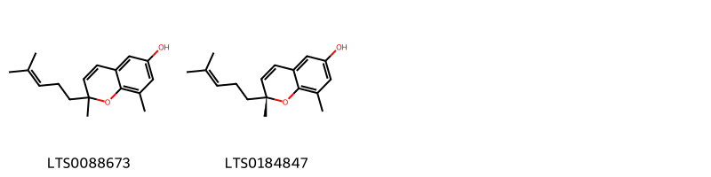
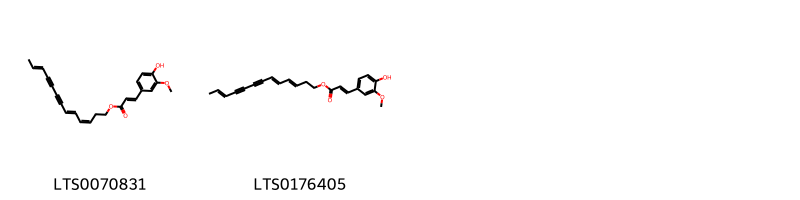
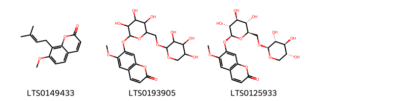
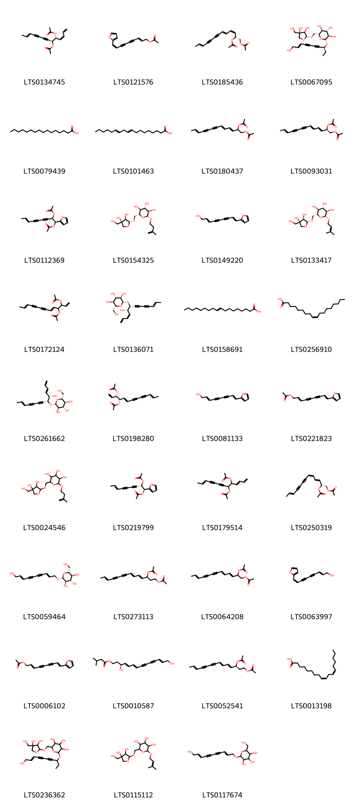
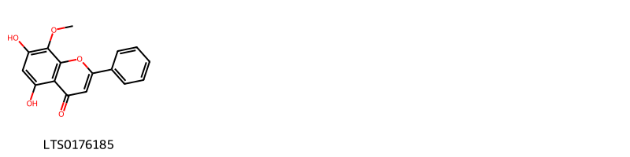
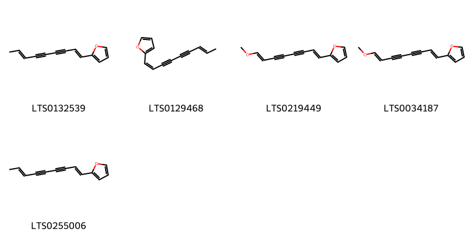
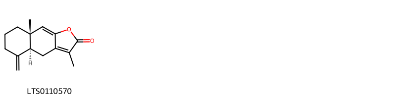
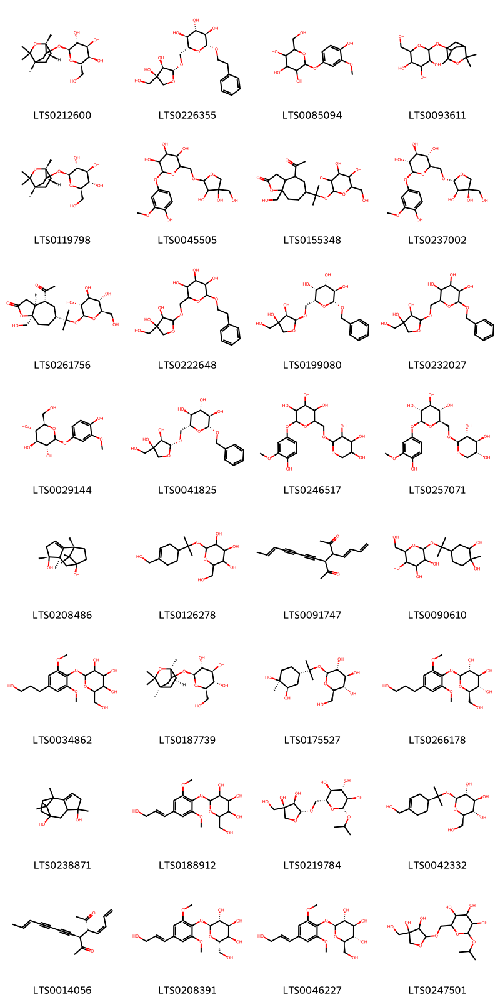
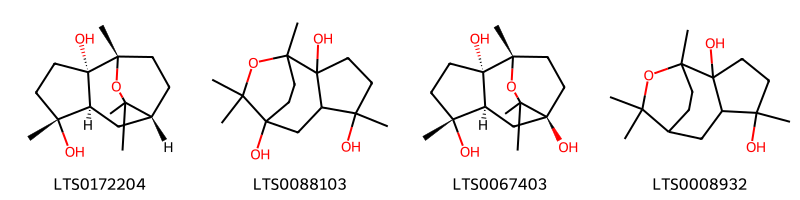
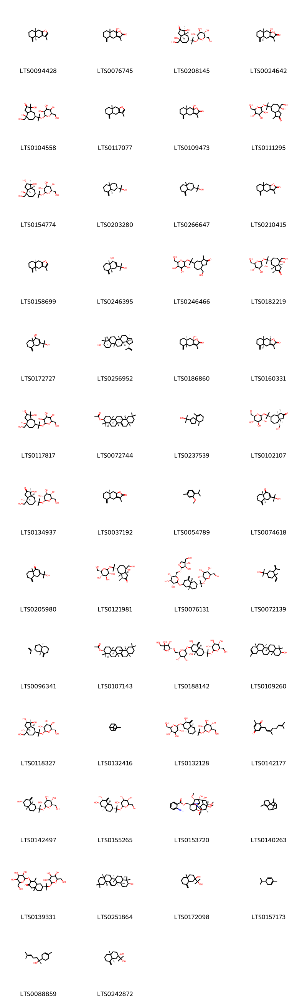

!!! abstract "Tóm tắt"
    THƯƠNG TRUẬT (Thân rễ)(Rhizoma Atractylodis) là thân rễ đã phơi khô của cây Mao thương truật [Atractylodes lancea (Thunb.) DC.] họ Cúc (Asteraceae). Trên thế giới, cây phân bố chủ yếu ở Amur, Trung Bắc-Trung Quốc, Trung Nam-Trung Quốc, Đông Nam Trung Quốc, Nội Mông, Nhật Bản, Khabarovsk, Hàn Quốc, Mãn Châu, Primorye, Việt Nam. Trong dân gian, thường kết hợp Thương truật với một số dược liệu khác để chữa một số bệnh trong cuộc sống, ví dụ Bình vị tán: Chữa cấp tính, mãn tính viêm dạ dày và ruột, nôn mửa, đi tả, đầy bụng không tiêu, đau bụng (Thương truật 160g, hậu phác 120g, trần bì 80g, cam thảo 40g. Các vị tán thành bột, trộn đều, mỗi lần dùng 9g bột này, dùng nước gừng hoặc nước nóng thường mà chiêu thuốc. Ngày uống 3 lần); Cao bạch truật làm thuốc bổ chữa đi ỉa lỏng( Bạch truật 6kg, nước đổ cho ngập, cho vào nồi đất hay đồ sành sắt tráng men, nấu cho cạn còn một nửa, gạn lấy nước, thay nước mới, làm như vậy 3 lần rồi hợp cả 3 nước cô đặc thành cao. Ngày uống 2-3 thìa cao này). Tác dụng dược lý của Thương truật: điều trị tiểu đường, Giúp tiêu hóa tố, chữa một số bệnh về cơ, khớp, có tác dụng hạ huyết áp. Thành phần hóa học chủ yếu là tinh dầu,  trong tinh dầu thành phần chủ yếu là atractylola C15H26O và atractylon C14H18O

## Thông tin về thực vật

### Đặc điểm thực vật

Dược liệu **Thương Truật (Thân Rễ)** từ bộ phận **nan** từ loài *Atractylodes lancea (Thunb.) DC* thuộc họ Asteraceae. Thương truật là một loại cây sống lâu năm, cao chừng 0,60m, có rễ phát triển thành củ to, thân mọc thẳng đứng. Lá mọc so le, gần như không có cuống, lá ở phía gốc chia 3 thùy nhưng cắt không sâu. 2 thủy 2 bền không lớn lắm, thùy giữa rất lớn, lá phía trên hình mác, không chia thùy. Mép lá trên lá dưới đều có răng cưa nhỏ nhọn. Cụm hoa hình đầu, tổng bao do 5-7 lớp như ngói lợp, lớp dưới cùng chia rất nhỏ hình lồng chim. Hoa hình ống, những hoa phía ngoài là hoa cái, những hoa trong lưỡng tính, tràng hoa màu trắng hay tím nhạt, đỉnh chia 5 thùy xẻ xấu. 5 nhị (bị thoái hóa ở hoa cái), nhụy có đầu vòi chia hai, bầu có lông mềm nhỏ. Cụm hoa thương truật so với cụm hoa của bạch truật nhỏ và gầy hơn. Quả khô 

!!! info "Phân loại thực vật của *Atractylodes lancea*"
    - **Kingdom:** Plantae
    - **Phylum:** Tracheophyta
    - **Order:** Asterales
    - **Family:** Asteraceae
    - **Genus:** Atractylodes
    - **Species:** *Atractylodes lancea*

*Tài liệu tham khảo:* "Những cây thuốc và vị thuốc Việt Nam" - Đỗ Tất Lợi

 

### Loài thay thế (Nếu có)

### Phân bố trên thế giới
**Từ vườn thực vật KEW: **: Native to:
Amur, China North-Central, China South-Central, China Southeast, Inner Mongolia, Japan, Khabarovsk, Korea, Manchuria, Primorye, Vietnam

**Từ CSDL GIBF** nan, Korea, Republic of, China, Japan, Russian Federation

### Phân bố tại Việt Nam
** "Những cây thuốc và vị thuốc Việt Nam" - Đỗ Tất Lợi**: Thương truật từ trước đến nay ta vẫn phải nhập của Trung Quốc gần đây mới trồng được ở Việt Nam, nhưng chưa phát triển đủ để tự túc được.

**Từ CSDL GIBF**: Không có ghi nhận ở Việt Nam

---

## Thông tin về dược liệu 

### Định danh

!!! info "Thông tin về tên gọi của nan"
    - Dược liệu tiếng Việt: nan
    - Dược liệu tiếng Trung: nan (nan)
    - Dược liệu tiếng Anh: nan
    - Dược liệu latin thông dụng: nan
    - Dược liệu latin kiểu DĐVN: rhizoma atractylodis
    - Dược liệu latin kiểu DĐVN: nan
    - Dược liệu latin kiểu thông tư: nan
    - Bộ phận dùng: nan (nan)

### Mô tả dược liệu 
- **Theo dược điển Việt nam V:** nan

- **Mô tả dược liệu theo thông tư chế biến dược liệu theo phương pháp cổ truyền:** nan

### Chế biến 

- **Chế biến theo dược điển việt nam V**: nan

- **Chế biến theo thông tư:** nan

--- 

## Thành phần hóa học

- Theo tài liệu của GS. Đỗ Tất Lợi:  (1)  tinh dầu, trong tinh dầu thành phần chủ yếu là atractylola C15H26O và atractylon C14H18O
    
- Theo cơ sở dữ liệu lotus: Từ loài *Atractylodes lancea* đã phân lập và xác định được 178 hoạt chất thuộc về các nhóm Oxepanes, Pyrimidine nucleosides, Naphthofurans, Organooxygen compounds, Benzopyrans, Prenol lipids, Steroids and steroid derivatives, Fatty Acyls, Coumarins and derivatives, Flavonoids, Indoles and derivatives, Benzene and substituted derivatives, Cinnamic acids and derivatives, Heteroaromatic compounds, Purine nucleosides. 

|    | chemicalTaxonomyClassyfireClass     |   smiles_count |
|---:|:------------------------------------|---------------:|
|  0 | Benzene and substituted derivatives |              1 |
|  1 | Benzopyrans                         |              2 |
|  2 | Cinnamic acids and derivatives      |              2 |
|  3 | Coumarins and derivatives           |              3 |
|  4 | Fatty Acyls                         |             35 |
|  5 | Flavonoids                          |              1 |
|  6 | Heteroaromatic compounds            |              5 |
|  7 | Indoles and derivatives             |              2 |
|  8 | Naphthofurans                       |              1 |
|  9 | Organooxygen compounds              |             32 |
| 10 | Oxepanes                            |              4 |
| 11 | Prenol lipids                       |             80 |
| 12 | Purine nucleosides                  |              3 |
| 13 | Pyrimidine nucleosides              |              3 |
| 14 | Steroids and steroid derivatives    |              3 |

### Nhóm Benzene and substituted derivatives
<figure markdown="span">
    { width=100% }
    <figcaption>Hình ảnh cấu trúc hóa học của 1 hoạt chất thuộc nhóm Benzene and substituted derivatives gồm ['vanillic acid (LTS0229113)'].</figcaption>
</figure>
### Nhóm Benzopyrans
<figure markdown="span">
    { width=100% }
    <figcaption>Hình ảnh cấu trúc hóa học của 2 hoạt chất thuộc nhóm Benzopyrans gồm ['2,8-dimethyl-2-(4-methylpent-3-en-1-yl)chromen-6-ol (LTS0088673)', '(2r)-2,8-dimethyl-2-(4-methylpent-3-en-1-yl)chromen-6-ol (LTS0184847)'].</figcaption>
</figure>
### Nhóm Cinnamic acids and derivatives
<figure markdown="span">
    { width=100% }
    <figcaption>Hình ảnh cấu trúc hóa học của 2 hoạt chất thuộc nhóm Cinnamic acids and derivatives gồm ['(3z,5e,11e)-trideca-3,5,11-trien-7,9-diyn-1-yl (2e)-3-(4-hydroxy-3-methoxyphenyl)prop-2-enoate (LTS0070831)', '(5e)-trideca-3,5,11-trien-7,9-diyn-1-yl 3-(4-hydroxy-3-methoxyphenyl)prop-2-enoate (LTS0176405)'].</figcaption>
</figure>
### Nhóm Coumarins and derivatives
<figure markdown="span">
    { width=100% }
    <figcaption>Hình ảnh cấu trúc hóa học của 3 hoạt chất thuộc nhóm Coumarins and derivatives gồm ['osthole (LTS0149433)', '6-methoxy-7-[(3,4,5-trihydroxy-6-{[(3,4,5-trihydroxyoxan-2-yl)oxy]methyl}oxan-2-yl)oxy]chromen-2-one (LTS0193905)', '6-methoxy-7-{[(2s,3r,4s,5s,6r)-3,4,5-trihydroxy-6-({[(2s,3r,4s,5r)-3,4,5-trihydroxyoxan-2-yl]oxy}methyl)oxan-2-yl]oxy}chromen-2-one (LTS0125933)'].</figcaption>
</figure>
### Nhóm Fatty Acyls
<figure markdown="span">
    { width=100% }
    <figcaption>Hình ảnh cấu trúc hóa học của 35 hoạt chất thuộc nhóm Fatty Acyls gồm ['(3z,5r,6s,11e)-5-(acetyloxy)trideca-1,3,11-trien-7,9-diyn-6-yl acetate (LTS0134745)', '(2e,8z)-9-(furan-2-yl)nona-2,8-dien-4,6-diyn-1-yl acetate (LTS0121576)', '(2r,3z,5e,11e)-1-(acetyloxy)trideca-3,5,11-trien-7,9-diyn-2-yl acetate (LTS0185436)', '(2r,3s,4s,5r,6r)-2-({[(2r,3r,4r)-3,4-dihydroxy-4-(hydroxymethyl)oxolan-2-yl]oxy}methyl)-6-{[(3s,8e)-10-hydroxydec-8-en-4,6-diyn-3-yl]oxy}oxane-3,4,5-triol (LTS0067095)', 'palmitic acid (LTS0079439)', '9,12-octadecadienoic acid (LTS0101463)', '1-(acetyloxy)trideca-3,5,11-trien-7,9-diyn-2-yl acetate (LTS0180437)', '(2r,3e,5e,11e)-1-(acetyloxy)trideca-3,5,11-trien-7,9-diyn-2-yl acetate (LTS0093031)', '1-(acetyloxy)-1-(furan-2-yl)non-7-en-3,5-diyn-2-yl acetate (LTS0112369)', '(2r,3s,4s,5r,6r)-2-({[(2r,3r,4r)-3,4-dihydroxy-4-(hydroxymethyl)oxolan-2-yl]oxy}methyl)-6-[(3-methylbut-3-en-1-yl)oxy]oxane-3,4,5-triol (LTS0154325)', '(2e,8e)-9-(furan-2-yl)nona-2,8-dien-4,6-diyn-1-ol (LTS0149220)', '(2r,3s,4s,5r,6r)-2-({[(2r,3r,4r)-3,4-dihydroxy-4-(hydroxymethyl)oxolan-2-yl]oxy}methyl)-6-[(3-methylbut-2-en-1-yl)oxy]oxane-3,4,5-triol (LTS0133417)', '3-(acetyloxy)trideca-1,5,11-trien-7,9-diyn-4-yl acetate (LTS0172124)', '(2r,3s,4s,5r,6r)-2-(hydroxymethyl)-6-{[(3z,5s,6r,11e)-5-hydroxytrideca-1,3,11-trien-7,9-diyn-6-yl]oxy}oxane-3,4,5-triol (LTS0136071)', '9 octadecenoic acid (LTS0158691)', 'oleic acid (LTS0256910)', '(2r,3s,4s,5r,6r)-2-(hydroxymethyl)-6-{[(5s,6r)-5-hydroxytrideca-1,3,11-trien-7,9-diyn-6-yl]oxy}oxane-3,4,5-triol (LTS0261662)', '(3s,4s,5e,11e)-3-(acetyloxy)trideca-1,5,11-trien-7,9-diyn-4-yl acetate (LTS0198280)', '9-(furan-2-yl)nona-2,8-dien-4,6-diyn-1-ol (LTS0081133)', '(2e,8e)-9-(furan-2-yl)nona-2,8-dien-4,6-diyn-1-yl acetate (LTS0221823)', '2-({[3,4-dihydroxy-4-(hydroxymethyl)oxolan-2-yl]oxy}methyl)-6-[(3-methylbut-3-en-1-yl)oxy]oxane-3,4,5-triol (LTS0024546)', '(1s,2s,7e)-1-(acetyloxy)-1-(furan-2-yl)non-7-en-3,5-diyn-2-yl acetate (LTS0219799)', '5-(acetyloxy)trideca-1,3,11-trien-7,9-diyn-6-yl acetate (LTS0179514)', '(2r,3e,5z,11e)-1-(acetyloxy)trideca-3,5,11-trien-7,9-diyn-2-yl acetate (LTS0250319)', '(2r,3r,4s,5s,6r)-2-{[(2e,8e)-10-hydroxydeca-2,8-dien-4,6-diyn-1-yl]oxy}-6-(hydroxymethyl)oxane-3,4,5-triol (LTS0059464)', '1-(acetyloxy)tetradeca-4,6,12-trien-8,10-diyn-3-yl acetate (LTS0273113)', '(3e)-1-(acetyloxy)trideca-3,5,11-trien-7,9-diyn-2-yl acetate (LTS0064208)', '(2e,8z)-9-(furan-2-yl)nona-2,8-dien-4,6-diyn-1-ol (LTS0063997)', '9-(furan-2-yl)nona-2,8-dien-4,6-diyn-1-yl acetate (LTS0006102)', '(3s,4e,6e,12e)-3,14-dihydroxytetradeca-4,6,12-trien-8,10-diyn-1-yl 3-methylbutanoate (LTS0010587)', '(3s,4e,6e,12e)-1-(acetyloxy)tetradeca-4,6,12-trien-8,10-diyn-3-yl acetate (LTS0052541)', 'linoleic (LTS0013198)', '2-({[3,4-dihydroxy-4-(hydroxymethyl)oxolan-2-yl]oxy}methyl)-6-[(10-hydroxydec-8-en-4,6-diyn-3-yl)oxy]oxane-3,4,5-triol (LTS0236362)', '2-({[3,4-dihydroxy-4-(hydroxymethyl)oxolan-2-yl]oxy}methyl)-6-[(3-methylbut-2-en-1-yl)oxy]oxane-3,4,5-triol (LTS0115112)', '2-[(10-hydroxydeca-2,8-dien-4,6-diyn-1-yl)oxy]-6-(hydroxymethyl)oxane-3,4,5-triol (LTS0117674)'].</figcaption>
</figure>
### Nhóm Flavonoids
<figure markdown="span">
    { width=100% }
    <figcaption>Hình ảnh cấu trúc hóa học của 1 hoạt chất thuộc nhóm Flavonoids gồm ['wogonin (LTS0176185)'].</figcaption>
</figure>
### Nhóm Heteroaromatic compounds
<figure markdown="span">
    { width=100% }
    <figcaption>Hình ảnh cấu trúc hóa học của 5 hoạt chất thuộc nhóm Heteroaromatic compounds gồm ['atractylodin (LTS0132539)', '2-[(1z,7e)-nona-1,7-dien-3,5-diyn-1-yl]furan (LTS0129468)', '2-(8-methoxyocta-1,7-dien-3,5-diyn-1-yl)furan (LTS0219449)', '2-[(1e,7e)-8-methoxyocta-1,7-dien-3,5-diyn-1-yl]furan (LTS0034187)', '2-(nona-1,7-dien-3,5-diyn-1-yl)furan (LTS0255006)'].</figcaption>
</figure>
### Nhóm Indoles and derivatives
<figure markdown="span">
    { width=100% }
    <figcaption>Hình ảnh cấu trúc hóa học của 2 hoạt chất thuộc nhóm Indoles and derivatives gồm ['l-tryptophan (LTS0263809)', 'optimax (LTS0014343)'].</figcaption>
</figure>
### Nhóm Naphthofurans
<figure markdown="span">
    { width=100% }
    <figcaption>Hình ảnh cấu trúc hóa học của 1 hoạt chất thuộc nhóm Naphthofurans gồm ['(4as,8as)-3,8a-dimethyl-5-methylidene-4h,4ah,6h,7h,8h-naphtho[2,3-b]furan-2-one (LTS0110570)'].</figcaption>
</figure>
### Nhóm Organooxygen compounds
<figure markdown="span">
    { width=100% }
    <figcaption>Hình ảnh cấu trúc hóa học của 32 hoạt chất thuộc nhóm Organooxygen compounds gồm ['(2r,3r,4s,5r,6s)-2-(hydroxymethyl)-6-{[(1r,4s,6r)-1,3,3-trimethyl-2-oxabicyclo[2.2.2]octan-6-yl]oxy}oxane-3,4,5-triol (LTS0212600)', '(2r,3s,4s,5r,6r)-2-({[(2r,3r,4r)-3,4-dihydroxy-4-(hydroxymethyl)oxolan-2-yl]oxy}methyl)-6-(2-phenylethoxy)oxane-3,4,5-triol (LTS0226355)', '2-(4-hydroxy-3-methoxyphenoxy)-6-(hydroxymethyl)oxane-3,4,5-triol (LTS0085094)', '2-(hydroxymethyl)-6-({1,3,3-trimethyl-2-oxabicyclo[2.2.2]octan-6-yl}oxy)oxane-3,4,5-triol (LTS0093611)', '(2r,3s,4s,5r,6s)-2-(hydroxymethyl)-6-{[(1r,4s,6r)-1,3,3-trimethyl-2-oxabicyclo[2.2.2]octan-6-yl]oxy}oxane-3,4,5-triol (LTS0119798)', '2-({[3,4-dihydroxy-4-(hydroxymethyl)oxolan-2-yl]oxy}methyl)-6-(4-hydroxy-3-methoxyphenoxy)oxane-3,4,5-triol (LTS0045505)', '4-acetyl-8a-(hydroxymethyl)-6-(2-{[3,4,5-trihydroxy-6-(hydroxymethyl)oxan-2-yl]oxy}propan-2-yl)-hexahydro-3h-cyclohepta[b]furan-2-one (LTS0155348)', '(2r,3s,4s,5r,6s)-2-({[(2r,3r,4r)-3,4-dihydroxy-4-(hydroxymethyl)oxolan-2-yl]oxy}methyl)-6-(4-hydroxy-3-methoxyphenoxy)oxane-3,4,5-triol (LTS0237002)', '(3as,4r,6r,8ar)-4-acetyl-8a-(hydroxymethyl)-6-(2-{[(2s,3r,4s,5s,6r)-3,4,5-trihydroxy-6-(hydroxymethyl)oxan-2-yl]oxy}propan-2-yl)-hexahydro-3h-cyclohepta[b]furan-2-one (LTS0261756)', '2-({[3,4-dihydroxy-4-(hydroxymethyl)oxolan-2-yl]oxy}methyl)-6-(2-phenylethoxy)oxane-3,4,5-triol (LTS0222648)', '(2r,3r,4s,5r,6r)-2-(benzyloxy)-6-({[(2s,3r,4r)-3,4-dihydroxy-4-(hydroxymethyl)oxolan-2-yl]oxy}methyl)oxane-3,4,5-triol (LTS0199080)', '2-(benzyloxy)-6-({[3,4-dihydroxy-4-(hydroxymethyl)oxolan-2-yl]oxy}methyl)oxane-3,4,5-triol (LTS0232027)', '(2s,3r,4s,5s,6r)-2-(4-hydroxy-3-methoxyphenoxy)-6-(hydroxymethyl)oxane-3,4,5-triol (LTS0029144)', '(2r,3r,4s,5s,6r)-2-(benzyloxy)-6-({[(2r,3r,4r)-3,4-dihydroxy-4-(hydroxymethyl)oxolan-2-yl]oxy}methyl)oxane-3,4,5-triol (LTS0041825)', '2-(4-hydroxy-3-methoxyphenoxy)-6-{[(3,4,5-trihydroxyoxan-2-yl)oxy]methyl}oxane-3,4,5-triol (LTS0246517)', '(2s,3r,4s,5s,6r)-2-(4-hydroxy-3-methoxyphenoxy)-6-({[(2s,3r,4s,5r)-3,4,5-trihydroxyoxan-2-yl]oxy}methyl)oxane-3,4,5-triol (LTS0257071)', '(1s,5r,6r,8s)-1,5,11,11-tetramethyltricyclo[6.2.1.0²,⁶]undec-2-ene-5,8-diol (LTS0208486)', '2-(hydroxymethyl)-6-({2-[4-(hydroxymethyl)cyclohex-3-en-1-yl]propan-2-yl}oxy)oxane-3,4,5-triol (LTS0126278)', '3-(buta-1,3-dien-1-yl)-4-(hept-5-en-1,3-diyn-1-yl)hexane-2,5-dione (LTS0091747)', '2-{[2-(3,4-dihydroxy-4-methylcyclohexyl)propan-2-yl]oxy}-6-(hydroxymethyl)oxane-3,4,5-triol (LTS0090610)', '2-(hydroxymethyl)-6-[4-(3-hydroxypropyl)-2,6-dimethoxyphenoxy]oxane-3,4,5-triol (LTS0034862)', '(2r,3s,4s,5r,6s)-2-(hydroxymethyl)-6-{[(1s,4r,6s)-1,3,3-trimethyl-2-oxabicyclo[2.2.2]octan-6-yl]oxy}oxane-3,4,5-triol (LTS0187739)', '(2s,3r,4s,5s,6r)-2-({2-[(1s,3r,4s)-3,4-dihydroxy-4-methylcyclohexyl]propan-2-yl}oxy)-6-(hydroxymethyl)oxane-3,4,5-triol (LTS0175527)', '(2r,3s,4s,5r,6s)-2-(hydroxymethyl)-6-[4-(3-hydroxypropyl)-2,6-dimethoxyphenoxy]oxane-3,4,5-triol (LTS0266178)', '1,5,11,11-tetramethyltricyclo[6.2.1.0²,⁶]undec-2-ene-5,8-diol (LTS0238871)', '2-(hydroxymethyl)-6-[4-(3-hydroxyprop-1-en-1-yl)-2,6-dimethoxyphenoxy]oxane-3,4,5-triol (LTS0188912)', '(2r,3s,4s,5r,6r)-2-({[(2r,3r,4r)-3,4-dihydroxy-4-(hydroxymethyl)oxolan-2-yl]oxy}methyl)-6-isopropoxyoxane-3,4,5-triol (LTS0219784)', '(2r,3s,4s,5r,6s)-2-(hydroxymethyl)-6-({2-[(1s)-4-(hydroxymethyl)cyclohex-3-en-1-yl]propan-2-yl}oxy)oxane-3,4,5-triol (LTS0042332)', '(3r,4r)-3-[(1z)-buta-1,3-dien-1-yl]-4-[(5e)-hept-5-en-1,3-diyn-1-yl]hexane-2,5-dione (LTS0014056)', '(2s,3r,4s,5r,6s)-2-(hydroxymethyl)-6-{4-[(1e)-3-hydroxyprop-1-en-1-yl]-2,6-dimethoxyphenoxy}oxane-3,4,5-triol (LTS0208391)', 'syringin (LTS0046227)', '2-({[3,4-dihydroxy-4-(hydroxymethyl)oxolan-2-yl]oxy}methyl)-6-isopropoxyoxane-3,4,5-triol (LTS0247501)'].</figcaption>
</figure>
### Nhóm Oxepanes
<figure markdown="span">
    { width=100% }
    <figcaption>Hình ảnh cấu trúc hóa học của 4 hoạt chất thuộc nhóm Oxepanes gồm ['(1s,2s,5r,6s,8r)-1,5,9,9-tetramethyl-10-oxatricyclo[6.2.2.0²,⁶]dodecane-2,5-diol (LTS0172204)', '1,5,9,9-tetramethyl-10-oxatricyclo[6.2.2.0²,⁶]dodecane-2,5,8-triol (LTS0088103)', '(1s,2s,5r,6s,8s)-1,5,9,9-tetramethyl-10-oxatricyclo[6.2.2.0²,⁶]dodecane-2,5,8-triol (LTS0067403)', '1,5,9,9-tetramethyl-10-oxatricyclo[6.2.2.0²,⁶]dodecane-2,5-diol (LTS0008932)'].</figcaption>
</figure>
### Nhóm Prenol lipids
<figure markdown="span">
    { width=100% }
    <figcaption>Hình ảnh cấu trúc hóa học của 80 hoạt chất thuộc nhóm Prenol lipids gồm ['atractylone (LTS0094428)', '9a-hydroxy-3,8a-dimethyl-5-methylidene-4h,4ah,6h,7h,8h,9h-naphtho[2,3-b]furan-2-one (LTS0076745)', '(1s,3as,4r,7r,8ar)-1,4-dihydroxy-4-(hydroxymethyl)-1-methyl-7-(2-{[(2s,3r,4s,5s,6r)-3,4,5-trihydroxy-6-(hydroxymethyl)oxan-2-yl]oxy}propan-2-yl)-hexahydro-3h-azulen-2-one (LTS0208145)', 'atractylenolide iii (LTS0024642)', '1,4-dihydroxy-4-(hydroxymethyl)-1-methyl-7-(2-{[3,4,5-trihydroxy-6-(hydroxymethyl)oxan-2-yl]oxy}propan-2-yl)-hexahydro-3h-azulen-2-one (LTS0104558)', '3,8a-dimethyl-5-methylidene-4h,4ah,6h,7h,8h,9h-naphtho[2,3-b]furan (LTS0117077)', '(8ar)-9a-hydroxy-3,8a-dimethyl-5-methylidene-4h,4ah,6h,7h,8h,9h-naphtho[2,3-b]furan-2-one (LTS0109473)', '4-hydroxy-4-(hydroxymethyl)-1-methyl-7-(2-{[3,4,5-trihydroxy-6-(hydroxymethyl)oxan-2-yl]oxy}propan-2-yl)-octahydroazulen-2-one (LTS0111295)', '(2s,3r,4s,5s,6r)-2-({2-[(2s,3s,3ar,5r,8r,8as)-2,3,8-trihydroxy-8-(hydroxymethyl)-3-methyl-octahydroazulen-5-yl]propan-2-yl}oxy)-6-(hydroxymethyl)oxane-3,4,5-triol (LTS0154774)', 'β-eudesmol (LTS0203280)', 'β-eudesmol (LTS0266647)', '3,8a-dimethyl-5-methylidene-4h,4ah,6h,7h,8h,9h,9ah-naphtho[2,3-b]furan-2-one (LTS0210415)', '(4ar,8as)-3,8a-dimethyl-5-methylidene-4h,4ah,6h,7h,8h,9h-naphtho[2,3-b]furan (LTS0158699)', '(1r,4as,8as)-3-(2-hydroxypropan-2-yl)-8a-methyl-5-methylidene-1,4,4a,6,7,8-hexahydronaphthalen-1-ol (LTS0246395)', '4-(hydroxymethyl)-1-methyl-7-(2-{[3,4,5-trihydroxy-6-(hydroxymethyl)oxan-2-yl]oxy}propan-2-yl)-octahydro-1h-azulen-2-one (LTS0246466)', '(1s,3as,4r,7r,8ar)-4-hydroxy-4-(hydroxymethyl)-1-methyl-7-(2-{[(2s,3r,4s,5s,6r)-3,4,5-trihydroxy-6-(hydroxymethyl)oxan-2-yl]oxy}propan-2-yl)-octahydroazulen-2-one (LTS0182219)', '3-(2-hydroxypropan-2-yl)-8a-methyl-5-methylidene-1,4,4a,6,7,8-hexahydronaphthalen-1-ol (LTS0172727)', 'lupeol (LTS0256952)', '(4ar,8as,9ar)-9a-hydroxy-3,8a-dimethyl-5-methylidene-4h,4ah,6h,7h,8h,9h-naphtho[2,3-b]furan-2-one (LTS0186860)', '(4as,8ar,9as)-3,8a-dimethyl-5-methylidene-4h,4ah,6h,7h,8h,9h,9ah-naphtho[2,3-b]furan-2-one (LTS0160331)', '2-(hydroxymethyl)-6-({2-[2,3,8-trihydroxy-8-(hydroxymethyl)-3-methyl-octahydroazulen-5-yl]propan-2-yl}oxy)oxane-3,4,5-triol (LTS0117817)', '(3s,4ar,6ar,8ar,12ar,12bs,14ar,14br)-4,4,6a,8a,11,11,12b,14b-octamethyl-1,2,3,4a,5,6,8,9,10,12,12a,13,14,14a-tetradecahydropicen-3-yl acetate (LTS0072744)', '2-{6,10-dimethylspiro[4.5]dec-6-en-2-yl}propan-2-ol (LTS0237539)', '(1s,3as,4r,7r,8ar)-4-(hydroxymethyl)-1-methyl-7-(2-{[(2s,3r,4s,5s,6r)-3,4,5-trihydroxy-6-(hydroxymethyl)oxan-2-yl]oxy}propan-2-yl)-octahydro-1h-azulen-2-one (LTS0102107)', '(1s,3as,4s,7r,8ar)-1,4-dihydroxy-4-(hydroxymethyl)-1-methyl-7-(2-{[(2s,3r,4s,5s,6r)-3,4,5-trihydroxy-6-(hydroxymethyl)oxan-2-yl]oxy}propan-2-yl)-hexahydro-3h-azulen-2-one (LTS0134937)', '(8ar)-3,8a-dimethyl-5-methylidene-4h,4ah,6h,7h,8h,9h,9ah-naphtho[2,3-b]furan-2-one (LTS0037192)', '2-isopropyl-5-methylanisole (LTS0054789)', '(4as,8as)-3-(2-hydroxypropan-2-yl)-8a-methyl-5-methylidene-4a,6,7,8-tetrahydro-4h-naphthalen-1-one (LTS0074618)', '3-(2-hydroxypropan-2-yl)-8a-methyl-5-methylidene-4a,6,7,8-tetrahydro-4h-naphthalen-1-one (LTS0205980)', '(1s,3as,4s,7r,8ar)-4-hydroxy-4-(hydroxymethyl)-1-methyl-7-(2-{[(2s,3r,4s,5s,6r)-3,4,5-trihydroxy-6-(hydroxymethyl)oxan-2-yl]oxy}propan-2-yl)-octahydroazulen-2-one (LTS0121981)', '(2r,3r,4s,5s,6r)-2-{[(2s,4as,6r,8ar)-8a-methyl-4-methylidene-6-(2-{[(2s,3r,4s,5s,6r)-3,4,5-trihydroxy-6-(hydroxymethyl)oxan-2-yl]oxy}propan-2-yl)-octahydronaphthalen-2-yl]oxy}-6-({[(2r,3r,4r)-3,4-dihydroxy-4-(hydroxymethyl)oxolan-2-yl]oxy}methyl)oxane-3,4,5-triol (LTS0076131)', '2-[4-ethenyl-4-methyl-3-(prop-1-en-2-yl)cyclohexyl]propan-2-ol (LTS0072139)', 'β-selinene (LTS0096341)', '(3s,4ar,6ar,8ar,12ar,14ar,14br)-4,4,6a,8a,11,11,12b,14b-octamethyl-1,2,3,4a,5,6,8,9,10,12,12a,13,14,14a-tetradecahydropicen-3-yl acetate (LTS0107143)', '(2r,3r,4s,5s,6r)-2-{[(2r,3r,4ar,6r,8ar)-3-hydroxy-8a-methyl-4-methylidene-6-(2-{[(2s,3r,4s,5s,6r)-3,4,5-trihydroxy-6-(hydroxymethyl)oxan-2-yl]oxy}propan-2-yl)-octahydronaphthalen-2-yl]oxy}-6-({[(2r,3r,4r)-3,4-dihydroxy-4-(hydroxymethyl)oxolan-2-yl]oxy}methyl)oxane-3,4,5-triol (LTS0188142)', '(3s,6ar,6br,8as,12s,14br)-4,4,6a,6b,8a,11,12,14b-octamethyl-2,3,4a,5,6,7,8,9,12,12a,12b,13,14,14a-tetradecahydro-1h-picen-3-ol (LTS0109260)', '(2s,3s,4r,5r,6s)-2-({2-[(2s,3s,3as,5s,8s,8ar)-2,3,8-trihydroxy-8-(hydroxymethyl)-3-methyl-octahydroazulen-5-yl]propan-2-yl}oxy)-6-(hydroxymethyl)oxane-3,4,5-triol (LTS0118327)', 'α pinene (LTS0132416)', '(2r,3r,4s,5s,6r)-2-{[(2r,3r,4ar,6r,8as)-3-hydroxy-8a-methyl-4-methylidene-6-(2-{[(2s,3r,4s,5s,6r)-3,4,5-trihydroxy-6-(hydroxymethyl)oxan-2-yl]oxy}propan-2-yl)-octahydronaphthalen-2-yl]oxy}-6-(hydroxymethyl)oxane-3,4,5-triol (LTS0132128)', '2-(3,7-dimethylocta-2,6-dien-1-yl)-6-methylcyclohexa-2,5-diene-1,4-dione (LTS0142177)', '(2s,3r,4s,5s,6r)-2-({2-[(2r,4ar,6s,8as)-6-hydroxy-4a-methyl-8-methylidene-octahydronaphthalen-2-yl]propan-2-yl}oxy)-6-(hydroxymethyl)oxane-3,4,5-triol (LTS0142497)', '(2s,3r,4s,5s,6r)-2-({2-[(2r,4as,6r,7r,8ar)-6,7-dihydroxy-4a-methyl-8-methylidene-octahydronaphthalen-2-yl]propan-2-yl}oxy)-6-(hydroxymethyl)oxane-3,4,5-triol (LTS0155265)', '[(1s,4s,5r,6s,8r,9r,13s,16s,18s)-11-ethyl-8,9-dihydroxy-4,6,16,18-tetramethoxy-11-azahexacyclo[7.7.2.1²,⁵.0¹,¹⁰.0³,⁸.0¹³,¹⁷]nonadecan-13-yl]methyl 2-aminobenzoate (LTS0153720)', 'cyperene (LTS0140263)', '4,8a-dimethyl-3-{[3,4,5-trihydroxy-6-(hydroxymethyl)oxan-2-yl]oxy}-6-(2-{[3,4,5-trihydroxy-6-(hydroxymethyl)oxan-2-yl]oxy}propan-2-yl)-1,4a,5,6,7,8-hexahydronaphthalen-2-one (LTS0139331)', 'β-amyrin (LTS0251864)', '2-(2-hydroxypropan-2-yl)-4a-methyl-8-methylidene-hexahydro-1h-naphthalen-2-ol (LTS0172098)', 'phellandrene (LTS0157173)', '(2r)-6-methyl-2-(4-methylcyclohex-3-en-1-yl)hept-5-en-2-ol (LTS0088859)', '(2s,4ar,8as)-2-(2-hydroxypropan-2-yl)-4a-methyl-8-methylidene-hexahydro-1h-naphthalen-2-ol (LTS0242872)', '(2s,3r,4s,5s,6r)-2-({2-[(2r,4as,6s,8as)-6-hydroxy-4a-methyl-8-methylidene-octahydronaphthalen-2-yl]propan-2-yl}oxy)-6-(hydroxymethyl)oxane-3,4,5-triol (LTS0253653)', '(4ar,6r,8as)-4,8a-dimethyl-3-{[(2s,3r,4s,5s,6r)-3,4,5-trihydroxy-6-(hydroxymethyl)oxan-2-yl]oxy}-6-(2-{[(2s,3r,4s,5s,6r)-3,4,5-trihydroxy-6-(hydroxymethyl)oxan-2-yl]oxy}propan-2-yl)-1,4a,5,6,7,8-hexahydronaphthalen-2-one (LTS0155565)', '4-({[3,4-dihydroxy-2,5-bis(hydroxymethyl)oxolan-2-yl]oxy}methyl)-1,4-dihydroxy-1-methyl-7-(2-{[3,4,5-trihydroxy-6-(hydroxymethyl)oxan-2-yl]oxy}propan-2-yl)-hexahydro-3h-azulen-2-one (LTS0158117)', 'α-bisabolol (LTS0250984)', '(1s,3as,4r,7r,8ar)-4-({[(2r,3s,4s,5r)-3,4-dihydroxy-2,5-bis(hydroxymethyl)oxolan-2-yl]oxy}methyl)-1,4-dihydroxy-1-methyl-7-(2-{[(2s,3r,4s,5s,6r)-3,4,5-trihydroxy-6-(hydroxymethyl)oxan-2-yl]oxy}propan-2-yl)-hexahydro-3h-azulen-2-one (LTS0222683)', 'caryophyllene (LTS0085212)', '2-[(2e)-3,7-dimethylocta-2,6-dien-1-yl]-6-methylcyclohexa-2,5-diene-1,4-dione (LTS0268523)', '8-(2-hydroxypropan-2-yl)-1,5-dimethyl-11-oxatricyclo[6.2.1.0⁴,¹⁰]undecan-5-ol (LTS0185349)', '(1r,2s,5r,6s,8s)-8-(2-hydroxypropan-2-yl)-1,5-dimethyl-11-oxatricyclo[6.2.1.0²,⁶]undecan-5-ol (LTS0192231)', '(2r,3r,4s,5s,6r)-2-{[(2s,4as,6r,8as)-8a-methyl-4-methylidene-6-(2-{[(2s,3r,4s,5s,6r)-3,4,5-trihydroxy-6-(hydroxymethyl)oxan-2-yl]oxy}propan-2-yl)-octahydronaphthalen-2-yl]oxy}-6-(hydroxymethyl)oxane-3,4,5-triol (LTS0215478)', '2-[(2e)-3,7-dimethylocta-2,6-dien-1-yl]-4-methoxy-6-methylphenol (LTS0013572)', 'elemol (LTS0208556)', '2-(3,7-dimethylocta-2,6-dien-1-yl)-4-methoxy-6-methylphenol (LTS0022322)', '(4ar,8as,9ar)-3,8a-dimethyl-5-methylidene-4h,4ah,6h,7h,8h,9h,9ah-naphtho[2,3-b]furan-2-one (LTS0001637)', '4,8a-dimethyl-6-(2-{[3,4,5-trihydroxy-6-(hydroxymethyl)oxan-2-yl]oxy}propan-2-yl)-1,4a,5,6,7,8-hexahydronaphthalen-2-one (LTS0244261)', '2-{[8a-methyl-4-methylidene-6-(2-{[3,4,5-trihydroxy-6-(hydroxymethyl)oxan-2-yl]oxy}propan-2-yl)-octahydronaphthalen-2-yl]oxy}-6-({[3,4-dihydroxy-4-(hydroxymethyl)oxolan-2-yl]oxy}methyl)oxane-3,4,5-triol (LTS0014215)', '(1r,4s,5r,8s,10s)-8-(2-hydroxypropan-2-yl)-1,5-dimethyl-11-oxatricyclo[6.2.1.0⁴,¹⁰]undecan-5-ol (LTS0030543)', '(2r,3r,4s,5s,6r)-2-{[(2s,4as,6r,8ar)-8a-methyl-4-methylidene-6-(2-{[(2s,3r,4s,5s,6r)-3,4,5-trihydroxy-6-(hydroxymethyl)oxan-2-yl]oxy}propan-2-yl)-octahydronaphthalen-2-yl]oxy}-6-(hydroxymethyl)oxane-3,4,5-triol (LTS0001631)', '(2r,3r,4s,5s,6r)-2-{[(2s,4as,6r,8ar)-6-(2-{[(2s,3r,4s,5s,6r)-6-({[(2r,3r,4r)-3,4-dihydroxy-4-(hydroxymethyl)oxolan-2-yl]oxy}methyl)-3,4,5-trihydroxyoxan-2-yl]oxy}propan-2-yl)-8a-methyl-4-methylidene-octahydronaphthalen-2-yl]oxy}-6-({[(2r,3r,4r)-3,4-dihydroxy-4-(hydroxymethyl)oxolan-2-yl]oxy}methyl)oxane-3,4,5-triol (LTS0126968)', '(2s,3r,4s,5s,6r)-2-({2-[(2r,4ar,6r,7r,8ar)-6,7-dihydroxy-4a-methyl-8-methylidene-octahydronaphthalen-2-yl]propan-2-yl}oxy)-6-(hydroxymethyl)oxane-3,4,5-triol (LTS0131925)', '2-{[2-(6-hydroxy-4a-methyl-8-methylidene-octahydronaphthalen-2-yl)propan-2-yl]oxy}-6-(hydroxymethyl)oxane-3,4,5-triol (LTS0004271)', '(4ar,6r,8ar)-4,8a-dimethyl-3-{[(2s,3r,4s,5s,6r)-3,4,5-trihydroxy-6-(hydroxymethyl)oxan-2-yl]oxy}-6-(2-{[(2s,3r,4s,5s,6r)-3,4,5-trihydroxy-6-(hydroxymethyl)oxan-2-yl]oxy}propan-2-yl)-1,4a,5,6,7,8-hexahydronaphthalen-2-one (LTS0015904)', '2-{[3-hydroxy-8a-methyl-4-methylidene-6-(2-{[3,4,5-trihydroxy-6-(hydroxymethyl)oxan-2-yl]oxy}propan-2-yl)-octahydronaphthalen-2-yl]oxy}-6-(hydroxymethyl)oxane-3,4,5-triol (LTS0020984)', '2-{[8a-methyl-4-methylidene-6-(2-{[3,4,5-trihydroxy-6-(hydroxymethyl)oxan-2-yl]oxy}propan-2-yl)-octahydronaphthalen-2-yl]oxy}-6-(hydroxymethyl)oxane-3,4,5-triol (LTS0229619)', '8-(2-hydroxypropan-2-yl)-1,5-dimethyl-11-oxatricyclo[6.2.1.0²,⁶]undecan-5-ol (LTS0018658)', '(4as,6r,8as)-4,8a-dimethyl-3-{[(2s,3r,4s,5s,6r)-3,4,5-trihydroxy-6-(hydroxymethyl)oxan-2-yl]oxy}-6-(2-{[(2s,3r,4s,5s,6r)-3,4,5-trihydroxy-6-(hydroxymethyl)oxan-2-yl]oxy}propan-2-yl)-1,4a,5,6,7,8-hexahydronaphthalen-2-one (LTS0034109)', '2-{[2-(6,7-dihydroxy-4a-methyl-8-methylidene-octahydronaphthalen-2-yl)propan-2-yl]oxy}-6-(hydroxymethyl)oxane-3,4,5-triol (LTS0228218)', '(2r,3r,4s,5s,6r)-2-{[(2s,4as,6r,8as)-8a-methyl-4-methylidene-6-(2-{[(2s,3r,4s,5s,6r)-3,4,5-trihydroxy-6-(hydroxymethyl)oxan-2-yl]oxy}propan-2-yl)-octahydronaphthalen-2-yl]oxy}-6-({[(2r,3r,4r)-3,4-dihydroxy-4-(hydroxymethyl)oxolan-2-yl]oxy}methyl)oxane-3,4,5-triol (LTS0027148)', '(4ar,6r,8as)-4,8a-dimethyl-6-(2-{[(2s,3r,4s,5s,6r)-3,4,5-trihydroxy-6-(hydroxymethyl)oxan-2-yl]oxy}propan-2-yl)-1,4a,5,6,7,8-hexahydronaphthalen-2-one (LTS0028442)', '2-[(2s,5s)-6,10-dimethylspiro[4.5]dec-6-en-2-yl]propan-2-ol (LTS0246076)'].</figcaption>
</figure>
### Nhóm Purine nucleosides
<figure markdown="span">
    { width=100% }
    <figcaption>Hình ảnh cấu trúc hóa học của 3 hoạt chất thuộc nhóm Purine nucleosides gồm ['(2r,3s,4r,5s)-2-(6-aminopurin-9-yl)-5-(hydroxymethyl)oxolane-3,4-diol (LTS0178532)', 'adenosine (LTS0052576)', 'adenosine (LTS0014061)'].</figcaption>
</figure>
### Nhóm Pyrimidine nucleosides
<figure markdown="span">
    { width=100% }
    <figcaption>Hình ảnh cấu trúc hóa học của 3 hoạt chất thuộc nhóm Pyrimidine nucleosides gồm ['1-[3,4-dihydroxy-5-(hydroxymethyl)oxolan-2-yl]-4-hydroxypyrimidin-2-one (LTS0075646)', 'uridine (LTS0220125)', '1-[(2s,3s,4s,5s)-3,4-dihydroxy-5-(hydroxymethyl)oxolan-2-yl]-4-hydroxypyrimidin-2-one (LTS0200435)'].</figcaption>
</figure>
### Nhóm Steroids and steroid derivatives
<figure markdown="span">
    { width=100% }
    <figcaption>Hình ảnh cấu trúc hóa học của 3 hoạt chất thuộc nhóm Steroids and steroid derivatives gồm ['stigmast-5-en-3-ol, (3β)- (LTS0204616)', 'phytosterol (LTS0029311)', 'stigmast-5-en-3-ol (LTS0071224)'].</figcaption>
</figure>

---

## Tác dụng dược lý

Theo tài liệu "Những cây thuốc và vị thuốc Việt Nam" - Đỗ Tất Lợi:- Dùng điều trị tiểu đường
- Giúp tiêu hóa tốt
- Các bệnh về mỏi cơ, khớp
- hạ huyết áp

Theo tài liệu quốc tế: nan

---

## Dược điển Việt Nam V

### Soi bột:
nan
<!-- Hình ảnh soi bột sẽ được tự động chèn vào đây sau -->
### Vi phẫu:
nan
<!-- Hình ảnh vi phẫu sẽ được tự động chèn vào đây sau -->
### Định tính

nan

### Định lượng

nan

### Thông tin khác 
- ** Độ ẩm: ** nan

- ** Bảo quản:** nan
## Dược điển Hồng kong

<!-- PDF sẽ được tự động chèn vào đây sau -->

---

## Y dược học cổ truyền

- **Tên vị thuốc:** nan
- **Tính vị quy kinh:** Tân, khổ, ôn. Vào các kinh tỳ, vị.
- **Công năng chủ trị:** Công năng: Kiện tỳ táo thấp, khu phong trừ thấp, phát hãn giải biểu.

Chủ trị : Thấp trệ ở trung tiêu (bụng đầy buồn nôn, ăn không ngon), phong thấp do hàn thấp là chính, ngoại cảm phong hàn và thấp (người nặng nề uể oải, không có mồ hôi).
- **Chú ý:** nan
- **Kiêng kỵ:** nan

