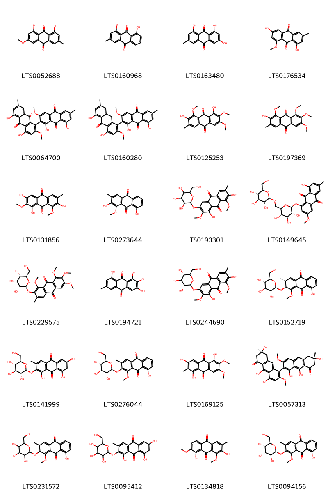
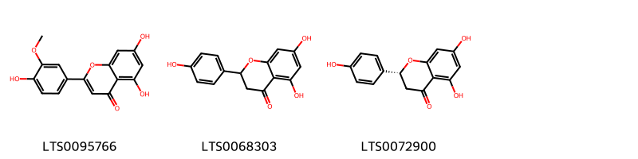
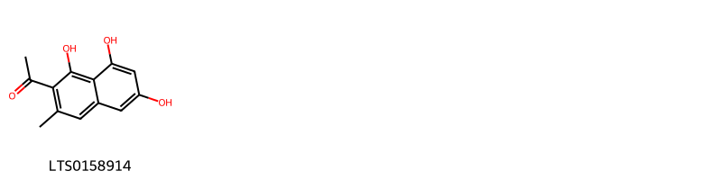
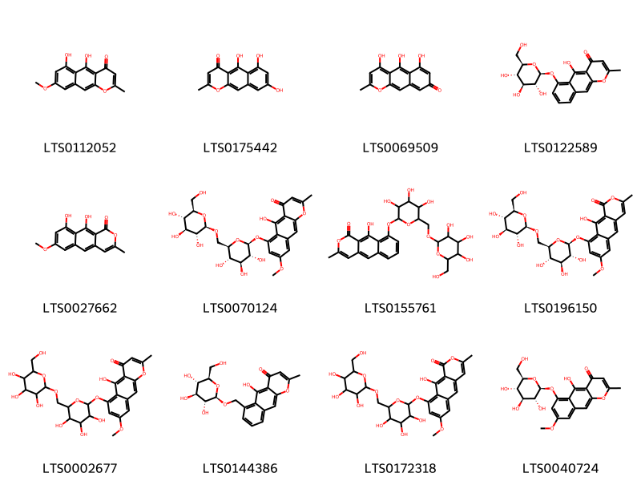
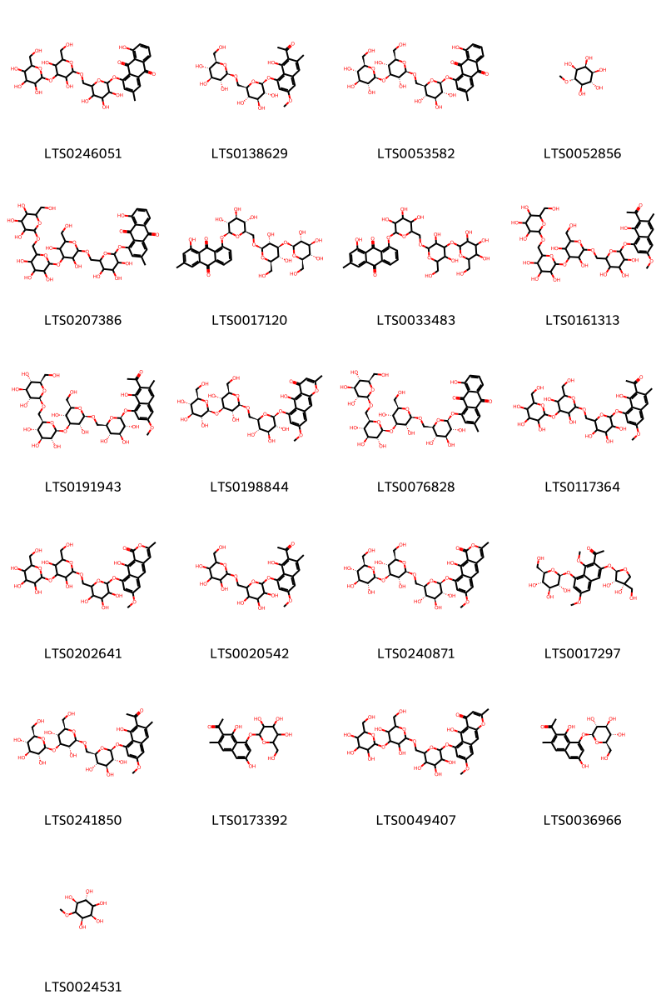
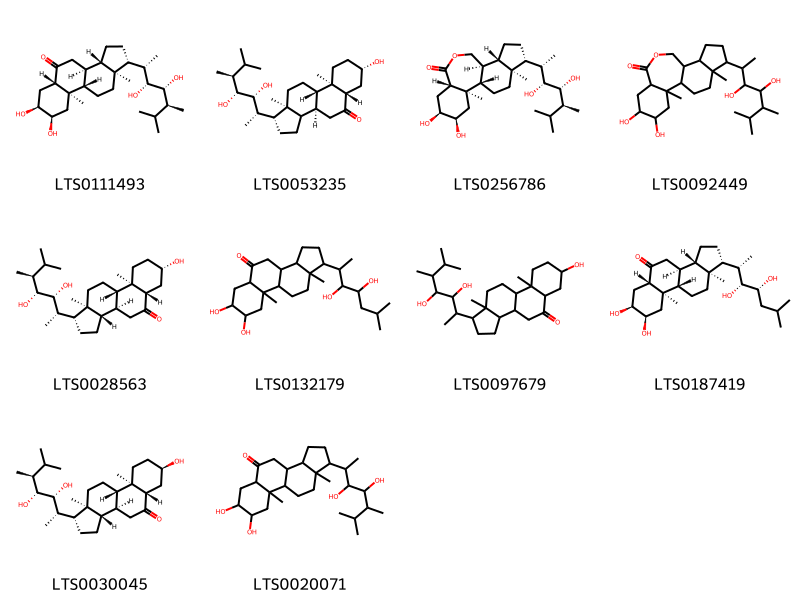

!!! abstract "Tóm tắt"
    Thảo Quyết Minh (quả), có tên khoa học là Senna tora (L.) Roxb. (Syn. Cassia tora L.), thuộc họ Đậu (Fabaceae). Cây phân bố rộng rãi ở nhiều khu vực nhiệt đới và cận nhiệt đới trên thế giới, bao gồm các quốc gia như Ấn Độ, Trung Quốc, các nước Đông Nam Á, châu Phi và nhiều đảo ở Thái Bình Dương. Tại Việt Nam, Thảo Quyết Minh mọc hoang khắp nơi và được thu hái chủ yếu vào mùa quả chín (tháng 9-11). Theo y học cổ truyền, dược liệu này có tác dụng tả can minh mục, an thần và nhuận tràng, được dùng trong các trường hợp như đau mắt đỏ, sợ ánh sáng, mắt mờ, chảy nước mắt, táo bón và mất ngủ. Ngoài ra, Thảo Quyết Minh còn có tác dụng diệt khuẩn, điều trị các bệnh ngoài da như hắc lào và chàm trẻ em. Thành phần hóa học chính của quả Thảo Quyết Minh gồm nhóm anthranoid, với các hoạt chất chủ yếu như antraglucozit, rein, và crysophanol, đóng góp vào các tác dụng dược lý của cây.

## Thông tin về thực vật

### Đặc điểm thực vật

Dược liệu **Thảo Quyết Minh (Hạt)** từ bộ phận **Hạt** từ loài *Senna tora (L.) Roxb.* thuộc họ Fabaceae. Thảo quyết minh là một cây nhỏ cao 0,30-
0,90m, có khi cao tới 1,5m. Lá mọc so le, kép, lông chim dìa chẩn, gồm 2 đến 4 đòi lá chét. Lá chét hình trứng ngược lại, phía đầu lá nở rộng ra, dài 3-5cm, rộng 15-25mm. Hoa mọc từ 1 đến 3 cái ở kẽ lá, màu vàng tươi. Quả là một giáp hình trụ dài 12-14cm, rồng 4mm, trong chứa chừng 25 hạt, cũng hình trụ ngắn chừng 5-7mm, rộng 2,5-3mm, hai đầu vát chéo, tròng hơi giống viên đá lửa, màu nâu nhạt, bóng. Vị nhạt hơi đắng và nhầy. 

!!! info "Phân loại thực vật của *Senna tora*"
    - **Kingdom:** Plantae
    - **Phylum:** Tracheophyta
    - **Order:** Fabales
    - **Family:** Fabaceae
    - **Genus:** Senna
    - **Species:** *Senna tora*

*Tài liệu tham khảo:* "Những cây thuốc và vị thuốc Việt Nam" - Đỗ Tất Lợi

 

### Loài thay thế (Nếu có)

### Phân bố trên thế giới
**Từ vườn thực vật KEW: **: Native to:
Belize, El Salvador

Introduced into:
Alabama, Andaman Is., Assam, Bangladesh, Benin, Bismarck Archipelago, Borneo, Cambodia, Cameroon, Central African Republic, Chad, China North-Central, China South-Central, China Southeast, Cook Is., East Himalaya, Fiji, Gambia, Ghana, Guinea, Gulf of Guinea Is., Hainan, India, Inner Mongolia, Jawa, Korea, Laccadive Is., Laos, Lesser Sunda Is., Liberia, Madagascar, Malaya, Maldives, Mali, Manchuria, Marianas, Marquesas, Mauritania, Mauritius, Myanmar, Nansei-shoto, Nepal, New Caledonia, New Guinea, Nicobar Is., Nigeria, Northern Territory, Oman, Pakistan, Philippines, Primorye, Qinghai, Queensland, Rodrigues, Réunion, Samoa, Saudi Arabia, Senegal, Seychelles, Sierra Leone, Society Is., Socotra, Solomon Is., South China Sea, Sri Lanka, Sudan, Sumatera, Taiwan, Tanzania, Thailand, Togo, Tonga, Trinidad-Tobago, Ukraine, Vanuatu, Vietnam, Wallis-Futuna Is., West Himalaya, Western Australia, Yemen, Zaïre

**Từ CSDL GIBF** Wallis and Futuna, Benin, Australia, Korea, Republic of, Myanmar, China, Hong Kong, Indonesia, United States of America, Viet Nam, Chinese Taipei, New Caledonia, Mayotte, India, Sri Lanka, Guinea, Thailand

### Phân bố tại Việt Nam
** "Những cây thuốc và vị thuốc Việt Nam" - Đỗ Tất Lợi**: Cây mọc hoang khắp nơi ở Việt Nam, khả năng thu mua rất lớn. Vào tháng 9-11, quả chín hái về, phơi khô, đập lấy hạt, lại phơi nữa cho thật khô.

**Từ CSDL GIBF**: Hải Phòng

---

## Thông tin về dược liệu 

### Định danh

!!! info "Thông tin về tên gọi của thảo quyết minh"
    - Dược liệu tiếng Việt: thảo quyết minh
    - Dược liệu tiếng Trung: None (None)
    - Dược liệu tiếng Anh: None
    - Dược liệu latin thông dụng: Semen Sennae torae
    - Dược liệu latin kiểu DĐVN: semen sennae torae
    - Dược liệu latin kiểu DĐVN: None
    - Dược liệu latin kiểu thông tư: None
    - Bộ phận dùng: Hạt (Semen)

### Mô tả dược liệu 
- **Theo dược điển Việt nam V:** 
Hạt hình trụ, đôi khi hình tháp, hai đầu vát chéo, dài 3 mm đến 6 mm, đường kính 1 mm đến 2.5 mm. Mặt ngoài màu nâu nhạt hay lục nâu, bóng. Bốn cạnh bên thường nổi rõ thành đường gò, một đường gở nhô lên thành ngấn. Thể chất cứng, khó tán vỡ. cắt ngang thấy nội nhữ màu xám trắng hay vàng nhạt, lá mầm màu vàng hay nâu nhạt. Không mùi, vị hơi đắng.

- **Mô tả dược liệu theo thông tư chế biến dược liệu theo phương pháp cổ truyền:** 

### Chế biến 

- **Chế biến theo dược điển việt nam V**: 
Thu hoạch quả già vào cuối mùa thu, khoảng tháng 9 đến tháng 11, phơi khô, đập lấy hạt, loại bỏ tạp chất, phơi khô. Bào chế Quyết minh tử: Loại bỏ tạp chất, rửa sạch, phơi hoặc sấy khô ở 50 °C đến 60 °C, khi dùng xay vỡ vụn. Quyết minh tử sao: Lấy Quyết minh tử sạch, cho vào chảo, đun nhỏ lửa, đảo chậm đến khi mặt ngoài của thuốc chuyển sang màu nâu sẫm, có mùi thơm, lấy ra để nguội.

- **Chế biến theo thông tư:** 

--- 

## Thành phần hóa học

- Theo tài liệu của GS. Đỗ Tất Lợi:  (1) Nhóm hóa học: Anthranoid
(2)Tên hoạt chất: Antraglucozit, rein, crysophanola.
    
- Theo cơ sở dữ liệu lotus: Từ loài *Senna tora* đã phân lập và xác định được 75 hoạt chất thuộc về các nhóm Naphthalenes, Anthracenes, Organooxygen compounds, Steroids and steroid derivatives, Glycerolipids, Naphthopyrans, Flavonoids, Purine nucleosides. 

|    | chemicalTaxonomyClassyfireClass   |   smiles_count |
|---:|:----------------------------------|---------------:|
|  0 | Anthracenes                       |             24 |
|  1 | Flavonoids                        |              3 |
|  2 | Glycerolipids                     |              2 |
|  3 | Naphthalenes                      |              1 |
|  4 | Naphthopyrans                     |             12 |
|  5 | Organooxygen compounds            |             21 |
|  6 | Purine nucleosides                |              1 |
|  7 | Steroids and steroid derivatives  |             10 |

### Nhóm Anthracenes
<figure markdown="span">
    { width=100% }
    <figcaption>Hình ảnh cấu trúc hóa học của 24 hoạt chất thuộc nhóm Anthracenes gồm ['physcion (LTS0052688)', 'turkey rhubarb (LTS0160968)', 'emodin (LTS0163480)', 'questin (LTS0176534)', "1',4,5,8'-tetrahydroxy-2,3'-dimethoxy-6',7-dimethyl-[1,2'-bianthracene]-9,9',10,10'-tetrone (LTS0064700)", "1',4,5,8'-tetrahydroxy-2,3'-dimethoxy-6',7-dimethyl-9h-[1,2'-bianthracene]-9',10,10'-trione (LTS0160280)", 'obtusin (LTS0125253)', 'chryso-obtusin (LTS0197369)', 'aurantio-obtusin (LTS0131856)', 'obtusifolin (LTS0273644)', '1,7-dihydroxy-2,8-dimethoxy-6-methyl-3-{[3,4,5-trihydroxy-6-(hydroxymethyl)oxan-2-yl]oxy}anthracene-9,10-dione (LTS0193301)', 'physcion diglucoside (LTS0149645)', 'chryso-obtusin glucoside (LTS0229575)', '7-hydroxyemodin (LTS0194721)', 'aurantio-obtusin β-d-glucoside (LTS0244690)', '(2s,3r)-8-hydroxy-1-methoxy-3-methyl-2-{[(2s,3r,4s,5s,6r)-3,4,5-trihydroxy-6-(hydroxymethyl)oxan-2-yl]oxy}-2,3-dihydroanthracene-9,10-dione (LTS0152719)', '1,6,8-trihydroxy-3-methyl-2-{[(2s,3r,4s,5s,6r)-3,4,5-trihydroxy-6-(hydroxymethyl)oxan-2-yl]oxy}anthracene-9,10-dione (LTS0141999)', 'obtusifolin 2-glucoside (LTS0276044)', '1,3,5-trihydroxy-6,7-dimethoxy-2-methylanthracene-9,10-dione (LTS0169125)', "(6's,7s)-1',4,6',7,9',10-hexahydroxy-2,3'-dimethoxy-6',7-dimethyl-5'h,6h,7'h,8h-[1,2'-bianthracene]-5,8'-dione (LTS0057313)", '8-hydroxy-1-methoxy-3-methyl-2-{[3,4,5-trihydroxy-6-(hydroxymethyl)oxan-2-yl]oxy}-2,3-dihydroanthracene-9,10-dione (LTS0231572)', '1,6,8-trihydroxy-3-methyl-2-{[3,4,5-trihydroxy-6-(hydroxymethyl)oxan-2-yl]oxy}anthracene-9,10-dione (LTS0095412)', '2,8-dihydroxy-1,7-dimethoxy-3-methylanthracene-9,10-dione (LTS0134818)', '8-hydroxy-1-methoxy-3-methyl-2-{[(2s,3s,4r,5s,6r)-3,4,5-trihydroxy-6-(hydroxymethyl)oxan-2-yl]oxy}anthracene-9,10-dione (LTS0094156)'].</figcaption>
</figure>
### Nhóm Flavonoids
<figure markdown="span">
    { width=100% }
    <figcaption>Hình ảnh cấu trúc hóa học của 3 hoạt chất thuộc nhóm Flavonoids gồm ['chrysoeriol (LTS0095766)', 'asahina (LTS0068303)', '(-)-naringenin (LTS0072900)'].</figcaption>
</figure>
### Nhóm Glycerolipids
<figure markdown="span">
    { width=100% }
    <figcaption>Hình ảnh cấu trúc hóa học của 2 hoạt chất thuộc nhóm Glycerolipids gồm ['oleoyl glycerol (LTS0013965)', 'glyceryl palmitate (LTS0073260)'].</figcaption>
</figure>
### Nhóm Naphthalenes
<figure markdown="span">
    { width=100% }
    <figcaption>Hình ảnh cấu trúc hóa học của 1 hoạt chất thuộc nhóm Naphthalenes gồm ['1-(1,6,8-trihydroxy-3-methylnaphthalen-2-yl)ethanone (LTS0158914)'].</figcaption>
</figure>
### Nhóm Naphthopyrans
<figure markdown="span">
    { width=100% }
    <figcaption>Hình ảnh cấu trúc hóa học của 12 hoạt chất thuộc nhóm Naphthopyrans gồm ['rubrofusarin (LTS0112052)', 'norrubrofusarin (LTS0175442)', '4,5,6-trihydroxy-2-methylcyclohexa[g]chromen-8-one (LTS0069509)', '5-hydroxy-2-methyl-6-{[(2s,3r,4s,5s,6r)-3,4,5-trihydroxy-6-(hydroxymethyl)oxan-2-yl]oxy}benzo[g]chromen-4-one (LTS0122589)', 'toralactone (LTS0027662)', '5-hydroxy-8-methoxy-2-methyl-6-{[(2s,3r,4s,5s,6r)-3,4,5-trihydroxy-6-({[(2r,3r,4s,5s,6r)-3,4,5-trihydroxy-6-(hydroxymethyl)oxan-2-yl]oxy}methyl)oxan-2-yl]oxy}benzo[g]chromen-4-one (LTS0070124)', '10-hydroxy-3-methyl-9-{[3,4,5-trihydroxy-6-({[3,4,5-trihydroxy-6-(hydroxymethyl)oxan-2-yl]oxy}methyl)oxan-2-yl]oxy}benzo[g]isochromen-1-one (LTS0155761)', '10-hydroxy-7-methoxy-3-methyl-9-{[(2s,3r,4s,5s,6r)-3,4,5-trihydroxy-6-({[(2r,3r,4s,5s,6r)-3,4,5-trihydroxy-6-(hydroxymethyl)oxan-2-yl]oxy}methyl)oxan-2-yl]oxy}benzo[g]isochromen-1-one (LTS0196150)', '5-hydroxy-8-methoxy-2-methyl-6-{[3,4,5-trihydroxy-6-({[3,4,5-trihydroxy-6-(hydroxymethyl)oxan-2-yl]oxy}methyl)oxan-2-yl]oxy}benzo[g]chromen-4-one (LTS0002677)', '5-hydroxy-2-methyl-6-({[(2r,3r,4s,5s,6r)-3,4,5-trihydroxy-6-(hydroxymethyl)oxan-2-yl]oxy}methyl)benzo[g]chromen-4-one (LTS0144386)', '10-hydroxy-7-methoxy-3-methyl-9-{[3,4,5-trihydroxy-6-({[3,4,5-trihydroxy-6-(hydroxymethyl)oxan-2-yl]oxy}methyl)oxan-2-yl]oxy}benzo[g]isochromen-1-one (LTS0172318)', '5-hydroxy-8-methoxy-2-methyl-6-{[(2s,3r,4s,5s,6r)-3,4,5-trihydroxy-6-(hydroxymethyl)oxan-2-yl]oxy}benzo[g]chromen-4-one (LTS0040724)'].</figcaption>
</figure>
### Nhóm Organooxygen compounds
<figure markdown="span">
    { width=100% }
    <figcaption>Hình ảnh cấu trúc hóa học của 21 hoạt chất thuộc nhóm Organooxygen compounds gồm ['1-{[6-({[3,5-dihydroxy-6-(hydroxymethyl)-4-{[3,4,5-trihydroxy-6-(hydroxymethyl)oxan-2-yl]oxy}oxan-2-yl]oxy}methyl)-3,4,5-trihydroxyoxan-2-yl]oxy}-8-hydroxy-3-methylanthracene-9,10-dione (LTS0246051)', '1-(1-hydroxy-6-methoxy-3-methyl-8-{[(2s,3r,4s,5s,6r)-3,4,5-trihydroxy-6-({[(2r,3r,4s,5s,6r)-3,4,5-trihydroxy-6-(hydroxymethyl)oxan-2-yl]oxy}methyl)oxan-2-yl]oxy}naphthalen-2-yl)ethanone (LTS0138629)', '1-{[(2s,3r,4s,5s,6r)-6-({[(2r,3r,4s,5r,6r)-3,5-dihydroxy-6-(hydroxymethyl)-4-{[(2s,3r,4s,5s,6r)-3,4,5-trihydroxy-6-(hydroxymethyl)oxan-2-yl]oxy}oxan-2-yl]oxy}methyl)-3,4,5-trihydroxyoxan-2-yl]oxy}-8-hydroxy-3-methylanthracene-9,10-dione (LTS0053582)', 'ononitol (LTS0052856)', '1-{[6-({[3,5-dihydroxy-6-(hydroxymethyl)-4-{[3,4,5-trihydroxy-6-({[3,4,5-trihydroxy-6-(hydroxymethyl)oxan-2-yl]oxy}methyl)oxan-2-yl]oxy}oxan-2-yl]oxy}methyl)-3,4,5-trihydroxyoxan-2-yl]oxy}-8-hydroxy-3-methylanthracene-9,10-dione (LTS0207386)', '8-{[(2s,3r,4s,5s,6r)-6-({[(2r,3r,4s,5r,6r)-3,5-dihydroxy-6-(hydroxymethyl)-4-{[(2s,3r,4s,5s,6r)-3,4,5-trihydroxy-6-(hydroxymethyl)oxan-2-yl]oxy}oxan-2-yl]oxy}methyl)-3,4,5-trihydroxyoxan-2-yl]oxy}-1-hydroxy-3-methylanthracene-9,10-dione (LTS0017120)', '8-{[6-({[3,5-dihydroxy-6-(hydroxymethyl)-4-{[3,4,5-trihydroxy-6-(hydroxymethyl)oxan-2-yl]oxy}oxan-2-yl]oxy}methyl)-3,4,5-trihydroxyoxan-2-yl]oxy}-1-hydroxy-3-methylanthracene-9,10-dione (LTS0033483)', '1-(8-{[6-({[3,5-dihydroxy-6-(hydroxymethyl)-4-{[3,4,5-trihydroxy-6-({[3,4,5-trihydroxy-6-(hydroxymethyl)oxan-2-yl]oxy}methyl)oxan-2-yl]oxy}oxan-2-yl]oxy}methyl)-3,4,5-trihydroxyoxan-2-yl]oxy}-1-hydroxy-6-methoxy-3-methylnaphthalen-2-yl)ethanone (LTS0161313)', '1-(8-{[(2s,3r,4s,5s,6r)-6-({[(2r,3r,4s,5r,6r)-3,5-dihydroxy-6-(hydroxymethyl)-4-{[(2s,3r,4s,5s,6r)-3,4,5-trihydroxy-6-({[(2r,3r,4s,5s,6r)-3,4,5-trihydroxy-6-(hydroxymethyl)oxan-2-yl]oxy}methyl)oxan-2-yl]oxy}oxan-2-yl]oxy}methyl)-3,4,5-trihydroxyoxan-2-yl]oxy}-1-hydroxy-6-methoxy-3-methylnaphthalen-2-yl)ethanone (LTS0191943)', '6-{[(2s,3r,4s,5s,6r)-6-({[(2r,3r,4s,5r,6r)-3,5-dihydroxy-6-(hydroxymethyl)-4-{[(2s,3r,4s,5s,6r)-3,4,5-trihydroxy-6-(hydroxymethyl)oxan-2-yl]oxy}oxan-2-yl]oxy}methyl)-3,4,5-trihydroxyoxan-2-yl]oxy}-5-hydroxy-8-methoxy-2-methylbenzo[g]chromen-4-one (LTS0198844)', '1-{[(2s,3r,4s,5s,6r)-6-({[(2r,3r,4s,5r,6r)-3,5-dihydroxy-6-(hydroxymethyl)-4-{[(2s,3r,4s,5s,6r)-3,4,5-trihydroxy-6-({[(2r,3r,4s,5s,6r)-3,4,5-trihydroxy-6-(hydroxymethyl)oxan-2-yl]oxy}methyl)oxan-2-yl]oxy}oxan-2-yl]oxy}methyl)-3,4,5-trihydroxyoxan-2-yl]oxy}-8-hydroxy-3-methylanthracene-9,10-dione (LTS0076828)', '1-(8-{[6-({[3,5-dihydroxy-6-(hydroxymethyl)-4-{[3,4,5-trihydroxy-6-(hydroxymethyl)oxan-2-yl]oxy}oxan-2-yl]oxy}methyl)-3,4,5-trihydroxyoxan-2-yl]oxy}-1-hydroxy-6-methoxy-3-methylnaphthalen-2-yl)ethanone (LTS0117364)', '9-{[6-({[3,5-dihydroxy-6-(hydroxymethyl)-4-{[3,4,5-trihydroxy-6-(hydroxymethyl)oxan-2-yl]oxy}oxan-2-yl]oxy}methyl)-3,4,5-trihydroxyoxan-2-yl]oxy}-10-hydroxy-7-methoxy-3-methylbenzo[g]isochromen-1-one (LTS0202641)', '1-(1-hydroxy-6-methoxy-3-methyl-8-{[3,4,5-trihydroxy-6-({[3,4,5-trihydroxy-6-(hydroxymethyl)oxan-2-yl]oxy}methyl)oxan-2-yl]oxy}naphthalen-2-yl)ethanone (LTS0020542)', '9-{[(2s,3r,4s,5s,6r)-6-({[(2r,3r,4s,5r,6r)-3,5-dihydroxy-6-(hydroxymethyl)-4-{[(2s,3r,4s,5s,6r)-3,4,5-trihydroxy-6-(hydroxymethyl)oxan-2-yl]oxy}oxan-2-yl]oxy}methyl)-3,4,5-trihydroxyoxan-2-yl]oxy}-10-hydroxy-7-methoxy-3-methylbenzo[g]isochromen-1-one (LTS0240871)', '1-(3-{[(2r,3s,4s)-3,4-dihydroxy-4-(hydroxymethyl)oxolan-2-yl]oxy}-1,6-dimethoxy-8-{[(2s,3r,4s,5s,6r)-3,4,5-trihydroxy-6-(hydroxymethyl)oxan-2-yl]oxy}naphthalen-2-yl)ethanone (LTS0017297)', '1-(8-{[(2s,3r,4s,5s,6r)-6-({[(2r,3r,4s,5r,6r)-3,5-dihydroxy-6-(hydroxymethyl)-4-{[(2s,3r,4s,5s,6r)-3,4,5-trihydroxy-6-(hydroxymethyl)oxan-2-yl]oxy}oxan-2-yl]oxy}methyl)-3,4,5-trihydroxyoxan-2-yl]oxy}-1-hydroxy-6-methoxy-3-methylnaphthalen-2-yl)ethanone (LTS0241850)', '1-(1,6-dihydroxy-3-methyl-8-{[3,4,5-trihydroxy-6-(hydroxymethyl)oxan-2-yl]oxy}naphthalen-2-yl)ethanone (LTS0173392)', '6-{[6-({[3,5-dihydroxy-6-(hydroxymethyl)-4-{[3,4,5-trihydroxy-6-(hydroxymethyl)oxan-2-yl]oxy}oxan-2-yl]oxy}methyl)-3,4,5-trihydroxyoxan-2-yl]oxy}-5-hydroxy-8-methoxy-2-methylbenzo[g]chromen-4-one (LTS0049407)', '1-(1,6-dihydroxy-3-methyl-8-{[(2s,3r,4s,5s,6r)-3,4,5-trihydroxy-6-(hydroxymethyl)oxan-2-yl]oxy}naphthalen-2-yl)ethanone (LTS0036966)', '(1r,2r,4r,5s)-6-methoxycyclohexane-1,2,3,4,5-pentol (LTS0024531)'].</figcaption>
</figure>
### Nhóm Purine nucleosides
<figure markdown="span">
    { width=100% }
    <figcaption>Hình ảnh cấu trúc hóa học của 1 hoạt chất thuộc nhóm Purine nucleosides gồm ['adenosine (LTS0014061)'].</figcaption>
</figure>
### Nhóm Steroids and steroid derivatives
<figure markdown="span">
    { width=100% }
    <figcaption>Hình ảnh cấu trúc hóa học của 10 hoạt chất thuộc nhóm Steroids and steroid derivatives gồm ['castasterone (LTS0111493)', '(1r,3bs,5as,7s,9ar,9bs,11as)-1-[(2s,3r,4r,5s)-3,4-dihydroxy-5,6-dimethylheptan-2-yl]-7-hydroxy-9a,11a-dimethyl-tetradecahydrocyclopenta[a]phenanthren-5-one (LTS0053235)', 'brassinolide (LTS0256786)', '24-epibrassinolide (LTS0092449)', 'teasterone (LTS0028563)', '1-(3,4-dihydroxy-6-methylheptan-2-yl)-7,8-dihydroxy-9a,11a-dimethyl-tetradecahydrocyclopenta[a]phenanthren-5-one (LTS0132179)', '1-(3,4-dihydroxy-5,6-dimethylheptan-2-yl)-7-hydroxy-9a,11a-dimethyl-tetradecahydrocyclopenta[a]phenanthren-5-one (LTS0097679)', '(1r,3as,3bs,5as,7s,8r,9ar,9bs,11as)-1-[(2s,3r,4r)-3,4-dihydroxy-6-methylheptan-2-yl]-7,8-dihydroxy-9a,11a-dimethyl-tetradecahydrocyclopenta[a]phenanthren-5-one (LTS0187419)', 'typhasterol (LTS0030045)', '1-(3,4-dihydroxy-5,6-dimethylheptan-2-yl)-7,8-dihydroxy-9a,11a-dimethyl-tetradecahydrocyclopenta[a]phenanthren-5-one (LTS0020071)'].</figcaption>
</figure>

---

## Tác dụng dược lý

Theo tài liệu "Những cây thuốc và vị thuốc Việt Nam" - Đỗ Tất Lợi:- Tăng sự co bóp của ruột làm cho sự tiêu hoá được tăng cường, đại tiện cũng dễ, phân mềm mà lỏng, không gây đau bụng.
- Tác dụng diệt khuẩn, dùng trong điều trị bệnh hắc lào, nấm ở ngoài da như chàm trẻ em.​

Theo tài liệu quốc tế: 

---

## Dược điển Việt Nam V

### Soi bột:

<!-- Hình ảnh soi bột sẽ được tự động chèn vào đây sau -->
### Vi phẫu:

<!-- Hình ảnh vi phẫu sẽ được tự động chèn vào đây sau -->
### Định tính

A.Lấy khoảng 0,5 g bột dược liệu, thêm 10 ml dung dịch acid sulfuric 10 % (TT), đun cách thủy sôi 10 min. Sau khi nguội, thêm 10 ml cloroform (TT) vào hỗn hợp trên, lắc đều, để yên cho tách thành hai lớp. Gạn lấy lớp cloroform, thêm 2 ml đến 3 ml dung dịch amoniac 10 % (TT), lắc, lớp nước sẽ có màu đỏ. B. Lấy 0,5 g bột dược liệu cho vào một chén nung nhỏ bằng sứ. Hơ nóng nhẹ trên ngọn lửa đèn cồn và khuấy đều lớp bột cho bay hết hơi nước. Sau đó đậy chén nung bằng một phiến kính thích hợp và đặt lên trên tấm kính túm bông tẩm nước lạnh rồi đốt mạnh trong khoảng 5 min. Lấy tấm kính ra soi dưới kính hiển vi sẽ quan sát thấy những tinh thể hình kim màu vàng. Nhỏ lên đám tinh thể một giọt dung dịch natri hydroxyd 10 % (TT), dung dịch sẽ có màu hồng.

### Định lượng

### Thông tin khác 
- ** Độ ẩm: ** 
Không quá 12,0 % (Phụ lục 9.6, 1 g, 105 °C, 4 h).

- ** Bảo quản:** 
Nơi khô ráo thoáng mát, tránh mốc mọt.nn

## Dược điển Hồng kong

<!-- PDF sẽ được tự động chèn vào đây sau -->

---

## Y dược học cổ truyền

- **Tên vị thuốc:** Thảo quyết minh
- **Tính vị quy kinh:** Hàm, bình. Quy vào các kinh can, thận, đại tràng.
- **Công năng chủ trị:** Tả can minh mục, an thần, nhuận tràng.

Chủ trị: Đau mắt đỏ, sợ ánh sáng, mắt mờ, chảy nước mắt (sao vàng), đại tiện bí kết (dùng sống), mất ngủ (sao đen).
- **Chú ý:** 
- **Kiêng kỵ:** 
Người hay bị phân lỏng không dùng.nn

