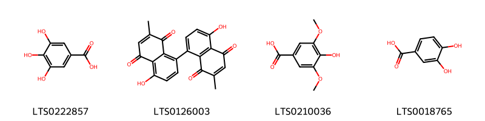
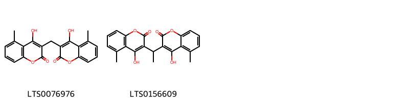
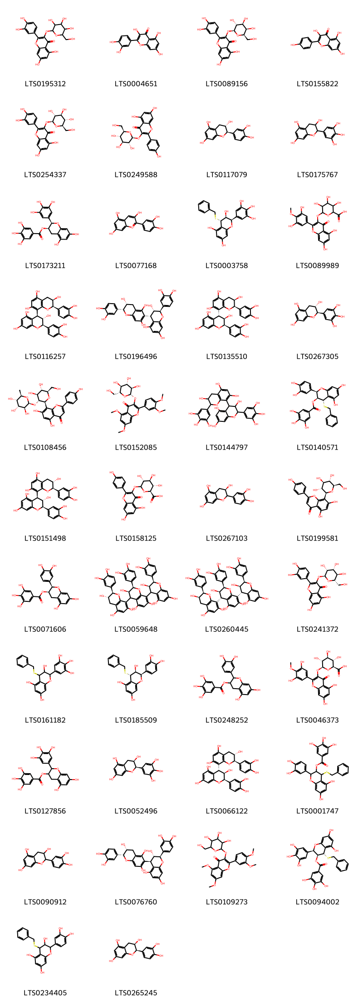
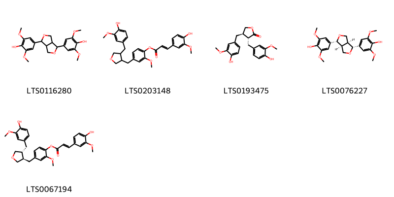
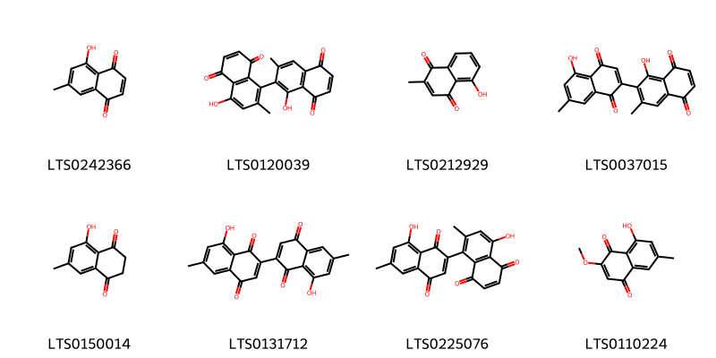
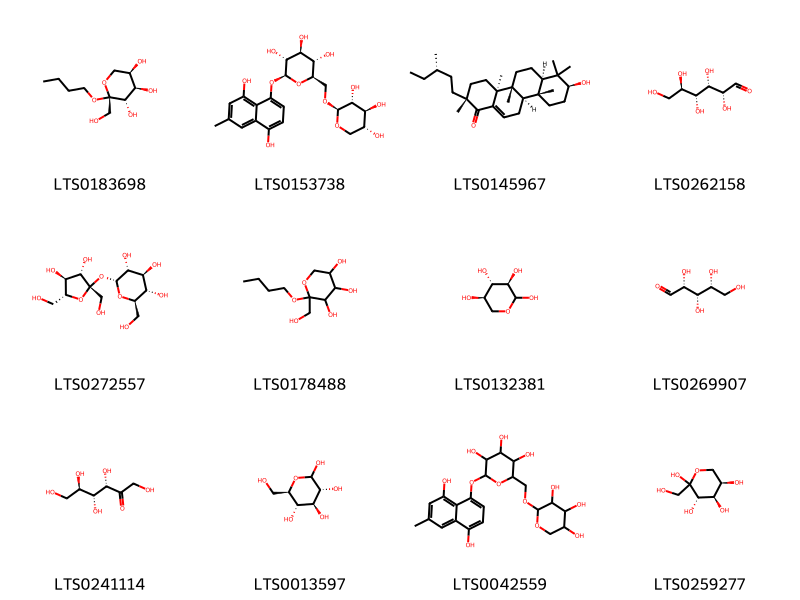
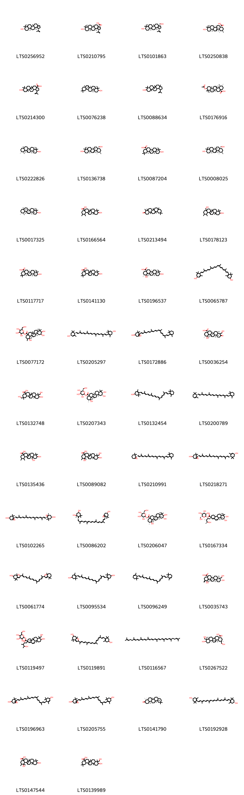
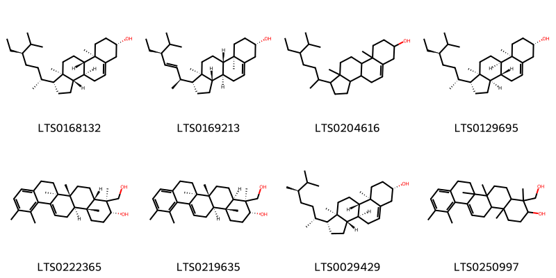
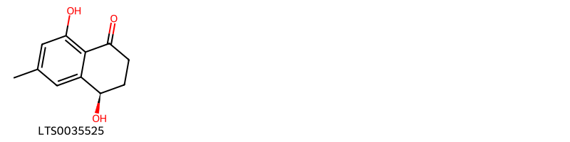

!!! abstract "Tóm tắt"
    Thị đế có tên khoa học là Diospyros kaki L.f, họ Thị (Ebenaceae). Tại Việt Nam cây được trồng tại khắp các tỉnh miền Bắc Việt Nam. Bài thuốc có thị đế dùng trong nhân dân
để chữa đầy bụng, nấc: thị đế 8g, đinh hương 8g, sinh khương 5 lát, nước 600ml, sắc còn 200ml, chia nhiều lần uống trong ngày. Trong khi dùng, cần tuỳ trường hợp thêm bớt vị đinh hương và thị đế, ví dụ nóng nhiều thì giảm đinh hương, tăng thị đế, ngược lại lạnh nhiều thì tăng đinh hương, giảm thị đế. Thị đế  có tác dụng chống viêm, chống oxy hóa. Thị đế có chứa các thành phần hóa học chính là tanin thuộc nhóm polyphenol. Trong tanin có chứa nhiều loại axit như axit tritecpenic, oleanolic, axit ursolic, axit betulinic.

## Thông tin về thực vật

### Đặc điểm thực vật

Dược liệu **Thị Đế** từ bộ phận **nan** từ loài *Diospyros kaki L.f.* thuộc họ Ebenaceae. Cây hồng là một cây nhỡ cao chừng 5-6m, có thể tới 10m nhiều cành. Lá mọc so le, có cuống ngắn, dài không quá 1cm. Phiến lá thuôn hình trứng, dài 7-14cm, rộng 4-8cm, mép nguyên hay hơi lượn sóng.
Tháng 6 ra hoa màu vàng trắng nhạt. Cây đực, cây cái riêng biệt hoặc có khi hoa đực, hoa cái có trên cùng một cây. Hoa đực mọc từng 2-3 cái một thành hình tán, hoa cái mọc đơn độc. Tháng 9-10 ra quả khi chín có màu vàng hay đỏ thẫm. 

!!! info "Phân loại thực vật của *Diospyros kaki*"
    - **Kingdom:** Plantae
    - **Phylum:** Tracheophyta
    - **Order:** Ericales
    - **Family:** Ebenaceae
    - **Genus:** Diospyros
    - **Species:** *Diospyros kaki*

*Tài liệu tham khảo:* "Những cây thuốc và vị thuốc Việt Nam" - Đỗ Tất Lợi

 

### Loài thay thế (Nếu có)

### Phân bố trên thế giới
**Từ vườn thực vật KEW: **: Có nguồn gốc từ:
Assam, Trung Bắc-Trung Bộ, Trung Nam-Trung Bộ, Đông Nam Bộ, Hải Nam, Đài Loan, Việt Nam
Được di thực:
Bangladesh, Bulgaria, Nhật Bản, Hàn Quốc, Nansei-shoto, Philippines, Queensland, Transcaucasus

**Từ CSDL GIBF** nan, Australia, Austria, Spain, Croatia, Germany, Montenegro, Brazil, New Zealand, Georgia, Korea, Republic of, Indonesia, Hong Kong, North Macedonia, Italy, Bulgaria, Greece, China, Türkiye, Japan, South Africa, Russian Federation, Viet Nam, United States of America, Chinese Taipei, Portugal, France

### Phân bố tại Việt Nam
** "Những cây thuốc và vị thuốc Việt Nam" - Đỗ Tất Lợi**: Được trồng tại khắp các tỉnh miền Bắc Việt Nam.

**Từ CSDL GIBF**: Lâm Đồng

---

## Thông tin về dược liệu 

### Định danh

!!! info "Thông tin về tên gọi của nan"
    - Dược liệu tiếng Việt: nan
    - Dược liệu tiếng Trung: nan (nan)
    - Dược liệu tiếng Anh: nan
    - Dược liệu latin thông dụng: nan
    - Dược liệu latin kiểu DĐVN: diospyros kaki l.f.
    - Dược liệu latin kiểu DĐVN: nan
    - Dược liệu latin kiểu thông tư: nan
    - Bộ phận dùng: nan (nan)

### Mô tả dược liệu 
- **Theo dược điển Việt nam V:** nan

- **Mô tả dược liệu theo thông tư chế biến dược liệu theo phương pháp cổ truyền:** nan

### Chế biến 

- **Chế biến theo dược điển việt nam V**: nan

- **Chế biến theo thông tư:** nan

--- 

## Thành phần hóa học

- Theo tài liệu của GS. Đỗ Tất Lợi:  Thị đế có chứa các thành phần hóa học chính là tanin thuộc nhóm polyphenol. Trong tanin có chứa nhiều loại axit như axit tritecpenic, oleanolic, axit ursolic, axit betulinic.
    
- Theo cơ sở dữ liệu lotus: Từ loài *Diospyros kaki* đã phân lập và xác định được 206 hoạt chất thuộc về các nhóm Tetralins, Lignan glycosides, Dibenzylbutane lignans, Tannins, Organooxygen compounds, Tetrapyrroles and derivatives, Prenol lipids, Steroids and steroid derivatives, Benzene and substituted derivatives, Coumarins and derivatives, Flavonoids, Furanoid lignans, Cinnamic acids and derivatives, Naphthalenes. 

|    | chemicalTaxonomyClassyfireClass     |   smiles_count |
|---:|:------------------------------------|---------------:|
|  0 | Benzene and substituted derivatives |              4 |
|  1 | Cinnamic acids and derivatives      |              2 |
|  2 | Coumarins and derivatives           |              2 |
|  3 | Dibenzylbutane lignans              |              2 |
|  4 | Flavonoids                          |             42 |
|  5 | Furanoid lignans                    |              5 |
|  6 | Lignan glycosides                   |              2 |
|  7 | Naphthalenes                        |              8 |
|  8 | Organooxygen compounds              |             12 |
|  9 | Prenol lipids                       |            110 |
| 10 | Steroids and steroid derivatives    |              8 |
| 11 | Tannins                             |              1 |
| 12 | Tetralins                           |              1 |
| 13 | Tetrapyrroles and derivatives       |              4 |

### Nhóm Benzene and substituted derivatives
<figure markdown="span">
    { width=100% }
    <figcaption>Hình ảnh cấu trúc hóa học của 4 hoạt chất thuộc nhóm Benzene and substituted derivatives gồm ['galop (LTS0222857)', 'maritinone (LTS0126003)', 'syringic acid (LTS0210036)', '3,4-dihydroxybenzoic acid (LTS0018765)'].</figcaption>
</figure>
### Nhóm Cinnamic acids and derivatives
<figure markdown="span">
    { width=100% }
    <figcaption>Hình ảnh cấu trúc hóa học của 2 hoạt chất thuộc nhóm Cinnamic acids and derivatives gồm ['para-coumaric acid (LTS0266252)', 'ferulic acid (LTS0077328)'].</figcaption>
</figure>
### Nhóm Coumarins and derivatives
<figure markdown="span">
    { width=100% }
    <figcaption>Hình ảnh cấu trúc hóa học của 2 hoạt chất thuộc nhóm Coumarins and derivatives gồm ['4-hydroxy-3-[(4-hydroxy-5-methyl-2-oxochromen-3-yl)methyl]-5-methylchromen-2-one (LTS0076976)', '4-hydroxy-3-[1-(4-hydroxy-5-methyl-2-oxochromen-3-yl)ethyl]-5-methylchromen-2-one (LTS0156609)'].</figcaption>
</figure>
### Nhóm Dibenzylbutane lignans
<figure markdown="span">
    { width=100% }
    <figcaption>Hình ảnh cấu trúc hóa học của 2 hoạt chất thuộc nhóm Dibenzylbutane lignans gồm ['(2s,3r)-2,3-bis[(4-hydroxy-3-methoxyphenyl)(¹³c)methyl](1-¹³c)butane-1,4-diol (LTS0268699)', 'secoisolariciresinol (LTS0086727)'].</figcaption>
</figure>
### Nhóm Flavonoids
<figure markdown="span">
    { width=100% }
    <figcaption>Hình ảnh cấu trúc hóa học của 42 hoạt chất thuộc nhóm Flavonoids gồm ['2-(3,4-dihydroxyphenyl)-5,7-dihydroxy-3-{[3,4,5-trihydroxy-6-(hydroxymethyl)oxan-2-yl]oxy}chromen-4-one (LTS0195312)', 'quercetin (LTS0004651)', 'hyperoside (LTS0089156)', 'kaempherol (LTS0155822)', 'isoquercetin (LTS0254337)', 'astragalin (LTS0249588)', '(+)-catechol (LTS0117079)', 'epigallocatechin (LTS0175767)', '(-)-epigallocatechin gallate (LTS0173211)', 'cyanidin (LTS0077168)', '(2r,3s,4s)-4-(benzylsulfanyl)-2-(3,4,5-trihydroxyphenyl)-3,4-dihydro-2h-1-benzopyran-3,5,7-triol (LTS0003758)', '6-{[2-(3,5-dihydroxy-4-methoxyphenyl)-5,7-dihydroxy-4-oxochromen-3-yl]oxy}-3,4,5-trihydroxyoxane-2-carboxylic acid (LTS0089989)', '(2r,3s,4s)-2-(3,4-dihydroxyphenyl)-4-[(2r,3r)-2-(3,4-dihydroxyphenyl)-3,5,7-trihydroxy-3,4-dihydro-2h-1-benzopyran-8-yl]-3,4-dihydro-2h-1-benzopyran-3,5,7-triol (LTS0116257)', '(2r,3s,4s)-2-(3,4-dihydroxyphenyl)-4-[(2r,3r)-2-(3,4-dihydroxyphenyl)-3,5,7-trihydroxy-3,4-dihydro-2h-1-benzopyran-6-yl]-3,4-dihydro-2h-1-benzopyran-3,5,7-triol (LTS0196496)', '(2r,3r,4r)-2-(3,4-dihydroxyphenyl)-4-[(2r,3r)-2-(3,4-dihydroxyphenyl)-3,5,7-trihydroxy-3,4-dihydro-2h-1-benzopyran-8-yl]-3,4-dihydro-2h-1-benzopyran-3,5,7-triol (LTS0135510)', 'gallocatechol (LTS0267305)', '8-[(2s,3r,4s,5s,6r)-4,5-dihydroxy-6-(hydroxymethyl)-3-{[(2s,3s,4r,5s,6r)-3,4,5-trihydroxy-6-methyloxan-2-yl]oxy}oxan-2-yl]-5,7-dihydroxy-2-(4-hydroxyphenyl)chromen-4-one (LTS0108456)', '2-(3,4-dimethoxyphenyl)-5,7-dimethoxy-3-{[(2s,3r,4s,5s,6r)-3,4,5-trihydroxy-6-(hydroxymethyl)oxan-2-yl]oxy}chromen-4-one (LTS0152085)', '4-[3,5,7-trihydroxy-2-(3,4,5-trihydroxyphenyl)-3,4-dihydro-2h-1-benzopyran-8-yl]-2-(3,4,5-trihydroxyphenyl)-3,4-dihydro-2h-1-benzopyran-3,5,7-triol (LTS0144797)', '(2r,3s,4s)-4-(benzylsulfanyl)-2-(3,4-dihydroxyphenyl)-5,7-dihydroxy-3,4-dihydro-2h-1-benzopyran-3-yl 3,4,5-trihydroxybenzoate (LTS0140571)', '(2r,3s,4s)-2-(3,4-dihydroxyphenyl)-4-[(2r,3s)-2-(3,4-dihydroxyphenyl)-3,5,7-trihydroxy-3,4-dihydro-2h-1-benzopyran-8-yl]-3,4-dihydro-2h-1-benzopyran-3,5,7-triol (LTS0151498)', '(2s,3s,4s,5r)-6-{[5,7-dihydroxy-2-(4-hydroxyphenyl)-4-oxochromen-3-yl]oxy}-3,4,5-trihydroxyoxane-2-carboxylic acid (LTS0158125)', '(3r)-2-(3,4-dihydroxyphenyl)-3,4-dihydro-2h-1-benzopyran-3,5,7-triol (LTS0267103)', 'vitexin (LTS0199581)', 'epicatechin gallate (LTS0071606)', '(2r,3r)-2-(3,4-dihydroxyphenyl)-8-[(2r,3r)-2-(3,4-dihydroxyphenyl)-3,5,7-trihydroxy-3,4-dihydro-2h-1-benzopyran-4-yl]-4-[(2r,3s)-2-(3,4-dihydroxyphenyl)-3,5,7-trihydroxy-3,4-dihydro-2h-1-benzopyran-8-yl]-3,4-dihydro-2h-1-benzopyran-3,5,7-triol (LTS0059648)', 'procyanidin c1 (LTS0260445)', '2-(3,4-dihydroxyphenyl)-5,7-dihydroxy-3-{[(2s,3r,4r,5r,6s)-3,4,5-trihydroxy-6-(hydroxymethyl)oxan-2-yl]oxy}chromen-4-one (LTS0241372)', '4-(benzylsulfanyl)-2-(3,4,5-trihydroxyphenyl)-3,4-dihydro-2h-1-benzopyran-3,5,7-triol (LTS0161182)', '(2r,3s,4s)-4-(benzylsulfanyl)-2-(3,4-dihydroxyphenyl)-3,4-dihydro-2h-1-benzopyran-3,5,7-triol (LTS0185509)', '2-(3,4-dihydroxyphenyl)-5,7-dihydroxy-3,4-dihydro-2h-1-benzopyran-3-yl 3,4,5-trihydroxybenzoate (LTS0248252)', '(2s,3s,4s,5r,6s)-6-{[2-(3,5-dihydroxy-4-methoxyphenyl)-5,7-dihydroxy-4-oxochromen-3-yl]oxy}-3,4,5-trihydroxyoxane-2-carboxylic acid (LTS0046373)', '5,7-dihydroxy-2-(3,4,5-trihydroxyphenyl)-3,4-dihydro-2h-1-benzopyran-3-yl 3,4,5-trihydroxybenzoate (LTS0127856)', 'epigallocatechin (LTS0052496)', '(2r,3r,4r)-2-(3,4-dihydroxyphenyl)-4-[(2r,3s)-2-(3,4-dihydroxyphenyl)-3,5,7-trihydroxy-3,4-dihydro-2h-1-benzopyran-8-yl]-3,4-dihydro-2h-1-benzopyran-3,5,7-triol (LTS0066122)', '4-(benzylsulfanyl)-2-(3,4-dihydroxyphenyl)-5,7-dihydroxy-3,4-dihydro-2h-1-benzopyran-3-yl 3,4,5-trihydroxybenzoate (LTS0001747)', 'catechol (LTS0090912)', '(2r,3s,4r)-2-(3,4-dihydroxyphenyl)-4-[(2r,3r)-2-(3,4-dihydroxyphenyl)-3,5,7-trihydroxy-3,4-dihydro-2h-1-benzopyran-6-yl]-3,4-dihydro-2h-1-benzopyran-3,5,7-triol (LTS0076760)', '2-(3,4-dimethoxyphenyl)-5,7-dimethoxy-3-{[3,4,5-trihydroxy-6-(hydroxymethyl)oxan-2-yl]oxy}chromen-4-one (LTS0109273)', '(2r,3s,4s)-4-(benzylsulfanyl)-5,7-dihydroxy-2-(3,4,5-trihydroxyphenyl)-3,4-dihydro-2h-1-benzopyran-3-yl 3,4,5-trihydroxybenzoate (LTS0094002)', '4-(benzylsulfanyl)-2-(3,4-dihydroxyphenyl)-3,4-dihydro-2h-1-benzopyran-3,5,7-triol (LTS0234405)', 'ent-epicatechin (LTS0265245)'].</figcaption>
</figure>
### Nhóm Furanoid lignans
<figure markdown="span">
    { width=100% }
    <figcaption>Hình ảnh cấu trúc hóa học của 5 hoạt chất thuộc nhóm Furanoid lignans gồm ['syringaresinol (LTS0116280)', '4-({4-[(4-hydroxy-3-methoxyphenyl)methyl]oxolan-3-yl}methyl)-2-methoxyphenyl 3-(4-hydroxy-3-methoxyphenyl)prop-2-enoate (LTS0203148)', 'matairesinol (LTS0193475)', '(-)-syringaresinol (LTS0076227)', '4-{[(3r,4r)-4-[(4-hydroxy-3-methoxyphenyl)methyl]oxolan-3-yl]methyl}-2-methoxyphenyl (2e)-3-(4-hydroxy-3-methoxyphenyl)prop-2-enoate (LTS0067194)'].</figcaption>
</figure>
### Nhóm Lignan glycosides
<figure markdown="span">
    { width=100% }
    <figcaption>Hình ảnh cấu trúc hóa học của 2 hoạt chất thuộc nhóm Lignan glycosides gồm ['2-{4-[4-(4-hydroxy-3,5-dimethoxyphenyl)-hexahydrofuro[3,4-c]furan-1-yl]-2,6-dimethoxyphenoxy}-6-(hydroxymethyl)oxane-3,4,5-triol (LTS0209275)', '(2s,3r,4s,5s,6r)-2-{4-[(1r,3as,4r,6as)-4-(4-hydroxy-3,5-dimethoxyphenyl)-hexahydrofuro[3,4-c]furan-1-yl]-2,6-dimethoxyphenoxy}-6-(hydroxymethyl)oxane-3,4,5-triol (LTS0010090)'].</figcaption>
</figure>
### Nhóm Naphthalenes
<figure markdown="span">
    { width=100% }
    <figcaption>Hình ảnh cấu trúc hóa học của 8 hoạt chất thuộc nhóm Naphthalenes gồm ['7-methyljuglone (LTS0242366)', 'isodiospyrin (LTS0120039)', 'plumbagin (LTS0212929)', 'euclein (LTS0037015)', '5-hydroxy-7-methyl-2,3-dihydronaphthalene-1,4-dione (LTS0150014)', "8,8'-dihydroxy-6,6'-dimethyl-[2,2'-binaphthalene]-1,1',4,4'-tetrone (LTS0131712)", "4,8'-dihydroxy-2,6'-dimethyl-[1,2'-binaphthalene]-1',4',5,8-tetrone (LTS0225076)", '8-hydroxy-2-methoxy-6-methylnaphthalene-1,4-dione (LTS0110224)'].</figcaption>
</figure>
### Nhóm Organooxygen compounds
<figure markdown="span">
    { width=100% }
    <figcaption>Hình ảnh cấu trúc hóa học của 12 hoạt chất thuộc nhóm Organooxygen compounds gồm ['(2r,3s,4r,5r)-2-butoxy-2-(hydroxymethyl)oxane-3,4,5-triol (LTS0183698)', '(2s,3r,4s,5s,6r)-2-[(4,8-dihydroxy-6-methylnaphthalen-1-yl)oxy]-6-({[(2s,3r,4s,5r)-3,4,5-trihydroxyoxan-2-yl]oxy}methyl)oxane-3,4,5-triol (LTS0153738)', '(2r,4as,4br,6ar,8s,10ar,10br)-8-hydroxy-2,4a,4b,7,7,10a-hexamethyl-2-[(3s)-3-methylpentyl]-3,4,5,6,6a,8,9,10,10b,11-decahydrochrysen-1-one (LTS0145967)', '(+)-glucose (LTS0262158)', 'sucrose (LTS0272557)', '2-butoxy-2-(hydroxymethyl)oxane-3,4,5-triol (LTS0178488)', 'd-xylose (LTS0132381)', '(d)-xylose (LTS0269907)', 'keto-d-fructose (LTS0241114)', 'glucose (LTS0013597)', '2-[(4,8-dihydroxy-6-methylnaphthalen-1-yl)oxy]-6-{[(3,4,5-trihydroxyoxan-2-yl)oxy]methyl}oxane-3,4,5-triol (LTS0042559)', 'd-fructopyranose (LTS0259277)'].</figcaption>
</figure>
### Nhóm Prenol lipids
<figure markdown="span">
    { width=100% }
    <figcaption>Hình ảnh cấu trúc hóa học của 110 hoạt chất thuộc nhóm Prenol lipids gồm ['lupeol (LTS0256952)', 'betulinic acid (LTS0210795)', 'betulin (LTS0101863)', 'ursolic acid (LTS0250838)', '9-hydroxy-5a,5b,8,8,11a-pentamethyl-1-(prop-1-en-2-yl)-hexadecahydrocyclopenta[a]chrysene-3a-carboxylic acid (LTS0214300)', 'alnulin (LTS0076238)', 'lupeol (LTS0088634)', '(1s,2r,4as,6as,6br,8ar,10s,12ar,12br,14bs)-10-(acetyloxy)-1,2,6a,6b,9,9,12a-heptamethyl-2,3,4,5,6,7,8,8a,10,11,12,12b,13,14b-tetradecahydro-1h-picene-4a-carboxylic acid (LTS0176916)', 'amyrin (LTS0222826)', 'urs-12-ene-3β,28-diol (LTS0136738)', '(4as,6as,6br,8as,10s,12ar,12bs,14br)-10-hydroxy-2,2,6a,6b,9,9,12a-heptamethyl-1,3,4,5,6,7,8,8a,10,11,12,12b,13,14b-tetradecahydropicene-4a-carboxylic acid (LTS0087204)', 'uvaol (LTS0008025)', '(3s,4as,6ar,6br,8ar,11r,12s,12ar,12br,14ar,14bs)-4,4,6a,6b,8a,11,12,14b-octamethyl-2,3,4a,5,6,7,8,9,10,11,12,12a,12b,14a-tetradecahydro-1h-picen-3-ol (LTS0017325)', '10-hydroxy-1,2,6a,6b,9,9,12a-heptamethyl-2,3,4,5,6,7,8,8a,10,11,12,12b,13,14b-tetradecahydro-1h-picene-4a-carboxylic acid (LTS0166564)', 'friedelin (LTS0213494)', '8a-(hydroxymethyl)-4,4,6a,6b,11,12,14b-heptamethyl-2,3,4a,5,6,7,8,9,10,11,12,12a,14,14a-tetradecahydro-1h-picen-3-ol (LTS0178123)', 'oleanolic acid (LTS0117717)', 'oleanolic acid (LTS0141130)', 'pomolic acid (LTS0196537)', 'xanthophyll (LTS0065787)', '3,4,5-trihydroxy-6-(hydroxymethyl)oxan-2-yl (1r,8as,12ar,12br,14br)-1,10,11-trihydroxy-1,2,6a,6b,9,9,12a-heptamethyl-2,3,4,5,6,7,8,8a,10,11,12,12b,13,14b-tetradecahydropicene-4a-carboxylate (LTS0077172)', 'carotenoid (LTS0205297)', '1,5,5-trimethyl-6-[(1e,3e,5e,7e,9e)-3,7,12,16-tetramethyl-18-(2,6,6-trimethylcyclohex-1-en-1-yl)octadeca-1,3,5,7,9,11,13,15,17-nonaen-1-yl]-7-oxabicyclo[4.1.0]heptan-3-ol (LTS0172886)', '(1r,2r,4as,6as,6br,8ar,9s,12ar,12br,14bs)-1-hydroxy-9-(hydroxymethyl)-1,2,6a,6b,9,12a-hexamethyl-10-oxo-3,4,5,6,7,8,8a,11,12,12b,13,14b-dodecahydro-2h-picene-4a-carboxylic acid (LTS0036254)', '10-hydroxy-2,9-bis(hydroxymethyl)-2,6a,6b,9,12a-pentamethyl-1,3,4,5,6,7,8,8a,10,11,12,12b,13,14b-tetradecahydropicene-4a-carboxylic acid (LTS0132748)', '(2s,3r,4s,5s,6r)-3,4,5-trihydroxy-6-(hydroxymethyl)oxan-2-yl (1r,2r,4as,6as,6br,10s,11r,12ar,14bs)-1,10,11-trihydroxy-1,2,6a,6b,9,9,12a-heptamethyl-2,3,4,5,6,7,8,8a,10,11,12,12b,13,14b-tetradecahydropicene-4a-carboxylate (LTS0207343)', '3,5,5-trimethyl-4-[(1e,3e,5e,7e,9e)-3,7,12,16-tetramethyl-18-(2,6,6-trimethylcyclohex-1-en-1-yl)octadeca-1,3,5,7,9,11,13,15,17-nonaen-1-yl]cyclohex-3-en-1-ol (LTS0132454)', '(+)-α-carotene (LTS0200789)', '10-hydroxy-12a-(hydroxymethyl)-1,2,6a,6b,9,9-hexamethyl-2,3,4,5,6,7,8,8a,10,11,12,12b,13,14b-tetradecahydro-1h-picene-4a-carboxylic acid (LTS0135436)', '1,10-dihydroxy-9-(hydroxymethyl)-1,2,6a,6b,9,12a-hexamethyl-2,3,4,5,6,7,8,8a,10,11,12,12b,13,14b-tetradecahydropicene-4a-carboxylic acid (LTS0089082)', '(5s,6r)-β-carotene 5,6-epoxide (LTS0210991)', 'taraxanthin (LTS0218271)', 'violaxanthin (LTS0102265)', "9'-cis-neoxanthin (LTS0086202)", '(2s,3r,4s,5s,6r)-3,4,5-trihydroxy-6-(hydroxymethyl)oxan-2-yl (1r,2r,4as,6as,6br,8ar,10r,11r,12ar,12br,14bs)-1,10,11-trihydroxy-1,2,6a,6b,9,9,12a-heptamethyl-2,3,4,5,6,7,8,8a,10,11,12,12b,13,14b-tetradecahydropicene-4a-carboxylate (LTS0206047)', '(2s,3r,4s,5s,6r)-3,4,5-trihydroxy-6-(hydroxymethyl)oxan-2-yl (2r,4as,4bs,6ar,8s,9r,10as,10br)-8,9-dihydroxy-2-[(3r,4s)-4-hydroxy-3-methylpentyl]-4a,4b,7,7,10a-pentamethyl-4,5,6,6a,8,9,10,10b-octahydro-3h-chrysene-2-carboxylate (LTS0167334)', '2-[(2e,4e,6e,8e)-15-(4,4,7a-trimethyl-2,5,6,7-tetrahydro-1-benzofuran-2-yl)-6,11-dimethylhexadeca-2,4,6,8,10,12,14-heptaen-2-yl]-4,4,7a-trimethyl-2,5,6,7-tetrahydro-1-benzofuran-6-ol (LTS0061774)', '4-[(9e,11e,13e,15e,17e)-18-(4-hydroxy-2,6,6-trimethylcyclohex-1-en-1-yl)-3,7,12,16-tetramethyloctadeca-1,3,5,7,9,11,13,15,17-nonaen-1-yl]-3,5,5-trimethylcyclohex-3-en-1-ol (LTS0095534)', '1,5,5-trimethyl-6-[(9e,11e,13e,15e,17e)-3,7,12,16-tetramethyl-18-(2,6,6-trimethylcyclohex-2-en-1-yl)octadeca-1,3,5,7,9,11,13,15,17-nonaen-1-yl]cyclohex-1-ene (LTS0096249)', '(1s,4ar,6as,6br,8ar,9s,10r,12ar,12br,14bs)-1,10-dihydroxy-9-(hydroxymethyl)-1,6a,6b,9,12a-pentamethyl-2-methylidene-4,5,6,7,8,8a,10,11,12,12b,13,14b-dodecahydro-3h-picene-4a-carboxylic acid (LTS0035743)', '3,4,5-trihydroxy-6-(hydroxymethyl)oxan-2-yl 8-hydroxy-2-(4-hydroxy-3-methylpentyl)-7-(hydroxymethyl)-4a,4b,7,10a-tetramethyl-4,5,6,6a,8,9,10,10b-octahydro-3h-chrysene-2-carboxylate (LTS0119497)', '2-[(2e,4e,6e,8e)-17-(4-hydroxy-2,6,6-trimethylcyclohex-1-en-1-yl)-6,11,15-trimethylheptadeca-2,4,6,8,10,12,14,16-octaen-2-yl]-4,4,7a-trimethyl-2,5,6,7-tetrahydro-1-benzofuran-6-ol (LTS0119891)', 'lycopene (LTS0116567)', '(2r,4ar,6as,6br,8ar,9s,10r,12ar,12br,14bs)-10-hydroxy-2,9-bis(hydroxymethyl)-2,6a,6b,9,12a-pentamethyl-1,3,4,5,6,7,8,8a,10,11,12,12b,13,14b-tetradecahydropicene-4a-carboxylic acid (LTS0267522)', '6-[(1e,3e,5e,7e,9e)-18-(4-hydroxy-2,6,6-trimethylcyclohex-2-en-1-yl)-3,7,12,16-tetramethyloctadeca-1,3,5,7,9,11,13,15,17-nonaen-1-yl]-1,5,5-trimethyl-7-oxabicyclo[4.1.0]heptan-3-ol (LTS0196963)', '6-[(1e,3e,5e,7e,9e)-18-(4-hydroxy-2,6,6-trimethylcyclohex-1-en-1-yl)-3,7,12,16-tetramethyloctadeca-1,3,5,7,9,11,13,15,17-nonaen-1-yl]-1,5,5-trimethyl-7-oxabicyclo[4.1.0]heptan-3-ol (LTS0205755)', '(4r,4as,6ar,6br,8ar,12as,12bs,14as,14br)-4,4a,6b,8a,11,11,12b,14a-octamethyl-tetradecahydro-1h-picen-3-one (LTS0141790)', 'zeaxanthin (LTS0192928)', '1,10-dihydroxy-1,2,6a,6b,9,9,12a-heptamethyl-2,3,4,5,6,7,8,8a,10,11,12,12b,13,14b-tetradecahydropicene-4a-carboxylic acid (LTS0147544)', '10-hydroxy-9-(hydroxymethyl)-2,2,6a,6b,9,12a-hexamethyl-1,3,4,5,6,7,8,8a,10,11,12,12b,13,14b-tetradecahydropicene-4a-carboxylic acid (LTS0139989)', '3,4,5-trihydroxy-6-(hydroxymethyl)oxan-2-yl 8,9-dihydroxy-2-(4-hydroxy-3-methylpentyl)-4a,4b,7,7,10a-pentamethyl-4,5,6,6a,8,9,10,10b-octahydro-3h-chrysene-2-carboxylate (LTS0262539)', '(1r,2s,4as,6as,6bs,8as,10s,12ar,12br,14br)-10-hydroxy-1,2,6a,6b,9,9,12a-heptamethyl-2,3,4,5,6,7,8,8a,10,11,12,12b,13,14b-tetradecahydro-1h-picene-4a-carboxylic acid (LTS0143296)', '(1s,3r,6r)-6-[(1e,3e,5e,7e,9e,11e,13e,15e,17e)-18-[(1r,4r)-4-hydroxy-2,6,6-trimethylcyclohex-2-en-1-yl]-3,7,12,16-tetramethyloctadeca-1,3,5,7,9,11,13,15,17-nonaen-1-yl]-1,5,5-trimethyl-7-oxabicyclo[4.1.0]heptan-3-ol (LTS0096308)', '1,5,5-trimethyl-6-[(1e,3e,5e,7e,9e)-3,7,12,16-tetramethyl-18-{2,2,6-trimethyl-7-oxabicyclo[4.1.0]heptan-1-yl}octadeca-1,3,5,7,9,11,13,15,17-nonaen-1-yl]-7-oxabicyclo[4.1.0]heptan-3-ol (LTS0095206)', 'barbinervic acid (LTS0091060)', '4-[(1e,3e,5e,7e,9e,11e,13e,15e)-16-(4,4,7a-trimethyl-2,5,6,7-tetrahydro-1-benzofuran-2-yl)-3,7,12-trimethylheptadeca-1,3,5,7,9,11,13,15-octaen-1-yl]-3,5,5-trimethylcyclohex-3-en-1-ol (LTS0070797)', 'β,β-carotene (LTS0168447)', '(3r,4r,4ar,6ar,6bs,8ar,12s,12as,14ar,14br)-3,12-dihydroxy-4,6a,6b,12,14b-pentamethyl-11-methylidene-2,3,4a,5,6,7,8,9,10,12a,14,14a-dodecahydro-1h-picene-4,8a-dicarboxylic acid (LTS0165043)', '(1s,3r,6r)-1,5,5-trimethyl-6-[(1e,3e,5e,7e,9e,11e,13e,15e,17e)-3,7,12,16-tetramethyl-18-(2,6,6-trimethylcyclohex-1-en-1-yl)octadeca-1,3,5,7,9,11,13,15,17-nonaen-1-yl]-7-oxabicyclo[4.1.0]heptan-3-ol (LTS0109458)', 'phytofluene (LTS0181914)', 'cryptoxanthin (LTS0132646)', 'scutellaric acid (LTS0185438)', "(6's)-β,epsilon-carotene (LTS0256036)", '(2s,3r,4s,5s,6r)-3,4,5-trihydroxy-6-(hydroxymethyl)oxan-2-yl (2s,4as,4br,6as,7s,8r,10as,10br)-8-hydroxy-2-[(3r,4s)-4-hydroxy-3-methylpentyl]-7-(hydroxymethyl)-4a,4b,7,10a-tetramethyl-4,5,6,6a,8,9,10,10b-octahydro-3h-chrysene-2-carboxylate (LTS0231989)', '(1s,2r,4as,6as,6br,8ar,9s,10s,12ar,12br,14bs)-10-hydroxy-9-(hydroxymethyl)-1,2,6a,6b,9,12a-hexamethyl-2,3,4,5,6,7,8,8a,10,11,12,12b,13,14b-tetradecahydro-1h-picene-4a-carboxylic acid (LTS0247957)', 'β-carotene (LTS0275716)', '(2r,6r,7ar)-2-[(2e,4e,6e,8e,10e,12e,14e,16e)-17-[(1r,4r)-4-hydroxy-2,6,6-trimethylcyclohex-2-en-1-yl]-6,11,15-trimethylheptadeca-2,4,6,8,10,12,14,16-octaen-2-yl]-4,4,7a-trimethyl-2,5,6,7-tetrahydro-1-benzofuran-6-ol (LTS0237789)', '2,2,6-trimethyl-1-[(1e,3e,5e,7e,9e)-3,7,12,16-tetramethyl-18-(2,6,6-trimethylcyclohex-1-en-1-yl)octadeca-1,3,5,7,9,11,13,15,17-nonaen-1-yl]-7-oxabicyclo[4.1.0]heptane (LTS0218453)', 'antheraxanthin (LTS0210072)', '2,6,10,14,19,23,27,31-octamethyldotriaconta-2,6,8,10,12,14,16,18,20,22,24,26,30-tridecaene (LTS0219851)', '(3r,4r,4ar,6ar,6bs,8as,11r,12r,12as,14ar,14br)-3,12-dihydroxy-4,6a,6b,11,12,14b-hexamethyl-1,2,3,4a,5,6,7,8,9,10,11,12a,14,14a-tetradecahydropicene-4,8a-dicarboxylic acid (LTS0219064)', '1-hydroxy-9-(hydroxymethyl)-1,2,6a,6b,9,12a-hexamethyl-10-oxo-3,4,5,6,7,8,8a,11,12,12b,13,14b-dodecahydro-2h-picene-4a-carboxylic acid (LTS0019511)', '3,12-dihydroxy-4,6a,6b,11,12,14b-hexamethyl-1,2,3,4a,5,6,7,8,9,10,11,12a,14,14a-tetradecahydropicene-4,8a-dicarboxylic acid (LTS0240556)', 'neoxanthin (LTS0227522)', '(2s,6s,7ar)-2-[(2e,4e,6e,8e,10e,12e,14e)-15-[(2r,7ar)-4,4,7a-trimethyl-2,5,6,7-tetrahydro-1-benzofuran-2-yl]-6,11-dimethylhexadeca-2,4,6,8,10,12,14-heptaen-2-yl]-4,4,7a-trimethyl-2,5,6,7-tetrahydro-1-benzofuran-6-ol (LTS0138893)', '(2s,3r,4s,5s,6r)-3,4,5-trihydroxy-6-(hydroxymethyl)oxan-2-yl (2s,4as,4br,6as,8s,9r,10as,10br)-8,9-dihydroxy-2-[(3r,4s)-4-hydroxy-3-methylpentyl]-4a,4b,7,7,10a-pentamethyl-4,5,6,6a,8,9,10,10b-octahydro-3h-chrysene-2-carboxylate (LTS0146470)', 'cis-phytoene (LTS0239283)', 'spathodic acid (LTS0068545)', '(10e,12e,14e)-2,6,10,14,19,23,27,31-octamethyldotriaconta-2,6,10,12,14,16,18,22,26,30-decaene (LTS0022128)', '4-[(9e,11e,13e,15e,17e)-18-(4-hydroxy-2,6,6-trimethylcyclohex-1-en-1-yl)-3,7,12,16-tetramethyloctadeca-1,3,5,7,9,11,13,15,17-nonaen-1-yl]-3,5,5-trimethylcyclohex-2-en-1-ol (LTS0021348)', '2-[(2z,4e,6e,8e,10e,12e,14e,16e)-17-{4-hydroxy-2,2,6-trimethyl-7-oxabicyclo[4.1.0]heptan-1-yl}-6,11,15-trimethylheptadeca-2,4,6,8,10,12,14,16-octaen-2-yl]-4,4,7a-trimethyl-2,5,6,7-tetrahydro-1-benzofuran-6-ol (LTS0193507)', '(3s,6s)-6-[(1e,3e,5e,7e,9e,11e,13e,15e,17e)-18-[(1s,4s)-4-hydroxy-2,2,6-trimethyl-7-oxabicyclo[4.1.0]heptan-1-yl]-3,7,12,16-tetramethyloctadeca-1,3,5,7,9,11,13,15,17-nonaen-1-yl]-1,5,5-trimethyl-7-oxabicyclo[4.1.0]heptan-3-ol (LTS0061569)', '3,4,5-trihydroxy-6-(hydroxymethyl)oxan-2-yl 1,10,11-trihydroxy-1,2,6a,6b,9,9,12a-heptamethyl-2,3,4,5,6,7,8,8a,10,11,12,12b,13,14b-tetradecahydropicene-4a-carboxylate (LTS0195391)', 'zeinoxanthin (LTS0058984)', '6-[(9e,11e,13e,15e,17e)-18-{4-hydroxy-2,2,6-trimethyl-7-oxabicyclo[4.1.0]heptan-1-yl}-3,7,12,16-tetramethyloctadeca-1,3,5,7,9,11,13,15,17-nonaen-1-yl]-1,5,5-trimethyl-7-oxabicyclo[4.1.0]heptan-3-ol (LTS0252861)', '(1r,3r,6s)-6-[(1e,3e,5e,7e,9e,11e,13e,15e,17e)-18-[(1r,4r,6s)-4-hydroxy-2,2,6-trimethyl-7-oxabicyclo[4.1.0]heptan-1-yl]-3,7,12,16-tetramethyloctadeca-1,3,5,7,9,11,13,15,17-nonaen-1-yl]-1,5,5-trimethyl-7-oxabicyclo[4.1.0]heptan-3-ol (LTS0048518)', '(1s,2r,4as,6as,6br,8as,10s,12as,12bs,14br)-10-hydroxy-12a-(hydroxymethyl)-1,2,6a,6b,9,9-hexamethyl-2,3,4,5,6,7,8,8a,10,11,12,12b,13,14b-tetradecahydro-1h-picene-4a-carboxylic acid (LTS0189981)', '1,5,5-trimethyl-6-[(9e,11e,13e,15e,17e)-3,7,12,16-tetramethyl-18-(2,6,6-trimethylcyclohex-1-en-1-yl)octadeca-1,3,5,7,9,11,13,15,17-nonaen-1-yl]cyclohex-1-ene (LTS0265372)', '2-[(2e,4e,6e,8e)-17-(4-hydroxy-2,6,6-trimethylcyclohex-2-en-1-yl)-6,11,15-trimethylheptadeca-2,4,6,8,10,12,14,16-octaen-2-yl]-4,4,7a-trimethyl-2,5,6,7-tetrahydro-1-benzofuran-6-ol (LTS0266852)', '(1s,3r,6r)-1,5,5-trimethyl-6-[(1e,3e,5e,7e,9e,11e,13e,15e,17e)-3,7,12,16-tetramethyl-18-[(1r,6s)-2,2,6-trimethyl-7-oxabicyclo[4.1.0]heptan-1-yl]octadeca-1,3,5,7,9,11,13,15,17-nonaen-1-yl]-7-oxabicyclo[4.1.0]heptan-3-ol (LTS0044956)', '10-hydroxy-9-(hydroxymethyl)-1,2,6a,6b,9,12a-hexamethyl-2,3,4,5,6,7,8,8a,10,11,12,12b,13,14b-tetradecahydro-1h-picene-4a-carboxylic acid (LTS0009002)', '6-[(1e,3e,5e,7e,9e,11e,13e,15z,17e)-18-{4-hydroxy-2,2,6-trimethyl-7-oxabicyclo[4.1.0]heptan-1-yl}-3,7,12,16-tetramethyloctadeca-1,3,5,7,9,11,13,15,17-nonaen-1-yl]-1,5,5-trimethyl-7-oxabicyclo[4.1.0]heptan-3-ol (LTS0133514)', '6-(18-{4-hydroxy-2,2,6-trimethyl-7-oxabicyclo[4.1.0]heptan-1-yl}-3,7,12,16-tetramethyloctadeca-1,3,5,7,9,11,13,15,17-nonaen-1-ylidene)-1,5,5-trimethylcyclohexane-1,3-diol (LTS0052419)', "(3s,5r,8r,3'r)-mutatoxanthin (LTS0245321)", '(1s,2r,4as,6as,6br,8ar,9s,10r,12ar,12br,14bs)-10-hydroxy-9-(hydroxymethyl)-1,2,6a,6b,9,12a-hexamethyl-2,3,4,5,6,7,8,8a,10,11,12,12b,13,14b-tetradecahydro-1h-picene-4a-carboxylic acid (LTS0270103)', 'all-trans-phytofluene (LTS0269894)', '3,12-dihydroxy-4,6a,6b,12,14b-pentamethyl-11-methylidene-2,3,4a,5,6,7,8,9,10,12a,14,14a-dodecahydro-1h-picene-4,8a-dicarboxylic acid (LTS0020817)', 'neoxanthin (LTS0000701)', '1,10-dihydroxy-9-(hydroxymethyl)-2,2,6a,6b,9,12a-hexamethyl-1,3,4,5,6,7,8,8a,10,11,12,12b,13,14b-tetradecahydropicene-4a-carboxylic acid (LTS0000522)', '(18e)-2,6,10,14,19,23,27,31-octamethyldotriaconta-2,6,10,14,16,18,22,26,30-nonaene (LTS0012296)', 'rotungenic acid (LTS0009951)', 'α-carotene (LTS0224243)', "(6s,6's)-ε-carotene (LTS0022790)", '2-(3,7,12,16,20,24-hexamethylpentacosa-1,3,5,7,9,11,13,15,17,19,23-undecaen-1-yl)-1,3,3-trimethylcyclohex-1-ene (LTS0086978)', '1,10-dihydroxy-9-(hydroxymethyl)-1,6a,6b,9,12a-pentamethyl-2-methylidene-4,5,6,7,8,8a,10,11,12,12b,13,14b-dodecahydro-3h-picene-4a-carboxylic acid (LTS0076330)', 'epsilon-carotene (LTS0100429)', 'gamma-carotene (LTS0108535)', '(1r,3as,5ar,5bs,7as,9s,11as,11bs,13ar,13br)-9-hydroxy-5a,5b,8,8,11a-pentamethyl-1-(prop-1-en-2-yl)-hexadecahydrocyclopenta[a]chrysene-3a-carboxylic acid (LTS0023577)', '(2s,3r,4s,5s,6r)-3,4,5-trihydroxy-6-(hydroxymethyl)oxan-2-yl (2r,4as,4bs,6as,7r,8s,10as,10br)-8-hydroxy-2-[(3r,4s)-4-hydroxy-3-methylpentyl]-7-(hydroxymethyl)-4a,4b,7,10a-tetramethyl-4,5,6,6a,8,9,10,10b-octahydro-3h-chrysene-2-carboxylate (LTS0048140)', '1,3,3-trimethyl-2-[(9e,11e,13e,15e,17e)-3,7,12,16-tetramethyl-18-(2,6,6-trimethylcyclohex-1-en-1-yl)octadeca-1,3,5,7,9,11,13,15,17-nonaen-1-yl]cyclohex-1-ene (LTS0110068)'].</figcaption>
</figure>
### Nhóm Steroids and steroid derivatives
<figure markdown="span">
    { width=100% }
    <figcaption>Hình ảnh cấu trúc hóa học của 8 hoạt chất thuộc nhóm Steroids and steroid derivatives gồm ['sitosterol (LTS0168132)', '(1r,3as,3bs,7s,9ar,9bs,11ar)-1-[(2s,3e,5s)-5-ethyl-6-methylhept-3-en-2-yl]-9a,11a-dimethyl-1h,2h,3h,3ah,3bh,4h,6h,7h,8h,9h,9bh,10h,11h-cyclopenta[a]phenanthren-7-ol (LTS0169213)', 'stigmast-5-en-3-ol, (3β)- (LTS0204616)', '(1r,3ar,3br,7s,9ar,9br,11ar)-1-[(2r,5r)-5-ethyl-6-methylheptan-2-yl]-9a,11a-dimethyl-1h,2h,3h,3ah,3bh,4h,6h,7h,8h,9h,9bh,10h,11h-cyclopenta[a]phenanthren-7-ol (LTS0129695)', '(3r,4s,4as,6ar,6bs,14ar,14br)-4-(hydroxymethyl)-4,6a,6b,11,12,14b-hexamethyl-1,2,3,4a,5,6,7,8,14,14a-decahydropicen-3-ol (LTS0222365)', '(3r,4s,4ar,6ar,6bs,14ar,14br)-4-(hydroxymethyl)-4,6a,6b,11,12,14b-hexamethyl-1,2,3,4a,5,6,7,8,14,14a-decahydropicen-3-ol (LTS0219635)', 'campesterol (LTS0029429)', '4-(hydroxymethyl)-4,6a,6b,11,12,14b-hexamethyl-1,2,3,4a,5,6,7,8,14,14a-decahydropicen-3-ol (LTS0250997)'].</figcaption>
</figure>
### Nhóm Tannins
<figure markdown="span">
    { width=100% }
    <figcaption>Hình ảnh cấu trúc hóa học của 1 hoạt chất thuộc nhóm Tannins gồm ['ellagic acid (LTS0037297)'].</figcaption>
</figure>
### Nhóm Tetralins
<figure markdown="span">
    { width=100% }
    <figcaption>Hình ảnh cấu trúc hóa học của 1 hoạt chất thuộc nhóm Tetralins gồm ['(4r)-4,8-dihydroxy-6-methyl-3,4-dihydro-2h-naphthalen-1-one (LTS0035525)'].</figcaption>
</figure>
### Nhóm Tetrapyrroles and derivatives
<figure markdown="span">
    { width=100% }
    <figcaption>Hình ảnh cấu trúc hóa học của 4 hoạt chất thuộc nhóm Tetrapyrroles and derivatives gồm ['methyl (3r,21s,22s)-16-ethenyl-11-ethyl-12,17,21,26-tetramethyl-4-oxo-22-(3-oxo-3-{[(2e,7r,11r)-3,7,11,15-tetramethylhexadec-2-en-1-yl]oxy}propyl)-7,23,24,25-tetraazahexacyclo[18.2.1.1⁵,⁸.1¹⁰,¹³.1¹⁵,¹⁸.0²,⁶]hexacosa-1(23),2(6),5(26),7,9,11,13,15,17,19-decaene-3-carboxylate (LTS0200273)', 'methyl (21s,22s)-16-ethenyl-11-ethyl-12-(hydroxymethylidene)-17,21,26-trimethyl-4-oxo-22-(3-oxo-3-{[(2e,7r,11r)-3,7,11,15-tetramethylhexadec-2-en-1-yl]oxy}propyl)-7,23,24,25-tetraazahexacyclo[18.2.1.1⁵,⁸.1¹⁰,¹³.1¹⁵,¹⁸.0²,⁶]hexacosa-1,5(26),6,8,10,13(25),14,16,18,20(23)-decaene-3-carboxylate (LTS0073176)', 'methyl (21s,22s)-16-ethenyl-11-ethyl-12,17,21,26-tetramethyl-4-oxo-22-(3-oxo-3-{[(2e)-3,7,11,15-tetramethylhexadec-2-en-1-yl]oxy}propyl)-7,23,24,25-tetraazahexacyclo[18.2.1.1⁵,⁸.1¹⁰,¹³.1¹⁵,¹⁸.0²,⁶]hexacosa-1(23),2(6),5(26),7,9,11,13,15,17,19-decaene-3-carboxylate (LTS0002371)', 'methyl (21s,22s)-16-ethenyl-11-ethyl-12-(hydroxymethylidene)-17,21,26-trimethyl-4-oxo-22-(3-oxo-3-{[(2e)-3,7,11,15-tetramethylhexadec-2-en-1-yl]oxy}propyl)-7,23,24,25-tetraazahexacyclo[18.2.1.1⁵,⁸.1¹⁰,¹³.1¹⁵,¹⁸.0²,⁶]hexacosa-1,5(26),6,8,10,13(25),14,16,18,20(23)-decaene-3-carboxylate (LTS0059915)'].</figcaption>
</figure>

---

## Tác dụng dược lý

Theo tài liệu "Những cây thuốc và vị thuốc Việt Nam" - Đỗ Tất Lợi:Tác dụng chống viêm, Chống oxy hóa.

Theo tài liệu quốc tế: nan

---

## Dược điển Việt Nam V

### Soi bột:
nan
<!-- Hình ảnh soi bột sẽ được tự động chèn vào đây sau -->
### Vi phẫu:
nan
<!-- Hình ảnh vi phẫu sẽ được tự động chèn vào đây sau -->
### Định tính

nan

### Định lượng

nan

### Thông tin khác 
- ** Độ ẩm: ** nan

- ** Bảo quản:** nan
## Dược điển Hồng kong

<!-- PDF sẽ được tự động chèn vào đây sau -->

---

## Y dược học cổ truyền

- **Tên vị thuốc:** nan
- **Tính vị quy kinh:** Khô, sáp, bình. Vào kinh vị.
- **Công năng chủ trị:** Công năng: Giáng nghịch, hạ khí.

Chủ trị: Nấc (ách nghịch).
- **Chú ý:** nan
- **Kiêng kỵ:** nan

