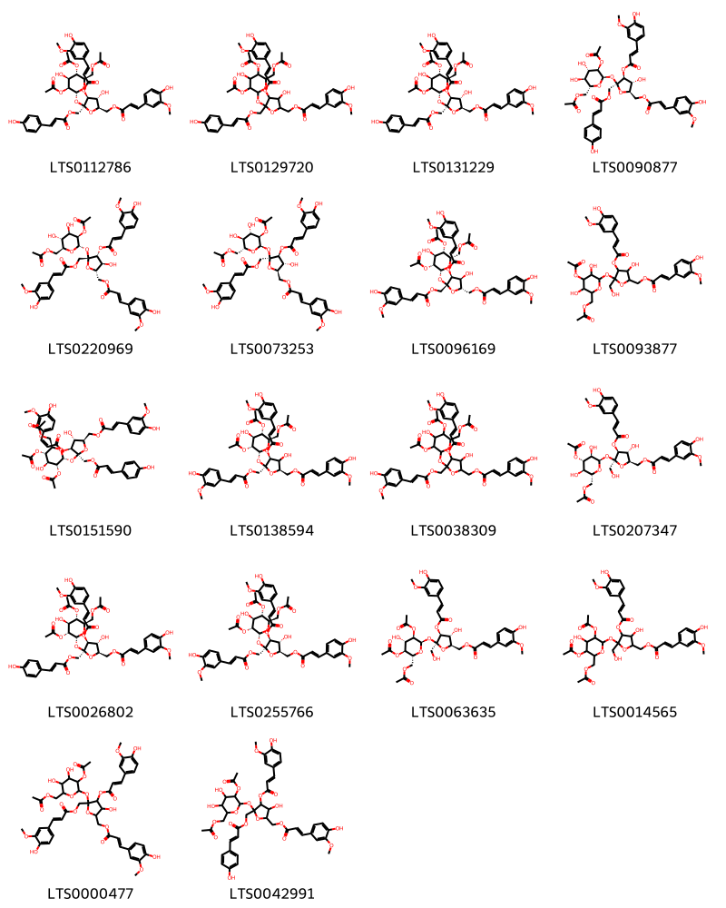
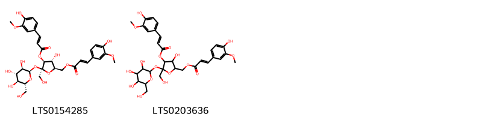
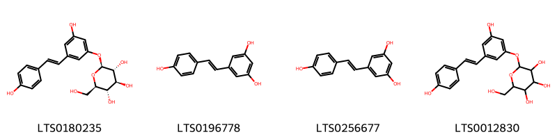

!!! abstract "Tóm tắt"
    Rhizoma Smilacis là thân rễ phơi hay sấy khô của nhiều cây thuộc chi Smilax trong đó có cây Smilax glabra , họ Smilacaceae - Khúc khắc. Thổ phục linh là thuốc dùng trong cả đông y và tây y dùng vơi tên Salsepareille làm thuốc tẩy máu, làm ra mồ hôi, chữa giang mai. Trong đông y có tác dụng khử phong thấp, lợi gân cốt, giải độc cho thủy ngân, chữa đau xương, ác sang ung thũng. DDuowcj dùng trong nhân dân để tẩy độc cơ thể, bổ dạ dày, khỏe gân cốt, làm cho ra mồ hôi, chữa đau xương khớp. Do trong thổ phục linh có saponin, tanin, chất nhựa.

## Thông tin về thực vật

### Đặc điểm thực vật

Dược liệu **Thổ Phục Linh (Thân Rễ)** từ bộ phận **nan** từ loài *Smilax glabra* thuộc họ Smilacaceae. Thổ phục linh là một loại cây sống lâu năm, dài 4-5m có nhiều cành nhỏ, gầy, không gai, thường có tua cuốn dài. Lá hình trái xoan thuôn, phía dưới tròn, dài 5-13cm rộng 3-7cm chắc cứng hơi mỏng, có 3 gân nhỏ từ gốc và nhiều gân con. Hoa mọc thành tán chừng 20-30 hoa. Cuống chung chỉ ngắn chừng 2mm, cuống riêng dài hơn, chừng 10mm hay hơn. Quả mọng, hình cầu, đường kính 6-7 mm hơi 3 cạnh, có 3 hạt 

!!! info "Phân loại thực vật của *Smilax glabra*"
    - **Kingdom:** Plantae
    - **Phylum:** Tracheophyta
    - **Order:** Liliales
    - **Family:** Smilacaceae
    - **Genus:** Smilax
    - **Species:** *Smilax glabra*

*Tài liệu tham khảo:* "Những cây thuốc và vị thuốc Việt Nam" - Đỗ Tất Lợi

 

### Loài thay thế (Nếu có)

### Phân bố trên thế giới
**Từ vườn thực vật KEW: **: Bản địa: Assam, Bangladesh, Cambodia, China North-Central, China South-Central, China Southeast, Hainan, Laos, Myanmar, Taiwan, Thailand, Tibet, Vietnam

**Từ CSDL GIBF** nan, Lao People’s Democratic Republic, Belgium, Viet Nam, China, Hong Kong, Macao, Chinese Taipei, Cambodia, Thailand

### Phân bố tại Việt Nam
** "Những cây thuốc và vị thuốc Việt Nam" - Đỗ Tất Lợi**: Mọc hoang khắp nơi ở nước ta

**Từ CSDL GIBF**: Tỉnh Kiến Giang

---

## Thông tin về dược liệu 

### Định danh

!!! info "Thông tin về tên gọi của nan"
    - Dược liệu tiếng Việt: nan
    - Dược liệu tiếng Trung: nan (nan)
    - Dược liệu tiếng Anh: nan
    - Dược liệu latin thông dụng: nan
    - Dược liệu latin kiểu DĐVN: rhizoma smilacis
    - Dược liệu latin kiểu DĐVN: nan
    - Dược liệu latin kiểu thông tư: nan
    - Bộ phận dùng: nan (nan)

### Mô tả dược liệu 
- **Theo dược điển Việt nam V:** nan

- **Mô tả dược liệu theo thông tư chế biến dược liệu theo phương pháp cổ truyền:** nan

### Chế biến 

- **Chế biến theo dược điển việt nam V**: nan

- **Chế biến theo thông tư:** nan

--- 

## Thành phần hóa học

- Theo tài liệu của GS. Đỗ Tất Lợi:  (1) trong thổ phục linh có saponin, tanin, chất nhựa.
    
- Theo cơ sở dữ liệu lotus: Từ loài *Smilax glabra* đã phân lập và xác định được 50 hoạt chất thuộc về các nhóm Lignan glycosides, Organooxygen compounds, Stilbenes, Isoflavonoids, Carboxylic acids and derivatives, Fatty Acyls, Cinnamic acids and derivatives, Flavonoids. 

|    | chemicalTaxonomyClassyfireClass   |   smiles_count |
|---:|:----------------------------------|---------------:|
|  0 | Carboxylic acids and derivatives  |             18 |
|  1 | Cinnamic acids and derivatives    |              2 |
|  2 | Fatty Acyls                       |              2 |
|  3 | Flavonoids                        |             12 |
|  4 | Isoflavonoids                     |              1 |
|  5 | Lignan glycosides                 |              2 |
|  6 | Organooxygen compounds            |              8 |
|  7 | Stilbenes                         |              4 |

### Nhóm Carboxylic acids and derivatives
<figure markdown="span">
    { width=100% }
    <figcaption>Hình ảnh cấu trúc hóa học của 18 hoạt chất thuộc nhóm Carboxylic acids and derivatives gồm ['[(2r,3r,4s,5s)-5-{[(2r,3s,4s,5s,6r)-3,5-bis(acetyloxy)-6-[(acetyloxy)methyl]-4-hydroxyoxan-2-yl]oxy}-3-hydroxy-4-{[(2e)-3-(4-hydroxy-3-methoxyphenyl)prop-2-enoyl]oxy}-5-({[(2e)-3-(4-hydroxyphenyl)prop-2-enoyl]oxy}methyl)oxolan-2-yl]methyl (2e)-3-(4-hydroxy-3-methoxyphenyl)prop-2-enoate (LTS0112786)', '(5-{[3,5-bis(acetyloxy)-6-[(acetyloxy)methyl]-4-hydroxyoxan-2-yl]oxy}-3-hydroxy-4-{[3-(4-hydroxy-3-methoxyphenyl)prop-2-enoyl]oxy}-5-({[3-(4-hydroxyphenyl)prop-2-enoyl]oxy}methyl)oxolan-2-yl)methyl 3-(4-hydroxy-3-methoxyphenyl)prop-2-enoate (LTS0129720)', '[(2r,3r,4s,5s)-5-{[(2r,4s,5s,6r)-3,5-bis(acetyloxy)-6-[(acetyloxy)methyl]-4-hydroxyoxan-2-yl]oxy}-3-hydroxy-4-{[(2e)-3-(4-hydroxy-3-methoxyphenyl)prop-2-enoyl]oxy}-5-({[(2e)-3-(4-hydroxyphenyl)prop-2-enoyl]oxy}methyl)oxolan-2-yl]methyl (2e)-3-(4-hydroxy-3-methoxyphenyl)prop-2-enoate (LTS0131229)', '[(2r,3r,4s,5s)-5-{[(2r,3r,4s,5s,6r)-3-(acetyloxy)-6-[(acetyloxy)methyl]-4,5-dihydroxyoxan-2-yl]oxy}-3-hydroxy-4-{[(2e)-3-(4-hydroxy-3-methoxyphenyl)prop-2-enoyl]oxy}-5-({[(2e)-3-(4-hydroxyphenyl)prop-2-enoyl]oxy}methyl)oxolan-2-yl]methyl (2e)-3-(4-hydroxy-3-methoxyphenyl)prop-2-enoate (LTS0090877)', '[(2s,3s,4r,5r)-5-{[(2s,3r,4r,5r,6s)-3-(acetyloxy)-6-[(acetyloxy)methyl]-4,5-dihydroxyoxan-2-yl]oxy}-3-hydroxy-4-{[(2e)-3-(4-hydroxy-3-methoxyphenyl)prop-2-enoyl]oxy}-5-({[(2e)-3-(4-hydroxy-3-methoxyphenyl)prop-2-enoyl]oxy}methyl)oxolan-2-yl]methyl (2e)-3-(4-hydroxy-3-methoxyphenyl)prop-2-enoate (LTS0220969)', '[(2r,3r,4s,5s)-5-{[(2r,3r,4s,5s,6r)-3-(acetyloxy)-6-[(acetyloxy)methyl]-4,5-dihydroxyoxan-2-yl]oxy}-3-hydroxy-4-{[(2e)-3-(4-hydroxy-3-methoxyphenyl)prop-2-enoyl]oxy}-5-({[(2e)-3-(4-hydroxy-3-methoxyphenyl)prop-2-enoyl]oxy}methyl)oxolan-2-yl]methyl (2e)-3-(4-hydroxy-3-methoxyphenyl)prop-2-enoate (LTS0073253)', '[(2s,3s,4s,5r)-5-{[(2r,3r,4s,5s,6s)-3,5-bis(acetyloxy)-6-[(acetyloxy)methyl]-4-hydroxyoxan-2-yl]oxy}-3-hydroxy-4-{[(2e)-3-(4-hydroxy-3-methoxyphenyl)prop-2-enoyl]oxy}-5-({[(2e)-3-(4-hydroxy-3-methoxyphenyl)prop-2-enoyl]oxy}methyl)oxolan-2-yl]methyl (2e)-3-(4-hydroxy-3-methoxyphenyl)prop-2-enoate (LTS0096169)', '(5-{[4-(acetyloxy)-6-[(acetyloxy)methyl]-3,5-dihydroxyoxan-2-yl]oxy}-3-hydroxy-4-{[3-(4-hydroxy-3-methoxyphenyl)prop-2-enoyl]oxy}-5-(hydroxymethyl)oxolan-2-yl)methyl 3-(4-hydroxy-3-methoxyphenyl)prop-2-enoate (LTS0093877)', '[(2r,3r,4s,5s)-5-{[(2r,3r,4s,5s,6r)-3,5-bis(acetyloxy)-6-[(acetyloxy)methyl]-4-hydroxyoxan-2-yl]oxy}-3-hydroxy-4-{[(2z)-3-(4-hydroxy-3-methoxyphenyl)prop-2-enoyl]oxy}-5-({[(2e)-3-(4-hydroxyphenyl)prop-2-enoyl]oxy}methyl)oxolan-2-yl]methyl (2e)-3-(4-hydroxy-3-methoxyphenyl)prop-2-enoate (LTS0151590)', '[(2r,4s,5s)-5-{[(2r,3r,4s,5s,6r)-3,5-bis(acetyloxy)-6-[(acetyloxy)methyl]-4-hydroxyoxan-2-yl]oxy}-3-hydroxy-4-{[(2e)-3-(4-hydroxy-3-methoxyphenyl)prop-2-enoyl]oxy}-5-({[(2e)-3-(4-hydroxy-3-methoxyphenyl)prop-2-enoyl]oxy}methyl)oxolan-2-yl]methyl (2e)-3-(4-hydroxy-3-methoxyphenyl)prop-2-enoate (LTS0138594)', '(5-{[3,5-bis(acetyloxy)-6-[(acetyloxy)methyl]-4-hydroxyoxan-2-yl]oxy}-3-hydroxy-4-{[3-(4-hydroxy-3-methoxyphenyl)prop-2-enoyl]oxy}-5-({[3-(4-hydroxy-3-methoxyphenyl)prop-2-enoyl]oxy}methyl)oxolan-2-yl)methyl 3-(4-hydroxy-3-methoxyphenyl)prop-2-enoate (LTS0038309)', '[(2r,3r,4s,5s)-5-{[(2r,3r,4s,5r,6r)-4-(acetyloxy)-6-[(acetyloxy)methyl]-3,5-dihydroxyoxan-2-yl]oxy}-3-hydroxy-4-{[(2e)-3-(4-hydroxy-3-methoxyphenyl)prop-2-enoyl]oxy}-5-(hydroxymethyl)oxolan-2-yl]methyl (2e)-3-(4-hydroxy-3-methoxyphenyl)prop-2-enoate (LTS0207347)', '[(2r,3r,4s,5s)-5-{[(2r,3r,4s,5s,6r)-3,5-bis(acetyloxy)-6-[(acetyloxy)methyl]-4-hydroxyoxan-2-yl]oxy}-3-hydroxy-4-{[(2e)-3-(4-hydroxy-3-methoxyphenyl)prop-2-enoyl]oxy}-5-({[(2e)-3-(4-hydroxyphenyl)prop-2-enoyl]oxy}methyl)oxolan-2-yl]methyl (2e)-3-(4-hydroxy-3-methoxyphenyl)prop-2-enoate (LTS0026802)', '[(2r,3r,4s,5s)-5-{[(2r,3r,4s,5s,6r)-3,5-bis(acetyloxy)-6-[(acetyloxy)methyl]-4-hydroxyoxan-2-yl]oxy}-3-hydroxy-4-{[(2e)-3-(4-hydroxy-3-methoxyphenyl)prop-2-enoyl]oxy}-5-({[(2e)-3-(4-hydroxy-3-methoxyphenyl)prop-2-enoyl]oxy}methyl)oxolan-2-yl]methyl (2e)-3-(4-hydroxy-3-methoxyphenyl)prop-2-enoate (LTS0255766)', '[(2r,3r,4s,5s)-5-{[(2r,3r,4s,5s,6r)-3,5-bis(acetyloxy)-6-[(acetyloxy)methyl]-4-hydroxyoxan-2-yl]oxy}-3-hydroxy-4-{[(2e)-3-(4-hydroxy-3-methoxyphenyl)prop-2-enoyl]oxy}-5-(hydroxymethyl)oxolan-2-yl]methyl (2e)-3-(4-hydroxy-3-methoxyphenyl)prop-2-enoate (LTS0063635)', '(5-{[3,5-bis(acetyloxy)-6-[(acetyloxy)methyl]-4-hydroxyoxan-2-yl]oxy}-3-hydroxy-4-{[3-(4-hydroxy-3-methoxyphenyl)prop-2-enoyl]oxy}-5-(hydroxymethyl)oxolan-2-yl)methyl 3-(4-hydroxy-3-methoxyphenyl)prop-2-enoate (LTS0014565)', '(5-{[3-(acetyloxy)-6-[(acetyloxy)methyl]-4,5-dihydroxyoxan-2-yl]oxy}-3-hydroxy-4-{[3-(4-hydroxy-3-methoxyphenyl)prop-2-enoyl]oxy}-5-({[3-(4-hydroxy-3-methoxyphenyl)prop-2-enoyl]oxy}methyl)oxolan-2-yl)methyl 3-(4-hydroxy-3-methoxyphenyl)prop-2-enoate (LTS0000477)', '(5-{[3-(acetyloxy)-6-[(acetyloxy)methyl]-4,5-dihydroxyoxan-2-yl]oxy}-3-hydroxy-4-{[3-(4-hydroxy-3-methoxyphenyl)prop-2-enoyl]oxy}-5-({[3-(4-hydroxyphenyl)prop-2-enoyl]oxy}methyl)oxolan-2-yl)methyl 3-(4-hydroxy-3-methoxyphenyl)prop-2-enoate (LTS0042991)'].</figcaption>
</figure>
### Nhóm Cinnamic acids and derivatives
<figure markdown="span">
    { width=100% }
    <figcaption>Hình ảnh cấu trúc hóa học của 2 hoạt chất thuộc nhóm Cinnamic acids and derivatives gồm ['[(2r,3r,4s,5s)-3-hydroxy-4-{[(2e)-3-(4-hydroxy-3-methoxyphenyl)prop-2-enoyl]oxy}-5-(hydroxymethyl)-5-{[(2r,3r,4s,5s,6r)-3,4,5-trihydroxy-6-(hydroxymethyl)oxan-2-yl]oxy}oxolan-2-yl]methyl (2e)-3-(4-hydroxy-3-methoxyphenyl)prop-2-enoate (LTS0154285)', '(3-hydroxy-4-{[3-(4-hydroxy-3-methoxyphenyl)prop-2-enoyl]oxy}-5-(hydroxymethyl)-5-{[3,4,5-trihydroxy-6-(hydroxymethyl)oxan-2-yl]oxy}oxolan-2-yl)methyl 3-(4-hydroxy-3-methoxyphenyl)prop-2-enoate (LTS0203636)'].</figcaption>
</figure>
### Nhóm Fatty Acyls
<figure markdown="span">
    { width=100% }
    <figcaption>Hình ảnh cấu trúc hóa học của 2 hoạt chất thuộc nhóm Fatty Acyls gồm ['1-(4-hydroxy-3,5-dimethoxyphenyl)-3-{[(2r,3r,4s,5s,6r)-3,4,5-trihydroxy-6-(hydroxymethyl)oxan-2-yl]oxy}propan-1-one (LTS0123609)', '1-(4-hydroxy-3,5-dimethoxyphenyl)-3-{[3,4,5-trihydroxy-6-(hydroxymethyl)oxan-2-yl]oxy}propan-1-one (LTS0236071)'].</figcaption>
</figure>
### Nhóm Flavonoids
<figure markdown="span">
    { width=100% }
    <figcaption>Hình ảnh cấu trúc hóa học của 12 hoạt chất thuộc nhóm Flavonoids gồm ['astilbin (LTS0079309)', 'isoastilbin (LTS0088600)', 'astilbin (LTS0079365)', '(2r,3r)-5,7-dihydroxy-2-(4-hydroxyphenyl)-3-{[(2r,3r,4r,5s,6s)-3,4,5-trihydroxy-6-methyloxan-2-yl]oxy}-2,3-dihydro-1-benzopyran-4-one (LTS0123801)', '(+)-taxifolin (LTS0090664)', '2-(3,5-dihydroxyphenyl)-5,7-dihydroxy-3-{[(2s,3r,4r,6s)-3,4,5-trihydroxy-6-methyloxan-2-yl]oxy}-2,3-dihydro-1-benzopyran-4-one (LTS0151502)', '(2s,3r)-2-(3,4-dihydroxyphenyl)-5,7-dihydroxy-3-{[(2s,3r,4r,5r,6s)-3,4,5-trihydroxy-6-methyloxan-2-yl]oxy}-2,3-dihydro-1-benzopyran-4-one (LTS0213990)', '2-(3,5-dihydroxyphenyl)-5,7-dihydroxy-3-[(3,4,5-trihydroxy-6-methyloxan-2-yl)oxy]-2,3-dihydro-1-benzopyran-4-one (LTS0067301)', '3,5,7-trihydroxy-2-(4-hydroxy-3-{[3,4,5-trihydroxy-6-(hydroxymethyl)oxan-2-yl]oxy}phenyl)-2,3-dihydro-1-benzopyran-4-one (LTS0210603)', 'smitilbin (LTS0241317)', "taxifolin 3'-glucoside (LTS0169742)", '(2r,3s)-2-(3,4-dihydroxyphenyl)-5,7-dihydroxy-3-{[(2s,3r,4r,5r,6s)-3,4,5-trihydroxy-6-methyloxan-2-yl]oxy}-2,3-dihydro-1-benzopyran-4-one (LTS0001454)'].</figcaption>
</figure>
### Nhóm Isoflavonoids
<figure markdown="span">
    { width=100% }
    <figcaption>Hình ảnh cấu trúc hóa học của 1 hoạt chất thuộc nhóm Isoflavonoids gồm ['7-hydroxy-3-(2-hydroxy-5-methoxyphenyl)chromen-4-one (LTS0096763)'].</figcaption>
</figure>
### Nhóm Lignan glycosides
<figure markdown="span">
    { width=100% }
    <figcaption>Hình ảnh cấu trúc hóa học của 2 hoạt chất thuộc nhóm Lignan glycosides gồm ['(2s,3r,4s,5s,6r)-2-{4-[(1s,3ar,4s,6ar)-4-(4-hydroxy-3,5-dimethoxyphenyl)-hexahydrofuro[3,4-c]furan-1-yl]-2,6-dimethoxyphenoxy}-6-({[(2r,3r,4s,5s,6r)-3,4,5-trihydroxy-6-(hydroxymethyl)oxan-2-yl]oxy}methyl)oxane-3,4,5-triol (LTS0016880)', '2-{4-[4-(4-hydroxy-3,5-dimethoxyphenyl)-hexahydrofuro[3,4-c]furan-1-yl]-2,6-dimethoxyphenoxy}-6-({[3,4,5-trihydroxy-6-(hydroxymethyl)oxan-2-yl]oxy}methyl)oxane-3,4,5-triol (LTS0091014)'].</figcaption>
</figure>
### Nhóm Organooxygen compounds
<figure markdown="span">
    { width=100% }
    <figcaption>Hình ảnh cấu trúc hóa học của 8 hoạt chất thuộc nhóm Organooxygen compounds gồm ['1-[2-hydroxy-4,6-bis({[3,4,5-trihydroxy-6-(hydroxymethyl)oxan-2-yl]oxy})phenyl]ethanone (LTS0202843)', '(2r,3s,4s,5r,6s)-2-({[(2r,3r,4r)-3,4-dihydroxy-4-(hydroxymethyl)oxolan-2-yl]oxy}methyl)-6-(3,4,5-trimethoxyphenoxy)oxane-3,4,5-triol (LTS0127559)', '2-[2-hydroxy-5-(2-hydroxyethyl)phenoxy]-6-(hydroxymethyl)oxane-3,4,5-triol (LTS0036783)', '3-hydroxytyrosol 3-o-glucoside (LTS0092215)', '1-[2-hydroxy-4,6-bis({[(2s,3r,4s,5s,6r)-3,4,5-trihydroxy-6-(hydroxymethyl)oxan-2-yl]oxy})phenyl]ethanone (LTS0178127)', '2-(hydroxymethyl)-6-(3,4,5-trimethoxyphenoxy)oxane-3,4,5-triol (LTS0254297)', 'koaburside (LTS0033798)', '2-({[3,4-dihydroxy-4-(hydroxymethyl)oxolan-2-yl]oxy}methyl)-6-(3,4,5-trimethoxyphenoxy)oxane-3,4,5-triol (LTS0016161)'].</figcaption>
</figure>
### Nhóm Stilbenes
<figure markdown="span">
    { width=100% }
    <figcaption>Hình ảnh cấu trúc hóa học của 4 hoạt chất thuộc nhóm Stilbenes gồm ['piceid (LTS0180235)', 'tocilizumab (LTS0196778)', 'resveratrol (LTS0256677)', '2-{3-hydroxy-5-[2-(4-hydroxyphenyl)ethenyl]phenoxy}-6-(hydroxymethyl)oxane-3,4,5-triol (LTS0012830)'].</figcaption>
</figure>

---

## Tác dụng dược lý

Theo tài liệu "Những cây thuốc và vị thuốc Việt Nam" - Đỗ Tất Lợi:- Chữa viêm khớp, mụn nhọt, kiết lỵ, viêm bàng quang, bệnh thấp khớp, bệnh giang mai

Theo tài liệu quốc tế: nan

---

## Dược điển Việt Nam V

### Soi bột:
nan
<!-- Hình ảnh soi bột sẽ được tự động chèn vào đây sau -->
### Vi phẫu:
nan
<!-- Hình ảnh vi phẫu sẽ được tự động chèn vào đây sau -->
### Định tính

nan

### Định lượng

nan

### Thông tin khác 
- ** Độ ẩm: ** nan

- ** Bảo quản:** nan
## Dược điển Hồng kong

<!-- PDF sẽ được tự động chèn vào đây sau -->

---

## Y dược học cổ truyền

- **Tên vị thuốc:** nan
- **Tính vị quy kinh:** Cam, đạm, bình. Vào các kinh can, vị.
- **Công năng chủ trị:** Công năng: Trừ thấp, giải độc, lợi niệu, thông lợi các khớp.
Chủ trị: Tràng nhạc, lở ngứa, giang mai, tiếu đục, xích bạch đới, đau nhức xương khớp, trúng độc thủy ngân.
- **Chú ý:** nan
- **Kiêng kỵ:** nan

