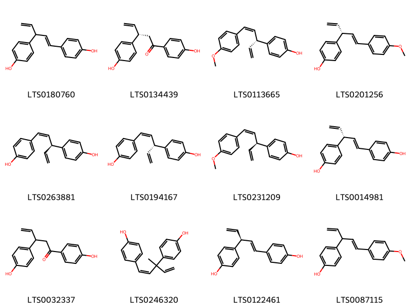
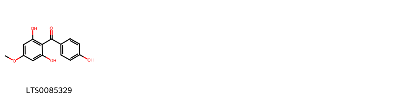
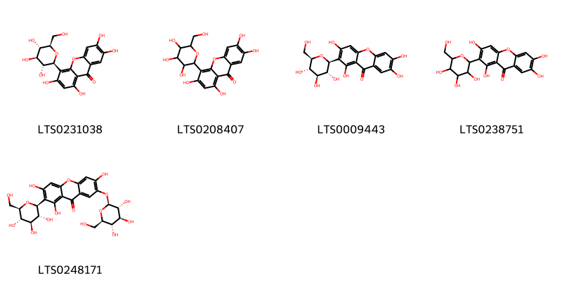
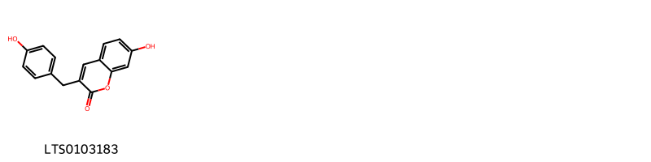
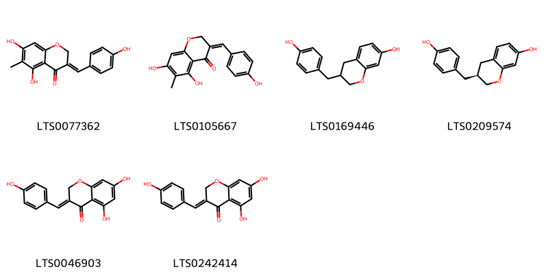
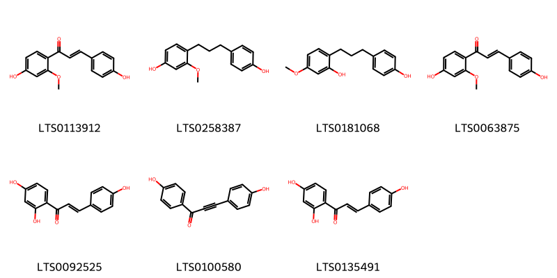
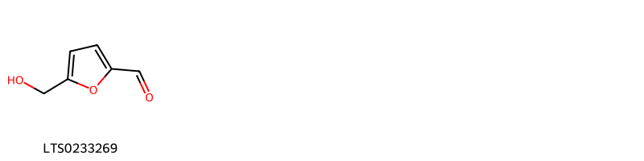
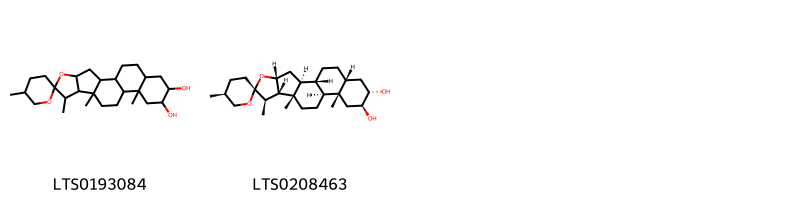
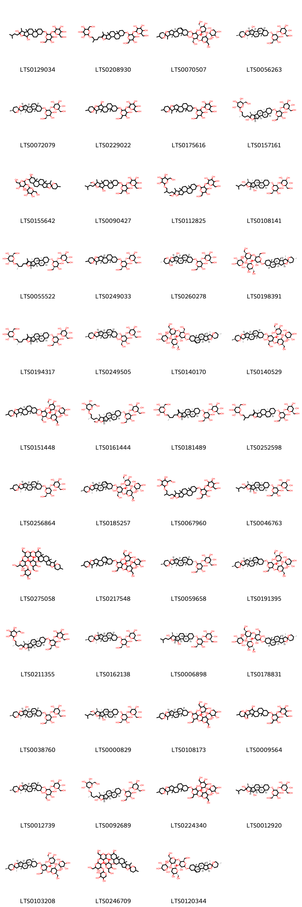

!!! abstract "Tóm tắt"
    Tên khoa học Anemarrhena asphodeloides Bunge, họ Hành (Liliaceae)
Phân bố Cho đến nay vị tri mẫu vẫn phải nhập từ Trung Quốc. Chưa thấy trồng ở nước ta. Vào các tháng 3-4, người ta đào lấy than rễ, rửa sạch phơi hay sấy khô.
Thành phần hoá học trong tri mẫu có một chất saponin gọi là asphonin. Ngoài ra còn một chất có tinh thể chưa xác định
Theo tài liệu cổ tri mẫu có vị đắng, tính lạnh, không độc, có tác dụng tu thân, bổ thuỷ, tả hoả, thường được dùng chữa bệnh tiêu khát (đái đường), hạ thuỷ, ích khí.
Tác dụng dược lý Bảo vệ thần kinh, tác dụng lên hệ máu, chống khối u, chống viêm.
Hiện nay tri mẫu thường được dùng làm thuốc chữa họ, tiêu đờm, chữa sốt, sốt do viêm phổi.
Ngày dùng 4 đến 10g dưới dạng thuốc sắc.

## Thông tin về thực vật

### Đặc điểm thực vật

Dược liệu **Tri Mẫu (Thân Rễ)** từ bộ phận **nan** từ loài *Anemarrhena asphodeloides Bunge* thuộc họ Asparagaceae. Tri mẫu là một loại cỏ sống lâu năm, thân rễ chạy ngang. Lá mọc vòng, dài khoảng 20-30cm, hẹp, đầu nhọn, phía dưới ôm vào nhau. Mùa hạ, ra cành mang hoa. Cao chừng 60-90cm. Cụm hoa thành bông hoa nhỏ, màu trắng. 

!!! info "Phân loại thực vật của *Anemarrhena asphodeloides*"
    - **Kingdom:** Plantae
    - **Phylum:** Tracheophyta
    - **Order:** Asparagales
    - **Family:** Asparagaceae
    - **Genus:** Anemarrhena
    - **Species:** *Anemarrhena asphodeloides*

*Tài liệu tham khảo:* "Những cây thuốc và vị thuốc Việt Nam" - Đỗ Tất Lợi

 

### Loài thay thế (Nếu có)

### Phân bố trên thế giới
**Từ vườn thực vật KEW: **: Bản địa 
Trung Quốc, Nội Mông, Mãn Châu, Mông Cổ
Di thực 
Hàn Quốc, Đài Loan

**Từ CSDL GIBF** nan, Mongolia, Korea, Republic of, China, United States of America, Japan, Central African Republic, Portugal, unknown or invalid, Russian Federation

### Phân bố tại Việt Nam
** "Những cây thuốc và vị thuốc Việt Nam" - Đỗ Tất Lợi**: Cho đến nay vị tri mẫu vẫn phải nhập từ Trung Quốc. Chưa thấy trồng ở nước ta. Vào các tháng 3-4, người ta đào lấy than rễ, rửa sạch phơi hay sấy khô.

**Từ CSDL GIBF**: Không có ghi nhận ở Việt Nam

---

## Thông tin về dược liệu 

### Định danh

!!! info "Thông tin về tên gọi của nan"
    - Dược liệu tiếng Việt: nan
    - Dược liệu tiếng Trung: nan (nan)
    - Dược liệu tiếng Anh: nan
    - Dược liệu latin thông dụng: nan
    - Dược liệu latin kiểu DĐVN: rhizoma anemarrhenae
    - Dược liệu latin kiểu DĐVN: nan
    - Dược liệu latin kiểu thông tư: nan
    - Bộ phận dùng: nan (nan)

### Mô tả dược liệu 
- **Theo dược điển Việt nam V:** nan

- **Mô tả dược liệu theo thông tư chế biến dược liệu theo phương pháp cổ truyền:** nan

### Chế biến 

- **Chế biến theo dược điển việt nam V**: nan

- **Chế biến theo thông tư:** nan

--- 

## Thành phần hóa học

- Theo tài liệu của GS. Đỗ Tất Lợi:  Thành phần hoá học

Trong tri mẫu có một chất saponin gọi là asphonin. Ngoài ra còn một chất có tinh thể chưa xác định.
    
- Theo cơ sở dữ liệu lotus: Từ loài *Anemarrhena asphodeloides* đã phân lập và xác định được 86 hoạt chất thuộc về các nhóm Linear 1,3-diarylpropanoids, Organooxygen compounds, Benzopyrans, Steroids and steroid derivatives, Coumarins and derivatives, Benzene and substituted derivatives, Prenol lipids, Homoisoflavonoids. 

|    | chemicalTaxonomyClassyfireClass     |   smiles_count |
|---:|:------------------------------------|---------------:|
|  0 |                                     |             12 |
|  1 | Benzene and substituted derivatives |              1 |
|  2 | Benzopyrans                         |              5 |
|  3 | Coumarins and derivatives           |              1 |
|  4 | Homoisoflavonoids                   |              6 |
|  5 | Linear 1,3-diarylpropanoids         |              7 |
|  6 | Organooxygen compounds              |              1 |
|  7 | Prenol lipids                       |              2 |
|  8 | Steroids and steroid derivatives    |             47 |

### Nhóm 
<figure markdown="span">
    { width=100% }
    <figcaption>Hình ảnh cấu trúc hóa học của 12 hoạt chất thuộc nhóm  gồm ['nyasol (LTS0180760)', '(3s)-1,3-bis(4-hydroxyphenyl)pent-4-en-1-one (LTS0134439)', '4-[(3r,4z)-5-(4-methoxyphenyl)penta-1,4-dien-3-yl]phenol (LTS0113665)', '4-[(3r)-1-(4-methoxyphenyl)penta-1,4-dien-3-yl]phenol (LTS0201256)', 'cis-hinokiresinol (LTS0263881)', '(-)-nyasol (LTS0194167)', '4-[(3s,4z)-5-(4-methoxyphenyl)penta-1,4-dien-3-yl]phenol (LTS0231209)', '4-[(3r)-3-(4-hydroxyphenyl)penta-1,4-dien-1-yl]phenol (LTS0014981)', '1,3-bis(4-hydroxyphenyl)pent-4-en-1-one (LTS0032337)', '4-[(1z)-3-(4-hydroxyphenyl)-3-methylpenta-1,4-dien-1-yl]phenol (LTS0246320)', '(-)-hinokiresinol (LTS0122461)', '4-[1-(4-methoxyphenyl)penta-1,4-dien-3-yl]phenol (LTS0087115)'].</figcaption>
</figure>
### Nhóm Benzene and substituted derivatives
<figure markdown="span">
    { width=100% }
    <figcaption>Hình ảnh cấu trúc hóa học của 1 hoạt chất thuộc nhóm Benzene and substituted derivatives gồm ['2-(4-hydroxybenzoyl)-5-methoxybenzene-1,3-diol (LTS0085329)'].</figcaption>
</figure>
### Nhóm Benzopyrans
<figure markdown="span">
    { width=100% }
    <figcaption>Hình ảnh cấu trúc hóa học của 5 hoạt chất thuộc nhóm Benzopyrans gồm ['isomangiferin (LTS0231038)', '1,3,6,7-tetrahydroxy-4-[3,4,5-trihydroxy-6-(hydroxymethyl)oxan-2-yl]xanthen-9-one (LTS0208407)', 'mangiferin (LTS0009443)', 'mangiferin (LTS0238751)', '1,3,6-trihydroxy-2-[(2s,3r,4r,5s,6r)-3,4,5-trihydroxy-6-(hydroxymethyl)oxan-2-yl]-7-{[(2s,3r,4s,5s,6r)-3,4,5-trihydroxy-6-(hydroxymethyl)oxan-2-yl]oxy}xanthen-9-one (LTS0248171)'].</figcaption>
</figure>
### Nhóm Coumarins and derivatives
<figure markdown="span">
    { width=100% }
    <figcaption>Hình ảnh cấu trúc hóa học của 1 hoạt chất thuộc nhóm Coumarins and derivatives gồm ['anemarcoumarin a (LTS0103183)'].</figcaption>
</figure>
### Nhóm Homoisoflavonoids
<figure markdown="span">
    { width=100% }
    <figcaption>Hình ảnh cấu trúc hóa học của 6 hoạt chất thuộc nhóm Homoisoflavonoids gồm ['(3e)-5,7-dihydroxy-3-[(4-hydroxyphenyl)methylidene]-6-methyl-2h-1-benzopyran-4-one (LTS0077362)', '5,7-dihydroxy-3-[(4-hydroxyphenyl)methylidene]-6-methyl-2h-1-benzopyran-4-one (LTS0105667)', '3-[(4-hydroxyphenyl)methyl]-3,4-dihydro-2h-1-benzopyran-7-ol (LTS0169446)', '(3s)-3-[(4-hydroxyphenyl)methyl]-3,4-dihydro-2h-1-benzopyran-7-ol (LTS0209574)', '5,7-dihydroxy-3-[(4-hydroxyphenyl)methylidene]-2h-1-benzopyran-4-one (LTS0046903)', '(3e)-5,7-dihydroxy-3-[(4-hydroxyphenyl)methylidene]-2h-1-benzopyran-4-one (LTS0242414)'].</figcaption>
</figure>
### Nhóm Linear 1_3-diarylpropanoids
<figure markdown="span">
    { width=100% }
    <figcaption>Hình ảnh cấu trúc hóa học của Không tìm thấy chú thích hoạt chất thuộc nhóm Linear 1_3-diarylpropanoids gồm Không tìm thấy chú thích.</figcaption>
</figure>
### Nhóm Organooxygen compounds
<figure markdown="span">
    { width=100% }
    <figcaption>Hình ảnh cấu trúc hóa học của 1 hoạt chất thuộc nhóm Organooxygen compounds gồm ['hydroxymethylfurfural (LTS0233269)'].</figcaption>
</figure>
### Nhóm Prenol lipids
<figure markdown="span">
    { width=100% }
    <figcaption>Hình ảnh cấu trúc hóa học của 2 hoạt chất thuộc nhóm Prenol lipids gồm ["5,7',9',13'-tetramethyl-5'-oxaspiro[oxane-2,6'-pentacyclo[10.8.0.0²,⁹.0⁴,⁸.0¹³,¹⁸]icosane]-15',16'-diol (LTS0193084)", "(1'r,2r,2's,4'r,5s,7'r,8's,9's,12's,13's,15's,16's,18'r)-5,7',9',13'-tetramethyl-5'-oxaspiro[oxane-2,6'-pentacyclo[10.8.0.0²,⁹.0⁴,⁸.0¹³,¹⁸]icosane]-15',16'-diol (LTS0208463)"].</figcaption>
</figure>
### Nhóm Steroids and steroid derivatives
<figure markdown="span">
    { width=100% }
    <figcaption>Hình ảnh cấu trúc hóa học của 47 hoạt chất thuộc nhóm Steroids and steroid derivatives gồm ['2-[(2-{[3,6-dihydroxy-7,9,13-trimethyl-6-(3-methylbutyl)-5-oxapentacyclo[10.8.0.0²,⁹.0⁴,⁸.0¹³,¹⁸]icosan-16-yl]oxy}-4,5-dihydroxy-6-(hydroxymethyl)oxan-3-yl)oxy]-6-(hydroxymethyl)oxane-3,4,5-triol (LTS0129034)', '2-[4-(16-{[4,5-dihydroxy-6-(hydroxymethyl)-3-{[3,4,5-trihydroxy-6-(hydroxymethyl)oxan-2-yl]oxy}oxan-2-yl]oxy}-7,9,13-trimethyl-5-oxapentacyclo[10.8.0.0²,⁹.0⁴,⁸.0¹³,¹⁸]icos-6-en-6-yl)-2-methylbutoxy]-6-(hydroxymethyl)oxane-3,4,5-triol (LTS0208930)', "(4s,6r)-2-{[(2s,3r,5r)-2-{[(2r,3r,4r)-4,5-dihydroxy-2-(hydroxymethyl)-6-[(1's,2r,9's,13'r,16'r)-5,7',9',13'-tetramethyl-5'-oxaspiro[oxane-2,6'-pentacyclo[10.8.0.0²,⁹.0⁴,⁸.0¹³,¹⁸]icosan]-18'-en-15'-oloxy]oxan-3-yl]oxy}-5-hydroxy-6-(hydroxymethyl)-4-{[(2s,3r,5r)-3,4,5-trihydroxyoxan-2-yl]oxy}oxan-3-yl]oxy}-6-(hydroxymethyl)oxane-3,4,5-triol (LTS0070507)", "(2s,3r,4s,5s,6r)-2-{[(2r,3r,4s,5r,6r)-4,5-dihydroxy-6-(hydroxymethyl)-2-[(1'r,2r,2's,3'r,4'r,5s,7's,8'r,9's,12's,13's,16'r,18'r)-5,7',9',13'-tetramethyl-5'-oxaspiro[oxane-2,6'-pentacyclo[10.8.0.0²,⁹.0⁴,⁸.0¹³,¹⁸]icosan]-3'-oloxy]oxan-3-yl]oxy}-6-(hydroxymethyl)oxane-3,4,5-triol (LTS0056263)", 'timosaponin a-iii (LTS0072079)', "2-{[4,5-dihydroxy-6-(hydroxymethyl)-2-{5,7',9',13'-tetramethyl-5'-oxaspiro[oxane-2,6'-pentacyclo[10.8.0.0²,⁹.0⁴,⁸.0¹³,¹⁸]icosan]-3'-oloxy}oxan-3-yl]oxy}-6-(hydroxymethyl)oxane-3,4,5-triol (LTS0229022)", 'timosaponin a3 (LTS0175616)', '(2s,3r,4s,5s,6r)-2-{[(2r,3r,4s,5r,6r)-4,5-dihydroxy-2-{[(1r,2s,4s,6s,7s,8r,9s,12r,13s,16r,18r)-6-hydroxy-7,9,13-trimethyl-6-[(3s)-3-methyl-4-{[(2r,3r,4s,5s,6r)-3,4,5-trihydroxy-6-(hydroxymethyl)oxan-2-yl]oxy}butyl]-5-oxapentacyclo[10.8.0.0²,⁹.0⁴,⁸.0¹³,¹⁸]icosan-16-yl]oxy}-6-(hydroxymethyl)oxan-3-yl]oxy}-6-(hydroxymethyl)oxane-3,4,5-triol (LTS0157161)', "2-{[4,5-dihydroxy-6-(hydroxymethyl)-2-{5,7',9',13'-tetramethyl-5'-oxaspiro[oxane-2,6'-pentacyclo[10.8.0.0²,⁹.0⁴,⁸.0¹³,¹⁸]icosan]-15'-oloxy}oxan-3-yl]oxy}-6-(hydroxymethyl)oxane-3,4,5-triol (LTS0155642)", '2-[(4,5-dihydroxy-2-{[3-hydroxy-6-methoxy-7,9,13-trimethyl-6-(3-methylbutyl)-5-oxapentacyclo[10.8.0.0²,⁹.0⁴,⁸.0¹³,¹⁸]icosan-16-yl]oxy}-6-(hydroxymethyl)oxan-3-yl)oxy]-6-(hydroxymethyl)oxane-3,4,5-triol (LTS0090427)', '2-[4-(16-{[4,5-dihydroxy-6-(hydroxymethyl)-3-{[3,4,5-trihydroxy-6-(hydroxymethyl)oxan-2-yl]oxy}oxan-2-yl]oxy}-6-methoxy-7,9,13-trimethyl-5-oxapentacyclo[10.8.0.0²,⁹.0⁴,⁸.0¹³,¹⁸]icosan-6-yl)-2-methylbutoxy]-6-(hydroxymethyl)oxane-3,4,5-triol (LTS0112825)', '(2s,3r,4s,5s,6r)-2-{[(2r,3r,4s,5r,6r)-2-{[(1r,2s,3s,4r,6s,7s,8r,9s,12s,13s,16s,18r)-3,6-dihydroxy-7,9,13-trimethyl-6-(3-methylbutyl)-5-oxapentacyclo[10.8.0.0²,⁹.0⁴,⁸.0¹³,¹⁸]icosan-16-yl]oxy}-4,5-dihydroxy-6-(hydroxymethyl)oxan-3-yl]oxy}-6-(hydroxymethyl)oxane-3,4,5-triol (LTS0108141)', '(2r,3r,4s,5s,6r)-2-[(2s)-4-[(1r,2s,4s,8s,9s,12s,13s,16s,18r)-16-{[(2r,3r,4s,5r,6r)-4,5-dihydroxy-6-(hydroxymethyl)-3-{[(2s,3r,4s,5s,6r)-3,4,5-trihydroxy-6-(hydroxymethyl)oxan-2-yl]oxy}oxan-2-yl]oxy}-7,9,13-trimethyl-5-oxapentacyclo[10.8.0.0²,⁹.0⁴,⁸.0¹³,¹⁸]icos-6-en-6-yl]-2-methylbutoxy]-6-(hydroxymethyl)oxane-3,4,5-triol (LTS0055522)', "(2s,3r,4s,5s,6r)-2-{[(2r,3r,4s,5r,6r)-4,5-dihydroxy-6-(hydroxymethyl)-2-[(2'r,9's,13's,16's)-5,7',9',13'-tetramethyl-5'-oxaspiro[oxane-2,6'-pentacyclo[10.8.0.0²,⁹.0⁴,⁸.0¹³,¹⁸]icosane]oxy]oxan-3-yl]oxy}-6-(hydroxymethyl)oxane-3,4,5-triol (LTS0249033)", "(2s,3r,4s,5s,6r)-2-{[(2r,3r,4s,5r,6r)-4,5-dihydroxy-6-(hydroxymethyl)-2-[(1'r,2s,2's,3s,3'r,4'r,5s,7's,8'r,9's,12's,13's,16's,18'r)-5,7',9',13'-tetramethyl-5'-oxaspiro[oxane-2,6'-pentacyclo[10.8.0.0²,⁹.0⁴,⁸.0¹³,¹⁸]icosane]-3,3'-dioloxy]oxan-3-yl]oxy}-6-(hydroxymethyl)oxane-3,4,5-triol (LTS0260278)", "(2s,3r,4s,5s,6r)-2-{[(2s,3r,4s,5r,6r)-2-{[(2r,3r,4r,5r,6r)-4,5-dihydroxy-2-(hydroxymethyl)-6-[(1'r,2r,2's,4's,5r,7's,8'r,9's,12's,13's,16's,18's)-5,7',9',13'-tetramethyl-5'-oxaspiro[oxane-2,6'-pentacyclo[10.8.0.0²,⁹.0⁴,⁸.0¹³,¹⁸]icosane]oxy]oxan-3-yl]oxy}-5-hydroxy-6-(hydroxymethyl)-4-{[(2s,3r,4s,5r)-3,4,5-trihydroxyoxan-2-yl]oxy}oxan-3-yl]oxy}-6-(hydroxymethyl)oxane-3,4,5-triol (LTS0198391)", '(2s,3r,4s,5s,6r)-2-[(2s)-4-[(1r,2s,4s,8s,9s,12s,13s,16s,18r)-16-{[(2r,3r,4s,5r,6r)-4,5-dihydroxy-6-(hydroxymethyl)-3-{[(2s,3r,4s,5s,6r)-3,4,5-trihydroxy-6-(hydroxymethyl)oxan-2-yl]oxy}oxan-2-yl]oxy}-7,9,13-trimethyl-5-oxapentacyclo[10.8.0.0²,⁹.0⁴,⁸.0¹³,¹⁸]icos-6-en-6-yl]-2-methylbutoxy]-6-(hydroxymethyl)oxane-3,4,5-triol (LTS0194317)', "(2s,3r,4s,5s,6r)-2-{[(2r,3r,4s,5r,6r)-4,5-dihydroxy-6-(hydroxymethyl)-2-[(1'r,2r,2's,4's,5s,7's,8'r,9's,12's,13's,15's,16's,18'r)-5,7',9',13'-tetramethyl-5'-oxaspiro[oxane-2,6'-pentacyclo[10.8.0.0²,⁹.0⁴,⁸.0¹³,¹⁸]icosan]-15'-oloxy]oxan-3-yl]oxy}-6-(hydroxymethyl)oxane-3,4,5-triol (LTS0249505)", "(2s,3r,4s,5s,6r)-2-{[(2s,3r,4s,5r,6r)-2-{[(2r,3r,4r,5r,6r)-4,5-dihydroxy-2-(hydroxymethyl)-6-[(1's,2r,2's,4's,5r,7's,8'r,9's,12's,13'r,15'r,16'r)-5,7',9',13'-tetramethyl-5'-oxaspiro[oxane-2,6'-pentacyclo[10.8.0.0²,⁹.0⁴,⁸.0¹³,¹⁸]icosan]-18'-en-15'-oloxy]oxan-3-yl]oxy}-5-hydroxy-6-(hydroxymethyl)-4-{[(2s,3r,4s,5r)-3,4,5-trihydroxyoxan-2-yl]oxy}oxan-3-yl]oxy}-6-(hydroxymethyl)oxane-3,4,5-triol (LTS0140170)", "(2s,3r,4s,5s,6r)-2-{[(2s,3r,4s,5r,6r)-2-{[(2r,3r,4r,5r,6r)-4,5-dihydroxy-2-(hydroxymethyl)-6-[(1'r,2r,2's,4's,5s,7's,8'r,9's,12's,13's,15'r,16'r,18's)-5,7',9',13'-tetramethyl-5'-oxaspiro[oxane-2,6'-pentacyclo[10.8.0.0²,⁹.0⁴,⁸.0¹³,¹⁸]icosan]-15'-oloxy]oxan-3-yl]oxy}-5-hydroxy-6-(hydroxymethyl)-4-{[(2s,3r,4s,5r)-3,4,5-trihydroxyoxan-2-yl]oxy}oxan-3-yl]oxy}-6-(hydroxymethyl)oxane-3,4,5-triol (LTS0140529)", "(4s,6r)-2-{[(2s,3r,5r)-2-{[(2r,3r,4r)-4,5-dihydroxy-2-(hydroxymethyl)-6-[(1'r,2r,9's,13's,16'r)-5,7',9',13'-tetramethyl-5'-oxaspiro[oxane-2,6'-pentacyclo[10.8.0.0²,⁹.0⁴,⁸.0¹³,¹⁸]icosan]-15'-oloxy]oxan-3-yl]oxy}-5-hydroxy-6-(hydroxymethyl)-4-{[(2s,3r,5r)-3,4,5-trihydroxyoxan-2-yl]oxy}oxan-3-yl]oxy}-6-(hydroxymethyl)oxane-3,4,5-triol (LTS0151448)", '(2r,3r,4s,5s,6r)-2-[(2s)-4-[(1r,2s,4s,6s,7s,8r,9s,12s,13s,16s,18r)-16-{[(2r,3r,4s,5r,6r)-4,5-dihydroxy-6-(hydroxymethyl)-3-{[(2s,3r,4s,5s,6r)-3,4,5-trihydroxy-6-(hydroxymethyl)oxan-2-yl]oxy}oxan-2-yl]oxy}-6-methoxy-7,9,13-trimethyl-5-oxapentacyclo[10.8.0.0²,⁹.0⁴,⁸.0¹³,¹⁸]icosan-6-yl]-2-methylbutoxy]-6-(hydroxymethyl)oxane-3,4,5-triol (LTS0161444)', '(2r,3r,4s,5s,6r)-2-[(2s)-4-[(1r,2s,4s,8s,9s,12s,13s,16s,18r)-16-{[(2r,3r,4s,5r,6r)-4,5-dihydroxy-6-(hydroxymethyl)-3-{[(2s,3r,4s,5s,6r)-3,4,5-trihydroxy-6-(hydroxymethyl)oxan-2-yl]oxy}oxan-2-yl]oxy}-9,13-dimethyl-7-methylidene-5-oxapentacyclo[10.8.0.0²,⁹.0⁴,⁸.0¹³,¹⁸]icosan-6-yl]-2-methylbutoxy]-6-(hydroxymethyl)oxane-3,4,5-triol (LTS0181489)', '(2r,3r,4s,5s,6r)-2-{4-[(9s,13s,16s,18r)-16-{[(2r,3r,4s,5r,6r)-4,5-dihydroxy-6-(hydroxymethyl)-3-{[(2s,3r,4s,5s,6r)-3,4,5-trihydroxy-6-(hydroxymethyl)oxan-2-yl]oxy}oxan-2-yl]oxy}-7,9,13-trimethyl-5-oxapentacyclo[10.8.0.0²,⁹.0⁴,⁸.0¹³,¹⁸]icos-6-en-6-yl]-2-methylbutoxy}-6-(hydroxymethyl)oxane-3,4,5-triol (LTS0252598)', "(2s,3r,4s,5s,6r)-2-{[(2r,3r,4r,5r,6r)-4,5-dihydroxy-6-(hydroxymethyl)-2-[(1'r,2r,2's,4's,7's,8'r,9's,12's,13's,16's,18'r)-5,7',9',13'-tetramethyl-5'-oxaspiro[oxane-2,6'-pentacyclo[10.8.0.0²,⁹.0⁴,⁸.0¹³,¹⁸]icosane]oxy]oxan-3-yl]oxy}-6-(hydroxymethyl)oxane-3,4,5-triol (LTS0256864)", "(2s,3r,4s,5s,6r)-2-{[(2s,3r,4s,5r,6r)-2-{[(2r,3r,4r,5r,6r)-4,5-dihydroxy-2-(hydroxymethyl)-6-[(1's,2r,2's,4's,5s,7's,8'r,9's,12's,13'r,15'r,16'r)-5,7',9',13'-tetramethyl-5'-oxaspiro[oxane-2,6'-pentacyclo[10.8.0.0²,⁹.0⁴,⁸.0¹³,¹⁸]icosan]-18'-en-15'-oloxy]oxan-3-yl]oxy}-5-hydroxy-6-(hydroxymethyl)-4-{[(2s,3r,4s,5r)-3,4,5-trihydroxyoxan-2-yl]oxy}oxan-3-yl]oxy}-6-(hydroxymethyl)oxane-3,4,5-triol (LTS0185257)", '2-[(4,5-dihydroxy-2-{[6-hydroxy-7,9,13-trimethyl-6-(3-methyl-4-{[3,4,5-trihydroxy-6-(hydroxymethyl)oxan-2-yl]oxy}butyl)-5-oxapentacyclo[10.8.0.0²,⁹.0⁴,⁸.0¹³,¹⁸]icosan-16-yl]oxy}-6-(hydroxymethyl)oxan-3-yl)oxy]-6-(hydroxymethyl)oxane-3,4,5-triol (LTS0067960)', '(2s,3r,4s,5s,6r)-2-{[(2r,3r,4s,5r,6r)-2-{[(1r,2s,3r,4r,7s,8r,9s,12s,13s,16s,18r)-3,6-dihydroxy-7,9,13-trimethyl-6-(3-methylbutyl)-5-oxapentacyclo[10.8.0.0²,⁹.0⁴,⁸.0¹³,¹⁸]icosan-16-yl]oxy}-4,5-dihydroxy-6-(hydroxymethyl)oxan-3-yl]oxy}-6-(hydroxymethyl)oxane-3,4,5-triol (LTS0046763)', "2-[(2-{[4,5-dihydroxy-2-(hydroxymethyl)-6-{5,7',9',13'-tetramethyl-5'-oxaspiro[oxane-2,6'-pentacyclo[10.8.0.0²,⁹.0⁴,⁸.0¹³,¹⁸]icosan]-18'-en-15'-oloxy}oxan-3-yl]oxy}-5-hydroxy-6-(hydroxymethyl)-4-[(3,4,5-trihydroxyoxan-2-yl)oxy]oxan-3-yl)oxy]-6-(hydroxymethyl)oxane-3,4,5-triol (LTS0275058)", "2-[(2-{[4,5-dihydroxy-2-(hydroxymethyl)-6-{5,7',9',13'-tetramethyl-5'-oxaspiro[oxane-2,6'-pentacyclo[10.8.0.0²,⁹.0⁴,⁸.0¹³,¹⁸]icosan]-18'-eneoxy}oxan-3-yl]oxy}-5-hydroxy-6-(hydroxymethyl)-4-[(3,4,5-trihydroxyoxan-2-yl)oxy]oxan-3-yl)oxy]-6-(hydroxymethyl)oxane-3,4,5-triol (LTS0217548)", "(2s,3r,4s,5s,6r)-2-{[(2r,3r,4s,5r,6r)-4,5-dihydroxy-6-(hydroxymethyl)-2-[(1'r,2r,2's,4's,5s,7's,8'r,9's,12's,13's,16'r,18'r)-5,7',9',13'-tetramethyl-5'-oxaspiro[oxane-2,6'-pentacyclo[10.8.0.0²,⁹.0⁴,⁸.0¹³,¹⁸]icosane]oxy]oxan-3-yl]oxy}-6-(hydroxymethyl)oxane-3,4,5-triol (LTS0059658)", "(2s,3r,4s,5s,6r)-2-{[(2s,3r,4s,5r,6r)-2-{[(2r,3r,4r,5r,6r)-4,5-dihydroxy-2-(hydroxymethyl)-6-[(1's,2r,2's,4's,5s,7's,8'r,9's,12's,13'r,16's)-5,7',9',13'-tetramethyl-5'-oxaspiro[oxane-2,6'-pentacyclo[10.8.0.0²,⁹.0⁴,⁸.0¹³,¹⁸]icosan]-18'-eneoxy]oxan-3-yl]oxy}-5-hydroxy-6-(hydroxymethyl)-4-{[(2s,3r,4s,5r)-3,4,5-trihydroxyoxan-2-yl]oxy}oxan-3-yl]oxy}-6-(hydroxymethyl)oxane-3,4,5-triol (LTS0191395)", '(6r)-2-{[(3r,6r)-4,5-dihydroxy-2-{[(1r,2s,4s,7s,8s,9s,12s,13s,18r)-6-hydroxy-7,9,13-trimethyl-6-[(3s)-3-methyl-4-{[(6r)-3,4,5-trihydroxy-6-(hydroxymethyl)oxan-2-yl]oxy}butyl]-5-oxapentacyclo[10.8.0.0²,⁹.0⁴,⁸.0¹³,¹⁸]icosan-16-yl]oxy}-6-(hydroxymethyl)oxan-3-yl]oxy}-6-(hydroxymethyl)oxane-3,4,5-triol (LTS0211355)', "(2s,3r,4s,5s,6r)-2-{[(2r,3r,4s,5r,6r)-4,5-dihydroxy-6-(hydroxymethyl)-2-[(1's,2r,2's,4'r,5s,7's,8's,9's,12's,13's,16's,18'r)-5,7',9',13'-tetramethyl-5'-oxaspiro[oxane-2,6'-pentacyclo[10.8.0.0²,⁹.0⁴,⁸.0¹³,¹⁸]icosane]oxy]oxan-3-yl]oxy}-6-(hydroxymethyl)oxane-3,4,5-triol (LTS0162138)", '(2s,3r,4s,5s,6r)-2-{[(2r,3r,4s,5r,6r)-2-{[(1r,2s,3r,4r,6s,7s,8r,9s,12s,13s,16s,18r)-3,6-dihydroxy-7,9,13-trimethyl-6-(3-methylbutyl)-5-oxapentacyclo[10.8.0.0²,⁹.0⁴,⁸.0¹³,¹⁸]icosan-16-yl]oxy}-4,5-dihydroxy-6-(hydroxymethyl)oxan-3-yl]oxy}-6-(hydroxymethyl)oxane-3,4,5-triol (LTS0006898)', 'f-gitonin (LTS0178831)', "(2s,3r,4s,5s,6r)-2-{[(2r,3r,4s,5r,6r)-4,5-dihydroxy-6-(hydroxymethyl)-2-[(1'r,2r,2's,3'r,4'r,5s,7's,8'r,9's,12's,13's,16's,18'r)-5,7',9',13'-tetramethyl-5'-oxaspiro[oxane-2,6'-pentacyclo[10.8.0.0²,⁹.0⁴,⁸.0¹³,¹⁸]icosan]-3'-oloxy]oxan-3-yl]oxy}-6-(hydroxymethyl)oxane-3,4,5-triol (LTS0038760)", '(2s,3r,4s,5s,6r)-2-{[(2r,3r,4s,5r,6r)-4,5-dihydroxy-2-{[(1r,2s,3r,4r,6s,7s,8r,9s,12s,13s,16s,18r)-3-hydroxy-6-methoxy-7,9,13-trimethyl-6-(3-methylbutyl)-5-oxapentacyclo[10.8.0.0²,⁹.0⁴,⁸.0¹³,¹⁸]icosan-16-yl]oxy}-6-(hydroxymethyl)oxan-3-yl]oxy}-6-(hydroxymethyl)oxane-3,4,5-triol (LTS0000829)', "2-[(2-{[4,5-dihydroxy-2-(hydroxymethyl)-6-[(1'r,2r,2's,4's,8's,9's,12'r,13's,18's)-5,7',9',13'-tetramethyl-5'-oxaspiro[oxane-2,6'-pentacyclo[10.8.0.0²,⁹.0⁴,⁸.0¹³,¹⁸]icosane]oxy]oxan-3-yl]oxy}-5-hydroxy-6-(hydroxymethyl)-4-[(3,4,5-trihydroxyoxan-2-yl)oxy]oxan-3-yl)oxy]-6-(hydroxymethyl)oxane-3,4,5-triol (LTS0108173)", "2-{[4,5-dihydroxy-6-(hydroxymethyl)-2-{5,7',9',13'-tetramethyl-5'-oxaspiro[oxane-2,6'-pentacyclo[10.8.0.0²,⁹.0⁴,⁸.0¹³,¹⁸]icosane]-3,3'-dioloxy}oxan-3-yl]oxy}-6-(hydroxymethyl)oxane-3,4,5-triol (LTS0009564)", "(2s,3r,4s,5s,6r)-2-{[(2r,3r,4s,5r,6r)-4,5-dihydroxy-6-(hydroxymethyl)-2-[(1'r,2r,2's,4's,5s,7's,8'r,9's,12's,13's,15's,16'r,18'r)-5,7',9',13'-tetramethyl-5'-oxaspiro[oxane-2,6'-pentacyclo[10.8.0.0²,⁹.0⁴,⁸.0¹³,¹⁸]icosan]-15'-oloxy]oxan-3-yl]oxy}-6-(hydroxymethyl)oxane-3,4,5-triol (LTS0012739)", '(2s,3r,4s,5s,6r)-2-{[(2r,3r,4s,5r,6r)-4,5-dihydroxy-2-{[(1r,2s,4s,6s,7s,8r,9s,12s,13s,16s,18r)-6-hydroxy-7,9,13-trimethyl-6-[(3s)-3-methyl-4-{[(2s,3r,4s,5s,6r)-3,4,5-trihydroxy-6-(hydroxymethyl)oxan-2-yl]oxy}butyl]-5-oxapentacyclo[10.8.0.0²,⁹.0⁴,⁸.0¹³,¹⁸]icosan-16-yl]oxy}-6-(hydroxymethyl)oxan-3-yl]oxy}-6-(hydroxymethyl)oxane-3,4,5-triol (LTS0092689)', "2-[(2-{[4,5-dihydroxy-2-(hydroxymethyl)-6-{5,7',9',13'-tetramethyl-5'-oxaspiro[oxane-2,6'-pentacyclo[10.8.0.0²,⁹.0⁴,⁸.0¹³,¹⁸]icosane]oxy}oxan-3-yl]oxy}-5-hydroxy-6-(hydroxymethyl)-4-[(3,4,5-trihydroxyoxan-2-yl)oxy]oxan-3-yl)oxy]-6-(hydroxymethyl)oxane-3,4,5-triol (LTS0224340)", '(2s,3r,4s,5s,6r)-2-{[(2r,3r,4s,5r,6r)-2-{[(1r,2s,3s,4r,7s,8r,9s,12s,13s,16s,18r)-3,6-dihydroxy-7,9,13-trimethyl-6-(3-methylbutyl)-5-oxapentacyclo[10.8.0.0²,⁹.0⁴,⁸.0¹³,¹⁸]icosan-16-yl]oxy}-4,5-dihydroxy-6-(hydroxymethyl)oxan-3-yl]oxy}-6-(hydroxymethyl)oxane-3,4,5-triol (LTS0012920)', "(2s,3r,4s,5s,6r)-2-{[(2s,3r,4s,5r,6r)-2-{[(2r,3r,4r,5r,6r)-4,5-dihydroxy-2-(hydroxymethyl)-6-[(1'r,2r,2's,4's,5s,7's,8'r,9's,12's,13's,16's,18's)-5,7',9',13'-tetramethyl-5'-oxaspiro[oxane-2,6'-pentacyclo[10.8.0.0²,⁹.0⁴,⁸.0¹³,¹⁸]icosane]oxy]oxan-3-yl]oxy}-5-hydroxy-6-(hydroxymethyl)-4-{[(2s,3r,4s,5r)-3,4,5-trihydroxyoxan-2-yl]oxy}oxan-3-yl]oxy}-6-(hydroxymethyl)oxane-3,4,5-triol (LTS0103208)", "2-[(2-{[4,5-dihydroxy-2-(hydroxymethyl)-6-{5,7',9',13'-tetramethyl-5'-oxaspiro[oxane-2,6'-pentacyclo[10.8.0.0²,⁹.0⁴,⁸.0¹³,¹⁸]icosan]-15'-oloxy}oxan-3-yl]oxy}-5-hydroxy-6-(hydroxymethyl)-4-[(3,4,5-trihydroxyoxan-2-yl)oxy]oxan-3-yl)oxy]-6-(hydroxymethyl)oxane-3,4,5-triol (LTS0246709)", "(2s,3r,4s,5s,6r)-2-{[(2s,3r,4s,5r,6r)-2-{[(2r,3r,4r,5r,6r)-4,5-dihydroxy-2-(hydroxymethyl)-6-[(1's,2r,2's,4's,5r,7's,8'r,9's,12's,13'r,16's)-5,7',9',13'-tetramethyl-5'-oxaspiro[oxane-2,6'-pentacyclo[10.8.0.0²,⁹.0⁴,⁸.0¹³,¹⁸]icosan]-18'-eneoxy]oxan-3-yl]oxy}-5-hydroxy-6-(hydroxymethyl)-4-{[(2s,3r,4s,5r)-3,4,5-trihydroxyoxan-2-yl]oxy}oxan-3-yl]oxy}-6-(hydroxymethyl)oxane-3,4,5-triol (LTS0120344)"].</figcaption>
</figure>

---

## Tác dụng dược lý

Theo tài liệu "Những cây thuốc và vị thuốc Việt Nam" - Đỗ Tất Lợi:Bảo vệ thần kinh, tác dụng lên hệ máu, chống khối u, chống viêm

Theo tài liệu quốc tế: nan

---

## Dược điển Việt Nam V

### Soi bột:
nan
<!-- Hình ảnh soi bột sẽ được tự động chèn vào đây sau -->
### Vi phẫu:
nan
<!-- Hình ảnh vi phẫu sẽ được tự động chèn vào đây sau -->
### Định tính

nan

### Định lượng

nan

### Thông tin khác 
- ** Độ ẩm: ** nan

- ** Bảo quản:** nan
## Dược điển Hồng kong

<!-- PDF sẽ được tự động chèn vào đây sau -->

---

## Y dược học cổ truyền

- **Tên vị thuốc:** nan
- **Tính vị quy kinh:** Tính vị, quy kinh

Khổ, cam, hàn. Vào các kinh phế, vị, thận
- **Công năng chủ trị:** Công năng, chủ trị

Công năng: Thanh nhiệt, tả hỏa, trừ phiền chỉ khát, nhuận táo.

Chủ trị: Nhiệt bệnh có sốt cao khát nước, phế thận âm hư có cốt chưng, trào nhiệt; nội nhiệt tiêu khát, ruột ráo táo bón
- **Chú ý:** nan
- **Kiêng kỵ:** nan

