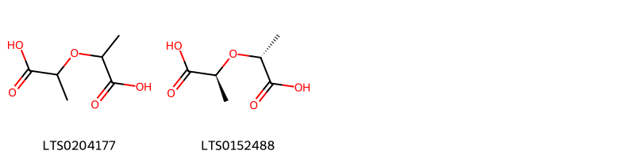
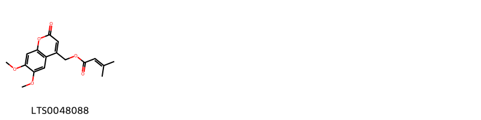
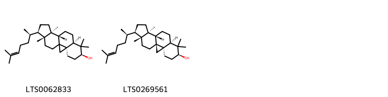

!!! abstract "Tóm tắt"
    Trinh nữ hoàng cung là một loại thảo dược quý, đặc biệt là phần lá, đã được sử dụng rộng rãi trong y học cổ truyền để điều trị nhiều bệnh khác nhau.

Các tác dụng chính:
Kháng viêm: Giảm sưng, đỏ, đau nhức.
Kháng khuẩn, kháng virus: Giúp cơ thể chống lại nhiễm trùng.
Chống oxy hóa: Bảo vệ tế bào, ngăn ngừa lão hóa.
Giảm đau: Đặc biệt hiệu quả với các cơn đau do viêm.
Điều hòa kinh nguyệt: Giảm các triệu chứng khó chịu trong kỳ kinh.
Chống ung thư: Ức chế sự phát triển của tế bào ung thư.
Bảo vệ gan: Giảm tổn thương gan.

## Thông tin về thực vật

### Đặc điểm thực vật

Dược liệu **Trinh Nữ Hoàng Cung (Lá)** từ bộ phận **Lá** từ loài *Crinum latifolium L.* thuộc họ Amaryllidaceae. " Những cây thuốc và vị thuốc Việt Nam " - Đỗ Tất Lợi
Mô tả cây: Trinh nữ hoàng cung là một loại cỏ, thân hành như củ hành tây to, đường kính 10-15cm, bẹ lá úp vào nhau thành một thân giả dài khoảng 10-15cm, có nhiều lá mỏng kéo dài từ 80-100cm, rộng 3-8cm, hai bên mép lá lượn sóng. Gân lá song song, mặt trên lá lõm thành rãnh, mặt dưới lá có một sống lá nổi rất rõ, đầu bẹ lá nơi sát đất có màu tím. Hoa mọc thành tán gồm 6-18 hoa, trên một cán hoa dài 30-60cm . Cánh hoa màu trắng có điểm màu tím đỏ, từ thân hành mọc rất nhiều củ con có thể tách ra để trồng riêng dễ dàng. 

!!! info "Phân loại thực vật của *Crinum latifolium*"
    - **Kingdom:** Plantae
    - **Phylum:** Tracheophyta
    - **Order:** Asparagales
    - **Family:** Amaryllidaceae
    - **Genus:** Crinum
    - **Species:** *Crinum latifolium*

*Tài liệu tham khảo:* "Những cây thuốc và vị thuốc Việt Nam" - Đỗ Tất Lợi

 

### Loài thay thế (Nếu có)

### Phân bố trên thế giới
**Từ vườn thực vật KEW: **: Native to:
Andaman Is., Assam, Bangladesh, China South-Central, China Southeast, India, Laos, Myanmar, Nicobar Is., Sri Lanka, Thailand, Vietnam
Introduced into:
Chagos Archipelago, Leeward Is., Windward Is.

**Từ CSDL GIBF** nan, British Indian Ocean Territory, Puerto Rico, unknown or invalid, Madagascar, Malaysia, Thailand, Guadeloupe, Brazil, Indonesia, Hong Kong, Saint Barthélemy, Angola, India, Seychelles, China, United Kingdom of Great Britain and Northern Ireland, Japan, Martinique, Saint Helena, Ascension and Tristan da Cunha, Jamaica, Marshall Islands, Sri Lanka

### Phân bố tại Việt Nam
** "Những cây thuốc và vị thuốc Việt Nam" - Đỗ Tất Lợi**: " Những cây thuốc và vị thuốc Việt Nam " - Đỗ Tất Lợi
Nhân dân thường nói rằng Trinh nữ hoàng cung chỉ mọc ở Thái Lan, Campuchia nhưng thực tế ở Việt Nam cũng có mọc từ lâu và hiện nay thấy trồng ở cả 3 miền Bắc, Trung, Nam. Ở Việt Nam bộ phận dùng là lá dùng tươi hay phơi hoặc thái nhỏ sao vàng dùng dần. Nhưng ở một số nước người ta dùng cán hoa, thân hành của cây, thái nhỏ phơi khô

**Từ CSDL GIBF**: Không có ghi nhận ở Việt Nam

---

## Thông tin về dược liệu 

### Định danh

!!! info "Thông tin về tên gọi của trinh nữ hoàng cung"
    - Dược liệu tiếng Việt: trinh nữ hoàng cung
    - Dược liệu tiếng Trung:  ()
    - Dược liệu tiếng Anh: 
    - Dược liệu latin thông dụng: Folium Crini latifolii
    - Dược liệu latin kiểu DĐVN: folium crini latifolii
    - Dược liệu latin kiểu DĐVN: 
    - Dược liệu latin kiểu thông tư: 
    - Bộ phận dùng: Lá (Folium)

### Mô tả dược liệu 
- **Theo dược điển Việt nam V:** 

- **Mô tả dược liệu theo thông tư chế biến dược liệu theo phương pháp cổ truyền:** 

### Chế biến 

- **Chế biến theo dược điển việt nam V**: 

- **Chế biến theo thông tư:** 

--- 

## Thành phần hóa học

- Theo tài liệu của GS. Đỗ Tất Lợi:  Nhóm hóa học: alkaloid 
Tên hoạt chất biomaker: 
            +Sắc ký lớp mỏng: Việc so sánh vết của mẫu thử với vết của crinamidin chuẩn cho thấy sự hiện diện của crinamidin trong dược liệu.
    
- Theo cơ sở dữ liệu lotus: Từ loài *Crinum latifolium* đã phân lập và xác định được 63 hoạt chất thuộc về các nhóm Pyrans, Benzopyrans, Carboxylic acids and derivatives, Steroids and steroid derivatives, Coumarins and derivatives, Quinolines and derivatives, Amaryllidaceae alkaloids, Fatty Acyls, Tetrahydroisoquinolines. 

|    | chemicalTaxonomyClassyfireClass   |   smiles_count |
|---:|:----------------------------------|---------------:|
|  0 | Amaryllidaceae alkaloids          |             43 |
|  1 | Benzopyrans                       |              1 |
|  2 | Carboxylic acids and derivatives  |              2 |
|  3 | Coumarins and derivatives         |              1 |
|  4 | Fatty Acyls                       |              1 |
|  5 | Pyrans                            |              1 |
|  6 | Quinolines and derivatives        |              8 |
|  7 | Steroids and steroid derivatives  |              2 |
|  8 | Tetrahydroisoquinolines           |              4 |

### Nhóm Amaryllidaceae alkaloids
<figure markdown="span">
    { width=100% }
    <figcaption>Hình ảnh cấu trúc hóa học của 43 hoạt chất thuộc nhóm Amaryllidaceae alkaloids gồm ['lycorine (LTS0186544)', 'hamayne (LTS0182031)', '5,7-dioxa-12-azapentacyclo[10.5.2.0¹,¹³.0²,¹⁰.0⁴,⁸]nonadeca-2,4(8),9,16-tetraen-15-ol (LTS0223604)', 'crinine (LTS0187333)', '5,7-dioxa-12-azapentacyclo[10.5.2.0¹,¹³.0²,¹⁰.0⁴,⁸]nonadeca-2,4(8),9,16-tetraene-15,18-diol (LTS0255460)', '15-methoxy-5,7-dioxa-12-azapentacyclo[10.5.2.0¹,¹³.0²,¹⁰.0⁴,⁸]nonadeca-2,4(8),9,16-tetraen-18-ol (LTS0204367)', '(1s,15r,18r)-15-methoxy-5,7-dioxa-12-azapentacyclo[10.5.2.0¹,¹³.0²,¹⁰.0⁴,⁸]nonadeca-2,4(8),9,16-tetraen-18-ol (LTS0068876)', '(1s,13s,15r,18s)-15-methoxy-5,7-dioxa-12-azapentacyclo[10.5.2.0¹,¹³.0²,¹⁰.0⁴,⁸]nonadeca-2,4(8),9,16-tetraen-18-ol (LTS0170374)', 'crinamine (LTS0136441)', '(1s,13s,15s,18s)-18-hydroxy-5,7-dioxa-12-azapentacyclo[10.5.2.0¹,¹³.0²,¹⁰.0⁴,⁸]nonadeca-2,4(8),9,16-tetraen-15-yl acetate (LTS0233467)', 'crinamidine (LTS0240954)', 'lycorine (LTS0250349)', '18-hydroxy-5,7-dioxa-12-azapentacyclo[10.5.2.0¹,¹³.0²,¹⁰.0⁴,⁸]nonadeca-2,4(8),9,16-tetraen-15-yl acetate (LTS0099869)', '(1s,13r,15r)-9-methoxy-5,7-dioxa-12-azapentacyclo[10.5.2.0¹,¹³.0²,¹⁰.0⁴,⁸]nonadeca-2,4(8),9,16-tetraen-15-ol (LTS0093647)', '3-o-acetylhamayne (LTS0041666)', '9-hydroxy-4-methyl-11,16,18-trioxa-4-azapentacyclo[11.7.0.0²,¹⁰.0³,⁷.0¹⁵,¹⁹]icosa-1(20),7,13,15(19)-tetraen-12-one (LTS0136506)', '9-methoxy-5,7-dioxa-12-azapentacyclo[10.5.2.0¹,¹³.0²,¹⁰.0⁴,⁸]nonadeca-2,4(8),9,16-tetraen-15-ol (LTS0229851)', 'hippeastrine (LTS0267602)', '(1s,13r,15r,18s)-15-methoxy-5,7-dioxa-12-azapentacyclo[10.5.2.0¹,¹³.0²,¹⁰.0⁴,⁸]nonadeca-2,4(8),9,16-tetraen-18-ol (LTS0047747)', '1-o-acetyllycorine (LTS0193029)', 'ambelline (LTS0112480)', 'undulatine (LTS0266360)', '(1r,13s,15r)-5,7-dioxa-12-azapentacyclo[10.5.2.0¹,¹³.0²,¹⁰.0⁴,⁸]nonadeca-2,4(8),9,16-tetraen-15-ol (LTS0242023)', '(1r,13s,15s)-5,7-dioxa-12-azapentacyclo[10.5.2.0¹,¹³.0²,¹⁰.0⁴,⁸]nonadeca-2,4(8),9,16-tetraen-15-ol (LTS0132470)', '15-methoxy-5,7-dioxa-12-azapentacyclo[10.5.2.0¹,¹³.0²,¹⁰.0⁴,⁸]nonadeca-2,4(8),9,16-tetraene-11,18-diol (LTS0001591)', '(1s,13r,15r,18s)-5,7-dioxa-12-azapentacyclo[10.5.2.0¹,¹³.0²,¹⁰.0⁴,⁸]nonadeca-2,4(8),9,16-tetraene-15,18-diol (LTS0049104)', '9,15-dimethoxy-5,7,17-trioxa-12-azahexacyclo[10.6.2.0¹,¹³.0²,¹⁰.0⁴,⁸.0¹⁶,¹⁸]icosa-2,4(8),9-triene (LTS0175665)', '(1s,11r,13s,15r,18s)-15-methoxy-5,7-dioxa-12-azapentacyclo[10.5.2.0¹,¹³.0²,¹⁰.0⁴,⁸]nonadeca-2,4(8),9,16-tetraene-11,18-diol (LTS0185074)', '(1r,13r,15r,18s)-9,15-dimethoxy-5,7-dioxa-12-azapentacyclo[10.5.2.0¹,¹³.0²,¹⁰.0⁴,⁸]nonadeca-2,4(8),9,16-tetraen-18-ol (LTS0014224)', '3-o-acetylhamayne (LTS0080119)', '(1s,13r,15r,18s)-18-hydroxy-5,7-dioxa-12-azapentacyclo[10.5.2.0¹,¹³.0²,¹⁰.0⁴,⁸]nonadeca-2,4(8),9,16-tetraen-15-yl acetate (LTS0104418)', '(1s,13s,15r)-9-methoxy-5,7-dioxa-12-azapentacyclo[10.5.2.0¹,¹³.0²,¹⁰.0⁴,⁸]nonadeca-2,4(8),9,16-tetraen-15-ol (LTS0164242)', '(1r,13s,15s,18s)-5,7-dioxa-12-azapentacyclo[10.5.2.0¹,¹³.0²,¹⁰.0⁴,⁸]nonadeca-2,4(8),9,16-tetraene-11,15,18-triol (LTS0164219)', '(1r,13s,15r,18s)-15-methoxy-5,7-dioxa-12-azapentacyclo[10.5.2.0¹,¹³.0²,¹⁰.0⁴,⁸]nonadeca-2,4(8),9,16-tetraene-11,18-diol (LTS0270786)', 'hamayne (LTS0275923)', '(1s,17r,18s,19s)-5,7-dioxa-12-azapentacyclo[10.6.1.0²,¹⁰.0⁴,⁸.0¹⁵,¹⁹]nonadeca-2,4(8),9,15-tetraene-17,18-diol (LTS0013699)', '9,15-dimethoxy-5,7-dioxa-12-azapentacyclo[10.5.2.0¹,¹³.0²,¹⁰.0⁴,⁸]nonadeca-2,4(8),9,16-tetraene (LTS0025267)', '4-(2-{[(3,4-dimethoxyphenyl)methyl]amino}ethyl)phenol (LTS0139765)', '(2s,3s,4r,5s,6r)-2-[4-(2-{[(3,4-dimethoxyphenyl)methyl]amino}ethyl)phenoxy]-6-(hydroxymethyl)oxane-3,4,5-triol (LTS0251026)', '9,15-dimethoxy-5,7-dioxa-12-azapentacyclo[10.5.2.0¹,¹³.0²,¹⁰.0⁴,⁸]nonadeca-2(10),3,8,16-tetraen-11-ol (LTS0080708)', '(1s,13s,15r)-9,15-dimethoxy-5,7-dioxa-12-azapentacyclo[10.5.2.0¹,¹³.0²,¹⁰.0⁴,⁸]nonadeca-2,4(8),9,16-tetraene (LTS0049543)', '9,15-dimethoxy-5,7,17-trioxa-12-azahexacyclo[10.6.2.0¹,¹³.0²,¹⁰.0⁴,⁸.0¹⁶,¹⁸]icosa-2(10),3,8-trien-11-ol (LTS0113842)', '(1s,13r,15r,16s,18r)-9-methoxy-5,7,17-trioxa-12-azahexacyclo[10.6.2.0¹,¹³.0²,¹⁰.0⁴,⁸.0¹⁶,¹⁸]icosa-2(10),3,8-triene-11,15-diol (LTS0129621)'].</figcaption>
</figure>
### Nhóm Benzopyrans
<figure markdown="span">
    { width=100% }
    <figcaption>Hình ảnh cấu trúc hóa học của 1 hoạt chất thuộc nhóm Benzopyrans gồm ['(11s,15r,18r,19s)-14-methyl-5,7,20,21-tetraoxa-14-azahexacyclo[16.2.1.0²,¹⁰.0⁴,⁸.0¹¹,¹⁵.0¹¹,¹⁹]henicosa-2,4(8),9-triene (LTS0040874)'].</figcaption>
</figure>
### Nhóm Carboxylic acids and derivatives
<figure markdown="span">
    { width=100% }
    <figcaption>Hình ảnh cấu trúc hóa học của 2 hoạt chất thuộc nhóm Carboxylic acids and derivatives gồm ['2-(1-carboxyethoxy)propanoic acid (LTS0204177)', '(2s)-2-[(1r)-1-carboxyethoxy]propanoic acid (LTS0152488)'].</figcaption>
</figure>
### Nhóm Coumarins and derivatives
<figure markdown="span">
    { width=100% }
    <figcaption>Hình ảnh cấu trúc hóa học của 1 hoạt chất thuộc nhóm Coumarins and derivatives gồm ['(6,7-dimethoxy-2-oxochromen-4-yl)methyl 3-methylbut-2-enoate (LTS0048088)'].</figcaption>
</figure>
### Nhóm Fatty Acyls
<figure markdown="span">
    { width=100% }
    <figcaption>Hình ảnh cấu trúc hóa học của 1 hoạt chất thuộc nhóm Fatty Acyls gồm ['octadec-8-enimidic acid (LTS0034289)'].</figcaption>
</figure>
### Nhóm Pyrans
<figure markdown="span">
    { width=100% }
    <figcaption>Hình ảnh cấu trúc hóa học của 1 hoạt chất thuộc nhóm Pyrans gồm ['6-hydroxy-2h-pyran-3-carbaldehyde (LTS0273281)'].</figcaption>
</figure>
### Nhóm Quinolines and derivatives
<figure markdown="span">
    { width=100% }
    <figcaption>Hình ảnh cấu trúc hóa học của 8 hoạt chất thuộc nhóm Quinolines and derivatives gồm ['5,7-dioxa-12-azapentacyclo[10.6.1.0²,¹⁰.0⁴,⁸.0¹⁵,¹⁹]nonadeca-1(19),2(10),3,8,13,15,17-heptaen-11-one (LTS0088729)', '4-hydroxy-5-methoxy-9-azatetracyclo[7.6.1.0²,⁷.0¹²,¹⁶]hexadeca-1(15),2(7),3,5,10,12(16),13-heptaen-8-one (LTS0072387)', '5-hydroxy-4-methoxy-9-azatetracyclo[7.6.1.0²,⁷.0¹²,¹⁶]hexadeca-1(15),2(7),3,5,10,12(16),13-heptaen-8-one (LTS0099296)', 'trisphaeridine (LTS0048431)', '4,5-dimethoxy-9-azatetracyclo[7.6.1.0²,⁷.0¹²,¹⁶]hexadeca-1(15),2(7),3,5,10,12(16),13-heptaen-8-one (LTS0177486)', 'oxoassoanine (LTS0083773)', '5,7-dioxa-12-azapentacyclo[10.6.1.0²,¹⁰.0⁴,⁸.0¹⁵,¹⁹]nonadeca-2,4(8),9,14-tetraene-16,17,18-triol (LTS0239860)', '(1s,16r,17s,18s,19r)-5,7-dioxa-12-azapentacyclo[10.6.1.0²,¹⁰.0⁴,⁸.0¹⁵,¹⁹]nonadeca-2,4(8),9,14-tetraene-16,17,18-triol (LTS0050454)'].</figcaption>
</figure>
### Nhóm Steroids and steroid derivatives
<figure markdown="span">
    { width=100% }
    <figcaption>Hình ảnh cấu trúc hóa học của 2 hoạt chất thuộc nhóm Steroids and steroid derivatives gồm ['(3r,6s,8r,11s,12s,15r,16r)-7,7,12,16-tetramethyl-15-[(2r)-6-methylhept-5-en-2-yl]pentacyclo[9.7.0.0¹,³.0³,⁸.0¹²,¹⁶]octadecan-6-ol (LTS0062833)', 'cycloartenol (LTS0269561)'].</figcaption>
</figure>
### Nhóm Tetrahydroisoquinolines
<figure markdown="span">
    { width=100% }
    <figcaption>Hình ảnh cấu trúc hóa học của 4 hoạt chất thuộc nhóm Tetrahydroisoquinolines gồm ['cherylline (LTS0026954)', '4-(4-hydroxyphenyl)-6-methoxy-2-methyl-3,4-dihydro-1h-isoquinolin-7-ol (LTS0052602)', '(4s)-4-(4-hydroxyphenyl)-6-methoxy-2-methyl-3,4-dihydro-1h-isoquinolin-5-ol (LTS0092806)', '4-(4-hydroxyphenyl)-6-methoxy-2-methyl-3,4-dihydro-1h-isoquinolin-5-ol (LTS0185544)'].</figcaption>
</figure>

---

## Tác dụng dược lý

Theo tài liệu "Những cây thuốc và vị thuốc Việt Nam" - Đỗ Tất Lợi:Tác dụng dược lý chính
Kháng viêm: Các hoạt chất trong lá trinh nữ hoàng cung có khả năng ức chế các enzyme gây viêm, giảm sưng đỏ, đau nhức.
Kháng khuẩn, kháng virus: Một số alkaloid trong lá trinh nữ hoàng cung có tác dụng tiêu diệt vi khuẩn, virus, giúp cơ thể chống lại nhiễm trùng.
Chống oxy hóa: Các flavonoid giúp trung hòa gốc tự do, bảo vệ tế bào khỏi tổn thương, ngăn ngừa lão hóa và các bệnh thoái hóa.
Giảm đau: Các alkaloid có tác dụng giảm đau hiệu quả, đặc biệt là đối với các cơn đau do viêm.
Điều hòa kinh nguyệt: Lá trinh nữ hoàng cung có tác dụng điều hòa chu kỳ kinh nguyệt, giảm các triệu chứng khó chịu trong thời kỳ kinh nguyệt.
Chống ung thư: Một số nghiên cứu cho thấy các hoạt chất trong lá trinh nữ hoàng cung có khả năng ức chế sự phát triển của tế bào ung thư.
Bảo vệ gan: Lá trinh nữ hoàng cung có tác dụng bảo vệ gan, giảm tổn thương gan do các tác nhân gây hại.

Theo tài liệu quốc tế: 

---

## Dược điển Việt Nam V

### Soi bột:

<!-- Hình ảnh soi bột sẽ được tự động chèn vào đây sau -->
### Vi phẫu:

<!-- Hình ảnh vi phẫu sẽ được tự động chèn vào đây sau -->
### Định tính

### Định lượng

### Thông tin khác 
- ** Độ ẩm: ** 

- ** Bảo quản:** 
## Dược điển Hồng kong

<!-- PDF sẽ được tự động chèn vào đây sau -->

---

## Y dược học cổ truyền

- **Tên vị thuốc:** 
- **Tính vị quy kinh:** Vị đắng, chát. Tính ôn. Quy kinh thận, bàng quang.
- **Công năng chủ trị:** Công năng: Lợi niệu, nhuyễn kiên, tán kết, tiêu u, giải độc (ôn bổ thận dương, hóa khí hành thủy).

Chủ trị: Tiểu tiện bí dắt, u xơ tuyến tiền liệt, u vú, u tử cung, dạ dày.

Lá tươi và thân hành dùng ngoài, hơ nóng xoa bóp vào chỗ sưng đau do thấp khớp, sang chấn.
- **Chú ý:** 
- **Kiêng kỵ:** 

