!!! abstract "Tóm tắt"
    Fructus Perillae frutescensis (Lamiaceae); Bản địa : phổ biến ở Đông Á, Nam Á, và Đông Nam Á - Di thực : Châu âu, Châu Mỹ, Châu phi; Kinh nghiệm sử dụng : phát tán phong hàn, lý khí khoan hung; giải uất, hoá đờm, an thai, giải độc của cua cá; TDDL : phát tán phong hàn 
, giải uất, hoá đờm; TPHH : perilla- andehyt C10H14O, limonen, α- pinen, dihydrocumin C10H14O, xyanin clorit C27H31O16Cl, adenin C5H5N5 và acginin C6H14N4O2.

## Thông tin về thực vật

### Đặc điểm thực vật

Dược liệu **Tía Tô (Quả)** từ bộ phận **nan** từ loài *Perilla frutescens (L.) Britt.* thuộc họ Lamiaceae. Tía tô là một loại cỏ mọc hằng năm, cao chừng 0,5-1,5cm. Thần thẳng đứng có lông. Lá mọc đổi, hình trứng, đầu nhọn, mép có răng cưa to; phiến lá dài 4-12cm rộng 2,50-10cm, màu tím hoặc xanh tím, trên có lông màu tím. Người ta phân biệt thứ tía tô có lá màu tím hung là Perilla ocymoides var. purpurascens và thứ tía tô có lá màu lục, chỉ có gân màu hung (Perilla ocymoides var.bicolor). Cuống lá ngắn 2-3cm. Hoa nhỏ, màu trắng hoặc tím nhạt, mọc thành từng chùm ở kẽ lá hay đầu cành, chùm dài 6-20cm. Quả là hạch nhỏ, hình cầu, đường kính 1mm, màu nâu nhạt, có mạng. 

!!! info "Phân loại thực vật của *Perilla frutescens*"
    - **Kingdom:** Plantae
    - **Phylum:** Tracheophyta
    - **Order:** Lamiales
    - **Family:** Lamiaceae
    - **Genus:** Perilla
    - **Species:** *Perilla frutescens*

*Tài liệu tham khảo:* "Những cây thuốc và vị thuốc Việt Nam" - Đỗ Tất Lợi

 

### Loài thay thế (Nếu có)

### Phân bố trên thế giới
**Từ vườn thực vật KEW: **: Bản địa : Trung Quốc, Đông Himalaya, Ấn Độ, Nhật Bản, Hàn Quốc, Lào, Myanmar, Đài Loan, Thái Lan, Việt Nam.
Di thực : Châu âu, Châu Mỹ, Châu phi như : Florida, Georgia, Đức, Illinois, Indiana, Nga ,  Texas, Ukraine, Alabama, Arkansas, Campuchia,...

**Từ CSDL GIBF** New Zealand, China, United States of America, Chinese Taipei, Netherlands

### Phân bố tại Việt Nam
** "Những cây thuốc và vị thuốc Việt Nam" - Đỗ Tất Lợi**: Tía tô được trồng ở khắp nơi ở Việt Nam.

**Từ CSDL GIBF**: Không có ghi nhận ở Việt Nam

---

## Thông tin về dược liệu 

### Định danh

!!! info "Thông tin về tên gọi của nan"
    - Dược liệu tiếng Việt: nan
    - Dược liệu tiếng Trung: nan (nan)
    - Dược liệu tiếng Anh: nan
    - Dược liệu latin thông dụng: nan
    - Dược liệu latin kiểu DĐVN: fructus perillae frutescensis
    - Dược liệu latin kiểu DĐVN: nan
    - Dược liệu latin kiểu thông tư: nan
    - Bộ phận dùng: nan (nan)

### Mô tả dược liệu 
- **Theo dược điển Việt nam V:** nan

- **Mô tả dược liệu theo thông tư chế biến dược liệu theo phương pháp cổ truyền:** nan

### Chế biến 

- **Chế biến theo dược điển việt nam V**: nan

- **Chế biến theo thông tư:** nan

--- 

## Thành phần hóa học

- Theo tài liệu của GS. Đỗ Tất Lợi:  (1) perilla- andehyt C10H14O, limonen, α- pinen, dihydrocumin C10H14O, xyanin clorit C27H31O16Cl, adenin C5H5N5 và acginin C6H14N4O2.
(2)
    
- Theo cơ sở dữ liệu lotus: Từ loài *Perilla frutescens* đã phân lập và xác định được 283 hoạt chất thuộc về các nhóm Coumarins and derivatives, Benzene and substituted derivatives, Tetrahydrofurans, Benzoxepines, Heteroaromatic compounds, Oxanes, Organic oxides, Steroids and steroid derivatives, Epoxides, Flavonoids, Phenols, Glycerolipids, Benzodioxoles, Phenol ethers, Cinnamic acids and derivatives, Organooxygen compounds, Cyclobutane lignans, Tetrapyrroles and derivatives, Prenol lipids, Fatty Acyls, Saturated hydrocarbons, Oxepanes, Diazines, Unsaturated hydrocarbons, Naphthalenes. 

|    | chemicalTaxonomyClassyfireClass     |   smiles_count |
|---:|:------------------------------------|---------------:|
|  0 | Benzene and substituted derivatives |              5 |
|  1 | Benzodioxoles                       |              2 |
|  2 | Benzoxepines                        |              3 |
|  3 | Cinnamic acids and derivatives      |             24 |
|  4 | Coumarins and derivatives           |              1 |
|  5 | Cyclobutane lignans                 |              4 |
|  6 | Diazines                            |              5 |
|  7 | Epoxides                            |              1 |
|  8 | Fatty Acyls                         |             17 |
|  9 | Flavonoids                          |             33 |
| 10 | Glycerolipids                       |              2 |
| 11 | Heteroaromatic compounds            |              1 |
| 12 | Naphthalenes                        |              1 |
| 13 | Organic oxides                      |              1 |
| 14 | Organooxygen compounds              |             34 |
| 15 | Oxanes                              |              1 |
| 16 | Oxepanes                            |              1 |
| 17 | Phenol ethers                       |              3 |
| 18 | Phenols                             |              9 |
| 19 | Prenol lipids                       |            115 |
| 20 | Saturated hydrocarbons              |              1 |
| 21 | Steroids and steroid derivatives    |             12 |
| 22 | Tetrahydrofurans                    |              1 |
| 23 | Tetrapyrroles and derivatives       |              2 |
| 24 | Unsaturated hydrocarbons            |              1 |

### Nhóm Benzene and substituted derivatives
<figure markdown="span">
    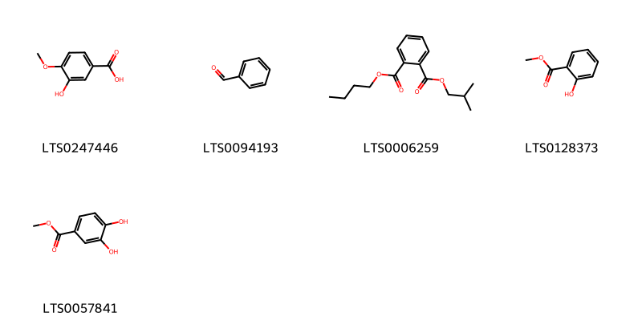{ width=100% }
    <figcaption>Hình ảnh cấu trúc hóa học của 5 hoạt chất thuộc nhóm Benzene and substituted derivatives gồm ['isovanillic acid (LTS0247446)', 'benzaldehyde (LTS0094193)', '1-butyl 2-(2-methylpropyl) phthalate (LTS0006259)', 'methyl salicylate (LTS0128373)', 'methyl 3,4-dihydroxybenzoate (LTS0057841)'].</figcaption>
</figure>
### Nhóm Benzodioxoles
<figure markdown="span">
    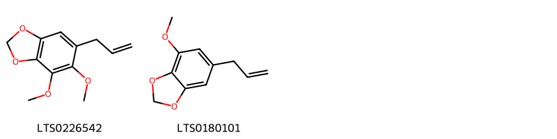{ width=100% }
    <figcaption>Hình ảnh cấu trúc hóa học của 2 hoạt chất thuộc nhóm Benzodioxoles gồm ['dillapiol (LTS0226542)', 'myristicin (LTS0180101)'].</figcaption>
</figure>
### Nhóm Benzoxepines
<figure markdown="span">
    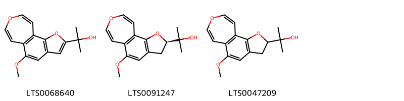{ width=100% }
    <figcaption>Hình ảnh cấu trúc hóa học của 3 hoạt chất thuộc nhóm Benzoxepines gồm ['2-{8-methoxy-3,12-dioxatricyclo[7.5.0.0²,⁶]tetradeca-1,4,6,8,10,13-hexaen-4-yl}propan-2-ol (LTS0068640)', '2-[(4r)-8-methoxy-3,12-dioxatricyclo[7.5.0.0²,⁶]tetradeca-1(9),2(6),7,10,13-pentaen-4-yl]propan-2-ol (LTS0091247)', '2-{8-methoxy-3,12-dioxatricyclo[7.5.0.0²,⁶]tetradeca-1(9),2(6),7,10,13-pentaen-4-yl}propan-2-ol (LTS0047209)'].</figcaption>
</figure>
### Nhóm Cinnamic acids and derivatives
<figure markdown="span">
    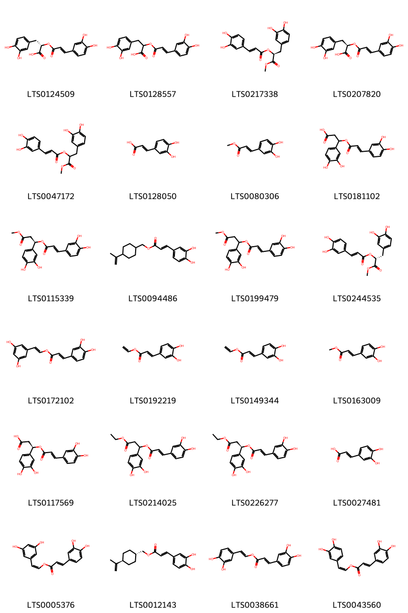{ width=100% }
    <figcaption>Hình ảnh cấu trúc hóa học của 24 hoạt chất thuộc nhóm Cinnamic acids and derivatives gồm ['(s)-rosmarinic acid (LTS0124509)', '3-(3,4-dihydroxyphenyl)-2-{[3-(3,4-dihydroxyphenyl)prop-2-enoyl]oxy}propanoic acid (LTS0128557)', '(2s)-3-(3,4-dihydroxyphenyl)-1-methoxy-1-oxopropan-2-yl (2e)-3-(3,4-dihydroxyphenyl)prop-2-enoate (LTS0217338)', 'rosemary acid (LTS0207820)', '3-(3,4-dihydroxyphenyl)-1-methoxy-1-oxopropan-2-yl 3-(3,4-dihydroxyphenyl)prop-2-enoate (LTS0047172)', '3,4-dihydroxycinnamic acid (LTS0128050)', 'methyl 3-(3,4-dihydroxyphenyl)prop-2-enoate (LTS0080306)', '3-(3,4-dihydroxyphenyl)-3-{[3-(3,4-dihydroxyphenyl)prop-2-enoyl]oxy}propanoic acid (LTS0181102)', '(1r)-1-(3,4-dihydroxyphenyl)-3-methoxy-3-oxopropyl (2e)-3-(3,4-dihydroxyphenyl)prop-2-enoate (LTS0115339)', '[4-(prop-1-en-2-yl)cyclohexyl]methyl 3-(3,4-dihydroxyphenyl)prop-2-enoate (LTS0094486)', '1-(3,4-dihydroxyphenyl)-3-methoxy-3-oxopropyl 3-(3,4-dihydroxyphenyl)prop-2-enoate (LTS0199479)', '(2r)-3-(3,4-dihydroxyphenyl)-1-methoxy-1-oxopropan-2-yl 3-(3,4-dihydroxyphenyl)prop-2-enoate (LTS0244535)', '2-(3,5-dihydroxyphenyl)ethenyl 3-(3,4-dihydroxyphenyl)prop-2-enoate (LTS0172102)', 'ethenyl (2e)-3-(3,4-dihydroxyphenyl)prop-2-enoate (LTS0192219)', 'ethenyl 3-(3,4-dihydroxyphenyl)prop-2-enoate (LTS0149344)', 'methyl caffeate (LTS0163009)', '(3r)-3-(3,4-dihydroxyphenyl)-3-{[(2e)-3-(3,4-dihydroxyphenyl)prop-2-enoyl]oxy}propanoic acid (LTS0117569)', '1-(3,4-dihydroxyphenyl)-3-ethoxy-3-oxopropyl 3-(3,4-dihydroxyphenyl)prop-2-enoate (LTS0214025)', '(1r)-1-(3,4-dihydroxyphenyl)-3-ethoxy-3-oxopropyl (2e)-3-(3,4-dihydroxyphenyl)prop-2-enoate (LTS0226277)', 'caffeic acid (LTS0027481)', '(1z)-2-(3,5-dihydroxyphenyl)ethenyl (2e)-3-(3,4-dihydroxyphenyl)prop-2-enoate (LTS0005376)', '[(1r,4r)-4-(prop-1-en-2-yl)cyclohexyl]methyl (2e)-3-(3,4-dihydroxyphenyl)prop-2-enoate (LTS0012143)', '2-(3,4-dihydroxyphenyl)ethenyl 3-(3,4-dihydroxyphenyl)prop-2-enoate (LTS0038661)', '(1z)-2-(3,4-dihydroxyphenyl)ethenyl (2e)-3-(3,4-dihydroxyphenyl)prop-2-enoate (LTS0043560)'].</figcaption>
</figure>
### Nhóm Coumarins and derivatives
<figure markdown="span">
    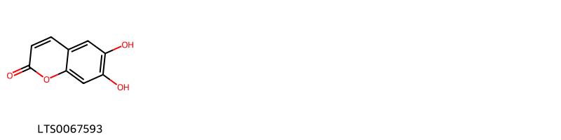{ width=100% }
    <figcaption>Hình ảnh cấu trúc hóa học của 1 hoạt chất thuộc nhóm Coumarins and derivatives gồm ['esculetin (LTS0067593)'].</figcaption>
</figure>
### Nhóm Cyclobutane lignans
<figure markdown="span">
    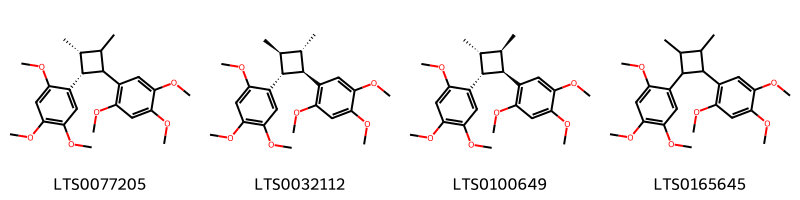{ width=100% }
    <figcaption>Hình ảnh cấu trúc hóa học của 4 hoạt chất thuộc nhóm Cyclobutane lignans gồm ['1-[(3r,4r)-2,3-dimethyl-4-(2,4,5-trimethoxyphenyl)cyclobutyl]-2,4,5-trimethoxybenzene (LTS0077205)', '1-[(1r,2s,3s,4r)-2,3-dimethyl-4-(2,4,5-trimethoxyphenyl)cyclobutyl]-2,4,5-trimethoxybenzene (LTS0032112)', 'magnosalin (LTS0100649)', '1-[2,3-dimethyl-4-(2,4,5-trimethoxyphenyl)cyclobutyl]-2,4,5-trimethoxybenzene (LTS0165645)'].</figcaption>
</figure>
### Nhóm Diazines
<figure markdown="span">
    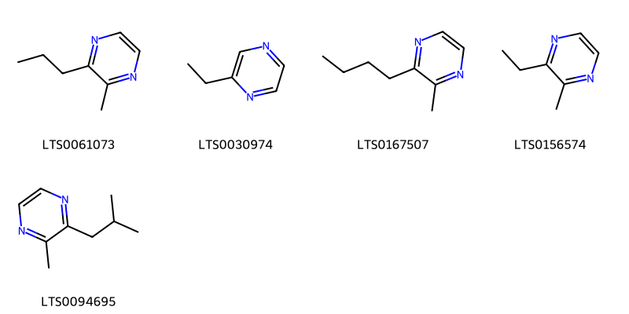{ width=100% }
    <figcaption>Hình ảnh cấu trúc hóa học của 5 hoạt chất thuộc nhóm Diazines gồm ['pyrazine, 2-methyl-3-propyl- (LTS0061073)', '2-ethylpyrazine (LTS0030974)', 'pyrazine, 2-butyl-3-methyl- (LTS0167507)', '2-ethyl-3-methylpyrazine (LTS0156574)', '2-isobutyl-3-methyl pyrazine (LTS0094695)'].</figcaption>
</figure>
### Nhóm Epoxides
<figure markdown="span">
    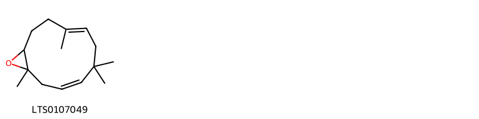{ width=100% }
    <figcaption>Hình ảnh cấu trúc hóa học của 1 hoạt chất thuộc nhóm Epoxides gồm ['(3z,7e)-1,5,5,8-tetramethyl-12-oxabicyclo[9.1.0]dodeca-3,7-diene (LTS0107049)'].</figcaption>
</figure>
### Nhóm Fatty Acyls
<figure markdown="span">
    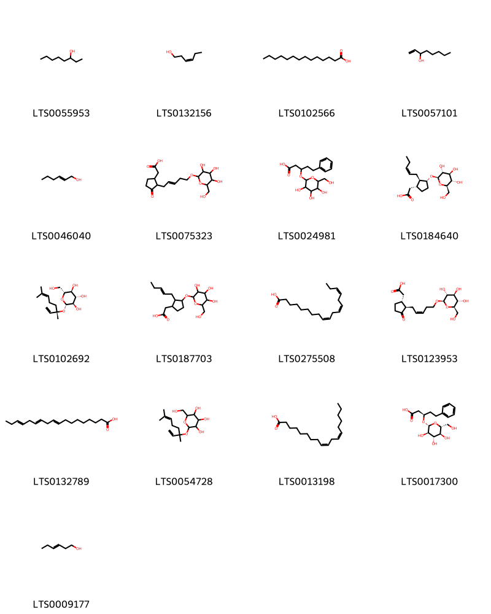{ width=100% }
    <figcaption>Hình ảnh cấu trúc hóa học của 17 hoạt chất thuộc nhóm Fatty Acyls gồm ['3-octanol (LTS0055953)', 'cis-3-hexenol (LTS0132156)', 'myristic acid (LTS0102566)', '1-octen-3-ol (LTS0057101)', 'trans-2-hexenol (LTS0046040)', '[3-oxo-2-(5-{[3,4,5-trihydroxy-6-(hydroxymethyl)oxan-2-yl]oxy}pent-2-en-1-yl)cyclopentyl]acetic acid (LTS0075323)', '5-phenyl-3-{[3,4,5-trihydroxy-6-(hydroxymethyl)oxan-2-yl]oxy}pentanoic acid (LTS0024981)', '[(1r,2r,3r)-2-[(2z)-pent-2-en-1-yl]-3-{[(2r,3r,4s,5s,6r)-3,4,5-trihydroxy-6-(hydroxymethyl)oxan-2-yl]oxy}cyclopentyl]acetic acid (LTS0184640)', '(2s,3r,4s,5s,6r)-2-{[(3s)-3,7-dimethylocta-1,6-dien-3-yl]oxy}-6-(hydroxymethyl)oxane-3,4,5-triol (LTS0102692)', '[2-(pent-2-en-1-yl)-3-{[3,4,5-trihydroxy-6-(hydroxymethyl)oxan-2-yl]oxy}cyclopentyl]acetic acid (LTS0187703)', 'α-linolenic acid (LTS0275508)', 'tuberonic acid glucoside (LTS0123953)', 'α linolenic acid (LTS0132789)', '2-[(3,7-dimethylocta-1,6-dien-3-yl)oxy]-6-(hydroxymethyl)oxane-3,4,5-triol (LTS0054728)', 'linoleic (LTS0013198)', '(3r)-5-phenyl-3-{[(2r,3r,4s,5s,6r)-3,4,5-trihydroxy-6-(hydroxymethyl)oxan-2-yl]oxy}pentanoic acid (LTS0017300)', '3-hexenol (LTS0009177)'].</figcaption>
</figure>
### Nhóm Flavonoids
<figure markdown="span">
    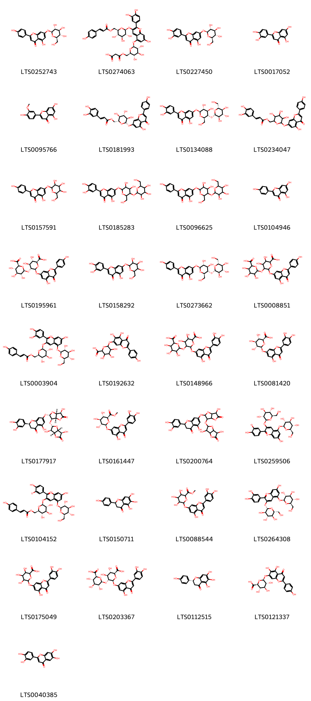{ width=100% }
    <figcaption>Hình ảnh cấu trúc hóa học của 33 hoạt chất thuộc nhóm Flavonoids gồm ['apigenin 7-o-β-glucoside (LTS0252743)', '5-{[(2s,3r,4s,5s,6r)-6-{[(2-carboxyacetyl)oxy]methyl}-3,4,5-trihydroxyoxan-2-yl]oxy}-2-(3,4-dihydroxyphenyl)-7-hydroxy-3-{[(2s,3r,4s,5s,6r)-3,4,5-trihydroxy-6-({[3-(4-hydroxyphenyl)prop-2-enoyl]oxy}methyl)oxan-2-yl]oxy}-1λ⁴-chromen-1-ylium (LTS0274063)', 'luteolin 7-o-glucoside (LTS0227450)', 'luteolin (LTS0017052)', 'chrysoeriol (LTS0095766)', '[(2r,3s,4s,5r,6s)-3,4,5-trihydroxy-6-{[5-hydroxy-2-(4-hydroxyphenyl)-4-oxochromen-7-yl]oxy}oxan-2-yl]methyl (2e)-3-(3,4-dihydroxyphenyl)prop-2-enoate (LTS0181993)', '7-{[(2s,3r,4r,5s,6r)-3,4-dihydroxy-6-(hydroxymethyl)-5-{[(2s,3r,4s,5s,6r)-3,4,5-trihydroxy-6-(hydroxymethyl)oxan-2-yl]oxy}oxan-2-yl]oxy}-2-(3,4-dihydroxyphenyl)-5-hydroxychromen-4-one (LTS0134088)', '(3,4,5-trihydroxy-6-{[5-hydroxy-2-(4-hydroxyphenyl)-4-oxochromen-7-yl]oxy}oxan-2-yl)methyl 3-(3,4-dihydroxyphenyl)prop-2-enoate (LTS0234047)', 'apigetrin (LTS0157591)', '7-{[3,4-dihydroxy-6-(hydroxymethyl)-5-{[3,4,5-trihydroxy-6-(hydroxymethyl)oxan-2-yl]oxy}oxan-2-yl]oxy}-2-(3,4-dihydroxyphenyl)-5-hydroxychromen-4-one (LTS0185283)', '7-{[3,4-dihydroxy-6-(hydroxymethyl)-5-{[3,4,5-trihydroxy-6-(hydroxymethyl)oxan-2-yl]oxy}oxan-2-yl]oxy}-5-hydroxy-2-(4-hydroxyphenyl)chromen-4-one (LTS0096625)', 'chamomile (LTS0104946)', '(2s,3s,4s,5r,6s)-5-{[(2r,3r,4s,5s,6s)-6-carboxy-3,4,5-trihydroxyoxan-2-yl]oxy}-3,4-dihydroxy-6-{[5-hydroxy-2-(4-hydroxyphenyl)-4-oxochromen-7-yl]oxy}oxane-2-carboxylic acid (LTS0195961)', '2-(3,4-dihydroxyphenyl)-5-hydroxy-7-{[3,4,5-trihydroxy-6-(hydroxymethyl)oxan-2-yl]oxy}chromen-4-one (LTS0158292)', '7-{[(2s,3r,4r,5s,6r)-3,4-dihydroxy-6-(hydroxymethyl)-5-{[(2s,3r,4s,5s,6r)-3,4,5-trihydroxy-6-(hydroxymethyl)oxan-2-yl]oxy}oxan-2-yl]oxy}-5-hydroxy-2-(4-hydroxyphenyl)chromen-4-one (LTS0273662)', '6-[(6-carboxy-4,5-dihydroxy-2-{[5-hydroxy-2-(4-hydroxyphenyl)-4-oxochromen-7-yl]oxy}oxan-3-yl)oxy]-3,4,5-trihydroxyoxane-2-carboxylic acid (LTS0008851)', '2-(3,4-dihydroxyphenyl)-7-hydroxy-5-{[(2s,3r,4s,5s,6r)-3,4,5-trihydroxy-6-(hydroxymethyl)oxan-2-yl]oxy}-3-{[(2s,3r,4s,5s,6r)-3,4,5-trihydroxy-6-({[3-(4-hydroxyphenyl)prop-2-enoyl]oxy}methyl)oxan-2-yl]oxy}-1λ⁴-chromen-1-ylium (LTS0003904)', '6-{[5,6-dihydroxy-2-(4-hydroxyphenyl)-4-oxochromen-7-yl]oxy}-3,4,5-trihydroxyoxane-2-carboxylic acid (LTS0192632)', '6-[(6-carboxy-2-{[2-(3,4-dihydroxyphenyl)-5-hydroxy-4-oxochromen-7-yl]oxy}-4,5-dihydroxyoxan-3-yl)oxy]-3,4,5-trihydroxyoxane-2-carboxylic acid (LTS0148966)', 'luteolin 7-o-glucuronide (LTS0081420)', '(2s)-7-{[(2s,3r,3as,6r,6ar)-3-{[(2s,3r,3ar,6r,6ar)-3,6-dihydroxy-5-oxo-tetrahydro-2h-furo[3,2-b]furan-2-yl]oxy}-6-hydroxy-5-oxo-tetrahydro-2h-furo[3,2-b]furan-2-yl]oxy}-2-(3,4-dihydroxyphenyl)-5-hydroxy-2,3-dihydro-1-benzopyran-4-one (LTS0177917)', 'methyl (2s,3s,4s,5r,6s)-6-{[2-(3,4-dihydroxyphenyl)-5-hydroxy-4-oxochromen-7-yl]oxy}-3,4,5-trihydroxyoxane-2-carboxylate (LTS0161447)', '7-{[3-({3,6-dihydroxy-5-oxo-tetrahydro-2h-furo[3,2-b]furan-2-yl}oxy)-6-hydroxy-5-oxo-tetrahydro-2h-furo[3,2-b]furan-2-yl]oxy}-2-(3,4-dihydroxyphenyl)-5-hydroxy-2,3-dihydro-1-benzopyran-4-one (LTS0200764)', 'cyanin betaine (LTS0259506)', '7-hydroxy-2-(4-hydroxy-3-oxidophenyl)-5-{[(2s,3r,4s,5s,6r)-3,4,5-trihydroxy-6-(hydroxymethyl)oxan-2-yl]oxy}-3-{[(2s,3r,4s,5s,6r)-3,4,5-trihydroxy-6-({[3-(4-hydroxyphenyl)prop-2-enoyl]oxy}methyl)oxan-2-yl]oxy}-1λ⁴-chromen-1-ylium (LTS0104152)', 'carthamidin (LTS0150711)', 'methyl 6-{[2-(3,4-dihydroxyphenyl)-5-hydroxy-4-oxochromen-7-yl]oxy}-3,4,5-trihydroxyoxane-2-carboxylate (LTS0088544)', 'cyanin (LTS0264308)', '6-{[2-(3,4-dihydroxyphenyl)-5-hydroxy-4-oxochromen-7-yl]oxy}-3,4,5-trihydroxyoxane-2-carboxylic acid (LTS0175049)', '(2s,3s,4s,5r,6s)-5-{[(2r,3r,4s,5s,6s)-6-carboxy-3,4,5-trihydroxyoxan-2-yl]oxy}-6-{[2-(3,4-dihydroxyphenyl)-5-hydroxy-4-oxochromen-7-yl]oxy}-3,4-dihydroxyoxane-2-carboxylic acid (LTS0203367)', '(2r)-5,6,7-trihydroxy-2-(4-hydroxyphenyl)-2,3-dihydro-1-benzopyran-4-one (LTS0112515)', 'scutellarin (LTS0121337)', '2-(3,4-dihydroxyphenyl)-6,7-dihydroxychromen-4-one (LTS0040385)'].</figcaption>
</figure>
### Nhóm Glycerolipids
<figure markdown="span">
    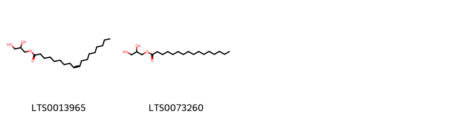{ width=100% }
    <figcaption>Hình ảnh cấu trúc hóa học của 2 hoạt chất thuộc nhóm Glycerolipids gồm ['oleoyl glycerol (LTS0013965)', 'glyceryl palmitate (LTS0073260)'].</figcaption>
</figure>
### Nhóm Heteroaromatic compounds
<figure markdown="span">
    { width=100% }
    <figcaption>Hình ảnh cấu trúc hóa học của 1 hoạt chất thuộc nhóm Heteroaromatic compounds gồm ['perillene (LTS0083458)'].</figcaption>
</figure>
### Nhóm Naphthalenes
<figure markdown="span">
    { width=100% }
    <figcaption>Hình ảnh cấu trúc hóa học của 1 hoạt chất thuộc nhóm Naphthalenes gồm ['naphthalene (LTS0254484)'].</figcaption>
</figure>
### Nhóm Organic oxides
<figure markdown="span">
    { width=100% }
    <figcaption>Hình ảnh cấu trúc hóa học của 1 hoạt chất thuộc nhóm Organic oxides gồm ['β-cyclocitral (LTS0195727)'].</figcaption>
</figure>
### Nhóm Organooxygen compounds
<figure markdown="span">
    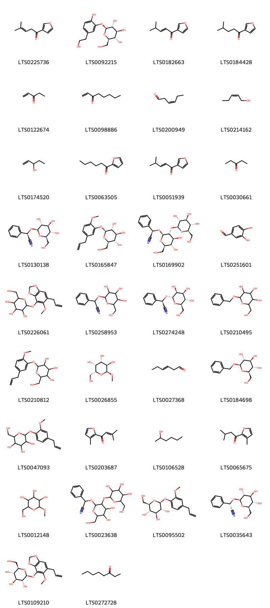{ width=100% }
    <figcaption>Hình ảnh cấu trúc hóa học của 34 hoạt chất thuộc nhóm Organooxygen compounds gồm ['egomaketone (LTS0225736)', '3-hydroxytyrosol 3-o-glucoside (LTS0092215)', '(2e)-1-(furan-3-yl)-4-methylpent-2-en-1-one (LTS0182663)', 'perilla ketone (LTS0184428)', '1-penten-3-one (LTS0122674)', '1-octen-3-one (LTS0098886)', 'cis-3-hexenal (LTS0200949)', 'cis-2-pentenol (LTS0214162)', '1-penten-3-ol (LTS0174520)', '2-furyl pentyl ketone (LTS0063505)', '1-(furan-3-yl)-4-methylpent-2-en-1-one (LTS0051939)', '3-pentanone (LTS0030661)', 'prunasin (LTS0130138)', '(2r,3s,4s,5r,6s)-2-(hydroxymethyl)-6-[2-methoxy-5-(prop-2-en-1-yl)phenoxy]oxane-3,4,5-triol (LTS0165847)', '(2r)-2-{[(2r,3r,4s,5s,6r)-4,5-dihydroxy-6-(hydroxymethyl)-3-{[(2s,3r,4s,5s,6r)-3,4,5-trihydroxy-6-(hydroxymethyl)oxan-2-yl]oxy}oxan-2-yl]oxy}-2-phenylacetonitrile (LTS0169902)', '3,4-dihydroxybenzaldehyde (LTS0251601)', '2-(hydroxymethyl)-6-{[5-methoxy-6-(prop-2-en-1-yl)-2h-1,3-benzodioxol-4-yl]oxy}oxane-3,4,5-triol (LTS0226061)', '2-phenyl-2-{[3,4,5-trihydroxy-6-(hydroxymethyl)oxan-2-yl]oxy}acetonitrile (LTS0258953)', '(2r)-2-phenyl-2-{[(2s,3s,4s,5s,6r)-3,4,5-trihydroxy-6-(hydroxymethyl)oxan-2-yl]oxy}acetonitrile (LTS0274248)', 'benzyl glucopyranoside (LTS0210495)', '2-(hydroxymethyl)-6-[2-methoxy-5-(prop-2-en-1-yl)phenoxy]oxane-3,4,5-triol (LTS0210812)', 'methyl α-galactoside (LTS0026855)', '3-hexenal (LTS0027368)', 'benzyl β-d-glucoside (LTS0184698)', '2-(hydroxymethyl)-6-[2-methoxy-4-(prop-2-en-1-yl)phenoxy]oxane-3,4,5-triol (LTS0047093)', '3-methyl-1-(3-methylfuran-2-yl)but-2-en-1-one (LTS0203687)', '2-hexanol (LTS0106528)', '3-methyl-1-(3-methylfuran-2-yl)butan-1-one (LTS0065675)', 'methyl-α-d-mannoside (LTS0012148)', '2-{[4,5-dihydroxy-6-(hydroxymethyl)-3-{[3,4,5-trihydroxy-6-(hydroxymethyl)oxan-2-yl]oxy}oxan-2-yl]oxy}-2-phenylacetonitrile (LTS0023638)', 'eugenyl glucoside (LTS0095502)', '(s)-prunasin (LTS0035643)', '(2r,3s,4s,5r,6s)-2-(hydroxymethyl)-6-{[5-methoxy-6-(prop-2-en-1-yl)-2h-1,3-benzodioxol-4-yl]oxy}oxane-3,4,5-triol (LTS0109210)', '3-octanone (LTS0272728)'].</figcaption>
</figure>
### Nhóm Oxanes
<figure markdown="span">
    { width=100% }
    <figcaption>Hình ảnh cấu trúc hóa học của 1 hoạt chất thuộc nhóm Oxanes gồm ['1,8-cineole (LTS0166505)'].</figcaption>
</figure>
### Nhóm Oxepanes
<figure markdown="span">
    { width=100% }
    <figcaption>Hình ảnh cấu trúc hóa học của 1 hoạt chất thuộc nhóm Oxepanes gồm ['limonene-1,2-epoxide (LTS0225957)'].</figcaption>
</figure>
### Nhóm Phenol ethers
<figure markdown="span">
    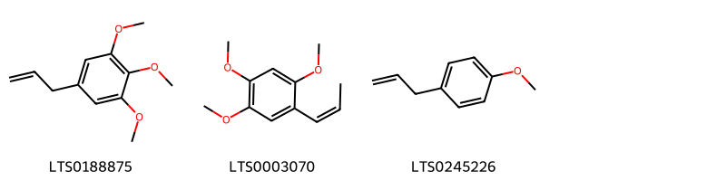{ width=100% }
    <figcaption>Hình ảnh cấu trúc hóa học của 3 hoạt chất thuộc nhóm Phenol ethers gồm ['elemicin (LTS0188875)', 'β-asarone (LTS0003070)', 'tarragon (LTS0245226)'].</figcaption>
</figure>
### Nhóm Phenols
<figure markdown="span">
    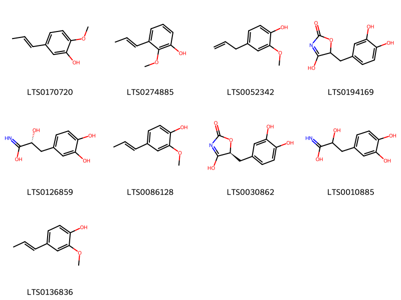{ width=100% }
    <figcaption>Hình ảnh cấu trúc hóa học của 9 hoạt chất thuộc nhóm Phenols gồm ['2-methoxy-5-(prop-1-en-1-yl)phenol (LTS0170720)', '2-methoxy-3-(prop-1-en-1-yl)phenol (LTS0274885)', 'eugenol (LTS0052342)', '5-[(3,4-dihydroxyphenyl)methyl]-4-hydroxy-5h-1,3-oxazol-2-one (LTS0194169)', '(2r)-3-(3,4-dihydroxyphenyl)-2-hydroxypropanimidic acid (LTS0126859)', '2-methoxy-4-propenylphenol (LTS0086128)', '(5s)-5-[(3,4-dihydroxyphenyl)methyl]-4-hydroxy-5h-1,3-oxazol-2-one (LTS0030862)', '3-(3,4-dihydroxyphenyl)-2-hydroxypropanimidic acid (LTS0010885)', 'isoeugenol (LTS0136836)'].</figcaption>
</figure>
### Nhóm Prenol lipids
<figure markdown="span">
    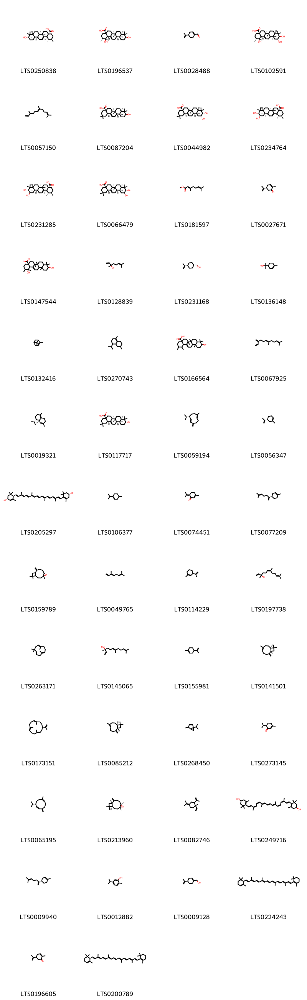{ width=100% }
    <figcaption>Hình ảnh cấu trúc hóa học của 115 hoạt chất thuộc nhóm Prenol lipids gồm ['ursolic acid (LTS0250838)', 'pomolic acid (LTS0196537)', 'perillaldehyde,  (LTS0028488)', 'tormentic acid (LTS0102591)', 'farnesene (LTS0057150)', '(4as,6as,6br,8as,10s,12ar,12bs,14br)-10-hydroxy-2,2,6a,6b,9,9,12a-heptamethyl-1,3,4,5,6,7,8,8a,10,11,12,12b,13,14b-tetradecahydropicene-4a-carboxylic acid (LTS0087204)', 'epi-maslinic acid (LTS0044982)', '(1s,2r,4as,6as,6br,8ar,10s,11r,12ar,12br,14bs)-10,11-dihydroxy-1,2,6a,6b,9,9,12a-heptamethyl-2,3,4,5,6,7,8,8a,10,11,12,12b,13,14b-tetradecahydro-1h-picene-4a-carboxylic acid (LTS0234764)', 'corosolic acid (LTS0231285)', '(4as,6as,6br,8ar,10r,11s,12ar,12br,14bs)-10,11-dihydroxy-2,2,6a,6b,9,9,12a-heptamethyl-1,3,4,5,6,7,8,8a,10,11,12,12b,13,14b-tetradecahydropicene-4a-carboxylic acid (LTS0066479)', 'methyl geranate (LTS0181597)', 'carvone, (+)- (LTS0027671)', '1,10-dihydroxy-1,2,6a,6b,9,9,12a-heptamethyl-2,3,4,5,6,7,8,8a,10,11,12,12b,13,14b-tetradecahydropicene-4a-carboxylic acid (LTS0147544)', 'linalool, (+-)- (LTS0128839)', '[(1r,4r)-4-(prop-1-en-2-yl)cyclohexyl]methanol (LTS0231168)', 'terpineol (LTS0136148)', 'α pinene (LTS0132416)', '4-isopropyl-1,6-dimethyl-2,3,4,4a,7,8-hexahydronaphthalene (LTS0270743)', '10-hydroxy-1,2,6a,6b,9,9,12a-heptamethyl-2,3,4,5,6,7,8,8a,10,11,12,12b,13,14b-tetradecahydro-1h-picene-4a-carboxylic acid (LTS0166564)', 'β-farnesene (LTS0067925)', 'delta-cadinene (LTS0019321)', 'oleanolic acid (LTS0117717)', '(-)-germacrene d (LTS0059194)', '(5r)-1-methyl-5-(prop-1-en-2-yl)cyclohex-1-ene (LTS0056347)', 'carotenoid (LTS0205297)', 'β-terpinene (LTS0106377)', 'piperitenone (LTS0074451)', '(r)-β-bisabolene (LTS0077209)', 'caryophyllene oxide (LTS0159789)', 'trans-β-ocimene (LTS0049765)', '1-methyl-3-(prop-1-en-2-yl)cyclohex-1-ene (LTS0114229)', 'nerolidol (LTS0197738)', 'humulene (LTS0263171)', '(3r,6e)-nerolidol (LTS0145065)', 'limonene,  (LTS0155981)', 'β-caryophyllen (LTS0141501)', 'neocembrene (LTS0173151)', 'caryophyllene (LTS0085212)', 'thujene (LTS0268450)', 'piperitone (LTS0273145)', '(1z,6z,8s)-8-isopropyl-1-methyl-5-methylidenecyclodeca-1,6-diene (LTS0065195)', 'β-caryophyllene oxide (LTS0213960)', '1-ethenyl-1-methyl-2-(prop-1-en-2-yl)-4-(propan-2-ylidene)cyclohexane (LTS0082746)', '4-[(1e,3z,5z,7e,9e,11e,13z,15z,17e)-18-(4-hydroxy-2,6,6-trimethylcyclohex-1-en-1-yl)-3,7,12,16-tetramethyloctadeca-1,3,5,7,9,11,13,15,17-nonaen-1-yl]-3,5,5-trimethylcyclohex-3-en-1-ol (LTS0249716)', '(-)-β-bisabolene (LTS0009940)', 'carvacrol (LTS0012882)', 'perillylalcohol (LTS0009128)', 'α-carotene (LTS0224243)', 'carvone (LTS0196605)', '(+)-α-carotene (LTS0200789)', 'violaxanthin (LTS0102265)', '1,10,11-trihydroxy-1,2,6a,6b,9,9,12a-heptamethyl-2,3,4,5,6,7,8,8a,10,11,12,12b,13,14b-tetradecahydropicene-4a-carboxylic acid (LTS0013744)', '(-)-perillyl alcohol (LTS0083880)', 'α-humulene (LTS0076944)', 'β-bourbonene (LTS0074484)', '(-)-limonene (LTS0205325)', '1,1,7-trimethyl-4-methylidene-octahydro-1ah-cyclopropa[e]azulene (LTS0063570)', 'cuparene (LTS0028747)', 'α-myrcene (LTS0115731)', '(e,z)-farnesol (LTS0182151)', 'β-bourbonene (LTS0167513)', 'terpinolene (LTS0104525)', '(+)-pulegone (LTS0094277)', 'β-pinene (LTS0117550)', 'cymene (LTS0181568)', '3-hydroxy-4-(prop-1-en-2-yl)cyclohex-1-ene-1-carbaldehyde (LTS0186815)', '(2e,4e,6e)-3,7,11-trimethyldodeca-2,4,6,10-tetraene (LTS0251704)', '1-methylidene-4-(prop-1-en-2-yl)cyclohexane (LTS0196110)', '(4s)-4-(prop-1-en-2-yl)cyclohex-1-ene-1-carboxylic acid (LTS0134732)', '3,7-dimethyl-2,6-octadienal (LTS0141353)', '10,11-dihydroxy-2,2,6a,6b,9,9,12a-heptamethyl-1,3,4,5,6,7,8,8a,10,11,12,12b,13,14b-tetradecahydropicene-4a-carboxylic acid (LTS0167090)', '3,4,5-trihydroxy-6-(hydroxymethyl)oxan-2-yl 4-(prop-1-en-2-yl)cyclohex-1-ene-1-carboxylate (LTS0140700)', 'camphene (LTS0267242)', '(6e)-2,6-dimethyl-10-methylidenedodeca-2,6-diene (LTS0154516)', '10,11-dihydroxy-1,2,6a,6b,9,9,12a-heptamethyl-2,3,4,5,6,7,8,8a,10,11,12,12b,13,14b-tetradecahydro-1h-picene-4a-carboxylic acid (LTS0122037)', 'β-elemene (LTS0225699)', '(3s,4r)-3-hydroxy-4-(prop-1-en-2-yl)cyclohex-1-ene-1-carbaldehyde (LTS0087048)', 'phellandrene (LTS0157173)', 'thujopsene (LTS0181981)', 'α-bergamotene (LTS0226115)', '1-methyl-4-(1,2,2-trimethylcyclopentyl)benzene (LTS0261288)', '(4e,8e)-4,8,11,11-tetramethylcycloundeca-1,4,8-triene (LTS0118116)', 'crocetin (LTS0129423)', '(-)-α-curcumene (LTS0216936)', 'nerolidol (LTS0262980)', '(2z,4e,6e)-3,7,11-trimethyldodeca-2,4,6,10-tetraene (LTS0198484)', 'α-limonene (LTS0244943)', '(2r,3s,4s,5r,6r)-2-(hydroxymethyl)-6-{[(4s)-4-(prop-1-en-2-yl)cyclohex-1-en-1-yl]methoxy}oxane-3,4,5-triol (LTS0268551)', 'antheraxanthin (LTS0210072)', 'α-copaene (LTS0207598)', '(+)-perillaldehyde (LTS0052244)', 'sabinene (LTS0224133)', '2-(hydroxymethyl)-6-{[4-(prop-1-en-2-yl)cyclohex-1-en-1-yl]methoxy}oxane-3,4,5-triol (LTS0043500)', '(1as,4as,7as,7br)-1,1,7-trimethyl-4-methylidene-octahydro-1ah-cyclopropa[e]azulene (LTS0160636)', 'neoxanthin (LTS0227522)', 'oleanolic acid (LTS0141130)', 'ionone (LTS0252546)', 'geraniol (LTS0258838)', 'β-ocimene (LTS0242381)', 'α-terpinyl acetate (LTS0172943)', '(2r,3s,4s,5r,6r)-2-(hydroxymethyl)-6-{[(1r,4r)-4-(prop-1-en-2-yl)cyclohexyl]methoxy}oxane-3,4,5-triol (LTS0183828)', 'curcumene (LTS0190074)', '(1r,2s,7s,8s)-8-isopropyl-1,3-dimethyltricyclo[4.4.0.0²,⁷]dec-3-ene (LTS0190031)', 'farnesol (LTS0059667)', 'perillic acid (LTS0043386)', 'caryophyllene (LTS0131870)', 'neoxanthin (LTS0000701)', '(-)-thujopsene (LTS0021824)', '2-(hydroxymethyl)-6-{[4-(prop-1-en-2-yl)cyclohexyl]methoxy}oxane-3,4,5-triol (LTS0028579)', '(2s,3r,4s,5s,6r)-3,4,5-trihydroxy-6-(hydroxymethyl)oxan-2-yl (4s)-4-(prop-1-en-2-yl)cyclohex-1-ene-1-carboxylate (LTS0075972)', '(2r,3s,4s,5r,6r)-2-(hydroxymethyl)-6-{[(1s,4s)-4-(prop-1-en-2-yl)cyclohexyl]methoxy}oxane-3,4,5-triol (LTS0245159)', 'humula-1(11),4,8-triene (LTS0029053)', 'α-citral (LTS0246122)', '(-)-perillaldehyde (LTS0025470)', 'geranyl diphosphate (LTS0051684)'].</figcaption>
</figure>
### Nhóm Saturated hydrocarbons
<figure markdown="span">
    { width=100% }
    <figcaption>Hình ảnh cấu trúc hóa học của 1 hoạt chất thuộc nhóm Saturated hydrocarbons gồm ['hexane (LTS0209095)'].</figcaption>
</figure>
### Nhóm Steroids and steroid derivatives
<figure markdown="span">
    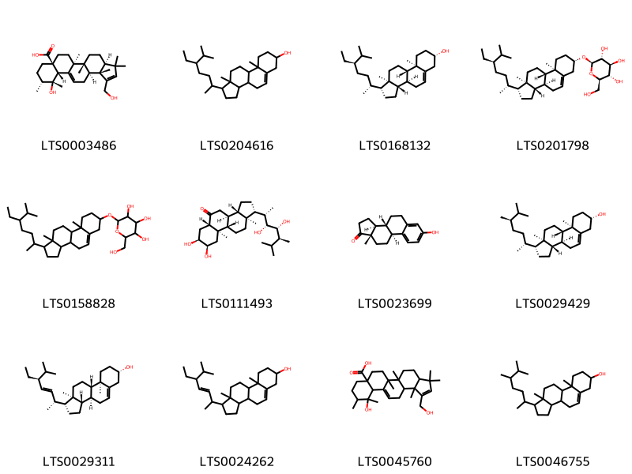{ width=100% }
    <figcaption>Hình ảnh cấu trúc hóa học của 12 hoạt chất thuộc nhóm Steroids and steroid derivatives gồm ['(3as,5ar,5bs,7as,10r,11r,11as,13as,13bs)-11-hydroxy-1-(hydroxymethyl)-3,3,5a,5b,10,11,13b-heptamethyl-3ah,4h,5h,6h,7h,8h,9h,10h,11ah,13h,13ah-cyclopenta[a]chrysene-7a-carboxylic acid (LTS0003486)', 'stigmast-5-en-3-ol, (3β)- (LTS0204616)', 'sitosterol (LTS0168132)', 'sitogluside (LTS0201798)', '2-{[1-(5-ethyl-6-methylheptan-2-yl)-9a,11a-dimethyl-1h,2h,3h,3ah,3bh,4h,6h,7h,8h,9h,9bh,10h,11h-cyclopenta[a]phenanthren-7-yl]oxy}-6-(hydroxymethyl)oxane-3,4,5-triol (LTS0158828)', 'castasterone (LTS0111493)', 'estrone (LTS0023699)', 'campesterol (LTS0029429)', 'phytosterol (LTS0029311)', 'stigmasterol (LTS0024262)', '11-hydroxy-1-(hydroxymethyl)-3,3,5a,5b,10,11,13b-heptamethyl-3ah,4h,5h,6h,7h,8h,9h,10h,11ah,13h,13ah-cyclopenta[a]chrysene-7a-carboxylic acid (LTS0045760)', 'campesterol (LTS0046755)'].</figcaption>
</figure>
### Nhóm Tetrahydrofurans
<figure markdown="span">
    { width=100% }
    <figcaption>Hình ảnh cấu trúc hóa học của 1 hoạt chất thuộc nhóm Tetrahydrofurans gồm ['linalyl oxide (LTS0065533)'].</figcaption>
</figure>
### Nhóm Tetrapyrroles and derivatives
<figure markdown="span">
    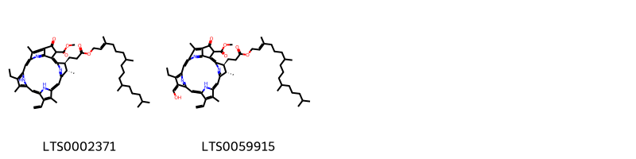{ width=100% }
    <figcaption>Hình ảnh cấu trúc hóa học của 2 hoạt chất thuộc nhóm Tetrapyrroles and derivatives gồm ['methyl (21s,22s)-16-ethenyl-11-ethyl-12,17,21,26-tetramethyl-4-oxo-22-(3-oxo-3-{[(2e)-3,7,11,15-tetramethylhexadec-2-en-1-yl]oxy}propyl)-7,23,24,25-tetraazahexacyclo[18.2.1.1⁵,⁸.1¹⁰,¹³.1¹⁵,¹⁸.0²,⁶]hexacosa-1(23),2(6),5(26),7,9,11,13,15,17,19-decaene-3-carboxylate (LTS0002371)', 'methyl (21s,22s)-16-ethenyl-11-ethyl-12-(hydroxymethylidene)-17,21,26-trimethyl-4-oxo-22-(3-oxo-3-{[(2e)-3,7,11,15-tetramethylhexadec-2-en-1-yl]oxy}propyl)-7,23,24,25-tetraazahexacyclo[18.2.1.1⁵,⁸.1¹⁰,¹³.1¹⁵,¹⁸.0²,⁶]hexacosa-1,5(26),6,8,10,13(25),14,16,18,20(23)-decaene-3-carboxylate (LTS0059915)'].</figcaption>
</figure>
### Nhóm Unsaturated hydrocarbons
<figure markdown="span">
    { width=100% }
    <figcaption>Hình ảnh cấu trúc hóa học của 1 hoạt chất thuộc nhóm Unsaturated hydrocarbons gồm ['(3e,5e)-3,7-dimethylocta-1,3,5-triene (LTS0270900)'].</figcaption>
</figure>

---

## Tác dụng dược lý

Theo tài liệu "Những cây thuốc và vị thuốc Việt Nam" - Đỗ Tất Lợi:- phát tán phong hàn 
- giải uất, hoá đờm
- an thai
- giải độc của cua cá.

Theo tài liệu quốc tế: nan

---

## Dược điển Việt Nam V

### Soi bột:
nan
<!-- Hình ảnh soi bột sẽ được tự động chèn vào đây sau -->
### Vi phẫu:
nan
<!-- Hình ảnh vi phẫu sẽ được tự động chèn vào đây sau -->
### Định tính

nan

### Định lượng

nan

### Thông tin khác 
- ** Độ ẩm: ** nan

- ** Bảo quản:** nan
## Dược điển Hồng kong

<!-- PDF sẽ được tự động chèn vào đây sau -->

---

## Y dược học cổ truyền

- **Tên vị thuốc:** nan
- **Tính vị quy kinh:** Tân, ôn. Vào kinh phế.
- **Công năng chủ trị:** Công năng: Giáng khí, tiêu đờm, bình suyễn, nhuận trưởng.
Chủ trị: Đờm suyễn, ho khí nghịch, táo bón.
- **Chú ý:** nan
- **Kiêng kỵ:** nan

