!!! abstract "Tóm tắt"
    Tô mộc (Caesalpinia sappan L., họ Fabaceae) là cây gỗ nhỏ, phân bố rộng rãi ở Đông Nam Á và Việt Nam. Trong y học cổ truyền, tô mộc được sử dụng để điều hòa kinh nguyệt, giảm đau, kháng vi trùng và kháng histamine. Thành phần hóa học chính bao gồm tinh dầu, acid galic, tannin, brazilin và sappanin. Dược liệu này có vị mặn, ngọt, hơi cay, tính bình, quy vào kinh Tỳ, Can và Tâm, có công năng hành huyết khử ứ, tiêu viêm chỉ thống

## Thông tin về thực vật

### Đặc điểm thực vật

Dược liệu **Tô Mộc** từ bộ phận **Gỗ lõi** từ loài *Caesalpinia sappan L* thuộc họ Fabaceae. Cây tô mộc là một cây cao 7-10m, thân có gai. Lá kép lông chim, gồm 12 đôi, hay hơn 12 đôi lá chét, hơi hẹp ở phía dưới tròn ở đầu, mặt trên nhẫn, mặt dưới có lông. Hoa 5 cánh màu vàng mọc thành chùm, nhị hơi lòi ra, nửa dưới chỉ nhị hơi có lông, bầu hoa phủ lông xám. Quả là một giáp dẹt hình trứng ngược dày, dai, cứng, dài từ 7-10cm, rộng từ 3,5-4cm, trong có 3-4 hạt màu nâu 

!!! info "Phân loại thực vật của *Biancaea sappan*"
    - **Kingdom:** Plantae
    - **Phylum:** Tracheophyta
    - **Order:** Fabales
    - **Family:** Fabaceae
    - **Genus:** Biancaea
    - **Species:** *Biancaea sappan*

*Tài liệu tham khảo:* "Những cây thuốc và vị thuốc Việt Nam" - Đỗ Tất Lợi

 

### Loài thay thế (Nếu có)

### Phân bố trên thế giới
**Từ vườn thực vật KEW: **: Bản địa:
Assam, Bangladesh, Campuchia, Đông Himalaya, Lào, Myanmar, Nepal, Sri Lanka, Thái Lan, Việt Nam
Di thực:
Quần đảo Bismarck, Borneo, Đảo Caroline, Trung Nam Trung Quốc, Đông Nam Trung Quốc, Hải Nam, Ấn Độ, Jawa, Đảo Sunda nhỏ hơn, Malaya, Maluku, Marianas, Mauritius, Mozambique, New Guinea, Nigeria, Philippines, Puerto Rico, Réunion, Sulawesi, Sumatera, Đài Loan, Tanzania, Uganda, Tây Himalaya, Zaïre

**Từ CSDL GIBF** nan, Réunion, Myanmar, Cambodia, unknown or invalid, Nigeria, Malaysia, Guinea, Thailand, Papua New Guinea, Brazil, Indonesia, Ghana, India, Lao People’s Democratic Republic, Panama, China, Congo, Democratic Republic of the, Japan, Sierra Leone, Fiji, Cuba, Philippines, Viet Nam, United States of America, Chinese Taipei, Sri Lanka

### Phân bố tại Việt Nam
** "Những cây thuốc và vị thuốc Việt Nam" - Đỗ Tất Lợi**: Cây mọc hoang và được trồng ở nhiều nơi trong nước ta

**Từ CSDL GIBF**: Không có ghi nhận ở Việt Nam

---

## Thông tin về dược liệu 

### Định danh

!!! info "Thông tin về tên gọi của tô mộc"
    - Dược liệu tiếng Việt: tô mộc
    - Dược liệu tiếng Trung: 苏木 (Su Mu)
    - Dược liệu tiếng Anh: Caesalpinia Sappan
    - Dược liệu latin thông dụng: Lignum Sappan
    - Dược liệu latin kiểu DĐVN: lignum sappan
    - Dược liệu latin kiểu DĐVN: None
    - Dược liệu latin kiểu thông tư: None
    - Bộ phận dùng: Gỗ lõi (Lignum)

### Mô tả dược liệu 
- **Theo dược điển Việt nam V:** 
Dược liệu có hình trụ hay nửa trụ tròn, đường kính từ 3 cm đến 12 cm, hay những thanh nhỏ, dài 10 cm hay hơn. Mặt ngoài các miếng lớn có màu đỏ vang đen đỏ nâu, có vết dao đẽo và vết cành, thường có khe nứt dọc. Mặt cắt ngang hơi bóng, vòng tuổi thấy rõ rệt (màu da cam), có thể thấy màu nâu tối, có các lỗ nhỏ (mạch gỗ). Để tách thành từng mảnh theo thớ gỗ, tủy có lỗ rõ. Các thanh được chẻ nhỏ có màu hồng đỏ. có thể có những chỗ có màu nhạt hay đậm hơn. Chất cứng, nặng, không mùi, vị hơi se.

- **Mô tả dược liệu theo thông tư chế biến dược liệu theo phương pháp cổ truyền:** 

### Chế biến 

- **Chế biến theo dược điển việt nam V**: 
Thu hoạch vào mùa thu. chặt những cây gỗ già, đẽo bỏ phần gỗ giác trắng. lấy phần gỗ đỏ bên trong, cưa thành khúc và chẻ ra thành mảnh nhỏ, phơi hoặc sấy khô. nBào chế Cưa thành đoạn dài 3 cm, chè thành mảnh nhỏ hay tán thành bột thô.

- **Chế biến theo thông tư:** 

--- 

## Thành phần hóa học

- Theo tài liệu của GS. Đỗ Tất Lợi:  Trong cây tô mộc có tanin, axit galic, chất sappanin C12H12O4, chất brasilin C16H14O5 và tinh dầu
    
- Theo cơ sở dữ liệu lotus: Từ loài *Biancaea sappan* đã phân lập và xác định được 143 hoạt chất thuộc về các nhóm Linear 1,3-diarylpropanoids, Benzopyrans, Benzene and substituted derivatives, Benzoxepines, Steroids and steroid derivatives, Neoflavonoids, Phenols, Phenol ethers, Tetralins, Naphthofurans, Organooxygen compounds, Indanes, Fatty Acyls, Prenol lipids, Aryltetralin lignans, Homoisoflavonoids, Naphthalenes, Dibenzylbutane lignans, Naphthopyrans, Coumarans, Flavonoids. 

|    | chemicalTaxonomyClassyfireClass     |   smiles_count |
|---:|:------------------------------------|---------------:|
|  0 | Aryltetralin lignans                |              2 |
|  1 | Benzene and substituted derivatives |              1 |
|  2 | Benzopyrans                         |             25 |
|  3 | Benzoxepines                        |              1 |
|  4 | Coumarans                           |              2 |
|  5 | Dibenzylbutane lignans              |              2 |
|  6 | Fatty Acyls                         |              2 |
|  7 | Flavonoids                          |              5 |
|  8 | Homoisoflavonoids                   |             31 |
|  9 | Indanes                             |              1 |
| 10 | Linear 1,3-diarylpropanoids         |              5 |
| 11 | Naphthalenes                        |              1 |
| 12 | Naphthofurans                       |              6 |
| 13 | Naphthopyrans                       |             15 |
| 14 | Neoflavonoids                       |              2 |
| 15 | Organooxygen compounds              |             11 |
| 16 | Phenol ethers                       |              5 |
| 17 | Phenols                             |              2 |
| 18 | Prenol lipids                       |              7 |
| 19 | Steroids and steroid derivatives    |              6 |
| 20 | Tetralins                           |              9 |

### Nhóm Aryltetralin lignans
<figure markdown="span">
    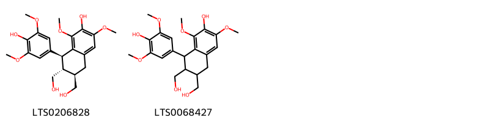{ width=100% }
    <figcaption>Hình ảnh cấu trúc hóa học của 2 hoạt chất thuộc nhóm Aryltetralin lignans gồm ['(+)-lyoniresinol (LTS0206828)', '8-(4-hydroxy-3,5-dimethoxyphenyl)-6,7-bis(hydroxymethyl)-1,3-dimethoxy-5,6,7,8-tetrahydronaphthalen-2-ol (LTS0068427)'].</figcaption>
</figure>
### Nhóm Benzene and substituted derivatives
<figure markdown="span">
    { width=100% }
    <figcaption>Hình ảnh cấu trúc hóa học của 1 hoạt chất thuộc nhóm Benzene and substituted derivatives gồm ["[1,1'-biphenyl]-2,3',4,4'-tetrol (LTS0135062)"].</figcaption>
</figure>
### Nhóm Benzopyrans
<figure markdown="span">
    { width=100% }
    <figcaption>Hình ảnh cấu trúc hóa học của 25 hoạt chất thuộc nhóm Benzopyrans gồm ['brazilin (LTS0270595)', 'brazilin (LTS0018878)', '(10s)-8-oxatetracyclo[8.7.0.0²,⁷.0¹²,¹⁷]heptadeca-2,4,6,12,14,16-hexaene-5,10,14,15-tetrol (LTS0139404)', '(10s)-10-[(1r,10s,19s)-5,14,15-trihydroxy-8,18,20-trioxapentacyclo[8.7.3.0¹,¹⁰.0²,⁷.0¹²,¹⁷]icosa-2,4,6,12,14,16-hexaen-19-yl]-8-oxatricyclo[10.4.0.0²,⁷]hexadeca-1(16),2,4,6,12,14-hexaene-5,10,14,15-tetrol (LTS0130598)', '(2s,6r)-6-[(4-hydroxyphenyl)methyl]-4,4-dimethyl-3,5,8-trioxatricyclo[7.4.0.0²,⁶]trideca-1(13),9,11-trien-11-ol (LTS0077678)', '(1s,10s)-8-oxatetracyclo[8.7.0.0²,⁷.0¹²,¹⁷]heptadeca-2,4,6,12,14,16-hexaene-5,10,14,15-tetrol (LTS0239648)', 'brazilein (LTS0085080)', '(10s)-10-[(1r,10s,19r)-5,14,15-trihydroxy-8,18,20-trioxapentacyclo[8.7.3.0¹,¹⁰.0²,⁷.0¹²,¹⁷]icosa-2,4,6,12,14,16-hexaen-19-yl]-8-oxatricyclo[10.4.0.0²,⁷]hexadeca-1(16),2,4,6,12,14-hexaene-5,10,14,15-tetrol (LTS0218661)', '14-methoxy-8-oxatetracyclo[8.7.0.0²,⁷.0¹²,¹⁷]heptadeca-2,4,6,12(17),13,15-hexaene-5,10,15-triol (LTS0115379)', '(s)-3,7-dihydroxychroman-4-one (LTS0177247)', "1',4'-dihydro-2h-spiro[1-benzofuran-3,3'-[2]benzopyran]-1',6,6',7'-tetrol (LTS0101388)", '(10r)-10-[(1s,10r,19s)-5,14,15-trihydroxy-8,18,20-trioxapentacyclo[8.7.3.0¹,¹⁰.0²,⁷.0¹²,¹⁷]icosa-2,4,6,12,14,16-hexaen-19-yl]-8-oxatricyclo[10.4.0.0²,⁷]hexadeca-1(16),2,4,6,12,14-hexaene-5,10,14,15-tetrol (LTS0246829)', '(1r,10s)-14-methoxy-8-oxatetracyclo[8.7.0.0²,⁷.0¹²,¹⁷]heptadeca-2,4,6,12(17),13,15-hexaene-5,10,15-triol (LTS0104403)', '(1r,10s)-15-methoxy-8-oxatetracyclo[8.7.0.0²,⁷.0¹²,¹⁷]heptadeca-2,4,6,12(17),13,15-hexaene-5,10,14-triol (LTS0061613)', 'caesalpiniaphenol b (LTS0044887)', '5,10,15-trihydroxy-8-oxatetracyclo[8.7.0.0²,⁷.0¹²,¹⁷]heptadeca-1(17),2,4,6,12,15-hexaen-14-one (LTS0017704)', '(1s,10s)-14-methoxy-8-oxatetracyclo[8.7.0.0²,⁷.0¹²,¹⁷]heptadeca-2,4,6,12(17),13,15-hexaene-5,10,15-triol (LTS0254818)', '4-{[(2s,6r)-11-hydroxy-4,4-dimethyl-3,5,8-trioxatricyclo[7.4.0.0²,⁶]trideca-1(13),9,11-trien-6-yl]methyl}benzene-1,2-diol (LTS0137174)', '10-{5,14,15-trihydroxy-8,18,20-trioxapentacyclo[8.7.3.0¹,¹⁰.0²,⁷.0¹²,¹⁷]icosa-2,4,6,12,14,16-hexaen-19-yl}-8-oxatricyclo[10.4.0.0²,⁷]hexadeca-1(16),2,4,6,12,14-hexaene-5,10,14,15-tetrol (LTS0031140)', '(1r,10r)-8-oxatetracyclo[8.7.0.0²,⁷.0¹²,¹⁷]heptadeca-2,4,6,12,14,16-hexaene-5,14,15-triol (LTS0015332)', "(1's,3s)-1',4'-dihydro-2h-spiro[1-benzofuran-3,3'-[2]benzopyran]-1',6,6',7'-tetrol (LTS0029495)", '4-({11-hydroxy-4,4-dimethyl-3,5,8-trioxatricyclo[7.4.0.0²,⁶]trideca-1(13),9,11-trien-6-yl}methyl)benzene-1,2-diol (LTS0090606)', '(1r,10s)-8-oxatetracyclo[8.7.0.0²,⁷.0¹²,¹⁷]heptadeca-2,4,6,12(17),13,15-hexaene-5,10,13,14-tetrol (LTS0104356)', '3,7-dihydroxychromen-4-one (LTS0050850)', '6-[(4-hydroxyphenyl)methyl]-4,4-dimethyl-3,5,8-trioxatricyclo[7.4.0.0²,⁶]trideca-1(13),9,11-trien-11-ol (LTS0050716)'].</figcaption>
</figure>
### Nhóm Benzoxepines
<figure markdown="span">
    { width=100% }
    <figcaption>Hình ảnh cấu trúc hóa học của 1 hoạt chất thuộc nhóm Benzoxepines gồm ['caesalpiniaphenol c (LTS0038258)'].</figcaption>
</figure>
### Nhóm Coumarans
<figure markdown="span">
    { width=100% }
    <figcaption>Hình ảnh cấu trúc hóa học của 2 hoạt chất thuộc nhóm Coumarans gồm ['3-{[4,5-dihydroxy-2-(hydroxymethyl)phenyl]methyl}-2h-1-benzofuran-3,6-diol (LTS0140541)', '(3s)-3-{[4,5-dihydroxy-2-(hydroxymethyl)phenyl]methyl}-2h-1-benzofuran-3,6-diol (LTS0095509)'].</figcaption>
</figure>
### Nhóm Dibenzylbutane lignans
<figure markdown="span">
    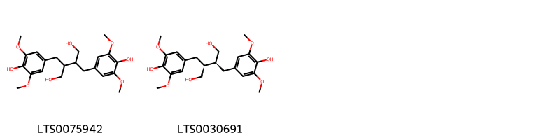{ width=100% }
    <figcaption>Hình ảnh cấu trúc hóa học của 2 hoạt chất thuộc nhóm Dibenzylbutane lignans gồm ['2,3-bis[(4-hydroxy-3,5-dimethoxyphenyl)methyl]butane-1,4-diol (LTS0075942)', '(2s,3s)-2,3-bis[(4-hydroxy-3,5-dimethoxyphenyl)methyl]butane-1,4-diol (LTS0030691)'].</figcaption>
</figure>
### Nhóm Fatty Acyls
<figure markdown="span">
    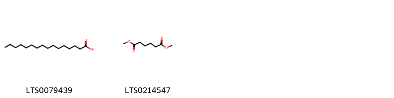{ width=100% }
    <figcaption>Hình ảnh cấu trúc hóa học của 2 hoạt chất thuộc nhóm Fatty Acyls gồm ['palmitic acid (LTS0079439)', 'dimethyl adipate (LTS0214547)'].</figcaption>
</figure>
### Nhóm Flavonoids
<figure markdown="span">
    { width=100% }
    <figcaption>Hình ảnh cấu trúc hóa học của 5 hoạt chất thuộc nhóm Flavonoids gồm ['quercetin (LTS0004651)', 'rhamnetin (LTS0209810)', 'dillenetin (LTS0023915)', 'ombuin (LTS0110319)', 'dthf (LTS0093982)'].</figcaption>
</figure>
### Nhóm Homoisoflavonoids
<figure markdown="span">
    { width=100% }
    <figcaption>Hình ảnh cấu trúc hóa học của 31 hoạt chất thuộc nhóm Homoisoflavonoids gồm ['(3e)-7-hydroxy-8-methoxy-3-[(4-methoxyphenyl)methylidene]-2h-1-benzopyran-4-one (LTS0227960)', 'sappanone a (LTS0266159)', '7-hydroxy-8-methoxy-3-[(4-methoxyphenyl)methylidene]-2h-1-benzopyran-4-one (LTS0079013)', 'sappanone a (LTS0089817)', 'sappanol (LTS0107163)', '3-[(3,4-dihydroxyphenyl)methyl]-4-methoxy-2,4-dihydro-1-benzopyran-3,7-diol (LTS0027142)', '(3r)-3-[(3,4-dihydroxyphenyl)methyl]-3,7-dihydroxy-2h-1-benzopyran-4-one (LTS0262699)', 'sappanol (LTS0207082)', '3-[(4-hydroxyphenyl)methyl]-4-methoxy-2,4-dihydro-1-benzopyran-3,7-diol (LTS0142744)', '(3r,4r)-3-[(3,4-dihydroxyphenyl)methyl]-4-methoxy-2,4-dihydro-1-benzopyran-3,7-diol (LTS0263497)', '(3r,4s)-3-[(4-hydroxyphenyl)methyl]-4-methoxy-2,4-dihydro-1-benzopyran-3,7-diol (LTS0011058)', '3-[(3,4-dihydroxyphenyl)methyl]-3,7-dihydroxy-2h-1-benzopyran-4-one (LTS0014569)', '(3r,4s)-3-[(3,4-dihydroxyphenyl)methyl]-4-methoxy-2,4-dihydro-1-benzopyran-3,7-diol (LTS0086208)', 'caesalpiniaphenol a (LTS0113571)', "3'-deoxysappanone b (LTS0065406)", '3-[(4-hydroxy-3-methoxyphenyl)methyl]-2,4-dihydro-1-benzopyran-3,4,7-triol (LTS0075142)', '(3r,4r)-3-[(4-hydroxyphenyl)methyl]-4-methoxy-2,4-dihydro-1-benzopyran-3,7-diol (LTS0089087)', '(3r,4s)-3-[(4-hydroxy-3-methoxyphenyl)methyl]-4-methoxy-2,4-dihydro-1-benzopyran-3,7-diol (LTS0074676)', "3'-deoxysappanol (LTS0207730)", '7-hydroxy-3-[(4-hydroxyphenyl)methylidene]-2h-1-benzopyran-4-one (LTS0169807)', '3-[(4-hydroxyphenyl)methyl]-2,4-dihydro-1-benzopyran-3,4,7-triol (LTS0264696)', '(3r,4r)-3-[(4-hydroxy-3-methoxyphenyl)methyl]-2,4-dihydro-1-benzopyran-3,4,7-triol (LTS0225309)', '3-[(3,4-dihydroxyphenyl)methyl]-7-hydroxy-2,3-dihydro-1-benzopyran-4-one (LTS0259560)', "3'-deoxysappanone b (LTS0128854)", '3-deoxysappanone b (LTS0244641)', '3,7-dihydroxy-3-[(4-hydroxyphenyl)methyl]-2h-1-benzopyran-4-one (LTS0018910)', '(3r,4s)-3-[(4-hydroxy-3-methoxyphenyl)methyl]-2,4-dihydro-1-benzopyran-3,4,7-triol (LTS0114268)', '3-deoxysappanone b (LTS0265099)', "3'-deoxyepisappanol (LTS0028496)", '(3r)-3-hydroxy-7-methoxy-3-[(4-methoxyphenyl)methyl]-2h-1-benzopyran-4-one (LTS0230884)', '(3e)-7-hydroxy-3-[(4-hydroxyphenyl)methylidene]-2h-1-benzopyran-4-one (LTS0019922)'].</figcaption>
</figure>
### Nhóm Indanes
<figure markdown="span">
    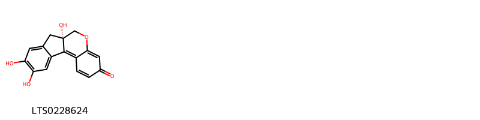{ width=100% }
    <figcaption>Hình ảnh cấu trúc hóa học của 1 hoạt chất thuộc nhóm Indanes gồm ['(10s)-10,14,15-trihydroxy-8-oxatetracyclo[8.7.0.0²,⁷.0¹²,¹⁷]heptadeca-1,3,6,12,14,16-hexaen-5-one (LTS0228624)'].</figcaption>
</figure>
### Nhóm Linear 1_3-diarylpropanoids
<figure markdown="span">
    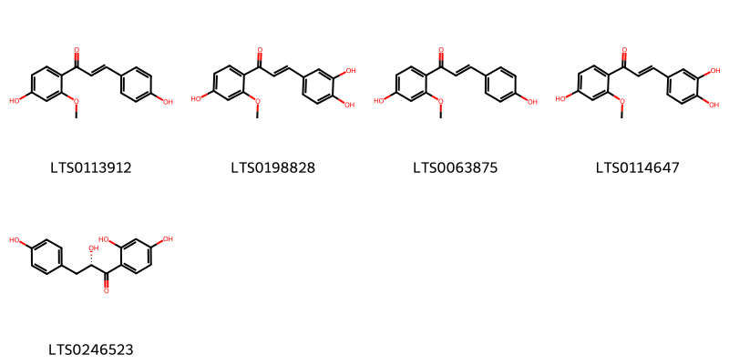{ width=100% }
    <figcaption>Hình ảnh cấu trúc hóa học của Không tìm thấy chú thích hoạt chất thuộc nhóm Linear 1_3-diarylpropanoids gồm Không tìm thấy chú thích.</figcaption>
</figure>
### Nhóm Naphthalenes
<figure markdown="span">
    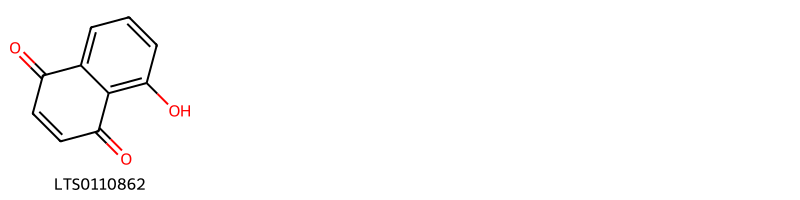{ width=100% }
    <figcaption>Hình ảnh cấu trúc hóa học của 1 hoạt chất thuộc nhóm Naphthalenes gồm ['walnut extract (LTS0110862)'].</figcaption>
</figure>
### Nhóm Naphthofurans
<figure markdown="span">
    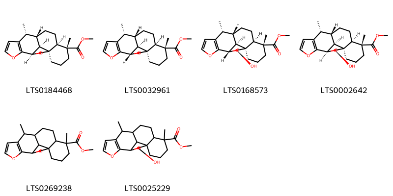{ width=100% }
    <figcaption>Hình ảnh cấu trúc hóa học của 6 hoạt chất thuộc nhóm Naphthofurans gồm ['methyl (1r,4r,10r,11s,14r,15r,19s)-10,15-dimethyl-3,6-dioxapentacyclo[9.7.1.0¹,¹⁴.0⁴,¹⁹.0⁵,⁹]nonadeca-5(9),7-diene-15-carboxylate (LTS0184468)', 'methyl (1r,4s,10r,11s,14r,15r,19s)-10,15-dimethyl-3,6-dioxapentacyclo[9.7.1.0¹,¹⁴.0⁴,¹⁹.0⁵,⁹]nonadeca-5(9),7-diene-15-carboxylate (LTS0032961)', 'methyl (1r,2s,4s,10r,11s,14r,15r,19s)-2-hydroxy-10,15-dimethyl-3,6-dioxapentacyclo[9.7.1.0¹,¹⁴.0⁴,¹⁹.0⁵,⁹]nonadeca-5(9),7-diene-15-carboxylate (LTS0168573)', 'methyl (1r,2s,4r,10r,11s,14r,15r,19s)-2-hydroxy-10,15-dimethyl-3,6-dioxapentacyclo[9.7.1.0¹,¹⁴.0⁴,¹⁹.0⁵,⁹]nonadeca-5(9),7-diene-15-carboxylate (LTS0002642)', 'methyl 10,15-dimethyl-3,6-dioxapentacyclo[9.7.1.0¹,¹⁴.0⁴,¹⁹.0⁵,⁹]nonadeca-5(9),7-diene-15-carboxylate (LTS0269238)', 'methyl 2-hydroxy-10,15-dimethyl-3,6-dioxapentacyclo[9.7.1.0¹,¹⁴.0⁴,¹⁹.0⁵,⁹]nonadeca-5(9),7-diene-15-carboxylate (LTS0025229)'].</figcaption>
</figure>
### Nhóm Naphthopyrans
<figure markdown="span">
    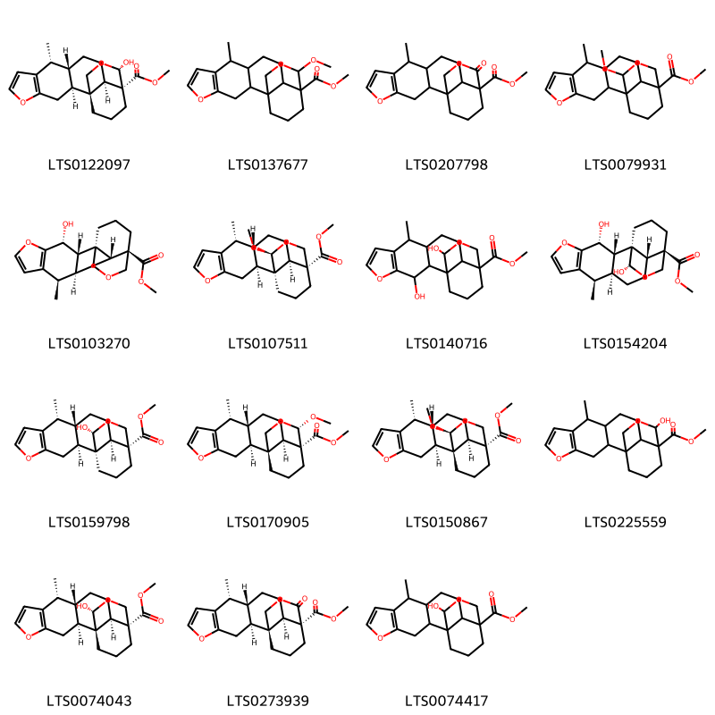{ width=100% }
    <figcaption>Hình ảnh cấu trúc hóa học của 15 hoạt chất thuộc nhóm Naphthopyrans gồm ['methyl (1s,2s,9r,10s,13r,14r,15s)-15-hydroxy-9-methyl-5,16-dioxapentacyclo[12.3.3.0¹,¹³.0²,¹⁰.0⁴,⁸]icosa-4(8),6-diene-14-carboxylate (LTS0122097)', 'methyl 15-methoxy-9-methyl-5,16-dioxapentacyclo[12.3.3.0¹,¹³.0²,¹⁰.0⁴,⁸]icosa-4(8),6-diene-14-carboxylate (LTS0137677)', 'methyl 9-methyl-15-oxo-5,16-dioxapentacyclo[12.3.3.0¹,¹³.0²,¹⁰.0⁴,⁸]icosa-4(8),6-diene-14-carboxylate (LTS0207798)', 'methyl 17-methoxy-9-methyl-5,16-dioxapentacyclo[12.3.3.0¹,¹³.0²,¹⁰.0⁴,⁸]icosa-4(8),6-diene-14-carboxylate (LTS0079931)', 'methyl (1r,2s,3r,9r,10s,13r,14r)-3-hydroxy-9-methyl-5,16-dioxapentacyclo[12.3.3.0¹,¹³.0²,¹⁰.0⁴,⁸]icosa-4(8),6-diene-14-carboxylate (LTS0103270)', 'methyl (1r,2s,9r,10s,13r,14r,17s)-17-methoxy-9-methyl-5,16-dioxapentacyclo[12.3.3.0¹,¹³.0²,¹⁰.0⁴,⁸]icosa-4(8),6-diene-14-carboxylate (LTS0107511)', 'methyl 3,17-dihydroxy-9-methyl-5,16-dioxapentacyclo[12.3.3.0¹,¹³.0²,¹⁰.0⁴,⁸]icosa-4(8),6-diene-14-carboxylate (LTS0140716)', 'methyl (1r,2s,3r,9r,10s,13r,14r,17s)-3,17-dihydroxy-9-methyl-5,16-dioxapentacyclo[12.3.3.0¹,¹³.0²,¹⁰.0⁴,⁸]icosa-4(8),6-diene-14-carboxylate (LTS0154204)', 'methyl (1r,2s,9r,10s,13r,14r,17r)-17-hydroxy-9-methyl-5,16-dioxapentacyclo[12.3.3.0¹,¹³.0²,¹⁰.0⁴,⁸]icosa-4(8),6-diene-14-carboxylate (LTS0159798)', 'methyl (1s,2s,9r,10s,13r,14r,15s)-15-methoxy-9-methyl-5,16-dioxapentacyclo[12.3.3.0¹,¹³.0²,¹⁰.0⁴,⁸]icosa-4(8),6-diene-14-carboxylate (LTS0170905)', 'methyl (1s,2s,9r,10s,13r,14r,17s)-17-methoxy-9-methyl-5,16-dioxapentacyclo[12.3.3.0¹,¹³.0²,¹⁰.0⁴,⁸]icosa-4(8),6-diene-14-carboxylate (LTS0150867)', 'methyl 15-hydroxy-9-methyl-5,16-dioxapentacyclo[12.3.3.0¹,¹³.0²,¹⁰.0⁴,⁸]icosa-4(8),6-diene-14-carboxylate (LTS0225559)', 'methyl (1s,2s,9r,10s,13r,14r,17r)-17-hydroxy-9-methyl-5,16-dioxapentacyclo[12.3.3.0¹,¹³.0²,¹⁰.0⁴,⁸]icosa-4(8),6-diene-14-carboxylate (LTS0074043)', 'methyl (1s,2s,9r,10s,13r,14s)-9-methyl-15-oxo-5,16-dioxapentacyclo[12.3.3.0¹,¹³.0²,¹⁰.0⁴,⁸]icosa-4(8),6-diene-14-carboxylate (LTS0273939)', 'methyl 17-hydroxy-9-methyl-5,16-dioxapentacyclo[12.3.3.0¹,¹³.0²,¹⁰.0⁴,⁸]icosa-4(8),6-diene-14-carboxylate (LTS0074417)'].</figcaption>
</figure>
### Nhóm Neoflavonoids
<figure markdown="span">
    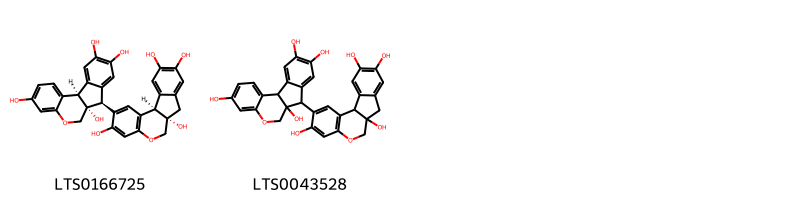{ width=100% }
    <figcaption>Hình ảnh cấu trúc hóa học của 2 hoạt chất thuộc nhóm Neoflavonoids gồm ['(1r,10s,11s)-11-[(1r,10s)-5,10,14,15-tetrahydroxy-8-oxatetracyclo[8.7.0.0²,⁷.0¹²,¹⁷]heptadeca-2(7),3,5,12,14,16-hexaen-4-yl]-8-oxatetracyclo[8.7.0.0²,⁷.0¹²,¹⁷]heptadeca-2,4,6,12,14,16-hexaene-5,10,14,15-tetrol (LTS0166725)', '11-{5,10,14,15-tetrahydroxy-8-oxatetracyclo[8.7.0.0²,⁷.0¹²,¹⁷]heptadeca-2(7),3,5,12,14,16-hexaen-4-yl}-8-oxatetracyclo[8.7.0.0²,⁷.0¹²,¹⁷]heptadeca-2,4,6,12,14,16-hexaene-5,10,14,15-tetrol (LTS0043528)'].</figcaption>
</figure>
### Nhóm Organooxygen compounds
<figure markdown="span">
    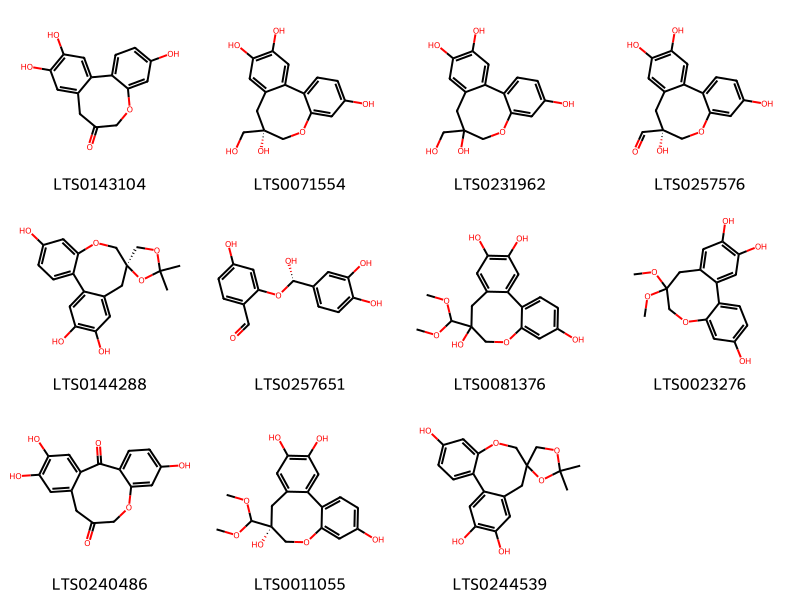{ width=100% }
    <figcaption>Hình ảnh cấu trúc hóa học của 11 hoạt chất thuộc nhóm Organooxygen compounds gồm ['protosappanin a (LTS0143104)', '(10s)-10-(hydroxymethyl)-8-oxatricyclo[10.4.0.0²,⁷]hexadeca-1(16),2,4,6,12,14-hexaene-5,10,14,15-tetrol (LTS0071554)', '10-(hydroxymethyl)-8-oxatricyclo[10.4.0.0²,⁷]hexadeca-1(16),2,4,6,12,14-hexaene-5,10,14,15-tetrol (LTS0231962)', '(10r)-5,10,14,15-tetrahydroxy-8-oxatricyclo[10.4.0.0²,⁷]hexadeca-1(16),2,4,6,12,14-hexaene-10-carbaldehyde (LTS0257576)', "(2s)-5,5-dimethyl-11'-oxaspiro[1,4-dioxolane-2,9'-tricyclo[10.4.0.0²,⁷]hexadecane]-1'(16'),2',4',6',12',14'-hexaene-4',5',14'-triol (LTS0144288)", 'caesalpiniaphenol d (LTS0257651)', '10-(dimethoxymethyl)-8-oxatricyclo[10.4.0.0²,⁷]hexadeca-1(16),2,4,6,12,14-hexaene-5,10,14,15-tetrol (LTS0081376)', '10,10-dimethoxy-8-oxatricyclo[10.4.0.0²,⁷]hexadeca-1(16),2,4,6,12,14-hexaene-5,14,15-triol (LTS0023276)', '6,15,16-trihydroxy-9-oxatricyclo[11.4.0.0³,⁸]heptadeca-1(17),3,5,7,13,15-hexaene-2,11-dione (LTS0240486)', '(10r)-10-(dimethoxymethyl)-8-oxatricyclo[10.4.0.0²,⁷]hexadeca-1(16),2,4,6,12,14-hexaene-5,10,14,15-tetrol (LTS0011055)', "5,5-dimethyl-11'-oxaspiro[1,4-dioxolane-2,9'-tricyclo[10.4.0.0²,⁷]hexadecane]-1'(16'),2',4',6',12',14'-hexaene-4',5',14'-triol (LTS0244539)"].</figcaption>
</figure>
### Nhóm Phenol ethers
<figure markdown="span">
    { width=100% }
    <figcaption>Hình ảnh cấu trúc hóa học của 5 hoạt chất thuộc nhóm Phenol ethers gồm ['(10r)-10-(hydroxymethyl)-14-methoxy-8-oxatricyclo[10.4.0.0²,⁷]hexadeca-1(12),2,4,6,13,15-hexaene-5,10,15-triol (LTS0071103)', "5'-methoxy-5,5-dimethyl-11'-oxaspiro[1,4-dioxolane-2,9'-tricyclo[10.4.0.0²,⁷]hexadecane]-1'(16'),2'(7'),3',5',12',14'-hexaene-4',14'-diol (LTS0224848)", '(10s)-10-(hydroxymethyl)-14-methoxy-8-oxatricyclo[10.4.0.0²,⁷]hexadeca-1(12),2,4,6,13,15-hexaene-5,10,15-triol (LTS0230772)', "(2s)-5'-methoxy-5,5-dimethyl-11'-oxaspiro[1,4-dioxolane-2,9'-tricyclo[10.4.0.0²,⁷]hexadecane]-1'(16'),2'(7'),3',5',12',14'-hexaene-4',14'-diol (LTS0178830)", '10-(hydroxymethyl)-14-methoxy-8-oxatricyclo[10.4.0.0²,⁷]hexadeca-1(12),2,4,6,13,15-hexaene-5,10,15-triol (LTS0133589)'].</figcaption>
</figure>
### Nhóm Phenols
<figure markdown="span">
    { width=100% }
    <figcaption>Hình ảnh cấu trúc hóa học của 2 hoạt chất thuộc nhóm Phenols gồm ['6-[(4-hydroxy-3-methoxyphenyl)methyl]-4,4-dimethyl-3,5,8-trioxatricyclo[7.4.0.0²,⁶]trideca-1(13),9,11-trien-11-ol (LTS0035833)', '(2s,6r)-6-[(4-hydroxy-3-methoxyphenyl)methyl]-4,4-dimethyl-3,5,8-trioxatricyclo[7.4.0.0²,⁶]trideca-1(13),9,11-trien-11-ol (LTS0062314)'].</figcaption>
</figure>
### Nhóm Prenol lipids
<figure markdown="span">
    { width=100% }
    <figcaption>Hình ảnh cấu trúc hóa học của 7 hoạt chất thuộc nhóm Prenol lipids gồm ['methyl 11b-formyl-4,7-dimethyl-1h,2h,3h,4ah,5h,6h,6ah,7h,11h,11ah-phenanthro[3,2-b]furan-4-carboxylate (LTS0125569)', '4,4-dimethyl (4as,6as,7r,11as,11bs)-11b-formyl-4a-hydroxy-7-methyl-1h,2h,3h,5h,6h,6ah,7h,11h,11ah-phenanthro[3,2-b]furan-4,4-dicarboxylate (LTS0038515)', '4,4-dimethyl 11b-formyl-4a-hydroxy-7-methyl-1h,2h,3h,5h,6h,6ah,7h,11h,11ah-phenanthro[3,2-b]furan-4,4-dicarboxylate (LTS0144326)', '4,4-dimethyl (4ar,6as,7r,11as,11bs)-11b-formyl-7-methyl-1h,2h,3h,4ah,5h,6h,6ah,7h,11h,11ah-phenanthro[3,2-b]furan-4,4-dicarboxylate (LTS0076417)', 'methyl (4r,4ar,6as,7r,11as,11bs)-4,11b-diformyl-7-methyl-1h,2h,3h,4ah,5h,6h,6ah,7h,11h,11ah-phenanthro[3,2-b]furan-4-carboxylate (LTS0275911)', 'methyl 4,11b-diformyl-7-methyl-1h,2h,3h,4ah,5h,6h,6ah,7h,11h,11ah-phenanthro[3,2-b]furan-4-carboxylate (LTS0088023)', 'methyl (4r,4ar,6as,7r,11as,11bs)-11b-formyl-4,7-dimethyl-1h,2h,3h,4ah,5h,6h,6ah,7h,11h,11ah-phenanthro[3,2-b]furan-4-carboxylate (LTS0036764)'].</figcaption>
</figure>
### Nhóm Steroids and steroid derivatives
<figure markdown="span">
    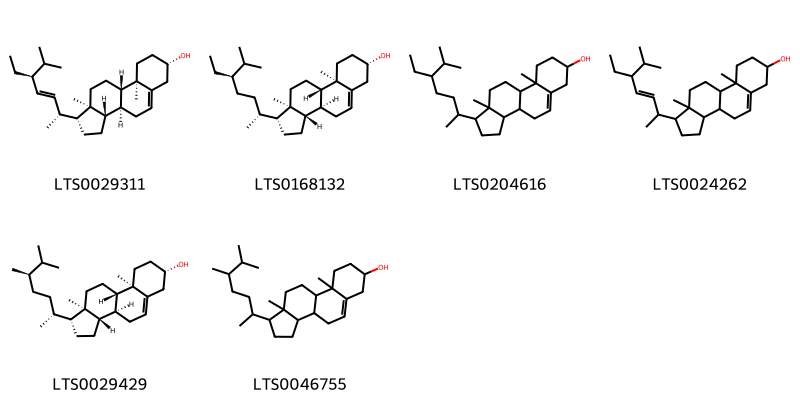{ width=100% }
    <figcaption>Hình ảnh cấu trúc hóa học của 6 hoạt chất thuộc nhóm Steroids and steroid derivatives gồm ['phytosterol (LTS0029311)', 'sitosterol (LTS0168132)', 'stigmast-5-en-3-ol, (3β)- (LTS0204616)', 'stigmasterol (LTS0024262)', 'campesterol (LTS0029429)', 'campesterol (LTS0046755)'].</figcaption>
</figure>
### Nhóm Tetralins
<figure markdown="span">
    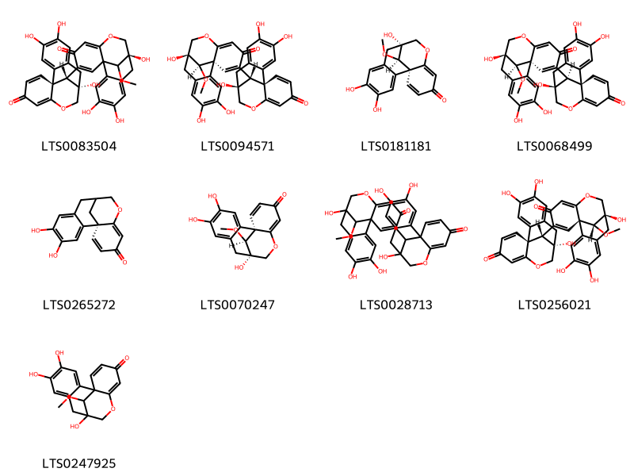{ width=100% }
    <figcaption>Hình ảnh cấu trúc hóa học của 9 hoạt chất thuộc nhóm Tetralins gồm ['(9r)-4,5,9-trihydroxy-17-methoxy-15-[(1s,9s,17r)-4,5,9-trihydroxy-14-oxo-11-oxatetracyclo[7.7.1.0¹,¹².0²,⁷]heptadeca-2,4,6,12,15-pentaen-17-yl]-11-oxatetracyclo[7.7.1.0¹,¹².0²,⁷]heptadeca-2,4,6,12,15-pentaen-14-one (LTS0083504)', '(1s,9s,17r)-4,5,9-trihydroxy-17-methoxy-15-[(1r,9s,17s)-4,5,9-trihydroxy-14-oxo-11-oxatetracyclo[7.7.1.0¹,¹².0²,⁷]heptadeca-2,4,6,12,15-pentaen-17-yl]-11-oxatetracyclo[7.7.1.0¹,¹².0²,⁷]heptadeca-2,4,6,12,15-pentaen-14-one (LTS0094571)', '(1s,9r,17r)-4,5,9-trihydroxy-17-methoxy-11-oxatetracyclo[7.7.1.0¹,¹².0²,⁷]heptadeca-2,4,6,12,15-pentaen-14-one (LTS0181181)', '(1s,9s,17r)-4,5,9-trihydroxy-17-methoxy-15-[(1r,9s,17r)-4,5,9-trihydroxy-14-oxo-11-oxatetracyclo[7.7.1.0¹,¹².0²,⁷]heptadeca-2,4,6,12,15-pentaen-17-yl]-11-oxatetracyclo[7.7.1.0¹,¹².0²,⁷]heptadeca-2,4,6,12,15-pentaen-14-one (LTS0068499)', '(1s)-4,5-dihydroxy-11-oxatetracyclo[7.7.1.0¹,¹².0²,⁷]heptadeca-2,4,6,12,15-pentaen-14-one (LTS0265272)', '(1r,9s,17s)-4,5,9-trihydroxy-17-methoxy-11-oxatetracyclo[7.7.1.0¹,¹².0²,⁷]heptadeca-2,4,6,12,15-pentaen-14-one (LTS0070247)', '4,5,9-trihydroxy-17-methoxy-15-{4,5,9-trihydroxy-14-oxo-11-oxatetracyclo[7.7.1.0¹,¹².0²,⁷]heptadeca-2,4,6,12,15-pentaen-17-yl}-11-oxatetracyclo[7.7.1.0¹,¹².0²,⁷]heptadeca-2,4,6,12,15-pentaen-14-one (LTS0028713)', '(1s,9r,17r)-4,5,9-trihydroxy-17-methoxy-15-[(1s,9s,17r)-4,5,9-trihydroxy-14-oxo-11-oxatetracyclo[7.7.1.0¹,¹².0²,⁷]heptadeca-2,4,6,12,15-pentaen-17-yl]-11-oxatetracyclo[7.7.1.0¹,¹².0²,⁷]heptadeca-2,4,6,12,15-pentaen-14-one (LTS0256021)', '4,5,9-trihydroxy-17-methoxy-11-oxatetracyclo[7.7.1.0¹,¹².0²,⁷]heptadeca-2,4,6,12,15-pentaen-14-one (LTS0247925)'].</figcaption>
</figure>

---

## Tác dụng dược lý

Theo tài liệu "Những cây thuốc và vị thuốc Việt Nam" - Đỗ Tất Lợi:- Hành huyết
- Thông ứ trệ
- Chỉ thống
- Điều hòa kinh nguyệt
- Kháng vi trùng
- Kháng histamine

Theo tài liệu quốc tế: To promote blood circulation and remove blood stasis, and to promote subsidence of swelling and relieve pain.

---

## Dược điển Việt Nam V

### Soi bột:

Màu cam, nhiều mảnh mạch điểm, kích thước thay đổi. Mảnh mô mềm tủy tế bào có thành mỏng, đôi khi thành hơi hóa gỗ, có lỗ thủng. Sợi dài khoảng 400 µm, rộng khoảng 12 µm, thành dày, khoang hẹp, đứng riêng lẻ hay chụm lại thành từng bó. Tia ruột hợp thành góc với bó sợi, tạo thành các ô vuông mảnh mô mềm thành dày hóa gỗ, ít thấy tinh thể calci oxalat.

<!-- Hình ảnh soi bột sẽ được tự động chèn vào đây sau -->
### Vi phẫu:

Mặt cắt ngang có các tia gồm 1 hàng đến 2 hàng tế bào rộng. Mạch gỗ tròn, đường kính tới 160 µm, thường chứa chất màu vàng nâu hay nâu đỏ. Sợi gỗ thường có hình nhiều cạnh, thành rất dày. Tế bào mô mềm trong gỗ có thành dày hóa gỗ, một số chứa tinh thể calci oxalat hình lăng trụ. Mô mềm tủy gồm các tế bào hình nhiều cạnh không đều, thành hơi hóa gỗ, có lỗ.

<!-- Hình ảnh vi phẫu sẽ được tự động chèn vào đây sau -->
### Định tính

A.Lấy một miếng dược liệu, nhỏ dung dịch calci hydroxyd bão hòa (TT) lên bề mặt, xuất hiện màu đỏ thẫm. B. Lấy 10 g bột dược liệu, thêm 50 ml nước, đun cách thủy 30 min, thỉnh thoảng lắc đều, lọc. Dịch lọc có màu đỏ da cam, quan sát dưới ánh sáng tử ngoại (366 nm) có ánh lọc vàng. Lấy 5 ml dịch lọc, thêm 2 giọt dung dịch natri hydroxyd 10 % (TT) xuất hiện màu đỏ thắm, quan sát dưới ánh sáng tử ngoại ở bước sóng 366 nm, dung dịch có màu xanh lơ. Khi acid hóa dung dịch này bằng dung dịch acid hydrodoric 10 % (TT) sẽ có màu da cam, quan sát dưới ánh sáng tử ngoại ở bước sóng 366 nm sẽ có ánh lọc vàng, C. Phương pháp sắc ký lớp mỏng (Phụ lục 5.4). Bản mỏng: Silica gel G. Dung môi khai triển: Clorofom – aceton – acidformic (8:4: 1). Dung dich thử. Lấy 1 g bột dược liệu, thêm 15 ml ethanol 95 % (TT), siêu âm trong 30 min. Lọc, lấy dịch lọc cô trên cách thủy tới can. Hòa lại cắn trong 2 ml ethanol 95 % (TT), được dung dịch thử. Dung dịch đối chiếu: Lấy 1 g bột Tô mộc (mẫu chuẩn), chiết như mô tả ở phần Dung dịch thử. Cách tiến hành: Chấm riêng biệt lên bản mỏng 20 µl mỗi dung dịch trên. Sau khi khai triển, để khô bản mỏng, phun dung dịch kali hydroxyd 3 % trong methanol (TT) rồi quan sát dưới ánh sáng tử ngoại ở bước sóng 366 nm. Trên sắc ký đồ của dung dịch thử phải có các vết cùng giá trị Rf và cùng màu sắc với các vết trên sắc ký đồ của dung dịch đối chiếu.

### Định lượng

Chất chiết được trong dược liệu Không được dưới 8,5 °0 tính theo dược liệu khô kiệt. Tiến hành theo phương pháp chiết nóng (Phụ lục 12.10). Dùng ethanol 95 % (TT) làm dung môi.

### Thông tin khác 
- ** Độ ẩm: ** 
Không quá 11,0 % (Phụ lục 9.6, 1 g, 105 °C. 5 h).

- ** Bảo quản:** 
Để nơi khô.

## Dược điển Hồng kong

<!-- PDF sẽ được tự động chèn vào đây sau -->

---

## Y dược học cổ truyền

- **Tên vị thuốc:** Tô mộc
- **Tính vị quy kinh:** Cam, hàm, bình. Quy vào các kinh tâm, can, tỳ.
- **Công năng chủ trị:** Công năng: Hành huyết khử ứ, tiêu viêm chỉ thông.

Chủ trị: Thống kinh, bế kinh, sàn hậu huyết ứ, đau nhói ngực bụng, sưng đau do sang chấn, nhiệt lỵ.
- **Chú ý:** 
- **Kiêng kỵ:** 
Phụ nữ có thai, huvết hư không ứ trệ thì không nên dùngnn

