!!! abstract "Tóm tắt"
    Tỏi (Allium sativum L.) thuộc họ Hành, phân bố rộng rãi trên khắp thế giới, đặc biệt ở các vùng nhiệt đới và ôn đới. Tỏi đã được sử dụng từ lâu đời trong dân gian và y học cổ truyền như một vị thuốc có nhiều tác dụng dược lý quan trọng như kháng khuẩn, kháng viêm, hạ cholesterol và tăng cường miễn dịch. Thành phần chính của tỏi gồm các hợp chất chứa lưu huỳnh như allicin, alliin và ajoene

## Thông tin về thực vật

### Đặc điểm thực vật

Dược liệu **Tỏi (Củ)** từ bộ phận **nan** từ loài *Allium sativum L.* thuộc họ Amaryllidaceae. Tập hợp các lá dự trữ (hành) quen gọi là củ gần hình cầu, đường kính 3 cm đến 5 cm, chứa khoảng 8 đến 20 hành con. Bao xung quanh củ gồm 2 đến 5 lớp lá vẩy trắng mỏng, do các bẹ lá trước tạo thành, gắn vào một đế hình cầu dẹt (thân hành). Các hành con hình trứng, 3 mặt đến 4 mặt, đỉnh nhọn, đế cụt. Mỗi hành con được phủ những lớp lá vẩy trắng và một lớp biểu bì màu trắng hồng dễ tách khỏi phần rắn bên trong. Các hành con xếp thành lớp quanh một sợi dài, đường kính 1 mm đến 3 mm mọc từ giữa đế. Phần rắn bên trong của các hành con chứa nhiều nước, mùi thơm, vị hăng và bền 

!!! info "Phân loại thực vật của *Allium sativum*"
    - **Kingdom:** Plantae
    - **Phylum:** Tracheophyta
    - **Order:** Asparagales
    - **Family:** Amaryllidaceae
    - **Genus:** Allium
    - **Species:** *Allium sativum*

*Tài liệu tham khảo:* Tài liệu khác

 

### Loài thay thế (Nếu có)

### Phân bố trên thế giới
**Từ vườn thực vật KEW: **: Bản địa:  Iran, Kazakhstan, Kirgizstan, Tadzhikistan, Turkmenistan, Uzbekistan
Di thực: Albania, Algeria, Amur, Austria, Baleares, Baltic States, Bangladesh, Belarus, Bulgaria, Cambodia, Canary Is., Central European Russia, China North-Central, China South-Central, China Southeast, Corse, Cuba, Czechoslovakia, Dominican Republic, East European Russia, Egypt, Ethiopia, France, Galápagos, Germany, Great Britain, Greece, Haiti, Hungary, Illinois, India, Inner Mongolia, Iraq, Ireland, Italy, Jamaica, Kentucky, Korea, Leeward Is., Libya, Mexico Central, Mexico Northwest, Mexico Southeast, Mexico Southwest, Morocco, New York, North European Russia, Northwest European Russia, Pakistan, Poland, Primorye, Puerto Rico, Romania, Sardegna, Seychelles, Sicilia, South European Russia, Spain, Switzerland, Tennessee, Thailand, Trinidad-Tobago, Tunisia, Turkey, Ukraine, Vermont, Wisconsin, Yugoslavia

**Từ CSDL GIBF** nan, Poland, Iran (Islamic Republic of), Spain, Austria, Australia, Norway, Germany, Latvia, Pakistan, Algeria, Romania, Ukraine, India, Sweden, Mexico, Hungary, Italy, Belarus, Ecuador, United Kingdom of Great Britain and Northern Ireland, Türkiye, Estonia, Russian Federation, Czechia, Finland, Switzerland, United States of America, France, Kazakhstan, Canada

### Phân bố tại Việt Nam
** Tài liệu khác**: Tỏi được trồng khắp các vùng ở Việt Nam

**Từ CSDL GIBF**: Không có ghi nhận ở Việt Nam

---

## Thông tin về dược liệu 

### Định danh

!!! info "Thông tin về tên gọi của nan"
    - Dược liệu tiếng Việt: nan
    - Dược liệu tiếng Trung: nan (nan)
    - Dược liệu tiếng Anh: nan
    - Dược liệu latin thông dụng: nan
    - Dược liệu latin kiểu DĐVN: bulbus allii
    - Dược liệu latin kiểu DĐVN: nan
    - Dược liệu latin kiểu thông tư: nan
    - Bộ phận dùng: nan (nan)

### Mô tả dược liệu 
- **Theo dược điển Việt nam V:** nan

- **Mô tả dược liệu theo thông tư chế biến dược liệu theo phương pháp cổ truyền:** nan

### Chế biến 

- **Chế biến theo dược điển việt nam V**: nan

- **Chế biến theo thông tư:** nan

--- 

## Thành phần hóa học

- Theo tài liệu của GS. Đỗ Tất Lợi:  (1) Trong tỏi có một ít iốt và tinh dầu, alixin C6H10OS2, aliin
(2) Tên hoạt chất biomaker: Allicin, Alliin, Ajoene
    
- Theo cơ sở dữ liệu lotus: Từ loài *Allium sativum* đã phân lập và xác định được 172 hoạt chất thuộc về các nhóm Sulfoxides, Organic trisulfides, Indoles and derivatives, Thiosulfinic acid esters, Organic phosphoric acids and derivatives, Organic disulfides, Pyrans, Organic thiosulfuric acids and derivatives, Organic sulfonic acids and derivatives, Steroids and steroid derivatives, Sulfonyls, Glycerolipids, Cinnamic acids and derivatives, Organic oxoanionic compounds, Purine nucleosides, Allyl sulfur compounds, Organooxygen compounds, Triphenyl compounds, Fatty Acyls, Sphingolipids, Prenol lipids, Organic sulfuric acids and derivatives, Furanoid lignans, Dibenzylbutane lignans, Carboxylic acids and derivatives, Flavonoids. 

|    | chemicalTaxonomyClassyfireClass            |   smiles_count |
|---:|:-------------------------------------------|---------------:|
|  0 |                                            |              9 |
|  1 | Allyl sulfur compounds                     |             16 |
|  2 | Carboxylic acids and derivatives           |             57 |
|  3 | Cinnamic acids and derivatives             |              3 |
|  4 | Dibenzylbutane lignans                     |              2 |
|  5 | Fatty Acyls                                |              6 |
|  6 | Flavonoids                                 |              6 |
|  7 | Furanoid lignans                           |              3 |
|  8 | Glycerolipids                              |              1 |
|  9 | Indoles and derivatives                    |              2 |
| 10 | Organic disulfides                         |              5 |
| 11 | Organic oxoanionic compounds               |              1 |
| 12 | Organic phosphoric acids and derivatives   |              1 |
| 13 | Organic sulfonic acids and derivatives     |              1 |
| 14 | Organic sulfuric acids and derivatives     |              2 |
| 15 | Organic thiosulfuric acids and derivatives |              1 |
| 16 | Organic trisulfides                        |              3 |
| 17 | Organooxygen compounds                     |              9 |
| 18 | Prenol lipids                              |              3 |
| 19 | Purine nucleosides                         |              2 |
| 20 | Pyrans                                     |              1 |
| 21 | Sphingolipids                              |              9 |
| 22 | Steroids and steroid derivatives           |             12 |
| 23 | Sulfonyls                                  |              1 |
| 24 | Sulfoxides                                 |              4 |
| 25 | Thiosulfinic acid esters                   |              8 |
| 26 | Triphenyl compounds                        |              1 |

### Nhóm 
<figure markdown="span">
    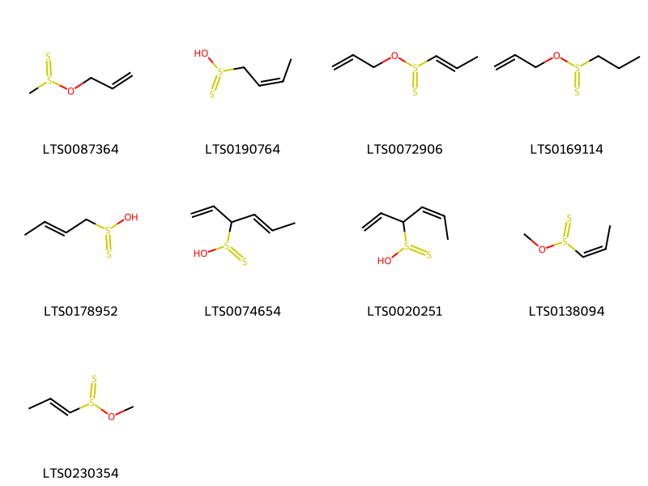{ width=100% }
    <figcaption>Hình ảnh cấu trúc hóa học của 9 hoạt chất thuộc nhóm  gồm ['[(prop-2-en-1-yloxy)-λ⁴-disulfanyl]methane (LTS0087364)', '(2z)-but-2-en-1-yl-λ⁴-disulfanylol (LTS0190764)', '(1e)-1-[(prop-2-en-1-yloxy)-λ⁴-disulfanyl]prop-1-ene (LTS0072906)', '1-[(prop-2-en-1-yloxy)-λ⁴-disulfanyl]propane (LTS0169114)', '(2e)-but-2-en-1-yl-λ⁴-disulfanylol (LTS0178952)', '(4e)-hexa-1,4-dien-3-yl-λ⁴-disulfanylol (LTS0074654)', '(4z)-hexa-1,4-dien-3-yl-λ⁴-disulfanylol (LTS0020251)', '(1z)-1-(methoxy-λ⁴-disulfanyl)prop-1-ene (LTS0138094)', '(1e)-1-(methoxy-λ⁴-disulfanyl)prop-1-ene (LTS0230354)'].</figcaption>
</figure>
### Nhóm Allyl sulfur compounds
<figure markdown="span">
    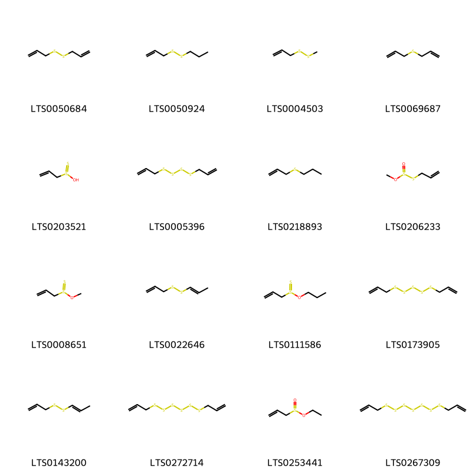{ width=100% }
    <figcaption>Hình ảnh cấu trúc hóa học của 16 hoạt chất thuộc nhóm Allyl sulfur compounds gồm ['garlicin (LTS0050684)', 'allyl propyl disulfide (LTS0050924)', 'allyl methyl disulfide (LTS0004503)', 'oil garlic (LTS0069687)', 'prop-2-en-1-yl-λ⁴-disulfanylol (LTS0203521)', 'diallyl tetrasulfide (LTS0005396)', '3-(propylthio)propene (LTS0218893)', '3-[(methoxysulfinyl)sulfanyl]prop-1-ene (LTS0206233)', '3-(methoxy-λ⁴-disulfanyl)prop-1-ene (LTS0008651)', '3-[(1e)-prop-1-en-1-yldisulfanyl]prop-1-ene (LTS0022646)', '3-(propoxy-λ⁴-disulfanyl)prop-1-ene (LTS0111586)', 'allyl pentasulfide (LTS0173905)', '3-(prop-1-en-1-yldisulfanyl)prop-1-ene (LTS0143200)', 'bis(prop-2-en-1-yl)hexasulfane (LTS0272714)', 'ethyl prop-2-ene-1-sulfinate (LTS0253441)', 'bis(prop-2-en-1-yl)heptasulfane (LTS0267309)'].</figcaption>
</figure>
### Nhóm Carboxylic acids and derivatives
<figure markdown="span">
    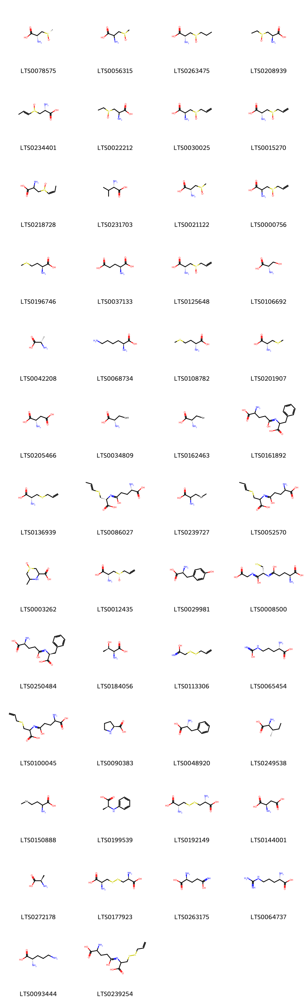{ width=100% }
    <figcaption>Hình ảnh cấu trúc hóa học của 57 hoạt chất thuộc nhóm Carboxylic acids and derivatives gồm ['(2r)-2-amino-3-[(s)-methanesulfinyl]propanoic acid (LTS0078575)', '2-amino-3-methanesulfinylpropanoic acid (LTS0056315)', '(2r)-2-amino-3-(propane-1-sulfinyl)propanoic acid (LTS0263475)', '(2r)-2-amino-3-(ethanesulfinyl)propanoic acid (LTS0208939)', 'isoalliin (LTS0234401)', '2-amino-3-(ethanesulfinyl)propanoic acid (LTS0022212)', '(2s)-2-amino-3-(prop-2-ene-1-sulfinyl)propanoic acid (LTS0030025)', 'alliin (LTS0015270)', '2-amino-3-[(1z)-prop-1-ene-1-sulfinyl]propanoic acid (LTS0218728)', 'l-valine (LTS0231703)', '(2r)-2-amino-3-methanesulfinylpropanoic acid (LTS0021122)', 'allin (LTS0000756)', 'l-methionine (LTS0196746)', 'l-glutamic acid (LTS0037133)', '(2r)-2-amino-3-[(r)-prop-2-ene-1-sulfinyl]propanoic acid (LTS0125648)', 'l-serine (LTS0106692)', 'l-alanine (LTS0042208)', 'l-lysine (LTS0068734)', 'd-methionine (LTS0108782)', 's-methylcysteine (LTS0201907)', 'l-aspartic acid (LTS0205466)', 'l-selenocysteine (LTS0034809)', 'selenocysteine (LTS0162463)', '2-amino-4-[(1-carboxy-2-phenylethyl)-c-hydroxycarbonimidoyl]butanoic acid (LTS0161892)', 's-allylcysteine (LTS0136939)', '(2s)-2-amino-4-{[(1r)-1-carboxy-2-[(1e)-prop-1-en-1-ylsulfanyl]ethyl]-c-hydroxycarbonimidoyl}butanoic acid (LTS0086027)', 'se-methylselenocysteine (LTS0239727)', '2-amino-4-{[1-carboxy-2-(prop-1-en-1-ylsulfanyl)ethyl]-c-hydroxycarbonimidoyl}butanoic acid (LTS0052570)', '3-carboxy-5-methylthiomorpholin-1-ium-1-olate (LTS0003262)', 'alliin (LTS0012435)', 'l-tyrosine (LTS0029981)', '(2s)-2-amino-4-{[(1r)-1-(carboxymethyl-c-hydroxycarbonimidoyl)-2-sulfanylethyl]-c-hydroxycarbonimidoyl}butanoic acid (LTS0008500)', '(2s)-2-amino-4-{[(1s)-1-carboxy-2-phenylethyl]-c-hydroxycarbonimidoyl}butanoic acid (LTS0250484)', 'l-threonine (LTS0184056)', '2-(prop-2-en-1-yldisulfanyl)ethanimidic acid (LTS0113306)', 'l(+)-citrulline (LTS0065454)', '2-amino-4-{[1-carboxy-2-(prop-2-en-1-ylsulfanyl)ethyl]-c-hydroxycarbonimidoyl}butanoic acid (LTS0100045)', 'l-proline (LTS0090383)', 'd-phenylalanine (LTS0048920)', 'l-isoleucine (LTS0249538)', '(+,-)-selenomethionine (LTS0150888)', '(2s)-2-(phenylamino)propanoic acid (LTS0199539)', 'l-cystine (LTS0192149)', 'd-aspartic acid (LTS0144001)', 'd-alanine (LTS0272178)', 'd-cystine (LTS0177923)', 'l glutamine (LTS0263175)', 'l-arginine (LTS0064737)', 'l-ornithine (LTS0093444)', '2-amino-4-{[1-carboxy-2-(prop-2-en-1-yldisulfanyl)ethyl]-c-hydroxycarbonimidoyl}butanoic acid (LTS0239254)', 'abu (LTS0208699)', 'aspartamate (LTS0243014)', '(2s)-2-amino-4-{[(1r)-1-carboxy-2-(prop-2-en-1-ylsulfanyl)ethyl]-c-hydroxycarbonimidoyl}butanoic acid (LTS0055613)', '(2s)-2-amino-4-{[(1r)-1-carboxy-2-(prop-2-en-1-yldisulfanyl)ethyl]-c-hydroxycarbonimidoyl}butanoic acid (LTS0019976)', 'l-selenomethionine (LTS0227125)', 'l-leucine (LTS0113423)', 'l-histidine (LTS0094081)'].</figcaption>
</figure>
### Nhóm Cinnamic acids and derivatives
<figure markdown="span">
    { width=100% }
    <figcaption>Hình ảnh cấu trúc hóa học của 3 hoạt chất thuộc nhóm Cinnamic acids and derivatives gồm ['ferulic acid (LTS0077328)', 'para-coumaric acid (LTS0266252)', '(2e)-n-[2-hydroxy-2-(4-hydroxyphenyl)ethyl]-3-(4-hydroxy-3-methoxyphenyl)prop-2-enimidic acid (LTS0145453)'].</figcaption>
</figure>
### Nhóm Dibenzylbutane lignans
<figure markdown="span">
    { width=100% }
    <figcaption>Hình ảnh cấu trúc hóa học của 2 hoạt chất thuộc nhóm Dibenzylbutane lignans gồm ['(2s,3r)-2,3-bis[(4-hydroxy-3-methoxyphenyl)(¹³c)methyl](1-¹³c)butane-1,4-diol (LTS0268699)', 'secoisolariciresinol (LTS0086727)'].</figcaption>
</figure>
### Nhóm Fatty Acyls
<figure markdown="span">
    { width=100% }
    <figcaption>Hình ảnh cấu trúc hóa học của 6 hoạt chất thuộc nhóm Fatty Acyls gồm ['linoleic (LTS0013198)', 'icosa-2,4,6,8,10-pentaenoic acid (LTS0107446)', 'etherolenic acid (LTS0219721)', 'eicosapentaenoic acid (LTS0174675)', '(9z,11e)-12-[(1e)-hex-1-en-1-yloxy]dodeca-9,11-dienoic acid (LTS0211112)', 'arachidonic acid (LTS0241153)'].</figcaption>
</figure>
### Nhóm Flavonoids
<figure markdown="span">
    { width=100% }
    <figcaption>Hình ảnh cấu trúc hóa học của 6 hoạt chất thuộc nhóm Flavonoids gồm ['5,7-dihydroxy-2-(4-hydroxy-3-oxidophenyl)-3-{[(2s,3r,4s,5s,6r)-3,4,5-trihydroxy-6-(hydroxymethyl)oxan-2-yl]oxy}-1λ⁴-chromen-1-ylium (LTS0083222)', 'cyanidin 3-glucoside (LTS0217835)', 'chrysanthemin (LTS0221391)', '3-{[(2s,3r,4r,5s,6r)-6-{[(2-carboxyacetyl)oxy]methyl}-3,4,5-trihydroxyoxan-2-yl]oxy}-2-(3,4-dihydroxyphenyl)-5,7-dihydroxy-1λ⁴-chromen-1-ylium (LTS0186341)', '3-{[(2s,3r,4s,5r,6r)-4-[(2-carboxyacetyl)oxy]-6-{[(2-carboxyacetyl)oxy]methyl}-3,5-dihydroxyoxan-2-yl]oxy}-2-(3,4-dihydroxyphenyl)-5,7-dihydroxy-1λ⁴-chromen-1-ylium (LTS0132043)', '3-{[(2s,3r,4s,5r,6s)-4-[(2-carboxyacetyl)oxy]-3,5-dihydroxy-6-(hydroxymethyl)oxan-2-yl]oxy}-2-(3,4-dihydroxyphenyl)-5,7-dihydroxy-1λ⁴-chromen-1-ylium (LTS0207967)'].</figcaption>
</figure>
### Nhóm Furanoid lignans
<figure markdown="span">
    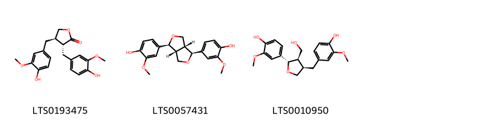{ width=100% }
    <figcaption>Hình ảnh cấu trúc hóa học của 3 hoạt chất thuộc nhóm Furanoid lignans gồm ['matairesinol (LTS0193475)', 'pinoresinol (LTS0057431)', 'lariciresinol (LTS0010950)'].</figcaption>
</figure>
### Nhóm Glycerolipids
<figure markdown="span">
    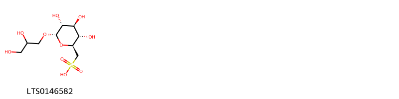{ width=100% }
    <figcaption>Hình ảnh cấu trúc hóa học của 1 hoạt chất thuộc nhóm Glycerolipids gồm ['[(2s,3s,4s,5r,6s)-6-(2,3-dihydroxypropoxy)-3,4,5-trihydroxyoxan-2-yl]methanesulfonic acid (LTS0146582)'].</figcaption>
</figure>
### Nhóm Indoles and derivatives
<figure markdown="span">
    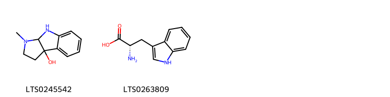{ width=100% }
    <figcaption>Hình ảnh cấu trúc hóa học của 2 hoạt chất thuộc nhóm Indoles and derivatives gồm ['1-methyl-2h,3h,8h,8ah-pyrrolo[2,3-b]indol-3a-ol (LTS0245542)', 'l-tryptophan (LTS0263809)'].</figcaption>
</figure>
### Nhóm Organic disulfides
<figure markdown="span">
    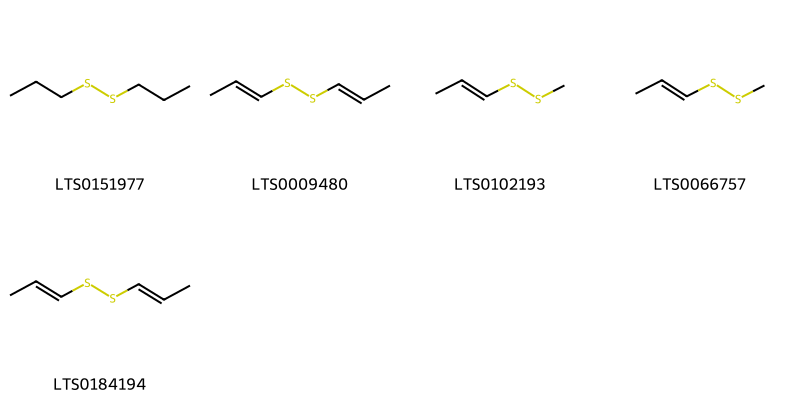{ width=100% }
    <figcaption>Hình ảnh cấu trúc hóa học của 5 hoạt chất thuộc nhóm Organic disulfides gồm ['propyl disulfide (LTS0151977)', '1-(prop-1-en-1-yldisulfanyl)prop-1-ene (LTS0009480)', '1-(methyldisulfanyl)prop-1-ene (LTS0102193)', 'methyl propenyl disulfide (LTS0066757)', '(1e)-1-[(1e)-prop-1-en-1-yldisulfanyl]prop-1-ene (LTS0184194)'].</figcaption>
</figure>
### Nhóm Organic oxoanionic compounds
<figure markdown="span">
    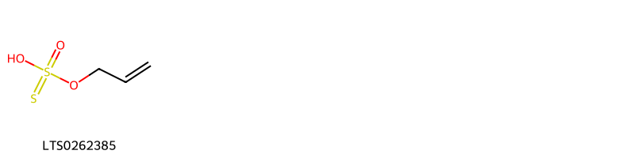{ width=100% }
    <figcaption>Hình ảnh cấu trúc hóa học của 1 hoạt chất thuộc nhóm Organic oxoanionic compounds gồm ['1-hydroxy-1-(prop-2-en-1-yloxy)-1λ⁶-disulfen-1-one (LTS0262385)'].</figcaption>
</figure>
### Nhóm Organic phosphoric acids and derivatives
<figure markdown="span">
    { width=100% }
    <figcaption>Hình ảnh cấu trúc hóa học của 1 hoạt chất thuộc nhóm Organic phosphoric acids and derivatives gồm ['o-phosphoethanolamine; bis(nonane) (LTS0249963)'].</figcaption>
</figure>
### Nhóm Organic sulfonic acids and derivatives
<figure markdown="span">
    { width=100% }
    <figcaption>Hình ảnh cấu trúc hóa học của 1 hoạt chất thuộc nhóm Organic sulfonic acids and derivatives gồm ['2-aminoethanesulfonic acid (LTS0101689)'].</figcaption>
</figure>
### Nhóm Organic sulfuric acids and derivatives
<figure markdown="span">
    { width=100% }
    <figcaption>Hình ảnh cấu trúc hóa học của 2 hoạt chất thuộc nhóm Organic sulfuric acids and derivatives gồm ['prop-2-en-1-yl 3-(prop-2-en-1-ylsulfanyl)prop-2-en-1-yl sulfate (LTS0146386)', 'prop-2-en-1-yl (2e)-3-(prop-2-en-1-ylsulfanyl)prop-2-en-1-yl sulfate (LTS0142449)'].</figcaption>
</figure>
### Nhóm Organic thiosulfuric acids and derivatives
<figure markdown="span">
    { width=100% }
    <figcaption>Hình ảnh cấu trúc hóa học của 1 hoạt chất thuộc nhóm Organic thiosulfuric acids and derivatives gồm ['3-[(prop-2-en-1-yloxysulfonyl)sulfanyl]prop-1-ene (LTS0088695)'].</figcaption>
</figure>
### Nhóm Organic trisulfides
<figure markdown="span">
    { width=100% }
    <figcaption>Hình ảnh cấu trúc hóa học của 3 hoạt chất thuộc nhóm Organic trisulfides gồm ['allyl trisulfide (LTS0055014)', 'allyl methyl trisulfide (LTS0190743)', '1-(prop-1-en-1-yl)-3-(prop-2-en-1-yl)trisulfane (LTS0106388)'].</figcaption>
</figure>
### Nhóm Organooxygen compounds
<figure markdown="span">
    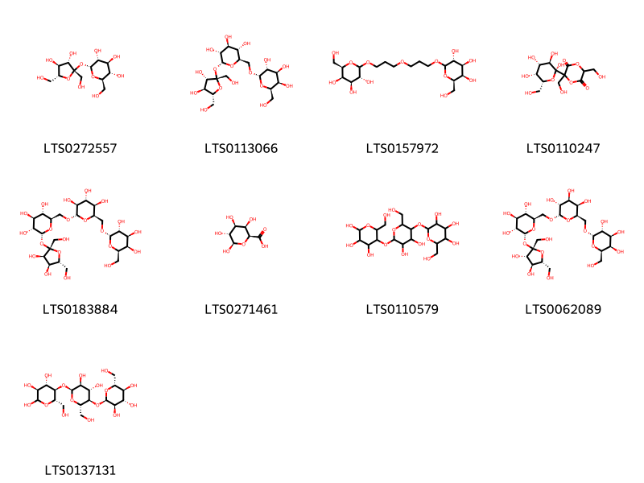{ width=100% }
    <figcaption>Hình ảnh cấu trúc hóa học của 9 hoạt chất thuộc nhóm Organooxygen compounds gồm ['sucrose (LTS0272557)', 'raffinose (LTS0113066)', '(2r,3r,4s,5r)-2-(hydroxymethyl)-6-[3-(3-{[(3r,4s,5r,6r)-3,4,5-trihydroxy-6-(hydroxymethyl)oxan-2-yl]oxy}propoxy)propoxy]oxane-3,4,5-triol (LTS0157972)', '3,6-bis(hydroxymethyl)-3-[(2s,3r,4s,5r,6r)-2,3,4,5-tetrahydroxy-6-(hydroxymethyl)oxan-2-yl]-1,4-dioxane-2,5-dione (LTS0110247)', '(2r,3r,4s,5s,6r)-2-{[(2s,3r,4s,5r)-3,4-dihydroxy-2,5-bis(hydroxymethyl)oxolan-2-yl]oxy}-6-({[(2s,3s,4r,5r,6r)-3,4,5-trihydroxy-6-({[(2s,3r,4s,5r,6r)-3,4,5-trihydroxy-6-(hydroxymethyl)oxan-2-yl]oxy}methyl)oxan-2-yl]oxy}methyl)oxane-3,4,5-triol (LTS0183884)', 'β-d-galactopyranuronic acid (LTS0271461)', 'amylose (LTS0110579)', 'stachyose (LTS0062089)', '(3s,4s,5r,6s)-5-{[(2s,3s,4s,5r,6s)-3,4-dihydroxy-6-(hydroxymethyl)-5-{[(2r,3r,4s,5s,6r)-3,4,5-trihydroxy-6-(hydroxymethyl)oxan-2-yl]oxy}oxan-2-yl]oxy}-6-(hydroxymethyl)oxane-2,3,4-triol (LTS0137131)'].</figcaption>
</figure>
### Nhóm Prenol lipids
<figure markdown="span">
    { width=100% }
    <figcaption>Hình ảnh cấu trúc hóa học của 3 hoạt chất thuộc nhóm Prenol lipids gồm ['(2r)-2,5,7,8-tetramethyl-2-[(4s,8s)-4,8,12-trimethyltridecyl]-3,4-dihydro-1-benzopyran-6-ol (LTS0130040)', '[(1s,4s,5r,6s,8r,9r,13s,16s,18s)-11-ethyl-8,9-dihydroxy-4,6,16,18-tetramethoxy-11-azahexacyclo[7.7.2.1²,⁵.0¹,¹⁰.0³,⁸.0¹³,¹⁷]nonadecan-13-yl]methyl 2-aminobenzoate (LTS0153720)', 'vitamin e (LTS0263269)'].</figcaption>
</figure>
### Nhóm Purine nucleosides
<figure markdown="span">
    { width=100% }
    <figcaption>Hình ảnh cấu trúc hóa học của 2 hoạt chất thuộc nhóm Purine nucleosides gồm ['adenosine (LTS0014061)', 'ribonucleoside (LTS0044502)'].</figcaption>
</figure>
### Nhóm Pyrans
<figure markdown="span">
    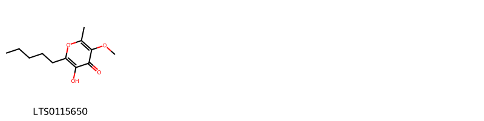{ width=100% }
    <figcaption>Hình ảnh cấu trúc hóa học của 1 hoạt chất thuộc nhóm Pyrans gồm ['allixin (LTS0115650)'].</figcaption>
</figure>
### Nhóm Sphingolipids
<figure markdown="span">
    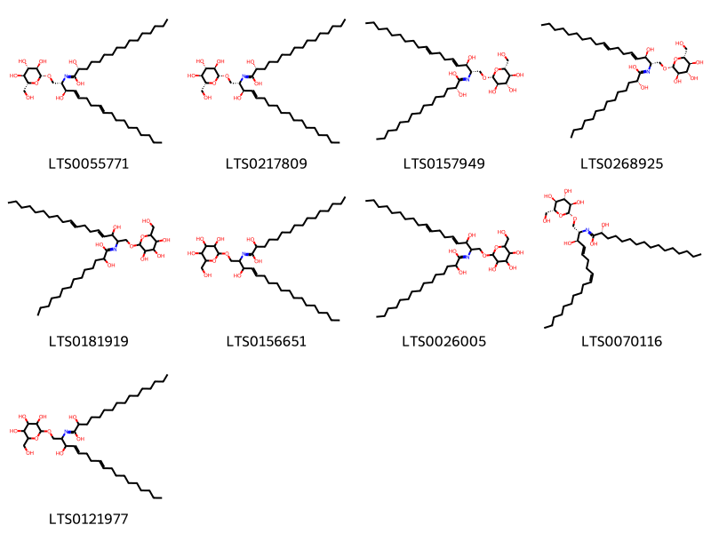{ width=100% }
    <figcaption>Hình ảnh cấu trúc hóa học của 9 hoạt chất thuộc nhóm Sphingolipids gồm ['(2r)-2-hydroxy-n-[(2s,3r,4e,8e)-3-hydroxy-1-{[(2r,3r,4s,5s,6r)-3,4,5-trihydroxy-6-(hydroxymethyl)oxan-2-yl]oxy}octadeca-4,8-dien-2-yl]hexadecanimidic acid (LTS0055771)', '(2r)-2-hydroxy-n-[(2s,3r,4e)-3-hydroxy-1-{[(2r,3r,4s,5s,6r)-3,4,5-trihydroxy-6-(hydroxymethyl)oxan-2-yl]oxy}octadec-4-en-2-yl]hexadecanimidic acid (LTS0217809)', '(2r)-2-hydroxy-n-[(2s,3r,4e,8e)-3-hydroxy-1-{[(2r,3r,4s,5s,6r)-3,4,5-trihydroxy-6-(hydroxymethyl)oxan-2-yl]oxy}octadeca-4,8-dien-2-yl]pentadecanimidic acid (LTS0157949)', '(2r)-2-hydroxy-n-[(2s,3r,4e,8e)-3-hydroxy-1-{[(2r,3r,4s,5s,6r)-3,4,5-trihydroxy-6-(hydroxymethyl)oxan-2-yl]oxy}octadeca-4,8-dien-2-yl]tetradecanimidic acid (LTS0268925)', '2-hydroxy-n-(3-hydroxy-1-{[3,4,5-trihydroxy-6-(hydroxymethyl)oxan-2-yl]oxy}octadeca-4,8-dien-2-yl)tetradecanimidic acid (LTS0181919)', '2-hydroxy-n-(3-hydroxy-1-{[3,4,5-trihydroxy-6-(hydroxymethyl)oxan-2-yl]oxy}octadec-4-en-2-yl)hexadecanimidic acid (LTS0156651)', '2-hydroxy-n-(3-hydroxy-1-{[3,4,5-trihydroxy-6-(hydroxymethyl)oxan-2-yl]oxy}octadeca-4,8-dien-2-yl)pentadecanimidic acid (LTS0026005)', '(2r)-2-hydroxy-n-[(2s,3r,4e,8z)-3-hydroxy-1-{[(2r,3r,4s,5s,6r)-3,4,5-trihydroxy-6-(hydroxymethyl)oxan-2-yl]oxy}octadeca-4,8-dien-2-yl]hexadecanimidic acid (LTS0070116)', '2-hydroxy-n-(3-hydroxy-1-{[3,4,5-trihydroxy-6-(hydroxymethyl)oxan-2-yl]oxy}octadeca-4,8-dien-2-yl)hexadecanimidic acid (LTS0121977)'].</figcaption>
</figure>
### Nhóm Steroids and steroid derivatives
<figure markdown="span">
    { width=100% }
    <figcaption>Hình ảnh cấu trúc hóa học của 12 hoạt chất thuộc nhóm Steroids and steroid derivatives gồm ['f-gitonin (LTS0178831)', "2-[(2-{[4,5-dihydroxy-2-(hydroxymethyl)-6-{5,7',9',13'-tetramethyl-5'-oxaspiro[oxane-2,6'-pentacyclo[10.8.0.0²,⁹.0⁴,⁸.0¹³,¹⁸]icosan]-15'-oloxy}oxan-3-yl]oxy}-5-hydroxy-6-(hydroxymethyl)-4-[(3,4,5-trihydroxyoxan-2-yl)oxy]oxan-3-yl)oxy]-6-(hydroxymethyl)oxane-3,4,5-triol (LTS0246709)", '2-{[2-({2-[(4,5-dihydroxy-6-{[6-hydroxy-7,9,13-trimethyl-6-(3-methyl-4-{[3,4,5-trihydroxy-6-(hydroxymethyl)oxan-2-yl]oxy}butyl)-5-oxapentacyclo[10.8.0.0²,⁹.0⁴,⁸.0¹³,¹⁸]icosan-16-yl]oxy}-2-(hydroxymethyl)oxan-3-yl)oxy]-5-hydroxy-6-(hydroxymethyl)-4-[(3,4,5-trihydroxyoxan-2-yl)oxy]oxan-3-yl}oxy)-3,5-dihydroxy-6-(hydroxymethyl)oxan-4-yl]oxy}-6-(hydroxymethyl)oxane-3,4,5-triol (LTS0091121)', '2-({2-[(6-{[6,19-dihydroxy-7,9,13-trimethyl-6-(3-methyl-4-{[3,4,5-trihydroxy-6-(hydroxymethyl)oxan-2-yl]oxy}butyl)-5-oxapentacyclo[10.8.0.0²,⁹.0⁴,⁸.0¹³,¹⁸]icosan-16-yl]oxy}-4,5-dihydroxy-2-(hydroxymethyl)oxan-3-yl)oxy]-5-hydroxy-6-(hydroxymethyl)-3-{[3,4,5-trihydroxy-6-(hydroxymethyl)oxan-2-yl]oxy}oxan-4-yl}oxy)-6-(hydroxymethyl)oxane-3,4,5-triol (LTS0033267)', "2-({2-[(2-{[4,5-dihydroxy-2-(hydroxymethyl)-6-{5,7',9',13'-tetramethyl-5'-oxaspiro[oxane-2,6'-pentacyclo[10.8.0.0²,⁹.0⁴,⁸.0¹³,¹⁸]icosane]oxy}oxan-3-yl]oxy}-5-hydroxy-6-(hydroxymethyl)-4-[(3,4,5-trihydroxyoxan-2-yl)oxy]oxan-3-yl)oxy]-3,5-dihydroxy-6-(hydroxymethyl)oxan-4-yl}oxy)-6-(hydroxymethyl)oxane-3,4,5-triol (LTS0169868)", '(2s,3r,4s,5s,6r)-2-{[(2s,3r,4s,5r,6r)-2-{[(2s,3r,4s,5r,6r)-2-{[(2r,3r,4r,5r,6r)-4,5-dihydroxy-6-{[(1r,2s,4r,6r,7s,8r,9s,12s,13s,16s,18s)-6-hydroxy-7,9,13-trimethyl-6-[(3r)-3-methyl-4-{[(2r,3r,4s,5s,6r)-3,4,5-trihydroxy-6-(hydroxymethyl)oxan-2-yl]oxy}butyl]-5-oxapentacyclo[10.8.0.0²,⁹.0⁴,⁸.0¹³,¹⁸]icosan-16-yl]oxy}-2-(hydroxymethyl)oxan-3-yl]oxy}-5-hydroxy-6-(hydroxymethyl)-4-{[(2s,3r,4s,5r)-3,4,5-trihydroxyoxan-2-yl]oxy}oxan-3-yl]oxy}-3,5-dihydroxy-6-(hydroxymethyl)oxan-4-yl]oxy}-6-(hydroxymethyl)oxane-3,4,5-triol (LTS0146809)', "(2s,3r,4s,5s,6r)-2-{[(2s,3r,4s,5r,6r)-2-{[(2r,3r,4r,5r,6r)-4,5-dihydroxy-2-(hydroxymethyl)-6-[(1'r,2s,2's,4's,5r,7's,8'r,9's,12's,13's,15'r,16'r,18's)-5,7',9',13'-tetramethyl-5'-oxaspiro[oxane-2,6'-pentacyclo[10.8.0.0²,⁹.0⁴,⁸.0¹³,¹⁸]icosan]-15'-oloxy]oxan-3-yl]oxy}-5-hydroxy-6-(hydroxymethyl)-4-{[(2s,3r,4s,5r)-3,4,5-trihydroxyoxan-2-yl]oxy}oxan-3-yl]oxy}-6-(hydroxymethyl)oxane-3,4,5-triol (LTS0224120)", '(2s,3r,4s,5s,6r)-2-{[(2s,3r,4s,5r,6r)-2-{[(2r,3r,4r,5r,6r)-6-{[(1r,2s,4s,6s,7s,8r,9s,12s,13r,16s,18s,19r)-6,19-dihydroxy-7,9,13-trimethyl-6-[(3r)-3-methyl-4-{[(2r,3r,4s,5s,6r)-3,4,5-trihydroxy-6-(hydroxymethyl)oxan-2-yl]oxy}butyl]-5-oxapentacyclo[10.8.0.0²,⁹.0⁴,⁸.0¹³,¹⁸]icosan-16-yl]oxy}-4,5-dihydroxy-2-(hydroxymethyl)oxan-3-yl]oxy}-5-hydroxy-6-(hydroxymethyl)-3-{[(2s,3r,4s,5s,6r)-3,4,5-trihydroxy-6-(hydroxymethyl)oxan-2-yl]oxy}oxan-4-yl]oxy}-6-(hydroxymethyl)oxane-3,4,5-triol (LTS0031713)', "(2s,3r,4s,5s,6r)-2-{[(2s,3r,4s,5r,6r)-2-{[(2s,3r,4s,5r,6r)-2-{[(2r,3r,4r,5r,6r)-4,5-dihydroxy-2-(hydroxymethyl)-6-[(1'r,2r,2's,4's,5r,7's,8'r,9's,12's,13's,16's,18's)-5,7',9',13'-tetramethyl-5'-oxaspiro[oxane-2,6'-pentacyclo[10.8.0.0²,⁹.0⁴,⁸.0¹³,¹⁸]icosane]oxy]oxan-3-yl]oxy}-5-hydroxy-6-(hydroxymethyl)-4-{[(2s,3r,4s,5r)-3,4,5-trihydroxyoxan-2-yl]oxy}oxan-3-yl]oxy}-3,5-dihydroxy-6-(hydroxymethyl)oxan-4-yl]oxy}-6-(hydroxymethyl)oxane-3,4,5-triol (LTS0250523)", '(2s,3r,4s,5s,6r)-2-{[(2s,3r,4s,5r,6r)-2-{[(2r,3r,4r,5r,6r)-4,5-dihydroxy-6-{[(1r,2s,4r,6r,7s,8r,9s,12s,13s,16s,18s)-6-hydroxy-7,9,13-trimethyl-6-[(3r)-3-methyl-4-{[(2r,3r,4s,5s,6r)-3,4,5-trihydroxy-6-(hydroxymethyl)oxan-2-yl]oxy}butyl]-5-oxapentacyclo[10.8.0.0²,⁹.0⁴,⁸.0¹³,¹⁸]icosan-16-yl]oxy}-2-(hydroxymethyl)oxan-3-yl]oxy}-5-hydroxy-6-(hydroxymethyl)-4-{[(2s,3r,4s,5r)-3,4,5-trihydroxyoxan-2-yl]oxy}oxan-3-yl]oxy}-6-(hydroxymethyl)oxane-3,4,5-triol (LTS0252837)', "2-[(2-{[4,5-dihydroxy-2-(hydroxymethyl)-6-[(1'r,2r,2's,4's,8's,9's,12'r,13's,18's)-5,7',9',13'-tetramethyl-5'-oxaspiro[oxane-2,6'-pentacyclo[10.8.0.0²,⁹.0⁴,⁸.0¹³,¹⁸]icosane]oxy]oxan-3-yl]oxy}-5-hydroxy-6-(hydroxymethyl)-4-[(3,4,5-trihydroxyoxan-2-yl)oxy]oxan-3-yl)oxy]-6-(hydroxymethyl)oxane-3,4,5-triol (LTS0108173)", '2-({2-[(4,5-dihydroxy-6-{[6-hydroxy-7,9,13-trimethyl-6-(3-methyl-4-{[3,4,5-trihydroxy-6-(hydroxymethyl)oxan-2-yl]oxy}butyl)-5-oxapentacyclo[10.8.0.0²,⁹.0⁴,⁸.0¹³,¹⁸]icosan-16-yl]oxy}-2-(hydroxymethyl)oxan-3-yl)oxy]-5-hydroxy-6-(hydroxymethyl)-4-[(3,4,5-trihydroxyoxan-2-yl)oxy]oxan-3-yl}oxy)-6-(hydroxymethyl)oxane-3,4,5-triol (LTS0010867)'].</figcaption>
</figure>
### Nhóm Sulfonyls
<figure markdown="span">
    { width=100% }
    <figcaption>Hình ảnh cấu trúc hóa học của 1 hoạt chất thuộc nhóm Sulfonyls gồm ['3-[(prop-2-ene-1-sulfonyl)sulfanyl]prop-1-ene (LTS0190924)'].</figcaption>
</figure>
### Nhóm Sulfoxides
<figure markdown="span">
    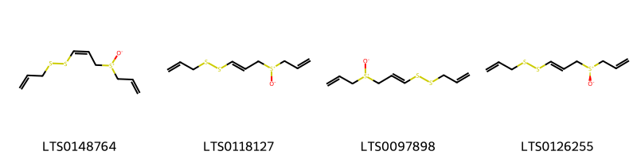{ width=100% }
    <figcaption>Hình ảnh cấu trúc hóa học của 4 hoạt chất thuộc nhóm Sulfoxides gồm ['(z)-ajoene (LTS0148764)', 'ajoene (LTS0118127)', '3-{[3-(prop-2-ene-1-sulfinyl)prop-1-en-1-yl]disulfanyl}prop-1-ene (LTS0097898)', '3-{[(1e)-3-[(r)-prop-2-ene-1-sulfinyl]prop-1-en-1-yl]disulfanyl}prop-1-ene (LTS0126255)'].</figcaption>
</figure>
### Nhóm Thiosulfinic acid esters
<figure markdown="span">
    { width=100% }
    <figcaption>Hình ảnh cấu trúc hóa học của 8 hoạt chất thuộc nhóm Thiosulfinic acid esters gồm ['allicin (LTS0248420)', '(1e)-1-(methanesulfinylsulfanyl)prop-1-ene (LTS0040661)', '{[(1e)-prop-1-ene-1-sulfinyl]sulfanyl}methane (LTS0191876)', '[(prop-2-ene-1-sulfinyl)sulfanyl]methane (LTS0214069)', '3-{[(1e)-prop-1-ene-1-sulfinyl]sulfanyl}prop-1-ene (LTS0077006)', '(1e)-1-[(prop-2-ene-1-sulfinyl)sulfanyl]prop-1-ene (LTS0097985)', '3-(methanesulfinylsulfanyl)prop-1-ene (LTS0000272)', '3-{[(s)-prop-2-ene-1-sulfinyl]sulfanyl}prop-1-ene (LTS0090444)'].</figcaption>
</figure>
### Nhóm Triphenyl compounds
<figure markdown="span">
    { width=100% }
    <figcaption>Hình ảnh cấu trúc hóa học của 1 hoạt chất thuộc nhóm Triphenyl compounds gồm ['2-amino-3-[(triphenylmethyl)sulfanyl]propanoic acid (LTS0024342)'].</figcaption>
</figure>

---

## Tác dụng dược lý

Theo tài liệu Tài liệu khác:- Kháng khuẩn
- Kháng viêm
- Hạ cholesterol
- Tăng cường miễn dịch
- Chống oxi hóa

Theo tài liệu quốc tế: nan

---

## Dược điển Việt Nam V

### Soi bột:
nan
<!-- Hình ảnh soi bột sẽ được tự động chèn vào đây sau -->
### Vi phẫu:
nan
<!-- Hình ảnh vi phẫu sẽ được tự động chèn vào đây sau -->
### Định tính

nan

### Định lượng

nan

### Thông tin khác 
- ** Độ ẩm: ** nan

- ** Bảo quản:** nan
## Dược điển Hồng kong

<!-- PDF sẽ được tự động chèn vào đây sau -->

---

## Y dược học cổ truyền

- **Tên vị thuốc:** nan
- **Tính vị quy kinh:** Tân, ôn. Quy vào các kinh phế, tỳ, vị.
- **Công năng chủ trị:** Công năng: Hành khí, ôn trung, tiêu tích trệ, sát trùng, giải độc.

Chủ trị: Cảm cúm, ho gà, viêm phế quản, ăn uống tích trệ, thượng vị đau nhức do đầy hơi, tiêu chảy mụn nhọt, áp xe viêm tấy, hói trán, trị giun kim.
- **Chú ý:** nan
- **Kiêng kỵ:** nan

