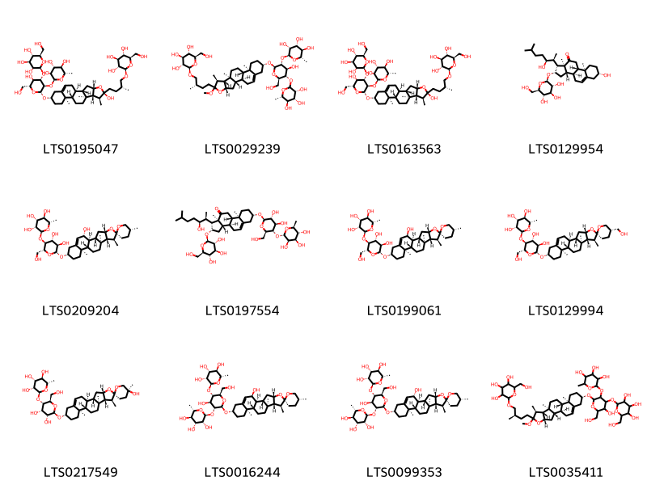

!!! abstract "Tóm tắt"
    - Tỳ giải có tên khoa học là Dioscorea septemloba Thunb hoặc Dioscorea futschauensis Uline ex R. Kunth, thuộc họ Dioscoreaceae-Củ nâu 
- Phân bố trên thế giới tại China Southeast, hiện nay chưa thấy ở Việt Nam, tuy nhiên tạ vẫn khai thác với tên tỷ giải một số cây thuộc họ Hành (Alliaceae) và họ Củ nâu (Dioscoreaceae) nhưng chưa xác định tên khoa học chắc chắn.
- Tác dụng dược lý : 
+ kháng khuẩn, kháng viêm
+ nước sắc Tỳ giải có tác dụng trị viêm khớp, đau cơ, viêm tuyến tiền liệt và làm tan cục máu đông.
- Thành phần hóa học: dioxin (dioscin) và dioscorea sapotoxin
- Kinh nghiệm sử dụng dân gian:
+ Chữa tiểu tiện đục mãn tính: Tỳ giải, thạch xương bổ, ích trí nhân, ô dược, sinh cam thảo. Các vị bằng nhau, muối ăn 1g, nước 600ml. Sắc còn 200ml chia 3 lần uống trước khi ăn; uống nóng chữa bệnh tiểu tiện đục, lâu không hết, mãn tính (đơn thuốc trích trong Hòa tễ cục phương)

## Thông tin về thực vật

### Đặc điểm thực vật

Dược liệu **Tỳ Giải (Thân Rễ)** từ bộ phận **nan** từ loài *Dioscorea septemloba Thunb.* thuộc họ Dioscoreaceae. Tỳ giải là một loại cây leo, sống lâu, có rễ thành củ to, mặt ngoài màu vàng nâu, trong có màu trắng vàng, chất cứng, vị đắng Thần nhỏ, gãy. Lá mọc so le, hình trái tim, cuống lá dài, đầu nhọn, có 7 đến 9 hoặc 11 gần lớn. Lá kèm biến thành tua cuốn. Hoa đơn tính, khác gốc, màu xanh nhạt, mọc thành bông. Quả nhỏ, có đĩa như cánh. Ra hoa vào mùa hạ và thu. 

!!! info "Phân loại thực vật của *Dioscorea septemloba*"
    - **Kingdom:** Plantae
    - **Phylum:** Tracheophyta
    - **Order:** Dioscoreales
    - **Family:** Dioscoreaceae
    - **Genus:** Dioscorea
    - **Species:** *Dioscorea septemloba*

*Tài liệu tham khảo:* "Những cây thuốc và vị thuốc Việt Nam" - Đỗ Tất Lợi

 

### Loài thay thế (Nếu có)

Dược liệu này cũng có thể từ loài *Dioscorea futschauensis Uline ex R. Kunth*, thông tin về phân loại thực vật loài này như sau:
!!! info "Thông tin về phân loại thực vật của *Dioscorea futschauensis*"
    - **kingdom:** Plantae
    - **phylum:** Tracheophyta
    - **order:** Dioscoreales
    - **family:** Dioscoreaceae
    - **genus:** Dioscorea
    - **species:** *Dioscorea futschauensis*

Hình ảnh của loài *Dioscorea futschauensis Uline ex R. Kunth*:

### Phân bố trên thế giới
**Từ vườn thực vật KEW: **: China Southeast

**Từ CSDL GIBF** nan, Japan, Korea, Republic of

### Phân bố tại Việt Nam
** "Những cây thuốc và vị thuốc Việt Nam" - Đỗ Tất Lợi**: Hiện nay chưa thấy ở Việt Nam, tuy nhiên tạ vẫn khai thác với tên tỷ giải một số cây thuộc họ Hành (Alliaceae) và họ Củ nâu (Dioscoreaceae) nhưng chưa xác định tên khoa học chắc chắn. Tỳ giải ta khai thác được dùng trong nước và xuất khẩu. Cây Dioscorea tokoro mọc ở các tỉnh Quảng Đông, Quảng Tây, Văn Nam v. v… là những tỉnh Trung Quốc giáp giới miền Bắc nước ta.

**Từ CSDL GIBF**: Không có ghi nhận ở Việt Nam

---

## Thông tin về dược liệu 

### Định danh

!!! info "Thông tin về tên gọi của nan"
    - Dược liệu tiếng Việt: nan
    - Dược liệu tiếng Trung: nan (nan)
    - Dược liệu tiếng Anh: nan
    - Dược liệu latin thông dụng: nan
    - Dược liệu latin kiểu DĐVN: rhizoma dioscoreae
    - Dược liệu latin kiểu DĐVN: nan
    - Dược liệu latin kiểu thông tư: nan
    - Bộ phận dùng: nan (nan)

### Mô tả dược liệu 
- **Theo dược điển Việt nam V:** nan

- **Mô tả dược liệu theo thông tư chế biến dược liệu theo phương pháp cổ truyền:** nan

### Chế biến 

- **Chế biến theo dược điển việt nam V**: nan

- **Chế biến theo thông tư:** nan

--- 

## Thành phần hóa học

- Theo tài liệu của GS. Đỗ Tất Lợi:  (1) dioxin (dioscin) và dioscorea sapotoxin
    
- Theo cơ sở dữ liệu lotus: Từ loài *Dioscorea septemloba* đã phân lập và xác định được 12 hoạt chất thuộc về các nhóm Steroids and steroid derivatives. 

|    | chemicalTaxonomyClassyfireClass   |   smiles_count |
|---:|:----------------------------------|---------------:|
|  0 | Steroids and steroid derivatives  |             12 |

### Nhóm Steroids and steroid derivatives
<figure markdown="span">
    { width=100% }
    <figcaption>Hình ảnh cấu trúc hóa học của 12 hoạt chất thuộc nhóm Steroids and steroid derivatives gồm ['(2s,3r,4r,5r,6s)-2-{[(2r,3r,4s,5r,6r)-5-hydroxy-2-{[(1s,2s,4s,6r,7s,8r,9s,12s,13r,16s)-6-hydroxy-7,9,13-trimethyl-6-[(3r)-3-methyl-4-{[(2r,3r,4s,5s,6r)-3,4,5-trihydroxy-6-(hydroxymethyl)oxan-2-yl]oxy}butyl]-5-oxapentacyclo[10.8.0.0²,⁹.0⁴,⁸.0¹³,¹⁸]icos-18-en-16-yl]oxy}-6-(hydroxymethyl)-4-{[(2s,3r,4s,5s,6r)-3,4,5-trihydroxy-6-(hydroxymethyl)oxan-2-yl]oxy}oxan-3-yl]oxy}-6-methyloxane-3,4,5-triol (LTS0195047)', '(2r,3r,4s,5s,6r)-2-[(2s)-4-[(1s,2s,4s,7s,8r,9s,12s,13r,16s)-16-{[(2r,3r,4s,5s,6r)-4-hydroxy-6-(hydroxymethyl)-3-{[(2s,3r,4r,5r,6s)-3,4,5-trihydroxy-6-methyloxan-2-yl]oxy}-5-{[(3r,4r,5r,6s)-3,4,5-trihydroxy-6-methyloxan-2-yl]oxy}oxan-2-yl]oxy}-6-methoxy-7,9,13-trimethyl-5-oxapentacyclo[10.8.0.0²,⁹.0⁴,⁸.0¹³,¹⁸]icos-18-en-6-yl]-2-methylbutoxy]-6-(hydroxymethyl)oxane-3,4,5-triol (LTS0029239)', '(2s,3r,4r,5r,6s)-2-{[(2r,3r,4s,5s,6r)-5-hydroxy-2-{[(1s,2s,4s,6r,7s,8r,9s,12s,13r,16s)-6-hydroxy-7,9,13-trimethyl-6-[(3r)-3-methyl-4-{[(2r,3r,4s,5s,6r)-3,4,5-trihydroxy-6-(hydroxymethyl)oxan-2-yl]oxy}butyl]-5-oxapentacyclo[10.8.0.0²,⁹.0⁴,⁸.0¹³,¹⁸]icos-18-en-16-yl]oxy}-6-(hydroxymethyl)-4-{[(2s,3r,4s,5s,6r)-3,4,5-trihydroxy-6-(hydroxymethyl)oxan-2-yl]oxy}oxan-3-yl]oxy}-6-methyloxane-3,4,5-triol (LTS0163563)', '(1r,2s,3as,3br,7s,9ar,9bs,11as)-7-hydroxy-1-[(2s,3s)-3-hydroxy-6-methylheptan-2-yl]-9a,11a-dimethyl-2-{[(2r,3r,4s,5s,6r)-3,4,5-trihydroxy-6-(hydroxymethyl)oxan-2-yl]oxy}-1h,2h,3h,3ah,3bh,4h,6h,7h,8h,9h,9bh,10h-cyclopenta[a]phenanthren-11-one (LTS0129954)', "(2s,3r,4r,5r,6s)-2-{[(2r,3s,4r,5r,6r)-4,5-dihydroxy-2-(hydroxymethyl)-6-[(1's,2r,2's,4's,5r,7's,8'r,9's,12's,13'r,16's,20'r)-5,7',9',13'-tetramethyl-5'-oxaspiro[oxane-2,6'-pentacyclo[10.8.0.0²,⁹.0⁴,⁸.0¹³,¹⁸]icosan]-18'-en-20'-oloxy]oxan-3-yl]oxy}-6-methyloxane-3,4,5-triol (LTS0209204)", '(1r,2s,3as,3br,7s,9ar,9bs,11as)-7-{[(2r,3r,4r,5s,6r)-3,4-dihydroxy-6-(hydroxymethyl)-5-{[(2s,3r,4r,5r,6s)-3,4,5-trihydroxy-6-methyloxan-2-yl]oxy}oxan-2-yl]oxy}-1-[(2s,3s)-3-hydroxy-6-methylheptan-2-yl]-9a,11a-dimethyl-2-{[(2r,3r,4s,5s,6r)-3,4,5-trihydroxy-6-(hydroxymethyl)oxan-2-yl]oxy}-1h,2h,3h,3ah,3bh,4h,6h,7h,8h,9h,9bh,10h-cyclopenta[a]phenanthren-11-one (LTS0197554)', "(2s,3r,4r,5r,6s)-2-{[(2r,3s,4r,5r,6r)-4,5-dihydroxy-2-(hydroxymethyl)-6-[(1's,2r,2's,4's,5r,7's,8'r,9's,12's,13'r,16's,20's)-5,7',9',13'-tetramethyl-5'-oxaspiro[oxane-2,6'-pentacyclo[10.8.0.0²,⁹.0⁴,⁸.0¹³,¹⁸]icosan]-18'-en-20'-oloxy]oxan-3-yl]oxy}-6-methyloxane-3,4,5-triol (LTS0199061)", "(2s,3r,4r,5r,6s)-2-{[(2r,3s,4r,5r,6r)-4,5-dihydroxy-2-(hydroxymethyl)-6-[(1's,2r,2's,4's,5s,7's,8'r,9's,12's,13'r,16's)-5-(hydroxymethyl)-7',9',13'-trimethyl-5'-oxaspiro[oxane-2,6'-pentacyclo[10.8.0.0²,⁹.0⁴,⁸.0¹³,¹⁸]icosan]-18'-eneoxy]oxan-3-yl]oxy}-6-methyloxane-3,4,5-triol (LTS0129994)", "(2s,3r,4r,5r,6s)-2-{[(2r,3s,4s,5r,6r)-4,5-dihydroxy-2-(hydroxymethyl)-6-[(1's,2r,2's,4's,5s,7's,8'r,9's,12's,13'r,16's)-5,7',9',13'-tetramethyl-5'-oxaspiro[oxane-2,6'-pentacyclo[10.8.0.0²,⁹.0⁴,⁸.0¹³,¹⁸]icosan]-18'-en-5-oloxy]oxan-3-yl]oxy}-6-methyloxane-3,4,5-triol (LTS0217549)", "(2s,3r,4r,5r,6s)-2-{[(2r,3s,4s,5r,6r)-4-hydroxy-2-(hydroxymethyl)-6-[(1's,2r,2's,4's,5r,7's,8'r,9's,12's,13'r,16's,20's)-5,7',9',13'-tetramethyl-5'-oxaspiro[oxane-2,6'-pentacyclo[10.8.0.0²,⁹.0⁴,⁸.0¹³,¹⁸]icosan]-18'-en-20'-oloxy]-5-{[(2s,3r,4r,5r,6s)-3,4,5-trihydroxy-6-methyloxan-2-yl]oxy}oxan-3-yl]oxy}-6-methyloxane-3,4,5-triol (LTS0016244)", "(2s,3r,4r,5r,6s)-2-{[(2r,3s,4s,5r,6r)-4-hydroxy-2-(hydroxymethyl)-6-[(1's,2r,2's,4's,5r,7's,8'r,9's,12's,13'r,16's,20'r)-5,7',9',13'-tetramethyl-5'-oxaspiro[oxane-2,6'-pentacyclo[10.8.0.0²,⁹.0⁴,⁸.0¹³,¹⁸]icosan]-18'-en-20'-oloxy]-5-{[(2s,3r,4r,5r,6s)-3,4,5-trihydroxy-6-methyloxan-2-yl]oxy}oxan-3-yl]oxy}-6-methyloxane-3,4,5-triol (LTS0099353)", '2-[(2r)-4-[(1s,2s,4s,7s,8r,9s,12s,13r,16s)-16-{[5-hydroxy-6-(hydroxymethyl)-4-{[3,4,5-trihydroxy-6-(hydroxymethyl)oxan-2-yl]oxy}-3-[(3,4,5-trihydroxy-6-methyloxan-2-yl)oxy]oxan-2-yl]oxy}-6-methoxy-7,9,13-trimethyl-5-oxapentacyclo[10.8.0.0²,⁹.0⁴,⁸.0¹³,¹⁸]icos-18-en-6-yl]-2-methylbutoxy]-6-(hydroxymethyl)oxane-3,4,5-triol (LTS0035411)'].</figcaption>
</figure>

---

## Tác dụng dược lý

Theo tài liệu "Những cây thuốc và vị thuốc Việt Nam" - Đỗ Tất Lợi:- kháng khuẩn, kháng viêm
- nước sắc Tỳ giải có tác dụng trị viêm khớp, đau cơ, viêm tuyến tiền liệt và làm tan cục máu đông.

Theo tài liệu quốc tế: nan

---

## Dược điển Việt Nam V

### Soi bột:
nan
<!-- Hình ảnh soi bột sẽ được tự động chèn vào đây sau -->
### Vi phẫu:
nan
<!-- Hình ảnh vi phẫu sẽ được tự động chèn vào đây sau -->
### Định tính

nan

### Định lượng

nan

### Thông tin khác 
- ** Độ ẩm: ** nan

- ** Bảo quản:** nan
## Dược điển Hồng kong

<!-- PDF sẽ được tự động chèn vào đây sau -->

---

## Y dược học cổ truyền

- **Tên vị thuốc:** nan
- **Tính vị quy kinh:** Khô, bình. Vào các kinh can thận, vị, bàng quang.
- **Công năng chủ trị:** Công năng: Phân thanh trừ trọc, khu phong trừ thấp.

Chủ trị: Cao lâm (đái đục), bạch đới quá nhiều; sang độc do thấp nhiệt, đau lưng đầu gối.
- **Chú ý:** nan
- **Kiêng kỵ:** nan

