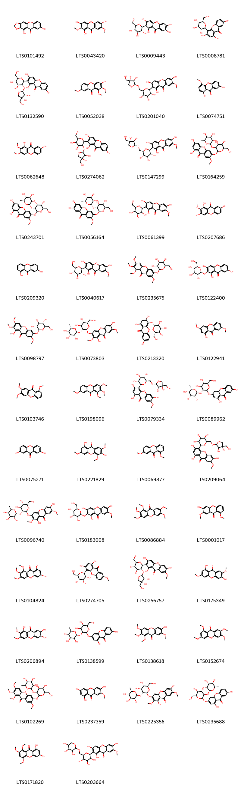
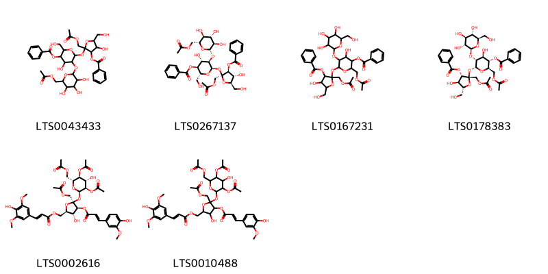
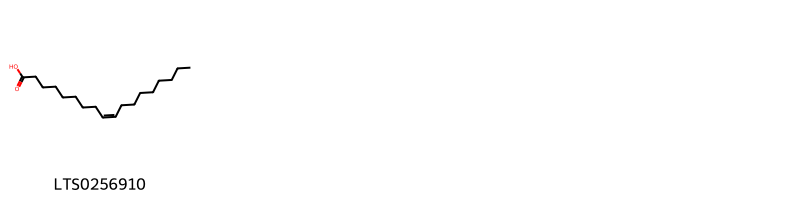
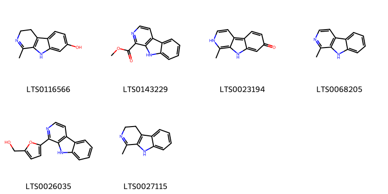
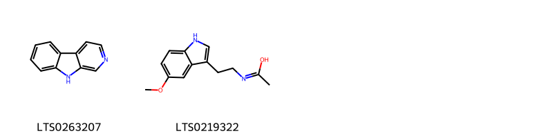
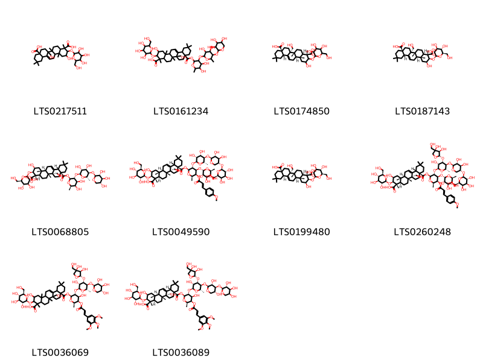

!!! abstract "Tóm tắt"
    Rễ viễn chí(Radix Polygalae) là rễ khô của cây viễn chí lá nhỏ (Polygala tenuifolia Wild.) hoặc viễn chí Xiberi (Polygala sibirica L.), thuộc họ Viễn chí (Polygalaceace). Viễn chí phân bố chủ yếu ở khu vực Á Âu. Ở Việt Nam, viễn chí vẫn chưa được khai thác nhiều, mới ghi nhận loài Polygala siribica L. có công dụng làm thuốc. Theo tài liệu cổ, viễn chí đắng, tính ôn, vào 2 kinh tâm và thận, dùng tối đa 6g/ngày. Rễ viễn chí dùng trừ đờm, điều trị suy nhược thần kinh, hay quên, sợ hãi, ung thư sưng thũng. Rễ viễn chí chứa nhiều thành phần hoá học như saponin, terpen, oligosaccharides, xanthon với 2 chất tiềm năng là tenuifolin và beta - amyrin

## Thông tin về thực vật

### Đặc điểm thực vật

Dược liệu **Viễn Chí (Rễ)** từ bộ phận **nan** từ loài *Polygala tenuifolia Wild.* thuộc họ Polygalaceae. Ở Việt Nam mới có P.sibirica L được ghi nhận có công dụng làm thuốc. Polygala sibirica L. là loại cỏ lâu năm, cao 10-20cm, đường kính của thân cây 1-6mm. Lá mọc so le. Lá phía dưới nhỏ hơn, hình mác dài 0,6-3cm, rộng 3-6mm, ở cả 2 mặt lá đều có lông nhỏ mịn. Hoa mọc thành chùm dài 3-7cm cánh hoa màu lam tím. Quả nang hình trứng dài độ 4-5mm. 

!!! info "Phân loại thực vật của *Polygala tenuifolia*"
    - **Kingdom:** Plantae
    - **Phylum:** Tracheophyta
    - **Order:** Fabales
    - **Family:** Polygalaceae
    - **Genus:** Polygala
    - **Species:** *Polygala tenuifolia*

*Tài liệu tham khảo:* "Những cây thuốc và vị thuốc Việt Nam" - Đỗ Tất Lợi

 

### Loài thay thế (Nếu có)

Dược liệu này cũng có thể từ loài *Polygala sibirica L.*, thông tin về phân loại thực vật loài này như sau:
!!! info "Thông tin về phân loại thực vật của *Polygala sibirica*"
    - **kingdom:** Plantae
    - **phylum:** Tracheophyta
    - **order:** Fabales
    - **family:** Polygalaceae
    - **genus:** Polygala
    - **species:** *Polygala sibirica*

Hình ảnh của loài *Polygala sibirica L.*:

### Phân bố trên thế giới
**Từ vườn thực vật KEW: **: Tập trung chủ yếu ở khu vực Âu Á, trải dài từ Đông Âu sang Trung Á và một phần Đông Á

**Từ CSDL GIBF** nan, Mongolia, Brazil, Korea, Republic of, China, Russian Federation

### Phân bố tại Việt Nam
** "Những cây thuốc và vị thuốc Việt Nam" - Đỗ Tất Lợi**: Tại miền Bắc mới phát hiện ở Ninh Bình, Nam Định, Hà Nam, Lạng Sơn, Cao Bằng.

**Từ CSDL GIBF**: Không có ghi nhận ở Việt Nam

---

## Thông tin về dược liệu 

### Định danh

!!! info "Thông tin về tên gọi của nan"
    - Dược liệu tiếng Việt: nan
    - Dược liệu tiếng Trung: nan (nan)
    - Dược liệu tiếng Anh: nan
    - Dược liệu latin thông dụng: nan
    - Dược liệu latin kiểu DĐVN: radix polygalae
    - Dược liệu latin kiểu DĐVN: nan
    - Dược liệu latin kiểu thông tư: nan
    - Bộ phận dùng: nan (nan)

### Mô tả dược liệu 
- **Theo dược điển Việt nam V:** nan

- **Mô tả dược liệu theo thông tư chế biến dược liệu theo phương pháp cổ truyền:** nan

### Chế biến 

- **Chế biến theo dược điển việt nam V**: nan

- **Chế biến theo thông tư:** nan

--- 

## Thành phần hóa học

- Theo tài liệu của GS. Đỗ Tất Lợi:  (1) saponin, xanthon, oligosaccharides, terpen
(2) Tenuifolin
    
- Theo cơ sở dữ liệu lotus: Từ loài *Polygala tenuifolia* đã phân lập và xác định được 181 hoạt chất thuộc về các nhóm Harmala alkaloids, Organooxygen compounds, Benzopyrans, Prenol lipids, Carboxylic acids and derivatives, Fatty Acyls, Indoles and derivatives, Cinnamic acids and derivatives. 

|    | chemicalTaxonomyClassyfireClass   |   smiles_count |
|---:|:----------------------------------|---------------:|
|  0 | Benzopyrans                       |             65 |
|  1 | Carboxylic acids and derivatives  |              6 |
|  2 | Cinnamic acids and derivatives    |             16 |
|  3 | Fatty Acyls                       |              1 |
|  4 | Harmala alkaloids                 |              6 |
|  5 | Indoles and derivatives           |              2 |
|  6 | Organooxygen compounds            |             74 |
|  7 | Prenol lipids                     |             10 |

### Nhóm Benzopyrans
<figure markdown="span">
    { width=100% }
    <figcaption>Hình ảnh cấu trúc hóa học của 65 hoạt chất thuộc nhóm Benzopyrans gồm ['8,11-dihydroxy-2h-[1,3]dioxolo[4,5-b]xanthen-10-one (LTS0101492)', '1,3,6-trihydroxy-2,7-dimethoxyxanthen-9-one (LTS0043420)', 'mangiferin (LTS0009443)', 'lancerin (LTS0008781)', '2-[(2s,3r,4s,5s,6r)-3-{[(2s,3r,4r)-3,4-dihydroxy-4-(hydroxymethyl)oxolan-2-yl]oxy}-4,5-dihydroxy-6-(hydroxymethyl)oxan-2-yl]-1,3,7-trihydroxyxanthen-9-one (LTS0132590)', '3-hydroxy-1,2,7-trimethoxyxanthen-9-one (LTS0052038)', '2-[6-({[(4r)-3,4-dihydroxy-4-(hydroxymethyl)oxolan-2-yl]oxy}methyl)-3,4,5-trihydroxyoxan-2-yl]-1,3,6-trihydroxy-7-methoxyxanthen-9-one (LTS0201040)', '1,7-dihydroxy-4-methoxyxanthen-9-one (LTS0074751)', '1,7-dihydroxy-2,3-dimethoxyxanthen-9-one (LTS0062648)', '2-(3-{[3,4-dihydroxy-4-(hydroxymethyl)oxolan-2-yl]oxy}-4,5-dihydroxy-6-(hydroxymethyl)oxan-2-yl)-1,3,7-trihydroxyxanthen-9-one (LTS0274062)', '2-[(2s,3r,4r,5s,6r)-6-({[(2r,3r,4r)-3,4-dihydroxy-4-(hydroxymethyl)oxolan-2-yl]oxy}methyl)-3,4,5-trihydroxyoxan-2-yl]-1,3,6-trihydroxy-7-methoxyxanthen-9-one (LTS0147299)', '6-{[4,5-dihydroxy-6-(hydroxymethyl)-3-[(3,4,5-trihydroxy-6-methyloxan-2-yl)oxy]oxan-2-yl]oxy}-1,3-dihydroxy-7-methoxyxanthen-9-one (LTS0164259)', '6-{[(2s,3r,4s,5s,6r)-4,5-dihydroxy-6-(hydroxymethyl)-3-{[(2s,3r,4r,5r,6s)-3,4,5-trihydroxy-6-methyloxan-2-yl]oxy}oxan-2-yl]oxy}-1,3-dihydroxy-7-methoxyxanthen-9-one (LTS0243701)', '3-{[(2s,3r,4s,5s,6r)-4,5-dihydroxy-6-(hydroxymethyl)-3-{[(2s,3r,4r,5r,6s)-3,4,5-trihydroxy-6-methyloxan-2-yl]oxy}oxan-2-yl]oxy}-6,7-dihydroxy-2-methoxyxanthen-9-one (LTS0056164)', '1,3,6-trihydroxy-7-methoxy-2-[3,4,5-trihydroxy-6-(hydroxymethyl)oxan-2-yl]xanthen-9-one (LTS0061399)', '1,3,7-trihydroxy-2-methoxyxanthen-9-one (LTS0207686)', 'euxanthone (LTS0209320)', '1,3,6-trihydroxy-7-methoxy-2-[(2s,3r,4r,5s,6r)-3,4,5-trihydroxy-6-(hydroxymethyl)oxan-2-yl]xanthen-9-one (LTS0040617)', '1,2,3,7-tetramethoxy-6-{[3,4,5-trihydroxy-6-(hydroxymethyl)oxan-2-yl]oxy}xanthen-9-one (LTS0235675)', '1,3,7-trihydroxy-2-{[(2s,3r,4s,5s,6r)-3,4,5-trihydroxy-6-(hydroxymethyl)oxan-2-yl]oxy}xanthen-9-one (LTS0122400)', '1,2,3,7-tetramethoxy-6-{[(2s,3r,4s,5s,6r)-3,4,5-trihydroxy-6-(hydroxymethyl)oxan-2-yl]oxy}xanthen-9-one (LTS0098797)', '3-{[(2s,3r,4s,5s,6r)-4,5-dihydroxy-6-(hydroxymethyl)-3-{[(2s,3r,4r,5r,6s)-3,4,5-trihydroxy-6-methyloxan-2-yl]oxy}oxan-2-yl]oxy}-1,6-dihydroxy-2,7-dimethoxyxanthen-9-one (LTS0073803)', '1,3,7-trihydroxy-4-{[(2r,3s,4r,5r,6s)-3,4,5-trihydroxy-6-(hydroxymethyl)oxan-2-yl]oxy}xanthen-9-one (LTS0213320)', '1-hydroxy-3,7-dimethoxyxanthen-9-one (LTS0122941)', '1,6,7-trimethoxyxanthen-9-one (LTS0103746)', '1,2,3,7-tetramethoxyxanthen-9-one (LTS0198096)', '4-[(2s,3r,4r,5s,6r)-6-({[(2r,3r,4r)-3,4-dihydroxy-4-(hydroxymethyl)oxolan-2-yl]oxy}methyl)-3,4,5-trihydroxyoxan-2-yl]-1,3,6-trihydroxy-7-methoxyxanthen-9-one (LTS0079334)', '3-{[(2s,3r,4s,5s,6r)-4,5-dihydroxy-6-(hydroxymethyl)-3-{[(2s,3r,4r,5r,6s)-3,4,5-trihydroxy-6-methyloxan-2-yl]oxy}oxan-2-yl]oxy}-1,7-dihydroxyxanthen-9-one (LTS0089962)', '2,7-dihydroxyxanthen-9-one (LTS0075271)', '1,6-dihydroxy-3,5,7-trimethoxyxanthen-9-one (LTS0221829)', '1,7-dimethoxyxanthen-9-one (LTS0069877)', '4-[6-({[3,4-dihydroxy-4-(hydroxymethyl)oxolan-2-yl]oxy}methyl)-3,4,5-trihydroxyoxan-2-yl]-1,3,6-trihydroxy-7-methoxyxanthen-9-one (LTS0209064)', '3-{[(2s,3r,4s,5s,6r)-4,5-dihydroxy-6-(hydroxymethyl)-3-{[(2r,3s,4s,5s,6r)-3,4,5-trihydroxy-6-methyloxan-2-yl]oxy}oxan-2-yl]oxy}-1,6-dihydroxy-2,7-dimethoxyxanthen-9-one (LTS0096740)', '1,3,6-trihydroxy-7-methoxy-2-{[(2s,3r,4s,5s,6r)-3,4,5-trihydroxy-6-(hydroxymethyl)oxan-2-yl]oxy}xanthen-9-one (LTS0183008)', '1,2,3,6,7-pentamethoxyxanthen-9-one (LTS0086884)', '6-hydroxy-1,7-dimethoxyxanthen-9-one (LTS0001017)', '6,8-dihydroxy-1,2,3-trimethoxyxanthen-9-one (LTS0104824)', '1,3-dihydroxy-7-methoxy-4-[(2s,3r,4r,5s,6r)-3,4,5-trihydroxy-6-(hydroxymethyl)oxan-2-yl]xanthen-9-one (LTS0274705)', '2-[(2s,3r,4s,5s,6r)-3-{[(2s,3r,4r)-3,4-dihydroxy-4-(hydroxymethyl)oxolan-2-yl]oxy}-4,5-dihydroxy-6-(hydroxymethyl)oxan-2-yl]-1,3,6-trihydroxy-7-methoxyxanthen-9-one (LTS0256757)', '1,6-dihydroxy-3,7-dimethoxyxanthen-9-one (LTS0175349)', '1,6,7-trihydroxy-2,3-dimethoxyxanthen-9-one (LTS0206894)', '3-{[4,5-dihydroxy-6-(hydroxymethyl)-3-[(3,4,5-trihydroxy-6-methyloxan-2-yl)oxy]oxan-2-yl]oxy}-1,7-dihydroxyxanthen-9-one (LTS0138599)', '6-hydroxy-1,2,3,7-tetramethoxyxanthen-9-one (LTS0138618)', '1,3,6,7-tetramethoxyxanthen-9-one (LTS0152674)', '6-{[4,5-dihydroxy-6-(hydroxymethyl)-3-[(3,4,5-trihydroxy-6-methyloxan-2-yl)oxy]oxan-2-yl]oxy}-1,2,3,7-tetramethoxyxanthen-9-one (LTS0102269)', '1,3,6-trihydroxy-7-methoxyxanthen-9-one (LTS0237359)', '3-{[(2s,3r,4s,5s,6r)-4,5-dihydroxy-6-(hydroxymethyl)-3-{[(2s,3s,4s,5s,6r)-3,4,5-trihydroxy-6-methyloxan-2-yl]oxy}oxan-2-yl]oxy}-1,6-dihydroxy-2,7-dimethoxyxanthen-9-one (LTS0225356)', '3-{[(2r,3r,4s,5s,6r)-4,5-dihydroxy-6-(hydroxymethyl)-3-{[(2s,3r,4r,5r,6s)-3,4,5-trihydroxy-6-methyloxan-2-yl]oxy}oxan-2-yl]oxy}-1,7-dihydroxyxanthen-9-one (LTS0235688)', '6,8-dihydroxy-1,2,4-trimethoxyxanthen-9-one (LTS0171820)', '1,3,6-trihydroxy-7-methoxy-2-(3,4,5-trihydroxy-6-{[(3,4,5-trihydroxyoxan-2-yl)oxy]methyl}oxan-2-yl)xanthen-9-one (LTS0203664)', '1,6-dihydroxyxanthen-9-one (LTS0257994)', '2-(3-{[3,4-dihydroxy-4-(hydroxymethyl)oxolan-2-yl]oxy}-4,5-dihydroxy-6-(hydroxymethyl)oxan-2-yl)-1,3,6-trihydroxy-7-methoxyxanthen-9-one (LTS0250549)', '8,11-dimethoxy-2h-[1,3]dioxolo[4,5-b]xanthen-10-one (LTS0046143)', '6-{[(2s,3r,4s,5s,6r)-4,5-dihydroxy-6-(hydroxymethyl)-3-{[(2s,3r,4r,5r,6s)-3,4,5-trihydroxy-6-methyloxan-2-yl]oxy}oxan-2-yl]oxy}-1,2,3,7-tetramethoxyxanthen-9-one (LTS0245351)', 'gentisin (LTS0033272)', '6-{[(2s,3r,4s,5s,6r)-4,5-dihydroxy-6-(hydroxymethyl)-3-{[(2s,3r,4r,5r,6s)-3,4,5-trihydroxy-6-methyloxan-2-yl]oxy}oxan-2-yl]oxy}-1-hydroxy-3,7-dimethoxyxanthen-9-one (LTS0055275)', '1,7-dihydroxy-4-{[(2s,3r,4s,5s,6r)-3,4,5-trihydroxy-6-(hydroxymethyl)oxan-2-yl]oxy}xanthen-9-one (LTS0003020)', '6-{[4,5-dihydroxy-6-(hydroxymethyl)-3-[(3,4,5-trihydroxy-6-methyloxan-2-yl)oxy]oxan-2-yl]oxy}-1-hydroxy-3,7-dimethoxyxanthen-9-one (LTS0006524)', '7-hydroxy-1,2,3-trimethoxyxanthen-9-one (LTS0259719)', '1-hydroxy-3,6,7-trimethoxyxanthen-9-one (LTS0006954)', '1,3,6-trihydroxy-7-methoxy-2-[(2s,3r,4r,5s,6r)-3,4,5-trihydroxy-6-({[(2s,3s,4r,5r)-3,4,5-trihydroxyoxan-2-yl]oxy}methyl)oxan-2-yl]xanthen-9-one (LTS0044147)', '3-[(2s,3r,4s,5s,6r)-3-{[(2s,3r,4r)-3,4-dihydroxy-4-(hydroxymethyl)oxolan-2-yl]oxy}-4,5-dihydroxy-6-(hydroxymethyl)oxan-2-yl]-2,4,7-trihydroxy-6-methoxyxanthen-9-one (LTS0253473)', '1,3,6-trihydroxy-7-methoxy-2-[(2s,3r,4r,5s,6r)-3,4,5-trihydroxy-6-({[(2s,3s,4s,5s)-3,4,5-trihydroxyoxan-2-yl]oxy}methyl)oxan-2-yl]xanthen-9-one (LTS0246077)', '1,3-dihydroxy-7-methoxy-4-[3,4,5-trihydroxy-6-(hydroxymethyl)oxan-2-yl]xanthen-9-one (LTS0242280)', '3-{[4,5-dihydroxy-6-(hydroxymethyl)-3-[(3,4,5-trihydroxy-6-methyloxan-2-yl)oxy]oxan-2-yl]oxy}-1,6-dihydroxy-2,7-dimethoxyxanthen-9-one (LTS0048553)'].</figcaption>
</figure>
### Nhóm Carboxylic acids and derivatives
<figure markdown="span">
    { width=100% }
    <figcaption>Hình ảnh cấu trúc hóa học của 6 hoạt chất thuộc nhóm Carboxylic acids and derivatives gồm ['2-[(acetyloxy)methyl]-2-{[3-({6-[(acetyloxy)methyl]-3,4,5-trihydroxyoxan-2-yl}oxy)-5-(benzoyloxy)-4-hydroxy-6-(hydroxymethyl)oxan-2-yl]oxy}-4-hydroxy-5-(hydroxymethyl)oxolan-3-yl benzoate (LTS0043433)', '(2r,3s,4s,5r,6r)-5-{[(2s,3r,4s,5s,6r)-6-[(acetyloxy)methyl]-3,4,5-trihydroxyoxan-2-yl]oxy}-6-{[(2s,3s,4r,5r)-2-[(acetyloxy)methyl]-3-(benzoyloxy)-4-hydroxy-5-(hydroxymethyl)oxolan-2-yl]oxy}-4-hydroxy-2-(hydroxymethyl)oxan-3-yl benzoate (LTS0267137)', '2-[(acetyloxy)methyl]-2-({6-[(acetyloxy)methyl]-5-(benzoyloxy)-4-hydroxy-3-{[3,4,5-trihydroxy-6-(hydroxymethyl)oxan-2-yl]oxy}oxan-2-yl}oxy)-4-hydroxy-5-(hydroxymethyl)oxolan-3-yl benzoate (LTS0167231)', '(2s,3s,4r,5r)-2-[(acetyloxy)methyl]-2-{[(2r,3r,4s,5s,6r)-6-[(acetyloxy)methyl]-5-(benzoyloxy)-4-hydroxy-3-{[(2s,3r,4s,5s,6r)-3,4,5-trihydroxy-6-(hydroxymethyl)oxan-2-yl]oxy}oxan-2-yl]oxy}-4-hydroxy-5-(hydroxymethyl)oxolan-3-yl benzoate (LTS0178383)', 'tenuifoliside e (LTS0002616)', '{5-[(acetyloxy)methyl]-5-{[3,5-bis(acetyloxy)-6-[(acetyloxy)methyl]-4-hydroxyoxan-2-yl]oxy}-3-hydroxy-4-{[3-(4-hydroxy-3-methoxyphenyl)prop-2-enoyl]oxy}oxolan-2-yl}methyl 3-(4-hydroxy-3,5-dimethoxyphenyl)prop-2-enoate (LTS0010488)'].</figcaption>
</figure>
### Nhóm Cinnamic acids and derivatives
<figure markdown="span">
    { width=100% }
    <figcaption>Hình ảnh cấu trúc hóa học của 16 hoạt chất thuộc nhóm Cinnamic acids and derivatives gồm ['[(2r,3s,4s,5r,6r)-3,4,5-trihydroxy-6-{[(2s,3s,4r,5r)-4-hydroxy-3-{[(2e)-3-(4-hydroxy-3,5-dimethoxyphenyl)prop-2-enoyl]oxy}-2,5-bis(hydroxymethyl)oxolan-2-yl]oxy}oxan-2-yl]methyl (2e)-3-(4-hydroxy-3,5-dimethoxyphenyl)prop-2-enoate (LTS0088419)', '{3,4,5-trihydroxy-6-[(4-hydroxy-3-{[3-(4-hydroxy-3,5-dimethoxyphenyl)prop-2-enoyl]oxy}-2,5-bis(hydroxymethyl)oxolan-2-yl)oxy]oxan-2-yl}methyl 3-(4-hydroxy-3,5-dimethoxyphenyl)prop-2-enoate (LTS0164225)', 'tenuifoliside c (LTS0060686)', '(3,4,5-trihydroxy-6-{[4-hydroxy-2,5-bis(hydroxymethyl)-3-{[3-(3,4,5-trimethoxyphenyl)prop-2-enoyl]oxy}oxolan-2-yl]oxy}oxan-2-yl)methyl 3-(4-hydroxy-3,5-dimethoxyphenyl)prop-2-enoate (LTS0177446)', 'tenuifoliside d (LTS0076030)', '[(2r,3s,4s,5r,6s)-3,4,5-trihydroxy-6-{[(2s,3s,4r,5r)-4-hydroxy-2,5-bis(hydroxymethyl)-3-{[(2e)-3-(3,4,5-trimethoxyphenyl)prop-2-enoyl]oxy}oxolan-2-yl]oxy}oxan-2-yl]methyl 4-hydroxybenzoate (LTS0201897)', 'tenuifoliside a (LTS0191923)', '(3,4,5-trihydroxy-6-{[4-hydroxy-2,5-bis(hydroxymethyl)-3-{[3-(3,4,5-trimethoxyphenyl)prop-2-enoyl]oxy}oxolan-2-yl]oxy}oxan-2-yl)methyl 4-hydroxybenzoate (LTS0160018)', '[(2s,3r,4r,5s,6s)-3,4,5-trihydroxy-6-{[(2s,3r,4s,5r)-4-hydroxy-2,5-bis(hydroxymethyl)-3-{[(2e)-3-(3,4,5-trimethoxyphenyl)prop-2-enoyl]oxy}oxolan-2-yl]oxy}oxan-2-yl]methyl 4-hydroxybenzoate (LTS0037931)', '(3,4,5-trihydroxy-6-{[4-hydroxy-2,5-bis(hydroxymethyl)-3-{[3-(3,4,5-trimethoxyphenyl)prop-2-enoyl]oxy}oxolan-2-yl]oxy}oxan-2-yl)methyl 4-methoxybenzoate (LTS0057297)', '(3,4,5-trihydroxyoxan-2-yl)methyl 3-(3,4,5-trimethoxyphenyl)prop-2-enoate (LTS0132792)', 'tmca (LTS0170330)', 'tenuifoliside b (LTS0185153)', '{3,4,5-trihydroxy-6-[(4-hydroxy-3-{[3-(4-hydroxy-3,5-dimethoxyphenyl)prop-2-enoyl]oxy}-2,5-bis(hydroxymethyl)oxolan-2-yl)oxy]oxan-2-yl}methyl 4-hydroxybenzoate (LTS0001460)', '3,4,5-trimethoxy cinnamic acid (LTS0116332)', '[(2r,3s,4s,5r,6r)-3,4,5-trihydroxy-6-{[(2s,3s,4r,5r)-4-hydroxy-2,5-bis(hydroxymethyl)-3-{[(2e)-3-(3,4,5-trimethoxyphenyl)prop-2-enoyl]oxy}oxolan-2-yl]oxy}oxan-2-yl]methyl 4-methoxybenzoate (LTS0123747)'].</figcaption>
</figure>
### Nhóm Fatty Acyls
<figure markdown="span">
    { width=100% }
    <figcaption>Hình ảnh cấu trúc hóa học của 1 hoạt chất thuộc nhóm Fatty Acyls gồm ['oleic acid (LTS0256910)'].</figcaption>
</figure>
### Nhóm Harmala alkaloids
<figure markdown="span">
    { width=100% }
    <figcaption>Hình ảnh cấu trúc hóa học của 6 hoạt chất thuộc nhóm Harmala alkaloids gồm ['harmalol (LTS0116566)', 'methyl 9h-pyrido[3,4-b]indole-1-carboxylate (LTS0143229)', 'harmol (LTS0023194)', 'harmane (LTS0068205)', 'perlolyrine (LTS0026035)', '1-methyl-3h,4h,9h-pyrido[3,4-b]indole (LTS0027115)'].</figcaption>
</figure>
### Nhóm Indoles and derivatives
<figure markdown="span">
    { width=100% }
    <figcaption>Hình ảnh cấu trúc hóa học của 2 hoạt chất thuộc nhóm Indoles and derivatives gồm ['β-carboline (LTS0263207)', 'n-[2-(5-methoxy-1h-indol-3-yl)ethyl]ethanimidic acid (LTS0219322)'].</figcaption>
</figure>
### Nhóm Organooxygen compounds
<figure markdown="span">
    { width=100% }
    <figcaption>Hình ảnh cấu trúc hóa học của 74 hoạt chất thuộc nhóm Organooxygen compounds gồm ['(2s,3s,4r,5r)-2-{[(2r,3r,4s,5r,6r)-4-{[(2r,3r,4s,5r,6r)-6-[(acetyloxy)methyl]-3,5-dihydroxy-4-{[(2r,3r,4s,5s,6r)-3,4,5-trihydroxy-6-(hydroxymethyl)oxan-2-yl]oxy}oxan-2-yl]oxy}-5-{[(2e)-3-(4-hydroxy-3-methoxyphenyl)prop-2-enoyl]oxy}-6-(hydroxymethyl)-3-{[(2s,3r,4s,5s,6r)-3,4,5-trihydroxy-6-(hydroxymethyl)oxan-2-yl]oxy}oxan-2-yl]oxy}-4-hydroxy-2-({[(2e)-3-(4-hydroxy-3-methoxyphenyl)prop-2-enoyl]oxy}methyl)-5-(hydroxymethyl)oxolan-3-yl benzoate (LTS0072640)', '(2s,3s,4r,5r)-2-{[(2r,3r,4s,5r,6r)-4-{[(2r,3r,4s,5r,6r)-6-[(acetyloxy)methyl]-3,5-dihydroxy-4-{[(2r,3r,4s,5s,6r)-3,4,5-trihydroxy-6-(hydroxymethyl)oxan-2-yl]oxy}oxan-2-yl]oxy}-5-{[(2e)-3-(4-hydroxy-3-methoxyphenyl)prop-2-enoyl]oxy}-6-(hydroxymethyl)-3-{[(2s,3r,4s,5s,6r)-3,4,5-trihydroxy-6-(hydroxymethyl)oxan-2-yl]oxy}oxan-2-yl]oxy}-4-hydroxy-5-(hydroxymethyl)-2-({[(2e)-3-(4-hydroxyphenyl)prop-2-enoyl]oxy}methyl)oxolan-3-yl benzoate (LTS0033140)', '(2s,3s,4r,5r)-2-{[(2r,3r,4s,5r,6r)-4-{[(2s,3r,4s,5r,6r)-6-[(acetyloxy)methyl]-3,5-dihydroxy-4-{[(2s,3r,4s,5s,6r)-3,4,5-trihydroxy-6-(hydroxymethyl)oxan-2-yl]oxy}oxan-2-yl]oxy}-5-{[(2e)-3-(4-hydroxy-3-methoxyphenyl)prop-2-enoyl]oxy}-6-(hydroxymethyl)-3-{[(2s,3r,4s,5s,6r)-3,4,5-trihydroxy-6-(hydroxymethyl)oxan-2-yl]oxy}oxan-2-yl]oxy}-4-hydroxy-2-({[(2e)-3-(4-hydroxy-3-methoxyphenyl)prop-2-enoyl]oxy}methyl)-5-(hydroxymethyl)oxolan-3-yl benzoate (LTS0150740)', '2-{[5-(benzoyloxy)-4-hydroxy-6-(hydroxymethyl)-3-{[3,4,5-trihydroxy-6-(hydroxymethyl)oxan-2-yl]oxy}oxan-2-yl]oxy}-4-hydroxy-2,5-bis(hydroxymethyl)oxolan-3-yl benzoate (LTS0171504)', '(2s,3s,4r,5r)-2-{[(2r,3r,4s,5r,6r)-5-(acetyloxy)-6-[(acetyloxy)methyl]-4-{[(2r,3r,4s,5r,6r)-6-[(acetyloxy)methyl]-3,5-dihydroxy-4-{[(2r,3r,4s,5s,6r)-3,4,5-trihydroxy-6-(hydroxymethyl)oxan-2-yl]oxy}oxan-2-yl]oxy}-3-{[(2s,3r,4s,5s,6r)-3,4,5-trihydroxy-6-(hydroxymethyl)oxan-2-yl]oxy}oxan-2-yl]oxy}-4-hydroxy-5-(hydroxymethyl)-2-({[(2e)-3-(4-hydroxyphenyl)prop-2-enoyl]oxy}methyl)oxolan-3-yl benzoate (LTS0097245)', '(2s,3s,4r,5r)-2-{[(2r,3r,4s,5r,6r)-4-{[(2r,3r,4r,5r,6r)-5-(acetyloxy)-6-[(acetyloxy)methyl]-3-hydroxy-4-{[(2r,3r,4s,5s,6r)-3,4,5-trihydroxy-6-(hydroxymethyl)oxan-2-yl]oxy}oxan-2-yl]oxy}-6-[(acetyloxy)methyl]-5-{[(2e)-3-(4-hydroxy-3-methoxyphenyl)prop-2-enoyl]oxy}-3-{[(2s,3r,4s,5s,6r)-3,4,5-trihydroxy-6-(hydroxymethyl)oxan-2-yl]oxy}oxan-2-yl]oxy}-4-hydroxy-5-(hydroxymethyl)-2-({[(2e)-3-(4-hydroxyphenyl)prop-2-enoyl]oxy}methyl)oxolan-3-yl benzoate (LTS0100240)', '2-{[4-({6-[(acetyloxy)methyl]-3,5-dihydroxy-4-{[3,4,5-trihydroxy-6-(hydroxymethyl)oxan-2-yl]oxy}oxan-2-yl}oxy)-5-{[3-(4-hydroxy-3-methoxyphenyl)prop-2-enoyl]oxy}-6-(hydroxymethyl)-3-{[3,4,5-trihydroxy-6-(hydroxymethyl)oxan-2-yl]oxy}oxan-2-yl]oxy}-4-hydroxy-2-({[3-(4-hydroxy-3-methoxyphenyl)prop-2-enoyl]oxy}methyl)-5-(hydroxymethyl)oxolan-3-yl benzoate (LTS0143014)', '(2s,3s,4r,5r)-2-{[(2r,3r,4s,5r,6r)-4-{[(2r,3r,4r,5r,6r)-5-(acetyloxy)-6-[(acetyloxy)methyl]-3-hydroxy-4-{[(2r,3r,4s,5s,6r)-3,4,5-trihydroxy-6-(hydroxymethyl)oxan-2-yl]oxy}oxan-2-yl]oxy}-6-[(acetyloxy)methyl]-5-{[(2e)-3-(4-hydroxyphenyl)prop-2-enoyl]oxy}-3-{[(2s,3r,4s,5s,6r)-3,4,5-trihydroxy-6-(hydroxymethyl)oxan-2-yl]oxy}oxan-2-yl]oxy}-4-hydroxy-5-(hydroxymethyl)-2-({[(2e)-3-(4-hydroxyphenyl)prop-2-enoyl]oxy}methyl)oxolan-3-yl benzoate (LTS0102031)', '(2s,3s,4r,5r)-2-{[(2r,3r,4s,5r,6r)-6-[(acetyloxy)methyl]-4-{[(2r,3r,4s,5r,6r)-6-[(acetyloxy)methyl]-3,5-dihydroxy-4-{[(2r,3r,4s,5s,6r)-3,4,5-trihydroxy-6-(hydroxymethyl)oxan-2-yl]oxy}oxan-2-yl]oxy}-5-{[(2e)-3-(4-hydroxy-3-methoxyphenyl)prop-2-enoyl]oxy}-3-{[(2s,3r,4s,5s,6r)-3,4,5-trihydroxy-6-(hydroxymethyl)oxan-2-yl]oxy}oxan-2-yl]oxy}-4-hydroxy-5-(hydroxymethyl)-2-({[(2e)-3-(4-hydroxyphenyl)prop-2-enoyl]oxy}methyl)oxolan-3-yl benzoate (LTS0169754)', '2-(hydroxymethyl)oxane-3,4,5-triol (LTS0220233)', '(2s,3s,4r,5r)-2-{[(2r,3r,4s,5s,6r)-5-(benzoyloxy)-4-hydroxy-6-(hydroxymethyl)-3-{[(2s,3r,4s,5s,6r)-3,4,5-trihydroxy-6-(hydroxymethyl)oxan-2-yl]oxy}oxan-2-yl]oxy}-4-hydroxy-2,5-bis(hydroxymethyl)oxolan-3-yl benzoate (LTS0062508)', '2-{[4-({6-[(acetyloxy)methyl]-3,5-dihydroxy-4-{[3,4,5-trihydroxy-6-(hydroxymethyl)oxan-2-yl]oxy}oxan-2-yl}oxy)-5-{[3-(4-hydroxy-3-methoxyphenyl)prop-2-enoyl]oxy}-6-(hydroxymethyl)-3-{[3,4,5-trihydroxy-6-(hydroxymethyl)oxan-2-yl]oxy}oxan-2-yl]oxy}-4-hydroxy-5-(hydroxymethyl)-2-({[3-(4-hydroxyphenyl)prop-2-enoyl]oxy}methyl)oxolan-3-yl benzoate (LTS0055045)', '(2s,3s,4r,5r)-2-{[(2r,3r,4s,5r,6r)-4-{[(2s,3r,4s,5r,6r)-6-[(acetyloxy)methyl]-3,5-dihydroxy-4-{[(2s,3r,4s,5s,6r)-3,4,5-trihydroxy-6-(hydroxymethyl)oxan-2-yl]oxy}oxan-2-yl]oxy}-5-{[(2e)-3-(4-hydroxy-3-methoxyphenyl)prop-2-enoyl]oxy}-6-(hydroxymethyl)-3-{[(2s,3r,4s,5s,6r)-3,4,5-trihydroxy-6-(hydroxymethyl)oxan-2-yl]oxy}oxan-2-yl]oxy}-4-hydroxy-5-(hydroxymethyl)-2-({[(2e)-3-(4-hydroxyphenyl)prop-2-enoyl]oxy}methyl)oxolan-3-yl benzoate (LTS0237830)', '(2s,3s,4r,5r)-2-{[(2r,3r,4s,5r,6r)-4-{[(2r,3r,4s,5r,6r)-6-[(acetyloxy)methyl]-3,5-dihydroxy-4-{[(2r,3r,4s,5s,6r)-3,4,5-trihydroxy-6-(hydroxymethyl)oxan-2-yl]oxy}oxan-2-yl]oxy}-6-(hydroxymethyl)-5-{[(2e)-3-(4-hydroxyphenyl)prop-2-enoyl]oxy}-3-{[(2s,3r,4s,5s,6r)-3,4,5-trihydroxy-6-(hydroxymethyl)oxan-2-yl]oxy}oxan-2-yl]oxy}-4-hydroxy-5-(hydroxymethyl)-2-({[(2e)-3-(4-hydroxyphenyl)prop-2-enoyl]oxy}methyl)oxolan-3-yl benzoate (LTS0048205)', '2-(hydroxymethyl)-6-[2,4,6-trihydroxy-3-(3-hydroxybenzoyl)-5-[3,4,5-trihydroxy-6-(hydroxymethyl)oxan-2-yl]phenyl]oxane-3,4,5-triol (LTS0134500)', '(2s,3s,4r,5s,6s)-2-[(benzyloxy)methyl]-6-{[(3r,4r,5r,6s)-4,5-dihydroxy-6-(hydroxymethyl)oxan-3-yl]oxy}oxane-3,4,5-triol (LTS0124975)', '(2s,3s,4r,5s)-2-{[(2r,3s,4r,5r,6r)-6-[(acetyloxy)methyl]-4-{[(2s,3r,4s,5r,6s)-6-[(acetyloxy)methyl]-3,5-dihydroxy-4-{[(2r,3s,4r,5r,6s)-3,4,5-trihydroxy-6-(hydroxymethyl)oxan-2-yl]oxy}oxan-2-yl]oxy}-5-{[(2e)-3-(4-hydroxyphenyl)prop-2-enoyl]oxy}-3-{[(2s,3s,4r,5r,6r)-3,4,5-trihydroxy-6-(hydroxymethyl)oxan-2-yl]oxy}oxan-2-yl]oxy}-4-hydroxy-5-(hydroxymethyl)-2-({[(2e)-3-(4-hydroxyphenyl)prop-2-enoyl]oxy}methyl)oxolan-3-yl benzoate (LTS0041042)', '(2r,3s,4s,5r,6s)-5-{[(2s,3r,4r)-3,4-dihydroxy-4-(hydroxymethyl)oxolan-2-yl]oxy}-2-(hydroxymethyl)-6-{4-[(1e)-3-hydroxyprop-1-en-1-yl]-2,6-dimethoxyphenoxy}oxane-3,4-diol (LTS0059880)', '2-({6-[(acetyloxy)methyl]-4-({6-[(acetyloxy)methyl]-3,5-dihydroxy-4-{[3,4,5-trihydroxy-6-(hydroxymethyl)oxan-2-yl]oxy}oxan-2-yl}oxy)-5-{[3-(4-hydroxyphenyl)prop-2-enoyl]oxy}-3-{[3,4,5-trihydroxy-6-(hydroxymethyl)oxan-2-yl]oxy}oxan-2-yl}oxy)-4-hydroxy-5-(hydroxymethyl)-2-({[3-(4-hydroxyphenyl)prop-2-enoyl]oxy}methyl)oxolan-3-yl benzoate (LTS0078605)', '(2s,3s,4r,5r)-2-{[(2r,3r,4s,5r,6r)-4-{[(2s,3r,4r,5r,6r)-5-(acetyloxy)-6-[(acetyloxy)methyl]-3-hydroxy-4-{[(2s,3r,4s,5s,6r)-3,4,5-trihydroxy-6-(hydroxymethyl)oxan-2-yl]oxy}oxan-2-yl]oxy}-5-{[(2e)-3-(4-hydroxy-3-methoxyphenyl)prop-2-enoyl]oxy}-6-(hydroxymethyl)-3-{[(2s,3r,4s,5s,6r)-3,4,5-trihydroxy-6-(hydroxymethyl)oxan-2-yl]oxy}oxan-2-yl]oxy}-4-hydroxy-5-(hydroxymethyl)-2-({[(2e)-3-(4-hydroxyphenyl)prop-2-enoyl]oxy}methyl)oxolan-3-yl benzoate (LTS0082885)', '(2r,3s,4s,5r,6r)-5-{[(2s,3r,4r)-3,4-dihydroxy-4-(hydroxymethyl)oxolan-2-yl]oxy}-2-(hydroxymethyl)-6-{4-[(1z)-3-hydroxyprop-1-en-1-yl]-2,6-dimethoxyphenoxy}oxane-3,4-diol (LTS0069935)', '(2s,3s,4r,5r)-2-{[(2r,3r,4s,5r,6r)-6-[(acetyloxy)methyl]-4-{[(2s,3r,4s,5r,6r)-3,5-dihydroxy-6-(hydroxymethyl)-4-{[(2s,3r,4s,5s,6r)-3,4,5-trihydroxy-6-(hydroxymethyl)oxan-2-yl]oxy}oxan-2-yl]oxy}-5-{[(2e)-3-(4-hydroxy-3-methoxyphenyl)prop-2-enoyl]oxy}-3-{[(2s,3r,4s,5s,6r)-3,4,5-trihydroxy-6-(hydroxymethyl)oxan-2-yl]oxy}oxan-2-yl]oxy}-4-hydroxy-5-(hydroxymethyl)-2-({[(2e)-3-(4-hydroxyphenyl)prop-2-enoyl]oxy}methyl)oxolan-3-yl benzoate (LTS0084769)', '2-[(4-{[5-(acetyloxy)-6-[(acetyloxy)methyl]-3-hydroxy-4-{[3,4,5-trihydroxy-6-(hydroxymethyl)oxan-2-yl]oxy}oxan-2-yl]oxy}-6-[(acetyloxy)methyl]-5-{[3-(4-hydroxy-3-methoxyphenyl)prop-2-enoyl]oxy}-3-{[3,4,5-trihydroxy-6-(hydroxymethyl)oxan-2-yl]oxy}oxan-2-yl)oxy]-4-hydroxy-5-(hydroxymethyl)-2-({[3-(4-hydroxyphenyl)prop-2-enoyl]oxy}methyl)oxolan-3-yl benzoate (LTS0093788)', '2-[(4-{[5-(acetyloxy)-6-[(acetyloxy)methyl]-3-hydroxy-4-{[3,4,5-trihydroxy-6-(hydroxymethyl)oxan-2-yl]oxy}oxan-2-yl]oxy}-5-{[3-(4-hydroxy-3-methoxyphenyl)prop-2-enoyl]oxy}-6-(hydroxymethyl)-3-{[3,4,5-trihydroxy-6-(hydroxymethyl)oxan-2-yl]oxy}oxan-2-yl)oxy]-4-hydroxy-2-({[3-(4-hydroxy-3-methoxyphenyl)prop-2-enoyl]oxy}methyl)-5-(hydroxymethyl)oxolan-3-yl benzoate (LTS0144096)', '(2s,3s,4r,5r)-2-{[(2r,3r,4s,5r,6r)-4-{[(2r,3r,4r,5r,6r)-5-(acetyloxy)-6-[(acetyloxy)methyl]-3-hydroxy-4-{[(2r,3r,4s,5s,6r)-3,4,5-trihydroxy-6-(hydroxymethyl)oxan-2-yl]oxy}oxan-2-yl]oxy}-6-[(acetyloxy)methyl]-5-{[(2e)-3-(4-hydroxy-3-methoxyphenyl)prop-2-enoyl]oxy}-3-{[(2s,3r,4s,5s,6r)-3,4,5-trihydroxy-6-(hydroxymethyl)oxan-2-yl]oxy}oxan-2-yl]oxy}-4-hydroxy-2-({[(2e)-3-(4-hydroxy-3-methoxyphenyl)prop-2-enoyl]oxy}methyl)-5-(hydroxymethyl)oxolan-3-yl benzoate (LTS0091542)', '(2s,3r,4r,5r,6s)-2-{[(2s,3r,4s,5s,6r)-2-(4-benzoyl-3-hydroxy-5-methoxyphenoxy)-4,5-dihydroxy-6-(hydroxymethyl)oxan-3-yl]oxy}-6-methyloxane-3,4,5-triol (LTS0038861)', '2-[(4-{[5-(acetyloxy)-6-[(acetyloxy)methyl]-3-hydroxy-4-{[3,4,5-trihydroxy-6-(hydroxymethyl)oxan-2-yl]oxy}oxan-2-yl]oxy}-5-{[3-(4-hydroxy-3-methoxyphenyl)prop-2-enoyl]oxy}-6-(hydroxymethyl)-3-{[3,4,5-trihydroxy-6-(hydroxymethyl)oxan-2-yl]oxy}oxan-2-yl)oxy]-4-hydroxy-5-(hydroxymethyl)-2-({[3-(4-hydroxyphenyl)prop-2-enoyl]oxy}methyl)oxolan-3-yl benzoate (LTS0184746)', '2-[(4-{[5-(acetyloxy)-6-[(acetyloxy)methyl]-3-hydroxy-4-{[3,4,5-trihydroxy-6-(hydroxymethyl)oxan-2-yl]oxy}oxan-2-yl]oxy}-6-[(acetyloxy)methyl]-5-{[3-(4-hydroxyphenyl)prop-2-enoyl]oxy}-3-{[3,4,5-trihydroxy-6-(hydroxymethyl)oxan-2-yl]oxy}oxan-2-yl)oxy]-4-hydroxy-5-(hydroxymethyl)-2-({[3-(4-hydroxyphenyl)prop-2-enoyl]oxy}methyl)oxolan-3-yl benzoate (LTS0043912)', '(2s,3s,4r,5r)-2-{[(2r,3r,4s,5r,6r)-6-[(acetyloxy)methyl]-4-{[(2s,3r,4s,5r,6r)-6-[(acetyloxy)methyl]-3,5-dihydroxy-4-{[(2s,3r,4s,5s,6r)-3,4,5-trihydroxy-6-(hydroxymethyl)oxan-2-yl]oxy}oxan-2-yl]oxy}-5-{[(2e)-3-(4-hydroxy-3-methoxyphenyl)prop-2-enoyl]oxy}-3-{[(2s,3r,4s,5s,6r)-3,4,5-trihydroxy-6-(hydroxymethyl)oxan-2-yl]oxy}oxan-2-yl]oxy}-4-hydroxy-5-(hydroxymethyl)-2-({[(2e)-3-(4-hydroxyphenyl)prop-2-enoyl]oxy}methyl)oxolan-3-yl benzoate (LTS0254659)', '(2s,3s,4r,5r)-2-{[(2r,3r,4s,5r,6r)-4-{[(2r,3r,4r,5r,6r)-5-(acetyloxy)-6-[(acetyloxy)methyl]-3-hydroxy-4-{[(2r,3r,4s,5s,6r)-3,4,5-trihydroxy-6-(hydroxymethyl)oxan-2-yl]oxy}oxan-2-yl]oxy}-5-{[(2e)-3-(4-hydroxy-3-methoxyphenyl)prop-2-enoyl]oxy}-6-(hydroxymethyl)-3-{[(2s,3r,4s,5s,6r)-3,4,5-trihydroxy-6-(hydroxymethyl)oxan-2-yl]oxy}oxan-2-yl]oxy}-4-hydroxy-2-({[(2e)-3-(4-hydroxy-3-methoxyphenyl)prop-2-enoyl]oxy}methyl)-5-(hydroxymethyl)oxolan-3-yl benzoate (LTS0140086)', '(2s,3s,4r,5r)-2-{[(2r,3r,4s,5r,6r)-4-{[(2s,3r,4r,5r,6r)-5-(acetyloxy)-6-[(acetyloxy)methyl]-3-hydroxy-4-{[(2s,3r,4s,5s,6r)-3,4,5-trihydroxy-6-(hydroxymethyl)oxan-2-yl]oxy}oxan-2-yl]oxy}-6-[(acetyloxy)methyl]-5-{[(2e)-3-(4-hydroxyphenyl)prop-2-enoyl]oxy}-3-{[(2s,3r,4s,5s,6r)-3,4,5-trihydroxy-6-(hydroxymethyl)oxan-2-yl]oxy}oxan-2-yl]oxy}-4-hydroxy-5-(hydroxymethyl)-2-({[(2e)-3-(4-hydroxyphenyl)prop-2-enoyl]oxy}methyl)oxolan-3-yl benzoate (LTS0135441)', '(24z)-1-(2,4,6-trihydroxyphenyl)triacont-24-en-1-one (LTS0150056)', '2-[(4-{[5-(acetyloxy)-6-[(acetyloxy)methyl]-3-hydroxy-4-{[3,4,5-trihydroxy-6-(hydroxymethyl)oxan-2-yl]oxy}oxan-2-yl]oxy}-6-[(acetyloxy)methyl]-5-[(3-{3-methoxy-4-[(3,4,5-trihydroxy-6-methyloxan-2-yl)oxy]phenyl}prop-2-enoyl)oxy]-3-{[3,4,5-trihydroxy-6-(hydroxymethyl)oxan-2-yl]oxy}oxan-2-yl)oxy]-4-hydroxy-5-(hydroxymethyl)-2-({[3-(4-hydroxyphenyl)prop-2-enoyl]oxy}methyl)oxolan-3-yl benzoate (LTS0191198)', '(2s,3s,4r,5r)-2-{[(2r,3r,4s,5r,6r)-4-{[(2s,3r,4r,5r,6r)-5-(acetyloxy)-6-[(acetyloxy)methyl]-3-hydroxy-4-{[(2s,3r,4s,5s,6r)-3,4,5-trihydroxy-6-(hydroxymethyl)oxan-2-yl]oxy}oxan-2-yl]oxy}-6-[(acetyloxy)methyl]-5-{[(2e)-3-(3-methoxy-4-{[(2s,3r,4r,5r,6s)-3,4,5-trihydroxy-6-methyloxan-2-yl]oxy}phenyl)prop-2-enoyl]oxy}-3-{[(2s,3r,4s,5s,6r)-3,4,5-trihydroxy-6-(hydroxymethyl)oxan-2-yl]oxy}oxan-2-yl]oxy}-4-hydroxy-5-(hydroxymethyl)-2-({[(2e)-3-(4-hydroxyphenyl)prop-2-enoyl]oxy}methyl)oxolan-3-yl benzoate (LTS0139124)', '(2s,3s,4r,5r)-2-{[(2r,3r,4s,5r,6r)-5-(acetyloxy)-4-{[(2r,3r,4s,5r,6r)-6-[(acetyloxy)methyl]-3,5-dihydroxy-4-{[(2r,3r,4s,5s,6r)-3,4,5-trihydroxy-6-(hydroxymethyl)oxan-2-yl]oxy}oxan-2-yl]oxy}-6-(hydroxymethyl)-3-{[(2s,3r,4s,5s,6r)-3,4,5-trihydroxy-6-(hydroxymethyl)oxan-2-yl]oxy}oxan-2-yl]oxy}-4-hydroxy-5-(hydroxymethyl)-2-({[(2e)-3-(4-hydroxyphenyl)prop-2-enoyl]oxy}methyl)oxolan-3-yl benzoate (LTS0246337)', '(2s,3s,4r,5r)-2-{[(2r,3r,4s,5r,6r)-4-{[(2s,3r,4r,5r,6r)-5-(acetyloxy)-6-[(acetyloxy)methyl]-3-hydroxy-4-{[(2s,3r,4s,5s,6r)-3,4,5-trihydroxy-6-(hydroxymethyl)oxan-2-yl]oxy}oxan-2-yl]oxy}-6-[(acetyloxy)methyl]-5-{[(2e)-3-(4-hydroxy-3-methoxyphenyl)prop-2-enoyl]oxy}-3-{[(2s,3r,4s,5s,6r)-3,4,5-trihydroxy-6-(hydroxymethyl)oxan-2-yl]oxy}oxan-2-yl]oxy}-4-hydroxy-2-({[(2e)-3-(4-hydroxy-3-methoxyphenyl)prop-2-enoyl]oxy}methyl)-5-(hydroxymethyl)oxolan-3-yl benzoate (LTS0110130)', '(6-{[4,5-dihydroxy-6-(hydroxymethyl)oxan-3-yl]oxy}-3,4,5-trihydroxyoxan-2-yl)methyl benzoate (LTS0182995)', '(2s,3s,4r,5r)-2-{[(2r,3r,4s,5r,6r)-4-{[(2s,3r,4r,5r,6r)-5-(acetyloxy)-6-[(acetyloxy)methyl]-3-hydroxy-4-{[(2s,3r,4s,5s,6r)-3,4,5-trihydroxy-6-(hydroxymethyl)oxan-2-yl]oxy}oxan-2-yl]oxy}-5-{[(2e)-3-(4-hydroxy-3-methoxyphenyl)prop-2-enoyl]oxy}-6-(hydroxymethyl)-3-{[(2s,3r,4s,5s,6r)-3,4,5-trihydroxy-6-(hydroxymethyl)oxan-2-yl]oxy}oxan-2-yl]oxy}-4-hydroxy-2-({[(2e)-3-(4-hydroxy-3-methoxyphenyl)prop-2-enoyl]oxy}methyl)-5-(hydroxymethyl)oxolan-3-yl benzoate (LTS0184827)', '2-{[4,5-dihydroxy-6-(hydroxymethyl)oxan-3-yl]oxy}-3,5-dihydroxy-6-(hydroxymethyl)oxan-4-yl benzoate (LTS0136644)', '5-{[3,4-dihydroxy-4-(hydroxymethyl)oxolan-2-yl]oxy}-2-(hydroxymethyl)-6-[4-(3-hydroxyprop-1-en-1-yl)-2,6-dimethoxyphenoxy]oxane-3,4-diol (LTS0177688)', '(2s,3s,4r,5r)-2-{[(2r,3r,4s,5r,6r)-6-[(acetyloxy)methyl]-4-{[(2r,3r,4s,5r,6r)-3,5-dihydroxy-6-(hydroxymethyl)-4-{[(2r,3r,4s,5s,6r)-3,4,5-trihydroxy-6-(hydroxymethyl)oxan-2-yl]oxy}oxan-2-yl]oxy}-5-{[(2e)-3-(4-hydroxy-3-methoxyphenyl)prop-2-enoyl]oxy}-3-{[(2s,3r,4s,5s,6r)-3,4,5-trihydroxy-6-(hydroxymethyl)oxan-2-yl]oxy}oxan-2-yl]oxy}-4-hydroxy-5-(hydroxymethyl)-2-({[(2e)-3-(4-hydroxyphenyl)prop-2-enoyl]oxy}methyl)oxolan-3-yl benzoate (LTS0120829)', '(2s,3s,4r,5r)-4-hydroxy-2,5-bis(hydroxymethyl)-2-{[(2r,3r,4s,5s,6r)-3,4,5-trihydroxy-6-(hydroxymethyl)oxan-2-yl]oxy}oxolan-3-yl 4-methoxybenzoate (LTS0107834)', '2-({6-[(acetyloxy)methyl]-4-({6-[(acetyloxy)methyl]-3,5-dihydroxy-4-{[3,4,5-trihydroxy-6-(hydroxymethyl)oxan-2-yl]oxy}oxan-2-yl}oxy)-5-{[3-(4-hydroxy-3-methoxyphenyl)prop-2-enoyl]oxy}-3-{[3,4,5-trihydroxy-6-(hydroxymethyl)oxan-2-yl]oxy}oxan-2-yl}oxy)-4-hydroxy-5-(hydroxymethyl)-2-({[3-(4-hydroxyphenyl)prop-2-enoyl]oxy}methyl)oxolan-3-yl benzoate (LTS0264810)', '(2s,3s,4r,5r)-2-{[(2r,3r,4s,5r,6r)-6-[(acetyloxy)methyl]-4-{[(2s,3r,4s,5r,6r)-6-[(acetyloxy)methyl]-3,5-dihydroxy-4-{[(2s,3r,4s,5s,6r)-3,4,5-trihydroxy-6-(hydroxymethyl)oxan-2-yl]oxy}oxan-2-yl]oxy}-5-{[(2e)-3-(3-methoxy-4-{[(2s,3r,4r,5r,6s)-3,4,5-trihydroxy-6-methyloxan-2-yl]oxy}phenyl)prop-2-enoyl]oxy}-3-{[(2s,3r,4s,5s,6r)-3,4,5-trihydroxy-6-(hydroxymethyl)oxan-2-yl]oxy}oxan-2-yl]oxy}-4-hydroxy-5-(hydroxymethyl)-2-({[(2e)-3-(4-hydroxyphenyl)prop-2-enoyl]oxy}methyl)oxolan-3-yl benzoate (LTS0182421)', '2-({6-[(acetyloxy)methyl]-4-({6-[(acetyloxy)methyl]-3,5-dihydroxy-4-{[3,4,5-trihydroxy-6-(hydroxymethyl)oxan-2-yl]oxy}oxan-2-yl}oxy)-5-[(3-{3-methoxy-4-[(3,4,5-trihydroxy-6-methyloxan-2-yl)oxy]phenyl}prop-2-enoyl)oxy]-3-{[3,4,5-trihydroxy-6-(hydroxymethyl)oxan-2-yl]oxy}oxan-2-yl}oxy)-4-hydroxy-5-(hydroxymethyl)-2-({[3-(4-hydroxyphenyl)prop-2-enoyl]oxy}methyl)oxolan-3-yl benzoate (LTS0274449)', '2-({6-[(acetyloxy)methyl]-4-{[3,5-dihydroxy-6-(hydroxymethyl)-4-{[3,4,5-trihydroxy-6-(hydroxymethyl)oxan-2-yl]oxy}oxan-2-yl]oxy}-5-{[3-(4-hydroxy-3-methoxyphenyl)prop-2-enoyl]oxy}-3-{[3,4,5-trihydroxy-6-(hydroxymethyl)oxan-2-yl]oxy}oxan-2-yl}oxy)-4-hydroxy-5-(hydroxymethyl)-2-({[3-(4-hydroxyphenyl)prop-2-enoyl]oxy}methyl)oxolan-3-yl benzoate (LTS0189127)', '(2r,3r,4r,5r,6s)-2-(hydroxymethyl)-6-[2,4,6-trihydroxy-3-(3-hydroxybenzoyl)-5-[(2s,3r,4r,5r,6r)-3,4,5-trihydroxy-6-(hydroxymethyl)oxan-2-yl]phenyl]oxane-3,4,5-triol (LTS0081142)', '(2s,3r,4r,5s)-2-{[(2r,3s,4s,5r,6s)-4-{[(2r,3r,4s,5s,6s)-5-(acetyloxy)-6-[(acetyloxy)methyl]-3-hydroxy-4-{[(2s,3s,4r,5r,6r)-3,4,5-trihydroxy-6-(hydroxymethyl)oxan-2-yl]oxy}oxan-2-yl]oxy}-6-[(acetyloxy)methyl]-5-{[(2e)-3-(4-hydroxyphenyl)prop-2-enoyl]oxy}-3-{[(2s,3r,4s,5s,6s)-3,4,5-trihydroxy-6-(hydroxymethyl)oxan-2-yl]oxy}oxan-2-yl]oxy}-4-hydroxy-5-(hydroxymethyl)-2-({[(2e)-3-(4-hydroxyphenyl)prop-2-enoyl]oxy}methyl)oxolan-3-yl benzoate (LTS0213163)', '2-({6-[(acetyloxy)methyl]-4-({6-[(acetyloxy)methyl]-3,5-dihydroxy-4-{[3,4,5-trihydroxy-6-(hydroxymethyl)oxan-2-yl]oxy}oxan-2-yl}oxy)-5-{[(2e)-3-(4-hydroxyphenyl)prop-2-enoyl]oxy}-3-{[3,4,5-trihydroxy-6-(hydroxymethyl)oxan-2-yl]oxy}oxan-2-yl}oxy)-4-hydroxy-5-(hydroxymethyl)-2-({[(2e)-3-(4-hydroxyphenyl)prop-2-enoyl]oxy}methyl)oxolan-3-yl benzoate (LTS0243192)', '[(2r,3r,4s,5s)-3,4-dihydroxy-5-{[(2r,3r,4s,5s,6r)-3,4,5-trihydroxy-6-(hydroxymethyl)oxan-2-yl]oxy}oxan-2-yl]methyl benzoate (LTS0245715)', '2-{[2-(4-benzoyl-3-hydroxy-5-methoxyphenoxy)-4,5-dihydroxy-6-(hydroxymethyl)oxan-3-yl]oxy}-6-methyloxane-3,4,5-triol (LTS0200169)', '(2s,3s,4r,5r)-2-{[(2r,3r,4s,5r,6r)-4-{[(2s,3r,4r,5r,6r)-5-(acetyloxy)-6-[(acetyloxy)methyl]-3-hydroxy-4-{[(2s,3r,4s,5s,6r)-3,4,5-trihydroxy-6-(hydroxymethyl)oxan-2-yl]oxy}oxan-2-yl]oxy}-6-[(acetyloxy)methyl]-5-{[(2e)-3-(4-hydroxy-3-methoxyphenyl)prop-2-enoyl]oxy}-3-{[(2s,3r,4s,5s,6r)-3,4,5-trihydroxy-6-(hydroxymethyl)oxan-2-yl]oxy}oxan-2-yl]oxy}-4-hydroxy-5-(hydroxymethyl)-2-({[(2e)-3-(4-hydroxyphenyl)prop-2-enoyl]oxy}methyl)oxolan-3-yl benzoate (LTS0215898)', '2-[(4-{[5-(acetyloxy)-6-[(acetyloxy)methyl]-3-hydroxy-4-{[3,4,5-trihydroxy-6-(hydroxymethyl)oxan-2-yl]oxy}oxan-2-yl]oxy}-6-(hydroxymethyl)-5-{[3-(4-hydroxyphenyl)prop-2-enoyl]oxy}-3-{[3,4,5-trihydroxy-6-(hydroxymethyl)oxan-2-yl]oxy}oxan-2-yl)oxy]-4-hydroxy-5-(hydroxymethyl)-2-({[3-(4-hydroxyphenyl)prop-2-enoyl]oxy}methyl)oxolan-3-yl benzoate (LTS0086759)', '(2s,3s,4r,5r,6s)-2-{[(3s,4s,5s,6r)-4,5-dihydroxy-6-(hydroxymethyl)oxan-3-yl]oxy}-3,5-dihydroxy-6-(hydroxymethyl)oxan-4-yl benzoate (LTS0215269)', '(2s,3s,4r,5r)-2-{[(2r,3r,4s,5r,6r)-6-[(acetyloxy)methyl]-4-{[(2s,3r,4s,5r,6r)-6-[(acetyloxy)methyl]-3,5-dihydroxy-4-{[(2s,3r,4s,5s,6r)-3,4,5-trihydroxy-6-(hydroxymethyl)oxan-2-yl]oxy}oxan-2-yl]oxy}-5-{[(2e)-3-(4-hydroxyphenyl)prop-2-enoyl]oxy}-3-{[(2s,3r,4s,5s,6r)-3,4,5-trihydroxy-6-(hydroxymethyl)oxan-2-yl]oxy}oxan-2-yl]oxy}-4-hydroxy-5-(hydroxymethyl)-2-({[(2e)-3-(4-hydroxyphenyl)prop-2-enoyl]oxy}methyl)oxolan-3-yl benzoate (LTS0030722)', '(2s,3s,4r,5r)-2-{[(2r,3r,4s,5r,6r)-4-{[(2s,3r,4r,5r,6r)-5-(acetyloxy)-6-[(acetyloxy)methyl]-3-hydroxy-4-{[(2s,3r,4s,5s,6r)-3,4,5-trihydroxy-6-(hydroxymethyl)oxan-2-yl]oxy}oxan-2-yl]oxy}-6-(hydroxymethyl)-5-{[(2e)-3-(4-hydroxyphenyl)prop-2-enoyl]oxy}-3-{[(2s,3r,4s,5s,6r)-3,4,5-trihydroxy-6-(hydroxymethyl)oxan-2-yl]oxy}oxan-2-yl]oxy}-4-hydroxy-5-(hydroxymethyl)-2-({[(2e)-3-(4-hydroxyphenyl)prop-2-enoyl]oxy}methyl)oxolan-3-yl benzoate (LTS0029635)', '(2s,3s,4r,5r)-2-{[(2r,3r,4s,5r,6r)-4-{[(2r,3r,4r,5r,6r)-5-(acetyloxy)-6-[(acetyloxy)methyl]-3-hydroxy-4-{[(2r,3r,4s,5s,6r)-3,4,5-trihydroxy-6-(hydroxymethyl)oxan-2-yl]oxy}oxan-2-yl]oxy}-6-(hydroxymethyl)-5-{[(2e)-3-(4-hydroxyphenyl)prop-2-enoyl]oxy}-3-{[(2s,3r,4s,5s,6r)-3,4,5-trihydroxy-6-(hydroxymethyl)oxan-2-yl]oxy}oxan-2-yl]oxy}-4-hydroxy-5-(hydroxymethyl)-2-({[(2e)-3-(4-hydroxyphenyl)prop-2-enoyl]oxy}methyl)oxolan-3-yl benzoate (LTS0066536)', '2-[(4-{[5-(acetyloxy)-6-[(acetyloxy)methyl]-3-hydroxy-4-{[3,4,5-trihydroxy-6-(hydroxymethyl)oxan-2-yl]oxy}oxan-2-yl]oxy}-6-[(acetyloxy)methyl]-5-{[3-(4-hydroxy-3-methoxyphenyl)prop-2-enoyl]oxy}-3-{[3,4,5-trihydroxy-6-(hydroxymethyl)oxan-2-yl]oxy}oxan-2-yl)oxy]-4-hydroxy-2-({[3-(4-hydroxy-3-methoxyphenyl)prop-2-enoyl]oxy}methyl)-5-(hydroxymethyl)oxolan-3-yl benzoate (LTS0022044)', '(2s,3s,4r,5r)-2-{[(2r,3r,4s,5r,6r)-4-{[(2r,3r,4r,5r,6r)-5-(acetyloxy)-3-hydroxy-6-(hydroxymethyl)-4-{[(2r,3r,4s,5s,6r)-3,4,5-trihydroxy-6-(hydroxymethyl)oxan-2-yl]oxy}oxan-2-yl]oxy}-6-[(acetyloxy)methyl]-5-{[(2e)-3-(4-hydroxyphenyl)prop-2-enoyl]oxy}-3-{[(2s,3r,4s,5s,6r)-3,4,5-trihydroxy-6-(hydroxymethyl)oxan-2-yl]oxy}oxan-2-yl]oxy}-4-hydroxy-5-(hydroxymethyl)-2-({[(2e)-3-(4-hydroxyphenyl)prop-2-enoyl]oxy}methyl)oxolan-3-yl benzoate (LTS0020090)', '(2s,3r,4r,5r,6s)-2-{[(2s,4s,5s,6r)-2-(4-benzoyl-3-hydroxy-5-methoxyphenoxy)-4,5-dihydroxy-6-(hydroxymethyl)oxan-3-yl]oxy}-6-methyloxane-3,4,5-triol (LTS0158285)', '[(2s,3s,4r,5s,6r)-6-{[(3s,4s,5s,6r)-4,5-dihydroxy-6-(hydroxymethyl)oxan-3-yl]oxy}-3,4,5-trihydroxyoxan-2-yl]methyl benzoate (LTS0249890)', '2-[(4-{[5-(acetyloxy)-6-[(acetyloxy)methyl]-3-hydroxy-4-{[3,4,5-trihydroxy-6-(hydroxymethyl)oxan-2-yl]oxy}oxan-2-yl]oxy}-6-[(acetyloxy)methyl]-3-{[3,4,5-trihydroxy-6-(hydroxymethyl)oxan-2-yl]oxy}-5-[(3-{4-[(3,4,5-trihydroxy-6-methyloxan-2-yl)oxy]phenyl}prop-2-enoyl)oxy]oxan-2-yl)oxy]-4-hydroxy-5-(hydroxymethyl)-2-({[3-(4-hydroxyphenyl)prop-2-enoyl]oxy}methyl)oxolan-3-yl benzoate (LTS0256038)', '2-{[4-({6-[(acetyloxy)methyl]-3,5-dihydroxy-4-{[3,4,5-trihydroxy-6-(hydroxymethyl)oxan-2-yl]oxy}oxan-2-yl}oxy)-6-(hydroxymethyl)-5-{[3-(4-hydroxyphenyl)prop-2-enoyl]oxy}-3-{[3,4,5-trihydroxy-6-(hydroxymethyl)oxan-2-yl]oxy}oxan-2-yl]oxy}-4-hydroxy-5-(hydroxymethyl)-2-({[3-(4-hydroxyphenyl)prop-2-enoyl]oxy}methyl)oxolan-3-yl benzoate (LTS0129032)', '4-hydroxy-2,5-bis(hydroxymethyl)-2-{[3,4,5-trihydroxy-6-(hydroxymethyl)oxan-2-yl]oxy}oxolan-3-yl 4-methoxybenzoate (LTS0123798)', '2-[(4-{[5-(acetyloxy)-6-[(acetyloxy)methyl]-3-hydroxy-4-{[3,4,5-trihydroxy-6-(hydroxymethyl)oxan-2-yl]oxy}oxan-2-yl]oxy}-6-[(acetyloxy)methyl]-5-{[(2e)-3-[4-hydroxy-3-(hydroxymethyl)phenyl]prop-2-enoyl]oxy}-3-{[3,4,5-trihydroxy-6-(hydroxymethyl)oxan-2-yl]oxy}oxan-2-yl)oxy]-4-hydroxy-5-(hydroxymethyl)-2-({[(2e)-3-(4-hydroxyphenyl)prop-2-enoyl]oxy}methyl)oxolan-3-yl benzoate (LTS0068327)', '(26z)-1-(2,4,6-trihydroxyphenyl)dotriacont-26-en-1-one (LTS0063005)', '1-(2,4,6-trihydroxyphenyl)triacont-24-en-1-one (LTS0011743)', '(2s,3s,4r,5r,6s)-4-(benzyloxy)-2-{[(3r,4r,5r,6s)-4,5-dihydroxy-6-(hydroxymethyl)oxan-3-yl]oxy}-6-(hydroxymethyl)oxane-3,5-diol (LTS0021139)', '(2r,3s,4r,5r,6s)-2-(hydroxymethyl)-6-[2,4,6-trihydroxy-3-(3-hydroxybenzoyl)-5-[(2s,3r,4r,5s,6r)-3,4,5-trihydroxy-6-(hydroxymethyl)oxan-2-yl]phenyl]oxane-3,4,5-triol (LTS0026052)', '1-(2,4,6-trihydroxyphenyl)dotriacont-26-en-1-one (LTS0239065)', '(2r,3r,4s,5s)-3-hydroxy-2-(hydroxymethyl)-5-{[(2r,3r,4s,5s,6r)-3,4,5-trihydroxy-6-(hydroxymethyl)oxan-2-yl]oxy}oxan-4-yl benzoate (LTS0210353)', '(2r,3r,4s,5s)-4-hydroxy-2-(hydroxymethyl)-5-{[(2r,3r,4s,5s,6r)-3,4,5-trihydroxy-6-(hydroxymethyl)oxan-2-yl]oxy}oxan-3-yl benzoate (LTS0041069)', '(2s,3s,4r,5r)-2-{[(2r,3r,4s,5r,6r)-4-{[(2s,3r,4r,5r,6r)-5-(acetyloxy)-6-[(acetyloxy)methyl]-3-hydroxy-4-{[(2s,3r,4s,5s,6r)-3,4,5-trihydroxy-6-(hydroxymethyl)oxan-2-yl]oxy}oxan-2-yl]oxy}-6-[(acetyloxy)methyl]-3-{[(2s,3r,4s,5s,6r)-3,4,5-trihydroxy-6-(hydroxymethyl)oxan-2-yl]oxy}-5-{[(2e)-3-(4-{[(2s,3r,4r,5r,6s)-3,4,5-trihydroxy-6-methyloxan-2-yl]oxy}phenyl)prop-2-enoyl]oxy}oxan-2-yl]oxy}-4-hydroxy-5-(hydroxymethyl)-2-({[(2e)-3-(4-hydroxyphenyl)prop-2-enoyl]oxy}methyl)oxolan-3-yl benzoate (LTS0042070)', '(2s,3s,4r,5r)-2-{[(2r,3r,4s,5r,6r)-4-{[(2s,3r,4s,5r,6r)-6-[(acetyloxy)methyl]-3,5-dihydroxy-4-{[(2s,3r,4s,5s,6r)-3,4,5-trihydroxy-6-(hydroxymethyl)oxan-2-yl]oxy}oxan-2-yl]oxy}-6-(hydroxymethyl)-5-{[(2e)-3-(4-hydroxyphenyl)prop-2-enoyl]oxy}-3-{[(2s,3r,4s,5s,6r)-3,4,5-trihydroxy-6-(hydroxymethyl)oxan-2-yl]oxy}oxan-2-yl]oxy}-4-hydroxy-5-(hydroxymethyl)-2-({[(2e)-3-(4-hydroxyphenyl)prop-2-enoyl]oxy}methyl)oxolan-3-yl benzoate (LTS0036736)'].</figcaption>
</figure>
### Nhóm Prenol lipids
<figure markdown="span">
    { width=100% }
    <figcaption>Hình ảnh cấu trúc hóa học của 10 hoạt chất thuộc nhóm Prenol lipids gồm ['2-hydroxy-6b-(hydroxymethyl)-4,6a,11,11,14b-pentamethyl-3-{[3,4,5-trihydroxy-6-(hydroxymethyl)oxan-2-yl]oxy}-1,2,3,4a,5,6,7,8,9,10,12,12a,14,14a-tetradecahydropicene-4,8a-dicarboxylic acid (LTS0217511)', '8a-({[3-({3,4-dihydroxy-6-methyl-5-[(3,4,5-trihydroxyoxan-2-yl)oxy]oxan-2-yl}oxy)-4,5-dihydroxy-6-methyloxan-2-yl]oxy}carbonyl)-2-hydroxy-6b-(hydroxymethyl)-4,6a,11,11,14b-pentamethyl-3-{[3,4,5-trihydroxy-6-(hydroxymethyl)oxan-2-yl]oxy}-1,2,3,4a,5,6,7,8,9,10,12,12a,14,14a-tetradecahydropicene-4-carboxylic acid (LTS0161234)', '(4s,4ar,6ar,6br,8as,12as,14ar,14br)-2-hydroxy-6b-(hydroxymethyl)-4,6a,11,11,14b-pentamethyl-3-{[3,4,5-trihydroxy-6-(hydroxymethyl)oxan-2-yl]oxy}-1,2,3,4a,5,6,7,8,9,10,12,12a,14,14a-tetradecahydropicene-4,8a-dicarboxylic acid (LTS0174850)', '(2s,3r,4s,4ar,6ar,6br,8as,12as,14ar,14br)-2-hydroxy-6b-(hydroxymethyl)-4,6a,11,11,14b-pentamethyl-3-{[(2r,3r,4s,5s,6r)-3,4,5-trihydroxy-6-(hydroxymethyl)oxan-2-yl]oxy}-1,2,3,4a,5,6,7,8,9,10,12,12a,14,14a-tetradecahydropicene-4,8a-dicarboxylic acid (LTS0187143)', '(2s,3r,4s,4ar,6ar,6br,8as,12as,14ar,14br)-8a-({[(2s,3r,4s,5r,6r)-3-{[(2s,3r,4s,5r,6s)-3,4-dihydroxy-6-methyl-5-{[(2s,3r,4s,5r)-3,4,5-trihydroxyoxan-2-yl]oxy}oxan-2-yl]oxy}-4,5-dihydroxy-6-methyloxan-2-yl]oxy}carbonyl)-2-hydroxy-6b-(hydroxymethyl)-4,6a,11,11,14b-pentamethyl-3-{[(2r,3r,4s,5s,6r)-3,4,5-trihydroxy-6-(hydroxymethyl)oxan-2-yl]oxy}-1,2,3,4a,5,6,7,8,9,10,12,12a,14,14a-tetradecahydropicene-4-carboxylic acid (LTS0068805)', 'senegin iii (LTS0049590)', '(2s,3r,4s,4ar,6ar,6br,8as,12ar,14ar,14br)-2-hydroxy-6b-(hydroxymethyl)-4,6a,11,11,14b-pentamethyl-3-{[(2r,3r,4s,5s,6r)-3,4,5-trihydroxy-6-(hydroxymethyl)oxan-2-yl]oxy}-1,2,3,4a,5,6,7,8,9,10,12,12a,14,14a-tetradecahydropicene-4,8a-dicarboxylic acid (LTS0199480)', '(2s,3r,4s,4ar,6ar,6br,8as,12as,14ar,14br)-8a-({[(2s,3r,4s,5s,6r)-3-{[(2s,3r,4s,5s,6s)-4-{[(2s,3r,4r)-3,4-dihydroxy-4-(hydroxymethyl)oxolan-2-yl]oxy}-5-{[(2s,3r,4r,5r)-3,4-dihydroxy-5-{[(2s,3r,4s,5r,6r)-3,4,5-trihydroxy-6-(hydroxymethyl)oxan-2-yl]oxy}oxan-2-yl]oxy}-3-hydroxy-6-methyloxan-2-yl]oxy}-5-{[(2e)-3-(4-methoxyphenyl)prop-2-enoyl]oxy}-6-methyl-4-{[(2s,3r,4r,5r,6s)-3,4,5-trihydroxy-6-methyloxan-2-yl]oxy}oxan-2-yl]oxy}carbonyl)-2-hydroxy-6b-(hydroxymethyl)-4,6a,11,11,14b-pentamethyl-3-{[(2r,3r,4s,5s,6r)-3,4,5-trihydroxy-6-(hydroxymethyl)oxan-2-yl]oxy}-1,2,3,4a,5,6,7,8,9,10,12,12a,14,14a-tetradecahydropicene-4-carboxylic acid (LTS0260248)', '8a-({[(2s,3r,4s,5r,6r)-3-{[(2s,3r,4s,5s,6s)-4-{[(2s,3r,4r)-3,4-dihydroxy-4-(hydroxymethyl)oxolan-2-yl]oxy}-3-hydroxy-6-methyl-5-{[(2s,3r,4s,5r)-3,4,5-trihydroxyoxan-2-yl]oxy}oxan-2-yl]oxy}-4-hydroxy-6-methyl-5-{[(2e)-3-(3,4,5-trimethoxyphenyl)prop-2-enoyl]oxy}oxan-2-yl]oxy}carbonyl)-2-hydroxy-6b-(hydroxymethyl)-4,6a,11,11,14b-pentamethyl-3-{[(2r,3r,4s,5s,6r)-3,4,5-trihydroxy-6-(hydroxymethyl)oxan-2-yl]oxy}-1,2,3,4a,5,6,7,8,9,10,12,12a,14,14a-tetradecahydropicene-4-carboxylic acid (LTS0036069)', 'onjisaponin f (LTS0036089)'].</figcaption>
</figure>

---

## Tác dụng dược lý

Theo tài liệu "Những cây thuốc và vị thuốc Việt Nam" - Đỗ Tất Lợi:- Trừ đờm
- Kích thích cơ của tử cung

Theo tài liệu quốc tế: nan

---

## Dược điển Việt Nam V

### Soi bột:
nan
<!-- Hình ảnh soi bột sẽ được tự động chèn vào đây sau -->
### Vi phẫu:
nan
<!-- Hình ảnh vi phẫu sẽ được tự động chèn vào đây sau -->
### Định tính

nan

### Định lượng

nan

### Thông tin khác 
- ** Độ ẩm: ** nan

- ** Bảo quản:** nan
## Dược điển Hồng kong

<!-- PDF sẽ được tự động chèn vào đây sau -->

---

## Y dược học cổ truyền

- **Tên vị thuốc:** nan
- **Tính vị quy kinh:** Khố, tân, ôn. Vào kinh tâm, thận, phế
- **Công năng chủ trị:** Công năng: an thần ích trí, trừ đờm chỉ khái
Chủ trị: mất ngủ, hay mê, hay quên, hồi hộp, đánh trống ngực, tinh thần hoảng hốt. Ho đờm nhiều. Mụn nhọt, vú sưng đau
- **Chú ý:** nan
- **Kiêng kỵ:** nan

