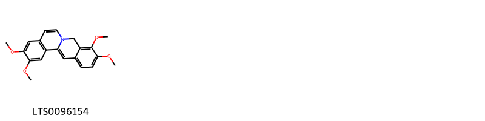
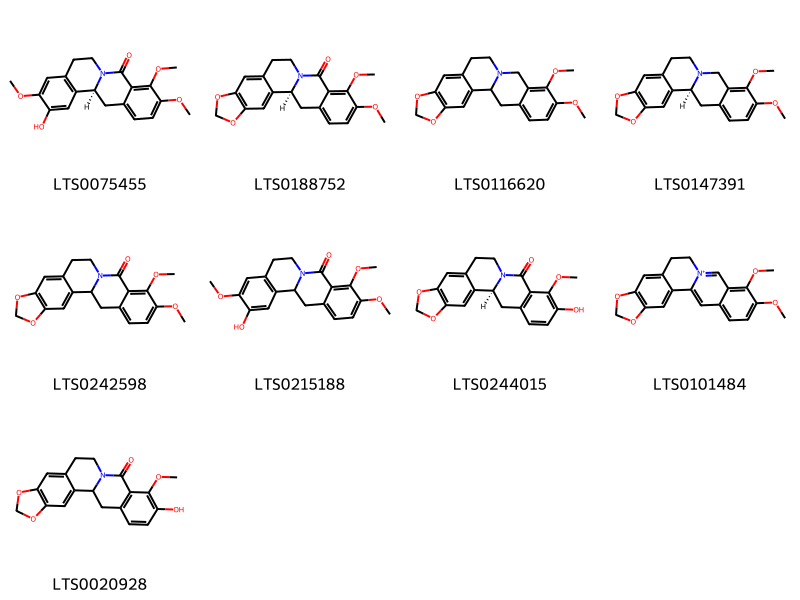

!!! abstract "Tóm tắt"
    Caulis Coscinii fenestrati là thân đã phơi hoặc sấy khô của cây Vàng đắng (Coscinium fenestratum (Gaertn.) Colerbr, Menispermum fenestratum Gaertn.), thuộc họ Tiết dê (Menispermaceae). Cây phân bố chủ yếu ở khu vực Đông và Nam Á, trong đó có Việt Nam, tập trung ở vùng núi đông Nam Bộ, nam Trung Bộ và Tây Nguyên. Thân vàng đằng thường dùng dưới dạng bột hoặc thuốc sắc, dùng trị sốt, sốt rét, lỵ, đau mắt, các bệnh về gan thận. Tác dụng dược lý của dược liệu này chủ yếu dùng để chiết berberin có tác dụng kháng khuẩn. Ngoài berberin, thân vàng đắng còn chứa các alkaloids khác như palmatin, jatrorizin,...

## Thông tin về thực vật

### Đặc điểm thực vật

Dược liệu **Vàng Đắng (Thân)** từ bộ phận **nan** từ loài *Coscinium fenestratum (Gaertn.) Colebr.* thuộc họ Menispermaceae. Vàng đắng là một cây leo to, có phân nhánh, mọc bò trên mặt đất hoặc léo lên những cây gỗ cao. Thân hình truỵ đường kính 5-10cm. Thân non màu trắng bạc, thân già màu ngà, xù xì, có vết tích lá rụng. Cắt ngành thân có hình bánh xe với những tia tủy nhiên nan hoa bánh xe, màu vàng, giữa có vòng lõi tủy xốp. Lá mọc so le, mặt trên xanh, mặt dưới màu trắng nhạt, dài 15-30cm, rộng 10-20cm, có 5 gân (3 gân nổi rõ). Mặt dưới có phủ lông tơ. Hoa màu trắng phớt tím, mọc thành xim ở kẽ lá. Cuống hoa rất ngắn. Rễ hình trụ, đầu thuôn hình nón, mặt ngoài màu trắng nhạt, mặt trong màu vàng, cắt ngang có hình bánh xe với những tia tủy hình nạn hoa. Vị đắng. 

!!! info "Phân loại thực vật của *Coscinium fenestratum*"
    - **Kingdom:** Plantae
    - **Phylum:** Tracheophyta
    - **Order:** Ranunculales
    - **Family:** Menispermaceae
    - **Genus:** Coscinium
    - **Species:** *Coscinium fenestratum*

*Tài liệu tham khảo:* "Những cây thuốc và vị thuốc Việt Nam" - Đỗ Tất Lợi

 

### Loài thay thế (Nếu có)

Dược liệu này cũng có thể từ loài *Menispermum fenestratum Gaertn.*, thông tin về phân loại thực vật loài này như sau:
!!! info "Thông tin về phân loại thực vật của *Coscinium fenestratum*"
    - **kingdom:** Plantae
    - **phylum:** Tracheophyta
    - **order:** Ranunculales
    - **family:** Menispermaceae
    - **genus:** Coscinium
    - **species:** *Coscinium fenestratum*

Hình ảnh của loài *Menispermum fenestratum Gaertn.*:

### Phân bố trên thế giới
**Từ vườn thực vật KEW: **: Chủ yếu khu vực Đông Nam và Nam Á: Borneo, Campuchia, Ấn Độ, Jawa, Lào, Malaysia, Sri Lanka, Sumatera, Thái Lan, Việt Nam.

**Từ CSDL GIBF** nan, Singapore, Indonesia, Viet Nam, Cambodia, unknown or invalid, India, Thailand, Sri Lanka, Malaysia, Lao People’s Democratic Republic

### Phân bố tại Việt Nam
** "Những cây thuốc và vị thuốc Việt Nam" - Đỗ Tất Lợi**: Mọc hoang dại rất phổ biến ở vùng rừng núi miền đông Nam Bộ, nam Trung Bộ, Tây Nguyên

**Từ CSDL GIBF**: Quang Binh, Đà Nẵng, Dong Nai

---

## Thông tin về dược liệu 

### Định danh

!!! info "Thông tin về tên gọi của nan"
    - Dược liệu tiếng Việt: nan
    - Dược liệu tiếng Trung: nan (nan)
    - Dược liệu tiếng Anh: nan
    - Dược liệu latin thông dụng: nan
    - Dược liệu latin kiểu DĐVN: caulis coscinii fenestrati
    - Dược liệu latin kiểu DĐVN: nan
    - Dược liệu latin kiểu thông tư: nan
    - Bộ phận dùng: nan (nan)

### Mô tả dược liệu 
- **Theo dược điển Việt nam V:** nan

- **Mô tả dược liệu theo thông tư chế biến dược liệu theo phương pháp cổ truyền:** nan

### Chế biến 

- **Chế biến theo dược điển việt nam V**: nan

- **Chế biến theo thông tư:** nan

--- 

## Thành phần hóa học

- Theo tài liệu của GS. Đỗ Tất Lợi:  (1) alkaloids
    
- Theo cơ sở dữ liệu lotus: Từ loài *Coscinium fenestratum* đã phân lập và xác định được 17 hoạt chất thuộc về các nhóm Steroids and steroid derivatives, Fatty Acyls, Protoberberine alkaloids and derivatives, Phenol ethers, Isoquinolines and derivatives. 

|    | chemicalTaxonomyClassyfireClass          |   smiles_count |
|---:|:-----------------------------------------|---------------:|
|  0 | Fatty Acyls                              |              1 |
|  1 | Isoquinolines and derivatives            |              3 |
|  2 | Phenol ethers                            |              1 |
|  3 | Protoberberine alkaloids and derivatives |              9 |
|  4 | Steroids and steroid derivatives         |              3 |

### Nhóm Fatty Acyls
<figure markdown="span">
    { width=100% }
    <figcaption>Hình ảnh cấu trúc hóa học của 1 hoạt chất thuộc nhóm Fatty Acyls gồm ['ceryl alcohol (LTS0140051)'].</figcaption>
</figure>
### Nhóm Isoquinolines and derivatives
<figure markdown="span">
    { width=100% }
    <figcaption>Hình ảnh cấu trúc hóa học của 3 hoạt chất thuộc nhóm Isoquinolines and derivatives gồm ['10,11-dimethoxy-2,3,6,7-tetrahydro-1,4-dioxa-8-azapentaphen-9-one (LTS0097464)', '3,4,10,11-tetramethoxy-7,8-dihydro-6-azatetraphen-5-one (LTS0238575)', '8-oxyberberine (LTS0237537)'].</figcaption>
</figure>
### Nhóm Phenol ethers
<figure markdown="span">
    { width=100% }
    <figcaption>Hình ảnh cấu trúc hóa học của 1 hoạt chất thuộc nhóm Phenol ethers gồm ['3,4,10,11-tetramethoxy-5h-6-azatetraphene (LTS0096154)'].</figcaption>
</figure>
### Nhóm Protoberberine alkaloids and derivatives
<figure markdown="span">
    { width=100% }
    <figcaption>Hình ảnh cấu trúc hóa học của 9 hoạt chất thuộc nhóm Protoberberine alkaloids and derivatives gồm ['(12bs)-11-hydroxy-3,4,10-trimethoxy-7,8,12b,13-tetrahydro-6-azatetraphen-5-one (LTS0075455)', '(1s)-16,17-dimethoxy-5,7-dioxa-13-azapentacyclo[11.8.0.0²,¹⁰.0⁴,⁸.0¹⁵,²⁰]henicosa-2,4(8),9,15,17,19-hexaen-14-one (LTS0188752)', 'canadin (LTS0116620)', '(s)-canadine (LTS0147391)', '16,17-dimethoxy-5,7-dioxa-13-azapentacyclo[11.8.0.0²,¹⁰.0⁴,⁸.0¹⁵,²⁰]henicosa-2,4(8),9,15,17,19-hexaen-14-one (LTS0242598)', '11-hydroxy-3,4,10-trimethoxy-7,8,12b,13-tetrahydro-6-azatetraphen-5-one (LTS0215188)', '(1s)-17-hydroxy-16-methoxy-5,7-dioxa-13-azapentacyclo[11.8.0.0²,¹⁰.0⁴,⁸.0¹⁵,²⁰]henicosa-2,4(8),9,15(20),16,18-hexaen-14-one (LTS0244015)', 'berberine (LTS0101484)', '17-hydroxy-16-methoxy-5,7-dioxa-13-azapentacyclo[11.8.0.0²,¹⁰.0⁴,⁸.0¹⁵,²⁰]henicosa-2,4(8),9,15(20),16,18-hexaen-14-one (LTS0020928)'].</figcaption>
</figure>
### Nhóm Steroids and steroid derivatives
<figure markdown="span">
    { width=100% }
    <figcaption>Hình ảnh cấu trúc hóa học của 3 hoạt chất thuộc nhóm Steroids and steroid derivatives gồm ['stigmast-5-en-3-ol (LTS0071224)', 'stigmast-5-en-3-ol, (3β)- (LTS0204616)', 'phytosterol (LTS0029311)'].</figcaption>
</figure>

---

## Tác dụng dược lý

Theo tài liệu "Những cây thuốc và vị thuốc Việt Nam" - Đỗ Tất Lợi:- Chiết xuất berberin trị sốt, sốt rét, lỵ, đau mắt
- Chữa bệnh về gan mật: vàng dạ, ăn uống khó tiêu 
- Dùng ngoài: trị đau mắt

Theo tài liệu quốc tế: nan

---

## Dược điển Việt Nam V

### Soi bột:
nan
<!-- Hình ảnh soi bột sẽ được tự động chèn vào đây sau -->
### Vi phẫu:
nan
<!-- Hình ảnh vi phẫu sẽ được tự động chèn vào đây sau -->
### Định tính

nan

### Định lượng

nan

### Thông tin khác 
- ** Độ ẩm: ** nan

- ** Bảo quản:** nan
## Dược điển Hồng kong

<!-- PDF sẽ được tự động chèn vào đây sau -->

---

## Y dược học cổ truyền

- **Tên vị thuốc:** nan
- **Tính vị quy kinh:** Khổ, hàn. Vào kinh tỳ, vị, can, đởm, đại tràng
- **Công năng chủ trị:** Công năng: thân nhiệt, giải độc, sát trùng, lợi thấp, lợi mật
Chủ trị: viêm ruột, ỉa chảy, viêm túi mật, viêm gan
- **Chú ý:** nan
- **Kiêng kỵ:** nan

