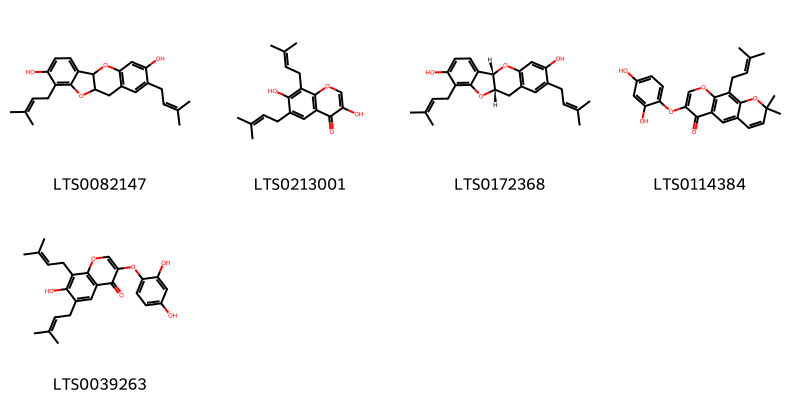
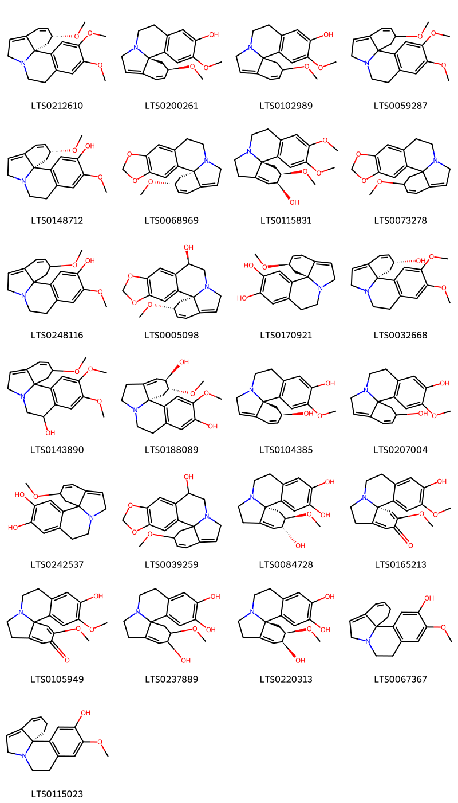
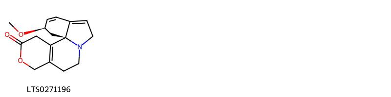
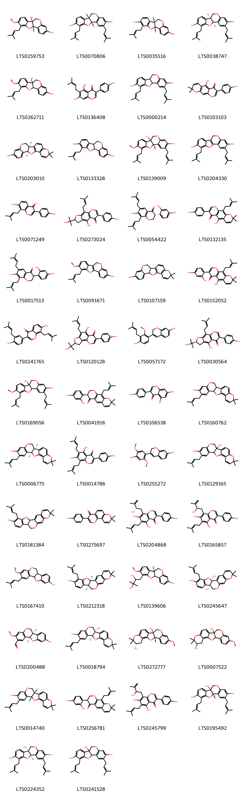
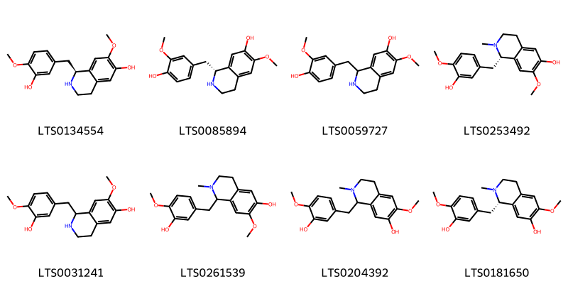
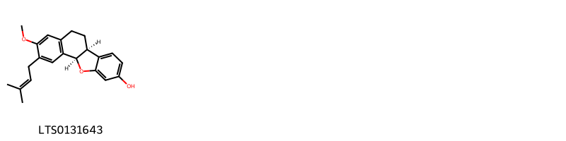

!!! abstract "Tóm tắt"
    Tên khoa học của dược liệu: Folium Erythrinae variegatae,  họ Đậu (Fabaceae), phân bố trên thế giới: Bản địa: Nam-Trung Trung Quốc, Đông Nam Trung Quốc,Marianas, Marquesas,, Sri Lanka, Sulawesi, Sumatera, Đài Loan, Tanzania, Thái Lan, Tonga, Tuamotu, Việt Nam, Tây Himalaya,...Di Thực: Cape Verde, Quần đảo Chagos, Cộng hòa Dominica, Uganda, Đảo Wallis-Futuna, Đảo Windward,... . Phạm vi bản địa của loài này là Tanzania đến Thái Bình Dương. Kinh nghiệm sử dụng y học cổ truyền: Thuốc an thần gây ngủ. Rượu lá vông nem dùng với 1-2g 1 ngày hoặc dùng siro lá vông ( vừa đủ 500 ml) uống môix ngày 20 ml truwocs khi đi ngủ. Dùng chữa lưng gối đau nhức, tê liệt, lở ngứa. Tác dụng dược lý: Lá và thân đều chứa một ancaloit độc érytrin (Erythrine) có tác dụng làm giảm và có khi làm mất hẳn hoạt động thần kinh trung ương, tuy nhiên không ảnh hưởng tới độ kích thích vận động và sự co bóp của cơ. Tác giả còn lấy được chất saponin gọi là migarin (migarrhin) có tính chất làm giãn đồng tử.Thành phần hoá học; Lá và thân đều chưa 1 loại ankaloid độc erythine ( Erythrine), tác giả còn lấy được chất saporin gọi là migarin ( migarrhin).

## Thông tin về thực vật

### Đặc điểm thực vật

Dược liệu **Vông Nem ( Lá)** từ bộ phận **** từ loài *Erythrina variegata L.* thuộc họ Fabaceae. Cây cao từ 10-20m, mọc khắp nơi, nhưng đặc biệt ưa mọc ở ven biển, thân có gai ngắn. Lá gồm 3 lá chét giữa rộng hơn là dài, dài 10-15cm, hai lá chết hai bên dài hơn rộng hình 3 cạnh. Hoa màu đỏ tươi tụ họp từ 1-3 thành chùm dầy. Quả giáp dài 15-30cm, đen, hơi hẹp lại ở giữa các hạt. Trong mỗi quả có 5-6 hạt hình thận màu đỏ hoặc nâu, tễ rộng, hình trứng đen có vành trắng. 

!!! info "Phân loại thực vật của *Erythrina variegata*"
    - **Kingdom:** Plantae
    - **Phylum:** Tracheophyta
    - **Order:** Fabales
    - **Family:** Fabaceae
    - **Genus:** Erythrina
    - **Species:** *Erythrina variegata*

*Tài liệu tham khảo:* "Những cây thuốc và vị thuốc Việt Nam" - Đỗ Tất Lợi

 

### Loài thay thế (Nếu có)

Dược liệu này cũng có thể từ loài *Erythrina indica Lamk*, thông tin về phân loại thực vật loài này như sau:
!!! info "Thông tin về phân loại thực vật của *Erythrina indica*"
    - **kingdom:** Plantae
    - **phylum:** Tracheophyta
    - **order:** Fabales
    - **family:** Fabaceae
    - **genus:** Erythrina
    - **species:** *Erythrina indica*

Hình ảnh của loài *Erythrina indica Lamk*:

### Phân bố trên thế giới
**Từ vườn thực vật KEW: **: Native to:

Alabama, Aldabra, Andaman Is., Angola, Argentina Northeast, Argentina Northwest, Arizona, Aruba, Assam, Bangladesh, Belize, Benin, Bismarck Archipelago, Bolivia, Borneo, Botswana, Brazil North, Brazil Northeast, Brazil South, Brazil Southeast, Brazil West-Central, Burkina, Burundi, Cambodia, Cameroon, Cape Provinces, Caprivi Strip, Caroline Is., Cayman Is., Central African Republic, Central American Pacific Is., Chad, China South-Central, China Southeast, Christmas I., Cocos (Keeling) Is., Colombia, Comoros, Congo, Cook Is., Costa Rica, Cuba, Dominican Republic, East Himalaya, Ecuador, El Salvador, Equatorial Guinea, Eritrea, Ethiopia, Fiji, Florida, Free State, French Guiana, Gabon, Galápagos, Gambia, Georgia, Ghana, Guatemala, Guinea, Guinea-Bissau, Gulf of Guinea Is., Guyana, Hainan, Haiti, Hawaii, Honduras, India, Ivory Coast, Jamaica, Jawa, Kenya, KwaZulu-Natal, Laccadive Is., Laos, Leeward Is., Lesotho, Lesser Sunda Is., Liberia, Louisiana, Madagascar, Malawi, Malaya, Maldives, Mali, Maluku, Marianas, Marquesas, Marshall Is., Mauritania, Mexico Central, Mexico Gulf, Mexico Northeast, Mexico Northwest, Mexico Southeast, Mexico Southwest, Mississippi, Mozambique, Myanmar, Namibia, Nansei-shoto, Nauru, Nepal, Netherlands Antilles, New Caledonia, New Guinea, New Mexico, New South Wales, Nicaragua, Nicobar Is., Niger, Nigeria, Niue, North Carolina, Northern Provinces, Northern Territory, Pakistan, Panamá, Paraguay, Peru, Philippines, Puerto Rico, Queensland, Rwanda, Samoa, Senegal, Seychelles, Sierra Leone, Society Is., Socotra, Solomon Is., Somalia, South Australia, South Carolina, South China Sea, Southwest Caribbean, Sri Lanka, Sudan, Sulawesi, Sumatera, Suriname, Swaziland, Taiwan, Tanzania, Texas, Thailand, Tibet, Togo, Tonga, Trinidad-Tobago, Tuamotu, Tubuai Is., Uganda, Uruguay, Vanuatu, Venezuela, Venezuelan Antilles, Vietnam, West Himalaya, Western Australia, Windward Is., Zambia, Zaïre, Zimbabwe

Introduced into:

Cape Verde, Chagos Archipelago, East Aegean Is., Egypt, Line Is., Madeira, Mauritius, New Zealand North, New Zealand South, Norfolk Is., Ogasawara-shoto, Pitcairn Is., Rodrigues, Réunion, St.Helena, Wallis-Futuna Is.

**Từ CSDL GIBF** Wallis and Futuna, Mauritius, Réunion, Benin, Australia, Belgium, New Caledonia, Cambodia, Nigeria, Madagascar, Haiti, Malaysia, Pakistan, Thailand, Papua New Guinea, United Arab Emirates, Brazil, Honduras, Indonesia, Hong Kong, Vanuatu, Senegal, Tonga, India, Mexico, Panama, Costa Rica, French Southern Territories, Northern Mariana Islands, Nicaragua, Colombia, Nauru, French Polynesia, China, Ecuador, Japan, Peru, Bonaire, Sint Eustatius and Saba, Cuba, Dominican Republic, Guam, Nepal, Viet Nam, United States of America, Chinese Taipei, Venezuela (Bolivarian Republic of), Timor-Leste, Sri Lanka, Barbados

### Phân bố tại Việt Nam
** "Những cây thuốc và vị thuốc Việt Nam" - Đỗ Tất Lợi**: Mọc hoang và được trồng ở khắp nơi trong nước ta để làm hàng rào và lấy lá ăn, hoặc làm cảnh.

**Từ CSDL GIBF**: Không có ghi nhận ở Việt Nam

---

## Thông tin về dược liệu 

### Định danh

!!! info "Thông tin về tên gọi của vông nem"
    - Dược liệu tiếng Việt: vông nem
    - Dược liệu tiếng Trung:  ()
    - Dược liệu tiếng Anh: 
    - Dược liệu latin thông dụng: Folium Erythrinae variegatae
    - Dược liệu latin kiểu DĐVN: folium erythrinae variegatae
    - Dược liệu latin kiểu DĐVN: 
    - Dược liệu latin kiểu thông tư: 
    - Bộ phận dùng:  (Folium)

### Mô tả dược liệu 
- **Theo dược điển Việt nam V:** Lá có cuống dài gom ba lá chét. Mỗi lá chét hình gần như ba cạnh, đâu lá thuôn nhọn, đáy vát tròn, mép lá nguyên, mặt lá nhẵn. Mỗi lá chét dài 6 cm đến 13 cm. rộng 6 cm đến 15 cm. Lá chét giữa thường có chiều rộng lớn hơn chiều dài. lá khô có màn lục xám, nhăn nheo, nhàu nát. Thường được cắt bỏ cuống hoặc để cuống dài dưới 1 cm.

- **Mô tả dược liệu theo thông tư chế biến dược liệu theo phương pháp cổ truyền:** 

### Chế biến 

- **Chế biến theo dược điển việt nam V**: Thu hoạch vào mùa xuân, khi trời khô ráo, cắt lấy lá bánh tẻ không bị sâu hại, phơi âm can hoặc sấy nhẹ (ở 40 °C đen 50 °C) đến khô.

- **Chế biến theo thông tư:** 

--- 

## Thành phần hóa học

- Theo tài liệu của GS. Đỗ Tất Lợi:  (1)Lá và thân đều chưa 1 loại ankaloid độc erythine ( Erythrine), tác giả còn lấy được chất saporin gọi là migarin ( migarrhin)
(2)  alkaloids
    
- Theo cơ sở dữ liệu lotus: Từ loài *Erythrina variegata* đã phân lập và xác định được 204 hoạt chất thuộc về các nhóm Linear 1,3-diarylpropanoids, Naphthofurans, Protoberberine alkaloids and derivatives, Isoflavonoids, Benzopyrans, Steroids and steroid derivatives, Prenol lipids, Erythrina alkaloids, Indoles and derivatives, Carboxylic acids and derivatives, Isoquinolines and derivatives, Phenol ethers, Coumarans, Cinnamic acids and derivatives, Flavonoids, 2-arylbenzofuran flavonoids. 

|    | chemicalTaxonomyClassyfireClass          |   smiles_count |
|---:|:-----------------------------------------|---------------:|
|  0 | 2-arylbenzofuran flavonoids              |              3 |
|  1 | Benzopyrans                              |              5 |
|  2 | Carboxylic acids and derivatives         |              2 |
|  3 | Cinnamic acids and derivatives           |              4 |
|  4 | Coumarans                                |              3 |
|  5 | Erythrina alkaloids                      |             25 |
|  6 | Flavonoids                               |              7 |
|  7 | Indoles and derivatives                  |              1 |
|  8 | Isoflavonoids                            |            118 |
|  9 | Isoquinolines and derivatives            |              8 |
| 10 | Linear 1,3-diarylpropanoids              |              7 |
| 11 | Naphthofurans                            |              1 |
| 12 | Phenol ethers                            |              1 |
| 13 | Prenol lipids                            |              8 |
| 14 | Protoberberine alkaloids and derivatives |              4 |
| 15 | Steroids and steroid derivatives         |              7 |

### Nhóm 2-arylbenzofuran flavonoids
<figure markdown="span">
    { width=100% }
    <figcaption>Hình ảnh cấu trúc hóa học của 3 hoạt chất thuộc nhóm 2-arylbenzofuran flavonoids gồm ['2-(4-hydroxy-2,5-dimethoxyphenyl)-1-benzofuran-6-ol (LTS0206225)', '2-[4-hydroxy-2-methoxy-3-(3-methylbut-2-en-1-yl)phenyl]-1-benzofuran-6-ol (LTS0267727)', '2-(5-methoxy-2,2-dimethylchromen-6-yl)-1-benzofuran-6-ol (LTS0226156)'].</figcaption>
</figure>
### Nhóm Benzopyrans
<figure markdown="span">
    { width=100% }
    <figcaption>Hình ảnh cấu trúc hóa học của 5 hoạt chất thuộc nhóm Benzopyrans gồm ['5,15-bis(3-methylbut-2-en-1-yl)-9,17-dioxatetracyclo[8.7.0.0³,⁸.0¹¹,¹⁶]heptadeca-3(8),4,6,11,13,15-hexaene-6,14-diol (LTS0082147)', '3,7-dihydroxy-6,8-bis(3-methylbut-2-en-1-yl)chromen-4-one (LTS0213001)', '(1s,10s)-5,15-bis(3-methylbut-2-en-1-yl)-9,17-dioxatetracyclo[8.7.0.0³,⁸.0¹¹,¹⁶]heptadeca-3(8),4,6,11,13,15-hexaene-6,14-diol (LTS0172368)', '3-(2,4-dihydroxyphenoxy)-8,8-dimethyl-10-(3-methylbut-2-en-1-yl)pyrano[3,2-g]chromen-4-one (LTS0114384)', '3-(2,4-dihydroxyphenoxy)-7-hydroxy-6,8-bis(3-methylbut-2-en-1-yl)chromen-4-one (LTS0039263)'].</figcaption>
</figure>
### Nhóm Carboxylic acids and derivatives
<figure markdown="span">
    { width=100% }
    <figcaption>Hình ảnh cấu trúc hóa học của 2 hoạt chất thuộc nhóm Carboxylic acids and derivatives gồm ['methyl (2s)-2-(dimethylamino)-3-(1h-indol-3-yl)propanoate (LTS0145067)', 'methyl 2-(dimethylamino)-3-(1h-indol-3-yl)propanoate (LTS0227708)'].</figcaption>
</figure>
### Nhóm Cinnamic acids and derivatives
<figure markdown="span">
    { width=100% }
    <figcaption>Hình ảnh cấu trúc hóa học của 4 hoạt chất thuộc nhóm Cinnamic acids and derivatives gồm ['octacosyl 3-(4-hydroxy-3-methoxyphenyl)prop-2-enoate (LTS0247255)', 'octacosyl (2e)-3-(4-hydroxy-3-methoxyphenyl)prop-2-enoate (LTS0116696)', 'heptacosyl (2e)-3-(4-hydroxy-3-methoxyphenyl)prop-2-enoate (LTS0147574)', 'heptacosyl 3-(4-hydroxy-3-methoxyphenyl)prop-2-enoate (LTS0243451)'].</figcaption>
</figure>
### Nhóm Coumarans
<figure markdown="span">
    { width=100% }
    <figcaption>Hình ảnh cấu trúc hóa học của 3 hoạt chất thuộc nhóm Coumarans gồm ['(1r,2s,10s)-2,10-dihydroxy-14-methoxy-15-(3-methylbut-2-en-1-yl)-8,17-dioxatetracyclo[8.7.0.0²,⁷.0¹¹,¹⁶]heptadeca-3,6,11,13,15-pentaen-5-one (LTS0271078)', '2,10-dihydroxy-14-methoxy-15-(3-methylbut-2-en-1-yl)-8,17-dioxatetracyclo[8.7.0.0²,⁷.0¹¹,¹⁶]heptadeca-3,6,11,13,15-pentaen-5-one (LTS0198102)', '(1s,2s,10s)-2,10-dihydroxy-14-methoxy-15-(3-methylbut-2-en-1-yl)-8,17-dioxatetracyclo[8.7.0.0²,⁷.0¹¹,¹⁶]heptadeca-3,6,11,13,15-pentaen-5-one (LTS0233088)'].</figcaption>
</figure>
### Nhóm Erythrina alkaloids
<figure markdown="span">
    { width=100% }
    <figcaption>Hình ảnh cấu trúc hóa học của 25 hoạt chất thuộc nhóm Erythrina alkaloids gồm ['erysotrine (LTS0212610)', 'erysodine (LTS0200261)', '8,11-dimethoxy-2h,4h,5h,10h,11h-indolo[7a,1-a]isoquinolin-7-ol (LTS0102989)', '7,8,11-trimethoxy-2h,4h,5h,10h,11h-indolo[7a,1-a]isoquinoline (LTS0059287)', '(9bs,11r)-7,11-dimethoxy-2h,4h,5h,10h,11h-indolo[7a,1-a]isoquinolin-8-ol (LTS0148712)', 'erythraline (LTS0068969)', 'erythratidine (LTS0115831)', '19-methoxy-5,7-dioxa-13-azapentacyclo[11.7.0.0¹,¹⁶.0²,¹⁰.0⁴,⁸]icosa-2,4(8),9,15,17-pentaene (LTS0073278)', '7,11-dimethoxy-2h,4h,5h,10h,11h-indolo[7a,1-a]isoquinolin-8-ol (LTS0248116)', '(1s,11r,19r)-19-methoxy-5,7-dioxa-13-azapentacyclo[11.7.0.0¹,¹⁶.0²,¹⁰.0⁴,⁸]icosa-2,4(8),9,15,17-pentaen-11-ol (LTS0005098)', '(9bs,11r)-11-methoxy-2h,4h,5h,10h,11h-indolo[7a,1-a]isoquinoline-7,8-diol (LTS0170921)', 'erythravine (LTS0032668)', '7,8,11-trimethoxy-2h,4h,5h,10h,11h-indolo[7a,1-a]isoquinolin-5-ol (LTS0143890)', '(9bs,11r,12r)-8,11-dimethoxy-1h,2h,4h,5h,10h,11h,12h-indolo[7a,1-a]isoquinoline-7,12-diol (LTS0188089)', 'erysonine (LTS0104385)', '8-methoxy-2h,4h,5h,10h,11h-indolo[7a,1-a]isoquinoline-7,11-diol (LTS0207004)', '11-methoxy-2h,4h,5h,10h,11h-indolo[7a,1-a]isoquinoline-7,8-diol (LTS0242537)', '19-methoxy-5,7-dioxa-13-azapentacyclo[11.7.0.0¹,¹⁶.0²,¹⁰.0⁴,⁸]icosa-2,4(8),9,15,17-pentaen-11-ol (LTS0039259)', '(9br,11r,12r)-11-methoxy-1h,2h,4h,5h,10h,11h,12h-indolo[7a,1-a]isoquinoline-7,8,12-triol (LTS0084728)', '(9br)-7-hydroxy-8,11-dimethoxy-1h,2h,4h,5h-indolo[7a,1-a]isoquinolin-12-one (LTS0165213)', '7-hydroxy-8,11-dimethoxy-1h,2h,4h,5h-indolo[7a,1-a]isoquinolin-12-one (LTS0105949)', '11-methoxy-1h,2h,4h,5h,10h,11h,12h-indolo[7a,1-a]isoquinoline-7,8,12-triol (LTS0237889)', '(9bs,11r,12s)-11-methoxy-1h,2h,4h,5h,10h,11h,12h-indolo[7a,1-a]isoquinoline-7,8,12-triol (LTS0220313)', '7-methoxy-2h,4h,5h,10h,11h-indolo[7a,1-a]isoquinolin-8-ol (LTS0067367)', '(9bs)-7-methoxy-2h,4h,5h,10h,11h-indolo[7a,1-a]isoquinolin-8-ol (LTS0115023)'].</figcaption>
</figure>
### Nhóm Flavonoids
<figure markdown="span">
    { width=100% }
    <figcaption>Hình ảnh cấu trúc hóa học của 7 hoạt chất thuộc nhóm Flavonoids gồm ['5,7-dihydroxy-2-[4-hydroxy-3,5-bis(3-methylbut-2-en-1-yl)phenyl]-2,3-dihydro-1-benzopyran-4-one (LTS0270471)', '(2s)-2-[(3s)-3,8-dihydroxy-2,2-dimethyl-3,4-dihydro-1-benzopyran-6-yl]-5,7-dihydroxy-2,3-dihydro-1-benzopyran-4-one (LTS0093367)', '(2s)-7-hydroxy-2-(4-hydroxyphenyl)-8-(3-methylbut-2-en-1-yl)-2,3-dihydro-1-benzopyran-4-one (LTS0113943)', '(2r)-5,7-dihydroxy-2-[4-hydroxy-3,5-bis(3-methylbut-2-en-1-yl)phenyl]-2,3-dihydro-1-benzopyran-4-one (LTS0233525)', '(2r)-5,7-dihydroxy-2-[4-hydroxy-3,5-bis(3-methylbut-2-en-1-yl)phenyl]-6-(3-methylbut-2-en-1-yl)-2,3-dihydro-1-benzopyran-4-one (LTS0037766)', 'sophoraflavanone b (LTS0099349)', '5,7-dihydroxy-2-[4-hydroxy-3,5-bis(3-methylbut-2-en-1-yl)phenyl]-6-(3-methylbut-2-en-1-yl)-2,3-dihydro-1-benzopyran-4-one (LTS0209394)'].</figcaption>
</figure>
### Nhóm Indoles and derivatives
<figure markdown="span">
    { width=100% }
    <figcaption>Hình ảnh cấu trúc hóa học của 1 hoạt chất thuộc nhóm Indoles and derivatives gồm ['β-erythroidine (LTS0271196)'].</figcaption>
</figure>
### Nhóm Isoflavonoids
<figure markdown="span">
    { width=100% }
    <figcaption>Hình ảnh cấu trúc hóa học của 118 hoạt chất thuộc nhóm Isoflavonoids gồm ['cristacarpin (LTS0259753)', '(1r,10r)-4,15-bis(3-methylbut-2-en-1-yl)-8,17-dioxatetracyclo[8.7.0.0²,⁷.0¹¹,¹⁶]heptadeca-2(7),3,5,11,13,15-hexaene-5,14-diol (LTS0070806)', '(1r,10r)-15-(3-methylbut-2-en-1-yl)-8,17-dioxatetracyclo[8.7.0.0²,⁷.0¹¹,¹⁶]heptadeca-2,4,6,11(16),12,14-hexaene-5,14-diol (LTS0035516)', '(1s,10s)-4,15-bis(3-methylbut-2-en-1-yl)-8,17-dioxatetracyclo[8.7.0.0²,⁷.0¹¹,¹⁶]heptadeca-2(7),3,5,11,13,15-hexaene-5,14-diol (LTS0038747)', '14-methoxy-15-(3-methylbut-2-en-1-yl)-8,17-dioxatetracyclo[8.7.0.0²,⁷.0¹¹,¹⁶]heptadeca-2,4,6,11,13,15-hexaene-5,10-diol (LTS0262711)', 'wighteone (LTS0136408)', 'erythrabyssin ii (LTS0000214)', 'alpinumisoflavone (LTS0103103)', '(-)-phaseollin (LTS0203010)', '15-(3-methylbut-2-en-1-yl)-8,17-dioxatetracyclo[8.7.0.0²,⁷.0¹¹,¹⁶]heptadeca-2,4,6,11(16),12,14-hexaene-5,14-diol (LTS0133328)', 'erystagallin a (LTS0139009)', 'erycristagallin (LTS0204330)', '7-hydroxy-3-(4-hydroxyphenyl)-8-(3-methylbut-2-en-1-yl)chromen-4-one (LTS0071249)', 'senegalensin (LTS0273024)', '(3r)-3-(2,4-dihydroxyphenyl)-7-hydroxy-6,8-bis(3-methylbut-2-en-1-yl)-2,3-dihydro-1-benzopyran-4-one (LTS0054422)', 'warangalone (LTS0132135)', '3-(2,4-dihydroxyphenyl)-7-hydroxy-6,8-bis(3-methylbut-2-en-1-yl)-2,3-dihydro-1-benzopyran-4-one (LTS0017513)', '14-methoxy-15-(3-methylbut-2-en-1-yl)-8,17-dioxatetracyclo[8.7.0.0²,⁷.0¹¹,¹⁶]heptadeca-1(10),2,4,6,11,13,15-heptaen-5-ol (LTS0091671)', '17,17-dimethyl-4,12,18-trioxapentacyclo[11.8.0.0²,¹¹.0⁵,¹⁰.0¹⁴,¹⁹]henicosa-1(13),5,7,9,14(19),15,20-heptaen-7-ol (LTS0107159)', 'auriculatin (LTS0152052)', '7-hydroxy-3-[4-hydroxy-3-(3-methylbut-2-en-1-yl)phenyl]-8-(3-methylbut-2-en-1-yl)chromen-4-one (LTS0241765)', 'euchrenone b10 (LTS0120128)', '3-[4-hydroxy-2-methoxy-3-(3-methylbut-2-en-1-yl)phenyl]-2h-chromen-7-ol (LTS0057172)', '(2s)-4-hydroxy-6-(4-hydroxyphenyl)-2-(2-hydroxypropan-2-yl)-9-(3-methylbut-2-en-1-yl)-2h,3h-furo[3,2-g]chromen-5-one (LTS0030564)', '14-methoxy-4,15-bis(3-methylbut-2-en-1-yl)-8,17-dioxatetracyclo[8.7.0.0²,⁷.0¹¹,¹⁶]heptadeca-2,4,6,11,13,15-hexaene-5,10-diol (LTS0169056)', '(3s)-3-(2,4-dihydroxyphenyl)-8,8-dimethyl-10-(3-methylbut-2-en-1-yl)-2h,3h-pyrano[3,2-g]chromen-4-one (LTS0041916)', 'genistein (LTS0106538)', 'folitenol (LTS0160762)', '(2r,11r)-17,17-dimethyl-8-(3-methylbut-2-en-1-yl)-4,12,18-trioxapentacyclo[11.8.0.0²,¹¹.0⁵,¹⁰.0¹⁴,¹⁹]henicosa-1(21),5(10),6,8,13,15,19-heptaen-7-ol (LTS0006775)', '6,8-diprenylgenistein (LTS0014786)', '3-(4-hydroxy-2,5-dimethoxyphenyl)-2h-chromen-7-ol (LTS0255272)', '17,17-dimethyl-8-(3-methylbut-2-en-1-yl)-4,12,18-trioxapentacyclo[11.8.0.0²,¹¹.0⁵,¹⁰.0¹⁴,¹⁹]henicosa-1(21),5(10),6,8,13,15,19-heptaene-2,7-diol (LTS0129165)', '17,17-dimethyl-5-(3-methylbut-2-en-1-yl)-3,12,16-trioxapentacyclo[11.8.0.0²,¹⁰.0⁴,⁹.0¹⁵,²⁰]henicosa-1(21),4(9),5,7,13,15(20),18-heptaen-6-ol (LTS0181384)', '3-(4-hydroxyphenyl)-8,8-dimethylpyrano[2,3-f]chromen-4-one (LTS0275697)', '5,7-dihydroxy-8-[(2s)-2-hydroxy-3-methylbut-3-en-1-yl]-3-(4-hydroxyphenyl)-6-(3-methylbut-2-en-1-yl)chromen-4-one (LTS0204868)', '5,7-dihydroxy-8-[(2r)-2-hydroxy-3-methylbut-3-en-1-yl]-3-(4-hydroxyphenyl)-6-(3-methylbut-2-en-1-yl)chromen-4-one (LTS0165857)', '5-methoxy-4-(3-methylbut-2-en-1-yl)-8,17-dioxatetracyclo[8.7.0.0²,⁷.0¹¹,¹⁶]heptadeca-2(7),3,5,11,13,15-hexaen-14-ol (LTS0167410)', '(2r,10r)-17,17-dimethyl-5-(3-methylbut-2-en-1-yl)-3,12,16-trioxapentacyclo[11.8.0.0²,¹⁰.0⁴,⁹.0¹⁵,²⁰]henicosa-1(21),4(9),5,7,13,15(20),18-heptaen-6-ol (LTS0212318)', '15-(2,3-dihydroxy-3-methylbutyl)-14-methoxy-8,17-dioxatetracyclo[8.7.0.0²,⁷.0¹¹,¹⁶]heptadeca-2,4,6,11,13,15-hexaene-5,10-diol (LTS0139606)', 'orientanol c (LTS0245647)', '(1r,10r)-14-hydroxy-5-methoxy-8,17-dioxatetracyclo[8.7.0.0²,⁷.0¹¹,¹⁶]heptadeca-2(7),3,5,11,13,15-hexaene-4-carbaldehyde (LTS0200488)', '(2s,11s)-17,17-dimethyl-8-(3-methylbut-2-en-1-yl)-4,12,18-trioxapentacyclo[11.8.0.0²,¹¹.0⁵,¹⁰.0¹⁴,¹⁹]henicosa-1(21),5(10),6,8,13,15,19-heptaene-2,7-diol (LTS0018794)', '(2s,11s,16s)-7-methoxy-17,17-dimethyl-4,12,18-trioxapentacyclo[11.8.0.0²,¹¹.0⁵,¹⁰.0¹⁴,¹⁹]henicosa-1(21),5,7,9,13,19-hexaene-2,16-diol (LTS0272777)', '7-methoxy-17,17-dimethyl-4,12,18-trioxapentacyclo[11.8.0.0²,¹¹.0⁵,¹⁰.0¹⁴,¹⁹]henicosa-1(21),5,7,9,13,19-hexaene-2,16-diol (LTS0007522)', '(2s,11s)-17,17-dimethyl-8-(3-methylbut-2-en-1-yl)-4,12,18-trioxapentacyclo[11.8.0.0²,¹¹.0⁵,¹⁰.0¹⁴,¹⁹]henicosa-1(21),5(10),6,8,13,15,19-heptaen-7-ol (LTS0014740)', '3-(2,4-dihydroxyphenyl)-8,8-dimethyl-10-(3-methylbut-2-en-1-yl)-2h,3h-pyrano[3,2-g]chromen-4-one (LTS0256781)', '5,7-dihydroxy-8-(2-hydroxy-3-methylbut-3-en-1-yl)-3-(4-hydroxyphenyl)-6-(3-methylbut-2-en-1-yl)chromen-4-one (LTS0245799)', '(1s,10s)-4,15-bis(3-methylbut-2-en-1-yl)-8,17-dioxatetracyclo[8.7.0.0²,⁷.0¹¹,¹⁶]heptadeca-2(7),3,5,11,13,15-hexaene-5,10,14-triol (LTS0195492)', '(1r,10r)-4,15-bis(3-methylbut-2-en-1-yl)-8,17-dioxatetracyclo[8.7.0.0²,⁷.0¹¹,¹⁶]heptadeca-2(7),3,5,11,13,15-hexaene-5,10,14-triol (LTS0224352)', '4,15-bis(3-methylbut-2-en-1-yl)-8,17-dioxatetracyclo[8.7.0.0²,⁷.0¹¹,¹⁶]heptadeca-2(7),3,5,11,13,15-hexaene-5,10,14-triol (LTS0241528)', 'alpinumisoflavone dimethyl ether (LTS0256811)', '5,7-dihydroxy-6-[(2r)-2-hydroxy-3-methylbut-3-en-1-yl]-3-(4-hydroxyphenyl)-8-(3-methylbut-2-en-1-yl)chromen-4-one (LTS0213820)', '4-hydroxy-3-(4-hydroxyphenyl)-5-methoxy-8,8-dimethylpyrano[3,2-g]chromen-2-one (LTS0135967)', '3-(4-hydroxyphenyl)-5-methoxy-8,8-dimethylpyrano[3,2-g]chromen-4-one (LTS0111147)', '(3s)-3-(2,4-dihydroxyphenyl)-5,7-dihydroxy-6,8-bis(3-methylbut-2-en-1-yl)-2,3-dihydro-1-benzopyran-4-one (LTS0059752)', '5-hydroxy-4-methoxy-6-(4-methoxyphenyl)-2-(prop-1-en-2-yl)-2h,3h-furo[3,2-g]chromen-7-one (LTS0098396)', '5,7-dihydroxy-8-[(2r)-2-hydroxy-3-methylbut-3-en-1-yl]-6-(3-methylbut-2-en-1-yl)-3-(4-methylphenyl)chromen-4-one (LTS0071921)', '(2r)-4-hydroxy-6-(4-hydroxyphenyl)-2-(2-hydroxypropan-2-yl)-9-(3-methylbut-2-en-1-yl)-2h,3h-furo[3,2-g]chromen-5-one (LTS0099371)', 'daidzein (LTS0130369)', '(2r)-5-hydroxy-4-methoxy-6-(4-methoxyphenyl)-2-(prop-1-en-2-yl)-2h,3h-furo[3,2-g]chromen-7-one (LTS0123422)', '3-o-methylcalopocarpin (LTS0197496)', '2-hydroxy-5-methoxy-3-(4-methoxyphenyl)-8,8-dimethylpyrano[3,2-g]chromen-4-one (LTS0133519)', '(3r)-3-(2,4-dihydroxyphenyl)-3,7-dihydroxy-6,8-bis(3-methylbut-2-en-1-yl)-2h-1-benzopyran-4-one (LTS0142856)', '5,7-dihydroxy-6-(2-hydroxy-3-methylbut-3-en-1-yl)-3-(4-hydroxyphenyl)chromen-4-one (LTS0151473)', '(2s,11s)-17,17-dimethyl-4,12,18-trioxapentacyclo[11.8.0.0²,¹¹.0⁵,¹⁰.0¹⁴,¹⁹]henicosa-1(13),5,7,9,14(19),15,20-heptaen-7-ol (LTS0156776)', '3-(2,4-dihydroxyphenyl)-5,7-dihydroxy-6,8-bis(3-methylbut-2-en-1-yl)-2,3-dihydro-1-benzopyran-4-one (LTS0219734)', '5,7-dihydroxy-8-(2-hydroxy-3-methylbut-3-en-1-yl)-3-{4-[(1-hydroxyhexacosan-2-yl)oxy]phenyl}-6-(3-methylbut-2-en-1-yl)chromen-4-one (LTS0235110)', '5,14-dihydroxy-4,15-bis(3-methylbut-2-en-1-yl)-8,17-dioxatetracyclo[8.7.0.0²,⁷.0¹¹,¹⁶]heptadeca-1(10),2(7),3,5,11(16),12,14-heptaen-9-one (LTS0166314)', '14-hydroxy-5-methoxy-8,17-dioxatetracyclo[8.7.0.0²,⁷.0¹¹,¹⁶]heptadeca-2(7),3,5,11,13,15-hexaene-4-carbaldehyde (LTS0077920)', '5,7-dihydroxy-6-[(2s)-2-hydroxy-3-methylbut-3-en-1-yl]-3-(4-hydroxyphenyl)chromen-4-one (LTS0214866)', '(2s)-5-hydroxy-4-methoxy-6-(4-methoxyphenyl)-2-(prop-1-en-2-yl)-2h,3h-furo[3,2-g]chromen-7-one (LTS0223529)', 'robustic acid (LTS0166354)', '5,7-dihydroxy-8-(2-hydroxy-3-methylbut-3-en-1-yl)-6-(3-methylbut-2-en-1-yl)-3-(4-methylphenyl)chromen-4-one (LTS0031025)', '13-methoxy-4-(3-methylbut-2-en-1-yl)-8,17-dioxatetracyclo[8.7.0.0²,⁷.0¹¹,¹⁶]heptadeca-2,4,6,11(16),12,14-hexaene-5,14-diol (LTS0163203)', 'lupiwighteone (LTS0229079)', '5,7-dihydroxy-8-[(2s)-2-hydroxy-3-methylbut-3-en-1-yl]-3-(4-{[(2s)-1-hydroxyhexacosan-2-yl]oxy}phenyl)-6-(3-methylbut-2-en-1-yl)chromen-4-one (LTS0038683)', '(1r,10r)-13-methoxy-4-(3-methylbut-2-en-1-yl)-8,17-dioxatetracyclo[8.7.0.0²,⁷.0¹¹,¹⁶]heptadeca-2,4,6,11(16),12,14-hexaene-5,14-diol (LTS0033489)', '(1s,10s)-15-[(2s)-2,3-dihydroxy-3-methylbutyl]-14-methoxy-8,17-dioxatetracyclo[8.7.0.0²,⁷.0¹¹,¹⁶]heptadeca-2,4,6,11,13,15-hexaene-5,10-diol (LTS0014611)', 'cajanin (LTS0273779)', '5,7-dihydroxy-6-(2-hydroxy-3-methylbut-3-en-1-yl)-3-(4-hydroxyphenyl)-8-(3-methylbut-2-en-1-yl)chromen-4-one (LTS0243500)', '5,7-dihydroxy-8-[(2r)-2-hydroxy-3-methylbut-3-en-1-yl]-3-(4-{[(2r)-1-hydroxyhexacosan-2-yl]oxy}phenyl)-6-(3-methylbut-2-en-1-yl)chromen-4-one (LTS0032630)', '(1s,10s)-15-[(2r)-2,3-dihydroxy-3-methylbutyl]-14-methoxy-8,17-dioxatetracyclo[8.7.0.0²,⁷.0¹¹,¹⁶]heptadeca-2,4,6,11,13,15-hexaene-5,10-diol (LTS0240990)', '3-(2-hydroxy-4-methoxyphenyl)-5-methoxy-8,8-dimethylpyrano[3,2-g]chromen-4-one (LTS0042986)', '5-hydroxy-6-[(2r)-2-hydroxy-3-methylbut-3-en-1-yl]-3-(4-hydroxyphenyl)-8,8-dimethylpyrano[2,3-f]chromen-4-one (LTS0066878)', '7-hydroxy-3-(4-hydroxyphenyl)-6,8-bis(3-methylbut-2-en-1-yl)chromen-4-one (LTS0194182)', '4,6-bis(3-methylbut-2-en-1-yl)-8,17-dioxatetracyclo[8.7.0.0²,⁷.0¹¹,¹⁶]heptadeca-2(7),3,5,11,13,15-hexaene-5,14-diol (LTS0124407)', '5,7-dihydroxy-6-[(2r)-2-hydroxy-3-methylbut-3-en-1-yl]-3-(4-hydroxyphenyl)chromen-4-one (LTS0103879)', '(1r,10r)-4,6-bis(3-methylbut-2-en-1-yl)-8,17-dioxatetracyclo[8.7.0.0²,⁷.0¹¹,¹⁶]heptadeca-2(7),3,5,11,13,15-hexaene-5,14-diol (LTS0020368)', '4-hydroxy-6-(4-hydroxyphenyl)-2-(2-methoxypropan-2-yl)-9-(3-methylbut-2-en-1-yl)furo[3,2-g]chromen-5-one (LTS0102351)', '(3r)-3-(2,4-dihydroxyphenyl)-5,7-dihydroxy-6,8-bis(3-methylbut-2-en-1-yl)-2,3-dihydro-1-benzopyran-4-one (LTS0178124)', "5'-methoxy-2',2'-dimethyl-2h-[3,6'-bichromen]-7-ol (LTS0062658)", '(3r)-5-hydroxy-3-(4-hydroxy-2-methoxyphenyl)-8,8-dimethyl-10-(3-methylbut-2-en-1-yl)-2h,3h-pyrano[3,2-g]chromen-4-one (LTS0275171)', '(3r)-3-(2,4-dihydroxyphenyl)-8,8-dimethyl-10-(3-methylbut-2-en-1-yl)-2h,3h-pyrano[3,2-g]chromen-4-one (LTS0141581)', '(1r,10s)-15-(2,3-dihydroxy-3-methylbutyl)-14-methoxy-8,17-dioxatetracyclo[8.7.0.0²,⁷.0¹¹,¹⁶]heptadeca-2,4,6,11,13,15-hexaene-5,10-diol (LTS0151510)', '(3s)-3-(2,4-dihydroxyphenyl)-8,8-dimethyl-6-(3-methylbut-2-en-1-yl)-2h,3h-pyrano[2,3-f]chromen-4-one (LTS0139574)', '14-methoxy-4,15-bis(3-methylbut-2-en-1-yl)-8,17-dioxatetracyclo[8.7.0.0²,⁷.0¹¹,¹⁶]heptadeca-1(10),2,4,6,11,13,15-heptaen-5-ol (LTS0118844)', '3-(4-hydroxy-2,5-dimethoxyphenyl)-3,4-dihydro-2h-1-benzopyran-7-ol (LTS0163341)', '5-hydroxy-13-(4-hydroxyphenyl)-4,4-dimethyl-9-(3-methylbut-2-en-1-yl)-3,11-dioxatricyclo[8.4.0.0²,⁷]tetradeca-1(10),2(7),8-trien-14-one (LTS0152610)', '5-hydroxy-3-(4-hydroxy-2-methoxyphenyl)-8,8-dimethyl-10-(3-methylbut-2-en-1-yl)-2h,3h-pyrano[3,2-g]chromen-4-one (LTS0149082)', '6,15-bis(3-methylbut-2-en-1-yl)-8,17-dioxatetracyclo[8.7.0.0²,⁷.0¹¹,¹⁶]heptadeca-1(10),2(7),3,5,11,13,15-heptaene-5,14-diol (LTS0248165)', '5-hydroxy-6-[(2s)-2-hydroxy-3-methylbut-3-en-1-yl]-3-(4-hydroxyphenyl)-8,8-dimethylpyrano[2,3-f]chromen-4-one (LTS0269380)', '(8s)-5-hydroxy-8-(hydroxymethyl)-3-(4-hydroxyphenyl)-8-methyl-10-(3-methylbut-2-en-1-yl)pyrano[3,2-g]chromen-4-one (LTS0125165)', '4-[(3r)-8,8-dimethyl-2h,3h,4h-pyrano[3,2-g]chromen-3-yl]benzene-1,3-diol (LTS0121097)', '5-hydroxy-3-(4-hydroxyphenyl)-8,8-dimethyl-6h,7h-pyrano[3,2-g]chromen-4-one (LTS0203933)', '3-(2,4-dihydroxyphenyl)-8,8-dimethyl-6-(3-methylbut-2-en-1-yl)-2h,3h-pyrano[2,3-f]chromen-4-one (LTS0220956)', '6-[(3,3-dimethyloxiran-2-yl)methyl]-5,7-dihydroxy-3-(4-hydroxyphenyl)chromen-4-one (LTS0237274)', '5-hydroxy-8-(hydroxymethyl)-3-(4-hydroxyphenyl)-8-methyl-10-(3-methylbut-2-en-1-yl)pyrano[3,2-g]chromen-4-one (LTS0256627)', '(3s)-3-(4-hydroxy-2,5-dimethoxyphenyl)-3,4-dihydro-2h-1-benzopyran-7-ol (LTS0260177)', '3-methoxy-4,15-bis(3-methylbut-2-en-1-yl)-8,17-dioxatetracyclo[8.7.0.0²,⁷.0¹¹,¹⁶]heptadeca-2(7),3,5,11,13,15-hexaene-5,10-diol (LTS0124484)', '3-(4-hydroxyphenyl)-6,6,10,10-tetramethyl-7,8,11,12-tetrahydro-1,5,9-trioxatriphenylen-4-one (LTS0020045)', '3-(2,4-dihydroxyphenyl)-3,7-dihydroxy-6,8-bis(3-methylbut-2-en-1-yl)-2h-1-benzopyran-4-one (LTS0099837)', '(3r)-3,5-dihydroxy-9-(4-hydroxyphenyl)-2,2-dimethyl-6-(3-methylbut-2-en-1-yl)-3h,4h-pyrano[2,3-f]chromen-10-one (LTS0031737)', 'euchrenone b9 (LTS0267719)', '(3s)-3-(2,4-dihydroxyphenyl)-3-hydroxy-8,8-dimethyl-10-(3-methylbut-2-en-1-yl)-2h-pyrano[3,2-g]chromen-4-one (LTS0136120)', '3,5-dihydroxy-9-(4-hydroxyphenyl)-2,2-dimethyl-6-(3-methylbut-2-en-1-yl)-3h,4h-pyrano[2,3-f]chromen-10-one (LTS0129904)', '6-{[(2r)-3,3-dimethyloxiran-2-yl]methyl}-5,7-dihydroxy-3-(4-hydroxyphenyl)chromen-4-one (LTS0104312)', 'osajin (LTS0236700)', '(1s,10s)-3-methoxy-4,15-bis(3-methylbut-2-en-1-yl)-8,17-dioxatetracyclo[8.7.0.0²,⁷.0¹¹,¹⁶]heptadeca-2(7),3,5,11,13,15-hexaene-5,10-diol (LTS0104276)'].</figcaption>
</figure>
### Nhóm Isoquinolines and derivatives
<figure markdown="span">
    { width=100% }
    <figcaption>Hình ảnh cấu trúc hóa học của 8 hoạt chất thuộc nhóm Isoquinolines and derivatives gồm ['(1s)-1-[(3-hydroxy-4-methoxyphenyl)methyl]-7-methoxy-1,2,3,4-tetrahydroisoquinolin-6-ol (LTS0134554)', '(1r)-1-[(4-hydroxy-3-methoxyphenyl)methyl]-6-methoxy-1,2,3,4-tetrahydroisoquinolin-7-ol (LTS0085894)', 'nororientaline (LTS0059727)', '(1s)-1-[(3-hydroxy-4-methoxyphenyl)methyl]-7-methoxy-2-methyl-3,4-dihydro-1h-isoquinolin-6-ol (LTS0253492)', '1-[(3-hydroxy-4-methoxyphenyl)methyl]-7-methoxy-1,2,3,4-tetrahydroisoquinolin-6-ol (LTS0031241)', '1-[(3-hydroxy-4-methoxyphenyl)methyl]-7-methoxy-2-methyl-3,4-dihydro-1h-isoquinolin-6-ol (LTS0261539)', 'reticuline (LTS0204392)', '(+,-)-reticuline (LTS0181650)'].</figcaption>
</figure>
### Nhóm Linear 1_3-diarylpropanoids
<figure markdown="span">
    { width=100% }
    <figcaption>Hình ảnh cấu trúc hóa học của Không tìm thấy chú thích hoạt chất thuộc nhóm Linear 1_3-diarylpropanoids gồm Không tìm thấy chú thích.</figcaption>
</figure>
### Nhóm Naphthofurans
<figure markdown="span">
    { width=100% }
    <figcaption>Hình ảnh cấu trúc hóa học của 1 hoạt chất thuộc nhóm Naphthofurans gồm ['(1r,10s)-5-methoxy-4-(3-methylbut-2-en-1-yl)-17-oxatetracyclo[8.7.0.0²,⁷.0¹¹,¹⁶]heptadeca-2(7),3,5,11,13,15-hexaen-14-ol (LTS0131643)'].</figcaption>
</figure>
### Nhóm Phenol ethers
<figure markdown="span">
    { width=100% }
    <figcaption>Hình ảnh cấu trúc hóa học của 1 hoạt chất thuộc nhóm Phenol ethers gồm ['4,15,16-trimethoxy-10-methyl-10-azatricyclo[11.4.0.0²,⁷]heptadeca-1(17),2(7),3,5,13,15-hexaen-5-ol (LTS0233498)'].</figcaption>
</figure>
### Nhóm Prenol lipids
<figure markdown="span">
    { width=100% }
    <figcaption>Hình ảnh cấu trúc hóa học của 8 hoạt chất thuộc nhóm Prenol lipids gồm ['oleanolic acid (LTS0117717)', 'erythrodiol (LTS0057163)', '(4as,6as,6br,8as,10s,12ar,12bs,14br)-10-hydroxy-2,2,6a,6b,9,9,12a-heptamethyl-1,3,4,5,6,7,8,8a,10,11,12,12b,13,14b-tetradecahydropicene-4a-carboxylic acid (LTS0087204)', '(3s,4as,6ar,6bs,8as,12ar,14ar,14br)-8a-(hydroxymethyl)-4,4,6a,6b,11,11,14b-heptamethyl-1,2,3,4a,5,6,7,8,9,10,12,12a,14,14a-tetradecahydropicen-3-ol (LTS0008603)', '8a-(hydroxymethyl)-4,4,6a,6b,11,11,14b-heptamethyl-1,2,3,4a,5,6,7,8,9,10,12,12a,14,14a-tetradecahydropicen-3-ol (LTS0234707)', 'oleanolic acid (LTS0141130)', '(1ar,4as,7r,7as,7br)-1a-isopropyl-7-methyl-4-methylidene-hexahydro-2h-azuleno[4,5-b]oxiren-7-ol (LTS0199949)', '1a-isopropyl-7-methyl-4-methylidene-hexahydro-2h-azuleno[4,5-b]oxiren-7-ol (LTS0216626)'].</figcaption>
</figure>
### Nhóm Protoberberine alkaloids and derivatives
<figure markdown="span">
    { width=100% }
    <figcaption>Hình ảnh cấu trúc hóa học của 4 hoạt chất thuộc nhóm Protoberberine alkaloids and derivatives gồm ['scoulerine (LTS0133176)', '(12br)-3,10-dimethoxy-7,8,12b,13-tetrahydro-5h-6-azatetraphene-4,11-diol (LTS0123193)', '(12br)-3,10-dimethoxy-7,8,12b,13-tetrahydro-5h-6-azatetraphene-2,11-diol (LTS0180575)', '(s)-scoulerine (LTS0246207)'].</figcaption>
</figure>
### Nhóm Steroids and steroid derivatives
<figure markdown="span">
    { width=100% }
    <figcaption>Hình ảnh cấu trúc hóa học của 7 hoạt chất thuộc nhóm Steroids and steroid derivatives gồm ['phytosterol (LTS0029311)', '(2r,3r,4s,5s,6r)-2-{[(1r,3as,3bs,7s,9ar,9bs,11ar)-1-[(2r,3e,5s)-5-ethyl-6-methylhept-3-en-2-yl]-9a,11a-dimethyl-1h,2h,3h,3ah,3bh,4h,6h,7h,8h,9h,9bh,10h,11h-cyclopenta[a]phenanthren-7-yl]oxy}-6-(hydroxymethyl)oxane-3,4,5-triol (LTS0088971)', '(1r,3as,3bs,7s,9ar,9bs,11ar)-1-[(2s,3e,5s)-5-ethyl-6-methylhept-3-en-2-yl]-9a,11a-dimethyl-1h,2h,3h,3ah,3bh,4h,6h,7h,8h,9h,9bh,10h,11h-cyclopenta[a]phenanthren-7-ol (LTS0169213)', '(2r,3r,4s,5s,6r)-2-{[(1r,3as,3bs,7s,9ar,9bs,11ar)-1-[(2r,3e,5r)-5-ethyl-6-methylhept-3-en-2-yl]-9a,11a-dimethyl-1h,2h,3h,3ah,3bh,4h,6h,7h,8h,9h,9bh,10h,11h-cyclopenta[a]phenanthren-7-yl]oxy}-6-(hydroxymethyl)oxane-3,4,5-triol (LTS0253687)', 'stigmasterol (LTS0024262)', '2-{[1-(5-ethyl-6-methylhept-3-en-2-yl)-9a,11a-dimethyl-1h,2h,3h,3ah,3bh,4h,6h,7h,8h,9h,9bh,10h,11h-cyclopenta[a]phenanthren-7-yl]oxy}-6-(hydroxymethyl)oxane-3,4,5-triol (LTS0057912)', 'poriferasterol (LTS0229106)'].</figcaption>
</figure>

---

## Tác dụng dược lý

Theo tài liệu "Những cây thuốc và vị thuốc Việt Nam" - Đỗ Tất Lợi:- Lá và thân đều chứa một ancaloit độc érytrin (Erythrine) có tác dụng làm giảm và có khi làm mất hẳn hoạt động thần kinh trung ương, tuy nhiên không ảnh hưởng tới độ kích thích vận động và sự co bóp của cơ.
-  Tác giả còn lấy được chất saponin gọi là migarin (migarrhin) có tính chất làm giãn đồng tử.

Theo tài liệu quốc tế: 

---

## Dược điển Việt Nam V

### Soi bột:
Mảnh biểu bì trên gồm tế bào nhiều cạnh, ngoằn ngoèo, thành mỏng. Mảnh biểu bì dưới có lỗ khí kiều hạt cà phê và lông tiết hình trứng đầu đa bào (gồm 4 đến 6 tế bào xếp chồng lên nhau), chân đơn bào rất ngắn, mảnh gân lá tế bào hình chữ nhật thành mỏng, có chứa calci oxalat hình thoi và hình đa giác. Mảnh mô mềm giậu, bỏ sợi thành hơi dày. Mảnh mạch mạng, mạch xoắn.
<!-- Hình ảnh soi bột sẽ được tự động chèn vào đây sau -->
### Vi phẫu:
Phần gân giữa: Biếu bì trên và biểu bì dưới gồm một lớp tế bào xếp đều đặn, riêng biểu bì dưới có mang lỗ khí và lòng tiết hình trứng, đầu đa bào, chân đơn bào rất ngắn. Sát lớp biểu bì trên và dưới có mô dày. Trong mô mềm rái rác có calci oxalat hình thoi và hình đa giác. Libe-gỗ xếp thành một vòng ở chính giữa gân lá. Vòng mô cứng bao bọc bên ngoài các bó libe-gỗ. Mô mềm gồm những tế bào hình tròn to, thành mỏng. Phần phiến lá: Dưới biểu bì trên là mô mềm giậu gồm 2 lớp tế bào dài, dưới là mô mềm khuyết. Từng quãng có những bó libe-gỗ của gân nhỏ nối liên biểu bì trên và biểu bì dưới, cắt ngang mỏ mềm giậu và mô mềm khuyết. Rải rác có calci oxalat hình thoi và hình đa giác.
<!-- Hình ảnh vi phẫu sẽ được tự động chèn vào đây sau -->
### Định tính

Lấy 5 g bột dược liệu cho vào bình nón dung tích 50 ml, thấm ẩm bằng amoniac đậm đặc (TT), rồi cho vào bình 40 ml cloroform (TT), lắc nhẹ, đặt trên cách thủy sôi trong 3 min, lọc vào bình gạn qua giấy lọc đã được thấm ẩm bằng cloroform (TT). Lắc 2 lần, mỗi lần với 10 ml dung dịch acid hydrocloric 0,1 N ( TT). Để yên cho dung dịch tách thành 2 lớp, gạn lấy lớp acid. Gộp dịch chiết acid rồi chia vào 3 ống nghiệm để làm các phản ứng sau: Ống 1: Thêm 2 giọt thuốc thử Bouchardat (TT), xuất hiện tủa nâu. Ống 2: Thêm 2 giọt thuốc thử Mayer (TT), xuất hiện tùa vàng nhạt. Ống 3: Thêm 2 giọt thuốc thử Dragendorff (TT), xuất hiện tủa vàng cam.

### Định lượng

Cân chính xác khoáng 10 g bột dược liệu (qua rây số 355) cho vào bình nón 250 ml, thêm 100 ml ethanol 96% (TT), đun hồi lưu trong cách thủy trong 30 min. Lọc qua bông. Làm lại như trên vài lần cho đến hết alcaloid (dùng thuốc thử Dragendorff (TT), Phụ lục 12.3). Gộp toàn bộ dịch chiết, bốc hơi dung môi đến cặn. Hòa tan cặn với dung dịch acid sulfuric 2 % (TT) (3 lần, mỗi lần 10 ml). Lọc dung dịch acid này qua bông vào bình lăng gạn, rửa bông với một ít dung dịch acid sulfuric 2 % (TT). Gộp dịch chiết và dịch rửa. Kiềm hỏa dịch acid này bằng amoniac đậm đặc (TT) đến pH 10. Sau dó chiết bằng cloroform (TT) 5 lần, mỗi lần 10 ml. Gộp toàn bộ dịch chiết cloroform, làm khan nước bằng natri sulfat khan (TT), lọc vào chén cân đã sấy khô và cân bì trước, rửa natri sulfat bằng 5 ml cloroform (TT) rồi lọc vào chén cân. Bốc hơi cloroform trên cách thủy đến cặn. sấy ở 100 °C đến khối lượng không đổi và đem cân. Hàm lượng alcaloid toàn phần trong dược liệu không ít hơn 0,15 % tính theo dược liệu khô kiệt.

### Thông tin khác 
- ** Độ ẩm: ** Không quá 13,0 % (Phụ lục 9.6, 1 g. 100 °C, 4 h).

- ** Bảo quản:** Nơi khô mát.nn
## Dược điển Hồng kong

<!-- PDF sẽ được tự động chèn vào đây sau -->

---

## Y dược học cổ truyền

- **Tên vị thuốc:** 
- **Tính vị quy kinh:** Khô, bình. Quy vào kinh tâm, tỳ.
- **Công năng chủ trị:** Công năng: An thần, sát trùng.
Chủ trị: Mất ngủ (uống), mụn nhọt, loét, trĩ, lậu (đắp ngoài)
- **Chú ý:** 
- **Kiêng kỵ:** 

