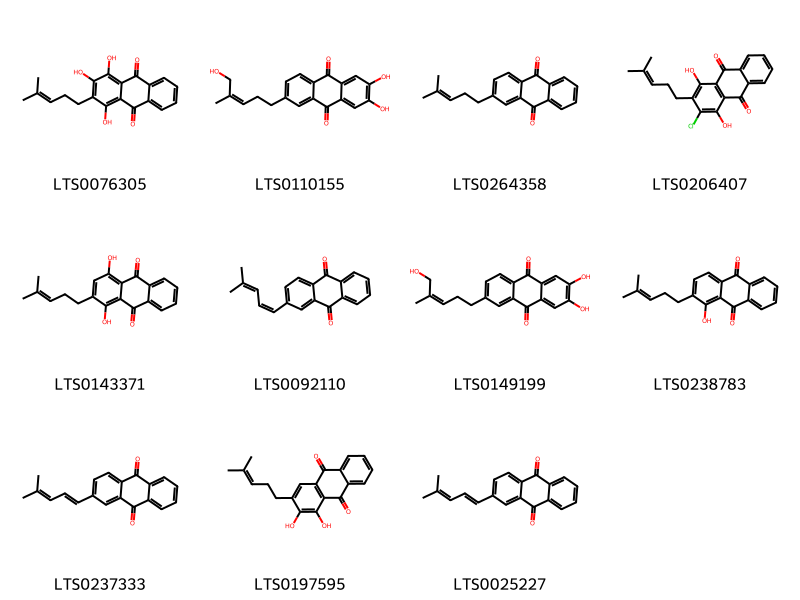
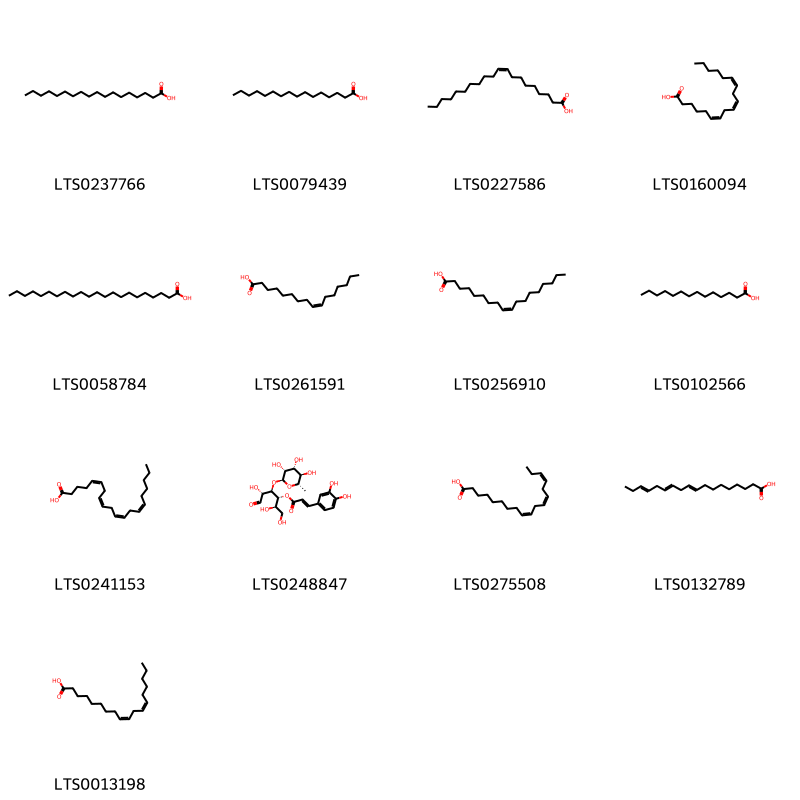
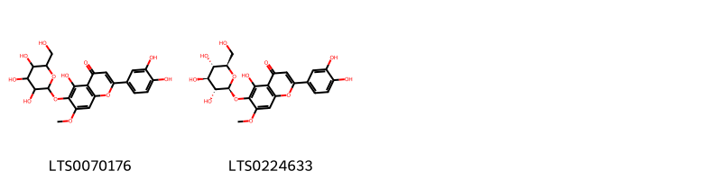
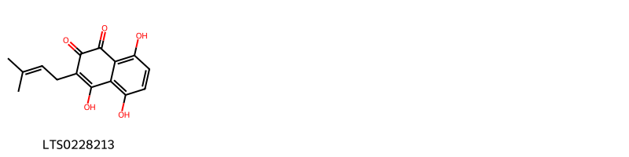
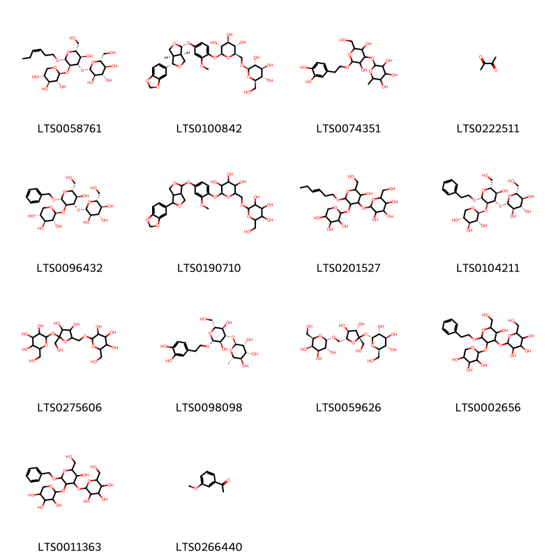

!!! abstract "Tóm tắt"
    Cây Vừng đen có tên khoa học là Sesamum indicum L., thuộc họ Vừng (Pedaliaceae). Tên khoa học của Dược liệu là Sesami Nigrum Semen. Trên thế giới, Có nguồn gốc từ:
Assam, Bangladesh, Ấn Độ, Tây Himalaya. Di thực vào: Afghanistan, Alabama, Andaman Is., Angola, Belize, Benin, Bolivia, Borneo, Brazil North, Bulgaria, Burkina, Burundi, California, Campuchia, Cameroon, Caroline Is., Cộng hòa Trung Phi, Tchad, Trung Nam Trung Quốc, Đông Nam Trung Quốc , Comoros, Congo, Costa Rica, Cuba, Síp, Đông Himalaya, Ai Cập, El Salvador, Eritrea, Ethiopia, Fiji, Florida, Guiana thuộc Pháp, Gabon, Galapagos, Gambia, Georgia, Ghana, Hy Lạp, Guatemala, Guinea, Guinea-Bissau, Guyana, Hải Nam, Honduras, Iran, Bờ Biển Ngà, Nhật Bản, Jawa, Kazakhstan, Kenya, Hàn Quốc, Krym, KwaZulu-Natal, Lào, Lebanon-Syria, Ít hơn Sunda Is., Liberia, Libya, Louisiana, Madagascar, Malawi, Malaya, Mali, Marianas, Massachusetts, Mauritania, Mauritius, Vịnh Mexico, Tây Nam Mexico, Missouri, Maroc, Mozambique, Myanmar, Nepal, New Jersey, New York, Nicobar Is., Niger, Nigeria, Các tỉnh phía Bắc, Ohio, Oman, Pakistan, Pennsylvania, Peru, Philippines, Rwanda, Ả Rập Saudi, Senegal, Sierra Leone, Somalia,Nam Carolina, Nam Âu Nga, Tây Ban Nha, Sri Lanka, Sudan, Sulawesi, Sumatera, Suriname, Swaziland, Tadzhikistan, Tanzania, Texas, Thái Lan, Togo, Transcaucasus, Trinidad-Tobago, Thổ Nhĩ Kỳ, Thổ Nhĩ Kỳ ở Châu Âu, Uganda, Ukraine, Uzbekistan, Venezuela, Việt Nam, Wisconsin, Yemen, Nam Tư, Zambia, Zaire, Zimbabwel. Tại Việt Nam, cây được trồng ở khắp nơi trong nước ta. Cây có vị ngọt, tính bình, không độc, vào các kinh tỳ, can, thận. Công năng: Bổ can thận, đường huyết, chỉ huyết, nhuận tràng thông tiện, lợi sữa. Chủ trị: Thiếu máu do huyết hư, tóc bạc sớm, xuất huyết do giảm tiểu cầu, táo bón, sau đẻ ít sữa. Tác dụng dược lý: giảm cholesterol máu, ngăn ngừa xơ cứng động mạch và hạ huyết áp, bảo vệ gan khỏi tác hại của Ethanol và carbon tetrachlorid, giảm đau, kháng viêm và hỗ trợ hệ tiêu hóa, nhuận tràng, lợi sữa. Hạt Vừng chứa dầu màu vàng (40.55%), nước (5-8%), protein (20-22%), tro (5%, trong đó có 1.7mg đồng), Canxi oxalat (1%), chất không có nitơ (6.3-8.8%) và các chất pedaliin planteose, sesamose, sesamin, sesamolin, sesamol. Dầu Vừng chứa acid đặc (12-16%) và acid loãng (75-80%), phần không xà phòng hoá (0.9-1.7%) và lexitin (khoảng 1%). Trong dầu có chất sesamin (tỷ lệ chừng 0.25-1%) và chất sesamol (tỷ lệ chừng 0.1%).

## Thông tin về thực vật

### Đặc điểm thực vật

Dược liệu **Vừng Đen (Hạt)** từ bộ phận **nan** từ loài *Sesamum indicum DC.* thuộc họ Pedaliaceae. Cây vừng là một loại cỏ nhỏ, thân có nhiều lông, cao chừng 0,6m, sống hằng năm. Lá mọc đối, đơn, không có lá kèm, nguyên, có cuống.
Hoa trắng mọc đơn độc ở kẽ lá, lưỡng tính, không đều, có cuống ngắn. Đài hơi hợp ở gốc. Tràng hình ống loe ra thành hai mồi, môi dưới gồm 3 thùy, mỗi trên 2 thùy, 4 nhị. 2 to, 2 nhỏ, 2 lá noãn, đầu nhụy có 2 nuốm, bầu có vách già chia thành 4 ô, mỗi ô chứa một dãy dọc nhiều noãn. Quả nang dìa, 4 ô mở thành 4 mảnh. Nhiều hạt nhỏ màu vàng hay nâu đen, Lá mầm chứa nhiều dầu. 

!!! info "Phân loại thực vật của *Sesamum indicum*"
    - **Kingdom:** Plantae
    - **Phylum:** Tracheophyta
    - **Order:** Lamiales
    - **Family:** Pedaliaceae
    - **Genus:** Sesamum
    - **Species:** *Sesamum indicum*

*Tài liệu tham khảo:* "Những cây thuốc và vị thuốc Việt Nam" - Đỗ Tất Lợi

 

### Loài thay thế (Nếu có)

### Phân bố trên thế giới
**Từ vườn thực vật KEW: **: Có nguồn gốc từ:
Assam, Bangladesh, Ấn Độ, Tây Himalaya
Di thực vào:
Afghanistan, Alabama, Andaman Is., Angola, Belize, Benin, Bolivia, Borneo, Brazil North, Bulgaria, Burkina, Burundi, California, Campuchia, Cameroon, Caroline Is., Cộng hòa Trung Phi, Tchad, Trung Nam Trung Quốc, Đông Nam Trung Quốc , Comoros, Congo, Costa Rica, Cuba, Síp, Đông Himalaya, Ai Cập, El Salvador, Eritrea, Ethiopia, Fiji, Florida, Guiana thuộc Pháp, Gabon, Galapagos, Gambia, Georgia, Ghana, Hy Lạp, Guatemala, Guinea, Guinea-Bissau, Guyana, Hải Nam, Honduras, Iran, Bờ Biển Ngà, Nhật Bản, Jawa, Kazakhstan, Kenya, Hàn Quốc, Krym, KwaZulu-Natal, Lào, Lebanon-Syria, Ít hơn Sunda Is., Liberia, Libya, Louisiana, Madagascar, Malawi, Malaya, Mali, Marianas, Massachusetts, Mauritania, Mauritius, Vịnh Mexico, Tây Nam Mexico, Missouri, Maroc, Mozambique, Myanmar, Nepal, New Jersey, New York, Nicobar Is., Niger, Nigeria, Các tỉnh phía Bắc, Ohio, Oman, Pakistan, Pennsylvania, Peru, Philippines, Rwanda, Ả Rập Saudi, Senegal, Sierra Leone, Somalia,Nam Carolina, Nam Âu Nga, Tây Ban Nha, Sri Lanka, Sudan, Sulawesi, Sumatera, Suriname, Swaziland, Tadzhikistan, Tanzania, Texas, Thái Lan, Togo, Transcaucasus, Trinidad-Tobago, Thổ Nhĩ Kỳ, Thổ Nhĩ Kỳ ở Châu Âu, Uganda, Ukraine, Uzbekistan, Venezuela, Việt Nam, Wisconsin, Yemen, Nam Tư, Zambia, Zaire, Zimbabwe

**Từ CSDL GIBF** nan, Tanzania, United Republic of, Australia, Spain, Burkina Faso, Cambodia, Nigeria, Madagascar, Pakistan, Thailand, Malawi, Brazil, United Arab Emirates, Honduras, Palestine, State of, Singapore, Guatemala, Korea, Republic of, Indonesia, Angola, India, Argentina, Mexico, Venezuela (Bolivarian Republic of), Colombia, China, Peru, French Guiana, Russian Federation, Nepal, Viet Nam, United States of America, Chinese Taipei, Benin, Sri Lanka

### Phân bố tại Việt Nam
** "Những cây thuốc và vị thuốc Việt Nam" - Đỗ Tất Lợi**: Cây được trồng ở khắp nơi trong nước ta.

**Từ CSDL GIBF**: Quảng Ngãi

---

## Thông tin về dược liệu 

### Định danh

!!! info "Thông tin về tên gọi của nan"
    - Dược liệu tiếng Việt: nan
    - Dược liệu tiếng Trung: nan (nan)
    - Dược liệu tiếng Anh: nan
    - Dược liệu latin thông dụng: nan
    - Dược liệu latin kiểu DĐVN: sesami nigrum semen
    - Dược liệu latin kiểu DĐVN: nan
    - Dược liệu latin kiểu thông tư: nan
    - Bộ phận dùng: nan (nan)

### Mô tả dược liệu 
- **Theo dược điển Việt nam V:** nan

- **Mô tả dược liệu theo thông tư chế biến dược liệu theo phương pháp cổ truyền:** nan

### Chế biến 

- **Chế biến theo dược điển việt nam V**: nan

- **Chế biến theo thông tư:** nan

--- 

## Thành phần hóa học

- Theo tài liệu của GS. Đỗ Tất Lợi:  (1) Nhóm hóa học;
Hạt Vừng chứa dầu màu vàng (40.55%), nước (5-8%), protein (20-22%), tro (5%, trong đó có 1.7mg đồng), Canxi oxalat (1%), chất không có nitơ (6.3-8.8%) và các chất pedaliin planteose, sesamose, sesamin, sesamolin, sesamol. Dầu Vừng chứa acid đặc (12-16%) và acid loãng (75-80%), phần không xà phòng hoá (0.9-1.7%) và lexitin (khoảng 1%). Trong dầu có chất sesamin (tỷ lệ chừng 0.25-1%) và chất sesamol (tỷ lệ chừng 0.1%).
    
- Theo cơ sở dữ liệu lotus: Từ loài *Sesamum indicum* đã phân lập và xác định được 151 hoạt chất thuộc về các nhóm Naphthalenes, Anthracenes, Lignan glycosides, Dibenzylbutane lignans, Organooxygen compounds, Steroids and steroid derivatives, Prenol lipids, Fatty Acyls, Phenols, Furanoid lignans, Benzodioxoles, Cinnamic acids and derivatives, Flavonoids, 2-arylbenzofuran flavonoids. 

|    | chemicalTaxonomyClassyfireClass   |   smiles_count |
|---:|:----------------------------------|---------------:|
|  0 | 2-arylbenzofuran flavonoids       |              2 |
|  1 | Anthracenes                       |             11 |
|  2 | Benzodioxoles                     |              7 |
|  3 | Cinnamic acids and derivatives    |             18 |
|  4 | Dibenzylbutane lignans            |              4 |
|  5 | Fatty Acyls                       |             13 |
|  6 | Flavonoids                        |              2 |
|  7 | Furanoid lignans                  |             31 |
|  8 | Lignan glycosides                 |              6 |
|  9 | Naphthalenes                      |              1 |
| 10 | Organooxygen compounds            |             14 |
| 11 | Phenols                           |              7 |
| 12 | Prenol lipids                     |             15 |
| 13 | Steroids and steroid derivatives  |             18 |

### Nhóm 2-arylbenzofuran flavonoids
<figure markdown="span">
    { width=100% }
    <figcaption>Hình ảnh cấu trúc hóa học của 2 hoạt chất thuộc nhóm 2-arylbenzofuran flavonoids gồm ['2-(3,4-dimethoxyphenyl)-7-methoxy-3-methyl-5-(prop-1-en-1-yl)-2,3-dihydro-1-benzofuran (LTS0225858)', 'acuminatin (LTS0198896)'].</figcaption>
</figure>
### Nhóm Anthracenes
<figure markdown="span">
    { width=100% }
    <figcaption>Hình ảnh cấu trúc hóa học của 11 hoạt chất thuộc nhóm Anthracenes gồm ['1,2,4-trihydroxy-3-(4-methylpent-3-en-1-yl)anthracene-9,10-dione (LTS0076305)', '2,3-dihydroxy-6-[(3z)-5-hydroxy-4-methylpent-3-en-1-yl]anthracene-9,10-dione (LTS0110155)', '2-(4-methylpent-3-en-1-yl)anthracene-9,10-dione (LTS0264358)', '2-chloro-1,4-dihydroxy-3-(4-methylpent-3-en-1-yl)anthracene-9,10-dione (LTS0206407)', '1,4-dihydroxy-2-(4-methylpent-3-en-1-yl)anthracene-9,10-dione (LTS0143371)', '2-[(1z)-4-methylpenta-1,3-dien-1-yl]anthracene-9,10-dione (LTS0092110)', '2,3-dihydroxy-6-(5-hydroxy-4-methylpent-3-en-1-yl)anthracene-9,10-dione (LTS0149199)', '1-hydroxy-2-(4-methylpent-3-en-1-yl)anthracene-9,10-dione (LTS0238783)', '2-[(1e)-4-methylpenta-1,3-dien-1-yl]anthracene-9,10-dione (LTS0237333)', '1,2-dihydroxy-3-(4-methylpent-3-en-1-yl)anthracene-9,10-dione (LTS0197595)', '2-(4-methylpenta-1,3-dien-1-yl)anthracene-9,10-dione (LTS0025227)'].</figcaption>
</figure>
### Nhóm Benzodioxoles
<figure markdown="span">
    { width=100% }
    <figcaption>Hình ảnh cấu trúc hóa học của 7 hoạt chất thuộc nhóm Benzodioxoles gồm ['sesamolin (LTS0079632)', 'sesamol (LTS0117322)', 'sesamolin (LTS0276354)', '6-[(1s,3ar,4s,6ar)-4-hydroxy-hexahydrofuro[3,4-c]furan-1-yl]-2h-1,3-benzodioxol-5-ol (LTS0150831)', '5-[(1r,3as,4s,6as)-4-(2h-1,3-benzodioxol-5-yloxy)-hexahydrofuro[3,4-c]furan-1-yl]-2h-1,3-benzodioxole (LTS0155741)', '5-[(1s,3ar,4r,6ar)-4-{[(1r,3ar,4s,6ar)-4-(2h-1,3-benzodioxol-5-yl)-hexahydrofuro[3,4-c]furan-1-yl]oxy}-hexahydrofuro[3,4-c]furan-1-yl]-2h-1,3-benzodioxole (LTS0210609)', '6-{4-hydroxy-hexahydrofuro[3,4-c]furan-1-yl}-2h-1,3-benzodioxol-5-ol (LTS0129864)'].</figcaption>
</figure>
### Nhóm Cinnamic acids and derivatives
<figure markdown="span">
    { width=100% }
    <figcaption>Hình ảnh cấu trúc hóa học của 18 hoạt chất thuộc nhóm Cinnamic acids and derivatives gồm ['ferulic acid (LTS0077328)', '(3r,4r,6r)-6-[2-(3,4-dihydroxyphenyl)ethoxy]-5-hydroxy-2-(hydroxymethyl)-4-{[(2s,3s,5r)-3,4,5-trihydroxy-6-methyloxan-2-yl]oxy}oxan-3-yl (2e)-3-(3,4-dihydroxyphenyl)prop-2-enoate (LTS0063526)', '(2r,3r,4r,5r,6r)-6-[(2s)-2-(3,4-dihydroxyphenyl)-2-methoxyethoxy]-5-hydroxy-2-(hydroxymethyl)-4-{[(2s,3r,4r,5r,6s)-3,4,5-trihydroxy-6-methyloxan-2-yl]oxy}oxan-3-yl (2e)-3-(3,4-dihydroxyphenyl)prop-2-enoate (LTS0061146)', '{6-[2-(3,4-dihydroxyphenyl)-2-hydroxyethoxy]-3,5-dihydroxy-4-[(3,4,5-trihydroxy-6-methyloxan-2-yl)oxy]oxan-2-yl}methyl 3-(3,4-dihydroxyphenyl)prop-2-enoate (LTS0041659)', 'verbascoside (LTS0168159)', '{6-[2-(3,4-dihydroxyphenyl)ethoxy]-3,5-dihydroxy-4-[(3,4,5-trihydroxy-6-methyloxan-2-yl)oxy]oxan-2-yl}methyl 3-(3,4-dihydroxyphenyl)prop-2-enoate (LTS0270785)', '6-[2-(3,4-dihydroxyphenyl)-2-methoxyethoxy]-5-hydroxy-2-(hydroxymethyl)-4-[(3,4,5-trihydroxy-6-methyloxan-2-yl)oxy]oxan-3-yl 3-(3,4-dihydroxyphenyl)prop-2-enoate (LTS0242946)', '4-[2-(3,4-dihydroxyphenyl)-2-methoxyethoxy]-3-hydroxy-6-(hydroxymethyl)-2-[(3,4,5,6-tetrahydroxyoxan-2-yl)oxy]cyclohexyl 3-(3,4-dihydroxyphenyl)prop-2-enoate (LTS0168967)', '[(2r,3r,4s,5r,6r)-6-[(2r)-2-(3,4-dihydroxyphenyl)-2-hydroxyethoxy]-3,5-dihydroxy-4-{[(2s,3r,4r,5r,6s)-3,4,5-trihydroxy-6-methyloxan-2-yl]oxy}oxan-2-yl]methyl (2e)-3-(3,4-dihydroxyphenyl)prop-2-enoate (LTS0144126)', '[(2r,3r,4s,5r,6r)-3,5,6-trihydroxy-4-{[(2s,3r,4r,5r,6s)-3,4,5-trihydroxy-6-methyloxan-2-yl]oxy}oxan-2-yl]methyl (2e)-3-(3,4-dihydroxyphenyl)prop-2-enoate (LTS0195798)', '6-[2-(3,4-dihydroxyphenyl)ethoxy]-5-hydroxy-2-(hydroxymethyl)-4-[(3,4,5-trihydroxy-6-methyloxan-2-yl)oxy]oxan-3-yl 3-(3,4-dihydroxyphenyl)prop-2-enoate (LTS0050472)', '(2r,3r,4r,5r,6r)-6-[(2r)-2-(3,4-dihydroxyphenyl)-2-hydroxyethoxy]-5-hydroxy-2-(hydroxymethyl)-4-{[(2s,3r,4r,5r,6s)-3,4,5-trihydroxy-6-methyloxan-2-yl]oxy}oxan-3-yl (2e)-3-(3,4-dihydroxyphenyl)prop-2-enoate (LTS0064210)', '(2r,3r,4r,5r,6r)-5,6-dihydroxy-2-(hydroxymethyl)-4-{[(2s,3r,4r,5r,6s)-3,4,5-trihydroxy-6-methyloxan-2-yl]oxy}oxan-3-yl (2e)-3-(3,4-dihydroxyphenyl)prop-2-enoate (LTS0068977)', 'isoacteoside (LTS0012202)', '(2r,3r,4r,5r,6r)-6-[2-(3,4-dihydroxyphenyl)-2-methoxyethoxy]-5-hydroxy-2-(hydroxymethyl)-4-{[(2s,3r,4r,5r,6s)-3,4,5-trihydroxy-6-methyloxan-2-yl]oxy}oxan-3-yl (2e)-3-(3,4-dihydroxyphenyl)prop-2-enoate (LTS0018489)', '5,6-dihydroxy-2-(hydroxymethyl)-4-[(3,4,5-trihydroxy-6-methyloxan-2-yl)oxy]oxan-3-yl 3-(3,4-dihydroxyphenyl)prop-2-enoate (LTS0048309)', '6-[2-(3,4-dihydroxyphenyl)-2-hydroxyethoxy]-5-hydroxy-2-(hydroxymethyl)-4-[(3,4,5-trihydroxy-6-methyloxan-2-yl)oxy]oxan-3-yl 3-(3,4-dihydroxyphenyl)prop-2-enoate (LTS0108017)', '{3,5,6-trihydroxy-4-[(3,4,5-trihydroxy-6-methyloxan-2-yl)oxy]oxan-2-yl}methyl 3-(3,4-dihydroxyphenyl)prop-2-enoate (LTS0265054)'].</figcaption>
</figure>
### Nhóm Dibenzylbutane lignans
<figure markdown="span">
    { width=100% }
    <figcaption>Hình ảnh cấu trúc hóa học của 4 hoạt chất thuộc nhóm Dibenzylbutane lignans gồm ['(-)-enterodiol (LTS0263294)', '(2s,3r)-2,3-bis[(4-hydroxy-3-methoxyphenyl)(¹³c)methyl](1-¹³c)butane-1,4-diol (LTS0268699)', 'secoisolariciresinol (LTS0086727)', '2,3-bis[(3-hydroxyphenyl)methyl]butane-1,4-diol (LTS0027824)'].</figcaption>
</figure>
### Nhóm Fatty Acyls
<figure markdown="span">
    { width=100% }
    <figcaption>Hình ảnh cấu trúc hóa học của 13 hoạt chất thuộc nhóm Fatty Acyls gồm ['stearic acid (LTS0237766)', 'palmitic acid (LTS0079439)', 'gadoleic acid (LTS0227586)', 'gamma-linolenic acid (LTS0160094)', 'behenic acid (LTS0058784)', 'palmitoleic acid (LTS0261591)', 'oleic acid (LTS0256910)', 'myristic acid (LTS0102566)', 'arachidonic acid (LTS0241153)', '(2r,3r,4r,5r)-1,2,5-trihydroxy-6-oxo-4-{[(2s,3r,4r,5r,6s)-3,4,5-trihydroxy-6-methyloxan-2-yl]oxy}hexan-3-yl (2e)-3-(3,4-dihydroxyphenyl)prop-2-enoate (LTS0248847)', 'α-linolenic acid (LTS0275508)', 'α linolenic acid (LTS0132789)', 'linoleic (LTS0013198)'].</figcaption>
</figure>
### Nhóm Flavonoids
<figure markdown="span">
    { width=100% }
    <figcaption>Hình ảnh cấu trúc hóa học của 2 hoạt chất thuộc nhóm Flavonoids gồm ['2-(3,4-dihydroxyphenyl)-5-hydroxy-7-methoxy-6-{[3,4,5-trihydroxy-6-(hydroxymethyl)oxan-2-yl]oxy}chromen-4-one (LTS0070176)', '2-(3,4-dihydroxyphenyl)-5-hydroxy-7-methoxy-6-{[(2s,3r,4s,5s,6r)-3,4,5-trihydroxy-6-(hydroxymethyl)oxan-2-yl]oxy}chromen-4-one (LTS0224633)'].</figcaption>
</figure>
### Nhóm Furanoid lignans
<figure markdown="span">
    { width=100% }
    <figcaption>Hình ảnh cấu trúc hóa học của 31 hoạt chất thuộc nhóm Furanoid lignans gồm ['4-{4-[(4-hydroxy-3-methoxyphenyl)methyl]-3-(hydroxymethyl)oxolan-2-yl}-2-methoxyphenol (LTS0211349)', '5-[(1s,3ar,4r,6ar)-4-(2h-1,3-benzodioxol-5-yl)-hexahydrofuro[3,4-c]furan-1-yl]-2h-1,3-benzodioxole (LTS0230803)', '[(2s,3r,4r)-2-(2h-1,3-benzodioxol-5-yl)-4-(2h-1,3-benzodioxole-5-carbonyl)oxolan-3-yl]methanol (LTS0117283)', '4-[(1s,3ar,4s,6ar)-4-(2h-1,3-benzodioxol-5-yl)-hexahydrofuro[3,4-c]furan-1-yl]-2-methoxyphenol (LTS0184010)', '4-[(3ar,6as)-4-(4-hydroxy-3-methoxyphenyl)-hexahydrofuro[3,4-c]furan-1-yl]-2-methoxyphenol (LTS0191067)', 'pinoresinol (LTS0057431)', '5-[4-(2h-1,3-benzodioxol-5-yl)-hexahydrofuro[3,4-c]furan-1-yl]-6-methoxy-2h-1,3-benzodioxole (LTS0141911)', 'matairesinol (LTS0193475)', '4-[(2s,3r,4r)-4-[(4-hydroxy-3,5-dimethoxyphenyl)methyl]-3-(hydroxymethyl)oxolan-2-yl]-2-methoxyphenol (LTS0195026)', '4-[hydroxy(4-hydroxy-3-methoxyphenyl)methyl]-3-[(4-hydroxy-3-methoxyphenyl)methyl]oxolan-2-ol (LTS0197099)', '4-{4-[(4-hydroxy-3,5-dimethoxyphenyl)methyl]-3-(hydroxymethyl)oxolan-2-yl}-2-methoxyphenol (LTS0151025)', '[(2r,3s,4r)-2-(2h-1,3-benzodioxol-5-yl)-4-(2h-1,3-benzodioxole-5-carbonyl)oxolan-3-yl]methanol (LTS0154020)', '6-[(1r,3ar,4s,6ar)-4-(2h-1,3-benzodioxol-5-yl)-hexahydrofuro[3,4-c]furan-1-yl]-2h-1,3-benzodioxol-5-ol (LTS0145133)', '5-[(3ar,4r,6ar)-4-(2h-1,3-benzodioxol-5-yl)-hexahydrofuro[3,4-c]furan-1-yl]-2h-1,3-benzodioxole (LTS0105150)', 'hpmf (LTS0110410)', '4-[(1s,3ar,4r,6ar)-4-(6-hydroxy-2h-1,3-benzodioxol-5-yl)-hexahydrofuro[3,4-c]furan-1-yl]benzene-1,2-diol (LTS0163912)', '4-[4-(6-hydroxy-2h-1,3-benzodioxol-5-yl)-hexahydrofuro[3,4-c]furan-1-yl]benzene-1,2-diol (LTS0270387)', '(2r,3r,4r)-4-[(r)-hydroxy(4-hydroxy-3-methoxyphenyl)methyl]-3-[(4-hydroxy-3-methoxyphenyl)methyl]oxolan-2-ol (LTS0121296)', '4-[(1r,3as,4r,6as)-4-(2h-1,3-benzodioxol-5-yl)-hexahydrofuro[3,4-c]furan-1-yl]-2-methoxyphenol (LTS0073999)', '4-[hydroxy(4-hydroxy-3-methoxyphenyl)methyl]-3-[(4-hydroxy-3-methoxyphenyl)methyl]oxolan-2-one (LTS0211711)', '4-[4-(2h-1,3-benzodioxol-5-yl)-hexahydrofuro[3,4-c]furan-1-yl]-2-methoxyphenol (LTS0208433)', 'sesamin (LTS0228898)', 'hydroxymatairesinol (LTS0054747)', 'lariciresinol (LTS0010950)', '3,4-bis[(4-hydroxy-3-methoxyphenyl)methyl]oxolan-2-one (LTS0017723)', '[2-(2h-1,3-benzodioxol-5-yl)-4-(2h-1,3-benzodioxole-5-carbonyl)oxolan-3-yl]methanol (LTS0002413)', 'pinoresinol (LTS0011247)', '5-[(1s,3ar,4s,6ar)-4-(3,4-dimethoxyphenyl)-hexahydrofuro[3,4-c]furan-1-yl]-2h-1,3-benzodioxole (LTS0081634)', '6-[4-(2h-1,3-benzodioxol-5-yl)-hexahydrofuro[3,4-c]furan-1-yl]-2h-1,3-benzodioxol-5-ol (LTS0003215)', '6-[(1s,3ar,4s,6ar)-4-(2h-1,3-benzodioxol-5-yl)-hexahydrofuro[3,4-c]furan-1-yl]-2h-1,3-benzodioxol-5-ol (LTS0117922)', 'sesamin (LTS0120161)'].</figcaption>
</figure>
### Nhóm Lignan glycosides
<figure markdown="span">
    { width=100% }
    <figcaption>Hình ảnh cấu trúc hóa học của 6 hoạt chất thuộc nhóm Lignan glycosides gồm ['(2s,3r,4s,5s,6r)-2-{[(2s,3r,4s,5s,6r)-2-({6-[(1s,3ar,4s,6ar)-4-(2h-1,3-benzodioxol-5-yl)-hexahydrofuro[3,4-c]furan-1-yl]-2h-1,3-benzodioxol-5-yl}oxy)-4,5-dihydroxy-6-(hydroxymethyl)oxan-3-yl]oxy}-6-(hydroxymethyl)oxane-3,4,5-triol (LTS0048994)', '2-{[2-({6-[4-(2h-1,3-benzodioxol-5-yl)-hexahydrofuro[3,4-c]furan-1-yl]-2h-1,3-benzodioxol-5-yl}oxy)-4,5-dihydroxy-6-(hydroxymethyl)oxan-3-yl]oxy}-6-(hydroxymethyl)oxane-3,4,5-triol (LTS0228122)', '2-[(2-{[2-(2h-1,3-benzodioxol-5-yl)-4-(2h-1,3-benzodioxole-5-carbonyl)oxolan-3-yl]methoxy}-4,5-dihydroxy-6-(hydroxymethyl)oxan-3-yl)oxy]-6-(hydroxymethyl)oxane-3,4,5-triol (LTS0248736)', '(2s,3r,4s,5s,6r)-2-{4-[(1s,3ar,4s,6ar)-4-(4-hydroxy-3-methoxyphenyl)-hexahydrofuro[3,4-c]furan-1-yl]-2-methoxyphenoxy}-6-(hydroxymethyl)oxane-3,4,5-triol (LTS0193542)', '(2s,3r,4s,5s,6r)-2-{[(2r,3r,4s,5s,6r)-2-{[(2s,3r,4r)-2-(2h-1,3-benzodioxol-5-yl)-4-(2h-1,3-benzodioxole-5-carbonyl)oxolan-3-yl]methoxy}-4,5-dihydroxy-6-(hydroxymethyl)oxan-3-yl]oxy}-6-(hydroxymethyl)oxane-3,4,5-triol (LTS0207198)', '2-{4-[4-(4-hydroxy-3-methoxyphenyl)-hexahydrofuro[3,4-c]furan-1-yl]-2-methoxyphenoxy}-6-(hydroxymethyl)oxane-3,4,5-triol (LTS0002400)'].</figcaption>
</figure>
### Nhóm Naphthalenes
<figure markdown="span">
    { width=100% }
    <figcaption>Hình ảnh cấu trúc hóa học của 1 hoạt chất thuộc nhóm Naphthalenes gồm ['4,5,8-trihydroxy-3-(3-methylbut-2-en-1-yl)naphthalene-1,2-dione (LTS0228213)'].</figcaption>
</figure>
### Nhóm Organooxygen compounds
<figure markdown="span">
    { width=100% }
    <figcaption>Hình ảnh cấu trúc hóa học của 14 hoạt chất thuộc nhóm Organooxygen compounds gồm ['(2s,3r,4s,5s,6r)-2-{[(2r,3r,4s,5r,6r)-2-[(3z)-hex-3-en-1-yloxy]-5-hydroxy-6-(hydroxymethyl)-3-{[(2s,3r,4s,5r)-3,4,5-trihydroxyoxan-2-yl]oxy}oxan-4-yl]oxy}-6-(hydroxymethyl)oxane-3,4,5-triol (LTS0058761)', '(2s,3r,4s,5s,6r)-2-(4-{[(1r,3ar,4s,6ar)-4-(2h-1,3-benzodioxol-5-yl)-hexahydrofuro[3,4-c]furan-1-yl]oxy}-2-methoxyphenoxy)-6-({[(2r,3r,4s,5s,6r)-3,4,5-trihydroxy-6-(hydroxymethyl)oxan-2-yl]oxy}methyl)oxane-3,4,5-triol (LTS0100842)', '2-({2-[2-(3,4-dihydroxyphenyl)ethoxy]-3,5-dihydroxy-6-(hydroxymethyl)oxan-4-yl}oxy)-6-methyloxane-3,4,5-triol (LTS0074351)', 'diacetyl (LTS0222511)', '(2s,3r,4s,5s,6r)-2-{[(2r,3r,4s,5r,6r)-2-(benzyloxy)-5-hydroxy-6-(hydroxymethyl)-3-{[(2s,3r,4s,5r)-3,4,5-trihydroxyoxan-2-yl]oxy}oxan-4-yl]oxy}-6-(hydroxymethyl)oxane-3,4,5-triol (LTS0096432)', '2-(4-{[4-(2h-1,3-benzodioxol-5-yl)-hexahydrofuro[3,4-c]furan-1-yl]oxy}-2-methoxyphenoxy)-6-({[3,4,5-trihydroxy-6-(hydroxymethyl)oxan-2-yl]oxy}methyl)oxane-3,4,5-triol (LTS0190710)', '2-{[2-(hex-3-en-1-yloxy)-5-hydroxy-6-(hydroxymethyl)-3-[(3,4,5-trihydroxyoxan-2-yl)oxy]oxan-4-yl]oxy}-6-(hydroxymethyl)oxane-3,4,5-triol (LTS0201527)', '(2s,3r,4s,5s,6r)-2-{[(2r,3r,4s,5r,6r)-3-hydroxy-2-(hydroxymethyl)-6-(2-phenylethoxy)-5-{[(2s,3r,4s,5r)-3,4,5-trihydroxyoxan-2-yl]oxy}oxan-4-yl]oxy}-6-(hydroxymethyl)oxane-3,4,5-triol (LTS0104211)', '2-{[3,4-dihydroxy-5-(hydroxymethyl)-5-{[3,4,5-trihydroxy-6-(hydroxymethyl)oxan-2-yl]oxy}oxolan-2-yl]methoxy}-6-(hydroxymethyl)oxane-3,4,5-triol (LTS0275606)', '(2s,3r,4r,5r,6s)-2-{[(2r,3r,4s,5r,6r)-2-[2-(3,4-dihydroxyphenyl)ethoxy]-3,5-dihydroxy-6-(hydroxymethyl)oxan-4-yl]oxy}-6-methyloxane-3,4,5-triol (LTS0098098)', '(2r,3r,4s,5s,6r)-2-{[(2s,3s,4s,5r)-3,4-dihydroxy-2-(hydroxymethyl)-5-({[(2s,3r,4s,5r,6r)-3,4,5-trihydroxy-6-(hydroxymethyl)oxan-2-yl]oxy}methyl)oxolan-2-yl]oxy}-6-(hydroxymethyl)oxane-3,4,5-triol (LTS0059626)', '2-{[3-hydroxy-2-(hydroxymethyl)-6-(2-phenylethoxy)-5-[(3,4,5-trihydroxyoxan-2-yl)oxy]oxan-4-yl]oxy}-6-(hydroxymethyl)oxane-3,4,5-triol (LTS0002656)', '2-{[2-(benzyloxy)-5-hydroxy-6-(hydroxymethyl)-3-[(3,4,5-trihydroxyoxan-2-yl)oxy]oxan-4-yl]oxy}-6-(hydroxymethyl)oxane-3,4,5-triol (LTS0011363)', 'm-methoxyacetophenone (LTS0266440)'].</figcaption>
</figure>
### Nhóm Phenols
<figure markdown="span">
    { width=100% }
    <figcaption>Hình ảnh cấu trúc hóa học của 7 hoạt chất thuộc nhóm Phenols gồm ['4-{[4-(2h-1,3-benzodioxol-5-yl)-hexahydrofuro[3,4-c]furan-1-yl]oxy}-2-methoxyphenol (LTS0138026)', '2-methoxy-4-vinyl-phenol (LTS0128961)', '2-methoxy-5-(prop-1-en-1-yl)phenol (LTS0170720)', 'sesamolinol (LTS0198193)', 'guaiacol (LTS0179228)', '4-{[(1s,3as,4r,6as)-4-(2h-1,3-benzodioxol-5-yl)-hexahydrofuro[3,4-c]furan-1-yl]oxy}-2-methoxyphenol (LTS0136076)', '5-ethenyl-2-methoxyphenol (LTS0076260)'].</figcaption>
</figure>
### Nhóm Prenol lipids
<figure markdown="span">
    { width=100% }
    <figcaption>Hình ảnh cấu trúc hóa học của 15 hoạt chất thuộc nhóm Prenol lipids gồm ['amyrin (LTS0222826)', 'β-amyrin (LTS0251864)', '2-demethylmenaquinone (LTS0133659)', '(2r)-2,5,7,8-tetramethyl-2-[(4s,8s)-4,8,12-trimethyltridecyl]-3,4-dihydro-1-benzopyran-6-ol (LTS0130040)', '2,5,8-trihydroxy-3-(3-methylbut-2-en-1-yl)naphthalene-1,4-dione (LTS0259942)', 'β-tocopherol (LTS0152412)', 'vitamin e (LTS0263269)', '2-(3,7-dimethylocta-2,6-dien-1-yl)naphthalene-1,4-dione (LTS0218402)', '2-chloro-5,8-dihydroxy-3-(3-methylbut-2-en-1-yl)naphthalene-1,4-dione (LTS0211758)', '3,6-dihydroxy-1a-(3-methylbut-2-en-1-yl)-7ah-naphtho[2,3-b]oxirene-2,7-dione (LTS0233312)', 'gamma-tocopherol (LTS0058127)', '(2r)-2,5,8-trimethyl-2-(4,8,12-trimethyltridecyl)-3,4-dihydro-1-benzopyran-6-ol (LTS0030802)', '(1as,7ar)-3,6-dihydroxy-1a-(3-methylbut-2-en-1-yl)-7ah-naphtho[2,3-b]oxirene-2,7-dione (LTS0136980)', 'delta-tocopherol (LTS0005408)', '(4as,6as,6br,8ar,9r,12ar,12br,14bs)-10,11-dihydroxy-9-(hydroxymethyl)-1,2,6a,6b,9,12a-hexamethyl-2,3,4,5,6,7,8,8a,10,11,12,12b,13,14b-tetradecahydro-1h-picene-4a-carboxylic acid (LTS0133560)'].</figcaption>
</figure>
### Nhóm Steroids and steroid derivatives
<figure markdown="span">
    { width=100% }
    <figcaption>Hình ảnh cấu trúc hóa học của 18 hoạt chất thuộc nhóm Steroids and steroid derivatives gồm ['stigmast-5-en-3-ol, (3β)- (LTS0204616)', 'stigmast-5-en-3-ol (LTS0071224)', 'phytosterol (LTS0029311)', 'cholesterol (LTS0102304)', 'delta7-avenasterol (LTS0199292)', '24-methylene-cycloartanol (LTS0077845)', 'avenasterol (LTS0103350)', '5-dehydroavenasterol (LTS0129084)', '(z)-24-ethylidenelophenol (LTS0155418)', '7,7,12,16-tetramethyl-15-(6-methyl-5-methylideneheptan-2-yl)pentacyclo[9.7.0.0¹,³.0³,⁸.0¹²,¹⁶]octadec-8-en-6-ol (LTS0259188)', '(3r,6s,8r,11s,12s,15r,16r)-7,7,12,16-tetramethyl-15-[(2r)-6-methylhept-5-en-2-yl]pentacyclo[9.7.0.0¹,³.0³,⁸.0¹²,¹⁶]octadecan-6-ol (LTS0062833)', '(1r,3as,3bs,7s,9bs)-1-[(2r,5r)-5,6-dimethylheptan-2-yl]-9a,11a-dimethyl-1h,2h,3h,3ah,3bh,4h,6h,7h,8h,9h,9bh,10h,11h-cyclopenta[a]phenanthren-7-ol (LTS0057877)', 'campesterol (LTS0046755)', 'cycloartenol (LTS0269561)', '24-methylidenelophenol (LTS0024189)', '24-methylenecycloartanol (LTS0018584)', 'cycloeucalenol (LTS0125739)', '(1r,3ar,5as,6s,7s,9as,11ar)-3a,6,9a,11a-tetramethyl-1-[(2r)-6-methyl-5-methylideneheptan-2-yl]-1h,2h,3h,4h,5h,5ah,6h,7h,8h,9h,10h,11h-cyclopenta[a]phenanthren-7-ol (LTS0243203)'].</figcaption>
</figure>

---

## Tác dụng dược lý

Theo tài liệu "Những cây thuốc và vị thuốc Việt Nam" - Đỗ Tất Lợi:- Giảm cholesterol máu, ngăn ngừa xơ cứng động mạch và hạ huyết áp. 
- Bảo vệ gan khỏi tác hại của Ethanol và carbon tetrachlorid.
- Tác dụng giảm đau, kháng viêm và hỗ trợ hệ tiêu hóa.
- Nhuận tràng, lợi sữa.

Theo tài liệu quốc tế: nan

---

## Dược điển Việt Nam V

### Soi bột:
nan
<!-- Hình ảnh soi bột sẽ được tự động chèn vào đây sau -->
### Vi phẫu:
nan
<!-- Hình ảnh vi phẫu sẽ được tự động chèn vào đây sau -->
### Định tính

nan

### Định lượng

nan

### Thông tin khác 
- ** Độ ẩm: ** nan

- ** Bảo quản:** nan
## Dược điển Hồng kong

<!-- PDF sẽ được tự động chèn vào đây sau -->

---

## Y dược học cổ truyền

- **Tên vị thuốc:** nan
- **Tính vị quy kinh:** Vị ngọt, tính bình, không độc. Vào các kinh tỳ, can, thận.
- **Công năng chủ trị:** Công năng: Bổ can thận, đường huyết, chỉ huyết, nhuận tràng thông tiện, lợi sữa.
Chủ trị: Thiếu máu do huyết hư, tóc bạc sớm, xuất huyết do giảm tiểu cầu, táo bón, sau đẻ ít sữa.
- **Chú ý:** nan
- **Kiêng kỵ:** nan

