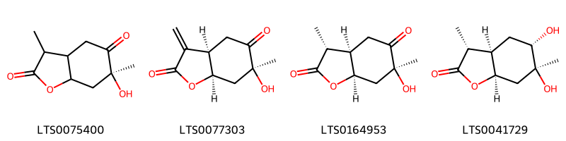
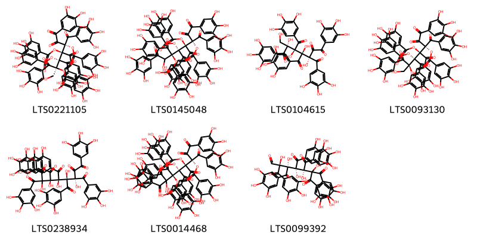
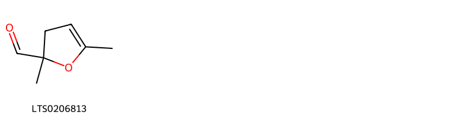
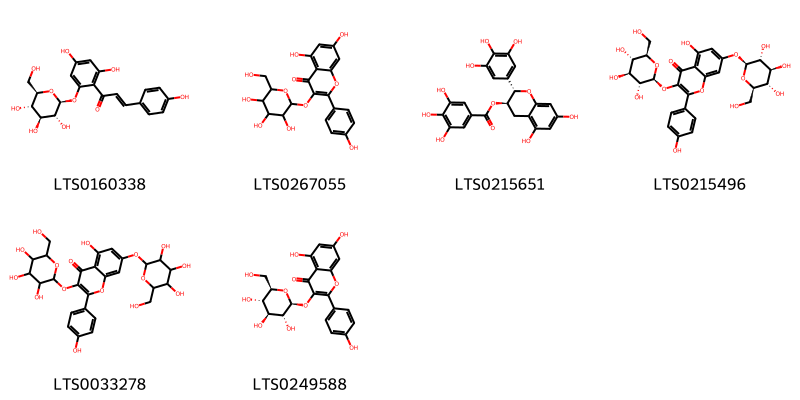
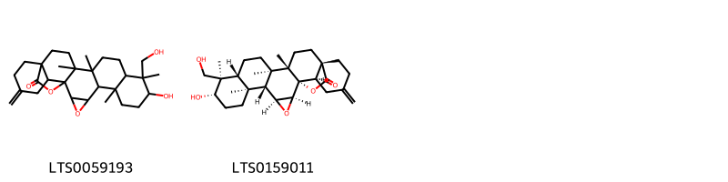
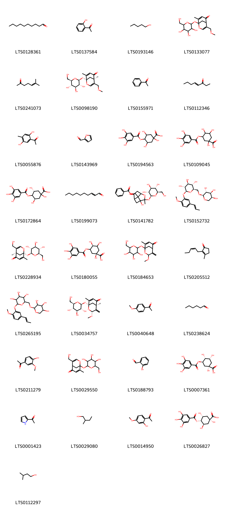
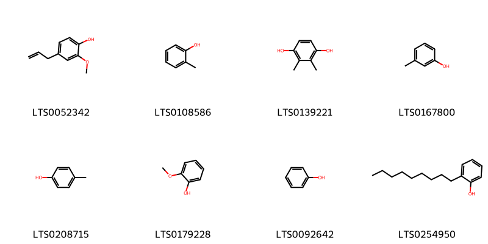
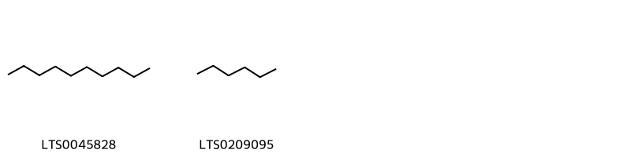
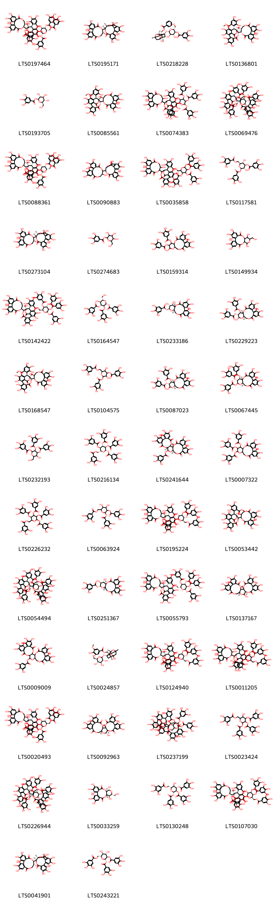

!!! abstract "Tóm tắt"
    Xích thược (Radix Paeoniae, họ Hoàng Liên - Paeoniaceae) là rễ khô của cây Thược dược (Paeonia lactiflora Pall.) hoặc Xuyên xích thược (Paeonia veitchii Lynch), phân bố ở Trung Quốc và các nước Đông Bắc Á. Trong y học cổ truyền, xích thược được dùng để thanh nhiệt, hoạt huyết, giảm đau và chữa các bệnh như kinh bế, đau bụng kinh, viêm sưng. Thành phần chính là paeoniflorin (biomarker), tannin, đường và acid hữu cơ. Xích thược có tác dụng chống viêm, chống khối u, chống oxy hóa, bảo vệ tim mạch và gan.

## Thông tin về thực vật

### Đặc điểm thực vật

Dược liệu **Xích Thược (Rễ)** từ bộ phận **nan** từ loài *Paeonia lactiflora Pall.* thuộc họ Paeoniaceae. Thược dược là một cây sống lâu năm, cao 50-80cm, rễ củ to, thân mọc thẳng đứng, không có lông. Lá mọc so le, xẻ sâu thành 3-7 thùy hình trứng dài 8-12cm, rộng 2-4 cm, mép nguyên, phía cuống hơi hồng. Hoa rất to mọc đơn độc, cánh hoa màu trắng. Mùa hoa ở Trung Quốc vào các tháng 5-7, mùa quả vào các tháng 6-7.
Tất cả xích thược đều do cây mọc hoang cung cấp. Vào tháng 3-5 hay các tháng 5-10 đào hoang, củ nhỏ bé hơn dùng chế thành xích thược 

!!! info "Phân loại thực vật của *Paeonia lactiflora*"
    - **Kingdom:** Plantae
    - **Phylum:** Tracheophyta
    - **Order:** Saxifragales
    - **Family:** Paeoniaceae
    - **Genus:** Paeonia
    - **Species:** *Paeonia lactiflora*

*Tài liệu tham khảo:* "Những cây thuốc và vị thuốc Việt Nam" - Đỗ Tất Lợi

 

### Loài thay thế (Nếu có)

Dược liệu này cũng có thể từ loài *Paeonia veitchii Lynch*, thông tin về phân loại thực vật loài này như sau:
!!! info "Thông tin về phân loại thực vật của *Paeonia anomala*"
    - **kingdom:** Plantae
    - **phylum:** Tracheophyta
    - **order:** Saxifragales
    - **family:** Paeoniaceae
    - **genus:** Paeonia
    - **species:** *Paeonia anomala*

Hình ảnh của loài *Paeonia veitchii Lynch*:

### Phân bố trên thế giới
**Từ vườn thực vật KEW: **: Native to:
Amur, China North-Central, China South-Central, China Southeast, Chita, Inner Mongolia, Khabarovsk, Manchuria, Mongolia, Primorye
Introduced into:
Czechoslovakia, Denmark, Finland, Great Britain, Korea, New York, Sweden, Vermont

**Từ CSDL GIBF** Poland, Belgium, Austria, Norway, Germany, Netherlands, Korea, Republic of, Armenia, Slovakia, Sweden, Mongolia, Hungary, Belarus, China, United Kingdom of Great Britain and Northern Ireland, Estonia, Russian Federation, Czechia, Switzerland, United States of America, Canada

### Phân bố tại Việt Nam
** "Những cây thuốc và vị thuốc Việt Nam" - Đỗ Tất Lợi**: Nhập từ Trung Quốc, mọc hoang ở các tỉnh Hắc Long Giang, Cát Lâm, Hà Bắc, Liêu Ninh, Hà Nam, Sơn Đông, trong rừng, dưới những cây bụi hoặc những cây to.

**Từ CSDL GIBF**: Không có ghi nhận ở Việt Nam

---

## Thông tin về dược liệu 

### Định danh

!!! info "Thông tin về tên gọi của nan"
    - Dược liệu tiếng Việt: nan
    - Dược liệu tiếng Trung: nan (nan)
    - Dược liệu tiếng Anh: nan
    - Dược liệu latin thông dụng: nan
    - Dược liệu latin kiểu DĐVN: radix paeaniae
    - Dược liệu latin kiểu DĐVN: nan
    - Dược liệu latin kiểu thông tư: nan
    - Bộ phận dùng: nan (nan)

### Mô tả dược liệu 
- **Theo dược điển Việt nam V:** nan

- **Mô tả dược liệu theo thông tư chế biến dược liệu theo phương pháp cổ truyền:** nan

### Chế biến 

- **Chế biến theo dược điển việt nam V**: nan

- **Chế biến theo thông tư:** nan

--- 

## Thành phần hóa học

- Theo tài liệu của GS. Đỗ Tất Lợi:  (1) Paeoniflorin, tanin, các loại đường, acid hữu cơ 
(2) Hoạt chất paeoniflorin được sử dụng làm (biomarker) để định tính và định lượng xích thược.
    
- Theo cơ sở dữ liệu lotus: Từ loài *Paeonia lactiflora* đã phân lập và xác định được 256 hoạt chất thuộc về các nhóm Lactones, Stilbenes, Benzene and substituted derivatives, Heteroaromatic compounds, Dihydrofurans, Oxanes, Steroids and steroid derivatives, Phenols, Phenol ethers, Depsides and depsidones, Cinnamic acids and derivatives, Pyridines and derivatives, Organooxygen compounds, Diarylheptanoids, Prenol lipids, Fatty Acyls, Saturated hydrocarbons, Dibenzylbutane lignans, Tannins, Benzofurans, Carboxylic acids and derivatives, Flavonoids, 2-arylbenzofuran flavonoids. 

|    | chemicalTaxonomyClassyfireClass     |   smiles_count |
|---:|:------------------------------------|---------------:|
|  0 | 2-arylbenzofuran flavonoids         |              6 |
|  1 | Benzene and substituted derivatives |             26 |
|  2 | Benzofurans                         |              4 |
|  3 | Carboxylic acids and derivatives    |              1 |
|  4 | Cinnamic acids and derivatives      |              2 |
|  5 | Depsides and depsidones             |              1 |
|  6 | Diarylheptanoids                    |              7 |
|  7 | Dibenzylbutane lignans              |              1 |
|  8 | Dihydrofurans                       |              1 |
|  9 | Fatty Acyls                         |              6 |
| 10 | Flavonoids                          |              6 |
| 11 | Heteroaromatic compounds            |              1 |
| 12 | Lactones                            |              2 |
| 13 | Organooxygen compounds              |             33 |
| 14 | Oxanes                              |              2 |
| 15 | Phenol ethers                       |              1 |
| 16 | Phenols                             |              8 |
| 17 | Prenol lipids                       |             86 |
| 18 | Pyridines and derivatives           |              1 |
| 19 | Saturated hydrocarbons              |              2 |
| 20 | Steroids and steroid derivatives    |              4 |
| 21 | Stilbenes                           |              2 |
| 22 | Tannins                             |             51 |

### Nhóm 2-arylbenzofuran flavonoids
<figure markdown="span">
    { width=100% }
    <figcaption>Hình ảnh cấu trúc hóa học của 6 hoạt chất thuộc nhóm 2-arylbenzofuran flavonoids gồm ['(z)-ε-viniferin (LTS0193672)', '(1s,2r,4s,10r,11r,18r)-4-(3,5-dihydroxyphenyl)-2,10,18-tris(4-hydroxyphenyl)-1,10,11,18-tetramethyl-9-oxahexacyclo[9.7.2.0²,⁴.0⁵,¹⁹.0⁸,²⁰.0¹²,¹⁷]icosa-5(19),6,8(20),12,14,16-hexaene-6,14,16-triol (LTS0089196)', '(1r,2r,3r,9s,10r,17r)-3,9-bis(3,5-dihydroxyphenyl)-2,17-bis(4-hydroxyphenyl)-8-oxapentacyclo[8.7.2.0⁴,¹⁸.0⁷,¹⁹.0¹¹,¹⁶]nonadeca-4(18),5,7(19),11,13,15-hexaene-5,14-diol (LTS0153338)', '(1s,2r,4s,10r,11r,18s)-4-(3,5-dihydroxyphenyl)-2,10,18-tris(4-hydroxyphenyl)-1,10,11,18-tetramethyl-9-oxahexacyclo[9.7.2.0²,⁴.0⁵,¹⁹.0⁸,²⁰.0¹²,¹⁷]icosa-5(19),6,8(20),12,14,16-hexaene-6,14,16-triol (LTS0181985)', 'gnetin h (LTS0015265)', '(+)-ε-viniferin (LTS0061551)'].</figcaption>
</figure>
### Nhóm Benzene and substituted derivatives
<figure markdown="span">
    { width=100% }
    <figcaption>Hình ảnh cấu trúc hóa học của 26 hoạt chất thuộc nhóm Benzene and substituted derivatives gồm ['p-hydroxybenzoic acid (LTS0263634)', '3-tert-butylphenol (LTS0079480)', '[(1r,3s,6r,8r)-8-hydroxy-3-methyl-5-oxo-2,9-dioxatricyclo[4.3.1.0³,⁸]decan-10-yl]methyl benzoate (LTS0041046)', 'methyl eugenol (LTS0098881)', 'methyl anisate (LTS0113372)', '2-phenyl-ethanol (LTS0206341)', 'ethyl salicylate (LTS0192103)', '{8-hydroxy-3-methyl-5-oxo-2,9-dioxatricyclo[4.3.1.0³,⁸]decan-10-yl}methyl benzoate (LTS0151792)', 'benzoic acid (LTS0145871)', 'benzyl benzoate (LTS0097515)', 'benzaldehyde (LTS0094193)', 'methyl o-anisate (LTS0074014)', '{1-hydroxy-2,6-dimethyl-4-oxobicyclo[3.1.1]heptan-6-yl}methyl 3,4,5-trihydroxybenzoate (LTS0200576)', 'galop (LTS0222857)', 'ethyl benzoate (LTS0211245)', 'methyl gallate (LTS0043810)', '{1-[(4,5-dihydroxycyclohex-2-ene-1-carbonyloxy)methyl]-3-{5,7-dioxatricyclo[4.2.1.0³,⁹]nona-3,6(9)-dien-1-yloxy}-5,6-dihydroxy-4-methyl-2-oxabicyclo[2.2.1]heptan-3-yl}methyl benzoate (LTS0032117)', 'methyl benzoate (LTS0225398)', '[(3s,5r,6s)-3-[(1r)-5,7-dioxatricyclo[4.2.1.0³,⁹]nona-3,6(9)-dien-1-yloxy]-5,6-dihydroxy-4-methyl-1-[(3,4,5-trihydroxycyclohex-2-ene-1-carbonyloxy)methyl]-2-oxabicyclo[2.2.1]heptan-3-yl]methyl 2,3,4-trihydroxybenzoate (LTS0157905)', '2-ethoxybenzoic acid (LTS0047887)', 'phenylacetaldehyde (LTS0245512)', 'methyl salicylate (LTS0128373)', '[(1s,3s,6r,8r)-8-hydroxy-3-methyl-5-oxo-2,9-dioxatricyclo[4.3.1.0³,⁸]decan-10-yl]methyl benzoate (LTS0015209)', 'paeoniflorone (LTS0057218)', 'paeonilactone c (LTS0229310)', 'benzyl alcohol (LTS0125638)'].</figcaption>
</figure>
### Nhóm Benzofurans
<figure markdown="span">
    { width=100% }
    <figcaption>Hình ảnh cấu trúc hóa học của 4 hoạt chất thuộc nhóm Benzofurans gồm ['(6s)-6-hydroxy-3,6-dimethyl-tetrahydro-3h-1-benzofuran-2,5-dione (LTS0075400)', 'paeonilactone b (LTS0077303)', 'paeonilactone a (LTS0164953)', '(3r,3ar,5s,6s,7ar)-5,6-dihydroxy-3,6-dimethyl-hexahydro-1-benzofuran-2-one (LTS0041729)'].</figcaption>
</figure>
### Nhóm Carboxylic acids and derivatives
<figure markdown="span">
    { width=100% }
    <figcaption>Hình ảnh cấu trúc hóa học của 1 hoạt chất thuộc nhóm Carboxylic acids and derivatives gồm ['hexyl acetate (LTS0202355)'].</figcaption>
</figure>
### Nhóm Cinnamic acids and derivatives
<figure markdown="span">
    { width=100% }
    <figcaption>Hình ảnh cấu trúc hóa học của 2 hoạt chất thuộc nhóm Cinnamic acids and derivatives gồm ['methyl cinnamate (LTS0083574)', 'methyl cinnamate (LTS0222336)'].</figcaption>
</figure>
### Nhóm Depsides and depsidones
<figure markdown="span">
    { width=100% }
    <figcaption>Hình ảnh cấu trúc hóa học của 1 hoạt chất thuộc nhóm Depsides and depsidones gồm ['digallic acid (LTS0019534)'].</figcaption>
</figure>
### Nhóm Diarylheptanoids
<figure markdown="span">
    { width=100% }
    <figcaption>Hình ảnh cấu trúc hóa học của 7 hoạt chất thuộc nhóm Diarylheptanoids gồm ['(2r,3r,4s,5s)-2-(hydroxymethyl)-1,6,7-trioxo-3,4,5-tris(3,4,5-trihydroxybenzoyl)-2,3,5-tris(3,4,5-trihydroxybenzoyloxy)-1,7-bis(3,4,5-trihydroxyphenyl)heptan-4-yl 3,4,5-trihydroxybenzoate (LTS0221105)', '(3s,4s,5r,6r)-7-hydroxy-1,2,8-trioxo-3,4,5,6-tetrakis(3,4,5-trihydroxybenzoyl)-3,5,6-tris(3,4,5-trihydroxybenzoyloxy)-1,8-bis(3,4,5-trihydroxyphenyl)octan-4-yl 3,4,5-trihydroxybenzoate (LTS0145048)', '(3s,4s,5r,6r)-3,4,5,6-tetrahydroxy-6-(hydroxymethyl)-3,4,5-tris(3,4,5-trihydroxybenzoyl)-1,7-bis(3,4,5-trihydroxyphenyl)heptane-1,2,7-trione (LTS0104615)', '(2r,3r,4s,5s)-2-hydroxy-2-(hydroxymethyl)-1,6,7-trioxo-3,4,5-tris(3,4,5-trihydroxybenzoyl)-3,5-bis(3,4,5-trihydroxybenzoyloxy)-1,7-bis(3,4,5-trihydroxyphenyl)heptan-4-yl 3,4,5-trihydroxybenzoate (LTS0093130)', '(3s,4s,5r,6s)-3,4,5,6,7-pentahydroxy-3,4,5,6,7-pentakis(3,4,5-trihydroxybenzoyl)-1,8-bis(3,4,5-trihydroxyphenyl)octane-1,2,8-trione (LTS0238934)', '(3r,4r,5s,6s)-2-hydroxy-1,7,8-trioxo-2,3,4,5,6-pentakis(3,4,5-trihydroxybenzoyl)-3,5,6-tris(3,4,5-trihydroxybenzoyloxy)-1,8-bis(3,4,5-trihydroxyphenyl)octan-4-yl 3,4,5-trihydroxybenzoate (LTS0014468)', '(2r,3s,4s,5s)-2,3,4,5,6-pentahydroxy-7-oxo-2,3,4,5,6-pentakis(3,4,5-trihydroxybenzoyl)-7-(3,4,5-trihydroxyphenyl)heptanal (LTS0099392)'].</figcaption>
</figure>
### Nhóm Dibenzylbutane lignans
<figure markdown="span">
    { width=100% }
    <figcaption>Hình ảnh cấu trúc hóa học của 1 hoạt chất thuộc nhóm Dibenzylbutane lignans gồm ['(3s,4s,5r)-5-[(1r)-1,2-dihydroxyethyl]-3,4,5-trihydroxy-3,4-bis(3,4,5-trihydroxybenzoyl)-1,6-bis(3,4,5-trihydroxyphenyl)hexane-1,2,6-trione (LTS0078623)'].</figcaption>
</figure>
### Nhóm Dihydrofurans
<figure markdown="span">
    { width=100% }
    <figcaption>Hình ảnh cấu trúc hóa học của 1 hoạt chất thuộc nhóm Dihydrofurans gồm ['2,5-dimethyl-3h-furan-2-carbaldehyde (LTS0206813)'].</figcaption>
</figure>
### Nhóm Fatty Acyls
<figure markdown="span">
    { width=100% }
    <figcaption>Hình ảnh cấu trúc hóa học của 6 hoạt chất thuộc nhóm Fatty Acyls gồm ['palmitic acid (LTS0079439)', "phenyl 2-[6,7-dihydroxy-5-(hydroxymethyl)-6'-methyl-4'-oxo-tetrahydro-3ah-7'-oxaspiro[[1,3]dioxolo[4,5-b]pyran-2,9'-tricyclo[4.2.1.0³,⁸]nonan]-1'-yl]acetate (LTS0105733)", 'oleic acid (LTS0256910)', 'citronellyl acetate (LTS0049511)', 'hexanol (LTS0217299)', '13-methyltetradecanoic acid (LTS0011393)'].</figcaption>
</figure>
### Nhóm Flavonoids
<figure markdown="span">
    { width=100% }
    <figcaption>Hình ảnh cấu trúc hóa học của 6 hoạt chất thuộc nhóm Flavonoids gồm ['phlorizin chalcone (LTS0160338)', 'trifolin (LTS0267055)', 'gallocatechin gallate (LTS0215651)', '5-hydroxy-2-(4-hydroxyphenyl)-3,7-bis({[(2s,3r,4s,5s,6r)-3,4,5-trihydroxy-6-(hydroxymethyl)oxan-2-yl]oxy})chromen-4-one (LTS0215496)', '5-hydroxy-2-(4-hydroxyphenyl)-3,7-bis({[3,4,5-trihydroxy-6-(hydroxymethyl)oxan-2-yl]oxy})chromen-4-one (LTS0033278)', 'astragalin (LTS0249588)'].</figcaption>
</figure>
### Nhóm Heteroaromatic compounds
<figure markdown="span">
    { width=100% }
    <figcaption>Hình ảnh cấu trúc hóa học của 1 hoạt chất thuộc nhóm Heteroaromatic compounds gồm ['furfuryl alcohol (LTS0110403)'].</figcaption>
</figure>
### Nhóm Lactones
<figure markdown="span">
    { width=100% }
    <figcaption>Hình ảnh cấu trúc hóa học của 2 hoạt chất thuộc nhóm Lactones gồm ['9-hydroxy-10-(hydroxymethyl)-6,10,14,15-tetramethyl-21-methylidene-3,24-dioxaheptacyclo[16.5.2.0¹,¹⁵.0²,⁴.0⁵,¹⁴.0⁶,¹¹.0¹⁸,²³]pentacosan-25-one (LTS0059193)', '(1s,2s,4s,5r,6s,9s,10r,11r,14r,15s,18s,23r)-9-hydroxy-10-(hydroxymethyl)-6,10,14,15-tetramethyl-21-methylidene-3,24-dioxaheptacyclo[16.5.2.0¹,¹⁵.0²,⁴.0⁵,¹⁴.0⁶,¹¹.0¹⁸,²³]pentacosan-25-one (LTS0159011)'].</figcaption>
</figure>
### Nhóm Organooxygen compounds
<figure markdown="span">
    { width=100% }
    <figcaption>Hình ảnh cấu trúc hóa học của 33 hoạt chất thuộc nhóm Organooxygen compounds gồm ['decanal (LTS0128361)', 'o-acetylphenol (LTS0137584)', 'amyl alcohol (LTS0193146)', '4-(methoxymethyl)-8-methyl-1-{[3,4,5-trihydroxy-6-(hydroxymethyl)oxan-2-yl]oxy}-2-oxabicyclo[3.3.1]nona-3,7-dien-6-one (LTS0133077)', '6-methyl-5-hepten-2-one (LTS0241073)', '(1s,5r)-4-(methoxymethyl)-8-methyl-1-{[(2s,3r,4s,5s,6r)-3,4,5-trihydroxy-6-(hydroxymethyl)oxan-2-yl]oxy}-2-oxabicyclo[3.3.1]nona-3,7-dien-6-one (LTS0098190)', 'acetophenone (LTS0155971)', 'oct-4-en-3-one (LTS0112346)', '1-(2,5-dihydroxy-4-methylphenyl)ethanone (LTS0055876)', 'bran oil (LTS0143969)', '1,3,5-trihydroxy-4-(3,4,5-trihydroxybenzoyloxy)cyclohexane-1-carboxylic acid (LTS0194563)', '1,3,4-trihydroxy-5-(3,4,5-trihydroxybenzoyloxy)cyclohexane-1-carboxylic acid (LTS0109045)', '(3r,5r)-1,3,5-trihydroxy-4-(3,4,5-trihydroxybenzoyloxy)cyclohexane-1-carboxylic acid (LTS0172864)', '2-decenal (LTS0199073)', '(3-hydroxy-4-methyl-8-oxo-4-{[(2s,3r,4s,5s,6r)-3,4,5-trihydroxy-6-(hydroxymethyl)oxan-2-yl]oxy}-5-oxatricyclo[4.2.1.0³,⁹]nonan-9-yl)methyl benzoate (LTS0141782)', '(2s,3r,4s,5s,6r)-2-{2-methoxy-5-[(1e)-prop-1-en-1-yl]phenoxy}-6-({[(2s,3r,4s,5s)-3,4,5-trihydroxyoxan-2-yl]oxy}methyl)oxane-3,4,5-triol (LTS0152732)', '(1s,5r)-4-(hydroxymethyl)-8-methyl-1-{[(2s,3r,4s,5s,6r)-3,4,5-trihydroxy-6-(hydroxymethyl)oxan-2-yl]oxy}-2-oxabicyclo[3.3.1]nona-3,7-dien-6-one (LTS0228934)', '(1r,4s)-1,3,4-trihydroxy-5-(3,4,5-trihydroxybenzoyloxy)cyclohexane-1-carboxylic acid (LTS0180055)', '3-methoxy-8-methyl-4-methylidene-1-{[3,4,5-trihydroxy-6-(hydroxymethyl)oxan-2-yl]oxy}-2-oxabicyclo[3.3.1]non-7-en-6-one (LTS0184653)', 'jasmone (LTS0205512)', '2-[2-methoxy-5-(prop-1-en-1-yl)phenoxy]-6-{[(3,4,5-trihydroxyoxan-2-yl)oxy]methyl}oxane-3,4,5-triol (LTS0265195)', '(1s,3r,5r)-3-methoxy-8-methyl-4-methylidene-1-{[(2s,3r,4s,5s,6r)-3,4,5-trihydroxy-6-(hydroxymethyl)oxan-2-yl]oxy}-2-oxabicyclo[3.3.1]non-7-en-6-one (LTS0034757)', 'p-methoxyacetophenone (LTS0040648)', 'hexanal (LTS0238624)', 'apocynin (LTS0211279)', '4-(hydroxymethyl)-8-methyl-1-{[3,4,5-trihydroxy-6-(hydroxymethyl)oxan-2-yl]oxy}-2-oxabicyclo[3.3.1]nona-3,7-dien-6-one (LTS0029550)', 'salicylaldehyde (LTS0188793)', 'theogallin (LTS0007361)', '2-acetylpyrrole (LTS0001423)', '2-methyl-1-butanol (LTS0029080)', 'paeonol (LTS0014950)', '(1s,3r,4s,5r)-1,3,5-trihydroxy-4-(3,4,5-trihydroxybenzoyloxy)cyclohexane-1-carboxylic acid (LTS0026827)', 'isoamyl alcohol (LTS0112297)'].</figcaption>
</figure>
### Nhóm Oxanes
<figure markdown="span">
    { width=100% }
    <figcaption>Hình ảnh cấu trúc hóa học của 2 hoạt chất thuộc nhóm Oxanes gồm ['(2r,4r)-rose oxide (LTS0270571)', 'rose oxide (LTS0036561)'].</figcaption>
</figure>
### Nhóm Phenol ethers
<figure markdown="span">
    { width=100% }
    <figcaption>Hình ảnh cấu trúc hóa học của 1 hoạt chất thuộc nhóm Phenol ethers gồm ['elemicin (LTS0188875)'].</figcaption>
</figure>
### Nhóm Phenols
<figure markdown="span">
    { width=100% }
    <figcaption>Hình ảnh cấu trúc hóa học của 8 hoạt chất thuộc nhóm Phenols gồm ['eugenol (LTS0052342)', 'o-cresol (LTS0108586)', '2,3-dimethylhydroquinone (LTS0139221)', 'm-cresol (LTS0167800)', 'p-cresol (LTS0208715)', 'guaiacol (LTS0179228)', 'phenol (LTS0092642)', 'nonylphenol (LTS0254950)'].</figcaption>
</figure>
### Nhóm Prenol lipids
<figure markdown="span">
    { width=100% }
    <figcaption>Hình ảnh cấu trúc hóa học của 86 hoạt chất thuộc nhóm Prenol lipids gồm ['terpineol (LTS0136148)', '[6-({2-[(benzoyloxy)methyl]-6-hydroxy-8-methyl-9,10-dioxatetracyclo[4.3.1.0²,⁵.0³,⁸]decan-3-yl}oxy)-3,4,5-trihydroxyoxan-2-yl]methyl 3,4,5-trihydroxybenzoate (LTS0118895)', '10-hydroxy-2,2,6a,6b,9,9,12a-heptamethyl-1,3,4,5,6,7,8,8a,10,11,12,12b,13,14b-tetradecahydropicene-4a-carbaldehyde (LTS0047695)', '[(2r,3s,4s,5r,6s)-6-{[(1r,3r,6s,8s,9s)-9-[(benzoyloxy)methyl]-8-methoxy-6-methyl-4-oxo-7-oxatricyclo[4.3.0.0³,⁹]nonan-1-yl]oxy}-3,4,5-trihydroxyoxan-2-yl]methyl 3,4,5-trihydroxybenzoate (LTS0136019)', '23-hydroxybetulinic acid (LTS0133649)', '[(1r,2s,3s,5s,6r,8s)-6-methoxy-8-methyl-3-{[(2s,3r,4s,5s,6r)-3,4,5-trihydroxy-6-(hydroxymethyl)oxan-2-yl]oxy}-9,10-dioxatetracyclo[4.3.1.0²,⁵.0³,⁸]decan-2-yl]methyl benzoate (LTS0233640)', 'linalool, (+-)- (LTS0128839)', '[(1r,3r,4r,6s,9s)-4-hydroxy-6-methyl-8-oxo-1-{[(2r,3s,4r,5r,6s)-3,4,5-trihydroxy-6-(hydroxymethyl)oxan-2-yl]oxy}-7-oxatricyclo[4.3.0.0³,⁹]nonan-9-yl]methyl benzoate (LTS0083788)', 'paeonin b (LTS0091277)', '[(1r,3r,6s,8s,9s)-8-{[(2r,3s,4s,5r,6s)-6-{[(1r,2s,3r,5r,6r,8s)-2-[(benzoyloxy)methyl]-6-hydroxy-8-methyl-9,10-dioxatetracyclo[4.3.1.0²,⁵.0³,⁸]decan-3-yl]oxy}-3,4,5-trihydroxyoxan-2-yl]methoxy}-6-methyl-4-oxo-1-{[(2s,3r,4s,5s,6r)-3,4,5-trihydroxy-6-(hydroxymethyl)oxan-2-yl]oxy}-7-oxatricyclo[4.3.0.0³,⁹]nonan-9-yl]methyl benzoate (LTS0076222)', 'paeoniflorin (LTS0030790)', '[(1r,2s,3r,5r,6r,8s)-6-hydroxy-8-methyl-3-{[(2s,3r,4s,5r,6r)-3,4,5-trihydroxy-6-(hydroxymethyl)oxan-2-yl]oxy}-9,10-dioxatetracyclo[4.3.1.0²,⁵.0³,⁸]decan-2-yl]methyl benzoate (LTS0089245)', 'oleanolic aldehyde (LTS0170906)', '[(1r,3r,4r,6s)-4-hydroxy-4,6-dimethyl-8-oxo-1-{[(2s,3r,4s,5s,6r)-3,4,5-trihydroxy-6-(hydroxymethyl)oxan-2-yl]oxy}-7-oxatricyclo[4.3.0.0³,⁹]nonan-9-yl]methyl benzoate (LTS0205924)', '(e,z)-farnesol (LTS0182151)', '[(2r,3s,4s,5r,6s)-6-({9-[(benzoyloxy)methyl]-8-methoxy-6-methyl-4-oxo-7-oxatricyclo[4.3.0.0³,⁹]nonan-1-yl}oxy)-3,4,5-trihydroxyoxan-2-yl]methyl 3,4,5-trihydroxybenzoate (LTS0174278)', '[(1r,3r,6r,8s,9s)-1-hydroxy-8-methoxy-6-methyl-4-oxo-7-oxatricyclo[4.3.0.0³,⁹]nonan-9-yl]methyl benzoate (LTS0043445)', '(2s,3r,4s,5r,6r)-2-{[(1r,2s,3r,5r,6r,8s)-2-[(benzoyloxy)methyl]-6-hydroxy-8-methyl-9,10-dioxatetracyclo[4.3.1.0²,⁵.0³,⁸]decan-3-yl]oxy}-3,5-dihydroxy-6-(hydroxymethyl)oxan-4-yl 3,4,5-trihydroxybenzoate (LTS0043234)', '10-hydroxy-2,2,6a,6b,9,9,12a-heptamethyl-13-oxo-3,4,5,6,7,8,8a,10,11,12,12b,14b-dodecahydro-1h-picene-4a-carboxylic acid (LTS0035664)', '(6-hydroxy-8-methyl-3-{[3,4,5-trihydroxy-6-(hydroxymethyl)oxan-2-yl]oxy}-9,10-dioxatetracyclo[4.3.1.0²,⁵.0³,⁸]decan-2-yl)methyl 4-hydroxybenzoate (LTS0120076)', '9-hydroxy-10-(hydroxymethyl)-6,10,14,15,21,21-hexamethyl-3,24-dioxaheptacyclo[16.5.2.0¹,¹⁵.0²,⁴.0⁵,¹⁴.0⁶,¹¹.0¹⁸,²³]pentacosan-25-one (LTS0051065)', 'paeonin a (LTS0179840)', 'myrtenal (LTS0202475)', '(4-hydroxy-6-methyl-8-oxo-1-{[3,4,5-trihydroxy-6-(hydroxymethyl)oxan-2-yl]oxy}-7-oxatricyclo[4.3.0.0³,⁹]nonan-9-yl)methyl benzoate (LTS0205931)', '[(1s,2s,3r,5s,6r,8s)-6-hydroxy-8-methyl-3-{[(2r)-3,4,5-trihydroxy-6-(hydroxymethyl)oxan-2-yl]oxy}-9,10-dioxatetracyclo[4.3.1.0²,⁵.0³,⁸]decan-2-yl]methyl 4-hydroxybenzoate (LTS0276151)', '[(2r,3s,4s,5r,6s)-6-{[(1s,2r,3r,6r,8s)-2-[(benzoyloxy)methyl]-6-hydroxy-8-methyl-9,10-dioxatetracyclo[4.3.1.0²,⁵.0³,⁸]decan-3-yl]oxy}-3,4,5-trihydroxyoxan-2-yl]methyl 4-hydroxybenzoate (LTS0104436)', '2-{[6-hydroxy-2-(hydroxymethyl)-8-methyl-9,10-dioxatetracyclo[4.3.1.0²,⁵.0³,⁸]decan-3-yl]oxy}-6-(hydroxymethyl)oxane-3,4,5-triol (LTS0265367)', '[(1s,6r,8s,9r)-8-{[(2r,3r,4s,5r,6s)-6-{[(1r,3r,6r,8s,9s)-9-[(benzoyloxy)methyl]-8-methoxy-6-methyl-4-oxo-7-oxatricyclo[4.3.0.0³,⁹]nonan-1-yl]oxy}-3,4,5-trihydroxyoxan-2-yl]methoxy}-6-methyl-4-oxo-1-{[(2s,3r,4s,5r,6r)-3,4,5-trihydroxy-6-(hydroxymethyl)oxan-2-yl]oxy}-7-oxatricyclo[4.3.0.0³,⁹]nonan-9-yl]methyl benzoate (LTS0248395)', '[(1s,3r,6r,8s,9r)-8-{[(2r,3r,4s,5r,6s)-6-{[(1r,3r,6r,8s,9s)-9-[(benzoyloxy)methyl]-8-methoxy-6-methyl-4-oxo-7-oxatricyclo[4.3.0.0³,⁹]nonan-1-yl]oxy}-3,4,5-trihydroxyoxan-2-yl]methoxy}-6-methyl-4-oxo-1-{[(2s,3r,4s,5r,6r)-3,4,5-trihydroxy-6-(hydroxymethyl)oxan-2-yl]oxy}-7-oxatricyclo[4.3.0.0³,⁹]nonan-9-yl]methyl benzoate (LTS0140912)', '10-hydroxy-9-(hydroxymethyl)-2,2,6a,6b,9,12a-hexamethyl-1,3,4,5,6,7,8,8a,10,11,12,12b,13,14b-tetradecahydropicene-4a-carboxylic acid (LTS0139989)', 'citronella (LTS0151257)', '[(1r,3r,6s,8s,9s)-1-{[(2s,3r,4s,5s,6r)-6-[(benzoyloxy)methyl]-3,4,5-trihydroxyoxan-2-yl]oxy}-8-methoxy-6-methyl-4-oxo-7-oxatricyclo[4.3.0.0³,⁹]nonan-9-yl]methyl 4-hydroxybenzoate (LTS0139812)', '(8-{[6-({2-[(benzoyloxy)methyl]-6-hydroxy-8-methyl-9,10-dioxatetracyclo[4.3.1.0²,⁵.0³,⁸]decan-3-yl}oxy)-3,4,5-trihydroxyoxan-2-yl]methoxy}-6-methyl-4-oxo-1-{[3,4,5-trihydroxy-6-(hydroxymethyl)oxan-2-yl]oxy}-7-oxatricyclo[4.3.0.0³,⁹]nonan-9-yl)methyl benzoate (LTS0149729)', 'hederagenin (LTS0157813)', '[(2r,3r,4s,5r,6s)-6-{[(1r,3r,6s,8s,9s)-9-[(benzoyloxy)methyl]-8-methoxy-6-methyl-4-oxo-7-oxatricyclo[4.3.0.0³,⁹]nonan-1-yl]oxy}-3,4,5-trihydroxyoxan-2-yl]methyl benzoate (LTS0111716)', '(1s,2s,4s,5r,6s,9s,11r,14r,15s,18s,23r)-9-hydroxy-6,10,10,14,15,21,21-heptamethyl-3,24-dioxaheptacyclo[16.5.2.0¹,¹⁵.0²,⁴.0⁵,¹⁴.0⁶,¹¹.0¹⁸,²³]pentacosan-25-one (LTS0147969)', '(1r,3r,4r,6s,9s)-9-[(benzoyloxy)methyl]-6-methyl-8-oxo-1-{[(2s,3r,4s,5s,6r)-3,4,5-trihydroxy-6-(hydroxymethyl)oxan-2-yl]oxy}-7-oxatricyclo[4.3.0.0³,⁹]nonan-4-yl 3,4,5-trihydroxybenzoate (LTS0148908)', '(8-methoxy-6-methyl-4-oxo-1-{[3,4,5-trihydroxy-6-(hydroxymethyl)oxan-2-yl]oxy}-7-oxatricyclo[4.3.0.0³,⁹]nonan-9-yl)methyl benzoate (LTS0102913)', 'paeonilactinone (LTS0090905)', '4-terpineol (LTS0253733)', '9-hydroxy-6,10,10,14,15,21,21-heptamethyl-3,24-dioxaheptacyclo[16.5.2.0¹,¹⁵.0²,⁴.0⁵,¹⁴.0⁶,¹¹.0¹⁸,²³]pentacosan-25-one (LTS0175954)', '(8-{[6-({9-[(benzoyloxy)methyl]-8-methoxy-6-methyl-4-oxo-7-oxatricyclo[4.3.0.0³,⁹]nonan-1-yl}oxy)-3,4,5-trihydroxyoxan-2-yl]methoxy}-6-methyl-4-oxo-1-{[3,4,5-trihydroxy-6-(hydroxymethyl)oxan-2-yl]oxy}-7-oxatricyclo[4.3.0.0³,⁹]nonan-9-yl)methyl benzoate (LTS0185443)', '[(1r,3r,4r,6s,9s)-4-hydroxy-6-methyl-8-oxo-1-{[(2s,3r,4s,5s,6r)-3,4,5-trihydroxy-6-(hydroxymethyl)oxan-2-yl]oxy}-7-oxatricyclo[4.3.0.0³,⁹]nonan-9-yl]methyl benzoate (LTS0060664)', 'caryophyllene (LTS0085212)', '[(2s,3r,5r,6r,8s)-6-hydroxy-8-methyl-3-{[(2s,3r,4s,5s,6r)-3,4,5-trihydroxy-6-(hydroxymethyl)oxan-2-yl]oxy}-9,10-dioxatetracyclo[4.3.1.0²,⁵.0³,⁸]decan-2-yl]methyl 4-hydroxybenzoate (LTS0255294)', 'nepetalactone (LTS0076639)', 'betulinic acid (LTS0210795)', '(1s,2s,4s,5r,6s,9s,10r,11r,14r,15s,18s,23r)-9-hydroxy-10-(hydroxymethyl)-6,10,14,15,21,21-hexamethyl-3,24-dioxaheptacyclo[16.5.2.0¹,¹⁵.0²,⁴.0⁵,¹⁴.0⁶,¹¹.0¹⁸,²³]pentacosan-25-one (LTS0054184)', '(1r,5r)-4-(hydroxymethyl)-6,6-dimethylbicyclo[3.1.1]hept-3-en-2-one (LTS0244296)', 'β-farnesene (LTS0067925)', '[(2r,3s,4s,5r,6s)-6-({9-[(benzoyloxy)methyl]-8-methoxy-6-methyl-4-oxo-7-oxatricyclo[4.3.0.0³,⁹]nonan-1-yl}oxy)-3,4,5-trihydroxyoxan-2-yl]methyl benzoate (LTS0213875)', '9-hydroxy-5a,5b,8,8,11a-pentamethyl-1-(prop-1-en-2-yl)-hexadecahydrocyclopenta[a]chrysene-3a-carboxylic acid (LTS0214300)', '(4-methoxy-6-methyl-8-oxo-1-{[(2s,3r,4s,5s,6r)-3,4,5-trihydroxy-6-(hydroxymethyl)oxan-2-yl]oxy}-7-oxatricyclo[4.3.0.0³,⁹]nonan-9-yl)methyl benzoate (LTS0216234)', '(3s)-9-[(benzoyloxy)methyl]-6-methyl-8-oxo-1-{[3,4,5-trihydroxy-6-(hydroxymethyl)oxan-2-yl]oxy}-7-oxatricyclo[4.3.0.0³,⁹]nonan-4-yl 3,4,5-trihydroxybenzoate (LTS0063103)', '9-[(benzoyloxy)methyl]-6-methyl-8-oxo-1-{[3,4,5-trihydroxy-6-(hydroxymethyl)oxan-2-yl]oxy}-7-oxatricyclo[4.3.0.0³,⁹]nonan-4-yl 3,4,5-trihydroxybenzoate (LTS0088878)', '(1r,3as,5ar,5br,7ar,9s,11ar,11br,13ar,13bs)-9-hydroxy-5a,5b,8,8,11a-pentamethyl-1-(prop-1-en-2-yl)-hexadecahydrocyclopenta[a]chrysene-3a-carboxylic acid (LTS0161903)', '(4as,6as,6br,8ar,10s,12as,12br,14bs)-10-hydroxy-2,2,6a,6b,9,9,12a-heptamethyl-13-oxo-3,4,5,6,7,8,8a,10,11,12,12b,14b-dodecahydro-1h-picene-4a-carboxylic acid (LTS0041176)', 'thymol (LTS0168527)', '[(2r,3s,4s,5r,6s)-6-{[(1r,3r,4r,6s,9s)-9-[(benzoyloxy)methyl]-4-hydroxy-6-methyl-8-oxo-7-oxatricyclo[4.3.0.0³,⁹]nonan-1-yl]oxy}-3,4,5-trihydroxyoxan-2-yl]methyl 3,4,5-trihydroxybenzoate (LTS0211032)', '(1-{[(2s,3r,4s,5s,6r)-6-[(benzoyloxy)methyl]-3,4,5-trihydroxyoxan-2-yl]oxy}-8-methoxy-6-methyl-4-oxo-7-oxatricyclo[4.3.0.0³,⁹]nonan-9-yl)methyl 4-hydroxybenzoate (LTS0184760)', '[(1r,2s,3r,5r,6r,8s)-6-hydroxy-8-methyl-3-{[(2s,3r,4s,5r,6r)-3,4,5-trihydroxy-6-(hydroxymethyl)oxan-2-yl]oxy}-9,10-dioxatetracyclo[4.3.1.0²,⁵.0³,⁸]decan-2-yl]methyl 4-hydroxybenzoate (LTS0164286)', '[3-({6-[(benzoyloxy)methyl]-3,4,5-trihydroxyoxan-2-yl}oxy)-6-hydroxy-8-methyl-9,10-dioxatetracyclo[4.3.1.0²,⁵.0³,⁸]decan-2-yl]methyl benzoate (LTS0032285)', 'oleanolic acid (LTS0141130)', '[(1s,2r,5r)-6,6-dimethylbicyclo[3.1.1]heptan-2-yl]methanol (LTS0208686)', '[(2s,3r,5r,6r,8s)-3-{[(2s,3r,4s,5r,6r)-6-[(benzoyloxy)methyl]-3,4,5-trihydroxyoxan-2-yl]oxy}-6-hydroxy-8-methyl-9,10-dioxatetracyclo[4.3.1.0²,⁵.0³,⁸]decan-2-yl]methyl benzoate (LTS0158357)', 'neral (LTS0165243)', 'geraniol (LTS0258838)', 'nerolidol isomers (LTS0007569)', 'farnesol (LTS0059667)', 'myrtanol (LTS0126998)', '(2s,3r,4s,5s,6r)-2-{[(1r,2s,3r,5r,6r,8s)-6-hydroxy-2-(hydroxymethyl)-8-methyl-9,10-dioxatetracyclo[4.3.1.0²,⁵.0³,⁸]decan-3-yl]oxy}-6-(hydroxymethyl)oxane-3,4,5-triol (LTS0000719)', '[(2r,3s,4s,5r,6s)-6-{[(1s,3s,4r,6s,9s)-9-[(benzoyloxy)methyl]-4-hydroxy-6-methyl-8-oxo-7-oxatricyclo[4.3.0.0³,⁹]nonan-1-yl]oxy}-3,4,5-trihydroxyoxan-2-yl]methyl benzoate (LTS0068451)', '(6-{[(1r,2s,3r,5s,6r,8s)-2-[(benzoyloxy)methyl]-6-hydroxy-8-methyl-9,10-dioxatetracyclo[4.3.1.0²,⁵.0³,⁸]decan-3-yl]oxy}-3,4,5-trihydroxyoxan-2-yl)methyl 3,4,5-trihydroxybenzoate (LTS0061316)', '[(1s,3s,6s,8s,9s)-1-hydroxy-8-methoxy-6-methyl-4-oxo-7-oxatricyclo[4.3.0.0³,⁹]nonan-9-yl]methyl benzoate (LTS0002749)', 'carvacrol (LTS0012882)', '[(2r,3s,4s,5r,6s)-6-{[(1r,4r)-9-[(benzoyloxy)methyl]-4-hydroxy-6-methyl-8-oxo-7-oxatricyclo[4.3.0.0³,⁹]nonan-1-yl]oxy}-3,4,5-trihydroxyoxan-2-yl]methyl benzoate (LTS0011224)', 'nerol (LTS0244289)', '[(3r,4s,5s,6r)-4,5-dihydroxy-6-(hydroxymethyl)-12-methyl-14-oxo-2,7,9,13-tetraoxapentacyclo[8.7.0.0¹,¹⁵.0³,⁸.0¹²,¹⁶]heptadecan-15-yl]methyl benzoate (LTS0239959)', 'citronellol, (+-)- (LTS0090925)', '(6-hydroxy-8-methyl-3-{[3,4,5-trihydroxy-6-(hydroxymethyl)oxan-2-yl]oxy}-9,10-dioxatetracyclo[4.3.1.0²,⁵.0³,⁸]decan-2-yl)methyl benzoate (LTS0025083)', '[(1s,3r,5r,6r,8s)-6-hydroxy-8-methyl-3-{[(2s,3r,4s,5s,6r)-3,4,5-trihydroxy-6-(hydroxymethyl)oxan-2-yl]oxy}-9,10-dioxatetracyclo[4.3.1.0²,⁵.0³,⁸]decan-2-yl]methyl 4-hydroxybenzoate (LTS0032132)', '[(2r,3s,4s,5r,6s)-6-{[(2s,3r,5r,6r,8s)-2-[(benzoyloxy)methyl]-6-hydroxy-8-methyl-9,10-dioxatetracyclo[4.3.1.0²,⁵.0³,⁸]decan-3-yl]oxy}-3,4,5-trihydroxyoxan-2-yl]methyl 3,4,5-trihydroxybenzoate (LTS0049577)', '[(1s,2s,3r,5r,6r,8s)-3-({6-[(benzoyloxy)methyl]-3,4,5-trihydroxyoxan-2-yl}oxy)-6-hydroxy-8-methyl-9,10-dioxatetracyclo[4.3.1.0²,⁵.0³,⁸]decan-2-yl]methyl benzoate (LTS0269298)', 'α-citral (LTS0246122)', '[(1r,2r,5s)-6,6-dimethylbicyclo[3.1.1]heptan-2-yl]methanol (LTS0104092)', 'oleanolic acid (LTS0117717)'].</figcaption>
</figure>
### Nhóm Pyridines and derivatives
<figure markdown="span">
    { width=100% }
    <figcaption>Hình ảnh cấu trúc hóa học của 1 hoạt chất thuộc nhóm Pyridines and derivatives gồm ['2-pyridone (LTS0067108)'].</figcaption>
</figure>
### Nhóm Saturated hydrocarbons
<figure markdown="span">
    { width=100% }
    <figcaption>Hình ảnh cấu trúc hóa học của 2 hoạt chất thuộc nhóm Saturated hydrocarbons gồm ['decane (LTS0045828)', 'hexane (LTS0209095)'].</figcaption>
</figure>
### Nhóm Steroids and steroid derivatives
<figure markdown="span">
    { width=100% }
    <figcaption>Hình ảnh cấu trúc hóa học của 4 hoạt chất thuộc nhóm Steroids and steroid derivatives gồm ['1,7-dihydroxy-3a,3b,6,6,9a-pentamethyl-4h,5h,5ah,7h,8h,9h,9bh-cyclopenta[a]phenanthrene-2,3-dione (LTS0154968)', 'palbinone (LTS0231493)', '30-norhederagenin (LTS0177801)', '10-hydroxy-9-(hydroxymethyl)-6a,6b,9,12a-tetramethyl-2-methylidene-1,3,4,5,6,7,8,8a,10,11,12,12b,13,14b-tetradecahydropicene-4a-carboxylic acid (LTS0208965)'].</figcaption>
</figure>
### Nhóm Stilbenes
<figure markdown="span">
    { width=100% }
    <figcaption>Hình ảnh cấu trúc hóa học của 2 hoạt chất thuộc nhóm Stilbenes gồm ['resveratroloside (LTS0230853)', 'resveratrol (LTS0256677)'].</figcaption>
</figure>
### Nhóm Tannins
<figure markdown="span">
    { width=100% }
    <figcaption>Hình ảnh cấu trúc hóa học của 51 hoạt chất thuộc nhóm Tannins gồm ['(2r,3r,4s,5r,6s)-2,3,5-tris(3,4,5-trihydroxybenzoyloxy)-6-[(3,4,5-trihydroxybenzoyloxy)methyl]oxan-4-yl 2-[(14s,15s,19s)-14-[(10s,11r)-3,4,5,11,17,18,19-heptahydroxy-8,14-dioxo-9,13-dioxatricyclo[13.4.0.0²,⁷]nonadeca-1(15),2,4,6,16,18-hexaen-10-yl]-2,3,4,7,8,9-hexahydroxy-12,17-dioxo-13,16-dioxatetracyclo[13.3.1.0⁵,¹⁸.0⁶,¹¹]nonadeca-1,3,5(18),6,8,10-hexaen-19-yl]-3,4,5-trihydroxybenzoate (LTS0197464)', '(14s,15r,19r)-14-[(10r,11s)-3,4,5,11,17,18,19-heptahydroxy-8,14-dioxo-9,13-dioxatricyclo[13.4.0.0²,⁷]nonadeca-1(15),2,4,6,16,18-hexaen-10-yl]-2,3,4,7,8,9,19-heptahydroxy-13,16-dioxatetracyclo[13.3.1.0⁵,¹⁸.0⁶,¹¹]nonadeca-1(18),2,4,6,8,10-hexaene-12,17-dione (LTS0195171)', '(2r,3s,4r,5r,6s)-6-{[(1r,2s,3r,5r,6r,8s)-2-[(benzoyloxy)methyl]-6-hydroxy-8-methyl-9,10-dioxatetracyclo[4.3.1.0²,⁵.0³,⁸]decan-3-yl]oxy}-4,5-dihydroxy-2-(hydroxymethyl)oxan-3-yl 3,4,5-trihydroxybenzoate (LTS0218228)', 'methyl 2-[(14r,15s,19s)-14-[(10s,11r)-3,4,5,11,17,18,19-heptahydroxy-8,14-dioxo-9,13-dioxatricyclo[13.4.0.0²,⁷]nonadeca-1(15),2,4,6,16,18-hexaen-10-yl]-2,3,4,7,8,9-hexahydroxy-12,17-dioxo-13,16-dioxatetracyclo[13.3.1.0⁵,¹⁸.0⁶,¹¹]nonadeca-1,3,5(18),6,8,10-hexaen-19-yl]-3,4,5-trihydroxybenzoate (LTS0136801)', 'β-glucogallin (LTS0193705)', 'methyl 2-[(14r,15r,19r)-14-[(10r,11s)-3,4,5,11,17,18,19-heptahydroxy-8,14-dioxo-9,13-dioxatricyclo[13.4.0.0²,⁷]nonadeca-1(15),2,4,6,16,18-hexaen-10-yl]-2,3,4,7,8,9-hexahydroxy-12,17-dioxo-13,16-dioxatetracyclo[13.3.1.0⁵,¹⁸.0⁶,¹¹]nonadeca-1,3,5(18),6,8,10-hexaen-19-yl]-3,4,5-trihydroxybenzoate (LTS0085561)', '4,5,6-tris(3,4,5-trihydroxybenzoyloxy)-2-[(3,4,5-trihydroxybenzoyloxy)methyl]oxan-3-yl 2-(14-{3,4,5,11,17,18,19-heptahydroxy-8,14-dioxo-9,13-dioxatricyclo[13.4.0.0²,⁷]nonadeca-1(15),2,4,6,16,18-hexaen-10-yl}-2,3,4,7,8,9-hexahydroxy-12,17-dioxo-13,16-dioxatetracyclo[13.3.1.0⁵,¹⁸.0⁶,¹¹]nonadeca-1,3,5(18),6,8,10-hexaen-19-yl)-3,4,5-trihydroxybenzoate (LTS0074383)', '(2r,3r,4r,5s,6r)-4,5,6-tris(3,4,5-trihydroxybenzoyloxy)-2-[(3,4,5-trihydroxybenzoyloxy)methyl]oxan-3-yl 2-[(14r,15r,19s)-14-[(10s,11s)-3,4,5,11,17,18,19-heptahydroxy-8,14-dioxo-9,13-dioxatricyclo[13.4.0.0²,⁷]nonadeca-1(15),2,4,6,16,18-hexaen-10-yl]-2,3,4,7,8,9-hexahydroxy-12,17-dioxo-13,16-dioxatetracyclo[13.3.1.0⁵,¹⁸.0⁶,¹¹]nonadeca-1,3,5(18),6,8,10-hexaen-19-yl]-3,4,5-trihydroxybenzoate (LTS0069476)', '(2r,3r,4r,5r,6s)-2,3,5-tris(3,4,5-trihydroxybenzoyloxy)-6-[(3,4,5-trihydroxybenzoyloxy)methyl]oxan-4-yl 2-[(14s,15r,19r)-14-[(10s,11s)-3,4,5,11,17,18,19-heptahydroxy-8,14-dioxo-9,13-dioxatricyclo[13.4.0.0²,⁷]nonadeca-1(15),2,4,6,16,18-hexaen-10-yl]-2,3,4,7,8,9-hexahydroxy-12,17-dioxo-13,16-dioxatetracyclo[13.3.1.0⁵,¹⁸.0⁶,¹¹]nonadeca-1,3,5(18),6,8,10-hexaen-19-yl]-3,4,5-trihydroxybenzoate (LTS0088361)', '14-{3,4,5,11,17,18,19-heptahydroxy-8,14-dioxo-9,13-dioxatricyclo[13.4.0.0²,⁷]nonadeca-1(15),2,4,6,16,18-hexaen-10-yl}-2,3,4,7,8,9,19-heptahydroxy-13,16-dioxatetracyclo[13.3.1.0⁵,¹⁸.0⁶,¹¹]nonadeca-1(18),2,4,6,8,10-hexaene-12,17-dione (LTS0090883)', '[3,4,5,6-tetrakis(3,4,5-trihydroxybenzoyloxy)oxan-2-yl]methyl 2-(14-{3,4,5,11,17,18,19-heptahydroxy-8,14-dioxo-9,13-dioxatricyclo[13.4.0.0²,⁷]nonadeca-1(15),2,4,6,16,18-hexaen-10-yl}-2,3,4,7,8,9-hexahydroxy-12,17-dioxo-13,16-dioxatetracyclo[13.3.1.0⁵,¹⁸.0⁶,¹¹]nonadeca-1,3,5(18),6,8,10-hexaen-19-yl)-3,4,5-trihydroxybenzoate (LTS0035858)', '(2r,3s,4r,5s,6s)-3,5-dihydroxy-4-(3,4,5-trihydroxybenzoyloxy)-6-[(3,4,5-trihydroxybenzoyloxy)methyl]oxan-2-yl 3,4,5-trihydroxybenzoate (LTS0117581)', '(14s,15s,19s)-14-[(10r,11s)-3,4,5,11,17,18,19-heptahydroxy-8,14-dioxo-9,13-dioxatricyclo[13.4.0.0²,⁷]nonadeca-1(15),2,4,6,16,18-hexaen-10-yl]-2,3,4,7,8,9,19-heptahydroxy-13,16-dioxatetracyclo[13.3.1.0⁵,¹⁸.0⁶,¹¹]nonadeca-1(18),2,4,6,8,10-hexaene-12,17-dione (LTS0273104)', '3,4,5-trihydroxy-6-(hydroxymethyl)oxan-2-yl 3,4,5-trihydroxybenzoate (LTS0274683)', '3,4,5,13,21,22,23-heptahydroxy-8,18-dioxo-12-(3,4,5-trihydroxybenzoyloxy)-9,14,17-trioxatetracyclo[17.4.0.0²,⁷.0¹⁰,¹⁵]tricosa-1(23),2(7),3,5,19,21-hexaen-11-yl 3,4,5-trihydroxybenzoate (LTS0159314)', '3,4,5,11,14,20,21,22-octahydroxy-13-(hydroxymethyl)-9,12,16-trioxatetracyclo[16.4.0.0²,⁷.0¹⁰,¹⁵]docosa-1(22),2(7),3,5,18,20-hexaene-8,17-dione (LTS0149934)', '[(2s,3r,4s,5r,6s)-3,4,5,6-tetrakis(3,4,5-trihydroxybenzoyloxy)oxan-2-yl]methyl 2-[(14r,15r,19s)-14-[(10s,11s)-3,4,5,11,17,18,19-heptahydroxy-8,14-dioxo-9,13-dioxatricyclo[13.4.0.0²,⁷]nonadeca-1(15),2,4,6,16,18-hexaen-10-yl]-2,3,4,7,8,9-hexahydroxy-12,17-dioxo-13,16-dioxatetracyclo[13.3.1.0⁵,¹⁸.0⁶,¹¹]nonadeca-1,3,5(18),6,8,10-hexaen-19-yl]-3,4,5-trihydroxybenzoate (LTS0142422)', '(2r,3s,4r,5s,6s)-5-hydroxy-6-(hydroxymethyl)-3,4-bis(3,4,5-trihydroxybenzoyloxy)oxan-2-yl 3,4,5-trihydroxybenzoate (LTS0164547)', '(10s,11r,12r,13s,15r)-3,4,5,11,12,21,22,23-octahydroxy-8,18-dioxo-9,14,17-trioxatetracyclo[17.4.0.0²,⁷.0¹⁰,¹⁵]tricosa-1(23),2(7),3,5,19,21-hexaen-13-yl 3,4,5-trihydroxybenzoate (LTS0233186)', '(10r,11s,12r,13r,15r)-3,4,5,13,21,22,23-heptahydroxy-8,18-dioxo-11-(3,4,5-trihydroxybenzoyloxy)-9,14,17-trioxatetracyclo[17.4.0.0²,⁷.0¹⁰,¹⁵]tricosa-1(23),2(7),3,5,19,21-hexaen-12-yl 3,4,5-trihydroxybenzoate (LTS0229223)', 'methyl 2-[(14s,15s,19r)-14-[(10r)-3,4,5,11,17,18,19-heptahydroxy-8,14-dioxo-9,13-dioxatricyclo[13.4.0.0²,⁷]nonadeca-1(15),2,4,6,16,18-hexaen-10-yl]-2,3,4,7,8,9-hexahydroxy-12,17-dioxo-13,16-dioxatetracyclo[13.3.1.0⁵,¹⁸.0⁶,¹¹]nonadeca-1,3,5(18),6,8,10-hexaen-19-yl]-3,4,5-trihydroxybenzoate (LTS0168547)', '3,5-dihydroxy-4-(3,4,5-trihydroxybenzoyloxy)-6-[(3,4,5-trihydroxybenzoyloxy)methyl]oxan-2-yl 3,4,5-trihydroxybenzoate (LTS0104575)', '(10r,11s,12r,15r)-3,4,5,13,21,22,23-heptahydroxy-8,18-dioxo-11-(3,4,5-trihydroxybenzoyloxy)-9,14,17-trioxatetracyclo[17.4.0.0²,⁷.0¹⁰,¹⁵]tricosa-1(23),2(7),3,5,19,21-hexaen-12-yl 3,4,5-trihydroxybenzoate (LTS0087023)', '(10r,11s,12r,13s,15r)-3,4,5,21,22,23-hexahydroxy-8,18-dioxo-12,13-bis(3,4,5-trihydroxybenzoyloxy)-9,14,17-trioxatetracyclo[17.4.0.0²,⁷.0¹⁰,¹⁵]tricosa-1(23),2(7),3,5,19,21-hexaen-11-yl 3,4,5-trihydroxybenzoate (LTS0067445)', '3-hydroxy-2-(hydroxymethyl)-5,6-bis(3,4,5-trihydroxybenzoyloxy)oxan-4-yl 3,4,5-trihydroxybenzoate (LTS0232193)', '(2s,3r,4s,5r,6r)-3,4,5-tris(3,4,5-trihydroxybenzoyloxy)-6-[(3,4,5-trihydroxybenzoyloxy)methyl]oxan-2-yl 3,4,5-trihydroxybenzoate (LTS0216134)', 'casuarictin (LTS0241644)', '3,4,5,21,22,23-hexahydroxy-8,18-dioxo-12,13-bis(3,4,5-trihydroxybenzoyloxy)-9,14,17-trioxatetracyclo[17.4.0.0²,⁷.0¹⁰,¹⁵]tricosa-1(23),2(7),3,5,19,21-hexaen-11-yl 3,4,5-trihydroxybenzoate (LTS0007322)', '3,4,5-tris(3,4,5-trihydroxybenzoyloxy)-6-[(3,4,5-trihydroxybenzoyloxy)methyl]oxan-2-yl 3,4,5-trihydroxybenzoate (LTS0226232)', '4,5-dihydroxy-3-(3,4,5-trihydroxybenzoyloxy)-6-[(3,4,5-trihydroxybenzoyloxy)methyl]oxan-2-yl 3,4,5-trihydroxybenzoate (LTS0063924)', '(2s,3r,4s,5r,6r)-2,4,5-tris(3,4,5-trihydroxybenzoyloxy)-6-[(3,4,5-trihydroxybenzoyloxy)methyl]oxan-3-yl 2-[(14s,15s,19r)-14-[(10r)-3,4,5,11,17,18,19-heptahydroxy-8,14-dioxo-9,13-dioxatricyclo[13.4.0.0²,⁷]nonadeca-1(15),2,4,6,16,18-hexaen-10-yl]-2,3,4,7,8,9-hexahydroxy-12,17-dioxo-13,16-dioxatetracyclo[13.3.1.0⁵,¹⁸.0⁶,¹¹]nonadeca-1,3,5(18),6,8,10-hexaen-19-yl]-3,4,5-trihydroxybenzoate (LTS0195224)', 'methyl 2-(14-{3,4,5,11,17,18,19-heptahydroxy-8,14-dioxo-9,13-dioxatricyclo[13.4.0.0²,⁷]nonadeca-1(15),2,4,6,16,18-hexaen-10-yl}-2,3,4,7,8,9-hexahydroxy-12,17-dioxo-13,16-dioxatetracyclo[13.3.1.0⁵,¹⁸.0⁶,¹¹]nonadeca-1,3,5(18),6,8,10-hexaen-19-yl)-3,4,5-trihydroxybenzoate (LTS0053442)', '(2r,3r,4s,5r,6s)-4,5,6-tris(3,4,5-trihydroxybenzoyloxy)-2-[(3,4,5-trihydroxybenzoyloxy)methyl]oxan-3-yl 2-[(14s,15s,19r)-14-[(10r)-3,4,5,11,17,18,19-heptahydroxy-8,14-dioxo-9,13-dioxatricyclo[13.4.0.0²,⁷]nonadeca-1(15),2,4,6,16,18-hexaen-10-yl]-2,3,4,7,8,9-hexahydroxy-12,17-dioxo-13,16-dioxatetracyclo[13.3.1.0⁵,¹⁸.0⁶,¹¹]nonadeca-1,3,5(18),6,8,10-hexaen-19-yl]-3,4,5-trihydroxybenzoate (LTS0054494)', '(10r,11s,12s,13r,15s)-3,4,5,11,12,21,22,23-octahydroxy-8,18-dioxo-9,14,17-trioxatetracyclo[17.4.0.0²,⁷.0¹⁰,¹⁵]tricosa-1(23),2(7),3,5,19,21-hexaen-13-yl 3,4,5-trihydroxybenzoate (LTS0251367)', '[(2r,3r,4s,5r,6s)-3,4,5,6-tetrakis(3,4,5-trihydroxybenzoyloxy)oxan-2-yl]methyl 2-[(14s,15s,19r)-14-[(10r)-3,4,5,11,17,18,19-heptahydroxy-8,14-dioxo-9,13-dioxatricyclo[13.4.0.0²,⁷]nonadeca-1(15),2,4,6,16,18-hexaen-10-yl]-2,3,4,7,8,9-hexahydroxy-12,17-dioxo-13,16-dioxatetracyclo[13.3.1.0⁵,¹⁸.0⁶,¹¹]nonadeca-1,3,5(18),6,8,10-hexaen-19-yl]-3,4,5-trihydroxybenzoate (LTS0055793)', '(1r,2s,19r,22r)-7,8,9,12,13,14,20,28,29,30,33,34,35-tridecahydroxy-3,18,21,24,39-pentaoxaheptacyclo[20.17.0.0²,¹⁹.0⁵,¹⁰.0¹¹,¹⁶.0²⁶,³¹.0³²,³⁷]nonatriaconta-5(10),6,8,11,13,15,26(31),27,29,32,34,36-dodecaene-4,17,25,38-tetrone (LTS0137167)', '7,8,9,12,13,14,28,29,30,33,34,35-dodecahydroxy-4,17,25,38-tetraoxo-3,18,21,24,39-pentaoxaheptacyclo[20.17.0.0²,¹⁹.0⁵,¹⁰.0¹¹,¹⁶.0²⁶,³¹.0³²,³⁷]nonatriaconta-5,7,9,11(16),12,14,26,28,30,32(37),33,35-dodecaen-20-yl 3,4,5-trihydroxybenzoate (LTS0009009)', 'mudanpioside e (LTS0024857)', '(2r,3r,4s,5r,6r)-2,4,5-tris(3,4,5-trihydroxybenzoyloxy)-6-[(3,4,5-trihydroxybenzoyloxy)methyl]oxan-3-yl 2-[(14s,15r,19s)-14-[(10r,11r)-3,4,5,11,17,18,19-heptahydroxy-8,14-dioxo-9,13-dioxatricyclo[13.4.0.0²,⁷]nonadeca-1(15),2,4,6,16,18-hexaen-10-yl]-2,3,4,7,8,9-hexahydroxy-12,17-dioxo-13,16-dioxatetracyclo[13.3.1.0⁵,¹⁸.0⁶,¹¹]nonadeca-1,3,5(18),6,8,10-hexaen-19-yl]-3,4,5-trihydroxybenzoate (LTS0124940)', '2,4,5-tris(3,4,5-trihydroxybenzoyloxy)-6-[(3,4,5-trihydroxybenzoyloxy)methyl]oxan-3-yl 2-(14-{3,4,5,11,17,18,19-heptahydroxy-8,14-dioxo-9,13-dioxatricyclo[13.4.0.0²,⁷]nonadeca-1(15),2,4,6,16,18-hexaen-10-yl}-2,3,4,7,8,9-hexahydroxy-12,17-dioxo-13,16-dioxatetracyclo[13.3.1.0⁵,¹⁸.0⁶,¹¹]nonadeca-1,3,5(18),6,8,10-hexaen-19-yl)-3,4,5-trihydroxybenzoate (LTS0011205)', '(2s,3r,4s,5r,6r)-2,3,5-tris(3,4,5-trihydroxybenzoyloxy)-6-[(3,4,5-trihydroxybenzoyloxy)methyl]oxan-4-yl 2-[(14s,15s,19r)-14-[(10r)-3,4,5,11,17,18,19-heptahydroxy-8,14-dioxo-9,13-dioxatricyclo[13.4.0.0²,⁷]nonadeca-1(15),2,4,6,16,18-hexaen-10-yl]-2,3,4,7,8,9-hexahydroxy-12,17-dioxo-13,16-dioxatetracyclo[13.3.1.0⁵,¹⁸.0⁶,¹¹]nonadeca-1,3,5(18),6,8,10-hexaen-19-yl]-3,4,5-trihydroxybenzoate (LTS0020493)', '(1r,2s,19r,20r,22r)-7,8,9,12,13,14,20,28,29,30,33,34,35-tridecahydroxy-3,18,21,24,39-pentaoxaheptacyclo[20.17.0.0²,¹⁹.0⁵,¹⁰.0¹¹,¹⁶.0²⁶,³¹.0³²,³⁷]nonatriaconta-5(10),6,8,11,13,15,26(31),27,29,32,34,36-dodecaene-4,17,25,38-tetrone (LTS0092963)', '2,3,5-tris(3,4,5-trihydroxybenzoyloxy)-6-[(3,4,5-trihydroxybenzoyloxy)methyl]oxan-4-yl 2-(14-{3,4,5,11,17,18,19-heptahydroxy-8,14-dioxo-9,13-dioxatricyclo[13.4.0.0²,⁷]nonadeca-1(15),2,4,6,16,18-hexaen-10-yl}-2,3,4,7,8,9-hexahydroxy-12,17-dioxo-13,16-dioxatetracyclo[13.3.1.0⁵,¹⁸.0⁶,¹¹]nonadeca-1,3,5(18),6,8,10-hexaen-19-yl)-3,4,5-trihydroxybenzoate (LTS0237199)', '5-hydroxy-3,4-bis(3,4,5-trihydroxybenzoyloxy)-6-[(3,4,5-trihydroxybenzoyloxy)methyl]oxan-2-yl 3,4,5-trihydroxybenzoate (LTS0023424)', '(2s,3r,4s,5r,6r)-4,5,6-tris(3,4,5-trihydroxybenzoyloxy)-2-[(3,4,5-trihydroxybenzoyloxy)methyl]oxan-3-yl 2-[(14s,15r,19r)-14-[(10r,11s)-3,4,5,11,17,18,19-heptahydroxy-8,14-dioxo-9,13-dioxatricyclo[13.4.0.0²,⁷]nonadeca-1(15),2,4,6,16,18-hexaen-10-yl]-2,3,4,7,8,9-hexahydroxy-12,17-dioxo-13,16-dioxatetracyclo[13.3.1.0⁵,¹⁸.0⁶,¹¹]nonadeca-1,3,5(18),6,8,10-hexaen-19-yl]-3,4,5-trihydroxybenzoate (LTS0226944)', '(10r,11r,13r,14r,15s)-3,4,5,11,14,20,21,22-octahydroxy-13-(hydroxymethyl)-9,12,16-trioxatetracyclo[16.4.0.0²,⁷.0¹⁰,¹⁵]docosa-1(18),2,4,6,19,21-hexaene-8,17-dione (LTS0033259)', '(2s,3r,4s,5r,6r)-5-hydroxy-3,4-bis(3,4,5-trihydroxybenzoyloxy)-6-[(3,4,5-trihydroxybenzoyloxy)methyl]oxan-2-yl 3,4,5-trihydroxybenzoate (LTS0130248)', '(2r,3s,4s,5s,6r)-2,4,5-tris(3,4,5-trihydroxybenzoyloxy)-6-[(3,4,5-trihydroxybenzoyloxy)methyl]oxan-3-yl 2-[(14s,15r,19s)-14-[(10r,11s)-3,4,5,11,17,18,19-heptahydroxy-8,14-dioxo-9,13-dioxatricyclo[13.4.0.0²,⁷]nonadeca-1(15),2,4,6,16,18-hexaen-10-yl]-2,3,4,7,8,9-hexahydroxy-12,17-dioxo-13,16-dioxatetracyclo[13.3.1.0⁵,¹⁸.0⁶,¹¹]nonadeca-1,3,5(18),6,8,10-hexaen-19-yl]-3,4,5-trihydroxybenzoate (LTS0107030)', '(14r,15s,19r)-14-[(10r,11r)-3,4,5,11,17,18,19-heptahydroxy-8,14-dioxo-9,13-dioxatricyclo[13.4.0.0²,⁷]nonadeca-1(15),2,4,6,16,18-hexaen-10-yl]-2,3,4,7,8,9,19-heptahydroxy-13,16-dioxatetracyclo[13.3.1.0⁵,¹⁸.0⁶,¹¹]nonadeca-1(18),2,4,6,8,10-hexaene-12,17-dione (LTS0041901)', '(2s,3r,4s,5s,6r)-4,5-dihydroxy-3-(3,4,5-trihydroxybenzoyloxy)-6-[(3,4,5-trihydroxybenzoyloxy)methyl]oxan-2-yl 3,4,5-trihydroxybenzoate (LTS0243221)', '[(2s,3r,4r,5s,6r)-3,4,5,6-tetrakis(3,4,5-trihydroxybenzoyloxy)oxan-2-yl]methyl 2-[(14s,15r,19r)-14-[(10s,11s)-3,4,5,11,17,18,19-heptahydroxy-8,14-dioxo-9,13-dioxatricyclo[13.4.0.0²,⁷]nonadeca-1(15),2,4,6,16,18-hexaen-10-yl]-2,3,4,7,8,9-hexahydroxy-12,17-dioxo-13,16-dioxatetracyclo[13.3.1.0⁵,¹⁸.0⁶,¹¹]nonadeca-1,3,5(18),6,8,10-hexaen-19-yl]-3,4,5-trihydroxybenzoate (LTS0044918)'].</figcaption>
</figure>

---

## Tác dụng dược lý

Theo tài liệu "Những cây thuốc và vị thuốc Việt Nam" - Đỗ Tất Lợi:Chống viêm
Chống khối u
Chống oxy hóa
Bảo vệ tim mạch
Bảo vệ gan

Theo tài liệu quốc tế: nan

---

## Dược điển Việt Nam V

### Soi bột:
nan
<!-- Hình ảnh soi bột sẽ được tự động chèn vào đây sau -->
### Vi phẫu:
nan
<!-- Hình ảnh vi phẫu sẽ được tự động chèn vào đây sau -->
### Định tính

nan

### Định lượng

nan

### Thông tin khác 
- ** Độ ẩm: ** nan

- ** Bảo quản:** nan
## Dược điển Hồng kong

<!-- PDF sẽ được tự động chèn vào đây sau -->

---

## Y dược học cổ truyền

- **Tên vị thuốc:** nan
- **Tính vị quy kinh:** Toan, khổ, vi hàn. Vào kinh can, tỳ.
- **Công năng chủ trị:** Công năng: Lương huyết, tán ứ, giảm đau.
Chủ trị: Ôn độc phát ban, ỉa máu, chảy máu cam, mắt đỏ sưng đau, can uất, sườn đau, kinh bế, hành kinh đau bụng, hòn cục trong bụng, sưng đau do sang chấn, nhọt độc sưng đau.
- **Chú ý:** nan
- **Kiêng kỵ:** nan

