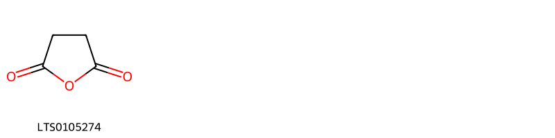
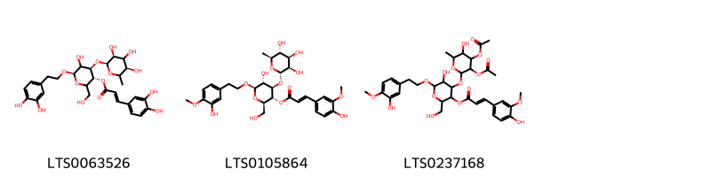
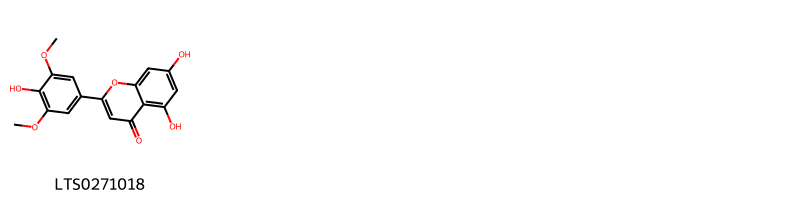

!!! abstract "Tóm tắt"
    Xích đồng nam (Radix Clerodendri japonici, họ Cỏ roi ngựa - Verbenaceae) là rễ khô của cây Xích đồng nam (Clerodendrum japonicum (Thunb.) Sweet.), phân bố ở Đông Nam Á và Việt Nam. Trong y học cổ truyền, dược liệu được dùng để giải độc, khu phong, tiêu viêm, chữa thấp khớp, đau lưng, viêm mật và vàng da. Thành phần chính gồm triterpenoid, flavonoid, saponin, tanin và vitamin, với tác dụng chống viêm, bảo vệ gan, hạ huyết áp và điều hòa kinh nguyệt. Tính vị khổ, lương, quy kinh tâm và tỳ.

## Thông tin về thực vật

### Đặc điểm thực vật

Dược liệu **Xích Đồng Nam (Rễ)** từ bộ phận **** từ loài *Clerodendrum japonicum (Thunb.) Sweet.* thuộc họ Lamiaceae. Cây bụi cao 2m, cành vuông có rãnh, có lông mịn, mắt có lằn lông nối liền 2 cuống. Lá có phiến hình tim, rộng 30cm, không lông, mép có răng cưa nhỏ, cuống dài 5-20cm. Chùy hoa mọc ở ngọn cành, cao 45cm, đỏ chói hoặc hồng, dài 8mm; ống tràng cao 1,5cm, thùy tràng 5mm. Quả hạch cứng lam đen, to 12mm, trên đài đồng trưởng to 3,5cm. 

!!! info "Phân loại thực vật của *Clerodendrum japonicum*"
    - **Kingdom:** Plantae
    - **Phylum:** Tracheophyta
    - **Order:** Lamiales
    - **Family:** Lamiaceae
    - **Genus:** Clerodendrum
    - **Species:** *Clerodendrum japonicum*

*Tài liệu tham khảo:* "Từ điển cây thuốc Việt Nam" - Võ Văn Chi

 

### Loài thay thế (Nếu có)

### Phân bố trên thế giới
**Từ vườn thực vật KEW: **: Native to:
Andaman Is., Assam, Bangladesh, Borneo, China South-Central, China Southeast, East Himalaya, Jawa, Laos, Nepal, Philippines, Sumatera, Taiwan, Thailand, Tibet, Vietnam
Introduced into:
Japan, Korea, Malaya, Mexico Southeast, Mexico Southwest, Sri Lanka

**Từ CSDL GIBF** Mexico, Brazil, Viet Nam, China, Hong Kong, Indonesia, Japan, Chinese Taipei, Malaysia, Philippines

### Phân bố tại Việt Nam
** "Từ điển cây thuốc Việt Nam" - Võ Văn Chi**: Sơn La, Hà Giang, Tuyên Quang, Bắc Giang, Bắc Ninh, Phú Thọ, Vĩnh Phúc, Hà Nội, Hòa Bình, Hải Phòng, Nam Định, Hà Nam, Ninh Bình, Thanh Hóa, Nghệ An, Hà Tĩnh, Quảng Bình, Quảng Trị, Thừa Thiên - Huế, Đà Nẵng, Quảng Nam

**Từ CSDL GIBF**: Đà Nẵng, Ninh Bình, Quảng Trị, Quảng Nam, Nghệ An, Đồng Nai, Thanh Hóa, Hải Phòng

---

## Thông tin về dược liệu 

### Định danh

!!! info "Thông tin về tên gọi của xích đồng nam"
    - Dược liệu tiếng Việt: xích đồng nam
    - Dược liệu tiếng Trung:  ()
    - Dược liệu tiếng Anh: 
    - Dược liệu latin thông dụng: Radix Clerodendri japonici
    - Dược liệu latin kiểu DĐVN: radix clerodendri japonici
    - Dược liệu latin kiểu DĐVN: 
    - Dược liệu latin kiểu thông tư: 
    - Bộ phận dùng:  (Radix)

### Mô tả dược liệu 
- **Theo dược điển Việt nam V:** Rễ hình trụ, thẳng hoặc hơi cong, dài 10 cm đến 30 cm, đường kính 0,5 cm đến 2 cm và có nhiều rễ con. Mặt ngoài màu vàng xám, có những vết nhăn theo chiều dọc. Mặt cắt ngang màu vàng nhạt. Chất giòn cứng, dễ bẻ gãy, mùi thơm nhẹ, vị nhạt.

- **Mô tả dược liệu theo thông tư chế biến dược liệu theo phương pháp cổ truyền:** 

### Chế biến 

- **Chế biến theo dược điển việt nam V**: Chế biến Rễ thu hoạch vào mùa đông, rửa sạch, phơi khô. Bào chế Rễ thái phiến chéo dày 2 mm đến 3 mm. sao vàng.

- **Chế biến theo thông tư:** 

--- 

## Thành phần hóa học

- Theo tài liệu của GS. Đỗ Tất Lợi:  (1) Triterpenoid, Flavonoid, Phenylethanoid glycoside, Steroid, Flavonoid glycosid, Diterpenoid, Furantriterpenoid, Alkaloid, Saponin, Tanin, Vitamin.
(2) Không có thông tin cụ thể
    
- Theo cơ sở dữ liệu lotus: Từ loài *Clerodendrum japonicum* đã phân lập và xác định được 7 hoạt chất thuộc về các nhóm Steroids and steroid derivatives, Prenol lipids, Carboxylic acids and derivatives, Cinnamic acids and derivatives, Flavonoids. 

|    | chemicalTaxonomyClassyfireClass   |   smiles_count |
|---:|:----------------------------------|---------------:|
|  0 | Carboxylic acids and derivatives  |              1 |
|  1 | Cinnamic acids and derivatives    |              3 |
|  2 | Flavonoids                        |              1 |
|  3 | Prenol lipids                     |              1 |
|  4 | Steroids and steroid derivatives  |              1 |

### Nhóm Carboxylic acids and derivatives
<figure markdown="span">
    { width=100% }
    <figcaption>Hình ảnh cấu trúc hóa học của 1 hoạt chất thuộc nhóm Carboxylic acids and derivatives gồm ['succinic anhydride (LTS0105274)'].</figcaption>
</figure>
### Nhóm Cinnamic acids and derivatives
<figure markdown="span">
    { width=100% }
    <figcaption>Hình ảnh cấu trúc hóa học của 3 hoạt chất thuộc nhóm Cinnamic acids and derivatives gồm ['(3r,4r,6r)-6-[2-(3,4-dihydroxyphenyl)ethoxy]-5-hydroxy-2-(hydroxymethyl)-4-{[(2s,3s,5r)-3,4,5-trihydroxy-6-methyloxan-2-yl]oxy}oxan-3-yl (2e)-3-(3,4-dihydroxyphenyl)prop-2-enoate (LTS0063526)', '(2r,3r,4r,5r,6r)-5-hydroxy-6-[2-(3-hydroxy-4-methoxyphenyl)ethoxy]-2-(hydroxymethyl)-4-{[(2s,3r,4r,5r,6s)-3,4,5-trihydroxy-6-methyloxan-2-yl]oxy}oxan-3-yl (2e)-3-(4-hydroxy-3-methoxyphenyl)prop-2-enoate (LTS0105864)', '4-{[3,4-bis(acetyloxy)-5-hydroxy-6-methyloxan-2-yl]oxy}-5-hydroxy-6-[2-(3-hydroxy-4-methoxyphenyl)ethoxy]-2-(hydroxymethyl)oxan-3-yl 3-(4-hydroxy-3-methoxyphenyl)prop-2-enoate (LTS0237168)'].</figcaption>
</figure>
### Nhóm Flavonoids
<figure markdown="span">
    { width=100% }
    <figcaption>Hình ảnh cấu trúc hóa học của 1 hoạt chất thuộc nhóm Flavonoids gồm ['tricin (LTS0271018)'].</figcaption>
</figure>
### Nhóm Prenol lipids
<figure markdown="span">
    { width=100% }
    <figcaption>Hình ảnh cấu trúc hóa học của 1 hoạt chất thuộc nhóm Prenol lipids gồm ['ursolic acid (LTS0250838)'].</figcaption>
</figure>
### Nhóm Steroids and steroid derivatives
<figure markdown="span">
    { width=100% }
    <figcaption>Hình ảnh cấu trúc hóa học của 1 hoạt chất thuộc nhóm Steroids and steroid derivatives gồm ['phytosterol (LTS0029311)'].</figcaption>
</figure>

---

## Tác dụng dược lý

Theo tài liệu "Từ điển cây thuốc Việt Nam" - Võ Văn Chi:Làm giảm khí hư, mùi hôi ở vùng kín, chống rối loạn kinh nguyệt ở phụ nữ.
Bảo vệ gan, ngăn ngừa và cải thiện các triệu chứng nhẹ của xơ gan, vàng da, viêm gan.
Chống viêm, giảm đau đầu mức độ nhẹ.
Giúp hạ huyết áp.

Theo tài liệu quốc tế: 

---

## Dược điển Việt Nam V

### Soi bột:
Các hạt tinh bột tròn, đứng riêng lẻ hoặc tập trung thành các dạng kép 2, kép 3 hoặc 4. Mảnh bần màu nâu đỏ bao gồm các tế bào hình chữ nhật dài, thành mỏng. Mảnh mô mềm chứa các hạt tinh bột. Tinh thể calci oxalat hình khối đứng riêng lẻ hoặc tập trung thành từng đám trong tể bào mô cứng. Các tế bào mô cứng thành dày, đứng riêng lẻ hoặc tập trung thành đám. Mảnh mạch điểm.
<!-- Hình ảnh soi bột sẽ được tự động chèn vào đây sau -->
### Vi phẫu:
Lớp bẩn gồm tế bào hình chữ nhật xếp đều đặn, xếp thành hàng có nhiều chồ bị nứt, rách. Mô mềm vỏ gồm các tế bào hình trứng, thành mỏng. Mô cứng gồm các tể bào, thành dày hóa gỗ, tụ thành đảm rải rác thành vòng bao ngoài lớp libe, trong có chứa nhiều tinh thể calci oxalat hình khối. Libe gồm các tể bào nhỏ bao ngoài lớp gỗ. Tầng phát sinh libe-gỗ gồm một hàng tế bào thành mỏng. Gỗ gồm các mạch to nhỏ khác nhau, bó gỗ xuất phát từ tâm. Trong cùng là lớp mô mềm ruột, bao gồm những tế bào hình đa giác.nn
<!-- Hình ảnh vi phẫu sẽ được tự động chèn vào đây sau -->
### Định tính

A.Lấy khoảng 5 g bột dược liệu cho vào bình nón có dung tích 100 ml, thêm 50 ml ethanol 90 % (TT). Lắc kỹ, đun trong cách thủy 10 min, lọc. Cô dịch lọc trên cách thủy đến khi còn khoảng 5 ml để làm các phản ứng sau: Lấy 1 ml dịch lọc, thêm 5 giọt acid hydrocloric (TT) và ít bột magnesi (TT), lắc đều, xuất hiện màu đỏ hồng. Lấy 1 ml dịch lọc, thêm 2 giọt dung dịch natri hydroxyd 20 % (TT), xuất hiện tủa vàng cam, tủa sẽ tan trong lượng dư thuổc thử. Lấy 1 ml dịch lọc, thêm 1 ml ethanol 90 % (TT), lắc đều, thêm 3 giọt dung dịch sắt (III) clorid 5 % (TT), dung dịch thu được chuyển từ xanh nhạt sang xanh đen. B. Phương pháp sắc ký lớp mỏng (Phụ lục 5.4) Bản mỏng: Silica gel GF254. Dung môi khai triển: Toluen – ethyl acetat – acid formic (4:4:0,5). Dung dịch thử: Lấy khoảng 10 g bột dược liệu, thêm 100 ml methanol (TT). Đun hồi lưu trong cách thủy 15 min. Lấy dịch chiết, lọc qua giấy lọc, cô dịch lọc trên cách thủy đến còn 5 ml để lám dịch chấm sắc ký. Dung dịch đổi chiếu: Lấy khoảng 10 g bột rễ Xích đồng nam (mẫu chuẩn), tiến hành chiết như dung dịch thử. Cách tiến hành: Chấm riêng biệt lên bản mỏng 10 µl mỗi dung dịch trên. Sau khi triển khai, lấy bản mỏng để khô trong không khí. Quan sát sắc ký đồ dưới ánh sáng tử ngoại ở bước sóng 366 nm và hiện màu bằng hơi iod. Trên sắc ký đồ của dung dịch thử phải có các vết cùng màu sắc và cùng giá trị Rf với các vết trên sắc ký đồ của dung địch đối chiếu.

### Định lượng

Cân chính xác khoảng 10 g bột dược liệu (qua rây số 355) cho vào bình nón. Thêm 100 ml methanol (TT), lắc siêu âm 30 min, gạn lấy dịch chiết. Bã được chiết như trên 2 lần nữa. Gộp các dịch chiết methanol, cất thu hồi methanol dưới áp suất giảm đến còn khoảng 20 ml dịch chiết. Thêm 10 ml nước nóng. đun trong cách thùy 60 °C trong 30 min, khuấy kỹ để hòa tan. Lọc nóng qua bông, sau đó lọc tiếp qua giấy lọc gấp nếp. Lọc và tráng nhiều lần để thu dịch lọc (5 ml nước nóng/1 lần x 5 lần). Để nguội, gộp dịch lọc và dịch tráng vào bình gạn, lắc với ethyl acetat (TT) 5 lần, mỗi lần 50 ml. Gộp dịch chiết ethyl acetat, cất thu hồi dung môi dưới áp suất giảm còn khoảng 20 ml, cho dịch chiết này vào cốc đã cân bì. Bốc hơi trên cách thủy tới cấn. sấy cấn ờ 60 °C đến khối lượng không đổi, đề nguội trong bình hút ẩm 30 min rồi đem cân ngay. Tính hàm lượng cấn thu được. Hàm lượng cấn thu được phải không được ít hơn 0,2 % tính theo dược liệu khô kiệt.

### Thông tin khác 
- ** Độ ẩm: ** Không quá 10,0 % (Phụ lục 9.6,1 g. 105 °C, 5 h).

- ** Bảo quản:** Trong bao bì kín, tránh ẩm, để nơi khô ráo.nn
## Dược điển Hồng kong

<!-- PDF sẽ được tự động chèn vào đây sau -->

---

## Y dược học cổ truyền

- **Tên vị thuốc:** 
- **Tính vị quy kinh:** Vi khổ, lương, vào 2 kinh tâm, tỳ.
- **Công năng chủ trị:** Công năng: Thân nhiệt giải độc, khu phong trừ thấp, tiêu viêm.
Chủ trị: Thấp khớp, đau lưng, đau gối, tế bại chân tay, viêm mật, vàng da, niêm mạc mắt bị vàng thẫm, nước tiểu có sắc tố mật.
- **Chú ý:** 
- **Kiêng kỵ:** 

