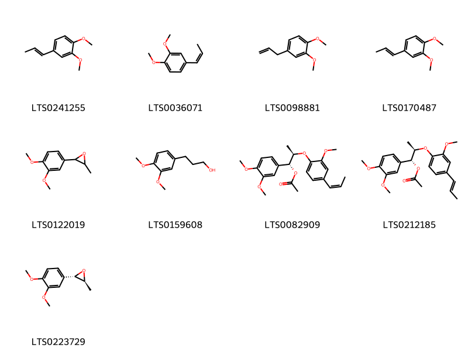
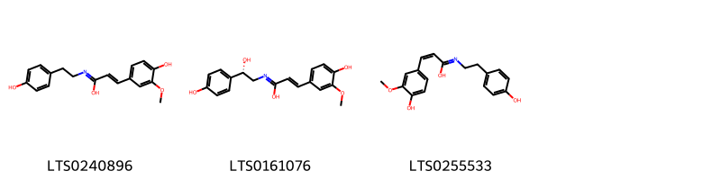
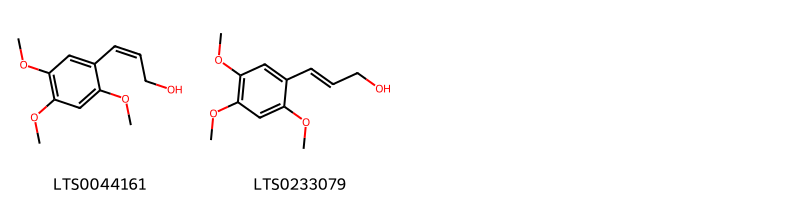
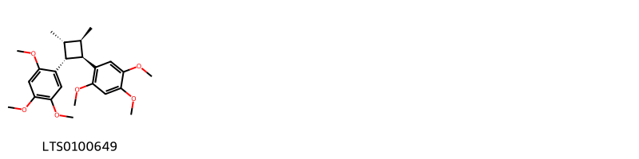
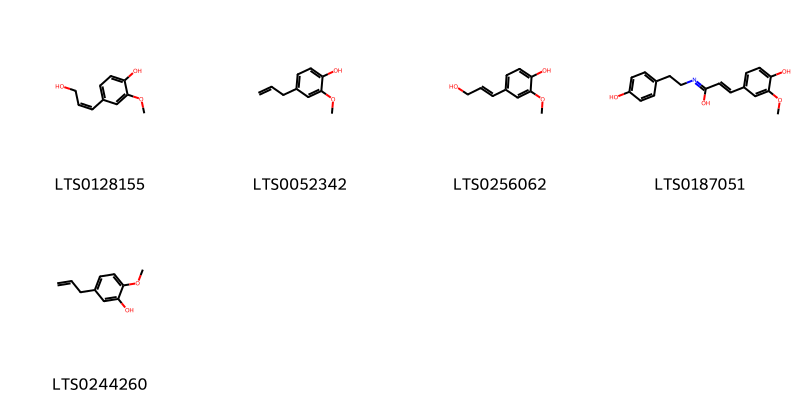
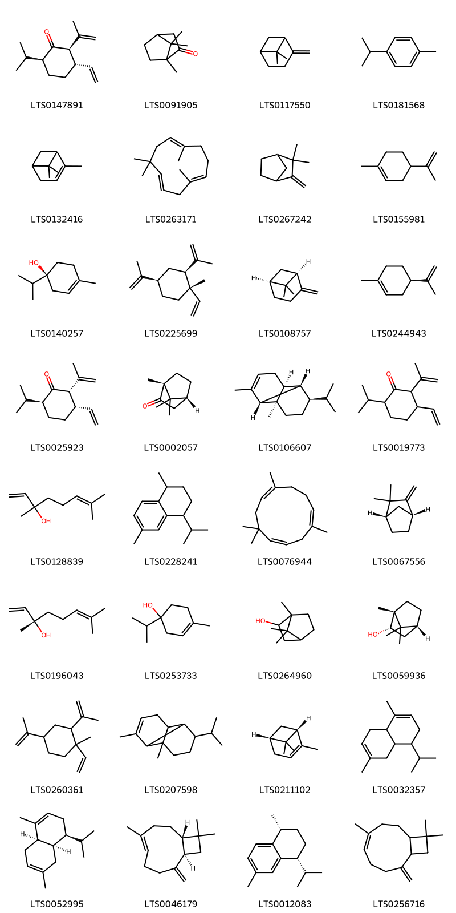

!!! abstract "Tóm tắt"
    Xương bồ, có tên khoa học là Acorus calamus thuộc họ Araceae, là một loài thực vật quý hiếm với nhiều công dụng trong y học cổ truyền. Loài cây này mọc hoang tại các vùng núi miền Bắc và Trung Việt Nam, thường tìm thấy ở những nơi khe đá, khe suối, và chỗ mát. Xương bồ từ lâu đã được sử dụng trong dân gian để điều trị các bệnh lý như đau lưng, đau cổ, và các vấn đề tiêu hóa. 

 Thành phần hóa học của xương bồ chủ yếu bao gồm tinh dầu với các hợp chất như asaron, acorenon, và iso-acorenon. Thạch xương bồ chứa khoảng 0,5 - 0,8% tinh dầu, trong đó có 86% asaron, trong khi thủy xương bồ chứa 1,5 - 3,5% tinh dầu với thành phần chính là asaron và asarylandehyt, cùng với glucoside đắng gọi là acorin và tanin.

Với khả năng kích thích sự phân tiết các dịch tiêu hóa, xương bồ giúp cải thiện quá trình tiêu hóa và giảm bớt sự lên men không bình thường trong dạ dày và ruột. Nó cũng giúp giảm căng thẳng cơ trơn trong ruột, làm dịu đi những cảm giác khó chịu và căng tức. Đặc biệt, xương bồ có thể tăng cường tuần hoàn máu tại chỗ, hỗ trợ chữa lành các vết thương ngoài da nhanh hơn. Trong lĩnh vực điều trị các bệnh tim mạch, xương bồ có tác dụng dự phòng và điều trị loạn nhịp tim, cũng như điều hòa nhịp tim trong lâm sàng.

Xương bồ thực sự là một dược liệu quý báu, được y học cổ truyền lẫn y học hiện đại đánh giá cao nhờ những tác dụng phong phú và đa dạng đối với sức khỏe con người.

## Thông tin về thực vật

### Đặc điểm thực vật

Dược liệu **Xương Bồ** từ bộ phận **nan** từ loài *Acorus gramineus Soland. var. macrospadiceus Yamamoto Contr)* thuộc họ Acoraceae. "Thạch Xương Bồ
Thạch xương bồ là một loại cỏ sống lâu năm với các đặc điểm sau:

Thân rễ: Mọc ngang, đường kính tương đương ngón tay, có nhiều đốt với các sẹo lá. Khi khô, thân rễ có màu nâu sắt và mùi thơm đặc trưng. Thân rễ dài khoảng 20 cm đến 5 cm, đường kính từ 5 mm đến 7 mm.

Lá: Mọc đứng, hình dải, dài từ 30-50 cm, rộng 2-6 mm, chỉ có gân giữa.

Hoa: Hoa mọc thành bông mo ở đầu một cán dẹt dài 10-30 cm, được phủ bởi một lá bắc dài 7-20 cm, rộng 2-4 mm, vượt cao hơn cụm hoa. Cụm hoa dài từ 5-12 cm, đường kính 2-4 mm.

Quả: Quả mọng màu đỏ nhạt, một ngăn, có thành gần như khô, quanh hạt có một chất nhầy.

Thủy Xương Bồ (Acorus calamus)
Thủy xương bồ cũng có các đặc điểm tương tự như thạch xương bồ nhưng lớn và cao hơn:

Thân rễ: Hình trụ dẹt, dài trung bình từ 50 cm đến 60 cm, có khi tới 1 m, dày 0,5 cm đến 1 cm, đốt dài khoảng 1 cm. Mặt vỏ có màu nâu sắt với nhiều chấm đen. Thân rễ có mùi thơm đặc trưng, thể chất dai và xốp.

Lá: Dài từ 50-150 cm, rộng 6-30 mm. Lá bắc của cán hoa cũng dài hơn, thường tới 45 cm.

Hoa: Cụm hoa mọc thành bóng mẫm, so với cụm hoa của thạch xương bồ thì to và ngắn hơn, dài từ 4-8 cm, đường kính 6-12 mm. Mùa hoa vào tháng 5-7, mùa quả từ tháng 6-8." 

!!! info "Phân loại thực vật của *Acorus gramineus*"
    - **Kingdom:** Plantae
    - **Phylum:** Tracheophyta
    - **Order:** Acorales
    - **Family:** Acoraceae
    - **Genus:** Acorus
    - **Species:** *Acorus gramineus*

*Tài liệu tham khảo:* "Những cây thuốc và vị thuốc Việt Nam" - Đỗ Tất Lợi

 

### Loài thay thế (Nếu có)

Dược liệu này cũng có thể từ loài *Acorus calamus L. var. angustatus Bess.*, thông tin về phân loại thực vật loài này như sau:
!!! info "Thông tin về phân loại thực vật của *Acorus calamus*"
    - **kingdom:** Plantae
    - **phylum:** Tracheophyta
    - **order:** Acorales
    - **family:** Acoraceae
    - **genus:** Acorus
    - **species:** *Acorus calamus*

Hình ảnh của loài *Acorus calamus L. var. angustatus Bess.*:

### Phân bố trên thế giới
**Từ vườn thực vật KEW: **: Bản địa: Kazakhstan

Di thực: Alabama, Albania, Altay, Andaman Is., Arkansas, Assam, Austria, Baltic States, Bangladesh, Belarus, Belgium, Bulgaria, California, Cape Provinces, Central European Russia, China North-Central, Colorado, Connecticut, Czechoslovakia, Delaware, Denmark, District of Columbia, East European Russia, East Himalaya, Finland, France, Free State, Føroyar, Georgia, Germany, Great Britain, Hungary, Iceland, Illinois, Indiana, Iowa, Ireland, Italy, Jawa, Kansas, Kentucky, Kirgizstan, Korea, Krym, Louisiana, Maine, Manchuria, Maryland, Massachusetts, Michigan, Minnesota, Mississippi, Missouri, Nebraska, Nepal, Netherlands, New Brunswick, New Guinea, New Hampshire, New Jersey, New York, North Carolina, North Caucasus, North European Russia, Northwest European Russia, Norway, Nova Scotia, Ohio, Oklahoma, Ontario, Oregon, Pakistan, Pennsylvania, Poland, Québec, Rhode I., Romania, Sicilia, South Carolina, South European Russia, Svalbard, Sweden, Switzerland, Tennessee, Texas, Transcaucasus, Turkey, Turkey-in-Europe, Ukraine, Uzbekistan, Vermont, Virginia, West Himalaya, West Virginia, Wisconsin, Yugoslavia

**Từ CSDL GIBF** nan, Belgium, Korea, Republic of, Viet Nam, China, Hong Kong, Macao, United States of America, Japan, United Kingdom of Great Britain and Northern Ireland, Chinese Taipei, Germany, Philippines

### Phân bố tại Việt Nam
** "Những cây thuốc và vị thuốc Việt Nam" - Đỗ Tất Lợi**: Thạch xương bố và thuỷ xương bồ mọc hoang tại những vùng núi miền Bắc và Trung nước ta, thường ở những nơi khe đá, khe suối, chỗ mát.

**Từ CSDL GIBF**: Không có ghi nhận ở Việt Nam

---

## Thông tin về dược liệu 

### Định danh

!!! info "Thông tin về tên gọi của nan"
    - Dược liệu tiếng Việt: nan
    - Dược liệu tiếng Trung: nan (nan)
    - Dược liệu tiếng Anh: nan
    - Dược liệu latin thông dụng: nan
    - Dược liệu latin kiểu DĐVN: rhizoma acori
    - Dược liệu latin kiểu DĐVN: nan
    - Dược liệu latin kiểu thông tư: nan
    - Bộ phận dùng: nan (nan)

### Mô tả dược liệu 
- **Theo dược điển Việt nam V:** nan

- **Mô tả dược liệu theo thông tư chế biến dược liệu theo phương pháp cổ truyền:** nan

### Chế biến 

- **Chế biến theo dược điển việt nam V**: nan

- **Chế biến theo thông tư:** nan

--- 

## Thành phần hóa học

- Theo tài liệu của GS. Đỗ Tất Lợi:  (1) Nhóm hóa học: Tinh dầu: Chứa các hợp chất như Asaron, acorenon, iso-acorenon.

(2) Tên hoạt chất là biomarker: Asaron
    
- Theo cơ sở dữ liệu lotus: Từ loài *Acorus gramineus* đã phân lập và xác định được 89 hoạt chất thuộc về các nhóm Lignan glycosides, Cinnamyl alcohols, Organooxygen compounds, Cyclobutane lignans, Prenol lipids, Benzene and substituted derivatives, Furanoid lignans, Phenols, Benzodioxoles, Phenol ethers, Cinnamic acids and derivatives. 

|    | chemicalTaxonomyClassyfireClass     |   smiles_count |
|---:|:------------------------------------|---------------:|
|  0 |                                     |             14 |
|  1 | Benzene and substituted derivatives |              9 |
|  2 | Benzodioxoles                       |              1 |
|  3 | Cinnamic acids and derivatives      |              3 |
|  4 | Cinnamyl alcohols                   |              2 |
|  5 | Cyclobutane lignans                 |              1 |
|  6 | Furanoid lignans                    |              8 |
|  7 | Lignan glycosides                   |              1 |
|  8 | Organooxygen compounds              |              1 |
|  9 | Phenol ethers                       |             11 |
| 10 | Phenols                             |              5 |
| 11 | Prenol lipids                       |             32 |

### Nhóm 
<figure markdown="span">
    { width=100% }
    <figcaption>Hình ảnh cấu trúc hóa học của 14 hoạt chất thuộc nhóm  gồm ['surinamensin (LTS0197680)', '(1r,2r)-2-[2,6-dimethoxy-4-(prop-1-en-1-yl)phenoxy]-1-(3,4,5-trimethoxyphenyl)propan-1-ol (LTS0059815)', '(7r,8r)-polysphorin (LTS0083112)', '(1s,2s)-1-(4-hydroxy-3-methoxyphenyl)-2-[4-(3-hydroxypropyl)-2-methylphenoxy]propane-1,3-diol (LTS0142850)', 'ligraminol d (LTS0199294)', '(1r,2r)-1-(4-hydroxy-3-methoxyphenyl)-2-[4-(3-hydroxypropyl)-2-methylphenoxy]propane-1,3-diol (LTS0189565)', '(1s,2s)-1-(4-hydroxy-3-methoxyphenyl)-2-[4-(3-hydroxypropyl)-2-methoxyphenoxy]propane-1,3-diol (LTS0213846)', '(1r,2r)-1-(3,4-dimethoxyphenyl)-2-{2-methoxy-4-[(1e)-prop-1-en-1-yl]phenoxy}propan-1-ol (LTS0225347)', '(1r,2r)-2-[4-(3-hydroxypropyl)-2-methoxyphenoxy]-1-(3,4,5-trimethoxyphenyl)propan-1-ol (LTS0236208)', '(1s,2r)-2-[4-(3-hydroxypropyl)-2-methoxyphenoxy]-1-(3,4,5-trimethoxyphenyl)propan-1-ol (LTS0061584)', '(1r,2r)-2-{2,6-dimethoxy-4-[(1e)-prop-1-en-1-yl]phenoxy}-1-(3,4-dimethoxyphenyl)propan-1-ol (LTS0221540)', 'ligraminol e (LTS0238492)', '(1s,2r)-1-(4-hydroxy-3-methoxyphenyl)-2-[4-(3-hydroxypropyl)-2,6-dimethoxyphenoxy]propane-1,3-diol (LTS0234616)', '(1r,2r)-1-(4-hydroxy-3-methoxyphenyl)-2-[4-(3-hydroxypropyl)-2-methoxyphenoxy]propane-1,3-diol (LTS0241971)'].</figcaption>
</figure>
### Nhóm Benzene and substituted derivatives
<figure markdown="span">
    { width=100% }
    <figcaption>Hình ảnh cấu trúc hóa học của 9 hoạt chất thuộc nhóm Benzene and substituted derivatives gồm ['isoeugenyl methyl ether (LTS0241255)', '(z)-methyl isoeugenol (LTS0036071)', 'methyl eugenol (LTS0098881)', 'methyl isoeugenol (LTS0170487)', '2-(3,4-dimethoxyphenyl)-3-methyloxirane (LTS0122019)', '3,4-dimethoxybenzenepropanol (LTS0159608)', 'ligraminol c (LTS0082909)', '(1r,2r)-1-(3,4-dimethoxyphenyl)-2-[2-methoxy-4-(prop-1-en-1-yl)phenoxy]propyl acetate (LTS0212185)', '(2s,3s)-2-(3,4-dimethoxyphenyl)-3-methyloxirane (LTS0223729)'].</figcaption>
</figure>
### Nhóm Benzodioxoles
<figure markdown="span">
    { width=100% }
    <figcaption>Hình ảnh cấu trúc hóa học của 1 hoạt chất thuộc nhóm Benzodioxoles gồm ['sassafras (LTS0136093)'].</figcaption>
</figure>
### Nhóm Cinnamic acids and derivatives
<figure markdown="span">
    { width=100% }
    <figcaption>Hình ảnh cấu trúc hóa học của 3 hoạt chất thuộc nhóm Cinnamic acids and derivatives gồm ['3-(4-hydroxy-3-methoxyphenyl)-n-[2-(4-hydroxyphenyl)ethyl]prop-2-enimidic acid (LTS0240896)', '(2e)-n-[(2s)-2-hydroxy-2-(4-hydroxyphenyl)ethyl]-3-(4-hydroxy-3-methoxyphenyl)prop-2-enimidic acid (LTS0161076)', '(2z)-3-(4-hydroxy-3-methoxyphenyl)-n-[2-(4-hydroxyphenyl)ethyl]prop-2-enimidic acid (LTS0255533)'].</figcaption>
</figure>
### Nhóm Cinnamyl alcohols
<figure markdown="span">
    { width=100% }
    <figcaption>Hình ảnh cấu trúc hóa học của 2 hoạt chất thuộc nhóm Cinnamyl alcohols gồm ['(2z)-3-(2,4,5-trimethoxyphenyl)prop-2-en-1-ol (LTS0044161)', '3-(2,4,5-trimethoxyphenyl)prop-2-en-1-ol (LTS0233079)'].</figcaption>
</figure>
### Nhóm Cyclobutane lignans
<figure markdown="span">
    { width=100% }
    <figcaption>Hình ảnh cấu trúc hóa học của 1 hoạt chất thuộc nhóm Cyclobutane lignans gồm ['magnosalin (LTS0100649)'].</figcaption>
</figure>
### Nhóm Furanoid lignans
<figure markdown="span">
    { width=100% }
    <figcaption>Hình ảnh cấu trúc hóa học của 8 hoạt chất thuộc nhóm Furanoid lignans gồm ['(+)-veraguensin (LTS0159494)', '(2r,3r,4r,5s)-2,4-dimethyl-3,5-bis(2,4,5-trimethoxyphenyl)oxolane (LTS0234140)', '2,5-bis(3,4-dimethoxyphenyl)-3,4-dimethyloxolane (LTS0021613)', '5-methoxygalbelgin (LTS0134265)', 'ganschisandrin (LTS0061953)', 'ligraminol a (LTS0123044)', '2-(3,4-dimethoxyphenyl)-3,4-dimethyl-5-(3,4,5-trimethoxyphenyl)oxolane (LTS0078708)', 'veraguensin (LTS0156113)'].</figcaption>
</figure>
### Nhóm Lignan glycosides
<figure markdown="span">
    { width=100% }
    <figcaption>Hình ảnh cấu trúc hóa học của 1 hoạt chất thuộc nhóm Lignan glycosides gồm ['ligraminol b (LTS0088252)'].</figcaption>
</figure>
### Nhóm Organooxygen compounds
<figure markdown="span">
    { width=100% }
    <figcaption>Hình ảnh cấu trúc hóa học của 1 hoạt chất thuộc nhóm Organooxygen compounds gồm ['3-hydroxy-1-(4-hydroxyphenyl)propan-1-one (LTS0075622)'].</figcaption>
</figure>
### Nhóm Phenol ethers
<figure markdown="span">
    { width=100% }
    <figcaption>Hình ảnh cấu trúc hóa học của 11 hoạt chất thuộc nhóm Phenol ethers gồm ['cis-asarone (LTS0188628)', 'β-asarone (LTS0003070)', '2-methyl-3-(2,4,5-trimethoxyphenyl)oxirane (LTS0174916)', '1,2,4-trimethoxy-5-(prop-2-en-1-yl)benzene (LTS0252786)', '1,2,4-trimethoxy-5-(prop-1-en-1-yl)benzene (LTS0011897)', 'isoelemicin (LTS0011456)', '3-(3,4,5-trimethoxyphenyl)propan-1-ol (LTS0018387)', '1,2,3-trimethoxy-5-(prop-1-en-1-yl)benzene (LTS0176755)', 'elemicin (LTS0188875)', '(2s,3s)-2-methyl-3-(2,4,5-trimethoxyphenyl)oxirane (LTS0186475)', '1,2,3-trimethoxy-5-[(1z)-prop-1-en-1-yl]benzene (LTS0266874)'].</figcaption>
</figure>
### Nhóm Phenols
<figure markdown="span">
    { width=100% }
    <figcaption>Hình ảnh cấu trúc hóa học của 5 hoạt chất thuộc nhóm Phenols gồm ['4-[(1z)-3-hydroxyprop-1-en-1-yl]-2-methoxyphenol (LTS0128155)', 'eugenol (LTS0052342)', '4-(3-hydroxyprop-1-en-1-yl)-2-methoxyphenol (LTS0256062)', '(2e)-3-(4-hydroxy-3-methoxyphenyl)-n-[2-(4-hydroxyphenyl)ethyl]prop-2-enimidic acid (LTS0187051)', 'chavibetol (LTS0244260)'].</figcaption>
</figure>
### Nhóm Prenol lipids
<figure markdown="span">
    { width=100% }
    <figcaption>Hình ảnh cấu trúc hóa học của 32 hoạt chất thuộc nhóm Prenol lipids gồm ['(2r,3s,6s)-3-ethenyl-6-isopropyl-2-(prop-1-en-2-yl)cyclohexan-1-one (LTS0147891)', 'camphor (LTS0091905)', 'β-pinene (LTS0117550)', 'cymene (LTS0181568)', 'α pinene (LTS0132416)', 'humulene (LTS0263171)', 'camphene (LTS0267242)', 'limonene,  (LTS0155981)', '(+)-4-terpineol (LTS0140257)', 'β-elemene (LTS0225699)', '(-)-β-pinene (LTS0108757)', 'α-limonene (LTS0244943)', '(2s,3s,6s)-3-ethenyl-6-isopropyl-2-(prop-1-en-2-yl)cyclohexan-1-one (LTS0025923)', 'd-camphor (LTS0002057)', '(1r,2s,6s,7s,8r)-8-isopropyl-1,3-dimethyltricyclo[4.4.0.0²,⁷]dec-3-ene (LTS0106607)', '3-ethenyl-6-isopropyl-2-(prop-1-en-2-yl)cyclohexan-1-one (LTS0019773)', 'linalool, (+-)- (LTS0128839)', '(e)-calamene (LTS0228241)', 'α-humulene (LTS0076944)', '(-)-camphene (LTS0067556)', '(+)-linalool (LTS0196043)', '4-terpineol (LTS0253733)', 'borneol (LTS0264960)', '(+)-borneol (LTS0059936)', 'β-elemene (LTS0260361)', 'α-copaene (LTS0207598)', '(+)-α-pinene (LTS0211102)', '4-isopropyl-1,6-dimethyl-3,4,4a,5,8,8a-hexahydronaphthalene (LTS0032357)', '(4s,4ar,8ar)-4-isopropyl-1,6-dimethyl-3,4,4a,5,8,8a-hexahydronaphthalene (LTS0052995)', '(+)-caryophyllene (LTS0046179)', '(1r,4r)-4-isopropyl-1,6-dimethyl-1,2,3,4-tetrahydronaphthalene (LTS0012083)', '4,11,11-trimethyl-8-methylidenebicyclo[7.2.0]undec-4-ene (LTS0256716)'].</figcaption>
</figure>

---

## Tác dụng dược lý

Theo tài liệu "Những cây thuốc và vị thuốc Việt Nam" - Đỗ Tất Lợi:- Kích thích sự phân tiết các dịch tiêu hoá
- Giảm căng thẳng cơ trơn trong ruột
- Chữa vết thương ngoài da
- Dự phòng và điều trị loạn nhịp tim
- Điều hòa nhịp tim trong lâm sàng

Theo tài liệu quốc tế: nan

---

## Dược điển Việt Nam V

### Soi bột:
nan
<!-- Hình ảnh soi bột sẽ được tự động chèn vào đây sau -->
### Vi phẫu:
nan
<!-- Hình ảnh vi phẫu sẽ được tự động chèn vào đây sau -->
### Định tính

nan

### Định lượng

nan

### Thông tin khác 
- ** Độ ẩm: ** nan

- ** Bảo quản:** nan
## Dược điển Hồng kong

<!-- PDF sẽ được tự động chèn vào đây sau -->

---

## Y dược học cổ truyền

- **Tên vị thuốc:** nan
- **Tính vị quy kinh:** Tân, ôn. Vào các kinh tâm, can, tv.
- **Công năng chủ trị:** Thông khiếu, trục đờm, tăng trí nhớ, tán phong, khoan
trung khứ thấp, giãi dộc, sát trùng. Chủ trị: Bệnh phong
điên gian, đờm vít tãc, hòn mê, hay quên, mộng nhiều,
viêm phê quàn, tai điếc, đi lỵ đau bụng. Dùng ngoài, trị
mụn nhọt, ghé lớ chây nước.
- **Chú ý:** nan
- **Kiêng kỵ:** nan

