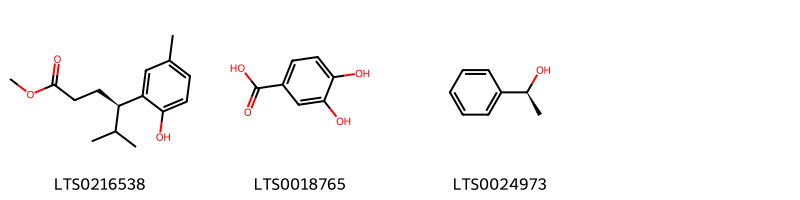
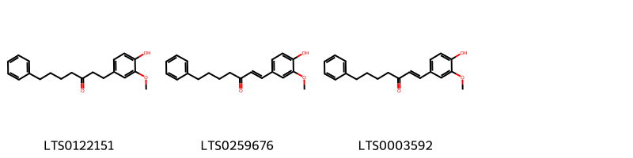
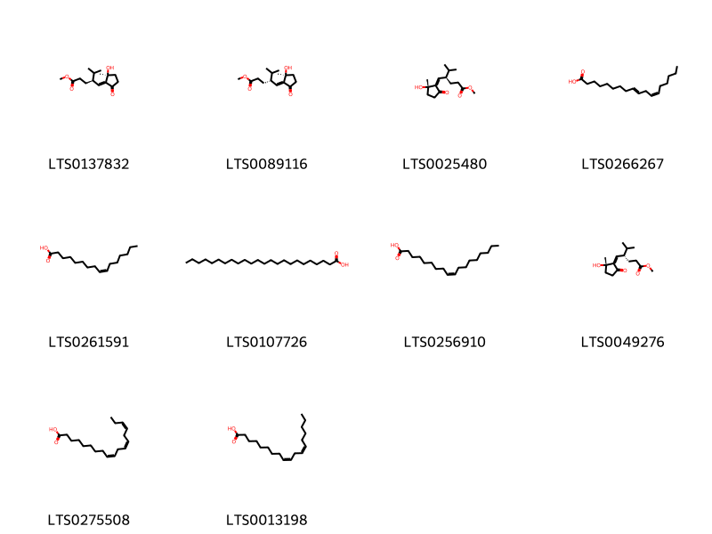
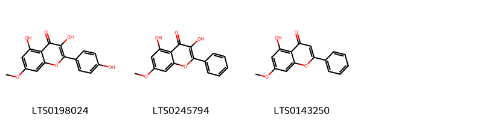
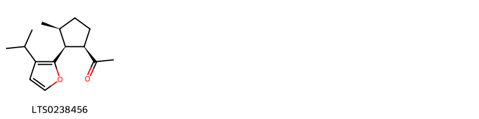
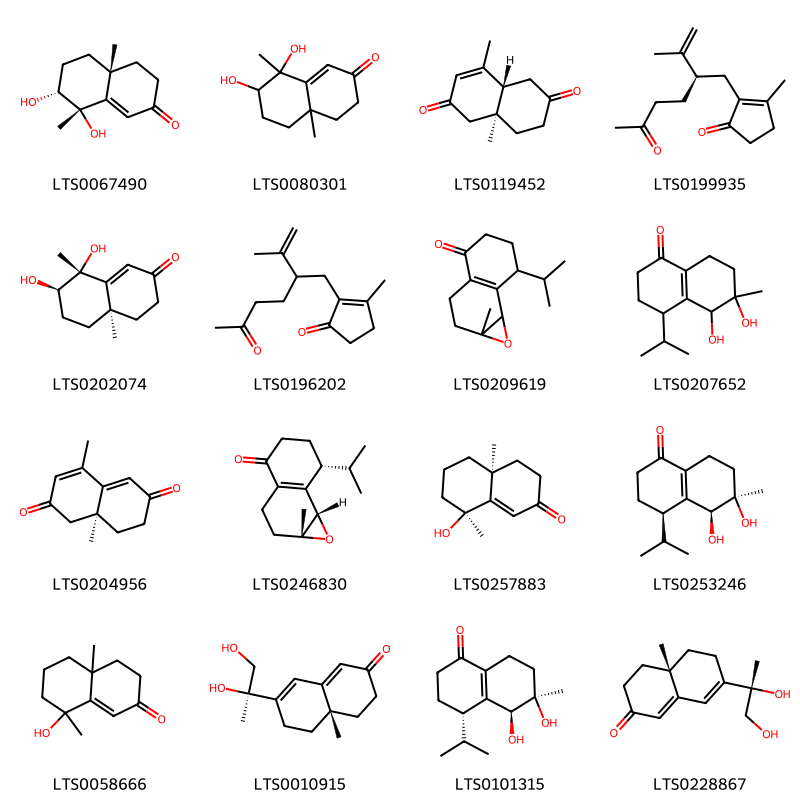
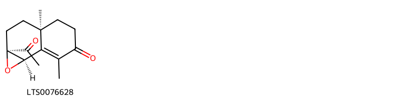
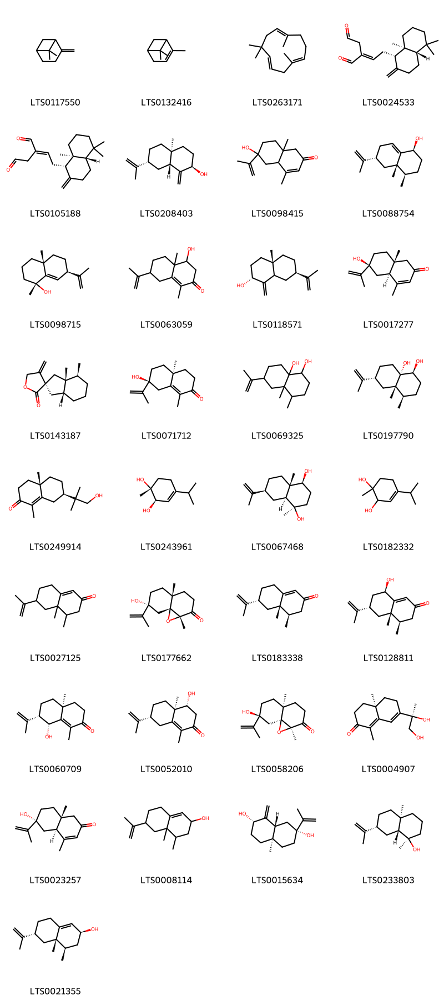
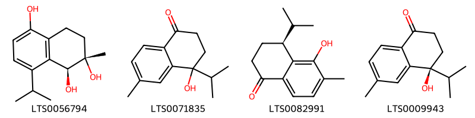

!!! abstract "Tóm tắt"
    Ích trí (Fructus Alpiniae oxyphyllae) (Alpinia oxyphyla Miq - họ Gừng Zingiberaceae). Bộ phận sử dụng: quả. Ích trí là một loại cỏ sống lâu năm, cao 1,5 - 2m, toàn cây có vị cay. Lá hình mác dài 17- 33cm, rộng 3-6cm. Cụm hoa hình chùm mọc ở đầu cành. Hoa màu trắng có đốm tím. Quả hình cầu, đường kính 1,5cm, khi chín có màu vàng xanh, hạt nhiều cạnh, màu nâu đen. Trên thế giới cây có nguồn gốc chủ yếu ở Trung Quốc Nam-Trung Bộ, Trung Quốc Đông Nam Bộ, Hải Nam. Tại Việt Nam chưa rõ nước ta có không. Ích trí nhân mới thấy dùng trong phạm vi đông y. Tính vị của ích trí nhân theo đông y là vị cay, ôn, có tác dụng làm ấm thận, vị, cầm đi ỉa lỏng. Dùng làm thuốc chữa đái dầm, di mộng tinh, bổ dạ dày. Trong ích trí nhân có chừng 0,7% tinh dầu. Cây có chứa thành phần hóa học chủ yếu của tinh dầu là tecpen C10H16, Sesquitecpen C10H24, sesquitecpenancola, chừng 1,71% chất saponin. Chưa tìm thấy hoạt chất là biomarker để định tính trong dược điển Việt Nam V.

## Thông tin về thực vật

### Đặc điểm thực vật

Dược liệu **Ích Trí (Quả)** từ bộ phận **Quả** từ loài *Alpinia oxyphylla Miq* thuộc họ Zingiberaceae. Ích trí là một loại cỏ sống lâu năm, cao 1,5 - 2m, toàn cây có vị cay. Lá hình mác dài 17- 33cm, rộng 3-6cm. Cụm hoa hình chùm mọc ở đầu cành. Hoa màu trắng có đốm tím. Quả hình cầu, đường kính 1,5cm, khi chín có màu vàng xanh, hạt nhiều cạnh, màu nâu đen. 

!!! info "Phân loại thực vật của *Alpinia oxyphylla*"
    - **Kingdom:** Plantae
    - **Phylum:** Tracheophyta
    - **Order:** Zingiberales
    - **Family:** Zingiberaceae
    - **Genus:** Alpinia
    - **Species:** *Alpinia oxyphylla*

*Tài liệu tham khảo:* "Những cây thuốc và vị thuốc Việt Nam" - Đỗ Tất Lợi

 

### Loài thay thế (Nếu có)

### Phân bố trên thế giới
**Từ vườn thực vật KEW: **: Cây có nguồn gốc từ:
Trung Quốc Nam-Trung Bộ, Trung Quốc Đông Nam Bộ, Hải Nam, Việt Nam
Cây được di thực: Không có

**Từ CSDL GIBF** nan, Australia, Viet Nam, China, Hong Kong, United States of America, Japan

### Phân bố tại Việt Nam
** "Những cây thuốc và vị thuốc Việt Nam" - Đỗ Tất Lợi**: Chưa rõ nước ta có không. Hiện còn phải nhập.

**Từ CSDL GIBF**: Không có ghi nhận ở Việt Nam

---

## Thông tin về dược liệu 

### Định danh

!!! info "Thông tin về tên gọi của Ích trí"
    - Dược liệu tiếng Việt: Ích trí
    - Dược liệu tiếng Trung: None (None)
    - Dược liệu tiếng Anh: None
    - Dược liệu latin thông dụng: Fructus Alpiniae oxyphyllae
    - Dược liệu latin kiểu DĐVN: fructus alpiniae oxyphyllae
    - Dược liệu latin kiểu DĐVN: None
    - Dược liệu latin kiểu thông tư: None
    - Bộ phận dùng: Quả (Fructus)

### Mô tả dược liệu 
- **Theo dược điển Việt nam V:** 
Quả hình bầu dục, hai đầu hơi nhọn, dài 1,2 cm đến 2 cm, đường kính 1 cm đến 1,3 cm. Vỏ quả mỏng màu nâu hoặc nâu xám, có 13 đến 20 đường gờ nhỏ, trên bề mặt lồi lõm không đều, ở đỉnh có vết bao hoa, gốc có vết cuống quả. Hạt dính thành khối 3 múi có màng mỏng ngăn cách, mỗi múi có 6 đến 11 hạt. Hạt hình cầu dẹt hoặc nhiều cạnh, không đều, đường kính khoảng 3 mm, màu nâu sáng hoặc vàng sáng, áo hạt mỏng, màu nâu nhạt, chất cứng, nội nhũ màu trắng. Mùi thơm, vị cay, hơi đẳng.

- **Mô tả dược liệu theo thông tư chế biến dược liệu theo phương pháp cổ truyền:** 

### Chế biến 

- **Chế biến theo dược điển việt nam V**: 
Thu hoạch vào mùa hạ, mùa thu, hái lấy quả đã chuyển từ màu xanh lục sang màu đỏ, phơi hay sấy khô ở nhiệt độ thấp.

Dùng sống: Loại bỏ tạp chất và vỏ ngoài, khi dùng giã nát. Diêm ích trí (chế muối): Lấy cát, sao to lửa cho tơi, sau đó cho ích trí vào, sao cho phồng vò, có màu vàng. Lấy ra rây sạch cát, giã bỏ vỏ, sấy sạch. Lấy nhân trộn với nước muối, ủ cho thấm đều, cho vào chảo đun nhỏ lửa, sao đều đến khô. Lấy ra để nguội, khi dùng giã nát (cứ 100 kg ích trí nhân dùng 2 kg muối, cho nước sôi vào pha vừa đủ, lọc trong để dùng).

- **Chế biến theo thông tư:** 

--- 

## Thành phần hóa học

- Theo tài liệu của GS. Đỗ Tất Lợi:  (1) Trong ích trí nhân có chừng 0,7% tinh dầu. Thành phần chủ yếu của tinh dầu là tecpen C10H16, Sesquitecpen C10H24, sesquitecpenancola, chừng 1,71% chất saponin.
(2) Dung dịch đối chiếu: Hòa tan một lượng tinh dầu Ích trí (mẫu chuẩn) trong ethanol (TT) để thu được dung dịch có chứa 10 μl tinh dầu trong 1 ml.
    
- Theo cơ sở dữ liệu lotus: Từ loài *Alpinia oxyphylla* đã phân lập và xác định được 76 hoạt chất thuộc về các nhóm Oxepanes, Tetralins, Organooxygen compounds, Diarylheptanoids, Prenol lipids, Fatty Acyls, Heteroaromatic compounds, Benzene and substituted derivatives, Flavonoids. 

|    | chemicalTaxonomyClassyfireClass     |   smiles_count |
|---:|:------------------------------------|---------------:|
|  0 | Benzene and substituted derivatives |              3 |
|  1 | Diarylheptanoids                    |              3 |
|  2 | Fatty Acyls                         |             10 |
|  3 | Flavonoids                          |              3 |
|  4 | Heteroaromatic compounds            |              1 |
|  5 | Organooxygen compounds              |             16 |
|  6 | Oxepanes                            |              1 |
|  7 | Prenol lipids                       |             33 |
|  8 | Tetralins                           |              4 |

### Nhóm Benzene and substituted derivatives
<figure markdown="span">
    { width=100% }
    <figcaption>Hình ảnh cấu trúc hóa học của 3 hoạt chất thuộc nhóm Benzene and substituted derivatives gồm ['methyl (4r)-4-(2-hydroxy-5-methylphenyl)-5-methylhexanoate (LTS0216538)', '3,4-dihydroxybenzoic acid (LTS0018765)', '(s)-1-phenylethanol (LTS0024973)'].</figcaption>
</figure>
### Nhóm Diarylheptanoids
<figure markdown="span">
    { width=100% }
    <figcaption>Hình ảnh cấu trúc hóa học của 3 hoạt chất thuộc nhóm Diarylheptanoids gồm ['1-(4-hydroxy-3-methoxyphenyl)-7-phenylheptan-3-one (LTS0122151)', '(1e)-1-(4-hydroxy-3-methoxyphenyl)-7-phenylhept-1-en-3-one (LTS0259676)', '1-(4-hydroxy-3-methoxyphenyl)-7-phenylhept-1-en-3-one (LTS0003592)'].</figcaption>
</figure>
### Nhóm Fatty Acyls
<figure markdown="span">
    { width=100% }
    <figcaption>Hình ảnh cấu trúc hóa học của 10 hoạt chất thuộc nhóm Fatty Acyls gồm ['methyl (4s)-4-{[(2s)-2-hydroxy-2-methyl-5-oxocyclopentylidene]methyl}-5-methylhexanoate (LTS0137832)', 'methyl (4r)-4-{[(2s)-2-hydroxy-2-methyl-5-oxocyclopentylidene]methyl}-5-methylhexanoate (LTS0089116)', 'methyl (4r)-4-{[(1z,2s)-2-hydroxy-2-methyl-5-oxocyclopentylidene]methyl}-5-methylhexanoate (LTS0025480)', '10-trans,12-cis-linoleic acid (LTS0266267)', 'palmitoleic acid (LTS0261591)', 'lignoceric acid (LTS0107726)', 'oleic acid (LTS0256910)', 'methyl (4s)-4-{[(1z,2s)-2-hydroxy-2-methyl-5-oxocyclopentylidene]methyl}-5-methylhexanoate (LTS0049276)', 'α-linolenic acid (LTS0275508)', 'linoleic (LTS0013198)'].</figcaption>
</figure>
### Nhóm Flavonoids
<figure markdown="span">
    { width=100% }
    <figcaption>Hình ảnh cấu trúc hóa học của 3 hoạt chất thuộc nhóm Flavonoids gồm ['rhamnocitrin (LTS0198024)', 'izalpinin (LTS0245794)', 'tectochrysin (LTS0143250)'].</figcaption>
</figure>
### Nhóm Heteroaromatic compounds
<figure markdown="span">
    { width=100% }
    <figcaption>Hình ảnh cấu trúc hóa học của 1 hoạt chất thuộc nhóm Heteroaromatic compounds gồm ['1-[(1r,2s,3s)-2-(3-isopropylfuran-2-yl)-3-methylcyclopentyl]ethanone (LTS0238456)'].</figcaption>
</figure>
### Nhóm Organooxygen compounds
<figure markdown="span">
    { width=100% }
    <figcaption>Hình ảnh cấu trúc hóa học của 16 hoạt chất thuộc nhóm Organooxygen compounds gồm ['(4ar,7r,8s)-7,8-dihydroxy-4a,8-dimethyl-4,5,6,7-tetrahydro-3h-naphthalen-2-one (LTS0067490)', '7,8-dihydroxy-4a,8-dimethyl-4,5,6,7-tetrahydro-3h-naphthalen-2-one (LTS0080301)', '(4ar,8as)-4,8a-dimethyl-4a,5,7,8-tetrahydro-1h-naphthalene-2,6-dione (LTS0119452)', '3-methyl-2-[(2r)-5-oxo-2-(prop-1-en-2-yl)hexyl]cyclopent-2-en-1-one (LTS0199935)', '(4ar,7r,8r)-7,8-dihydroxy-4a,8-dimethyl-4,5,6,7-tetrahydro-3h-naphthalen-2-one (LTS0202074)', '3-methyl-2-[5-oxo-2-(prop-1-en-2-yl)hexyl]cyclopent-2-en-1-one (LTS0196202)', '7-isopropyl-1a-methyl-2h,3h,5h,6h,7h,7bh-naphtho[1,2-b]oxiren-4-one (LTS0209619)', '5,6-dihydroxy-4-isopropyl-6-methyl-2,3,4,5,7,8-hexahydronaphthalen-1-one (LTS0207652)', '(8as)-4,8a-dimethyl-7,8-dihydro-1h-naphthalene-2,6-dione (LTS0204956)', '(1ar,7r,7bs)-7-isopropyl-1a-methyl-2h,3h,5h,6h,7h,7bh-naphtho[1,2-b]oxiren-4-one (LTS0246830)', '(4as,8s)-8-hydroxy-4a,8-dimethyl-4,5,6,7-tetrahydro-3h-naphthalen-2-one (LTS0257883)', '(4r,5s,6r)-5,6-dihydroxy-4-isopropyl-6-methyl-2,3,4,5,7,8-hexahydronaphthalen-1-one (LTS0253246)', '8-hydroxy-4a,8-dimethyl-4,5,6,7-tetrahydro-3h-naphthalen-2-one (LTS0058666)', '(4as)-7-[(2r)-1,2-dihydroxypropan-2-yl]-4a-methyl-3,4,5,6-tetrahydronaphthalen-2-one (LTS0010915)', '(4s,5s,6r)-5,6-dihydroxy-4-isopropyl-6-methyl-2,3,4,5,7,8-hexahydronaphthalen-1-one (LTS0101315)', '(4as)-7-[(2s)-1,2-dihydroxypropan-2-yl]-4a-methyl-3,4,5,6-tetrahydronaphthalen-2-one (LTS0228867)'].</figcaption>
</figure>
### Nhóm Oxepanes
<figure markdown="span">
    { width=100% }
    <figcaption>Hình ảnh cấu trúc hóa học của 1 hoạt chất thuộc nhóm Oxepanes gồm ['(1as,3as,7br)-1a-acetyl-3a,7-dimethyl-2h,3h,4h,5h,7bh-naphtho[1,2-b]oxiren-6-one (LTS0076628)'].</figcaption>
</figure>
### Nhóm Prenol lipids
<figure markdown="span">
    { width=100% }
    <figcaption>Hình ảnh cấu trúc hóa học của 33 hoạt chất thuộc nhóm Prenol lipids gồm ['β-pinene (LTS0117550)', 'α pinene (LTS0132416)', 'humulene (LTS0263171)', '(2e)-2-{2-[(1s,4as,8as)-5,5,8a-trimethyl-2-methylidene-hexahydro-1h-naphthalen-1-yl]ethylidene}butanedial (LTS0024533)', '2-{2-[(1s,4as,8as)-5,5,8a-trimethyl-2-methylidene-hexahydro-1h-naphthalen-1-yl]ethylidene}butanedial (LTS0105188)', 'isocyperol (LTS0208403)', '6-hydroxy-4,8a-dimethyl-6-(prop-1-en-2-yl)-4a,5,7,8-tetrahydro-1h-naphthalen-2-one (LTS0098415)', '(1s,4r,4as,6r)-4,4a-dimethyl-6-(prop-1-en-2-yl)-2,3,4,5,6,7-hexahydro-1h-naphthalen-1-ol (LTS0088754)', '(1r,4ar,7r)-1,4a-dimethyl-7-(prop-1-en-2-yl)-2,3,4,5,6,7-hexahydronaphthalen-1-ol (LTS0098715)', '4-hydroxy-1,4a-dimethyl-7-(prop-1-en-2-yl)-3,4,5,6,7,8-hexahydronaphthalen-2-one (LTS0063059)', '(2r,4as,7r)-4a-methyl-1-methylidene-7-(prop-1-en-2-yl)-octahydronaphthalen-2-ol (LTS0118571)', '(4as,6s,8ar)-6-hydroxy-4,8a-dimethyl-6-(prop-1-en-2-yl)-4a,5,7,8-tetrahydro-1h-naphthalen-2-one (LTS0017277)', 'bakkenolide a (LTS0143187)', '(4as,7s)-7-hydroxy-1,4a-dimethyl-7-(prop-1-en-2-yl)-4,5,6,8-tetrahydro-3h-naphthalen-2-one (LTS0071712)', '4,4a-dimethyl-6-(prop-1-en-2-yl)-octahydronaphthalene-1,8a-diol (LTS0069325)', '(1s,4r,4as,6r,8as)-4,4a-dimethyl-6-(prop-1-en-2-yl)-octahydronaphthalene-1,8a-diol (LTS0197790)', '(4as,7r)-7-(1-hydroxy-2-methylpropan-2-yl)-1,4a-dimethyl-3,4,5,6,7,8-hexahydronaphthalen-2-one (LTS0249914)', '(1r,2r)-4-isopropyl-1-methylcyclohex-3-ene-1,2-diol (LTS0243961)', '(1r,4s,4as,7s,8as)-1,4a-dimethyl-7-(prop-1-en-2-yl)-octahydronaphthalene-1,4-diol (LTS0067468)', '4-isopropyl-1-methylcyclohex-3-ene-1,2-diol (LTS0182332)', 'nootkatone (LTS0027125)', '(1ar,4ar,7r,8ar)-7-hydroxy-1a,4a-dimethyl-7-(prop-1-en-2-yl)-tetrahydro-3h-naphtho[1,8a-b]oxiren-2-one (LTS0177662)', 'nootkatone (LTS0183338)', '(4r,4as,6s,8r)-8-hydroxy-4,4a-dimethyl-6-(prop-1-en-2-yl)-3,4,5,6,7,8-hexahydronaphthalen-2-one (LTS0128811)', '(4as,7s,8r)-8-hydroxy-1,4a-dimethyl-7-(prop-1-en-2-yl)-3,4,5,6,7,8-hexahydronaphthalen-2-one (LTS0060709)', '(4r,4ar,7r)-4-hydroxy-1,4a-dimethyl-7-(prop-1-en-2-yl)-3,4,5,6,7,8-hexahydronaphthalen-2-one (LTS0052010)', '(1as,4as,7s,8as)-7-hydroxy-1a,4a-dimethyl-7-(prop-1-en-2-yl)-tetrahydro-3h-naphtho[1,8a-b]oxiren-2-one (LTS0058206)', '(4ar)-7-[(2r)-1,2-dihydroxypropan-2-yl]-1,4a-dimethyl-3,4,5,6-tetrahydronaphthalen-2-one (LTS0004907)', '(4as,6r,8ar)-6-hydroxy-4,8a-dimethyl-6-(prop-1-en-2-yl)-4a,5,7,8-tetrahydro-1h-naphthalen-2-one (LTS0023257)', '4,4a-dimethyl-6-(prop-1-en-2-yl)-3,4,5,6,7,8-hexahydro-2h-naphthalen-2-ol (LTS0008114)', '(2s,4ar,7r,8ar)-4a-methyl-1-methylidene-7-(prop-1-en-2-yl)-hexahydro-2h-naphthalene-2,7-diol (LTS0015634)', '(1r,4ar,7r,8ar)-1,4a-dimethyl-7-(prop-1-en-2-yl)-octahydronaphthalen-1-ol (LTS0233803)', 'nootkatol (LTS0021355)'].</figcaption>
</figure>
### Nhóm Tetralins
<figure markdown="span">
    { width=100% }
    <figcaption>Hình ảnh cấu trúc hóa học của 4 hoạt chất thuộc nhóm Tetralins gồm ['(1s,2s)-8-isopropyl-2-methyl-3,4-dihydro-1h-naphthalene-1,2,5-triol (LTS0056794)', '4-hydroxy-4-isopropyl-6-methyl-2,3-dihydronaphthalen-1-one (LTS0071835)', '(4s)-5-hydroxy-4-isopropyl-6-methyl-3,4-dihydro-2h-naphthalen-1-one (LTS0082991)', '(4s)-4-hydroxy-4-isopropyl-6-methyl-2,3-dihydronaphthalen-1-one (LTS0009943)'].</figcaption>
</figure>

---

## Tác dụng dược lý

Theo tài liệu "Những cây thuốc và vị thuốc Việt Nam" - Đỗ Tất Lợi:Ích trí nhân mới thấy dùng trong phạm vi đông y

Theo tài liệu quốc tế: None

---

## Dược điển Việt Nam V

### Soi bột:

Màu vàng nâu. Tế bào vỏ hạt dài khi nhìn trên bề mặt, đường kính tới 29 μm, thành hơi dày, thường xếp thẳng đứng với hạ bì. Các tế bào của lớp sắc tố nhăn nheo và giới hạn không rõ, chứa chất màu nâu đỏ hay nâu sẫm, thường bị vỡ vụn tạo thành các mảng sắc tố không đều. Tế bào chứa dầu hình gần vuông hay hình chữ nhật phân tán ờ giữa các tế bào của lớp sắc tố. Tế bào mô cứng của vỏ lụa màu nâu hoặc vàng nâu, hình đa giác khi nhìn trên bề mặt, thành dày, không hóa gỗ, trong có chứa hạt silic khi nhìn trên bề mặt, khi nhìn ở phía trên, thấy một hàng tế bào xếp đều đặn (giống mô dậu), thành phía trong và thành bên dày hơn, khoang lệch tâm có chứa hạt silic. Các tế bào ngoại nhũ chứa đầy các hạt tinh bột tụ lại thành khối tinh bột. Các tế bào nội nhũ chứa các hạt aleuron và giọt dầu.

<!-- Hình ảnh soi bột sẽ được tự động chèn vào đây sau -->
### Vi phẫu:

Mặt cắt ngang hạt: Tế bào mô mềm của áo hạt đôi khi còn sót lại. Tế bào vỏ hạt có hình gần tròn, gần vuông hoặc hình chữ nhật, hơi xếp theo hướng xuyên tâm, thành tương đối dày. Hạ bì gồm một hàng tế bào mô mềm, có chứa chất màu vàng nâu. Một hàng các tế bào chứa dầu hình gần vuông hoặc hình chữ nhật có chứa các giọt dầu màu vàng. Lớp sắc tố gồm những hàng tế bào chứa chất màu vàng nâu, rải rác có 1 đến 3 hàng các tế bào chứa dầu, tương đối lớn, hình gần tròn có chứa các giọt dầu màu vàng. Vỏ lụa gồm một hàng tế bào mô cứng xếp đều đặn (giống mô dậu) có chứa chất màu vàng hoặc màu đỏ nâu, thành bên và thành phía trong rất dày, khoang nhỏ có chứa hạt silic. Tế bào ngoại nhũ chứa đầy các hạt tinh bột. Tế bào nội nhũ chứa hạt aleuron và các giọt dầu.

<!-- Hình ảnh vi phẫu sẽ được tự động chèn vào đây sau -->
### Định tính

Phương pháp sắc ký lớp mỏng (Phụ lục 5.4). <i>Ban mỏng: Silica gel GF254.</i> <i>Dung môi khai triển: n-Hexan – ethyl acetat</i> (9 : 1). <i>Dung dịch thử:</i> Hòa tan một lượng tinh dầu của dược liệu (thu được ở phần định lượng) trong <i>ethanol (TT)</i> để thu được dung dịch có chứa 10 μl tinh dầu trong 1 ml. <i>Dung dịch đối chiếu:</i> Hòa tan một lượng tinh dầu Ích trí (mẫu chuẩn) trong <i>ethanol (TT)</i> để thu được dung dịch có chứa 10 μl tinh dầu trong 1 ml. <i>Cách tiến hành:</i> Chấm riêng biệt lên bản mỏng 5 μl đến 10μl mỗi dung dịch trên. Sau khi triển khai sắc ký, lấy bản mỏng ra, để khô ở nhiệt độ phòng. Quan sát dưới ánh sáng tử ngoại ở bước sóng 254 nm. Trên sắc ký đồ của dung dịch thử phải có các vết có cùng màu sắc và cùng giá trị Rf với các vết trên sẳc ký đồ của dung dịch đối chiếu. Phun lên bản mỏng <i>dung dịch dinitrophenyihydrazin (TT)</i>, các vết trên sắc ký đồ chuyển dần sang màu đỏ da cam.

### Định lượng

Tiến hành theo phương pháp định lượng tinh dầu trong dược liệu (Phụ lục 12.7). Dùng 30 g dược liệu. Thêm 300 ml nước. Cất trong 5 h. Hàm lượng tinh dầu không dưới 1,0 % tính theo dược liệu khô kiệt.

### Thông tin khác 
- ** Độ ẩm: ** 
Không quá 11,0 % (Phụ lục 12.13).

- ** Bảo quản:** 
Để nơi khô, mát, trong bao bì kín, tránh ẩm, nóng làm bay mất tinh dầu.

## Dược điển Hồng kong

<!-- PDF sẽ được tự động chèn vào đây sau -->

---

## Y dược học cổ truyền

- **Tên vị thuốc:** ích trí
- **Tính vị quy kinh:** Tân, ôn. Vào các kinh tỳ, thận.
- **Công năng chủ trị:** Ôn thận cố tinh, ôn tỳ chỉ tả.
Chủ trị: Tỳ hàn gây tiết tả, đau bụng hàn, tiết nhiều nước bọt, thận hàn gây đái dầm, đi tiểu vặt, di tinh, cặn hơi trắng nước tiểu do thận dương hư.
- **Chú ý:** 
- **Kiêng kỵ:** 

