!!! abstract "Tóm tắt"
    Rễ phơi hay sấy khô của cây Ô dược hay cây Ô dược nam [Lindera aggregata (Sims) Kosterm.] họ Long não (Lauraceae) là một bài thuốc, vị thuốc trong dân gian. Cây thường mọc ở các nước như Trung Quốc, Nhật Bản, Hồng Kong; ở Việt Nam cây mọc nhiều ở các tỉnh miền Trung từ Thanh Hóa đến Hà Tĩnh, ngoài ra còn mọc hoang ở một số tỉnh phía Bắc như Hòa Bình, Hà Tây. Theo dân gian, rễ Ô dược có thể thu hái quanh năm, tốt nhất là thu hái và mùa thu đông hoặc đầu xuân; khi đào rễ về có thể rửa sạch, phơi khô hoặc cạo sạch vỏ, thái miếng rễ tươi rồi phơi khô. Có thể sắc uống hoặc nghiền thành bột rồi uống; ngàu dùng từ 2-6g làm thuốc chữa đau bụng, đầy bụng, chữa chứng tiểu đêm, tiêu chảy; kết hợp với hạt cau, sắc uống để chữa giun sán ở trẻ nhỏ. Trong rễ Ô dược có chứa nhiều Linderalactone và các Catechin; từ đó dùng Linderalactone để làm chất chuẩn định tính rễ Ô dược nam.

## Thông tin về thực vật

### Đặc điểm thực vật

Dược liệu **Ô Dược (Rễ)** từ bộ phận **Rễ** từ loài *Lindera aggregata (Sims) Kosterm.* thuộc họ Lauraceae. Ô dược nam là một cây nhỏ, cao độ 1.30-1.40m, cành gầy, màu đen nhạt. Lá mọc so le, hình bầu dục, dài 6cm, rộng 2cm, mặt trên nhẵn bóng, mặt dưới có lông, hai gân phụ bắt đầu từ điểm cách cuống lá 2mm, dài ra chừng 2/3 lá, mặt trên lõm, mặt dưới lồi lên. Cuống gầy, dài 7-10mm, lúc đầu có lông, sau nhẵn, mặt trên hõm thành rãnh.Hoa màu hồng nhạt, hợp thành tán nhỏ, đường kính 3-4mm. Quả mọng hình trứng khi chín có màu đỏ, một hạt. Toàn cây có mùi thơm, vị đắng. 

!!! info "Phân loại thực vật của *Lindera aggregata*"
    - **Kingdom:** Plantae
    - **Phylum:** Tracheophyta
    - **Order:** Laurales
    - **Family:** Lauraceae
    - **Genus:** Lindera
    - **Species:** *Lindera aggregata*

*Tài liệu tham khảo:* "Những cây thuốc và vị thuốc Việt Nam" - Đỗ Tất Lợi

 

### Loài thay thế (Nếu có)

### Phân bố trên thế giới
**Từ vườn thực vật KEW: **: China, Chinese Taipei, Hong Kong, Japan, Viet Nam, New Zealand, United States of America, Indonesia.

**Từ CSDL GIBF** nan, New Zealand, Viet Nam, China, Hong Kong, Japan, United States of America, Chinese Taipei, Lao People’s Democratic Republic

### Phân bố tại Việt Nam
** "Những cây thuốc và vị thuốc Việt Nam" - Đỗ Tất Lợi**: Cây mọc hoang ở nhiều tỉnh miền Bắc, mọc nhiều nhất tại các tỉnh miền Trung như Thanh Hóa, Nghệ An, Hà Tĩnh. Tại Bắc Bộ, có ở Hòa Bình, Hà Tây.

**Từ CSDL GIBF**: Thừa Thiên - Huế

---

## Thông tin về dược liệu 

### Định danh

!!! info "Thông tin về tên gọi của ô dược"
    - Dược liệu tiếng Việt: ô dược
    - Dược liệu tiếng Trung: 乌药 (Wu Yao)
    - Dược liệu tiếng Anh: Lindera Strychnifolia [Syn. Lindera Aggregata]
    - Dược liệu latin thông dụng: Radix LinderaenLinderae Radix
    - Dược liệu latin kiểu DĐVN: radix linderae
    - Dược liệu latin kiểu DĐVN: Linderae Radix
    - Dược liệu latin kiểu thông tư: Radix Linderae
    - Bộ phận dùng: Rễ (Radix)

### Mô tả dược liệu 
- **Theo dược điển Việt nam V:** Hình thoi, hơi cong, có chỗ phình to ở giữa, hai đầu hơi lõm vào thành hình chuỗi hạt, dài 6 cm đến 15 cm, đường kính chỗ phình to 1 cm đến 3 cm, mặt ngoài màu vàng nâu, có vết nhăn dọc, nhỏ và còn lại một ít vết tích của rễ con. Chất cứng. Ô dược phiến: Lát dày 2 mm đến 3 mm, mặt cắt ngang có màu trắng vàng hay vàng nâu nhạt, có tia gỗ tỏa ra, có thể nhìn thấy các vòng gỗ hàng năm, màu gỗ phần trung tâm thẫm hơn. Mùi thơm, vị hơi đắng, cay, cảm giác mát lạnh.

- **Mô tả dược liệu theo thông tư chế biến dược liệu theo phương pháp cổ truyền:** 

### Chế biến 

- **Chế biến theo dược điển việt nam V**: Thu hoạch rễ Ô dược quanh năm tốt nhất vào vụ thu đông hay đầu mùa xuân. Rễ đào về, loại bỏ tạp chất, bỏ rễ con, rửa sạch, phân loại to nhỏ, ngâm nước khoảng 1 ngày rồi ủ mềm, thái lát dày 2 mm đến 3 mm, phơi hoặc sấy khô gọi là ô dược phiến. Bào chế Phiên Ô dược sao vàng: Ô dược phiến được sao cho đến khi có màu vàng. Ô dược sao cảm: Rang cám đến khi có mùi thơm thì cho Ô dược đã thái phiến vào sao cho đến khi phiên ô dược có màu vàng nhạt. Hoặc có thể tẩm mật ong vào Ô dược phiến rồi đem sao với cám đến khi có màu vàng, mùi thơm, rây bỏ cám. Ô dược chích rượu (Ô dược 10 kg, rượu 2 kg): Tẩm rượu vào Ô dược đã được thái phiến, để yên 30 min cho hút hết rượu rồi sao với cám đến khi bề mặt phiến thuốc có màu vàng, rây bỏ cám. Ô dược chích muối (Ô dược 10 kg, muối ăn 160 g): Ô dược đã thái phiến, tẩm dung dịch nước muối 5 %, để 30 min cho hút hết nước muối rồi sao với cám đến khi bề mặt phiến thuốc có màu vàng nhạt, rây bỏ cám.

- **Chế biến theo thông tư:** 

--- 

## Thành phần hóa học

- Theo tài liệu của GS. Đỗ Tất Lợi:  (1) Linderalactone, Lindenenone, Linderane, Linderenol, Catechol, Catechin, Acetate, Camphene, Pinene, Cymene, Humulene, Limonene, Reticuline, Atractylenolide, Laurolitsine.
(2) Linderalacton
    
- Theo cơ sở dữ liệu lotus: Từ loài *Lindera aggregata* đã phân lập và xác định được 119 hoạt chất thuộc về các nhóm Dihydrofurans, Phenanthrenes and derivatives, Cycloheptafurans, Naphthofurans, Benzofurans, Prenol lipids, Fatty Acyls, Benzene and substituted derivatives, Aporphines, Isoquinolines and derivatives, Dioxanes, Flavonoids. 

|    | chemicalTaxonomyClassyfireClass     |   smiles_count |
|---:|:------------------------------------|---------------:|
|  0 | Aporphines                          |              6 |
|  1 | Benzene and substituted derivatives |              2 |
|  2 | Benzofurans                         |              4 |
|  3 | Cycloheptafurans                    |              1 |
|  4 | Dihydrofurans                       |              9 |
|  5 | Dioxanes                            |              7 |
|  6 | Fatty Acyls                         |              3 |
|  7 | Flavonoids                          |              6 |
|  8 | Isoquinolines and derivatives       |              4 |
|  9 | Naphthofurans                       |             17 |
| 10 | Phenanthrenes and derivatives       |              2 |
| 11 | Prenol lipids                       |             58 |

### Nhóm Aporphines
<figure markdown="span">
    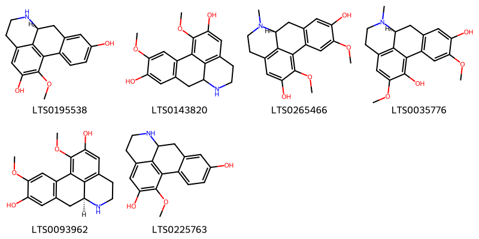{ width=100% }
    <figcaption>Hình ảnh cấu trúc hóa học của 6 hoạt chất thuộc nhóm Aporphines gồm ['(9s)-16-methoxy-10-azatetracyclo[7.7.1.0²,⁷.0¹³,¹⁷]heptadeca-1(17),2,4,6,13,15-hexaene-5,15-diol (LTS0195538)', '4,16-dimethoxy-10-azatetracyclo[7.7.1.0²,⁷.0¹³,¹⁷]heptadeca-1(17),2(7),3,5,13,15-hexaene-5,15-diol (LTS0143820)', '(9s)-4,16-dimethoxy-10-methyl-10-azatetracyclo[7.7.1.0²,⁷.0¹³,¹⁷]heptadeca-1(16),2(7),3,5,13(17),14-hexaene-5,15-diol (LTS0265466)', '(9s)-4,15-dimethoxy-10-methyl-10-azatetracyclo[7.7.1.0²,⁷.0¹³,¹⁷]heptadeca-1(16),2(7),3,5,13(17),14-hexaene-5,16-diol (LTS0035776)', 'laurolitsine (LTS0093962)', '16-methoxy-10-azatetracyclo[7.7.1.0²,⁷.0¹³,¹⁷]heptadeca-1(17),2,4,6,13,15-hexaene-5,15-diol (LTS0225763)'].</figcaption>
</figure>
### Nhóm Benzene and substituted derivatives
<figure markdown="span">
    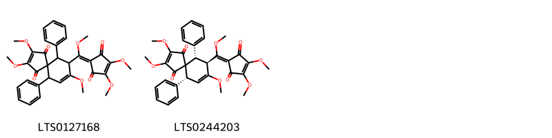{ width=100% }
    <figcaption>Hình ảnh cấu trúc hóa học của 2 hoạt chất thuộc nhóm Benzene and substituted derivatives gồm ['9-[(3,4-dimethoxy-2,5-dioxocyclopent-3-en-1-ylidene)(methoxy)methyl]-2,3,8-trimethoxy-6,10-diphenylspiro[4.5]deca-2,7-diene-1,4-dione (LTS0127168)', '(6r,9r,10s)-9-[(3,4-dimethoxy-2,5-dioxocyclopent-3-en-1-ylidene)(methoxy)methyl]-2,3,8-trimethoxy-6,10-diphenylspiro[4.5]deca-2,7-diene-1,4-dione (LTS0244203)'].</figcaption>
</figure>
### Nhóm Benzofurans
<figure markdown="span">
    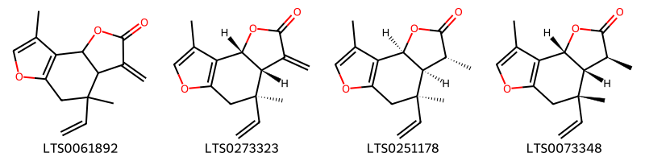{ width=100% }
    <figcaption>Hình ảnh cấu trúc hóa học của 4 hoạt chất thuộc nhóm Benzofurans gồm ['7-ethenyl-7,12-dimethyl-5-methylidene-3,10-dioxatricyclo[7.3.0.0²,⁶]dodeca-1(9),11-dien-4-one (LTS0061892)', 'isolinderalactone (LTS0273323)', '(2s,5r,6s,7r)-7-ethenyl-5,7,12-trimethyl-3,10-dioxatricyclo[7.3.0.0²,⁶]dodeca-1(9),11-dien-4-one (LTS0251178)', '(2r,5s,6r,7s)-7-ethenyl-5,7,12-trimethyl-3,10-dioxatricyclo[7.3.0.0²,⁶]dodeca-1(9),11-dien-4-one (LTS0073348)'].</figcaption>
</figure>
### Nhóm Cycloheptafurans
<figure markdown="span">
    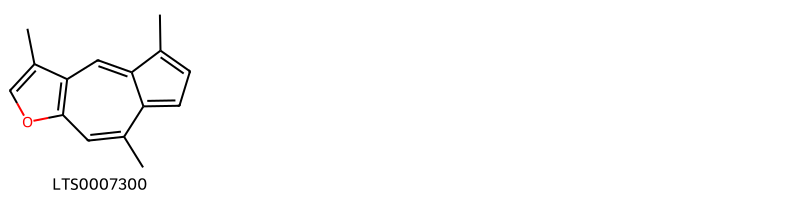{ width=100% }
    <figcaption>Hình ảnh cấu trúc hóa học của 1 hoạt chất thuộc nhóm Cycloheptafurans gồm ['3,5,8-trimethylazuleno[6,5-b]furan (LTS0007300)'].</figcaption>
</figure>
### Nhóm Dihydrofurans
<figure markdown="span">
    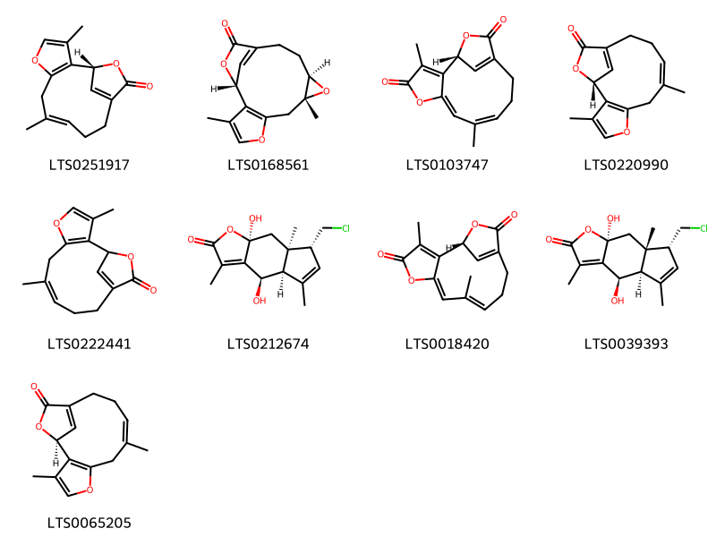{ width=100% }
    <figcaption>Hình ảnh cấu trúc hóa học của 9 hoạt chất thuộc nhóm Dihydrofurans gồm ['linderalactone (LTS0251917)', '(1r,8r,10r)-3,8-dimethyl-5,9,15-trioxatetracyclo[11.2.1.0²,⁶.0⁸,¹⁰]hexadeca-2(6),3,13(16)-trien-14-one (LTS0168561)', '(1r)-3,8-dimethyl-5,14-dioxatricyclo[10.2.1.0²,⁶]pentadeca-2,6,8,12(15)-tetraene-4,13-dione (LTS0103747)', '(1r,8z)-3,8-dimethyl-5,14-dioxatricyclo[10.2.1.0²,⁶]pentadeca-2(6),3,8,12(15)-tetraen-13-one (LTS0220990)', '3,8-dimethyl-5,14-dioxatricyclo[10.2.1.0²,⁶]pentadeca-2(6),3,8,12(15)-tetraen-13-one (LTS0222441)', '(4r,4ar,7r,7ar,8as)-7-(chloromethyl)-4,8a-dihydroxy-3,5,7a-trimethyl-4h,4ah,7h,8h-indeno[5,6-b]furan-2-one (LTS0212674)', '(1r,6e,8e)-3,8-dimethyl-5,14-dioxatricyclo[10.2.1.0²,⁶]pentadeca-2,6,8,12(15)-tetraene-4,13-dione (LTS0018420)', '(4r,4ar,7r,7as,8as)-7-(chloromethyl)-4,8a-dihydroxy-3,5,7a-trimethyl-4h,4ah,7h,8h-indeno[5,6-b]furan-2-one (LTS0039393)', '(1s)-3,8-dimethyl-5,14-dioxatricyclo[10.2.1.0²,⁶]pentadeca-2(6),3,8,12(15)-tetraen-13-one (LTS0065205)'].</figcaption>
</figure>
### Nhóm Dioxanes
<figure markdown="span">
    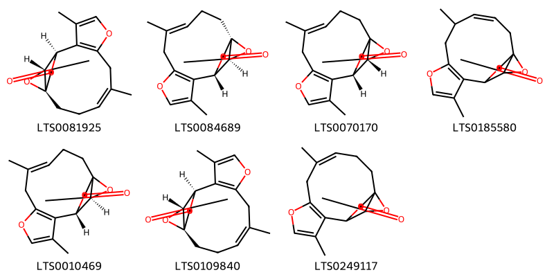{ width=100% }
    <figcaption>Hình ảnh cấu trúc hóa học của 7 hoạt chất thuộc nhóm Dioxanes gồm ['(1r,4z,12r,13r)-5,10-dimethyl-8,14,16-trioxatetracyclo[10.2.2.0¹,¹³.0⁷,¹¹]hexadeca-4,7(11),9-trien-15-one (LTS0081925)', 'linderane (LTS0084689)', '(4e,12s,13r)-5,10-dimethyl-8,14,16-trioxatetracyclo[10.2.2.0¹,¹³.0⁷,¹¹]hexadeca-4,7(11),9-trien-15-one (LTS0070170)', '(3z)-5,10-dimethyl-8,14,16-trioxatetracyclo[10.2.2.0¹,¹³.0⁷,¹¹]hexadeca-3,7(11),9-trien-15-one (LTS0185580)', '(4e,12s,13s)-5,10-dimethyl-8,14,16-trioxatetracyclo[10.2.2.0¹,¹³.0⁷,¹¹]hexadeca-4,7(11),9-trien-15-one (LTS0010469)', '(1r,12r,13r)-5,10-dimethyl-8,14,16-trioxatetracyclo[10.2.2.0¹,¹³.0⁷,¹¹]hexadeca-4,7(11),9-trien-15-one (LTS0109840)', '5,10-dimethyl-8,14,16-trioxatetracyclo[10.2.2.0¹,¹³.0⁷,¹¹]hexadeca-4,7(11),9-trien-15-one (LTS0249117)'].</figcaption>
</figure>
### Nhóm Fatty Acyls
<figure markdown="span">
    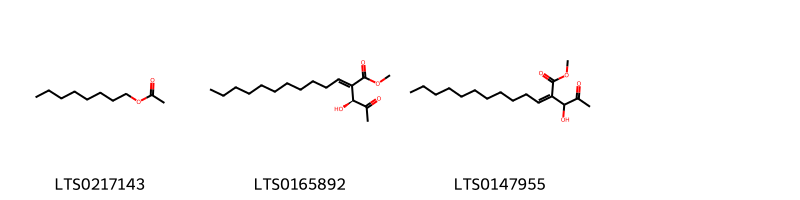{ width=100% }
    <figcaption>Hình ảnh cấu trúc hóa học của 3 hoạt chất thuộc nhóm Fatty Acyls gồm ['octyl acetate (LTS0217143)', 'secoaggregatalactone a (LTS0165892)', 'methyl 2-(1-hydroxy-2-oxopropyl)tridec-2-enoate (LTS0147955)'].</figcaption>
</figure>
### Nhóm Flavonoids
<figure markdown="span">
    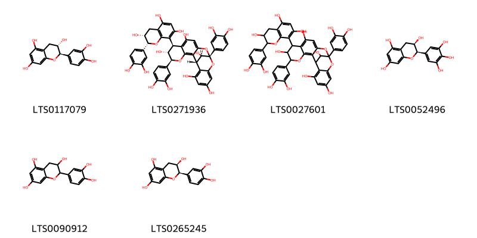{ width=100% }
    <figcaption>Hình ảnh cấu trúc hóa học của 6 hoạt chất thuộc nhóm Flavonoids gồm ['(+)-catechol (LTS0117079)', '(1r,5s,6r,7s,13s,21r)-5,13-bis(3,4-dihydroxyphenyl)-7-[(2r,3r)-2-(3,4-dihydroxyphenyl)-3,5,7-trihydroxy-3,4-dihydro-2h-1-benzopyran-8-yl]-4,12,14-trioxapentacyclo[11.7.1.0²,¹¹.0³,⁸.0¹⁵,²⁰]henicosa-2,8,10,15,17,19-hexaene-6,9,17,19,21-pentol (LTS0271936)', '5,13-bis(3,4-dihydroxyphenyl)-7-[2-(3,4-dihydroxyphenyl)-3,5,7-trihydroxy-3,4-dihydro-2h-1-benzopyran-8-yl]-4,12,14-trioxapentacyclo[11.7.1.0²,¹¹.0³,⁸.0¹⁵,²⁰]henicosa-2,8,10,15,17,19-hexaene-6,9,17,19,21-pentol (LTS0027601)', 'epigallocatechin (LTS0052496)', 'catechol (LTS0090912)', 'ent-epicatechin (LTS0265245)'].</figcaption>
</figure>
### Nhóm Isoquinolines and derivatives
<figure markdown="span">
    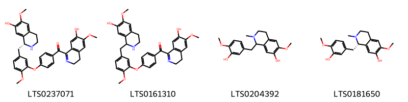{ width=100% }
    <figcaption>Hình ảnh cấu trúc hóa học của 4 hoạt chất thuộc nhóm Isoquinolines and derivatives gồm ['1-[4-(5-{[(1r)-7-hydroxy-6-methoxy-1,2,3,4-tetrahydroisoquinolin-1-yl]methyl}-2-methoxyphenoxy)benzoyl]-6-methoxy-3,4-dihydroisoquinolin-7-ol (LTS0237071)', '1-(4-{5-[(7-hydroxy-6-methoxy-1,2,3,4-tetrahydroisoquinolin-1-yl)methyl]-2-methoxyphenoxy}benzoyl)-6-methoxy-3,4-dihydroisoquinolin-7-ol (LTS0161310)', 'reticuline (LTS0204392)', '(+,-)-reticuline (LTS0181650)'].</figcaption>
</figure>
### Nhóm Naphthofurans
<figure markdown="span">
    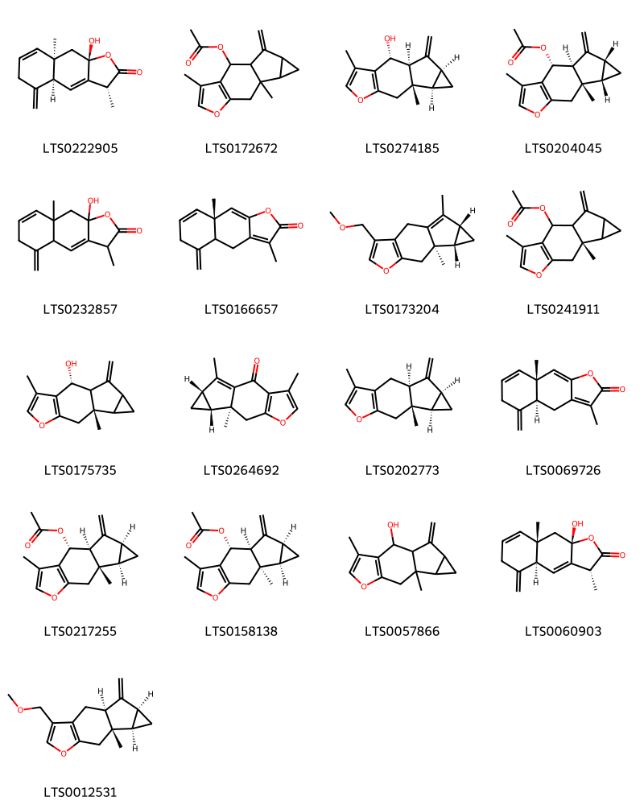{ width=100% }
    <figcaption>Hình ảnh cấu trúc hóa học của 17 hoạt chất thuộc nhóm Naphthofurans gồm ['(3r,4as,8ar,9as)-9a-hydroxy-3,8a-dimethyl-5-methylidene-3h,4ah,6h,9h-naphtho[2,3-b]furan-2-one (LTS0222905)', '4,9-dimethyl-13-methylidene-6-oxatetracyclo[7.4.0.0³,⁷.0¹⁰,¹²]trideca-3(7),4-dien-2-yl acetate (LTS0172672)', 'linderenol (LTS0274185)', '(1s,2r,9s,10s,12r)-4,9-dimethyl-13-methylidene-6-oxatetracyclo[7.4.0.0³,⁷.0¹⁰,¹²]trideca-3(7),4-dien-2-yl acetate (LTS0204045)', '9a-hydroxy-3,8a-dimethyl-5-methylidene-3h,4ah,6h,9h-naphtho[2,3-b]furan-2-one (LTS0232857)', '(8as)-3,8a-dimethyl-5-methylidene-4h,4ah,6h-naphtho[2,3-b]furan-2-one (LTS0166657)', '(9r,10s,12r)-4-(methoxymethyl)-9,13-dimethyl-6-oxatetracyclo[7.4.0.0³,⁷.0¹⁰,¹²]trideca-1(13),3(7),4-triene (LTS0173204)', '(9s)-4,9-dimethyl-13-methylidene-6-oxatetracyclo[7.4.0.0³,⁷.0¹⁰,¹²]trideca-3(7),4-dien-2-yl acetate (LTS0241911)', '(2r,9s)-4,9-dimethyl-13-methylidene-6-oxatetracyclo[7.4.0.0³,⁷.0¹⁰,¹²]trideca-3(7),4-dien-2-ol (LTS0175735)', 'lindenenone (LTS0264692)', '(1s,9s,10r,12s)-4,9-dimethyl-13-methylidene-6-oxatetracyclo[7.4.0.0³,⁷.0¹⁰,¹²]trideca-3(7),4-diene (LTS0202773)', '(4as,8as)-3,8a-dimethyl-5-methylidene-4h,4ah,6h-naphtho[2,3-b]furan-2-one (LTS0069726)', '(1s,2r,9s,10r,12s)-4,9-dimethyl-13-methylidene-6-oxatetracyclo[7.4.0.0³,⁷.0¹⁰,¹²]trideca-3(7),4-dien-2-yl acetate (LTS0217255)', '(1s,2r,9r,10r,12s)-4,9-dimethyl-13-methylidene-6-oxatetracyclo[7.4.0.0³,⁷.0¹⁰,¹²]trideca-3(7),4-dien-2-yl acetate (LTS0158138)', '4,9-dimethyl-13-methylidene-6-oxatetracyclo[7.4.0.0³,⁷.0¹⁰,¹²]trideca-3(7),4-dien-2-ol (LTS0057866)', '(3r,4as,8as,9as)-9a-hydroxy-3,8a-dimethyl-5-methylidene-3h,4ah,6h,9h-naphtho[2,3-b]furan-2-one (LTS0060903)', '(1s,9s,10r,12s)-4-(methoxymethyl)-9-methyl-13-methylidene-6-oxatetracyclo[7.4.0.0³,⁷.0¹⁰,¹²]trideca-3(7),4-diene (LTS0012531)'].</figcaption>
</figure>
### Nhóm Phenanthrenes and derivatives
<figure markdown="span">
    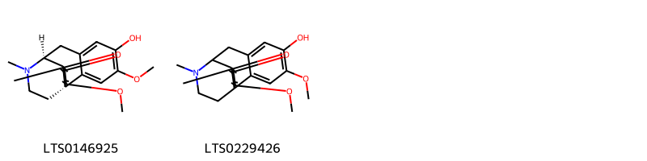{ width=100% }
    <figcaption>Hình ảnh cấu trúc hóa học của 2 hoạt chất thuộc nhóm Phenanthrenes and derivatives gồm ['(1s,9s)-5-hydroxy-4,13-dimethoxy-17-methyl-17-azatetracyclo[7.5.3.0¹,¹⁰.0²,⁷]heptadeca-2,4,6,10,13-pentaen-12-one (LTS0146925)', '5-hydroxy-4,13-dimethoxy-17-methyl-17-azatetracyclo[7.5.3.0¹,¹⁰.0²,⁷]heptadeca-2,4,6,10,13-pentaen-12-one (LTS0229426)'].</figcaption>
</figure>
### Nhóm Prenol lipids
<figure markdown="span">
    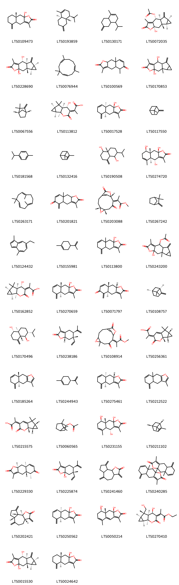{ width=100% }
    <figcaption>Hình ảnh cấu trúc hóa học của 58 hoạt chất thuộc nhóm Prenol lipids gồm ['(8ar)-9a-hydroxy-3,8a-dimethyl-5-methylidene-4h,4ah,6h,7h,8h,9h-naphtho[2,3-b]furan-2-one (LTS0109473)', '(4s,4as,8ar)-4-isopropyl-1-methyl-6-methylidene-4,4a,5,7,8,8a-hexahydro-3h-naphthalene (LTS0193859)', '4-isopropyl-1-methyl-6-methylidene-4,4a,5,7,8,8a-hexahydro-3h-naphthalene (LTS0130171)', '(1s,2r,7r,9s,10r,12s)-7-hydroxy-4,9-dimethyl-13-methylidene-5-oxo-6-oxatetracyclo[7.4.0.0³,⁷.0¹⁰,¹²]tridec-3-en-2-yl acetate (LTS0072035)', '(1s,2r,7s,9s,10r,12s)-2,7-dihydroxy-4,9-dimethyl-13-methylidene-6-oxatetracyclo[7.4.0.0³,⁷.0¹⁰,¹²]tridec-3-en-5-one (LTS0228690)', 'α-humulene (LTS0076944)', '3,5,8a-trimethyl-4h,4ah,5h,9h,9ah-naphtho[2,3-b]furan-2,6-dione (LTS0100569)', '2,7-dihydroxy-4,9-dimethyl-13-methylidene-6-oxatetracyclo[7.4.0.0³,⁷.0¹⁰,¹²]tridec-3-en-5-one (LTS0170853)', '(-)-camphene (LTS0067556)', '2-[(1s,2s,4r,6s,7s,8e)-7-hydroxy-1,5,5-trimethyl-9-oxo-10-oxatricyclo[4.4.0.0²,⁴]decan-8-ylidene]propanoic acid (LTS0113812)', '(4as,8ar,9as)-9a-hydroxy-3,8a-dimethyl-5-methylidene-4h,4ah,6h,9h-naphtho[2,3-b]furan-2-one (LTS0017528)', 'β-pinene (LTS0117550)', 'cymene (LTS0181568)', 'α pinene (LTS0132416)', '2-isopropyl-4a-methyl-8-methylidene-octahydronaphthalene-1,5-diol (LTS0190508)', '(4r,4as,8r,8ar,9as)-4,8,9a-trihydroxy-3,5,8a-trimethyl-4h,4ah,7h,8h,9h-naphtho[2,3-b]furan-2-one (LTS0274720)', 'humulene (LTS0263171)', '3,8a-dimethyl-5-methylidene-4h,4ah,9h,9ah-naphtho[2,3-b]furan-2,6-dione (LTS0201821)', 'methyl 2-[(4r,6s,9z,10s)-6-methyl-8,12-dioxo-5,11-dioxatricyclo[8.2.1.0⁴,⁶]tridec-1(13)-en-9-ylidene]propanoate (LTS0203088)', 'camphene (LTS0267242)', 'chamazulene (LTS0124432)', 'limonene,  (LTS0155981)', '9a-hydroxy-3,8a-dimethyl-5-methylidene-4h,4ah,6h,9h-naphtho[2,3-b]furan-2-one (LTS0113800)', '7-hydroxy-4,9-dimethyl-13-methylidene-5-oxo-6-oxatetracyclo[7.4.0.0³,⁷.0¹⁰,¹²]tridec-3-en-2-yl acetate (LTS0243200)', '2-[(1s,2s,4r,6s,7s,8z)-7-hydroxy-1,5,5-trimethyl-9-oxo-10-oxatricyclo[4.4.0.0²,⁴]decan-8-ylidene]propanoic acid (LTS0162852)', '(4as,8as,9as)-9a-hydroxy-3,8a-dimethyl-5-methylidene-4h,4ah,6h,9h-naphtho[2,3-b]furan-2-one (LTS0270659)', '(4ar,8as,9as)-3,8a-dimethyl-5-methylidene-4h,4ah,9h,9ah-naphtho[2,3-b]furan-2,6-dione (LTS0071797)', '(-)-β-pinene (LTS0108757)', '(1r,2r,4as,5s,8ar)-2-isopropyl-4a-methyl-8-methylidene-octahydronaphthalene-1,5-diol (LTS0170496)', '(5s,6s,7as)-6-ethenyl-3,6-dimethyl-5-(prop-1-en-2-yl)-4,5,7,7a-tetrahydro-1-benzofuran-2-one (LTS0238186)', 'methyl 2-{6-methyl-8,12-dioxo-5,11-dioxatricyclo[8.2.1.0⁴,⁶]tridec-1(13)-en-9-ylidene}propanoate (LTS0108914)', '2-[(1s,2s,4r,8e)-1,5,5-trimethyl-9-oxo-10-oxatricyclo[4.4.0.0²,⁴]dec-6-en-8-ylidene]propanoic acid (LTS0256361)', '(4as,8as)-3,8a-dimethyl-5-methylidene-4h,4ah,6h,9h-naphtho[2,3-b]furan (LTS0185264)', 'α-limonene (LTS0244943)', '(4as,8ar,9as)-3,8a-dimethyl-5-methylidene-4h,4ah,6h,9h,9ah-naphtho[2,3-b]furan-2-one (LTS0275461)', '3,8a-dimethyl-5-methylidene-4h,4ah,6h,9h-naphtho[2,3-b]furan (LTS0212522)', '2-[(1s,2s,4r,8z)-1,5,5-trimethyl-9-oxo-10-oxatricyclo[4.4.0.0²,⁴]dec-6-en-8-ylidene]propanoic acid (LTS0215575)', 'bornyl acetate (LTS0060565)', '(4r,8r,8ar)-4,8,9a-trihydroxy-3,5,8a-trimethyl-4h,4ah,7h,8h,9h-naphtho[2,3-b]furan-2-one (LTS0231155)', '(+)-α-pinene (LTS0211102)', '(4as,5r,8as,9as)-3,5,8a-trimethyl-4h,4ah,5h,9h,9ah-naphtho[2,3-b]furan-2,6-dione (LTS0229330)', '(5s,6s,7as)-6-ethenyl-7a-hydroxy-3,6-dimethyl-5-(prop-1-en-2-yl)-5,7-dihydro-4h-1-benzofuran-2-one (LTS0225874)', '3,6,9-trimethylidene-octahydroazuleno[4,5-b]furan-2-one (LTS0241460)', '9a-{3,8a-dimethyl-5-methylidene-2-oxo-4h,4ah,6h,9h-naphtho[2,3-b]furan-9a-yl}-3,8a-dimethyl-5-methylidene-4h,4ah,6h,9h-naphtho[2,3-b]furan-2-one (LTS0240285)', 'dehydrocostus lactone (LTS0202421)', '(4as,8ar)-9a-hydroxy-3,8a-dimethyl-5-methylidene-4h,4ah,6h,9h-naphtho[2,3-b]furan-2-one (LTS0250562)', '(8r,8ar,9as)-8,9a-dihydroxy-3,5,8a-trimethyl-7h,8h,9h-naphtho[2,3-b]furan-2-one (LTS0050214)', 'ethyl 2-[(1s,2s,4r,5s,6s,7r,8z)-7-hydroxy-5-(hydroxymethyl)-1,5-dimethyl-9-oxo-10-oxatricyclo[4.4.0.0²,⁴]decan-8-ylidene]propanoate (LTS0270410)', '(1s,2r,9s,10r,12s)-2,7-dihydroxy-4,9-dimethyl-13-methylidene-6-oxatetracyclo[7.4.0.0³,⁷.0¹⁰,¹²]tridec-3-en-5-one (LTS0015530)', 'atractylenolide iii (LTS0024642)', 'isobornyl acetate (LTS0024491)', 'methyl 2-[(4s,6s,9z,10r)-6-methyl-8,12-dioxo-5,11-dioxatricyclo[8.2.1.0⁴,⁶]tridec-1(13)-en-9-ylidene]propanoate (LTS0263763)', '(1s,2r,7r,9s,10r,12s)-2,7-dihydroxy-4,9-dimethyl-13-methylidene-6-oxatetracyclo[7.4.0.0³,⁷.0¹⁰,¹²]tridec-3-en-5-one (LTS0009569)', 'ethyl 2-[7-hydroxy-5-(hydroxymethyl)-1,5-dimethyl-9-oxo-10-oxatricyclo[4.4.0.0²,⁴]decan-8-ylidene]propanoate (LTS0012658)', '(1s,2s,7s,9r,10s,12r)-7-hydroxy-4,9-dimethyl-13-methylidene-5-oxo-6-oxatetracyclo[7.4.0.0³,⁷.0¹⁰,¹²]tridec-3-en-2-yl acetate (LTS0106765)', '(1s,2r,7s,9s,10r,12s)-7-hydroxy-4,9-dimethyl-13-methylidene-5-oxo-6-oxatetracyclo[7.4.0.0³,⁷.0¹⁰,¹²]tridec-3-en-2-yl acetate (LTS0127495)', '(5r,6r)-6-ethenyl-3,6-dimethyl-5-(prop-1-en-2-yl)-5,7-dihydro-4h-1-benzofuran (LTS0048127)', '(4as,8as,9as)-9a-[(4as,8as,9as)-3,8a-dimethyl-5-methylidene-2-oxo-4h,4ah,6h,9h-naphtho[2,3-b]furan-9a-yl]-3,8a-dimethyl-5-methylidene-4h,4ah,6h,9h-naphtho[2,3-b]furan-2-one (LTS0253061)'].</figcaption>
</figure>

---

## Tác dụng dược lý

Theo tài liệu "Những cây thuốc và vị thuốc Việt Nam" - Đỗ Tất Lợi:- Dùng làm thuốc chữa đau bụng, ăn không tiêu, nôn mửa, sung huyết, đau nhức, hay tiểu đêm
- Chữa giun ở trẻ con

Theo tài liệu quốc tế: 1. To regulate qi and stop pain; 2. To warm the kidneys and dispel cold

---

## Dược điển Việt Nam V

### Soi bột:
Màu trắng vàng, có nhiều hạt tinh bột, hạt đơn hình cầu hoặc hình trứng, đường kính 4 µm đến 39 µm. rốn hình chữ V, chữ Y hoặc dạng khe; hạt tinh bột kép do 2 hạt đến 4 hạt đơn ghép thành. Sợi gỗ màu vàng nhạt, phần lớn xếp thành bó, đường kính 20 µm đến 30 µm, thành dày khoáng 5 µm có nhiều lỗ. Sợi libe hầu như không có màu, hình thoi dài, phần nhiều rải rác và đơn lẻ, đường kinh 15 µm đến 17 µm, thành rất dày, với các thành ống có lỗ không rõ rệt. Những mạch có lỗ ở bờ cạnh, đường kính 68 pµm xếp thành hàng dày sít nhau. Thành tế bào của sợi gỗ hơi dày lên và có lỗ dày đặc. Tế bào dầu hình chữ nhật chứa chất tiết màu nâu.
<!-- Hình ảnh soi bột sẽ được tự động chèn vào đây sau -->
### Vi phẫu:

<!-- Hình ảnh vi phẫu sẽ được tự động chèn vào đây sau -->
### Định tính

Phương pháp sắc ký lớp mỏng (Phụ lục 5.4). Bản mỏng: Silica gel H. Dung môi khai triển: Toluen – ethyl acetat (15 : 1). Dung dịch thử: Lấy 1 g bột dược liệu thô, ngâm 30 min trong 30 ml ether dầu hỏa (30 °C đển 60 °C) (TT), siêu âm 10 min (duy trì ở nhiệt độ dưới 30 °C trong bình cách thủy). Lọc. Bay hơi dịch lọc đến cắn. Hòa tan cắn trong 1 ml ethyl acetat (TT) được dung dịch thử. Dung dịch đối chiếu: Hòa lan linderalacton chuẩn trong ethyl acetat (TT) để được dung dịch có chứa 0,75 mg/ml. Nếu không có linderalacton thì dùng 0,5 g Ô dược (mẫu chuẩn), tiến hành chiết như mô tả ở phần Dung dịch thử. Cách tiến hành: Chấm riêng biệt lên bản mỏng 4 µl mỗi dung dịch trên. Sau khi triển khai sắc ký, lấy bản mỏng ra để khô ở nhiệt độ phòng, phun dung dịch vanilin 1 % trong acid sulfuric (TT). Sấy bản mỏng ở 105˚C đến khi hiện rõ vết. Quan sát dưới ánh sáng thường. Trên sắc ký đồ của dung dịch thử phải cho vết có cùng màu sắc và cùng giá trị Rf với các vết (hoặc với vết của linderalacton) trên sắc ký đồ cùa dung dịch đối chiếu.

### Định lượng

Chất chiết được trong dược liệu Không dưới 12,0 % tính theo dược liệu khô kiệt. Tiến hành theo phương pháp chiết nóng (Phụ lục 12.10). Dùng ethanol 70 % (TT) làm dung môi.

### Thông tin khác 
- ** Độ ẩm: ** Không quá 12,0 % (Phụ lục 12.13).

- ** Bảo quản:** Để nơi khô, mát, tránh mọt.nn
## Dược điển Hồng kong

<!-- PDF sẽ được tự động chèn vào đây sau -->

---

## Y dược học cổ truyền

- **Tên vị thuốc:** 
- **Tính vị quy kinh:** Tân, ôn. Vào các kinh phế, tỳ, thận, bàng quang.
- **Công năng chủ trị:** Hành khí, chỉ thống, kiện vị tiêu thực, ôn thận, tán hàn.
Chủ trị: Bụng trướng đau, đầy bụng, khí nghịch phát suyễn, bụng dưới đau do bàng quang lạnh, di niệu, sản khí, hành kinh đau bụng.
- **Chú ý:** 
- **Kiêng kỵ:** Khí hư, nội nhiệt không nên dùng.nn

