!!! abstract "Tóm tắt"
    Salvia miltiorrhiza Bunge (Lamiaceae (Bạc Hà)). Là cây cỏ sống lâu năm, cao 30–80 cm; Rễ hình trụ nhỏ, màu đỏ; Lá kép mọc đối, mép răng cưa, mặt trên xanh, mặt dưới xanh tro; Hoa xanh tím nhạt, cụm hoa mọc ở đầu cành. Kinh nghiệm sử dụng dân gian/Y học cổ truyền: Tính vị - Quy kinh: Vị đắng, tính hơi hàn; quy vào kinh Tâm; Công dụng: Hoạt huyết, thông kinh, giảm đau, thanh tâm, lương huyết; Chữa kinh nguyệt không đều, huyết ứ, đau bụng kinh, mất ngủ, đau thắt lưng. Tác dụng dược lý: Hoạt huyết và cải thiện tuần hoàn máu; Chống oxy hóa, bảo vệ tim mạch, ngăn ngừa xơ vữa động mạch; Hỗ trợ điều trị suy tim, đột quỵ và cải thiện chức năng gan. Thành phần hóa học: Nhóm hóa học Diterpenoids; (Tanshinones); Axit phenolic (Axit salvianolic, Axit rosmarinic). Hoạt chất chính: Tanshinone IIA (có tác dụng tương tự vitamin K).

## Thông tin về thực vật

### Đặc điểm thực vật

Dược liệu **Đan Sâm (Rễ Và Thân Rễ)** từ bộ phận **nan** từ loài *Salvia miltiorrhiza Bunge* thuộc họ Lamiaceae. Đan sâm là một loại cỏ sống lâu năm, cao 30-80cm, toàn thân mang lòng ngắn màu vàng trắng nhạt. Rễ nhỏ dài hình trụ, đường kính 0,5- 1,5cm, màu đỏ nâu. Thần vuông trên có các gân dọc. Lá kép, mọc đối: 3-5 lá chét, đặc biệt có thể có 7. Lá chét giữa thường lớn hơn cả. Lá kép có cuống dài, cuống lá chét ngắn có dìa. Lá chét dài 2-7,5cm, rộng 0,8-5cm. Mép lá chét có răng cưa tù. Mặt trên lá chét màu xanh, có các lông mềm màu trắng, mặt dưới màu xanh tro, cũng có lòng nhưng dài hơn. Gần nổi ở mặt dưới, chia phiến lá chét thành múi nhỏ. Cụm hoa mọc thành chùm ở đầu cành hay ở kẽ lá, chùm hoa dài 10-20cm. Hoa mọc vòng, mỗi vòng 3-10 hoa thường là 2 hoa. Hoa có tràng màu xanh tím nhạt, 2 mỏi, môi trên trống nghiêng hình lưỡi liềm, môi dưới xẻ 3 thuỳ, thuỳ giữa có răng cưa tròn. Hai nhị ở môi dưới bầu có vòi dài lòi ra ở môi trên. Quả nhỏ, dài 3mm, rộng 1,5mm. Mùa hoa từ tháng 5-8 (Tam Đảo) mùa quả tháng 6-9. 

!!! info "Phân loại thực vật của *Salvia miltiorrhiza*"
    - **Kingdom:** Plantae
    - **Phylum:** Tracheophyta
    - **Order:** Lamiales
    - **Family:** Lamiaceae
    - **Genus:** Salvia
    - **Species:** *Salvia miltiorrhiza*

*Tài liệu tham khảo:* "Những cây thuốc và vị thuốc Việt Nam" - Đỗ Tất Lợi

 

### Loài thay thế (Nếu có)

### Phân bố trên thế giới
**Từ vườn thực vật KEW: **: "Native to:
China North-Central, China South-Central, China Southeast, Vietnam
Introduced into:
Korea"

**Từ CSDL GIBF** United States of America, Korea, Republic of, Chinese Taipei, China

### Phân bố tại Việt Nam
** "Những cây thuốc và vị thuốc Việt Nam" - Đỗ Tất Lợi**: Đỗ Tất Lợi: Tam Đảo

**Từ CSDL GIBF**: Không có ghi nhận ở Việt Nam

---

## Thông tin về dược liệu 

### Định danh

!!! info "Thông tin về tên gọi của nan"
    - Dược liệu tiếng Việt: nan
    - Dược liệu tiếng Trung: nan (nan)
    - Dược liệu tiếng Anh: nan
    - Dược liệu latin thông dụng: nan
    - Dược liệu latin kiểu DĐVN: radix et rhizoma salviae mitiorrhizae
    - Dược liệu latin kiểu DĐVN: nan
    - Dược liệu latin kiểu thông tư: nan
    - Bộ phận dùng: nan (nan)

### Mô tả dược liệu 
- **Theo dược điển Việt nam V:** nan

- **Mô tả dược liệu theo thông tư chế biến dược liệu theo phương pháp cổ truyền:** nan

### Chế biến 

- **Chế biến theo dược điển việt nam V**: nan

- **Chế biến theo thông tư:** nan

--- 

## Thành phần hóa học

- Theo tài liệu của GS. Đỗ Tất Lợi:  1, Nhóm hóa học: Nhóm hóa học: Tanshinones (diterpenoids), phenolic acids (như acid salvianolic, acid rosmarinic).
2, Tên hoạt chất 
Dược điển Đài Loan tái bản lần 4: Tanshinone IIA
    
- Theo cơ sở dữ liệu lotus: Từ loài *Salvia miltiorrhiza* đã phân lập và xác định được 191 hoạt chất thuộc về các nhóm Stilbenes, Coumarins and derivatives, Benzene and substituted derivatives, Indoles and derivatives, Tropones, Benzoxepines, Heteroaromatic compounds, Phenanthrenes and derivatives, Phenalenes, Steroids and steroid derivatives, Phenols, Cinnamic acids and derivatives, Naphthofurans, Organooxygen compounds, Prenol lipids, Fatty Acyls, Phenylpropanoic acids, Naphthalenes, Carboxylic acids and derivatives, Naphthopyrans, Flavonoids, 2-arylbenzofuran flavonoids. 

|    | chemicalTaxonomyClassyfireClass     |   smiles_count |
|---:|:------------------------------------|---------------:|
|  0 | 2-arylbenzofuran flavonoids         |             15 |
|  1 | Benzene and substituted derivatives |              3 |
|  2 | Benzoxepines                        |              2 |
|  3 | Carboxylic acids and derivatives    |              1 |
|  4 | Cinnamic acids and derivatives      |             10 |
|  5 | Coumarins and derivatives           |              1 |
|  6 | Fatty Acyls                         |              2 |
|  7 | Flavonoids                          |              1 |
|  8 | Heteroaromatic compounds            |              2 |
|  9 | Indoles and derivatives             |              1 |
| 10 | Naphthalenes                        |              2 |
| 11 | Naphthofurans                       |              8 |
| 12 | Naphthopyrans                       |              2 |
| 13 | Organooxygen compounds              |              2 |
| 14 | Phenalenes                          |              1 |
| 15 | Phenanthrenes and derivatives       |             13 |
| 16 | Phenols                             |              4 |
| 17 | Phenylpropanoic acids               |              3 |
| 18 | Prenol lipids                       |            102 |
| 19 | Steroids and steroid derivatives    |              6 |
| 20 | Stilbenes                           |              6 |
| 21 | Tropones                            |              2 |

### Nhóm 2-arylbenzofuran flavonoids
<figure markdown="span">
    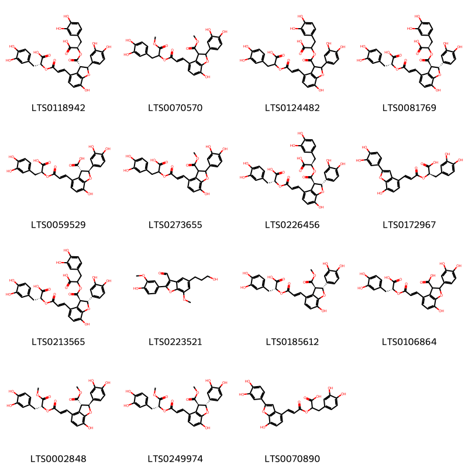{ width=100% }
    <figcaption>Hình ảnh cấu trúc hóa học của 15 hoạt chất thuộc nhóm 2-arylbenzofuran flavonoids gồm ['salvianolic acid b (LTS0118942)', 'methyl 2-(3,4-dihydroxyphenyl)-4-(3-{[3-(3,4-dihydroxyphenyl)-1-methoxy-1-oxopropan-2-yl]oxy}-3-oxoprop-1-en-1-yl)-7-hydroxy-2,3-dihydro-1-benzofuran-3-carboxylate (LTS0070570)', '2-(4-{3-[1-carboxy-2-(3,4-dihydroxyphenyl)ethoxy]-3-oxoprop-1-en-1-yl}-2-(3,4-dihydroxyphenyl)-7-hydroxy-2,3-dihydro-1-benzofuran-3-carbonyloxy)-3-(3,4-dihydroxyphenyl)propanoic acid (LTS0124482)', '(2r)-2-[(2r,3r)-4-{3-[(1r)-1-carboxy-2-(3,4-dihydroxyphenyl)ethoxy]-3-oxoprop-1-en-1-yl}-2-(3,4-dihydroxyphenyl)-7-hydroxy-2,3-dihydro-1-benzofuran-3-carbonyloxy]-3-(3,4-dihydroxyphenyl)propanoic acid (LTS0081769)', '(2s,3s)-4-[(1e)-3-[(1s)-1-carboxy-2-(3,4-dihydroxyphenyl)ethoxy]-3-oxoprop-1-en-1-yl]-2-(3,4-dihydroxyphenyl)-7-hydroxy-2,3-dihydro-1-benzofuran-3-carboxylic acid (LTS0059529)', '3-(3,4-dihydroxyphenyl)-2-({3-[2-(3,4-dihydroxyphenyl)-7-hydroxy-3-(methoxycarbonyl)-2,3-dihydro-1-benzofuran-4-yl]prop-2-enoyl}oxy)propanoic acid (LTS0273655)', '(2r)-2-{[(2e)-3-[(2r,3r)-3-{[(1r)-1-carboxy-2-(3,4-dihydroxyphenyl)ethoxy]carbonyl}-2-(3,4-dihydroxyphenyl)-7-hydroxy-2,3-dihydro-1-benzofuran-4-yl]prop-2-enoyl]oxy}-3-(3,4-dihydroxyphenyl)propanoic acid (LTS0226456)', 'salvianolic acid c (LTS0172967)', '(2r)-2-{[(2e)-3-[(2r,3r)-3-{[1-carboxy-2-(3,4-dihydroxyphenyl)ethoxy]carbonyl}-2-(3,4-dihydroxyphenyl)-7-hydroxy-2,3-dihydro-1-benzofuran-4-yl]prop-2-enoyl]oxy}-3-(3,4-dihydroxyphenyl)propanoic acid (LTS0213565)', '2-(4-hydroxy-3-methoxyphenyl)-5-(3-hydroxypropyl)-7-methoxy-1-benzofuran-3-carbaldehyde (LTS0223521)', '(2r)-3-(3,4-dihydroxyphenyl)-2-{[(2e)-3-[(2r,3r)-2-(3,4-dihydroxyphenyl)-7-hydroxy-3-(methoxycarbonyl)-2,3-dihydro-1-benzofuran-4-yl]prop-2-enoyl]oxy}propanoic acid (LTS0185612)', 'lithospermic acid (LTS0106864)', 'methyl (2s,3s)-2-(3,4-dihydroxyphenyl)-4-[(1e)-3-{[(2r)-3-(3,4-dihydroxyphenyl)-1-methoxy-1-oxopropan-2-yl]oxy}-3-oxoprop-1-en-1-yl]-7-hydroxy-2,3-dihydro-1-benzofuran-3-carboxylate (LTS0002848)', 'methyl (2r,3r)-2-(3,4-dihydroxyphenyl)-4-[(1e)-3-{[(2r)-3-(3,4-dihydroxyphenyl)-1-methoxy-1-oxopropan-2-yl]oxy}-3-oxoprop-1-en-1-yl]-7-hydroxy-2,3-dihydro-1-benzofuran-3-carboxylate (LTS0249974)', '3-(3,4-dihydroxyphenyl)-2-{[(2e)-3-[2-(3,4-dihydroxyphenyl)-7-hydroxy-1-benzofuran-4-yl]prop-2-enoyl]oxy}propanoic acid (LTS0070890)'].</figcaption>
</figure>
### Nhóm Benzene and substituted derivatives
<figure markdown="span">
    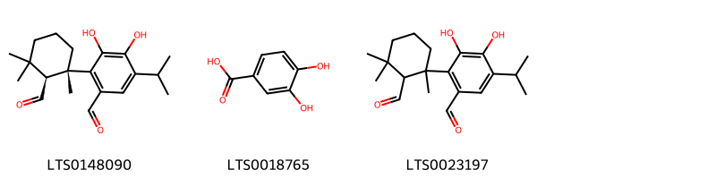{ width=100% }
    <figcaption>Hình ảnh cấu trúc hóa học của 3 hoạt chất thuộc nhóm Benzene and substituted derivatives gồm ['2-[(1s,2s)-2-formyl-1,3,3-trimethylcyclohexyl]-3,4-dihydroxy-5-isopropylbenzaldehyde (LTS0148090)', '3,4-dihydroxybenzoic acid (LTS0018765)', '2-(2-formyl-1,3,3-trimethylcyclohexyl)-3,4-dihydroxy-5-isopropylbenzaldehyde (LTS0023197)'].</figcaption>
</figure>
### Nhóm Benzoxepines
<figure markdown="span">
    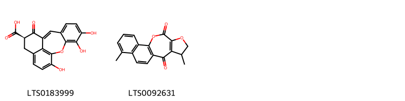{ width=100% }
    <figcaption>Hình ảnh cấu trúc hóa học của 2 hoạt chất thuộc nhóm Benzoxepines gồm ['(12r)-4,5,17-trihydroxy-11-oxo-2-oxatetracyclo[8.7.1.0³,⁸.0¹⁴,¹⁸]octadeca-1(18),3,5,7,9,14,16-heptaene-12-carboxylic acid (LTS0183999)', '6,13-dimethyl-15,18-dioxatetracyclo[8.8.0.0²,⁷.0¹²,¹⁶]octadeca-1(10),2(7),3,5,8,12(16)-hexaene-11,17-dione (LTS0092631)'].</figcaption>
</figure>
### Nhóm Carboxylic acids and derivatives
<figure markdown="span">
    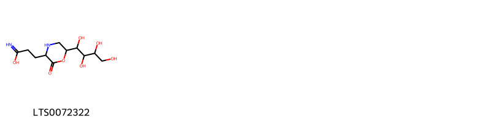{ width=100% }
    <figcaption>Hình ảnh cấu trúc hóa học của 1 hoạt chất thuộc nhóm Carboxylic acids and derivatives gồm ['3-[2-oxo-6-(1,2,3,4-tetrahydroxybutyl)morpholin-3-yl]propanimidic acid (LTS0072322)'].</figcaption>
</figure>
### Nhóm Cinnamic acids and derivatives
<figure markdown="span">
    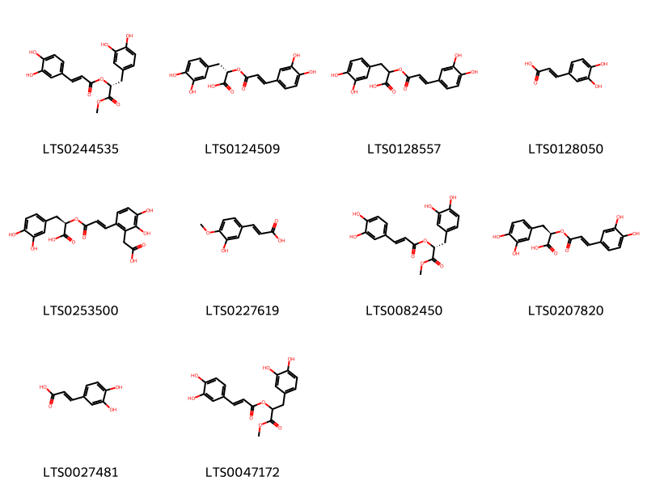{ width=100% }
    <figcaption>Hình ảnh cấu trúc hóa học của 10 hoạt chất thuộc nhóm Cinnamic acids and derivatives gồm ['(2r)-3-(3,4-dihydroxyphenyl)-1-methoxy-1-oxopropan-2-yl 3-(3,4-dihydroxyphenyl)prop-2-enoate (LTS0244535)', '(s)-rosmarinic acid (LTS0124509)', '3-(3,4-dihydroxyphenyl)-2-{[3-(3,4-dihydroxyphenyl)prop-2-enoyl]oxy}propanoic acid (LTS0128557)', '3,4-dihydroxycinnamic acid (LTS0128050)', 'salvianolic acid d (LTS0253500)', 'isoferulic acid (LTS0227619)', '(2r)-3-(3,4-dihydroxyphenyl)-1-methoxy-1-oxopropan-2-yl (2e)-3-(3,4-dihydroxyphenyl)prop-2-enoate (LTS0082450)', 'rosemary acid (LTS0207820)', 'caffeic acid (LTS0027481)', '3-(3,4-dihydroxyphenyl)-1-methoxy-1-oxopropan-2-yl 3-(3,4-dihydroxyphenyl)prop-2-enoate (LTS0047172)'].</figcaption>
</figure>
### Nhóm Coumarins and derivatives
<figure markdown="span">
    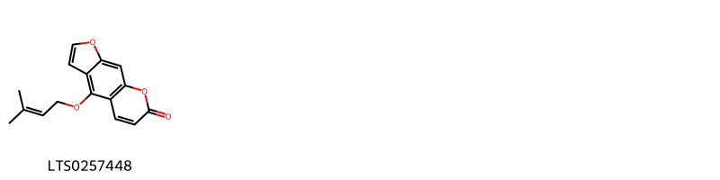{ width=100% }
    <figcaption>Hình ảnh cấu trúc hóa học của 1 hoạt chất thuộc nhóm Coumarins and derivatives gồm ['isoimperatorin (LTS0257448)'].</figcaption>
</figure>
### Nhóm Fatty Acyls
<figure markdown="span">
    { width=100% }
    <figcaption>Hình ảnh cấu trúc hóa học của 2 hoạt chất thuộc nhóm Fatty Acyls gồm ['α-linolenic acid (LTS0275508)', 'α linolenic acid (LTS0132789)'].</figcaption>
</figure>
### Nhóm Flavonoids
<figure markdown="span">
    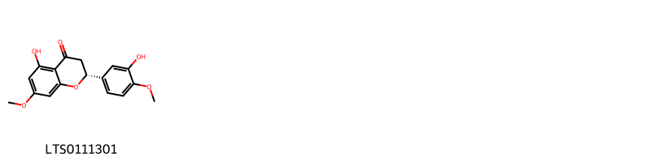{ width=100% }
    <figcaption>Hình ảnh cấu trúc hóa học của 1 hoạt chất thuộc nhóm Flavonoids gồm ['(2r)-5-hydroxy-2-(3-hydroxy-4-methoxyphenyl)-7-methoxy-2,3-dihydro-1-benzopyran-4-one (LTS0111301)'].</figcaption>
</figure>
### Nhóm Heteroaromatic compounds
<figure markdown="span">
    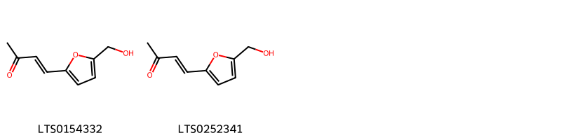{ width=100% }
    <figcaption>Hình ảnh cấu trúc hóa học của 2 hoạt chất thuộc nhóm Heteroaromatic compounds gồm ['(3e)-4-[5-(hydroxymethyl)furan-2-yl]but-3-en-2-one (LTS0154332)', '4-[5-(hydroxymethyl)furan-2-yl]but-3-en-2-one (LTS0252341)'].</figcaption>
</figure>
### Nhóm Indoles and derivatives
<figure markdown="span">
    { width=100% }
    <figcaption>Hình ảnh cấu trúc hóa học của 1 hoạt chất thuộc nhóm Indoles and derivatives gồm ['n-[2-(5-methoxy-1h-indol-3-yl)ethyl]ethanimidic acid (LTS0219322)'].</figcaption>
</figure>
### Nhóm Naphthalenes
<figure markdown="span">
    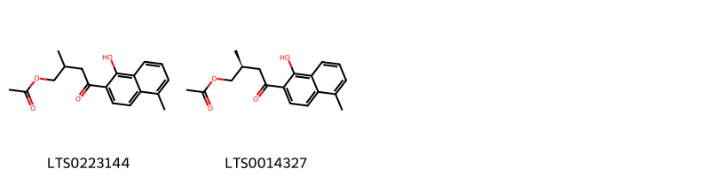{ width=100% }
    <figcaption>Hình ảnh cấu trúc hóa học của 2 hoạt chất thuộc nhóm Naphthalenes gồm ['4-(1-hydroxy-5-methylnaphthalen-2-yl)-2-methyl-4-oxobutyl acetate (LTS0223144)', '(2s)-4-(1-hydroxy-5-methylnaphthalen-2-yl)-2-methyl-4-oxobutyl acetate (LTS0014327)'].</figcaption>
</figure>
### Nhóm Naphthofurans
<figure markdown="span">
    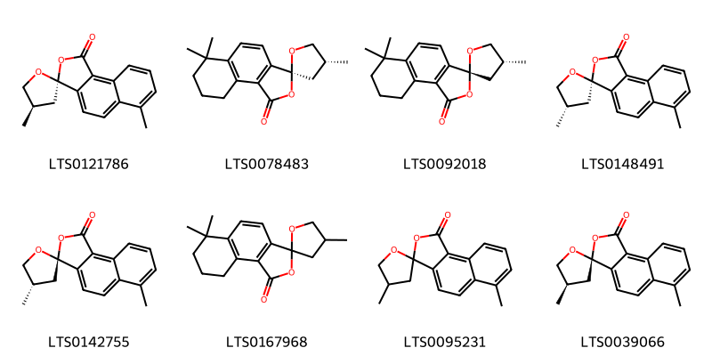{ width=100% }
    <figcaption>Hình ảnh cấu trúc hóa học của 8 hoạt chất thuộc nhóm Naphthofurans gồm ["(3s,4'r)-4',6-dimethylspiro[naphtho[1,2-c]furan-3,2'-oxolan]-1-one (LTS0121786)", "(3s,4'r)-4',6,6-trimethyl-8,9-dihydro-7h-spiro[naphtho[1,2-c]furan-3,2'-oxolan]-1-one (LTS0078483)", "(3r,4'r)-4',6,6-trimethyl-8,9-dihydro-7h-spiro[naphtho[1,2-c]furan-3,2'-oxolan]-1-one (LTS0092018)", "(3s,4's)-4',6-dimethylspiro[naphtho[1,2-c]furan-3,2'-oxolan]-1-one (LTS0148491)", "(3r,4's)-4',6-dimethylspiro[naphtho[1,2-c]furan-3,2'-oxolan]-1-one (LTS0142755)", "4',6,6-trimethyl-8,9-dihydro-7h-spiro[naphtho[1,2-c]furan-3,2'-oxolan]-1-one (LTS0167968)", "4',6-dimethylspiro[naphtho[1,2-c]furan-3,2'-oxolan]-1-one (LTS0095231)", "(3r,4'r)-4',6-dimethylspiro[naphtho[1,2-c]furan-3,2'-oxolan]-1-one (LTS0039066)"].</figcaption>
</figure>
### Nhóm Naphthopyrans
<figure markdown="span">
    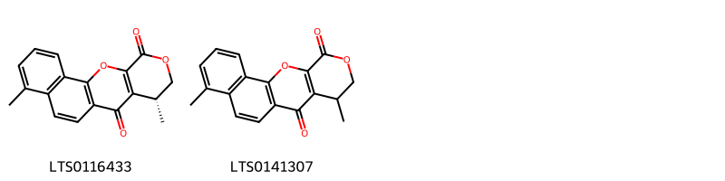{ width=100% }
    <figcaption>Hình ảnh cấu trúc hóa học của 2 hoạt chất thuộc nhóm Naphthopyrans gồm ['(4r)-4,8-dimethyl-3,4-dihydro-2,12-dioxatetraphene-1,5-dione (LTS0116433)', '4,8-dimethyl-3,4-dihydro-2,12-dioxatetraphene-1,5-dione (LTS0141307)'].</figcaption>
</figure>
### Nhóm Organooxygen compounds
<figure markdown="span">
    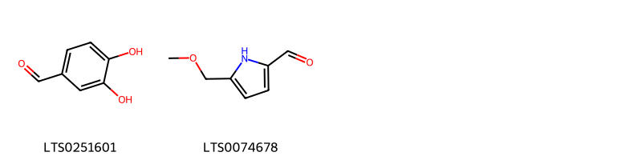{ width=100% }
    <figcaption>Hình ảnh cấu trúc hóa học của 2 hoạt chất thuộc nhóm Organooxygen compounds gồm ['3,4-dihydroxybenzaldehyde (LTS0251601)', '5-(methoxymethyl)-1h-pyrrole-2-carbaldehyde (LTS0074678)'].</figcaption>
</figure>
### Nhóm Phenalenes
<figure markdown="span">
    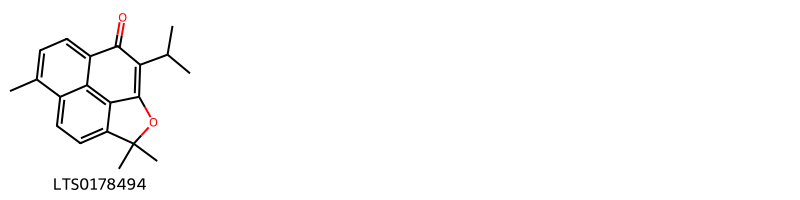{ width=100% }
    <figcaption>Hình ảnh cấu trúc hóa học của 1 hoạt chất thuộc nhóm Phenalenes gồm ['10-isopropyl-5,13,13-trimethyl-12-oxatetracyclo[6.5.2.0⁴,¹⁵.0¹¹,¹⁴]pentadeca-1,3,5,7,10,14-hexaen-9-one (LTS0178494)'].</figcaption>
</figure>
### Nhóm Phenanthrenes and derivatives
<figure markdown="span">
    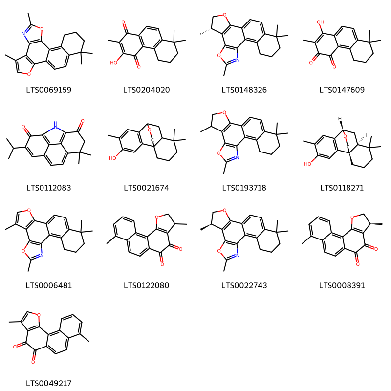{ width=100% }
    <figcaption>Hình ảnh cấu trúc hóa học của 13 hoạt chất thuộc nhóm Phenanthrenes and derivatives gồm ['5,9,17,17-tetramethyl-3,10-dioxa-8-azapentacyclo[10.8.0.0²,⁶.0⁷,¹¹.0¹³,¹⁸]icosa-1(12),2(6),4,7(11),8,13(18),19-heptaene (LTS0069159)', '3-hydroxy-2,8,8-trimethyl-6,7-dihydro-5h-phenanthrene-1,4-dione (LTS0204020)', '(5s)-5,9,17,17-tetramethyl-3,8-dioxa-10-azapentacyclo[10.8.0.0²,⁶.0⁷,¹¹.0¹³,¹⁸]icosa-1(12),2(6),7(11),9,13(18),19-hexaene (LTS0148326)', '1-hydroxy-2,8,8-trimethyl-6,7-dihydro-5h-phenanthrene-3,4-dione (LTS0147609)', '3-isopropyl-9,9-dimethyl-15-azatetracyclo[10.2.1.0⁵,¹⁴.0⁸,¹³]pentadeca-1(14),3,5,7,12-pentaene-2,11-dione (LTS0112083)', '5,11,11-trimethyl-16-oxatetracyclo[6.6.2.0¹,¹⁰.0²,⁷]hexadeca-2(7),3,5-trien-4-ol (LTS0021674)', '5,9,17,17-tetramethyl-3,8-dioxa-10-azapentacyclo[10.8.0.0²,⁶.0⁷,¹¹.0¹³,¹⁸]icosa-1(12),2(6),7(11),9,13(18),19-hexaene (LTS0193718)', '(1r,8s,10s)-5,11,11-trimethyl-16-oxatetracyclo[6.6.2.0¹,¹⁰.0²,⁷]hexadeca-2(7),3,5-trien-4-ol (LTS0118271)', '5,9,17,17-tetramethyl-3,8-dioxa-10-azapentacyclo[10.8.0.0²,⁶.0⁷,¹¹.0¹³,¹⁸]icosa-1(12),2(6),4,7(11),9,13(18),19-heptaene (LTS0006481)', '3,8-dimethyl-2h,3h-phenanthro[4,3-b]furan-4,5-dione (LTS0122080)', '(5r)-5,9,17,17-tetramethyl-3,8-dioxa-10-azapentacyclo[10.8.0.0²,⁶.0⁷,¹¹.0¹³,¹⁸]icosa-1(12),2(6),7(11),9,13(18),19-hexaene (LTS0022743)', '(3s)-3,8-dimethyl-2h,3h-phenanthro[4,3-b]furan-4,5-dione (LTS0008391)', '3,8-dimethylphenanthro[4,3-b]furan-4,5-dione (LTS0049217)'].</figcaption>
</figure>
### Nhóm Phenols
<figure markdown="span">
    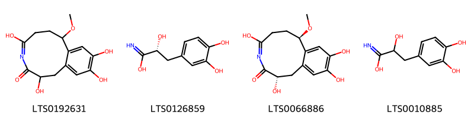{ width=100% }
    <figcaption>Hình ảnh cấu trúc hóa học của 4 hoạt chất thuộc nhóm Phenols gồm ['2,5,10,11-tetrahydroxy-8-methoxy-2,6,7,8-tetrahydro-1h-4-benzazecin-3-one (LTS0192631)', '(2r)-3-(3,4-dihydroxyphenyl)-2-hydroxypropanimidic acid (LTS0126859)', '(2s,8r)-2,5,10,11-tetrahydroxy-8-methoxy-2,6,7,8-tetrahydro-1h-4-benzazecin-3-one (LTS0066886)', '3-(3,4-dihydroxyphenyl)-2-hydroxypropanimidic acid (LTS0010885)'].</figcaption>
</figure>
### Nhóm Phenylpropanoic acids
<figure markdown="span">
    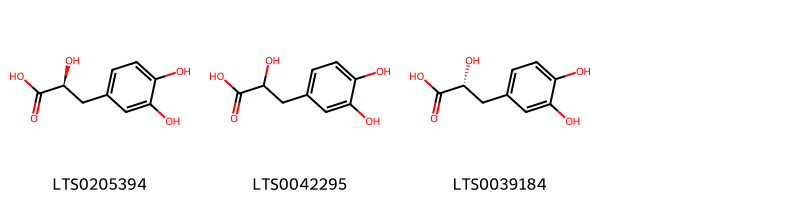{ width=100% }
    <figcaption>Hình ảnh cấu trúc hóa học của 3 hoạt chất thuộc nhóm Phenylpropanoic acids gồm ['(2s)-3-(3,4-dihydroxyphenyl)-2-hydroxypropanoic acid (LTS0205394)', '3,4-dihydroxyphenyllactic acid (LTS0042295)', 'danshensu (LTS0039184)'].</figcaption>
</figure>
### Nhóm Prenol lipids
<figure markdown="span">
    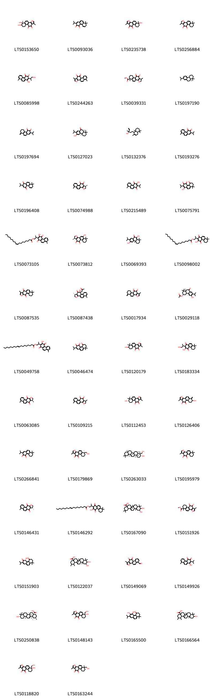{ width=100% }
    <figcaption>Hình ảnh cấu trúc hóa học của 102 hoạt chất thuộc nhóm Prenol lipids gồm ['(6r)-6,7-dihydroxy-1,6-dimethyl-7h,8h,9h-phenanthro[1,2-b]furan-10,11-dione (LTS0153650)', '2-isopropyl-8,8-dimethyl-7h-phenanthrene-3,4-dione (LTS0093036)', '6-hydroxy-1,6-dimethyl-7h,8h,9h-phenanthro[1,2-b]furan-10,11-dione (LTS0235738)', 'cryptotanshinone (LTS0256884)', '1-hydroxy-2-(1-hydroxypropan-2-yl)-8-methylphenanthrene-3,4-dione (LTS0085998)', 'tanshinone i (LTS0244263)', 'methyl 1,6-dimethyl-10,11-dioxo-1h,2h,7h,8h,9h-phenanthro[1,2-b]furan-6-carboxylate (LTS0039331)', '(4as,10ar)-7-isopropyl-1,1,4a-trimethyl-2,3,4,9,10,10a-hexahydrophenanthrene (LTS0197190)', '2-isopropyl-8-methylidene-6,7-dihydro-5h-phenanthrene-3,4-dione (LTS0197694)', 'sugiol (LTS0127023)', '5-(2,5,5,8a-tetramethyl-1,4,4a,6,7,8-hexahydronaphthalen-1-yl)-3-methylpent-1-en-3-ol (LTS0132376)', '2-isopropyl-8-methylphenanthrene-3,4-dione (LTS0193276)', '2-isopropyl-8,8-dimethyl-7h-phenanthrene-1,4-dione (LTS0196408)', 'dihydrotanshinone i (LTS0074988)', '3-hydroxy-2-isopropyl-8-methylphenanthrene-1,4-dione (LTS0215489)', '1-hydroxy-2-isopropyl-8,8-dimethyl-6,7-dihydrophenanthrene-3,4,5-trione (LTS0075791)', 'oleoyl danshenxinkun a (LTS0073105)', '(1r)-5-hydroxy-1,6,6-trimethyl-1h,2h,7h,8h,9h-phenanthro[1,2-b]furan-10,11-dione (LTS0073812)', '(4ar)-6,10-dihydroxy-7-isopropyl-1,1,4a-trimethyl-3,4-dihydro-2h-phenanthren-9-one (LTS0069393)', 'oleoyl neocryptotanshinone (LTS0098002)', '4,4,8-trimethyl-1h,2h,3h-phenanthro[3,2-b]furan-7,11-dione (LTS0087535)', '(1r,10s)-10-hydroxy-1,6-dimethyl-10-(2-oxopropyl)-1h,2h-phenanthro[1,2-b]furan-11-one (LTS0087438)', '1-methyl-6-methylidene-7h,8h,9h-phenanthro[1,2-b]furan-10,11-dione (LTS0017934)', '(3s,4as,10as)-6-hydroxy-7-isopropyl-1,1,4a-trimethyl-9-oxo-3,4,10,10a-tetrahydro-2h-phenanthren-3-yl acetate (LTS0029118)', '2-(3-hydroxy-8-methyl-1,4-dioxophenanthren-2-yl)propyl octadec-9-enoate (LTS0049758)', '2-isopropyl-8,8-dimethyl-6,7-dihydrophenanthrene-3,4,5-trione (LTS0046474)', '7-hydroxy-1,6,6-trimethyl-7h,8h,9h-phenanthro[1,2-b]furan-10,11-dione (LTS0120179)', '3-hydroxy-2-(1-hydroxypropan-2-yl)-8,8-dimethyl-6,7-dihydro-5h-phenanthrene-1,4-dione (LTS0183334)', '(8s)-4,8-dimethyl-8h,9h-phenanthro[3,2-b]furan-7,11-dione (LTS0063085)', 'dihydrotanshinone (LTS0109215)', '(7s)-7-hydroxy-1,6,6-trimethyl-7h,8h,9h-phenanthro[1,2-b]furan-10,11-dione (LTS0112453)', '7-hydroxy-1-methyl-6-methylidene-7h,8h,9h-phenanthro[1,2-b]furan-10,11-dione (LTS0126406)', 'miltirone (LTS0266841)', '(6s)-6-(hydroxymethyl)-1,6-dimethyl-7h,8h,9h-phenanthro[1,2-b]furan-10,11-dione (LTS0179869)', '(3r,4r,4ar,6ar,6bs,8ar,12ar,14ar,14br)-4-(hydroxymethyl)-4,6a,6b,8a,11,11,14b-heptamethyl-1,2,3,4a,5,6,7,8,9,10,12,12a,14,14a-tetradecahydropicen-3-ol (LTS0263033)', 'tanshinone iia (LTS0195979)', '(8r)-4,8-dimethyl-8h,9h-phenanthro[3,2-b]furan-7,11-dione (LTS0146431)', '2-(3-hydroxy-8,8-dimethyl-1,4-dioxo-6,7-dihydro-5h-phenanthren-2-yl)propyl octadec-9-enoate (LTS0146292)', '10,11-dihydroxy-2,2,6a,6b,9,9,12a-heptamethyl-1,3,4,5,6,7,8,8a,10,11,12,12b,13,14b-tetradecahydropicene-4a-carboxylic acid (LTS0167090)', 'methyl 1,6-dimethyl-10,11-dioxo-7h,8h,9h-phenanthro[1,2-b]furan-6-carboxylate (LTS0151926)', '(4r)-4-hydroxy-2-isopropyl-8,8-dimethyl-6,7-dihydro-4h-phenanthrene-3,5-dione (LTS0151903)', '10,11-dihydroxy-1,2,6a,6b,9,9,12a-heptamethyl-2,3,4,5,6,7,8,8a,10,11,12,12b,13,14b-tetradecahydro-1h-picene-4a-carboxylic acid (LTS0122037)', '1-methyl-10,11-dioxophenanthro[1,2-b]furan-6-carbaldehyde (LTS0149069)', '1-hydroxy-2-isopropyl-8-methylphenanthrene-3,4-dione (LTS0149926)', 'ursolic acid (LTS0250838)', '(6r)-6-hydroxy-6-(hydroxymethyl)-1-methyl-7h,8h,9h-phenanthro[1,2-b]furan-10,11-dione (LTS0148143)', '5,6-dihydroxy-7-isopropyl-1,1-dimethyl-2,3-dihydrophenanthren-4-one (LTS0165500)', '10-hydroxy-1,2,6a,6b,9,9,12a-heptamethyl-2,3,4,5,6,7,8,8a,10,11,12,12b,13,14b-tetradecahydro-1h-picene-4a-carboxylic acid (LTS0166564)', '(6s)-6-hydroxy-6-(hydroxymethyl)-1-methyl-7h,8h,9h-phenanthro[1,2-b]furan-10,11-dione (LTS0118820)', '6-(hydroxymethyl)-1,6-dimethyl-7h,8h,9h-phenanthro[1,2-b]furan-10,11-dione (LTS0163244)', '(6s)-6-hydroxy-1,6-dimethyl-7h,8h,9h-phenanthro[1,2-b]furan-10,11-dione (LTS0187816)', '4,8-dimethyl-8h,9h-phenanthro[3,2-b]furan-7,11-dione (LTS0058655)', '(3s)-5-[(1s,4as,8as)-2,5,5,8a-tetramethyl-1,4,4a,6,7,8-hexahydronaphthalen-1-yl]-3-methylpent-1-en-3-ol (LTS0212260)', 'cryptotanshinone (LTS0192623)', '6-hydroxy-7-isopropyl-1,1,4a-trimethyl-3,4,10,10a-tetrahydro-2h-phenanthren-9-one (LTS0270724)', '2-(1-hydroxy-8-methyl-3,4-dioxophenanthren-2-yl)propyl (9z)-octadec-9-enoate (LTS0209721)', '(6r,7s)-6,7-dihydroxy-1,6-dimethyl-7h,8h,9h-phenanthro[1,2-b]furan-10,11-dione (LTS0259936)', 'przewaquinone a (LTS0209017)', '(4bs,8ar)-2-isopropyl-4b,8,8-trimethyl-5,6,7,8a,9,10-hexahydrophenanthren-3-ol (LTS0222762)', 'methyl (6r)-1,6-dimethyl-10,11-dioxo-7h,8h,9h-phenanthro[1,2-b]furan-6-carboxylate (LTS0222755)', '(3r,4r,4ar,6ar,6bs,8ar,11r,12s,12ar,14ar,14br)-4-(hydroxymethyl)-4,6a,6b,8a,11,12,14b-heptamethyl-2,3,4a,5,6,7,8,9,10,11,12,12a,14,14a-tetradecahydro-1h-picen-3-ol (LTS0087521)', '3-hydroxy-2-[(2s)-1-hydroxypropan-2-yl]-8,8-dimethyl-6,7-dihydro-5h-phenanthrene-1,4-dione (LTS0193285)', '(2s)-2-(3-hydroxy-8-methyl-1,4-dioxophenanthren-2-yl)propyl (9z)-octadec-9-enoate (LTS0224161)', '6-hydroxy-7-isopropyl-1,1,4a-trimethyl-9-oxo-3,4,10,10a-tetrahydro-2h-phenanthren-3-yl acetate (LTS0211957)', '1,6-dimethyl-8h,9h-phenanthro[1,2-b]furan-10,11-dione (LTS0223537)', '6-hydroxy-5,6-dehydrosugiol (LTS0027737)', '1-hydroxy-2-isopropyl-8,8-dimethyl-6,7-dihydro-5h-phenanthrene-3,4-dione (LTS0225174)', 'corosolic acid (LTS0231285)', 'oleanolic acid (LTS0141130)', '2-isopropyl-8-methyl-3,4-dioxophenanthrene-1-carboxylic acid (LTS0235344)', '7-isopropyl-1,1,4a-trimethyl-2,3,4,9,10,10a-hexahydrophenanthrene (LTS0210076)', '4,4,8-trimethyl-1h,2h,3h,8h,9h-phenanthro[3,2-b]furan-7,11-dione (LTS0170337)', '1-(3-hydroxy-8,8-dimethyl-6,7-dihydro-5h-phenanthren-2-yl)ethanone (LTS0180808)', '(7s)-7-hydroxy-1-methyl-6-methylidene-7h,8h,9h-phenanthro[1,2-b]furan-10,11-dione (LTS0026970)', '(8s)-4,4,8-trimethyl-1h,2h,3h,8h,9h-phenanthro[3,2-b]furan-7,11-dione (LTS0174804)', '2-isopropyl-8-methylphenanthrene-1,4-dione (LTS0258668)', '(1r,9s,11s)-4-hydroxy-6,12,12-trimethyl-17-oxatetracyclo[7.6.2.0¹,¹¹.0²,⁸]heptadeca-2(8),3,6-trien-5-one (LTS0044398)', '(1r,10s)-10-hydroxy-1,6,6-trimethyl-10-(2-oxopropyl)-1h,2h,7h,8h,9h-phenanthro[1,2-b]furan-11-one (LTS0244450)', '2-isopropyl-4b,8,8-trimethyl-5,6,7,8a,9,10-hexahydrophenanthren-3-ol (LTS0255397)', '(6r,7r)-6,7-dihydroxy-1,6-dimethyl-7h,8h,9h-phenanthro[1,2-b]furan-10,11-dione (LTS0043464)', '1-methyl-7h,8h,9h-phenanthro[1,2-b]furan-6,10,11-trione (LTS0050930)', 'ferruginol (LTS0045608)', 'maslinic acid (LTS0109701)', '3-hydroxy-2-(1-hydroxypropan-2-yl)-8-methylphenanthrene-1,4-dione (LTS0055576)', '4-(hydroxymethyl)-4,6a,6b,8a,11,11,14b-heptamethyl-1,2,3,4a,5,6,7,8,9,10,12,12a,14,14a-tetradecahydropicen-3-ol (LTS0124497)', '4-hydroxy-2-isopropyl-8,8-dimethyl-5-oxo-6,7-dihydrophenanthren-3-yl hexadecanoate (LTS0014325)', '6,7-dihydroxy-1,6-dimethyl-7h,8h,9h-phenanthro[1,2-b]furan-10,11-dione (LTS0015786)', '1-hydroxy-2-[(2r)-1-hydroxypropan-2-yl]-8-methylphenanthrene-3,4-dione (LTS0000886)', '(2s)-2-(3-hydroxy-8,8-dimethyl-1,4-dioxo-6,7-dihydro-5h-phenanthren-2-yl)propyl (9z)-octadec-9-enoate (LTS0014289)', '4-(hydroxymethyl)-4,6a,6b,8a,11,12,14b-heptamethyl-2,3,4a,5,6,7,8,9,10,11,12,12a,14,14a-tetradecahydro-1h-picen-3-ol (LTS0010476)', '3-hydroxy-2-isopropyl-8,8-dimethyl-6,7-dihydrophenanthrene-1,4,5-trione (LTS0251597)', '1,6-dimethyl-10,11-dioxo-7h-phenanthro[1,2-b]furan-6-carbaldehyde (LTS0237544)', '(2r)-2-(3-hydroxy-8-methyl-1,4-dioxophenanthren-2-yl)propyl (9z)-octadec-9-enoate (LTS0276431)', '1-hydroxy-2-[(2s)-1-hydroxypropan-2-yl]-8,8-dimethyl-6,7-dihydro-5h-phenanthrene-3,4-dione (LTS0105767)', '1-hydroxy-2-(1-hydroxypropan-2-yl)-8,8-dimethyl-6,7-dihydro-5h-phenanthrene-3,4-dione (LTS0210950)', '10-hydroxy-4,4,8-trimethyl-1h,2h,3h-cyclohepta[a]naphthalen-9-one (LTS0252535)', '6-(hydroxymethyl)-1-methylphenanthro[1,2-b]furan-10,11-dione (LTS0111186)', '3-hydroxy-2-[(2r)-1-hydroxypropan-2-yl]-8-methylphenanthrene-1,4-dione (LTS0110547)', 'methyl (6s)-1,6-dimethyl-10,11-dioxo-7h,8h,9h-phenanthro[1,2-b]furan-6-carboxylate (LTS0037700)', '2-isopropyl-8,8-dimethyl-6,7-dihydro-5h-phenanthrene-1,4-dione (LTS0044266)', '6-hydroxy-6-(hydroxymethyl)-1-methyl-7h,8h,9h-phenanthro[1,2-b]furan-10,11-dione (LTS0123070)', 'oleanolic acid (LTS0117717)'].</figcaption>
</figure>
### Nhóm Steroids and steroid derivatives
<figure markdown="span">
    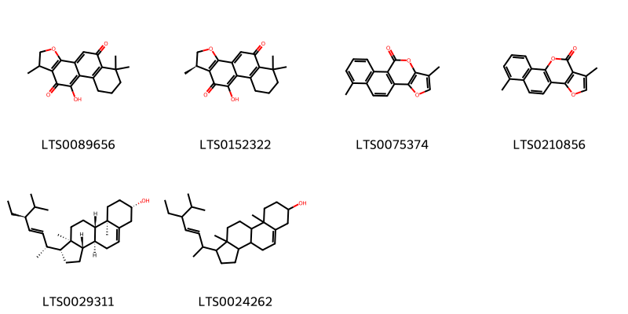{ width=100% }
    <figcaption>Hình ảnh cấu trúc hóa học của 6 hoạt chất thuộc nhóm Steroids and steroid derivatives gồm ['10-hydroxy-1,6,6-trimethyl-1h,2h,7h,8h,9h-phenanthro[1,2-b]furan-5,11-dione (LTS0089656)', '(1r)-10-hydroxy-1,6,6-trimethyl-1h,2h,7h,8h,9h-phenanthro[1,2-b]furan-5,11-dione (LTS0152322)', '6,14-dimethyl-12,16-dioxatetracyclo[8.7.0.0²,⁷.0¹¹,¹⁵]heptadeca-1(10),2(7),3,5,8,11(15),13-heptaen-17-one (LTS0075374)', '6,14-dimethyl-12,17-dioxatetracyclo[8.7.0.0²,⁷.0¹¹,¹⁵]heptadeca-1(10),2(7),3,5,8,11(15),13-heptaen-16-one (LTS0210856)', 'phytosterol (LTS0029311)', 'stigmasterol (LTS0024262)'].</figcaption>
</figure>
### Nhóm Stilbenes
<figure markdown="span">
    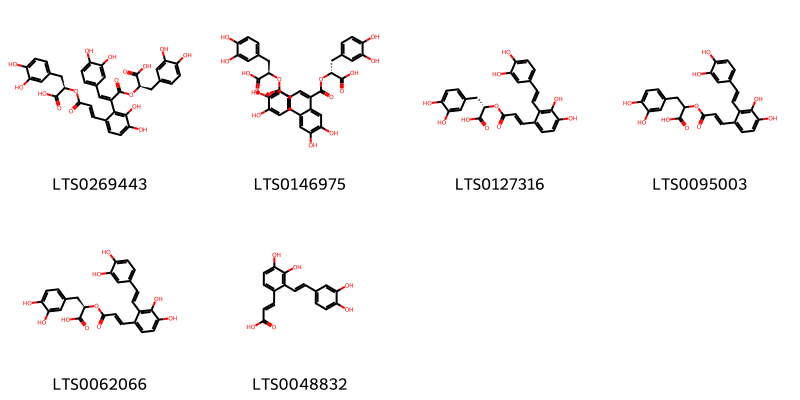{ width=100% }
    <figcaption>Hình ảnh cấu trúc hóa học của 6 hoạt chất thuộc nhóm Stilbenes gồm ['(2r)-2-{[(2e)-3-{2-[(1z)-3-[(1r)-1-carboxy-2-(3,4-dihydroxyphenyl)ethoxy]-1-(3,4-dihydroxyphenyl)-3-oxoprop-1-en-2-yl]-3,4-dihydroxyphenyl}prop-2-enoyl]oxy}-3-(3,4-dihydroxyphenyl)propanoic acid (LTS0269443)', '(2r)-2-{[(2e)-2-{2-[(1e)-3-[(1r)-1-carboxy-2-(3,4-dihydroxyphenyl)ethoxy]-3-oxoprop-1-en-1-yl]-4,5-dihydroxyphenyl}-3-(3,4-dihydroxyphenyl)prop-2-enoyl]oxy}-3-(3,4-dihydroxyphenyl)propanoic acid (LTS0146975)', '(2s)-3-(3,4-dihydroxyphenyl)-2-{[(2e)-3-{2-[(1e)-2-(3,4-dihydroxyphenyl)ethenyl]-3,4-dihydroxyphenyl}prop-2-enoyl]oxy}propanoic acid (LTS0127316)', '3-(3,4-dihydroxyphenyl)-2-[(3-{2-[2-(3,4-dihydroxyphenyl)ethenyl]-3,4-dihydroxyphenyl}prop-2-enoyl)oxy]propanoic acid (LTS0095003)', 'salvianolic acid a (LTS0062066)', '(2e)-3-{2-[(1e)-2-(3,4-dihydroxyphenyl)ethenyl]-3,4-dihydroxyphenyl}prop-2-enoic acid (LTS0048832)'].</figcaption>
</figure>
### Nhóm Tropones
<figure markdown="span">
    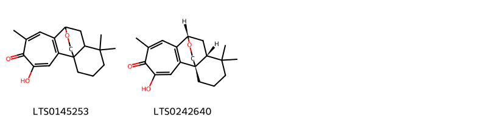{ width=100% }
    <figcaption>Hình ảnh cấu trúc hóa học của 2 hoạt chất thuộc nhóm Tropones gồm ['4-hydroxy-6,12,12-trimethyl-17-oxatetracyclo[7.6.2.0¹,¹¹.0²,⁸]heptadeca-2(8),3,6-trien-5-one (LTS0145253)', '(1r,9s,11r)-4-hydroxy-6,12,12-trimethyl-17-oxatetracyclo[7.6.2.0¹,¹¹.0²,⁸]heptadeca-2(8),3,6-trien-5-one (LTS0242640)'].</figcaption>
</figure>

---

## Tác dụng dược lý

Theo tài liệu "Những cây thuốc và vị thuốc Việt Nam" - Đỗ Tất Lợi:Chưa thấy có tài liệu nghiên cứu, nhìn công thức cấu tạo thấy có tính chất của vitamin K.

Theo tài liệu quốc tế: nan

---

## Dược điển Việt Nam V

### Soi bột:
nan
<!-- Hình ảnh soi bột sẽ được tự động chèn vào đây sau -->
### Vi phẫu:
nan
<!-- Hình ảnh vi phẫu sẽ được tự động chèn vào đây sau -->
### Định tính

nan

### Định lượng

nan

### Thông tin khác 
- ** Độ ẩm: ** nan

- ** Bảo quản:** nan
## Dược điển Hồng kong

<!-- PDF sẽ được tự động chèn vào đây sau -->

---

## Y dược học cổ truyền

- **Tên vị thuốc:** nan
- **Tính vị quy kinh:** Khô, vi hàn. Vào các kinh tâm, can
- **Công năng chủ trị:** "Hoạt huyết, thông kinh, giảm đau, thanh tâm lương huyết.

Chù trị: Kinh nguyệt không đều, kinh nguyệt bế tắc, hành kinh đau bụng, huyết tích hòn cục, đau thắt ngực, mất ngủ, tâm phiền."
- **Chú ý:** nan
- **Kiêng kỵ:** nan

