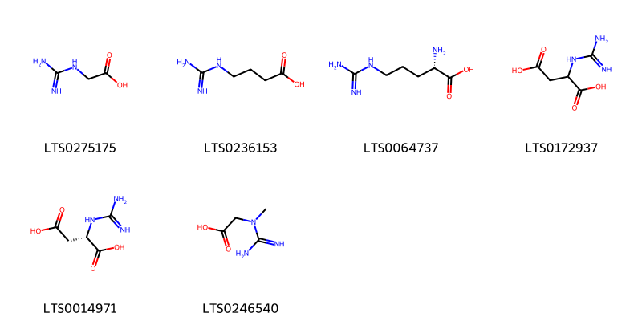
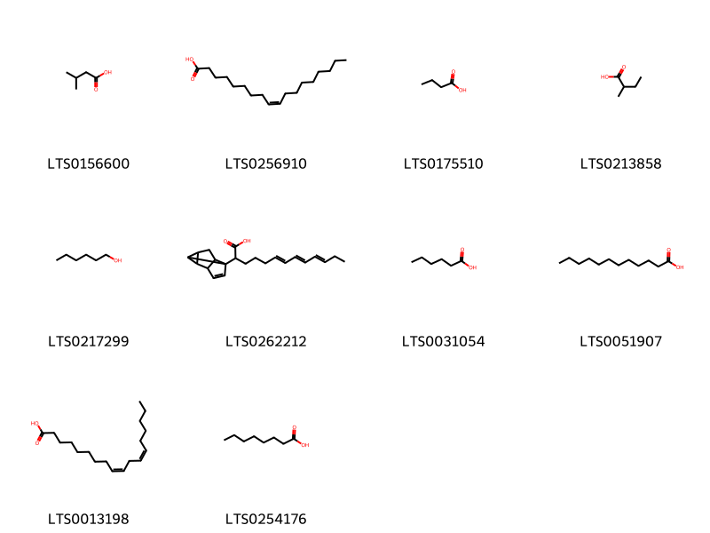
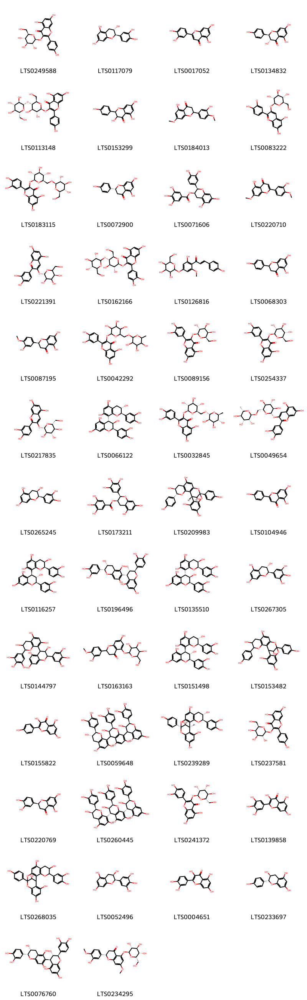
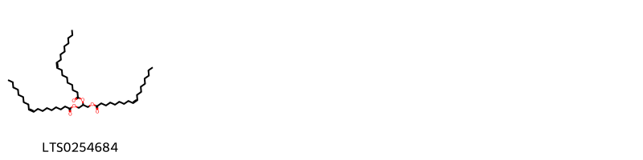
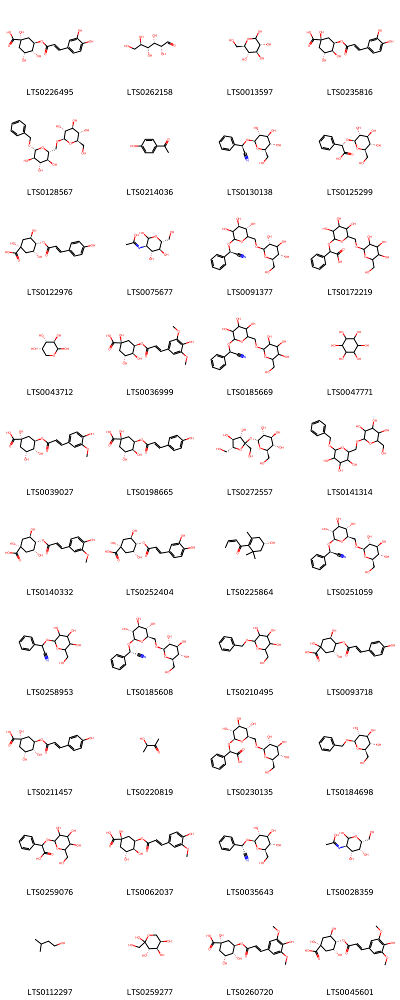
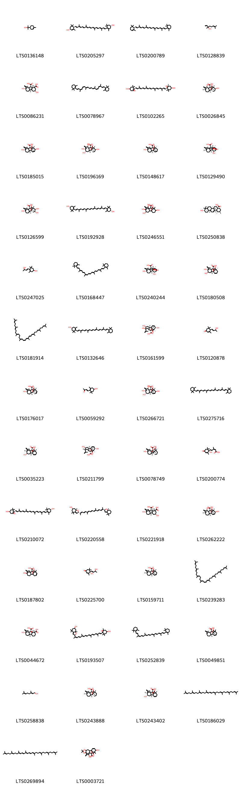
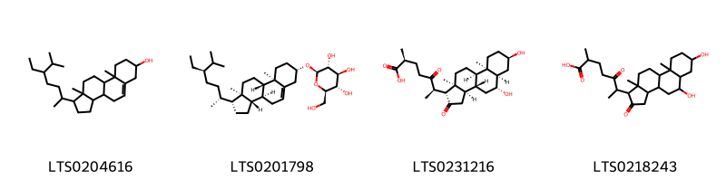

!!! abstract "Tóm tắt"
    1. Đào (Semen Pruni)
- Tên khoa học: Prunus persica (L.) Bätsch, Prunus persica Batsch var. davidiana Maximowicz
- Họ thực vật: Rosaceae (Họ Hoa hồng)
- Phân bố: Cây đào có nguồn gốc từ Trung Quốc, hiện nay đã được trồng rộng rãi ở nhiều quốc gia, bao gồm Việt Nam (Lào Cai, Cao Bằng, Lạng Sơn, Hà Giang).
- Mô tả thực vật: Cây đào là loài cây nhỏ, cao 3-4m, với thân có chất nhầy gọi là nhựa đào. Lá đơn, mọc so le, có cuống ngắn, mép lá răng cưa. Hoa hồng nhạt, cánh hoa 5, nhị vàng. Quả hạch, hình cầu, đầu nhọn.
- Thành phần hóa học: Glycoside cyanogenic, dầu béo, protein, acid amin, tannin.
- Tác dụng dược lý:
+Chữa đau đầu, đau tai
+Giảm đau, chống viêm, ho, long đờm
+Chữa ung thư, táo bón, đau bụng, khó tiêu
+Lợi tiểu, an thần
+Điều trị tăng huyết áp
-Công năng chủ trị: Hoạt huyết, khứ ứ, nhuận tràng, dùng trong vô kinh, mất kinh, sưng đau do sang chấn, táo bón.

## Thông tin về thực vật

### Đặc điểm thực vật

Dược liệu **Đào (Hạt)** từ bộ phận **** từ loài *Prunus persica (L.) Bätsch* thuộc họ Rosaceae. Cây đào là một cây nhỏ, cao 3-4m, da thân cây nhẫn. Trên thân thường có chất nhầy đùn ra gọi là nhựa đào. Lá đơn, mọc so le, có cuống ngắn, hình mác. Phiến lá dài 5-8cm, rộng 1,2 1,5cm, mép lá có răng cưa. Khi vò có mùi hạnh nhân. Hoa xuất hiện trước lã, màu hồng nhạt, 5 cánh, 8 nhị màu vàng. Quả hạch hình cầu, đầu nhọn có một ngấn lõm vào, chạy dọc theo quả. Vỏ ngoài có lông rất mịn. Quả chín có những đám đỏ. 

!!! info "Phân loại thực vật của *Prunus persica*"
    - **Kingdom:** Plantae
    - **Phylum:** Tracheophyta
    - **Order:** Rosales
    - **Family:** Rosaceae
    - **Genus:** Prunus
    - **Species:** *Prunus persica*

*Tài liệu tham khảo:* "Những cây thuốc và vị thuốc Việt Nam" - Đỗ Tất Lợi

 

### Loài thay thế (Nếu có)

Dược liệu này cũng có thể từ loài *Prunus persica Batsch var. davidiana Maximowicz*, thông tin về phân loại thực vật loài này như sau:
!!! info "Thông tin về phân loại thực vật của *Prunus persica*"
    - **kingdom:** Plantae
    - **phylum:** Tracheophyta
    - **order:** Rosales
    - **family:** Rosaceae
    - **genus:** Prunus
    - **species:** *Prunus persica*

Hình ảnh của loài *Prunus persica Batsch var. davidiana Maximowicz*:

### Phân bố trên thế giới
**Từ vườn thực vật KEW: **: Bản địa: China North-Central 
Di thực: Afghanistan, Alabama, Argentina Northwest, Arizona, Arkansas, Assam, Baleares, Bulgaria, California, Cape Verde, China South-Central, China Southeast, Colorado, Connecticut, Corse, Cyprus, Delaware, District of Columbia, East European Russia, East Himalaya, Ecuador, El Salvador, Ethiopia, Florida, France, Free State, Georgia, Germany, Great Britain, Greece, Hungary, Idaho, Illinois, India, Indiana, Inner Mongolia, Iowa, Iran, Ireland, Italy, Japan, Kansas, Kazakhstan, Kentucky, Kenya, Kirgizstan, Korea, Kriti, Krym, KwaZulu-Natal, Laos, Libya, Louisiana, Maine, Marianas, Maryland, Massachusetts, Mauritius, Mexico Northwest, Michigan, Mississippi, Missouri, New Jersey, New Mexico, New South Wales, New York, New Zealand North, North Carolina, North Caucasus, Northern Provinces, Nova Scotia, Ohio, Oklahoma, Ontario, Oregon, Pakistan, Pennsylvania, Portugal, Queensland, Rhode I., Rodrigues, Romania, Réunion, Sardegna, South Australia, South Carolina, South European Russia, Spain, St.Helena, Switzerland, Tadzhikistan, Tennessee, Texas, Transcaucasus, Turkey, Turkmenistan, Ukraine, Utah, Uzbekistan, Vietnam, Virginia, West Himalaya, West Virginia, Wisconsin

**Từ CSDL GIBF** nan, Poland, Spain, Australia, Austria, Croatia, Belgium, Norway, Germany, Netherlands, Bolivia (Plurinational State of), Honduras, New Zealand, Georgia, Korea, Republic of, Slovakia, Ukraine, India, Sweden, Mexico, Hungary, Jordan, Italy, China, United Kingdom of Great Britain and Northern Ireland, South Africa, Russian Federation, Slovenia, Dominican Republic, Switzerland, United States of America, Portugal, France

### Phân bố tại Việt Nam
** "Những cây thuốc và vị thuốc Việt Nam" - Đỗ Tất Lợi**: Tại Việt Nam nhiều nhất tại Lào Cai (Sapa), Cao Bằng, Lạng Sơn, Hà Giang

**Từ CSDL GIBF**: Không có ghi nhận ở Việt Nam

---

## Thông tin về dược liệu 

### Định danh

!!! info "Thông tin về tên gọi của "
    - Dược liệu tiếng Việt: 
    - Dược liệu tiếng Trung:  ()
    - Dược liệu tiếng Anh: 
    - Dược liệu latin thông dụng: Semen Pruni
    - Dược liệu latin kiểu DĐVN: semen pruni
    - Dược liệu latin kiểu DĐVN: 
    - Dược liệu latin kiểu thông tư: 
    - Bộ phận dùng:  (Semen)

### Mô tả dược liệu 
- **Theo dược điển Việt nam V:** 

- **Mô tả dược liệu theo thông tư chế biến dược liệu theo phương pháp cổ truyền:** 

### Chế biến 

- **Chế biến theo dược điển việt nam V**: 

- **Chế biến theo thông tư:** 

--- 

## Thành phần hóa học

- Theo tài liệu của GS. Đỗ Tất Lợi:  (1) Glycoside cyanogenic, dầu béo, protein và acid amin, tannin
    
- Theo cơ sở dữ liệu lotus: Từ loài *Prunus persica* đã phân lập và xác định được 204 hoạt chất thuộc về các nhóm Glycerolipids, Cinnamyl alcohols, Dibenzylbutane lignans, Lactones, Organooxygen compounds, Steroids and steroid derivatives, Coumarins and derivatives, Prenol lipids, Benzene and substituted derivatives, Carboxylic acids and derivatives, Phenols, Furanoid lignans, Fatty Acyls, Saturated hydrocarbons, Cinnamic acids and derivatives, Flavonoids. 

|    | chemicalTaxonomyClassyfireClass     |   smiles_count |
|---:|:------------------------------------|---------------:|
|  0 | Benzene and substituted derivatives |              6 |
|  1 | Carboxylic acids and derivatives    |              6 |
|  2 | Cinnamic acids and derivatives      |              7 |
|  3 | Cinnamyl alcohols                   |              1 |
|  4 | Coumarins and derivatives           |              4 |
|  5 | Dibenzylbutane lignans              |              2 |
|  6 | Fatty Acyls                         |             10 |
|  7 | Flavonoids                          |             51 |
|  8 | Furanoid lignans                    |              3 |
|  9 | Glycerolipids                       |              1 |
| 10 | Lactones                            |              1 |
| 11 | Organooxygen compounds              |             40 |
| 12 | Phenols                             |              6 |
| 13 | Prenol lipids                       |             60 |
| 14 | Saturated hydrocarbons              |              1 |
| 15 | Steroids and steroid derivatives    |              4 |

### Nhóm Benzene and substituted derivatives
<figure markdown="span">
    { width=100% }
    <figcaption>Hình ảnh cấu trúc hóa học của 6 hoạt chất thuộc nhóm Benzene and substituted derivatives gồm ['2-phenyl-ethanol (LTS0206341)', 'mandelic acid (LTS0194920)', '4-vinylphenol (LTS0148777)', 'benzoic acid (LTS0145871)', 'benzaldehyde (LTS0094193)', 'benzyl alcohol (LTS0125638)'].</figcaption>
</figure>
### Nhóm Carboxylic acids and derivatives
<figure markdown="span">
    { width=100% }
    <figcaption>Hình ảnh cấu trúc hóa học của 6 hoạt chất thuộc nhóm Carboxylic acids and derivatives gồm ['glycocyamine (LTS0275175)', '4-guanidinobutyric acid (LTS0236153)', 'l-arginine (LTS0064737)', 'guanidinosuccinic acid (LTS0172937)', 'n-amidino-l-aspartic acid (LTS0014971)', 'creatine (LTS0246540)'].</figcaption>
</figure>
### Nhóm Cinnamic acids and derivatives
<figure markdown="span">
    { width=100% }
    <figcaption>Hình ảnh cấu trúc hóa học của 7 hoạt chất thuộc nhóm Cinnamic acids and derivatives gồm ['ferulic acid (LTS0077328)', 'sinapinate (LTS0173482)', '3,4-dihydroxycinnamic acid (LTS0128050)', 'sinapoyl alcohol (LTS0275766)', 'para-coumaric acid (LTS0266252)', 'hydroxycinnamic acid (LTS0233023)', 'ferulic acid (LTS0273002)'].</figcaption>
</figure>
### Nhóm Cinnamyl alcohols
<figure markdown="span">
    { width=100% }
    <figcaption>Hình ảnh cấu trúc hóa học của 1 hoạt chất thuộc nhóm Cinnamyl alcohols gồm ['cinnamyl alcohol (LTS0010678)'].</figcaption>
</figure>
### Nhóm Coumarins and derivatives
<figure markdown="span">
    { width=100% }
    <figcaption>Hình ảnh cấu trúc hóa học của 4 hoạt chất thuộc nhóm Coumarins and derivatives gồm ['umbelliferone (LTS0162728)', '2h-1-benzopyran-2-one (LTS0069773)', 'scopolin (LTS0061811)', 'scopoletin (LTS0193112)'].</figcaption>
</figure>
### Nhóm Dibenzylbutane lignans
<figure markdown="span">
    { width=100% }
    <figcaption>Hình ảnh cấu trúc hóa học của 2 hoạt chất thuộc nhóm Dibenzylbutane lignans gồm ['(2s,3r)-2,3-bis[(4-hydroxy-3-methoxyphenyl)(¹³c)methyl](1-¹³c)butane-1,4-diol (LTS0268699)', 'secoisolariciresinol (LTS0086727)'].</figcaption>
</figure>
### Nhóm Fatty Acyls
<figure markdown="span">
    { width=100% }
    <figcaption>Hình ảnh cấu trúc hóa học của 10 hoạt chất thuộc nhóm Fatty Acyls gồm ['isovaleric acid (LTS0156600)', 'oleic acid (LTS0256910)', 'butanoic acid (LTS0175510)', '2-methylbutanoic acid (LTS0213858)', 'hexanol (LTS0217299)', '(6e,8e,10e)-2-{tetracyclo[4.3.0.0²,⁴.0³,⁷]non-8-en-1-yl}trideca-6,8,10-trienoic acid (LTS0262212)', 'hexanoic acid (LTS0031054)', 'lauric acid (LTS0051907)', 'linoleic (LTS0013198)', 'caprylic acid (LTS0254176)'].</figcaption>
</figure>
### Nhóm Flavonoids
<figure markdown="span">
    { width=100% }
    <figcaption>Hình ảnh cấu trúc hóa học của 51 hoạt chất thuộc nhóm Flavonoids gồm ['astragalin (LTS0249588)', '(+)-catechol (LTS0117079)', 'luteolin (LTS0017052)', '(+)-dihydrokaempferol (LTS0134832)', '3-{[(2s,3r,4r,5s,6r)-3,4-dihydroxy-6-(hydroxymethyl)-5-{[(2s,3r,4s,5s,6r)-3,4,5-trihydroxy-6-(hydroxymethyl)oxan-2-yl]oxy}oxan-2-yl]oxy}-5,7-dihydroxy-2-(4-hydroxyphenyl)chromen-4-one (LTS0113148)', 'aromadendrin (LTS0153299)', 'persicogenin (LTS0184013)', '5,7-dihydroxy-2-(4-hydroxy-3-oxidophenyl)-3-{[(2s,3r,4s,5s,6r)-3,4,5-trihydroxy-6-(hydroxymethyl)oxan-2-yl]oxy}-1λ⁴-chromen-1-ylium (LTS0083222)', '2-(3,4-dihydroxyphenyl)-5,7-dihydroxy-3-{[(2s,3r,4s,5s,6r)-3,4,5-trihydroxy-6-({[(2r,3r,4s,5s,6r)-3,4,5-trihydroxy-6-(hydroxymethyl)oxan-2-yl]oxy}methyl)oxan-2-yl]oxy}chromen-4-one (LTS0183115)', '(-)-naringenin (LTS0072900)', 'epicatechin gallate (LTS0071606)', 'pilloin (LTS0220710)', 'chrysanthemin (LTS0221391)', '3-{[(2s,3r,4r,5s,6r)-3,4-dihydroxy-6-(hydroxymethyl)-5-{[(3s,5r)-3,4,5-trihydroxy-6-(hydroxymethyl)oxan-2-yl]oxy}oxan-2-yl]oxy}-2-(3,4-dihydroxyphenyl)-5,7-dihydroxychromen-4-one (LTS0162166)', 'helichrysin (LTS0126816)', 'asahina (LTS0068303)', 'hesperetin (LTS0087195)', 'rutin (LTS0042292)', 'hyperoside (LTS0089156)', 'isoquercetin (LTS0254337)', 'cyanidin 3-glucoside (LTS0217835)', '(2r,3r,4r)-2-(3,4-dihydroxyphenyl)-4-[(2r,3s)-2-(3,4-dihydroxyphenyl)-3,5,7-trihydroxy-3,4-dihydro-2h-1-benzopyran-8-yl]-3,4-dihydro-2h-1-benzopyran-3,5,7-triol (LTS0066122)', '3-rutinosyl quercetin (LTS0032845)', 'cyanidin 3-o-rutinoside (LTS0049654)', 'ent-epicatechin (LTS0265245)', '(-)-epigallocatechin gallate (LTS0173211)', '(1r,5r,6s,13s,21s)-5,13-bis(4-hydroxyphenyl)-4,12,14-trioxapentacyclo[11.7.1.0²,¹¹.0³,⁸.0¹⁵,²⁰]henicosa-2(11),3(8),9,15,17,19-hexaene-6,9,17,19,21-pentol (LTS0209983)', 'chamomile (LTS0104946)', '(2r,3s,4s)-2-(3,4-dihydroxyphenyl)-4-[(2r,3r)-2-(3,4-dihydroxyphenyl)-3,5,7-trihydroxy-3,4-dihydro-2h-1-benzopyran-8-yl]-3,4-dihydro-2h-1-benzopyran-3,5,7-triol (LTS0116257)', '(2r,3s,4s)-2-(3,4-dihydroxyphenyl)-4-[(2r,3r)-2-(3,4-dihydroxyphenyl)-3,5,7-trihydroxy-3,4-dihydro-2h-1-benzopyran-6-yl]-3,4-dihydro-2h-1-benzopyran-3,5,7-triol (LTS0196496)', '(2r,3r,4r)-2-(3,4-dihydroxyphenyl)-4-[(2r,3r)-2-(3,4-dihydroxyphenyl)-3,5,7-trihydroxy-3,4-dihydro-2h-1-benzopyran-8-yl]-3,4-dihydro-2h-1-benzopyran-3,5,7-triol (LTS0135510)', 'gallocatechol (LTS0267305)', '4-[3,5,7-trihydroxy-2-(3,4,5-trihydroxyphenyl)-3,4-dihydro-2h-1-benzopyran-8-yl]-2-(3,4,5-trihydroxyphenyl)-3,4-dihydro-2h-1-benzopyran-3,5,7-triol (LTS0144797)', 'hesperetin 5-o-glucoside (LTS0163163)', '(2r,3s,4s)-2-(3,4-dihydroxyphenyl)-4-[(2r,3s)-2-(3,4-dihydroxyphenyl)-3,5,7-trihydroxy-3,4-dihydro-2h-1-benzopyran-8-yl]-3,4-dihydro-2h-1-benzopyran-3,5,7-triol (LTS0151498)', 'geranin a (LTS0153482)', 'kaempherol (LTS0155822)', '(2r,3r)-2-(3,4-dihydroxyphenyl)-8-[(2r,3r)-2-(3,4-dihydroxyphenyl)-3,5,7-trihydroxy-3,4-dihydro-2h-1-benzopyran-4-yl]-4-[(2r,3s)-2-(3,4-dihydroxyphenyl)-3,5,7-trihydroxy-3,4-dihydro-2h-1-benzopyran-8-yl]-3,4-dihydro-2h-1-benzopyran-3,5,7-triol (LTS0059648)', '(1r,5r,6s,13s,21s)-5-(3,4-dihydroxyphenyl)-13-(4-hydroxyphenyl)-4,12,14-trioxapentacyclo[11.7.1.0²,¹¹.0³,⁸.0¹⁵,²⁰]henicosa-2(11),3(8),9,15,17,19-hexaene-6,9,17,19,21-pentol (LTS0239289)', 'trifolin (LTS0237581)', 'eriodictyol (LTS0220769)', 'procyanidin c1 (LTS0260445)', '2-(3,4-dihydroxyphenyl)-5,7-dihydroxy-3-{[(2s,3r,4r,5r,6s)-3,4,5-trihydroxy-6-(hydroxymethyl)oxan-2-yl]oxy}chromen-4-one (LTS0241372)', 'myricetin (LTS0139858)', '5-(3,4-dihydroxyphenyl)-13-(4-hydroxyphenyl)-4,12,14-trioxapentacyclo[11.7.1.0²,¹¹.0³,⁸.0¹⁵,²⁰]henicosa-2(11),3(8),9,15,17,19-hexaene-6,9,17,19,21-pentol (LTS0268035)', 'epigallocatechin (LTS0052496)', 'quercetin (LTS0004651)', 'afzelechin (LTS0233697)', '(2r,3s,4r)-2-(3,4-dihydroxyphenyl)-4-[(2r,3r)-2-(3,4-dihydroxyphenyl)-3,5,7-trihydroxy-3,4-dihydro-2h-1-benzopyran-6-yl]-3,4-dihydro-2h-1-benzopyran-3,5,7-triol (LTS0076760)', '(2s)-2-(3-hydroxy-4-methoxyphenyl)-7-methoxy-5-{[(2s,3r,4s,5s,6s)-3,4,5-trihydroxy-6-(hydroxymethyl)oxan-2-yl]oxy}-2,3-dihydro-1-benzopyran-4-one (LTS0234295)', "3,5,7,4'-tetrahydroxyflavan (LTS0039714)"].</figcaption>
</figure>
### Nhóm Furanoid lignans
<figure markdown="span">
    { width=100% }
    <figcaption>Hình ảnh cấu trúc hóa học của 3 hoạt chất thuộc nhóm Furanoid lignans gồm ['pinoresinol (LTS0057431)', 'matairesinol (LTS0193475)', 'lariciresinol (LTS0010950)'].</figcaption>
</figure>
### Nhóm Glycerolipids
<figure markdown="span">
    { width=100% }
    <figcaption>Hình ảnh cấu trúc hóa học của 1 hoạt chất thuộc nhóm Glycerolipids gồm ['triolein (LTS0254684)'].</figcaption>
</figure>
### Nhóm Lactones
<figure markdown="span">
    { width=100% }
    <figcaption>Hình ảnh cấu trúc hóa học của 1 hoạt chất thuộc nhóm Lactones gồm ['γ-dodecalactone (LTS0229009)'].</figcaption>
</figure>
### Nhóm Organooxygen compounds
<figure markdown="span">
    { width=100% }
    <figcaption>Hình ảnh cấu trúc hóa học của 40 hoạt chất thuộc nhóm Organooxygen compounds gồm ['chlorogenic acid (LTS0226495)', '(+)-glucose (LTS0262158)', 'glucose (LTS0013597)', 'neochlorogenic acid (LTS0235816)', '(2r,3r,4s,5s,6r)-2-{[(2r,3s,4s,5r,6r)-6-(benzyloxy)-3,4,5-trihydroxyoxan-2-yl]methoxy}-6-(hydroxymethyl)oxane-3,4,5-triol (LTS0128567)', 'hydroxyacetophenone (LTS0214036)', 'prunasin (LTS0130138)', '(s)-phenyl({[(2s,3r,4s,5s,6r)-3,4,5-trihydroxy-6-(hydroxymethyl)oxan-2-yl]oxy})acetic acid (LTS0125299)', '(1s,3r,4s,5r)-1,3,5-trihydroxy-4-{[(2e)-3-(4-hydroxyphenyl)prop-2-enoyl]oxy}cyclohexane-1-carboxylic acid (LTS0122976)', 'n-[(3r,4r,5s,6r)-2,4,5-trihydroxy-6-(hydroxymethyl)oxan-3-yl]ethanimidic acid (LTS0075677)', '(2r)-2-phenyl-2-{[(4s,5s)-3,4,5-trihydroxy-6-({[(3r,5s,6r)-3,4,5-trihydroxy-6-(hydroxymethyl)oxan-2-yl]oxy}methyl)oxan-2-yl]oxy}acetonitrile (LTS0091377)', 'phenyl({[3,4,5-trihydroxy-6-({[3,4,5-trihydroxy-6-(hydroxymethyl)oxan-2-yl]oxy}methyl)oxan-2-yl]oxy})acetic acid (LTS0172219)', 'l-arabinopyranose (LTS0043712)', '3-o-sinapoylquinic acid (LTS0036999)', 'amygdalin (LTS0185669)', '(-)-inositol (LTS0047771)', '3-o-feruloyl-d-quinic acid (LTS0039027)', '(1r,3r,4s,5r)-1,3,4-trihydroxy-5-{[(2e)-3-(4-hydroxyphenyl)prop-2-enoyl]oxy}cyclohexane-1-carboxylic acid (LTS0198665)', 'sucrose (LTS0272557)', '2-{[6-(benzyloxy)-3,4,5-trihydroxyoxan-2-yl]methoxy}-6-(hydroxymethyl)oxane-3,4,5-triol (LTS0141314)', '4-o-feruloyl-d-quinic acid (LTS0140332)', 'cryptochlorogenic acid (LTS0252404)', '(2z)-1-[(4s)-4-hydroxy-2,6,6-trimethylcyclohex-1-en-1-yl]but-2-en-1-one (LTS0225864)', 'laetrile (LTS0251059)', '2-phenyl-2-{[3,4,5-trihydroxy-6-(hydroxymethyl)oxan-2-yl]oxy}acetonitrile (LTS0258953)', '(2s)-2-phenyl-2-{[(2r,3r,4s,5s,6r)-3,4,5-trihydroxy-6-({[(2r,3r,4s,5s,6r)-3,4,5-trihydroxy-6-(hydroxymethyl)oxan-2-yl]oxy}methyl)oxan-2-yl]oxy}acetonitrile (LTS0185608)', 'benzyl glucopyranoside (LTS0210495)', '(3r,5r)-1,3,5-trihydroxy-4-{[(2e)-3-(4-hydroxyphenyl)prop-2-enoyl]oxy}cyclohexane-1-carboxylic acid (LTS0093718)', '(1s,3r,4r,5r)-1,3,4-trihydroxy-5-{[(2e)-3-(4-hydroxyphenyl)prop-2-enoyl]oxy}cyclohexane-1-carboxylic acid (LTS0211457)', 'acetoin (LTS0220819)', '(r)-phenyl({[(2s,3r,4s,5s,6r)-3,4,5-trihydroxy-6-({[(2r,3r,4s,5s,6r)-3,4,5-trihydroxy-6-(hydroxymethyl)oxan-2-yl]oxy}methyl)oxan-2-yl]oxy})acetic acid (LTS0230135)', 'benzyl β-d-glucoside (LTS0184698)', 'phenyl({[3,4,5-trihydroxy-6-(hydroxymethyl)oxan-2-yl]oxy})acetic acid (LTS0259076)', '3-feruloylquinic acid (LTS0062037)', '(s)-prunasin (LTS0035643)', 'n-[(3r,4r,5r,6r)-2,4,5-trihydroxy-6-(hydroxymethyl)oxan-3-yl]ethanimidic acid (LTS0028359)', 'isoamyl alcohol (LTS0112297)', 'd-fructopyranose (LTS0259277)', '5-o-sinapoylquinic acid (LTS0260720)', '4-o-sinapoylquinic acid (LTS0045601)'].</figcaption>
</figure>
### Nhóm Phenols
<figure markdown="span">
    { width=100% }
    <figcaption>Hình ảnh cấu trúc hóa học của 6 hoạt chất thuộc nhóm Phenols gồm ['eugenol (LTS0052342)', 'tyrosol (LTS0132195)', 'vanillin (LTS0136163)', '2-methoxy-4-vinyl-phenol (LTS0128961)', 'phenol (LTS0092642)', 'frambinone (LTS0021621)'].</figcaption>
</figure>
### Nhóm Prenol lipids
<figure markdown="span">
    { width=100% }
    <figcaption>Hình ảnh cấu trúc hóa học của 60 hoạt chất thuộc nhóm Prenol lipids gồm ['terpineol (LTS0136148)', 'carotenoid (LTS0205297)', '(+)-α-carotene (LTS0200789)', 'linalool, (+-)- (LTS0128839)', '(1r,2s,3s,4r,6s,8r,9s,12s)-6,12-dihydroxy-4,8-dimethyl-13-methylidenetetracyclo[10.2.1.0¹,⁹.0³,⁸]pentadecane-2,4-dicarboxylic acid (LTS0086231)', '1,3,3-trimethyl-2-[(1e,3z,5z,7e,9e,11e,13z,15z,17e)-3,7,12,16-tetramethyl-18-(2,6,6-trimethylcyclohex-1-en-1-yl)octadeca-1,3,5,7,9,11,13,15,17-nonaen-1-yl]cyclohex-1-ene (LTS0078967)', 'violaxanthin (LTS0102265)', '(1r,2r,5r,7r,8r,9s,10r,11s,12s)-7,12-dihydroxy-11-methyl-6-methylidene-16-oxo-15-oxapentacyclo[9.3.2.1⁵,⁸.0¹,¹⁰.0²,⁸]heptadecane-9-carboxylic acid (LTS0026845)', 'gibberellin a3 (LTS0185015)', '(1r,2r,4s,5s,7s,8r,9s,10r,11s,12s)-4,5,7,12-tetrahydroxy-11-methyl-6-methylidene-16-oxo-15-oxapentacyclo[9.3.2.1⁵,⁸.0¹,¹⁰.0²,⁸]heptadecane-9-carboxylic acid (LTS0196169)', '(1s,2r,5s,9s,10r,11s)-5-hydroxy-11-methyl-6-methylidene-16-oxo-15-oxapentacyclo[9.3.2.1⁵,⁸.0¹,¹⁰.0²,⁸]heptadec-13-ene-9-carboxylic acid (LTS0148617)', '(1r,2r,5r,8r,9s,10r,11r,14r)-14-hydroxy-11-methyl-6-methylidene-16-oxo-15-oxapentacyclo[9.3.2.1⁵,⁸.0¹,¹⁰.0²,⁸]heptadecane-9-carboxylic acid (LTS0129490)', 'gibberellin a8 (LTS0126599)', 'zeaxanthin (LTS0192928)', '4,5,7,12-tetrahydroxy-11-methyl-6-methylidene-16-oxo-15-oxapentacyclo[9.3.2.1⁵,⁸.0¹,¹⁰.0²,⁸]heptadecane-9-carboxylic acid (LTS0246551)', 'ursolic acid (LTS0250838)', '4-[(1e)-3-hydroxybut-1-en-1-yl]-3,5,5-trimethylcyclohex-3-en-1-ol (LTS0247025)', 'β,β-carotene (LTS0168447)', '(1r,2r,5s,8s,9s,10r,11r,14s)-5,14-dihydroxy-11-methyl-6-methylidene-16-oxo-15-oxapentacyclo[9.3.2.1⁵,⁸.0¹,¹⁰.0²,⁸]heptadecane-9-carboxylic acid (LTS0240244)', '(1s,2r,4r,5s,8r,9s,10r,11s)-4,5-dihydroxy-11-methyl-6-methylidene-16-oxo-15-oxapentacyclo[9.3.2.1⁵,⁸.0¹,¹⁰.0²,⁸]heptadec-13-ene-9-carboxylic acid (LTS0180508)', 'phytofluene (LTS0181914)', 'cryptoxanthin (LTS0132646)', '(1r,2r,4s,5s,8s,9s,10r,11s,12s)-4,5,12-trihydroxy-11-methyl-6-methylidene-16-oxo-15-oxapentacyclo[9.3.2.1⁵,⁸.0¹,¹⁰.0²,⁸]heptadec-13-ene-9-carboxylic acid (LTS0161599)', '4-[(1e)-3-hydroxybut-1-en-1-yl]-3,5,5-trimethylcyclohex-2-en-1-one (LTS0120878)', 'gibberellin a5 (LTS0176017)', '(3e)-4-(4-hydroxy-2,6,6-trimethylcyclohex-1-en-1-yl)but-3-en-2-one (LTS0059292)', '(1r,2r,4s,5s,7s,8r,9s,10r,11s,12s)-4,5,7,12-tetrahydroxy-11-methyl-6-methylidene-16-oxo-15-oxapentacyclo[9.3.2.1⁵,⁸.0¹,¹⁰.0²,⁸]heptadec-13-ene-9-carboxylic acid (LTS0266721)', 'β-carotene (LTS0275716)', '(1r,2r,4r,5r,8r,9s,10r,11r)-4-hydroxy-11-methyl-6-methylidene-16-oxo-15-oxapentacyclo[9.3.2.1⁵,⁸.0¹,¹⁰.0²,⁸]heptadec-13-ene-9-carboxylic acid (LTS0035223)', '(1r,2r,4s,5r,8r,9s,10r,11s,12s)-4,12-dihydroxy-11-methyl-6-methylidene-16-oxo-15-oxapentacyclo[9.3.2.1⁵,⁸.0¹,¹⁰.0²,⁸]heptadec-13-ene-9-carboxylic acid (LTS0211799)', 'gibberellin a44 (LTS0078749)', 'abscisic acid (LTS0200774)', 'antheraxanthin (LTS0210072)', '(2s,6r,7as)-2-[(2e,4e,6e,8e,10e,12e,14e)-15-[(2s,7ar)-4,4,7a-trimethyl-2,5,6,7-tetrahydro-1-benzofuran-2-yl]-6,11-dimethylhexadeca-2,4,6,8,10,12,14-heptaen-2-yl]-4,4,7a-trimethyl-2,5,6,7-tetrahydro-1-benzofuran-6-ol (LTS0220558)', '(2s,3s,4r,6s,8r,9s,12s)-6,12-dihydroxy-4,8-dimethyl-13-methylidenetetracyclo[10.2.1.0¹,⁹.0³,⁸]pentadecane-2,4-dicarboxylic acid (LTS0221918)', '(1r,2r,5r,7r,8r,9s,10r,11s,12s)-7,12-dihydroxy-11-methyl-6-methylidene-16-oxo-15-oxapentacyclo[9.3.2.1⁵,⁸.0¹,¹⁰.0²,⁸]heptadec-13-ene-9-carboxylic acid (LTS0262222)', '5-hydroxy-11-methyl-6-methylidene-16-oxo-15-oxapentacyclo[9.3.2.1⁵,⁸.0¹,¹⁰.0²,⁸]heptadec-12-ene-9-carboxylic acid (LTS0187802)', '(4s)-4-hydroxy-4-(3-hydroxybut-1-en-1-yl)-3,5,5-trimethylcyclohex-2-en-1-one (LTS0225700)', '(1r,2r,5r,8s,9s,10r,11r)-11-methyl-6-methylidene-16-oxo-15-oxapentacyclo[9.3.2.1⁵,⁸.0¹,¹⁰.0²,⁸]heptadec-13-ene-9-carboxylic acid (LTS0159711)', 'cis-phytoene (LTS0239283)', 'gibberellin a19 (LTS0044672)', '2-[(2z,4e,6e,8e,10e,12e,14e,16e)-17-{4-hydroxy-2,2,6-trimethyl-7-oxabicyclo[4.1.0]heptan-1-yl}-6,11,15-trimethylheptadeca-2,4,6,8,10,12,14,16-octaen-2-yl]-4,4,7a-trimethyl-2,5,6,7-tetrahydro-1-benzofuran-6-ol (LTS0193507)', '(9z)-β-carotene (LTS0252839)', '(1r,2r,8s,9s,10r)-11-methyl-6-methylidene-16-oxo-15-oxapentacyclo[9.3.2.1⁵,⁸.0¹,¹⁰.0²,⁸]heptadec-13-ene-9-carboxylic acid (LTS0049851)', 'geraniol (LTS0258838)', 'gibberellin a9 (LTS0243888)', '(1r,2r,4s,5r,8r,9s,10r,11r)-4-hydroxy-11-methyl-6-methylidene-16-oxo-15-oxapentacyclo[9.3.2.1⁵,⁸.0¹,¹⁰.0²,⁸]heptadec-13-ene-9-carboxylic acid (LTS0243402)', 'phytoene (LTS0186029)', 'all-trans-phytofluene (LTS0269894)', '10,15-dihydroxy-6,6,14-trimethyl-9-methylidene-19-oxo-5,7,18-trioxahexacyclo[12.3.2.1⁸,¹¹.0¹,¹³.0²,¹¹.0⁴,⁸]icos-16-ene-12-carboxylic acid (LTS0003721)', '(1r,2r,5r,8r,9s,10r,11r,14s)-14-hydroxy-11-methyl-6-methylidene-16-oxo-15-oxapentacyclo[9.3.2.1⁵,⁸.0¹,¹⁰.0²,⁸]heptadecane-9-carboxylic acid (LTS0059228)', '(1r,2r,4s,8s,10s,11r,12s,13r,14s,15s)-10,15-dihydroxy-6,6,14-trimethyl-9-methylidene-19-oxo-5,7,18-trioxahexacyclo[12.3.2.1⁸,¹¹.0¹,¹³.0²,¹¹.0⁴,⁸]icos-16-ene-12-carboxylic acid (LTS0016694)', 'gibberellin a1 (LTS0013777)', '6-[(1e,3z,5e,7e,9e,11z)-13-hydroxy-3,7,12-trimethyltrideca-1,3,5,7,9,11-hexaen-1-yl]-1,5,5-trimethyl-7-oxabicyclo[4.1.0]heptan-3-ol (LTS0013466)', 'α-carotene (LTS0224243)', 'dehydrovomifoliol (LTS0209706)', 'zeta-carotene (LTS0007334)', '(1s,2r,5s,8r,9s,10r,11s)-5-hydroxy-11-methyl-6-methylidene-16-oxo-15-oxapentacyclo[9.3.2.1⁵,⁸.0¹,¹⁰.0²,⁸]heptadec-13-ene-9-carboxylic acid (LTS0230537)', '(1s,2r,4r,5s,9s,10r,11s)-4,5-dihydroxy-11-methyl-6-methylidene-16-oxo-15-oxapentacyclo[9.3.2.1⁵,⁸.0¹,¹⁰.0²,⁸]heptadec-13-ene-9-carboxylic acid (LTS0254428)', '5-(1-hydroxy-2,6,6-trimethyl-4-oxocyclohex-2-en-1-yl)-3-methylpenta-2,4-dienoic acid (LTS0021517)'].</figcaption>
</figure>
### Nhóm Saturated hydrocarbons
<figure markdown="span">
    { width=100% }
    <figcaption>Hình ảnh cấu trúc hóa học của 1 hoạt chất thuộc nhóm Saturated hydrocarbons gồm ['hentriacontane (LTS0046415)'].</figcaption>
</figure>
### Nhóm Steroids and steroid derivatives
<figure markdown="span">
    { width=100% }
    <figcaption>Hình ảnh cấu trúc hóa học của 4 hoạt chất thuộc nhóm Steroids and steroid derivatives gồm ['stigmast-5-en-3-ol, (3β)- (LTS0204616)', 'sitogluside (LTS0201798)', '(2s,6r)-6-[(1r,3ar,3bs,5r,5ar,7r,9ar,9br,11as)-5,7-dihydroxy-9a,11a-dimethyl-2-oxo-tetradecahydrocyclopenta[a]phenanthren-1-yl]-2-methyl-5-oxoheptanoic acid (LTS0231216)', '6-{5,7-dihydroxy-9a,11a-dimethyl-2-oxo-tetradecahydrocyclopenta[a]phenanthren-1-yl}-2-methyl-5-oxoheptanoic acid (LTS0218243)'].</figcaption>
</figure>

---

## Tác dụng dược lý

Theo tài liệu "Những cây thuốc và vị thuốc Việt Nam" - Đỗ Tất Lợi:- Chữa đau đầu, đau tai
- Giảm đau, chống viêm, ho, long đờm
- Chữa ung thư
- Chữa táo bón, đau bụng, khó tiêu
- Lợi tiểu
- Chữa scorbut
- Điều trị tăng huyết áp
- An thần

Theo tài liệu quốc tế: 

---

## Dược điển Việt Nam V

### Soi bột:

<!-- Hình ảnh soi bột sẽ được tự động chèn vào đây sau -->
### Vi phẫu:

<!-- Hình ảnh vi phẫu sẽ được tự động chèn vào đây sau -->
### Định tính

### Định lượng

### Thông tin khác 
- ** Độ ẩm: ** 

- ** Bảo quản:** 
## Dược điển Hồng kong

<!-- PDF sẽ được tự động chèn vào đây sau -->

---

## Y dược học cổ truyền

- **Tên vị thuốc:** 
- **Tính vị quy kinh:** Hoạt huyết, khứ ứ, nhuận tràng.
Chù trị: Vô kinh, mất kinh, trưng hà, sưng đau do sang chấn, táo bón
- **Công năng chủ trị:** Hoạt huyết, khứ ứ, nhuận tràng.
Chù trị: Vô kinh, mất kinh, trưng hà, sưng đau do sang chấn, táo bón.
- **Chú ý:** 
- **Kiêng kỵ:** 

