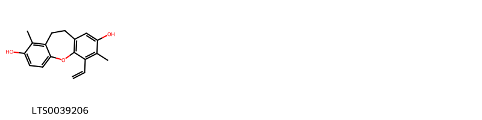
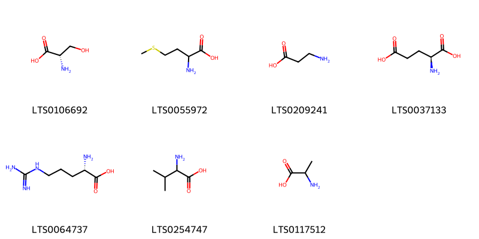
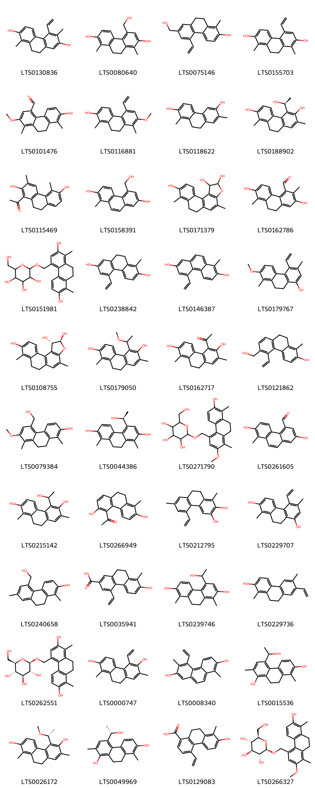

!!! abstract "Tóm tắt"
    2. Đăng Tâm Thảo (Medulla Junci effusi)
-Tên khoa học: Juncus effusus L.
-Họ thực vật: Juncaceae (Họ Bấc)
-Phân bố: Cây bấc đèn phân bố rộng ở nhiều nơi, từ châu Á, châu Âu đến Bắc Mỹ, và được trồng ở các vùng ẩm ướt ở Việt Nam như Nam Định, Hà Nam.
-Mô tả thực vật: Cây bấc đèn là loại cỏ lâu năm, thân tròn, cứng, cao 35-100cm, đường kính thân 1-2mm, vỏ ngoài xanh nhạt. Cây có hoa nhỏ, lưỡng tính, mọc thành vòng.
-Thành phần hóa học: Alkaloid, Flavonoid, Saponin, phenolic acid, Triterpenoid, carbohydrate.
-Tác dụng dược lý:
+Chống viêm
+Lợi tiểu
+Chữa mất ngủ, an thần
+Đau nhức
-Công năng chủ trị: Thanh tâm, hoa, lợi tiểu tiện, trị tâm phiền mất ngủ, lở miệng, tiểu tiện ít, đau.

## Thông tin về thực vật

### Đặc điểm thực vật

Dược liệu **Đăng Tâm Thảo (Ruột Thân)** từ bộ phận **nan** từ loài *Juncus effusus L* thuộc họ Juncaceae. Cây bấc là một loại cỏ sống lâu năm, thân tròn cứng, mọc thành cụm dày cao độ 35- Đăng tâm thảo (Medulla Junci caulis) là ruột 100cm, đường kính của thân chừng 1-2mm, mặt ngoài thân có màu xanh nhạt, có vạch dọc. Ruột (lõi) cây bắc cấu tạo bởi những tế bào hình ngôi sao để hở ra nhiều lỗ khuyết lớn. Lá bị giảm rất nhiều, chỉ còn lại bẹ ở góc thân. Hoa đều, lưỡng tính, mọc thành vòng. Bao hoa khô xác Phân bố, thu hái và chế biến 

!!! info "Phân loại thực vật của *Juncus effusus*"
    - **Kingdom:** Plantae
    - **Phylum:** Tracheophyta
    - **Order:** Poales
    - **Family:** Juncaceae
    - **Genus:** Juncus
    - **Species:** *Juncus effusus*

*Tài liệu tham khảo:* "Những cây thuốc và vị thuốc Việt Nam" - Đỗ Tất Lợi

 

### Loài thay thế (Nếu có)

### Phân bố trên thế giới
**Từ vườn thực vật KEW: **: Bản địa: Afghanistan, Alabama, Alaska, Albania, Algeria, Altay, Arizona, Arkansas, Austria, Azores, Baleares, Baltic States, Belarus, Belgium, Bolivia, British Columbia, Bulgaria, Burundi, California, Cambodia, Canary Is., Central European Russia, China North-Central, China South-Central, China Southeast, Colombia, Connecticut, Corse, Costa Rica, Cyprus, Czechoslovakia, Delaware, Denmark, District of Columbia, East Aegean Is., East European Russia, East Himalaya, Ecuador, El Salvador, Finland, Florida, France, Free State, Føroyar, Georgia, Germany, Great Britain, Greece, Guatemala, Haiti, Honduras, Hungary, Iceland, Idaho, Illinois, India, Indiana, Iowa, Iran, Iraq, Ireland, Italy, Kansas, Kentucky, Kenya, Krasnoyarsk, Kriti, Krym, Leeward Is., Louisiana, Madagascar, Madeira, Maine, Manchuria, Manitoba, Maryland, Massachusetts, Mauritius, Mexican Pacific Is., Mexico Central, Mexico Gulf, Mexico Northeast, Mexico Northwest, Mexico Southeast, Mexico Southwest, Michigan, Minnesota, Mississippi, Missouri, Montana, Morocco, Nebraska, Netherlands, New Brunswick, New Hampshire, New Jersey, New York, Newfoundland, North Carolina, North Caucasus, North European Russia, Northern Provinces, Northwest European Russia, Norway, Nova Scotia, Ohio, Oklahoma, Ontario, Oregon, Palestine, Pennsylvania, Peru, Poland, Portugal, Prince Edward I., Québec, Rhode I., Romania, Rwanda, Sardegna, Sicilia, South Carolina, South European Russia, Spain, Svalbard, Sweden, Switzerland, Taiwan, Tanzania, Tennessee, Texas, Tibet, Transcaucasus, Tunisia, Turkey, Turkey-in-Europe, Uganda, Ukraine, Venezuela, Vermont, Virginia, Washington, West Himalaya, West Siberia, West Virginia, Wisconsin, Yugoslavia, Zaïre, Zimbabwe
Di thực: Amsterdam-St.Paul Is., Cape Provinces, Colorado, Falkland Is., Hawaii, Irkutsk, Marion-Prince Edward Is., New South Wales, New Zealand North, New Zealand South, St.Helena, Tasmania, Tristan da Cunha, Victoria

**Từ CSDL GIBF** Australia, Austria, Spain, Norway, Chile, Germany, Netherlands, Denmark, New Zealand, Luxembourg, Ukraine, Argentina, Sweden, Italy, United Kingdom of Great Britain and Northern Ireland, South Africa, Russian Federation, Switzerland, United States of America, France, Portugal, Canada

### Phân bố tại Việt Nam
** "Những cây thuốc và vị thuốc Việt Nam" - Đỗ Tất Lợi**: Mọc hoang và được trồng ở những nơi ẩm ướt ở nước ta (Nam Định, Hà Nam…).

**Từ CSDL GIBF**: Không có ghi nhận ở Việt Nam

---

## Thông tin về dược liệu 

### Định danh

!!! info "Thông tin về tên gọi của nan"
    - Dược liệu tiếng Việt: nan
    - Dược liệu tiếng Trung: nan (nan)
    - Dược liệu tiếng Anh: nan
    - Dược liệu latin thông dụng: nan
    - Dược liệu latin kiểu DĐVN: medulla junci effusi
    - Dược liệu latin kiểu DĐVN: nan
    - Dược liệu latin kiểu thông tư: nan
    - Bộ phận dùng: nan (nan)

### Mô tả dược liệu 
- **Theo dược điển Việt nam V:** nan

- **Mô tả dược liệu theo thông tư chế biến dược liệu theo phương pháp cổ truyền:** nan

### Chế biến 

- **Chế biến theo dược điển việt nam V**: nan

- **Chế biến theo thông tư:** nan

--- 

## Thành phần hóa học

- Theo tài liệu của GS. Đỗ Tất Lợi:  (1) Alkaloid, Flavonoid, Saponin, phenolic acid,  Triterpenoid, carbohydrate
    
- Theo cơ sở dữ liệu lotus: Từ loài *Juncus effusus* đã phân lập và xác định được 109 hoạt chất thuộc về các nhóm Pyrenes, Phenanthrenes and derivatives, Organooxygen compounds, Carboxylic acids and derivatives, Steroids and steroid derivatives, Prenol lipids, Indoles and derivatives, Benzene and substituted derivatives, Benzoxepines, Cinnamic acids and derivatives, Flavonoids. 

|    | chemicalTaxonomyClassyfireClass     |   smiles_count |
|---:|:------------------------------------|---------------:|
|  0 | Benzene and substituted derivatives |              1 |
|  1 | Benzoxepines                        |              1 |
|  2 | Carboxylic acids and derivatives    |              7 |
|  3 | Cinnamic acids and derivatives      |              9 |
|  4 | Flavonoids                          |              3 |
|  5 | Indoles and derivatives             |              1 |
|  6 | Organooxygen compounds              |             13 |
|  7 | Phenanthrenes and derivatives       |             40 |
|  8 | Prenol lipids                       |              2 |
|  9 | Pyrenes                             |              2 |
| 10 | Steroids and steroid derivatives    |             30 |

### Nhóm Benzene and substituted derivatives
<figure markdown="span">
    { width=100% }
    <figcaption>Hình ảnh cấu trúc hóa học của 1 hoạt chất thuộc nhóm Benzene and substituted derivatives gồm ['vanillic acid (LTS0229113)'].</figcaption>
</figure>
### Nhóm Benzoxepines
<figure markdown="span">
    { width=100% }
    <figcaption>Hình ảnh cấu trúc hóa học của 1 hoạt chất thuộc nhóm Benzoxepines gồm ['15-ethenyl-7,14-dimethyl-2-oxatricyclo[9.4.0.0³,⁸]pentadeca-1(11),3,5,7,12,14-hexaene-6,13-diol (LTS0039206)'].</figcaption>
</figure>
### Nhóm Carboxylic acids and derivatives
<figure markdown="span">
    { width=100% }
    <figcaption>Hình ảnh cấu trúc hóa học của 7 hoạt chất thuộc nhóm Carboxylic acids and derivatives gồm ['l-serine (LTS0106692)', 'methionin (LTS0055972)', 'β alanine (LTS0209241)', 'l-glutamic acid (LTS0037133)', 'l-arginine (LTS0064737)', 'valin (LTS0254747)', 'alanine (LTS0117512)'].</figcaption>
</figure>
### Nhóm Cinnamic acids and derivatives
<figure markdown="span">
    { width=100% }
    <figcaption>Hình ảnh cấu trúc hóa học của 9 hoạt chất thuộc nhóm Cinnamic acids and derivatives gồm ['[(4s)-2,2-dimethyl-1,3-dioxolan-4-yl]methyl (2e)-3-(4-hydroxyphenyl)prop-2-enoate (LTS0137744)', '1,3-dihydroxypropan-2-yl 3-(4-hydroxyphenyl)prop-2-enoate (LTS0071041)', '1,3-dihydroxypropan-2-yl (2e)-3-(4-hydroxyphenyl)prop-2-enoate (LTS0150687)', '(2s)-2,3-dihydroxypropyl (2e)-3-(4-hydroxyphenyl)prop-2-enoate (LTS0063475)', '(2,2-dimethyl-1,3-dioxolan-4-yl)methyl 3-(4-hydroxyphenyl)prop-2-enoate (LTS0219893)', 'para-coumaric acid (LTS0266252)', 'hydroxycinnamic acid (LTS0233023)', '2,3-dihydroxypropyl 3-(4-hydroxyphenyl)prop-2-enoate (LTS0006317)', '2-hydroxy-3-{[(2e)-3-(4-hydroxy-3-methoxyphenyl)prop-2-enoyl]oxy}propyl (2e)-3-(4-hydroxyphenyl)prop-2-enoate (LTS0004029)'].</figcaption>
</figure>
### Nhóm Flavonoids
<figure markdown="span">
    { width=100% }
    <figcaption>Hình ảnh cấu trúc hóa học của 3 hoạt chất thuộc nhóm Flavonoids gồm ['nobiletin (LTS0100173)', '6-demethoxytangeretin (LTS0140420)', 'quercetin (LTS0004651)'].</figcaption>
</figure>
### Nhóm Indoles and derivatives
<figure markdown="span">
    { width=100% }
    <figcaption>Hình ảnh cấu trúc hóa học của 1 hoạt chất thuộc nhóm Indoles and derivatives gồm ['optimax (LTS0014343)'].</figcaption>
</figure>
### Nhóm Organooxygen compounds
<figure markdown="span">
    { width=100% }
    <figcaption>Hình ảnh cấu trúc hóa học của 13 hoạt chất thuộc nhóm Organooxygen compounds gồm ['rutinose (LTS0061610)', 'rutinose (LTS0041313)', '(+)-glucose (LTS0262158)', 'sucrose (LTS0272557)', 'galactose (LTS0171628)', '2-{[7-hydroxy-5-(hydroxymethyl)-1,8-dimethyl-9,10-dihydrophenanthren-2-yl]oxy}-6-(hydroxymethyl)oxane-3,4,5-triol (LTS0243817)', '2-{[7-hydroxy-4-(hydroxymethyl)-1,8-dimethyl-9,10-dihydrophenanthren-2-yl]oxy}-6-(hydroxymethyl)oxane-3,4,5-triol (LTS0072538)', '(2s,3r,4s,5s,6r)-2-{[7-hydroxy-5-(hydroxymethyl)-1,8-dimethyl-9,10-dihydrophenanthren-2-yl]oxy}-6-(hydroxymethyl)oxane-3,4,5-triol (LTS0236271)', '(2r,3s,4s,5r,6r)-2-(hydroxymethyl)-6-[(2-methoxy-1,8-dimethyl-7-{[(2s,3r,4s,5s,6r)-3,4,5-trihydroxy-6-(hydroxymethyl)oxan-2-yl]oxy}-9,10-dihydrophenanthren-4-yl)methoxy]oxane-3,4,5-triol (LTS0228968)', '2-(hydroxymethyl)-6-[(2-methoxy-1,8-dimethyl-7-{[3,4,5-trihydroxy-6-(hydroxymethyl)oxan-2-yl]oxy}-9,10-dihydrophenanthren-4-yl)methoxy]oxane-3,4,5-triol (LTS0194102)', '(2s,3r,4s,5s,6r)-2-{[7-hydroxy-4-(hydroxymethyl)-1,8-dimethyl-9,10-dihydrophenanthren-2-yl]oxy}-6-(hydroxymethyl)oxane-3,4,5-triol (LTS0253384)', 'glucose (LTS0013597)', 'aldehydo-d-galactose (LTS0128031)'].</figcaption>
</figure>
### Nhóm Phenanthrenes and derivatives
<figure markdown="span">
    { width=100% }
    <figcaption>Hình ảnh cấu trúc hóa học của 40 hoạt chất thuộc nhóm Phenanthrenes and derivatives gồm ['juncusol (LTS0130836)', '4-(hydroxymethyl)-1,8-dimethyl-9,10-dihydrophenanthrene-2,7-diol (LTS0080640)', '5-ethenyl-7-(hydroxymethyl)-1-methyl-9,10-dihydrophenanthren-2-ol (LTS0075146)', '4-ethenyl-1,8-dimethyl-9,10-dihydrophenanthrene-2,7-diol (LTS0155703)', '7-hydroxy-2-methoxy-1,8-dimethyl-9,10-dihydrophenanthrene-4-carbaldehyde (LTS0101476)', '5-ethenyl-7-methoxy-1,8-dimethyl-9,10-dihydrophenanthren-2-ol (LTS0116881)', '1,7-dimethyl-9,10-dihydrophenanthrene-2,6-diol (LTS0118622)', '5-[(1s)-1-hydroxyethyl]-1,7-dimethyl-9,10-dihydrophenanthrene-2,6-diol (LTS0188902)', '1-(2,6-dihydroxy-3,5-dimethyl-9,10-dihydrophenanthren-1-yl)ethanone (LTS0115469)', '5-(hydroxymethyl)-1-methylphenanthrene-2,7-diol (LTS0158391)', '4,8-dimethyl-1h,2h,6h,7h-phenanthro[3,4-b]furan-1,2,9-triol (LTS0171379)', '2,7-dihydroxy-3,8-dimethyl-9,10-dihydrophenanthrene-4-carbaldehyde (LTS0162786)', '2-[(2,7-dihydroxy-1,8-dimethyl-9,10-dihydrophenanthren-4-yl)methoxy]-6-(hydroxymethyl)oxane-3,4,5-triol (LTS0151981)', '5-ethenyl-1-methyl-9,10-dihydrophenanthrene-2,7-diol (LTS0238842)', '5-ethenyl-1-methylphenanthrene-2,7-diol (LTS0146387)', '4-ethenyl-7-methoxy-3,8-dimethyl-9,10-dihydrophenanthren-1-ol (LTS0179767)', '(1s,2s)-4,8-dimethyl-1h,2h,6h,7h-phenanthro[3,4-b]furan-1,2,9-triol (LTS0108755)', '5-(1-methoxyethyl)-1,7-dimethyl-9,10-dihydrophenanthrene-2,6-diol (LTS0179050)', '1-(3,7-dihydroxy-2,8-dimethyl-9,10-dihydrophenanthren-4-yl)ethanone (LTS0162717)', '5-ethenyl-6-(hydroxymethyl)-1-methyl-9,10-dihydrophenanthren-2-ol (LTS0121862)', '5-(hydroxymethyl)-7-methoxy-1,8-dimethyl-9,10-dihydrophenanthren-2-ol (LTS0079384)', '4-[(1s)-1-hydroxyethyl]-1,8-dimethyl-9,10-dihydrophenanthrene-2,7-diol (LTS0044386)', '2-[(7-hydroxy-2-methoxy-1,8-dimethyl-9,10-dihydrophenanthren-4-yl)methoxy]-6-(hydroxymethyl)oxane-3,4,5-triol (LTS0271790)', '2,7-dihydroxy-8-methylphenanthrene-4-carbaldehyde (LTS0261605)', '5-(1-hydroxyethyl)-1,7-dimethyl-9,10-dihydrophenanthrene-2,6-diol (LTS0215142)', '1-(3,7-dihydroxy-8-methyl-9,10-dihydrophenanthren-4-yl)ethanone (LTS0266949)', '5-ethenyl-1,7-dimethyl-9,10-dihydrophenanthrene-2,3-diol (LTS0212795)', '4-ethenyl-3,8-dimethyl-9,10-dihydrophenanthrene-1,7-diol (LTS0229707)', '5-(hydroxymethyl)-1,7-dimethyl-9,10-dihydrophenanthren-2-ol (LTS0240658)', '4-ethenyl-7-hydroxy-8-methyl-9,10-dihydrophenanthrene-2-carboxylic acid (LTS0035941)', '4-(1-hydroxyethyl)-1,8-dimethyl-9,10-dihydrophenanthrene-2,7-diol (LTS0239746)', '7-ethenyl-1,6-dimethyl-9,10-dihydrophenanthren-2-ol (LTS0229736)', '(2r,3r,4s,5s,6r)-2-[(2,7-dihydroxy-1,8-dimethyl-9,10-dihydrophenanthren-4-yl)methoxy]-6-(hydroxymethyl)oxane-3,4,5-triol (LTS0262551)', '5-ethenyl-1,7-dimethyl-9,10-dihydrophenanthrene-2,6-diol (LTS0000747)', '5-ethenyl-1,6-dimethylphenanthrene-2,7-diol (LTS0008340)', '4-(1-hydroxyethyl)-2,8-dimethyl-9,10-dihydrophenanthrene-1,7-diol (LTS0015536)', '5-[(1r)-1-methoxyethyl]-1,7-dimethyl-9,10-dihydrophenanthrene-2,6-diol (LTS0026172)', '4-[(1s)-1-hydroxyethyl]-2,8-dimethyl-9,10-dihydrophenanthrene-1,7-diol (LTS0049969)', '4-ethenyl-7-hydroxy-8-methyl-9,10-dihydrophenanthrene-1-carboxylic acid (LTS0129083)', '(2r,3r,4s,5s,6r)-2-[(7-hydroxy-2-methoxy-1,8-dimethyl-9,10-dihydrophenanthren-4-yl)methoxy]-6-(hydroxymethyl)oxane-3,4,5-triol (LTS0266327)'].</figcaption>
</figure>
### Nhóm Prenol lipids
<figure markdown="span">
    { width=100% }
    <figcaption>Hình ảnh cấu trúc hóa học của 2 hoạt chất thuộc nhóm Prenol lipids gồm ['(6r)-6-[(1s)-1-[(1s,3r,6s,8s,11s,12s,15r,16r)-6-{[(2r,3r,4s,5s,6r)-3-{[(2s,3r,4s,5s,6r)-4,5-dihydroxy-6-(hydroxymethyl)-3-{[(2s,3r,4s,5s,6r)-3,4,5-trihydroxy-6-(hydroxymethyl)oxan-2-yl]oxy}oxan-2-yl]oxy}-4,5-dihydroxy-6-(hydroxymethyl)oxan-2-yl]oxy}-7,7,12,16-tetramethylpentacyclo[9.7.0.0¹,³.0³,⁸.0¹²,¹⁶]octadecan-15-yl]ethyl]-3-methyl-5,6-dihydropyran-2-one (LTS0014666)', '6-(1-{6-[(3-{[4,5-dihydroxy-6-(hydroxymethyl)-3-{[3,4,5-trihydroxy-6-(hydroxymethyl)oxan-2-yl]oxy}oxan-2-yl]oxy}-4,5-dihydroxy-6-(hydroxymethyl)oxan-2-yl)oxy]-7,7,12,16-tetramethylpentacyclo[9.7.0.0¹,³.0³,⁸.0¹²,¹⁶]octadecan-15-yl}ethyl)-3-methyl-5,6-dihydropyran-2-one (LTS0208058)'].</figcaption>
</figure>
### Nhóm Pyrenes
<figure markdown="span">
    { width=100% }
    <figcaption>Hình ảnh cấu trúc hóa học của 2 hoạt chất thuộc nhóm Pyrenes gồm ['7-methoxy-6-methylpyren-2-ol (LTS0039796)', '1-methylpyrene-2,7-diol (LTS0007971)'].</figcaption>
</figure>
### Nhóm Steroids and steroid derivatives
<figure markdown="span">
    { width=100% }
    <figcaption>Hình ảnh cấu trúc hóa học của 30 hoạt chất thuộc nhóm Steroids and steroid derivatives gồm ['(1s,3r,6s,8r,11s,12s,15r,16r)-15-[(2r)-4-[(2s)-3,3-dimethyloxiran-2-yl]butan-2-yl]-7,7,12,16-tetramethylpentacyclo[9.7.0.0¹,³.0³,⁸.0¹²,¹⁶]octadecan-6-yl acetate (LTS0064633)', 'stigmast-5-en-3-ol (LTS0071224)', '7,7,12,16-tetramethyl-15-(6-methyl-5-oxoheptan-2-yl)pentacyclo[9.7.0.0¹,³.0³,⁸.0¹²,¹⁶]octadecan-6-yl acetate (LTS0054991)', '15-(5-hydroxy-6-methylheptan-2-yl)-7,7,12,16-tetramethylpentacyclo[9.7.0.0¹,³.0³,⁸.0¹²,¹⁶]octadecan-6-ol (LTS0082374)', '(1s,3r,6s,8r,11s,12s,15r,16r)-15-[(2r,5r)-5-hydroxy-6-methylheptan-2-yl]-7,7,12,16-tetramethylpentacyclo[9.7.0.0¹,³.0³,⁸.0¹²,¹⁶]octadecan-6-ol (LTS0083209)', 'sitosterol (LTS0168132)', '(1s,3r,6s,8r,11s,12s,15r,16r)-7,7,12,16-tetramethyl-15-[(2r)-6-methyl-5-oxohept-6-en-2-yl]pentacyclo[9.7.0.0¹,³.0³,⁸.0¹²,¹⁶]octadecan-6-yl acetate (LTS0130322)', 'stigmast-5-en-3-ol, (3β)- (LTS0204616)', '(1s,3r,6s,8r,11s,12s,15r,16r)-15-[(2r)-4-[(2r)-3,3-dimethyloxiran-2-yl]butan-2-yl]-7,7,12,16-tetramethylpentacyclo[9.7.0.0¹,³.0³,⁸.0¹²,¹⁶]octadecan-6-yl acetate (LTS0122798)', '(3r,6r)-6-[(1s,3r,6s,8r,11s,12s,15r,16r)-6-(acetyloxy)-7,7,12,16-tetramethylpentacyclo[9.7.0.0¹,³.0³,⁸.0¹²,¹⁶]octadecan-15-yl]-2-hydroxy-2-methylheptan-3-yl acetate (LTS0174238)', '[(2r,3s,4s,5r,6r)-3,4,5,6-tetrahydroxyoxan-2-yl]methyl (2e,5s,6s)-6-[(1s,3r,6s,8s,11s,12s,15r,16r)-6-{[(2r,3r,4s,5s,6r)-3-{[(2s,3r,4s,5s,6r)-4,5-dihydroxy-6-(hydroxymethyl)-3-{[(2s,3r,4s,5s,6r)-3,4,5-trihydroxy-6-(hydroxymethyl)oxan-2-yl]oxy}oxan-2-yl]oxy}-4,5-dihydroxy-6-(hydroxymethyl)oxan-2-yl]oxy}-7,7,12,16-tetramethylpentacyclo[9.7.0.0¹,³.0³,⁸.0¹²,¹⁶]octadecan-15-yl]-5-hydroxy-2-methylhept-2-enoate (LTS0144538)', 'sitogluside (LTS0201798)', '3,4,5-trihydroxy-6-(hydroxymethyl)oxan-2-yl 6-{6-[(3-{[4,5-dihydroxy-6-(hydroxymethyl)-3-{[3,4,5-trihydroxy-6-(hydroxymethyl)oxan-2-yl]oxy}oxan-2-yl]oxy}-4,5-dihydroxy-6-(hydroxymethyl)oxan-2-yl)oxy]-7,7,12,16-tetramethylpentacyclo[9.7.0.0¹,³.0³,⁸.0¹²,¹⁶]octadecan-15-yl}-5-hydroxy-2-methylhept-2-enoate (LTS0194792)', 'chondrillasterol (LTS0142259)', '2-{[1-(5-ethyl-6-methylheptan-2-yl)-9a,11a-dimethyl-1h,2h,3h,3ah,3bh,4h,6h,7h,8h,9h,9bh,10h,11h-cyclopenta[a]phenanthren-7-yl]oxy}-6-(hydroxymethyl)oxane-3,4,5-triol (LTS0158828)', '1-(5-ethyl-6-methylhept-3-en-2-yl)-9a,11a-dimethyl-1h,2h,3h,3ah,5h,5ah,6h,7h,8h,9h,9bh,10h,11h-cyclopenta[a]phenanthren-7-ol (LTS0173223)', '7,7,12,16-tetramethyl-15-(6-methyl-5-oxohept-6-en-2-yl)pentacyclo[9.7.0.0¹,³.0³,⁸.0¹²,¹⁶]octadecan-6-yl acetate (LTS0267193)', '4-{[(2s,3r,4s,5s,6r)-3,4,5-trihydroxy-6-(hydroxymethyl)oxan-2-yl]oxy}phenyl (2e,5s,6s)-6-[(1s,3r,6s,8r,11s,12s,15r,16r)-6-{[(2r,3r,4s,5s,6r)-3-{[(2s,3r,4s,5s,6r)-4,5-dihydroxy-6-(hydroxymethyl)-3-{[(2s,3r,4s,5s,6r)-3,4,5-trihydroxy-6-(hydroxymethyl)oxan-2-yl]oxy}oxan-2-yl]oxy}-4,5-dihydroxy-6-(hydroxymethyl)oxan-2-yl]oxy}-7,7,12,16-tetramethylpentacyclo[9.7.0.0¹,³.0³,⁸.0¹²,¹⁶]octadecan-15-yl]-5-hydroxy-2-methylhept-2-enoate (LTS0194512)', '6-[6-(acetyloxy)-7,7,12,16-tetramethylpentacyclo[9.7.0.0¹,³.0³,⁸.0¹²,¹⁶]octadecan-15-yl]-2-hydroxy-2-methylheptan-3-yl acetate (LTS0073059)', '4-{[3,4,5-trihydroxy-6-(hydroxymethyl)oxan-2-yl]oxy}phenyl 6-{6-[(3-{[4,5-dihydroxy-6-(hydroxymethyl)-3-{[3,4,5-trihydroxy-6-(hydroxymethyl)oxan-2-yl]oxy}oxan-2-yl]oxy}-4,5-dihydroxy-6-(hydroxymethyl)oxan-2-yl)oxy]-7,7,12,16-tetramethylpentacyclo[9.7.0.0¹,³.0³,⁸.0¹²,¹⁶]octadecan-15-yl}-5-hydroxy-2-methylhept-2-enoate (LTS0063601)', '(1s,3r,6s,8r,11s,12s,15r,16r)-15-[(2r,5s)-5-hydroxy-6-methylheptan-2-yl]-7,7,12,16-tetramethylpentacyclo[9.7.0.0¹,³.0³,⁸.0¹²,¹⁶]octadecan-6-ol (LTS0021505)', '(1s,2r,4br,7r,8ar,10ar)-7-[(1s)-1,2-dihydroxyethyl]-2-hydroxy-1-(hydroxymethyl)-1,4b,7-trimethyl-2,5,6,8,8a,9,10,10a-octahydrophenanthren-3-one (LTS0165974)', '[(2r,3s,4s,5r,6s)-3,4,5,6-tetrahydroxyoxan-2-yl]methyl (2e,5s,6s)-6-[(1s,3r,6s,8s,11s,12s,15r,16r)-6-{[(2r,3r,4s,5s,6r)-3-{[(2s,3r,4s,5s,6r)-4,5-dihydroxy-6-(hydroxymethyl)-3-{[(2s,3r,4s,5s,6r)-3,4,5-trihydroxy-6-(hydroxymethyl)oxan-2-yl]oxy}oxan-2-yl]oxy}-4,5-dihydroxy-6-(hydroxymethyl)oxan-2-yl]oxy}-7,7,12,16-tetramethylpentacyclo[9.7.0.0¹,³.0³,⁸.0¹²,¹⁶]octadecan-15-yl]-5-hydroxy-2-methylhept-2-enoate (LTS0168084)', '(2s,3r,4s,5s,6r)-3,4,5-trihydroxy-6-(hydroxymethyl)oxan-2-yl (2e,5s,6s)-6-[(1s,3r,6s,8s,11s,12s,15r,16r)-6-{[(2r,3r,4s,5s,6r)-3-{[(2s,3r,4s,5s,6r)-4,5-dihydroxy-6-(hydroxymethyl)-3-{[(2s,3r,4s,5s,6r)-3,4,5-trihydroxy-6-(hydroxymethyl)oxan-2-yl]oxy}oxan-2-yl]oxy}-4,5-dihydroxy-6-(hydroxymethyl)oxan-2-yl]oxy}-7,7,12,16-tetramethylpentacyclo[9.7.0.0¹,³.0³,⁸.0¹²,¹⁶]octadecan-15-yl]-5-hydroxy-2-methylhept-2-enoate (LTS0231433)', '7-(1,2-dihydroxyethyl)-2-hydroxy-1-(hydroxymethyl)-1,4b,7-trimethyl-2,5,6,8,8a,9,10,10a-octahydrophenanthren-3-one (LTS0232397)', '(1s,3r,6s,8r,11s,12s,15r,16r)-7,7,12,16-tetramethyl-15-[(2r)-6-methyl-5-oxoheptan-2-yl]pentacyclo[9.7.0.0¹,³.0³,⁸.0¹²,¹⁶]octadecan-6-yl acetate (LTS0138459)', '(3,4,5,6-tetrahydroxyoxan-2-yl)methyl 6-{6-[(3-{[4,5-dihydroxy-6-(hydroxymethyl)-3-{[3,4,5-trihydroxy-6-(hydroxymethyl)oxan-2-yl]oxy}oxan-2-yl]oxy}-4,5-dihydroxy-6-(hydroxymethyl)oxan-2-yl)oxy]-7,7,12,16-tetramethylpentacyclo[9.7.0.0¹,³.0³,⁸.0¹²,¹⁶]octadecan-15-yl}-5-hydroxy-2-methylhept-2-enoate (LTS0050217)', '(3s,6r)-6-[(1s,3r,6s,8r,11s,12s,15r,16r)-6-(acetyloxy)-7,7,12,16-tetramethylpentacyclo[9.7.0.0¹,³.0³,⁸.0¹²,¹⁶]octadecan-15-yl]-2-hydroxy-2-methylheptan-3-yl acetate (LTS0029933)', '15-[4-(3,3-dimethyloxiran-2-yl)butan-2-yl]-7,7,12,16-tetramethylpentacyclo[9.7.0.0¹,³.0³,⁸.0¹²,¹⁶]octadecan-6-yl acetate (LTS0133483)', '(2s,3r,4s,5s,6r)-3,4,5-trihydroxy-6-(hydroxymethyl)oxan-2-yl (2e,5s,6s)-6-[(6s,15r)-6-{[(2r,3r,5s,6r)-3-{[(2s,3r,4s,5s,6r)-4,5-dihydroxy-6-(hydroxymethyl)-3-{[(5s)-3,4,5-trihydroxy-6-(hydroxymethyl)oxan-2-yl]oxy}oxan-2-yl]oxy}-4,5-dihydroxy-6-(hydroxymethyl)oxan-2-yl]oxy}-7,7,12,16-tetramethylpentacyclo[9.7.0.0¹,³.0³,⁸.0¹²,¹⁶]octadecan-15-yl]-5-hydroxy-2-methylhept-2-enoate (LTS0257223)'].</figcaption>
</figure>

---

## Tác dụng dược lý

Theo tài liệu "Những cây thuốc và vị thuốc Việt Nam" - Đỗ Tất Lợi:- Chống viêm
- Lợi tiểu
- Chữa mất ngủ
- An thần
- Đau nhức

Theo tài liệu quốc tế: nan

---

## Dược điển Việt Nam V

### Soi bột:
nan
<!-- Hình ảnh soi bột sẽ được tự động chèn vào đây sau -->
### Vi phẫu:
nan
<!-- Hình ảnh vi phẫu sẽ được tự động chèn vào đây sau -->
### Định tính

nan

### Định lượng

nan

### Thông tin khác 
- ** Độ ẩm: ** nan

- ** Bảo quản:** nan
## Dược điển Hồng kong

<!-- PDF sẽ được tự động chèn vào đây sau -->

---

## Y dược học cổ truyền

- **Tên vị thuốc:** nan
- **Tính vị quy kinh:** Cam, đạm. vi hàn. Vào kinh tâm. phế, tiểu trường.
- **Công năng chủ trị:** Thanh tâm hoa, lợi tiểu tiện.
Chủ trị: Tâm phiền mất ngủ, lở miệng, lưỡi, tiểu tiện ít, đau
- **Chú ý:** nan
- **Kiêng kỵ:** nan

