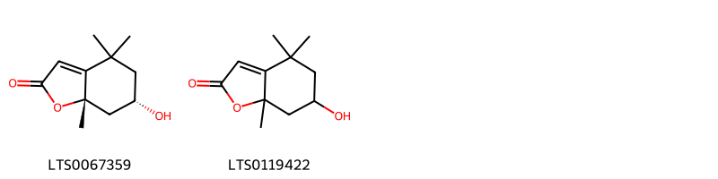
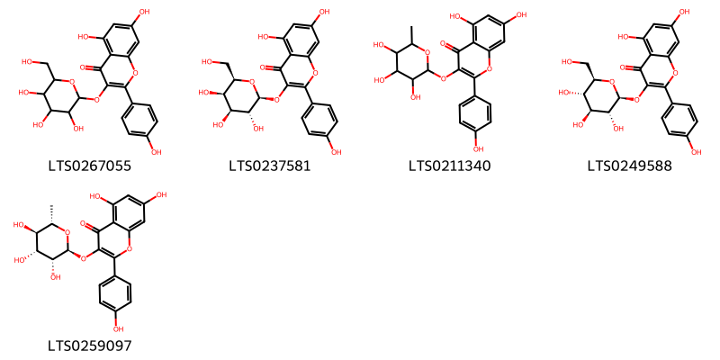
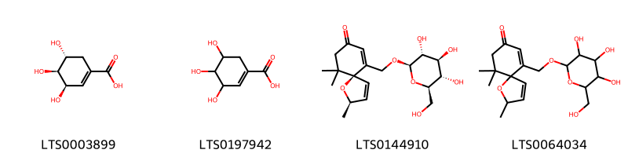

!!! abstract "Tóm tắt"
    Cây Đơn Lá Đỏ (Excoecaria cochinchinensis Lour., họ Euphorbiaceae) là một loài cây nhỏ, cao từ 0,7 - 1,5m, có cành nhỏ, gầy và dài, màu tía. Lá cây mọc đối, hình trái xoan thuôn dài, có chiều dài từ 6 - 12cm và rộng từ 1,2 - 4cm. Mặt trên lá có màu xanh lục sẫm, trong khi mặt dưới có màu tía đỏ, mép lá có răng cưa. Hoa mọc thành bông ở kẽ lá hoặc đầu cành, với hoa đực dài khoảng 2cm và hoa cái ngắn hơn. Quả của cây có 3 mảnh, đường kính khoảng 1cm, hạt hình cầu, màu nâu nhạt, đường kính 4mm.

Cây phân bố tự nhiên ở nhiều khu vực Đông Nam Á như Trung Quốc, Lào, Malaysia, Myanmar, Đài Loan, Thái Lan và Việt Nam. Tại Việt Nam, cây mọc hoang và được trồng ở nhiều nơi để làm cảnh, lấy lá và cành non làm thuốc.

Trong y học cổ truyền, dược liệu này có tác dụng thanh nhiệt giải độc, khu phong trừ thấp, lợi tiêu và giảm đau. Cây thường được sử dụng để chữa mụn nhọt, mẩn ngứa, ban chẩn mày đay, đi ỉa lỏng lâu ngày và đại tiện ra máu.

Thành phần hóa học của cây bao gồm flavonoid (như quercetin, kaempferol), terpenoid và tannin, những hợp chất này đóng góp vào tác dụng dược lý của cây trong việc điều trị các bệnh về da, tiêu hóa và giảm đau. Dược liệu có vị đắng nhạt và tính mát, phù hợp để sử dụng trong các trường hợp nhiệt độc, phong thấp, và các rối loạn tiêu hóa.

## Thông tin về thực vật

### Đặc điểm thực vật

Dược liệu **Đơn Lá Đỏ** từ bộ phận **** từ loài *Excoecaria cochinchinensis Lour.* thuộc họ Euphorbiaceae. Là một loại cây nhỏ, cao 0,7 - 1,5m, có cành nhỏ, gầy, dài, màu tía. Lá mọc đối hình trái xoan thuôn dài, phía cuống nhọn, phía đầu có mũi nhọn, ngắn, dài 6 - 12cm, rộng 1,2 - 4cm. Mặt trên lá màu xanh lục sẫm, mặt dưới lá màu tía đỏ, mép có răng cưa, cuống ngắn, 5 - 10mm. Hoa mọc thành bông ở kẽ lá hay đầu cành. Bông hoa đực dài 2cm, bông hoa cái ngắn hơn. Quả 3 mảnh, đường kính chừng 1cm, hạt hình cầu, màu nâu nhạt, đường kính 4mm. Mùa hoa vào các tháng 4 - 5 - 6. 

!!! info "Phân loại thực vật của *Excoecaria cochinchinensis*"
    - **Kingdom:** Plantae
    - **Phylum:** Tracheophyta
    - **Order:** Malpighiales
    - **Family:** Euphorbiaceae
    - **Genus:** Excoecaria
    - **Species:** *Excoecaria cochinchinensis*

*Tài liệu tham khảo:* "Những cây thuốc và vị thuốc Việt Nam" - Đỗ Tất Lợi

 

### Loài thay thế (Nếu có)

### Phân bố trên thế giới
**Từ vườn thực vật KEW: **: Native to:
China Southeast, Hainan, Laos, Malaya, Myanmar, Taiwan, Thailand, Vietnam

Introduced into:
China South-Central, Trinidad-Tobago

**Từ CSDL GIBF** nan, Myanmar, Puerto Rico, Cambodia, unknown or invalid, Malaysia, Thailand, Singapore, New Zealand, Korea, Republic of, Indonesia, Hong Kong, India, Lao People’s Democratic Republic, Seychelles, French Polynesia, China, Macao, Philippines, Trinidad and Tobago, Viet Nam, United States of America, Chinese Taipei

### Phân bố tại Việt Nam
** "Những cây thuốc và vị thuốc Việt Nam" - Đỗ Tất Lợi**: Cây mọc hoang và được trồng ở nhiều nơi để làm cảnh lấy lá, cành non làm thuốc.

**Từ CSDL GIBF**: Hoa Binh, Dak Lak, Ha Giang, Quảng Bình, Khánh Hòa, Kon Tum, Ninh Thuan

---

## Thông tin về dược liệu 

### Định danh

!!! info "Thông tin về tên gọi của "
    - Dược liệu tiếng Việt: 
    - Dược liệu tiếng Trung:  ()
    - Dược liệu tiếng Anh: 
    - Dược liệu latin thông dụng: Folium Excoecariae
    - Dược liệu latin kiểu DĐVN: folium excoecariae
    - Dược liệu latin kiểu DĐVN: 
    - Dược liệu latin kiểu thông tư: 
    - Bộ phận dùng:  (Folium)

### Mô tả dược liệu 
- **Theo dược điển Việt nam V:** Lá hình bầu dục hai đầu thuôn nhọn, dài 6 cm đến 12 cm, rộng 2 cm đến 4 cm. Cuống lá dài 0,5 cm đến 1 cm. Phiến lá nguyên, mép lá có răng cưa nhỏ, mặt trên lá màu lục sẫm, mặt dưới màu đỏ tía. Có 10 đến 12 cặp gân lông chim nổi rõ ở mặt dưới lá, lõm ở mặt trên lá.

- **Mô tả dược liệu theo thông tư chế biến dược liệu theo phương pháp cổ truyền:** 

### Chế biến 

- **Chế biến theo dược điển việt nam V**: Thu hái lá quanh năm, nhưng tốt nhất vào mùa hè. Lá hái về được phơi hoặc sấy tới khô. Trứơc khi dùng sao vàng. nn

- **Chế biến theo thông tư:** 

--- 

## Thành phần hóa học

- Theo tài liệu của GS. Đỗ Tất Lợi:  1. Flavonoid: quercetin, kaempferol...
2. Terpenoid 
3. Tanin
    
- Theo cơ sở dữ liệu lotus: Từ loài *Excoecaria cochinchinensis* đã phân lập và xác định được 25 hoạt chất thuộc về các nhóm Benzofurans, Organooxygen compounds, Prenol lipids, Benzene and substituted derivatives, Flavonoids. 

|    | chemicalTaxonomyClassyfireClass     |   smiles_count |
|---:|:------------------------------------|---------------:|
|  0 | Benzene and substituted derivatives |              2 |
|  1 | Benzofurans                         |              2 |
|  2 | Flavonoids                          |              5 |
|  3 | Organooxygen compounds              |              4 |
|  4 | Prenol lipids                       |             12 |

### Nhóm Benzene and substituted derivatives
<figure markdown="span">
    { width=100% }
    <figcaption>Hình ảnh cấu trúc hóa học của 2 hoạt chất thuộc nhóm Benzene and substituted derivatives gồm ['p-hydroxybenzoic acid (LTS0263634)', 'galop (LTS0222857)'].</figcaption>
</figure>
### Nhóm Benzofurans
<figure markdown="span">
    { width=100% }
    <figcaption>Hình ảnh cấu trúc hóa học của 2 hoạt chất thuộc nhóm Benzofurans gồm ['(6s,7as)-6-hydroxy-4,4,7a-trimethyl-6,7-dihydro-5h-1-benzofuran-2-one (LTS0067359)', 'loliolide (LTS0119422)'].</figcaption>
</figure>
### Nhóm Flavonoids
<figure markdown="span">
    { width=100% }
    <figcaption>Hình ảnh cấu trúc hóa học của 5 hoạt chất thuộc nhóm Flavonoids gồm ['trifolin (LTS0267055)', 'trifolin (LTS0237581)', '5,7-dihydroxy-2-(4-hydroxyphenyl)-3-[(3,4,5-trihydroxy-6-methyloxan-2-yl)oxy]chromen-4-one (LTS0211340)', 'astragalin (LTS0249588)', 'afzelin (LTS0259097)'].</figcaption>
</figure>
### Nhóm Organooxygen compounds
<figure markdown="span">
    { width=100% }
    <figcaption>Hình ảnh cấu trúc hóa học của 4 hoạt chất thuộc nhóm Organooxygen compounds gồm ['(-)-shikimate (LTS0003899)', 'shikimate (LTS0197942)', '(2r,5s)-2,10,10-trimethyl-6-({[(2r,3r,4s,5s,6r)-3,4,5-trihydroxy-6-(hydroxymethyl)oxan-2-yl]oxy}methyl)-1-oxaspiro[4.5]deca-3,6-dien-8-one (LTS0144910)', '2,10,10-trimethyl-6-({[3,4,5-trihydroxy-6-(hydroxymethyl)oxan-2-yl]oxy}methyl)-1-oxaspiro[4.5]deca-3,6-dien-8-one (LTS0064034)'].</figcaption>
</figure>
### Nhóm Prenol lipids
<figure markdown="span">
    { width=100% }
    <figcaption>Hình ảnh cấu trúc hóa học của 12 hoạt chất thuộc nhóm Prenol lipids gồm ['terpenoid ea-i (LTS0088665)', 'isoforskolin (LTS0048268)', '4-(3-hydroxybutyl)-3,5-dimethyl-5-({[3,4,5-trihydroxy-6-(hydroxymethyl)oxan-2-yl]oxy}methyl)cyclohex-2-en-1-one (LTS0206217)', '(1r,2r,6s,7s,8r,16r,18r)-6,7-dihydroxy-8-(hydroxymethyl)-4,18-dimethyl-14-[(1e,3e)-nona-1,3-dien-1-yl]-16-(prop-1-en-2-yl)-9,13,15,19-tetraoxahexacyclo[12.4.1.0¹,¹¹.0²,⁶.0⁸,¹⁰.0¹²,¹⁶]nonadec-3-en-5-one (LTS0240266)', '9-(acetyloxy)-3-ethenyl-6,10b-dihydroxy-3,4a,7,7,10a-pentamethyl-1-oxo-hexahydro-2h-naphtho[2,1-b]pyran-8-yl acetate (LTS0160433)', '(4s,5r)-4-[(3s)-3-hydroxybutyl]-3,5-dimethyl-5-({[(2r,3r,4s,5s,6r)-3,4,5-trihydroxy-6-(hydroxymethyl)oxan-2-yl]oxy}methyl)cyclohex-2-en-1-one (LTS0066688)', '3-ethenyl-5,10,10b-trihydroxy-3,4a,7,7,10a-pentamethyl-1-oxo-hexahydro-2h-naphtho[2,1-b]pyran-6-yl acetate (LTS0257232)', '(3r,4ar,6s,6as,8r,9s,10as,10bs)-8-(acetyloxy)-3-ethenyl-6,10b-dihydroxy-3,4a,7,7,10a-pentamethyl-1-oxo-hexahydro-2h-naphtho[2,1-b]pyran-9-yl acetate (LTS0253445)', '(3r,4ar,5s,6s,6as,10s,10ar,10bs)-10-(acetyloxy)-3-ethenyl-5,10b-dihydroxy-3,4a,7,7,10a-pentamethyl-1-oxo-hexahydro-2h-naphtho[2,1-b]pyran-6-yl acetate (LTS0255840)', '4-(3-hydroxybutyl)-5,5-dimethyl-3-({[3,4,5-trihydroxy-6-(hydroxymethyl)oxan-2-yl]oxy}methyl)cyclohex-2-en-1-one (LTS0122119)', '10-(acetyloxy)-3-ethenyl-5,10b-dihydroxy-3,4a,7,7,10a-pentamethyl-1-oxo-hexahydro-2h-naphtho[2,1-b]pyran-6-yl acetate (LTS0000454)', '(4r)-4-[(3s)-3-hydroxybutyl]-5,5-dimethyl-3-({[(2r,3r,4s,5s,6r)-3,4,5-trihydroxy-6-(hydroxymethyl)oxan-2-yl]oxy}methyl)cyclohex-2-en-1-one (LTS0026097)'].</figcaption>
</figure>

---

## Tác dụng dược lý

Theo tài liệu "Những cây thuốc và vị thuốc Việt Nam" - Đỗ Tất Lợi:Thường dùng trong trường hợp chữa mụn nhọt, mẩn ngứa, có khi dùng chữa đi ỉa lỏng lâu ngày.

Theo tài liệu quốc tế: 

---

## Dược điển Việt Nam V

### Soi bột:
Bột lá có màu xanh nâu, mùi hắc nhẹ. Quan sát dưới kính hiển vi thấy: Mảnh mô mềm, mạch mạng, mạch xoắn đứng riêng lẻ hay trong các mô, bó sợi, mảnh mô mềm, tinh thể calci ọxalat hình cầu gai. mảnh biểu bì có nhiều tế bào lỗ khí kiểu song bào. nn
<!-- Hình ảnh soi bột sẽ được tự động chèn vào đây sau -->
### Vi phẫu:
Phần gân lá: Biểu bì trên và biểu bì dưới gồm một lớp tế bào nhỏ xếp liên tục, kích thước tương đối đều nhau. Nằm sát biểu bì trên và biểu bì dưới là mô dày gồm những đám tế bào hình trứng, kích thước khác nhau, thành dày bắt màu đỏ. Tiếp theo là mô mềm, gồm những tế bào có kích thước lớn, không đều nhau, thành mỏng, xếp lộn xộn. Giữa gân lá có bó libe-gỗ, hình cung, cung libe ở ngoài ôm lấy cung gỗ ở trong. Phiến lá: Biểu bì trên và biểu bì dưới gồm một hàng tế bào hình chữ nhật nằm ngang, có thành ngoài hóa cutin. Dưới biểu bì trên là mô dậu gồm một hàng tế bào hình chữ nhật. nn
<!-- Hình ảnh vi phẫu sẽ được tự động chèn vào đây sau -->
### Định tính

Cân 1 g bột dược liệu cho vào ống nghiệm, thêm 5 ml ethanol 50 % (TT), đun trong cách thủy trong 5 min, lọc. Dịch lọc có màu đỏ tía. Cân 5 g dược liệu đã được làm nhỏ cho vào bình Soxhlct rôi chiết với ether dầu hỏa (30 °c đến 60 °C) (TT) đến khi hết màu. Bã dược liệu được để bay hơi hết dung môi, cho vào bình cầu dung tích 100 ml, thêm 50 ml ethanol 90 % (TT), lắp sinh hàn hồi lưu, đun trong cách thủy sôi trong 30 min. lọc. Cô dịch lọc trong cách thủy đến còn khoảng 3 ml, lấy 1 ml dịch lọc ethanol vào ống nghiệm, thêm một ít bột magnesi (TT) và vài giọt acid hydrocloric (TT), đun nóng nhẹ trên cách thủy, phải xuất hiện màu hồng đỏ.

### Định lượng

### Thông tin khác 
- ** Độ ẩm: ** Không quả 13,0 % (Phụ lục 9.6, 1 g, 85 °c, 4 h).

- ** Bảo quản:** Trong bao bì kín, để nơi thoáng mát.nn
## Dược điển Hồng kong

<!-- PDF sẽ được tự động chèn vào đây sau -->

---

## Y dược học cổ truyền

- **Tên vị thuốc:** 
- **Tính vị quy kinh:** Vị đắng nhạt, tính mát.
- **Công năng chủ trị:** Thanh nhiệt giải độc, khu phong trừ thấp, lợi tiêu, giảm đau.

Chủ trị: Mụn nhọt, mẩn ngứa, ban chấn mày đay, đi ỉa lỏng lâu ngày, đại tiện ra máu.
- **Chú ý:** 
- **Kiêng kỵ:** Người hay chảy máu không nên dùng.nn

