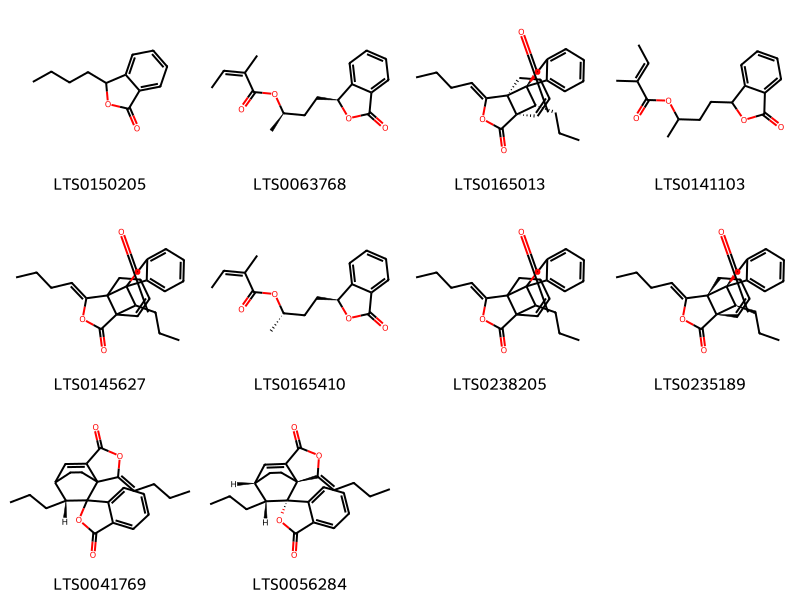
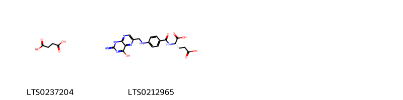
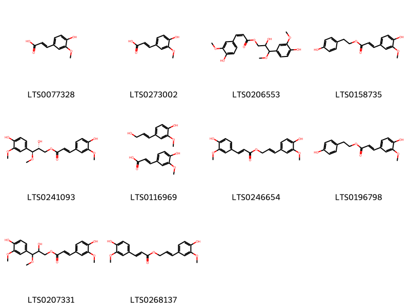
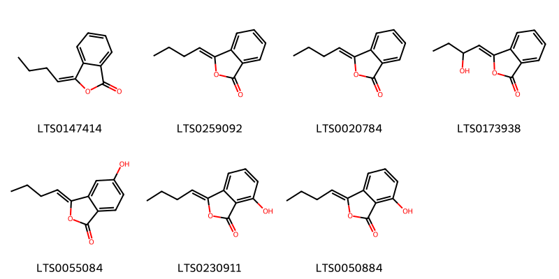
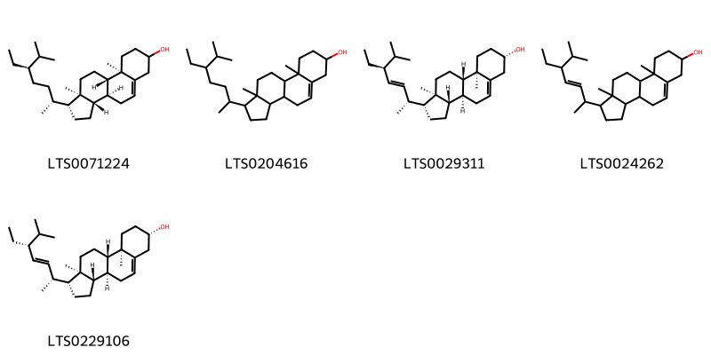
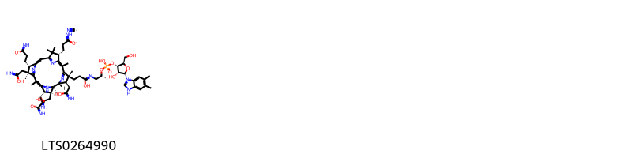

!!! abstract "Tóm tắt"
    Đương quy có tên khoa học là Angelica sinensis (Oliv.) Diels. Thuộc họ Hoa tán (Apiaceae).  Trên thế giới, cây được phân bố ở Trung Quốc, nội Mông Cổ. Tại Việt Nam, cây được trồng ở Sapa và các vùng đồng bằng ven Hà Nội.  Trong đông y, người ta sử dụng đương quy để chữa thiếu máu, cơ thể suy nhược, kinh nguyệt không đều, đau ở rốn, đẻ xong máu chảy mãi không ngừng. Đương quy được chứng minh có tác dụng dược lý trên tử cung và các cơ trơn; trên hiện tượng thiếu vitamin E; trên huyết áp và hô hấp; trên cơ tim và có tác dụng kháng sinh. Một số thành phần hóa học đã được phát hiện và xác định cấu trúc như: Các hợp chất thuộc nhóm Coumarins; các dẫn chất Phthalide ((z)-ligustilide; các hợp chất Phenolic (Ferulic acid); một số acid amin; một số vitamin (vitamin A, E),…

## Thông tin về thực vật

### Đặc điểm thực vật

Dược liệu **Đương Quy (Rễ)** từ bộ phận **nan** từ loài *Angelica sinensis (Oliv.) Diels.* thuộc họ Apiaceae. Đương quy là một loại cây nhỏ, sống lâu năm, cao chừng 40-80cm, thân màu tím có rãnh dọc. 
Lá mọc so le, 2-3 lần xẻ lông chim, cuống dài 3-12cm, 3 đôi lá chét; đôi lá chét phía dưới có cuống dài, đôi lá chét phía trên đỉnh không có cuống; lá chét lại xẻ 1-2 lần nữa, mép có răng cưa, phía dưới cuống phát triển dài gần 1/2 cuống, ôm lấy thân. 
Hoa rất nhỏ màu xanh trắng họp thành cụm hoa hình tán kép gồm 12-40 hoa. 
Quả bế có rìa màu tím nhạt. Ra hoa vào tháng 7-8 

!!! info "Phân loại thực vật của *Angelica sinensis*"
    - **Kingdom:** Plantae
    - **Phylum:** Tracheophyta
    - **Order:** Apiales
    - **Family:** Apiaceae
    - **Genus:** Angelica
    - **Species:** *Angelica sinensis*

*Tài liệu tham khảo:* "Những cây thuốc và vị thuốc Việt Nam" - Đỗ Tất Lợi

 

### Loài thay thế (Nếu có)

### Phân bố trên thế giới
**Từ vườn thực vật KEW: **: Bản địa: China North-Central, China South-Central, Inner Mongolia
Di thực: Vietnam

**Từ CSDL GIBF** Viet Nam, China, Norway, United States of America, Japan

### Phân bố tại Việt Nam
** "Những cây thuốc và vị thuốc Việt Nam" - Đỗ Tất Lợi**: Sapa, vùng đồng bằng quanh Hà Nội

**Từ CSDL GIBF**: Không có ghi nhận ở Việt Nam

---

## Thông tin về dược liệu 

### Định danh

!!! info "Thông tin về tên gọi của nan"
    - Dược liệu tiếng Việt: nan
    - Dược liệu tiếng Trung: nan (nan)
    - Dược liệu tiếng Anh: nan
    - Dược liệu latin thông dụng: nan
    - Dược liệu latin kiểu DĐVN: radix angelicae sinensis
    - Dược liệu latin kiểu DĐVN: nan
    - Dược liệu latin kiểu thông tư: nan
    - Bộ phận dùng: nan (nan)

### Mô tả dược liệu 
- **Theo dược điển Việt nam V:** nan

- **Mô tả dược liệu theo thông tư chế biến dược liệu theo phương pháp cổ truyền:** nan

### Chế biến 

- **Chế biến theo dược điển việt nam V**: nan

- **Chế biến theo thông tư:** nan

--- 

## Thành phần hóa học

- Theo tài liệu của GS. Đỗ Tất Lợi:  (1)
Coumarins: Imperatorin; Glaucalactone
Steroids: Stigmast-5-en-3-ol; Phytosterol; Poriferasterol
Các hợp chất phenolic: Ferulic acid; Vanillin; Carvacrol
Các dẫn chất phtalid: (z)-ligustilide; Butylidenephthalide; Butylphthalide; Senkyunolide; Phthalic acid; Sedanolide; Levistolide a; Riligustilide; 
Acid hữu cơ khác: Palmitic acid; Chlorogenic acid; Angelic acid; malic acid; Succinic acid; Myristic acid; Vanillic acid
Polyacetylen: Falcarindiol
Carbohydrates: Sucrose; Granulated sugar
Alkaloids: N-[2-(5-methoxy-1h-indol-3-yl)ethyl]ethanimidic acid; 
N-butyl-benzenesulfonamide; Leucon; 
Các vitamin: Vitamin A, E
Các hợp chất khác: Brefeldin a; Myristyl alcohol;….

(2)
Dược điển Việt Nam: acid ferulic
Dược điển Hongkong: Z-ligustilide; ferulic acid
    
- Theo cơ sở dữ liệu lotus: Từ loài *Angelica sinensis* đã phân lập và xác định được 110 hoạt chất thuộc về các nhóm Imidazopyrimidines, Coumarins and derivatives, Benzene and substituted derivatives, Indoles and derivatives, Isocoumarans, Dihydrofurans, Steroids and steroid derivatives, Phenols, Benzodioxoles, Cinnamic acids and derivatives, Pyrenes, Pyridines and derivatives, Organooxygen compounds, Tetrapyrroles and derivatives, Fatty Acyls, Prenol lipids, Macrolides and analogues, Hydroxy acids and derivatives, Benzofurans, Isobenzofurans, Carboxylic acids and derivatives, Diazines. 

|    | chemicalTaxonomyClassyfireClass     |   smiles_count |
|---:|:------------------------------------|---------------:|
|  0 | Benzene and substituted derivatives |              4 |
|  1 | Benzodioxoles                       |              2 |
|  2 | Benzofurans                         |             10 |
|  3 | Carboxylic acids and derivatives    |              2 |
|  4 | Cinnamic acids and derivatives      |             10 |
|  5 | Coumarins and derivatives           |              3 |
|  6 | Diazines                            |              1 |
|  7 | Dihydrofurans                       |              1 |
|  8 | Fatty Acyls                         |             23 |
|  9 | Hydroxy acids and derivatives       |              1 |
| 10 | Imidazopyrimidines                  |              1 |
| 11 | Indoles and derivatives             |              1 |
| 12 | Isobenzofurans                      |             22 |
| 13 | Isocoumarans                        |              7 |
| 14 | Macrolides and analogues            |              2 |
| 15 | Organooxygen compounds              |              4 |
| 16 | Phenols                             |              1 |
| 17 | Prenol lipids                       |              7 |
| 18 | Pyrenes                             |              1 |
| 19 | Pyridines and derivatives           |              1 |
| 20 | Steroids and steroid derivatives    |              5 |
| 21 | Tetrapyrroles and derivatives       |              1 |

### Nhóm Benzene and substituted derivatives
<figure markdown="span">
    { width=100% }
    <figcaption>Hình ảnh cấu trúc hóa học của 4 hoạt chất thuộc nhóm Benzene and substituted derivatives gồm ['phthalic acid (LTS0167476)', 'n-butyl-benzenesulfonamide (LTS0022065)', '2-butylbenzenesulfonamide (LTS0055526)', 'vanillic acid (LTS0229113)'].</figcaption>
</figure>
### Nhóm Benzodioxoles
<figure markdown="span">
    { width=100% }
    <figcaption>Hình ảnh cấu trúc hóa học của 2 hoạt chất thuộc nhóm Benzodioxoles gồm ['isosafrole (LTS0096972)', 'sassafras (LTS0136093)'].</figcaption>
</figure>
### Nhóm Benzofurans
<figure markdown="span">
    { width=100% }
    <figcaption>Hình ảnh cấu trúc hóa học của 10 hoạt chất thuộc nhóm Benzofurans gồm ['butylphthalide (LTS0150205)', '(2r)-4-[(1s)-3-oxo-1h-2-benzofuran-1-yl]butan-2-yl (2z)-2-methylbut-2-enoate (LTS0063768)', "(1r,1's,6'r,9'z,11'r)-9'-butylidene-11'-propyl-8'-oxaspiro[2-benzofuran-1,10'-tricyclo[4.3.2.0¹,⁶]undecan]-4'-ene-3,7'-dione (LTS0165013)", '4-(3-oxo-1h-2-benzofuran-1-yl)butan-2-yl 2-methylbut-2-enoate (LTS0141103)', "(9'z)-9'-butylidene-11'-propyl-8'-oxaspiro[2-benzofuran-1,10'-tricyclo[4.3.2.0¹,⁶]undecan]-4'-ene-3,7'-dione (LTS0145627)", '(2s)-4-[(1s)-3-oxo-1h-2-benzofuran-1-yl]butan-2-yl (2z)-2-methylbut-2-enoate (LTS0165410)', "9'-butylidene-11'-propyl-8'-oxaspiro[2-benzofuran-1,10'-tricyclo[4.3.2.0¹,⁶]undecan]-4'-ene-3,7'-dione (LTS0238205)", "(1r,1'r,6's,9'z,11's)-9'-butylidene-11'-propyl-8'-oxaspiro[2-benzofuran-1,10'-tricyclo[4.3.2.0¹,⁶]undecan]-4'-ene-3,7'-dione (LTS0235189)", "(2'z,8'r)-2'-butylidene-8'-propyl-3'-oxaspiro[2-benzofuran-1,9'-tricyclo[5.2.2.0¹,⁵]undecan]-5'-ene-3,4'-dione (LTS0041769)", "(1s,1'r,2'z,7's,8'r)-2'-butylidene-8'-propyl-3'-oxaspiro[2-benzofuran-1,9'-tricyclo[5.2.2.0¹,⁵]undecan]-5'-ene-3,4'-dione (LTS0056284)"].</figcaption>
</figure>
### Nhóm Carboxylic acids and derivatives
<figure markdown="span">
    { width=100% }
    <figcaption>Hình ảnh cấu trúc hóa học của 2 hoạt chất thuộc nhóm Carboxylic acids and derivatives gồm ['succinic acid (LTS0237204)', 'acid, folic (LTS0212965)'].</figcaption>
</figure>
### Nhóm Cinnamic acids and derivatives
<figure markdown="span">
    { width=100% }
    <figcaption>Hình ảnh cấu trúc hóa học của 10 hoạt chất thuộc nhóm Cinnamic acids and derivatives gồm ['ferulic acid (LTS0077328)', 'ferulic acid (LTS0273002)', '2-hydroxy-3-(4-hydroxy-3-methoxyphenyl)-3-methoxypropyl (2z)-3-(4-hydroxy-3-methoxyphenyl)prop-2-enoate (LTS0206553)', '2-(4-hydroxyphenyl)ethyl (2e)-3-(4-hydroxy-3-methoxyphenyl)prop-2-enoate (LTS0158735)', '(2r,3s)-2-hydroxy-3-(4-hydroxy-3-methoxyphenyl)-3-methoxypropyl (2e)-3-(4-hydroxy-3-methoxyphenyl)prop-2-enoate (LTS0241093)', 'coniferyl alcohol; ferulic acid (LTS0116969)', '3-(4-hydroxy-3-methoxyphenyl)prop-2-en-1-yl 3-(4-hydroxy-3-methoxyphenyl)prop-2-enoate (LTS0246654)', '2-(4-hydroxyphenyl)ethyl 3-(4-hydroxy-3-methoxyphenyl)prop-2-enoate (LTS0196798)', '2-hydroxy-3-(4-hydroxy-3-methoxyphenyl)-3-methoxypropyl 3-(4-hydroxy-3-methoxyphenyl)prop-2-enoate (LTS0207331)', 'coniferyl ferulate (LTS0268137)'].</figcaption>
</figure>
### Nhóm Coumarins and derivatives
<figure markdown="span">
    { width=100% }
    <figcaption>Hình ảnh cấu trúc hóa học của 3 hoạt chất thuộc nhóm Coumarins and derivatives gồm ['imperatorin (LTS0113114)', 'glaucalactone (LTS0144469)', '2,3-dihydroxy-1-(7-methoxy-2-oxochromen-6-yl)-3-methylbutyl (2z)-2-methylbut-2-enoate (LTS0081939)'].</figcaption>
</figure>
### Nhóm Diazines
<figure markdown="span">
    { width=100% }
    <figcaption>Hình ảnh cấu trúc hóa học của 1 hoạt chất thuộc nhóm Diazines gồm ['pirod (LTS0008205)'].</figcaption>
</figure>
### Nhóm Dihydrofurans
<figure markdown="span">
    { width=100% }
    <figcaption>Hình ảnh cấu trúc hóa học của 1 hoạt chất thuộc nhóm Dihydrofurans gồm ['levistolide a (LTS0267994)'].</figcaption>
</figure>
### Nhóm Fatty Acyls
<figure markdown="span">
    { width=100% }
    <figcaption>Hình ảnh cấu trúc hóa học của 23 hoạt chất thuộc nhóm Fatty Acyls gồm ['falcarindiol (LTS0127360)', '(3s,8r)-heptadeca-1,9-dien-4,6-diyne-3,8-diol (LTS0083933)', 'heptadeca-1,9-dien-4,6-diyne-3,8-diol (LTS0241354)', 'palmitic acid (LTS0079439)', '(9z,11s,16r)-11,16-dihydroxyoctadeca-9,17-dien-12,14-diyn-1-yl acetate (LTS0173109)', '11,16-dihydroxyoctadeca-9,17-dien-12,14-diyn-1-yl acetate (LTS0235938)', 'myristyl alcohol (LTS0226953)', 'angelic acid (LTS0220842)', '1,3-dilinolenoylglycerol (LTS0136567)', '8-hydroxy-1-methoxyheptadec-9-en-4,6-diyn-3-one (LTS0046394)', '1-(3-heptyloxiran-2-yl)oct-7-en-2,4-diyne-1,6-diol (LTS0183788)', '(3r,8s,9z)-heptadec-9-en-4,6-diyne-3,8-diol (LTS0202278)', '(3s,8s)-heptadeca-1,9-dien-4,6-diyne-3,8-diol (LTS0144952)', '(3s,8s)-heptadec-9-en-4,6-diyne-3,8-diol (LTS0149691)', '2-hydroxy-3-(octadeca-9,12,15-trienoyloxy)propyl octadeca-9,12,15-trienoate (LTS0163659)', 'myristic acid (LTS0102566)', 'oplopandiol (LTS0196269)', '(8s,9z)-8-hydroxy-1-methoxyheptadec-9-en-4,6-diyn-3-one (LTS0254006)', 'heptadec-9-en-4,6-diyne-3,8-diol (LTS0024165)', '(9z)-11,16-dihydroxyoctadeca-9,17-dien-12,14-diyn-1-yl acetate (LTS0100434)', '(3s,8s,9e)-heptadec-9-en-4,6-diyne-3,8-diol (LTS0111178)', '1-dodecanol (LTS0116183)', '(1r,6r)-1-[(2r,3r)-3-heptyloxiran-2-yl]oct-7-en-2,4-diyne-1,6-diol (LTS0256140)'].</figcaption>
</figure>
### Nhóm Hydroxy acids and derivatives
<figure markdown="span">
    { width=100% }
    <figcaption>Hình ảnh cấu trúc hóa học của 1 hoạt chất thuộc nhóm Hydroxy acids and derivatives gồm ['(-)-malic acid (LTS0128885)'].</figcaption>
</figure>
### Nhóm Imidazopyrimidines
<figure markdown="span">
    { width=100% }
    <figcaption>Hình ảnh cấu trúc hóa học của 1 hoạt chất thuộc nhóm Imidazopyrimidines gồm ['leucon (LTS0114351)'].</figcaption>
</figure>
### Nhóm Indoles and derivatives
<figure markdown="span">
    { width=100% }
    <figcaption>Hình ảnh cấu trúc hóa học của 1 hoạt chất thuộc nhóm Indoles and derivatives gồm ['n-[2-(5-methoxy-1h-indol-3-yl)ethyl]ethanimidic acid (LTS0219322)'].</figcaption>
</figure>
### Nhóm Isobenzofurans
<figure markdown="span">
    { width=100% }
    <figcaption>Hình ảnh cấu trúc hóa học của 22 hoạt chất thuộc nhóm Isobenzofurans gồm ['(z)-ligustilide (LTS0042891)', '3-butylidene-4,5-dihydro-2-benzofuran-1-one (LTS0133207)', '(6r,7s)-3-butylidene-6,7-dihydroxy-4,5,6,7-tetrahydro-2-benzofuran-1-one (LTS0070980)', '(3z)-3-(2-hydroxybutylidene)-4,5-dihydro-2-benzofuran-1-one (LTS0153373)', 'sedanolide (LTS0189939)', 'z-ligustilide (LTS0223779)', '(6r,7r)-3-butylidene-6,7-dihydroxy-4,5,6,7-tetrahydro-2-benzofuran-1-one (LTS0002079)', '(3z,6s,7r)-3-butylidene-6,7-dihydroxy-4,5,6,7-tetrahydro-2-benzofuran-1-one (LTS0005982)', '3-butyl-4,5-dihydro-3h-2-benzofuran-1-one (LTS0217963)', '3-butylidene-6-hydroxy-7-methoxy-4,5,6,7-tetrahydro-2-benzofuran-1-one (LTS0075310)', 'riligustilide (LTS0058947)', '3-butylidene-6,7-dihydroxy-4,5,6,7-tetrahydro-2-benzofuran-1-one (LTS0232043)', '3-butanoyl-3-hydroxy-4,5-dihydro-2-benzofuran-1-one (LTS0009153)', '3-butyl-4-hydroxy-4,5-dihydro-3h-2-benzofuran-1-one (LTS0148385)', "(1r,1's,2'z,7'r,9'r)-2'-butylidene-9'-propyl-6,7-dihydro-3'-oxaspiro[2-benzofuran-1,8'-tricyclo[5.2.2.0¹,⁵]undecan]-5'-ene-3,4'-dione (LTS0141686)", "2'-butylidene-9'-propyl-6,7-dihydro-3'-oxaspiro[2-benzofuran-1,8'-tricyclo[5.2.2.0¹,⁵]undecan]-5'-ene-3,4'-dione (LTS0113180)", "(9'z)-9'-butylidene-4'-propyl-6,7-dihydro-10'-oxaspiro[2-benzofuran-1,3'-tricyclo[6.3.0.0²,⁵]undecan]-1'(8')-ene-3,11'-dione (LTS0173671)", 'senkyunolide a (LTS0045033)', '(3s)-3-butyl-3-hydroxy-4,5-dihydro-2-benzofuran-1-one (LTS0227720)', '3-butyl-3-hydroxy-4,5-dihydro-2-benzofuran-1-one (LTS0236274)', '(3z,6s,7r)-3-butylidene-6-hydroxy-7-methoxy-4,5,6,7-tetrahydro-2-benzofuran-1-one (LTS0258949)', '(3z,6r,7r)-3-butylidene-6,7-dihydroxy-4,5,6,7-tetrahydro-2-benzofuran-1-one (LTS0036930)'].</figcaption>
</figure>
### Nhóm Isocoumarans
<figure markdown="span">
    { width=100% }
    <figcaption>Hình ảnh cấu trúc hóa học của 7 hoạt chất thuộc nhóm Isocoumarans gồm ['butylidenephthalide (LTS0147414)', 'butylidenephthalide (LTS0259092)', 'z-butylidenephthalide (LTS0020784)', '(3z)-3-(2-hydroxybutylidene)-2-benzofuran-1-one (LTS0173938)', '(3z)-3-butylidene-5-hydroxy-2-benzofuran-1-one (LTS0055084)', 'senkyunolide b (LTS0230911)', '3-butylidene-7-hydroxy-2-benzofuran-1-one (LTS0050884)'].</figcaption>
</figure>
### Nhóm Macrolides and analogues
<figure markdown="span">
    { width=100% }
    <figcaption>Hình ảnh cấu trúc hóa học của 2 hoạt chất thuộc nhóm Macrolides and analogues gồm ['(11ar,14ar)-1,13-dihydroxy-6-methyl-1h,6h,7h,8h,9h,11ah,12h,13h,14h,14ah-cyclopenta[f]oxacyclotridecan-4-one (LTS0216144)', 'brefeldin a (LTS0040667)'].</figcaption>
</figure>
### Nhóm Organooxygen compounds
<figure markdown="span">
    { width=100% }
    <figcaption>Hình ảnh cấu trúc hóa học của 4 hoạt chất thuộc nhóm Organooxygen compounds gồm ['chlorogenic acid (LTS0226495)', 'sucrose (LTS0272557)', 'granulated sugar (LTS0014367)', '2-pentanoylbenzoic acid (LTS0228422)'].</figcaption>
</figure>
### Nhóm Phenols
<figure markdown="span">
    { width=100% }
    <figcaption>Hình ảnh cấu trúc hóa học của 1 hoạt chất thuộc nhóm Phenols gồm ['vanillin (LTS0136163)'].</figcaption>
</figure>
### Nhóm Prenol lipids
<figure markdown="span">
    { width=100% }
    <figcaption>Hình ảnh cấu trúc hóa học của 7 hoạt chất thuộc nhóm Prenol lipids gồm ['(2r)-2,5,7,8-tetramethyl-2-[(4s,8s)-4,8,12-trimethyltridecyl]-3,4-dihydro-1-benzopyran-6-ol (LTS0130040)', '(1r,5s,6r,7r)-7-(hydroxymethyl)-2,7-dimethylbicyclo[3.1.1]hept-2-en-6-ol (LTS0078482)', '(2r,3s,4s,5r,6r)-2-(hydroxymethyl)-6-{[(1r,5s,6r,7r)-7-(hydroxymethyl)-2,7-dimethylbicyclo[3.1.1]hept-2-en-6-yl]oxy}oxane-3,4,5-triol (LTS0238908)', 'vitamin a (LTS0234636)', 'vitamin e (LTS0263269)', 'β-cadinene (LTS0049088)', 'carvacrol (LTS0012882)'].</figcaption>
</figure>
### Nhóm Pyrenes
<figure markdown="span">
    { width=100% }
    <figcaption>Hình ảnh cấu trúc hóa học của 1 hoạt chất thuộc nhóm Pyrenes gồm ['benzopyrene (LTS0143131)'].</figcaption>
</figure>
### Nhóm Pyridines and derivatives
<figure markdown="span">
    { width=100% }
    <figcaption>Hình ảnh cấu trúc hóa học của 1 hoạt chất thuộc nhóm Pyridines and derivatives gồm ['niacin (LTS0216673)'].</figcaption>
</figure>
### Nhóm Steroids and steroid derivatives
<figure markdown="span">
    { width=100% }
    <figcaption>Hình ảnh cấu trúc hóa học của 5 hoạt chất thuộc nhóm Steroids and steroid derivatives gồm ['stigmast-5-en-3-ol (LTS0071224)', 'stigmast-5-en-3-ol, (3β)- (LTS0204616)', 'phytosterol (LTS0029311)', 'stigmasterol (LTS0024262)', 'poriferasterol (LTS0229106)'].</figcaption>
</figure>
### Nhóm Tetrapyrroles and derivatives
<figure markdown="span">
    { width=100% }
    <figcaption>Hình ảnh cấu trúc hóa học của 1 hoạt chất thuộc nhóm Tetrapyrroles and derivatives gồm ['1-[(2s,3r,4s,5r)-3-hydroxy-4-{[hydroxy([(2r)-1-({1-hydroxy-3-[(1r,2r,3r,4r,8s,13s,14s,18s,19s)-8,13,18-tris(2-carboximidatoethyl)-3,14,19-tris(c-hydroxycarbonimidoylmethyl)-1,4,6,9,9,14,16,19-octamethyl-20,21,22,23-tetraazapentacyclo[15.2.1.1²,⁵.1⁷,¹⁰.1¹²,¹⁵]tricosa-5(23),6,10(22),11,15(21),16-hexaen-4-yl]propylidene}amino)propan-2-yl]oxy)phosphoryl]oxy}-5-(hydroxymethyl)oxolan-2-yl]-5,6-dimethyl-3h-1λ⁵,3-benzodiazol-1-ylium; cyano radical (LTS0264990)'].</figcaption>
</figure>

---

## Tác dụng dược lý

Theo tài liệu "Những cây thuốc và vị thuốc Việt Nam" - Đỗ Tất Lợi:- Tác dụng trên tử cung và các cơ trơn.
+ Ức chế sự co của tử cung, làm giãn nghỉ sự căng của tử cung, trực tiếp làm cho hành kinh không đau.
+ Cải thiện sự dinh dưỡng tại chỗ, làm cho tử cung chóng bình thường, gián tiếp chữa chứng thống kinh (thấy kinh đau đớn).
+ Làm cho ruột trơn và có thể chữa táo bón
+ Làm giảm sung huyết vùng xương chậu do đó tham gia làm giảm đau trong lúc kinh nguyệt.
- Tác dụng trên hiện tượng thiếu vitamin E.
- Tác dụng trên trung khu thần kinh: tinh dầu của đương quy có tác dụng trấn tĩnh hoạt động của đại não
- Tác dụng trên huyết áp và hô hấp.
+ Liều nhỏ: Huyết áp hơi hạ thấp, hô hấp hơi bị kích thích hoặc bị ảnh hưởng rất ít.
+ Liều trung bình: Huyết áp hạ thấp nhiều hơn, hô hấp khó khăn.
+ Liều lớn: Huyết áp hạ rất mạnh, hô hấp khó khăn rõ rệt, cuối cùng hô hấp ngừng lại, hấp ngừng lại, gây chết.
- Tác dụng trên cơ tim.
- Tác dụng kháng sinh: nước sắc đương quy có tác dụng kháng sinh đối với trực trùng lỵ và tụ cầu trùng.

Theo tài liệu quốc tế: nan

---

## Dược điển Việt Nam V

### Soi bột:
nan
<!-- Hình ảnh soi bột sẽ được tự động chèn vào đây sau -->
### Vi phẫu:
nan
<!-- Hình ảnh vi phẫu sẽ được tự động chèn vào đây sau -->
### Định tính

nan

### Định lượng

nan

### Thông tin khác 
- ** Độ ẩm: ** nan

- ** Bảo quản:** nan
## Dược điển Hồng kong

<!-- PDF sẽ được tự động chèn vào đây sau -->

---

## Y dược học cổ truyền

- **Tên vị thuốc:** nan
- **Tính vị quy kinh:** Cam tân ôn. Vào các kinh can, tâm, tỳ.
- **Công năng chủ trị:** Bổ huyết, hoạt huyết, điều kinh, giảm đau, nhuận tràng.
Chủ trị: Huyết hư, chóng mặt. Kinh nguyệt không đềụ, bế kinh, đau bụng kinh, táo bón do huyết hư. Phong thấp tê đau, sưng đau do sang chấn.
Đương quy chích rượu: Dùng điều trị bế kinh, đau bụng kinh, phong thấp tê đau, sưng đau do sang chấn.
Toàn Quy: Hòa huyết (vừa bổ huyết vừa hoạt huyết).
Quy vĩ: Hoạt huyết hóa ứ.
Quy thân: Dương huyết bổ huyết.
Quy đầu: Chỉ huyết.
- **Chú ý:** nan
- **Kiêng kỵ:** nan

