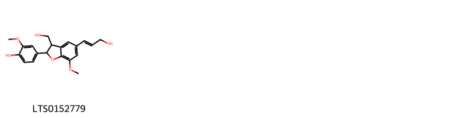
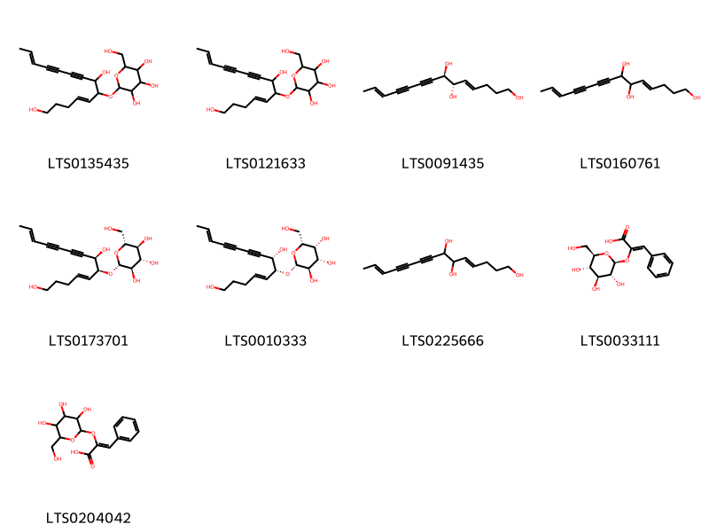
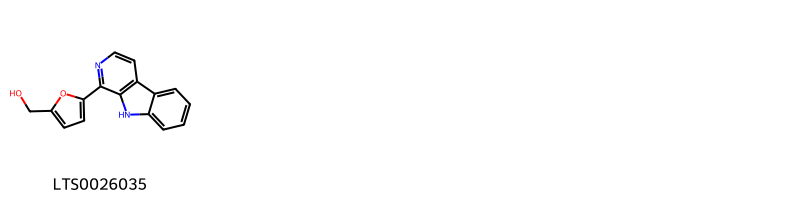
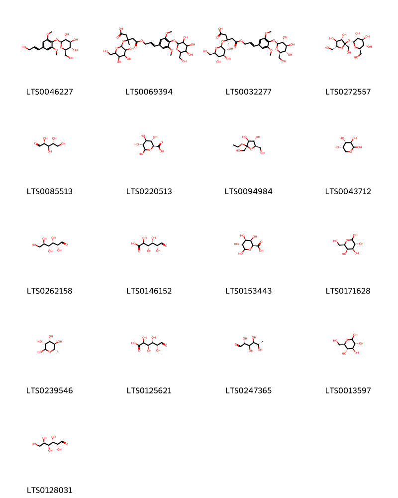
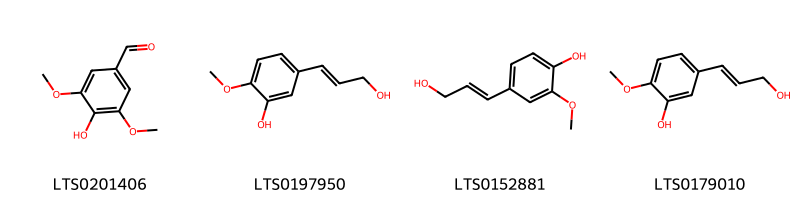
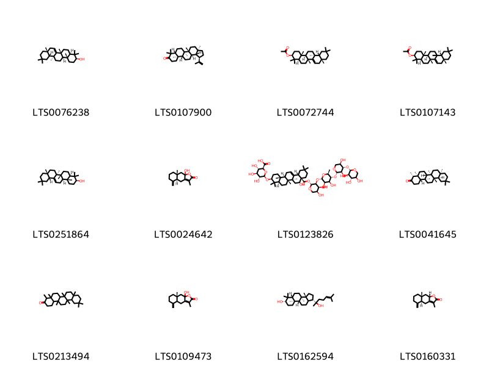
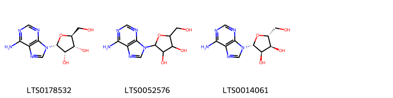
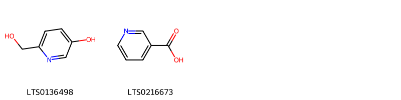
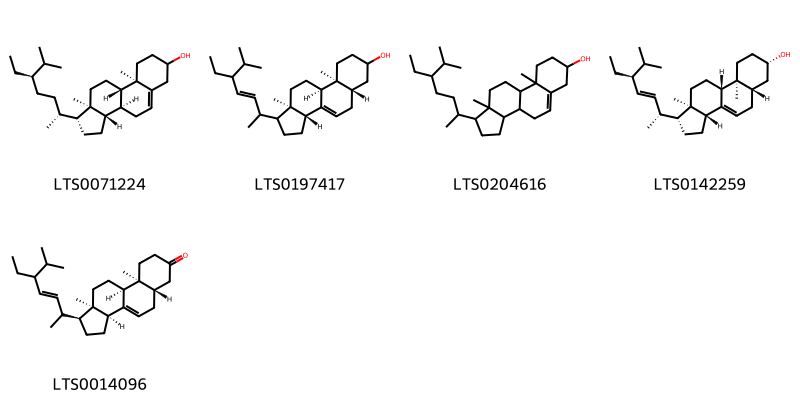

!!! abstract "Tóm tắt"
    Codonopsis pilosula (Franch.) Nannf. (Campanulaceae (họ Hoa Chuông)). Cỏ sống lâu năm, thân bò hoặc leo, phân nhánh nhiều; Rễ hình trụ dài, đường kính 1–1,7 cm, màu vàng nhạt, có vết nhăn dọc và ngang; Lá mọc đối hoặc so le, hình tim hoặc hình trứng, mép nguyên hoặc có răng cưa; Hoa mọc đơn độc, hình chuông, màu vàng nhạt, quả nang có núm nhỏ; Mùa hoa: tháng 7–8, mùa quả: tháng 9–10. Thành phần hóa học: Nhóm hóa học: Alkaloids, flavonoids, polysaccharides, triterpenoids, lignans; Hoạt chất chính: Lobetyolin. Tác dụng dược lý: Dược lý hiện đại: Hạ huyết áp, Tăng đường huyết; Y học cổ truyền: Bổ trung ích khí, kiện tỳ, ích phế; Điều trị tỳ phế hư nhược, khó thở, tim đập mạnh, chán ăn, phân lỏng, ho suyễn, nội nhiệt, tiêu khát (đái tháo đường).

## Thông tin về thực vật

### Đặc điểm thực vật

Dược liệu **Đảng Sâm (Rễ)** từ bộ phận **nan** từ loài *Codonopsis pilosula (Franch.) Nannf.* thuộc họ Campanulaceae. Đẳng sâm là một loại cỏ sống lâu năm. Rễ hình trụ dài, đường kính có thể đạt 1-1,7cm. Đầu rễ phát triển to, trên có nhiều vết sẹo của thân cũ, phía dưới có khi phân nhánh, mặt ngoài màu vàng nhạt, trên có các vết nhăn dọc và ngang. Thân mọc bò hay leo, phân nhánh nhiều, phía dưới hơi có lồng, phía ngọn nhẵn, lá mọc đối, (ở Việt Nam lá phần nhiều mọc đối) so le hoặc có khi gần như mọc vòng. Cuống lá dài 0,5-4cm, phiến lá hình tim hoặc hình trứng dài 1-7cm, rộng 0,8-5,5cm, đầu tù hoặc nhọn, đầy là hình tim mép nguyên hoặc hơi lượn sóng, hoặc có răng cưa (Việt Nam) mặt trên lá màu xanh nhạt, mặt dưới trắng. Hoa mọc đơn độc ở kẽ lá. Có 5 lá dài, tràng hoa hình chuồng, màu vàng nhạt chia 5 thuỳ, 5 nhị, bầu có 5 ngàn. Quả nang, phía trên có 1 núm nhỏ hình nón, khi chín có màu tím đỏ. Mùa hoa nở tháng 7-8. Mùa quả tháng 9-10 (Hình 623, Hm 32,4).

Loài Codonopsis pllosula có lá gần như là đẳng sâm của ta mô tả ở trên, nhưng mép lá nguyên, hoa cũng như vậy, bầu chỉ có 3 ngăn. Loài Codonopsis tangshen Oliv. có lá dài hơn, cuống lá cũng dài hơn. Bầu cũng 3 ngăn. 

!!! info "Phân loại thực vật của *Codonopsis pilosula*"
    - **Kingdom:** Plantae
    - **Phylum:** Tracheophyta
    - **Order:** Asterales
    - **Family:** Campanulaceae
    - **Genus:** Codonopsis
    - **Species:** *Codonopsis pilosula*

*Tài liệu tham khảo:* "Những cây thuốc và vị thuốc Việt Nam" - Đỗ Tất Lợi

 

### Loài thay thế (Nếu có)

Dược liệu này cũng có thể từ loài *Codonopis pilosula (Franch.) Nannf. var. modesta (Nannf.) L. T. Shen*, thông tin về phân loại thực vật loài này như sau:
!!! info "Thông tin về phân loại thực vật của *Codonopsis pilosula*"
    - **kingdom:** Plantae
    - **phylum:** Tracheophyta
    - **order:** Asterales
    - **family:** Campanulaceae
    - **genus:** Codonopsis
    - **species:** *Codonopsis pilosula*

Hình ảnh của loài *Codonopis pilosula (Franch.) Nannf. var. modesta (Nannf.) L. T. Shen*:

Dược liệu này cũng có thể từ loài *Codonopsis tanashen Oliv.*, thông tin về phân loại thực vật loài này như sau:
!!! info "Thông tin về phân loại thực vật của *Codonopsis pilosula*"
    - **kingdom:** Plantae
    - **phylum:** Tracheophyta
    - **order:** Asterales
    - **family:** Campanulaceae
    - **genus:** Codonopsis
    - **species:** *Codonopsis pilosula*

Hình ảnh của loài *Codonopsis tanashen Oliv.*:

### Phân bố trên thế giới
**Từ vườn thực vật KEW: **: "Native to:
Amur, China North-Central, China South-Central, China Southeast, Inner Mongolia, Khabarovsk, Korea, Manchuria, Mongolia, Primorye, Qinghai"

**Từ CSDL GIBF** nan, Pakistan, Korea, Republic of, China, Norway, United States of America, Chinese Taipei, unknown or invalid, Estonia, Russian Federation

### Phân bố tại Việt Nam
** "Những cây thuốc và vị thuốc Việt Nam" - Đỗ Tất Lợi**: Cao Bằng, Lạng Sơn, Lào Cai và các tỉnh có nhiều dân tộc Thái, Mèo.

**Từ CSDL GIBF**: Không có ghi nhận ở Việt Nam

---

## Thông tin về dược liệu 

### Định danh

!!! info "Thông tin về tên gọi của nan"
    - Dược liệu tiếng Việt: nan
    - Dược liệu tiếng Trung: nan (nan)
    - Dược liệu tiếng Anh: nan
    - Dược liệu latin thông dụng: nan
    - Dược liệu latin kiểu DĐVN: radix codonopsis
    - Dược liệu latin kiểu DĐVN: nan
    - Dược liệu latin kiểu thông tư: nan
    - Bộ phận dùng: nan (nan)

### Mô tả dược liệu 
- **Theo dược điển Việt nam V:** nan

- **Mô tả dược liệu theo thông tư chế biến dược liệu theo phương pháp cổ truyền:** nan

### Chế biến 

- **Chế biến theo dược điển việt nam V**: nan

- **Chế biến theo thông tư:** nan

--- 

## Thành phần hóa học

- Theo tài liệu của GS. Đỗ Tất Lợi:  1, Nhóm hóa học: Nhóm hóa học: Alkaloids, flavonoids, polysaccharides, triterpenoids, và lignans.
2, Tên hoạt chất 
Dược điển Đài Loan tái bản lần 4: lobetyolin
    
- Theo cơ sở dữ liệu lotus: Từ loài *Codonopsis pilosula* đã phân lập và xác định được 89 hoạt chất thuộc về các nhóm Harmala alkaloids, Furans, Pyridines and derivatives, Organooxygen compounds, Fatty Acyls, Steroids and steroid derivatives, Prenol lipids, Benzene and substituted derivatives, 2-arylbenzofuran flavonoids, Phenols, Furanoid lignans, Cinnamic acids and derivatives, Flavonoids, Purine nucleosides. 

|    | chemicalTaxonomyClassyfireClass     |   smiles_count |
|---:|:------------------------------------|---------------:|
|  0 | 2-arylbenzofuran flavonoids         |              1 |
|  1 | Benzene and substituted derivatives |              3 |
|  2 | Cinnamic acids and derivatives      |              2 |
|  3 | Fatty Acyls                         |              9 |
|  4 | Flavonoids                          |              1 |
|  5 | Furanoid lignans                    |              2 |
|  6 | Furans                              |              1 |
|  7 | Harmala alkaloids                   |              1 |
|  8 | Organooxygen compounds              |             17 |
|  9 | Phenols                             |              4 |
| 10 | Prenol lipids                       |             12 |
| 11 | Purine nucleosides                  |              3 |
| 12 | Pyridines and derivatives           |              2 |
| 13 | Steroids and steroid derivatives    |              5 |

### Nhóm 2-arylbenzofuran flavonoids
<figure markdown="span">
    { width=100% }
    <figcaption>Hình ảnh cấu trúc hóa học của 1 hoạt chất thuộc nhóm 2-arylbenzofuran flavonoids gồm ['dehydrodiconiferyl alcohol (LTS0152779)'].</figcaption>
</figure>
### Nhóm Benzene and substituted derivatives
<figure markdown="span">
    { width=100% }
    <figcaption>Hình ảnh cấu trúc hóa học của 3 hoạt chất thuộc nhóm Benzene and substituted derivatives gồm ['p-hydroxybenzoic acid (LTS0263634)', '3,4-dihydroxybenzoic acid (LTS0018765)', 'vanillic acid (LTS0229113)'].</figcaption>
</figure>
### Nhóm Cinnamic acids and derivatives
<figure markdown="span">
    { width=100% }
    <figcaption>Hình ảnh cấu trúc hóa học của 2 hoạt chất thuộc nhóm Cinnamic acids and derivatives gồm ['para-coumaric acid (LTS0266252)', 'hydroxycinnamic acid (LTS0233023)'].</figcaption>
</figure>
### Nhóm Fatty Acyls
<figure markdown="span">
    { width=100% }
    <figcaption>Hình ảnh cấu trúc hóa học của 9 hoạt chất thuộc nhóm Fatty Acyls gồm ['2-{[(4e,12e)-1,7-dihydroxytetradeca-4,12-dien-8,10-diyn-6-yl]oxy}-6-(hydroxymethyl)oxane-3,4,5-triol (LTS0135435)', '2-[(1,7-dihydroxytetradeca-4,12-dien-8,10-diyn-6-yl)oxy]-6-(hydroxymethyl)oxane-3,4,5-triol (LTS0121633)', '(4e,6s,7r,12e)-tetradeca-4,12-dien-8,10-diyne-1,6,7-triol (LTS0091435)', 'tetradeca-4,12-dien-8,10-diyne-1,6,7-triol (LTS0160761)', '(2r,3r,4s,5s,6r)-2-{[(4e,6s,7r,12e)-1,7-dihydroxytetradeca-4,12-dien-8,10-diyn-6-yl]oxy}-6-(hydroxymethyl)oxane-3,4,5-triol (LTS0173701)', '(2r,3r,4s,5r,6r)-2-{[(4e,6r,7s,12e)-1,7-dihydroxytetradeca-4,12-dien-8,10-diyn-6-yl]oxy}-6-(hydroxymethyl)oxane-3,4,5-triol (LTS0010333)', '(4e,12e)-tetradeca-4,12-dien-8,10-diyne-1,6,7-triol (LTS0225666)', '(2z)-3-phenyl-2-{[(2s,3r,4s,5s,6r)-3,4,5-trihydroxy-6-(hydroxymethyl)oxan-2-yl]oxy}prop-2-enoic acid (LTS0033111)', '3-phenyl-2-{[3,4,5-trihydroxy-6-(hydroxymethyl)oxan-2-yl]oxy}prop-2-enoic acid (LTS0204042)'].</figcaption>
</figure>
### Nhóm Flavonoids
<figure markdown="span">
    { width=100% }
    <figcaption>Hình ảnh cấu trúc hóa học của 1 hoạt chất thuộc nhóm Flavonoids gồm ['luteolin (LTS0017052)'].</figcaption>
</figure>
### Nhóm Furanoid lignans
<figure markdown="span">
    { width=100% }
    <figcaption>Hình ảnh cấu trúc hóa học của 2 hoạt chất thuộc nhóm Furanoid lignans gồm ['4-[(3ar,6as)-4-(4-hydroxy-3-methoxyphenyl)-hexahydrofuro[3,4-c]furan-1-yl]-2-methoxyphenol (LTS0191067)', 'pinoresinol (LTS0057431)'].</figcaption>
</figure>
### Nhóm Furans
<figure markdown="span">
    { width=100% }
    <figcaption>Hình ảnh cấu trúc hóa học của 1 hoạt chất thuộc nhóm Furans gồm ['furoic acid (LTS0110632)'].</figcaption>
</figure>
### Nhóm Harmala alkaloids
<figure markdown="span">
    { width=100% }
    <figcaption>Hình ảnh cấu trúc hóa học của 1 hoạt chất thuộc nhóm Harmala alkaloids gồm ['perlolyrine (LTS0026035)'].</figcaption>
</figure>
### Nhóm Organooxygen compounds
<figure markdown="span">
    { width=100% }
    <figcaption>Hình ảnh cấu trúc hóa học của 17 hoạt chất thuộc nhóm Organooxygen compounds gồm ['syringin (LTS0046227)', '5-{[3-(3,5-dimethoxy-4-{[3,4,5-trihydroxy-6-(hydroxymethyl)oxan-2-yl]oxy}phenyl)prop-2-en-1-yl]oxy}-3-methyl-5-oxo-3-{[3,4,5-trihydroxy-6-(hydroxymethyl)oxan-2-yl]oxy}pentanoic acid (LTS0069394)', '(3s)-5-{[(2e)-3-(3,5-dimethoxy-4-{[(2s,3r,4s,5s,6r)-3,4,5-trihydroxy-6-(hydroxymethyl)oxan-2-yl]oxy}phenyl)prop-2-en-1-yl]oxy}-3-methyl-5-oxo-3-{[(2s,3r,4s,5s,6r)-3,4,5-trihydroxy-6-(hydroxymethyl)oxan-2-yl]oxy}pentanoic acid (LTS0032277)', 'sucrose (LTS0272557)', 'arabinose (LTS0085513)', 'd-glucopyranuronic acid (LTS0220513)', '(2s,3s,4s,5r)-2-ethoxy-2,5-bis(hydroxymethyl)oxolane-3,4-diol (LTS0094984)', 'l-arabinopyranose (LTS0043712)', '(+)-glucose (LTS0262158)', 'aldehydo-d-glucuronic acid (LTS0146152)', 'd-galacturonic acid (LTS0153443)', 'galactose (LTS0171628)', 'l-rhamnose (LTS0239546)', 'galacturonic acid (LTS0125621)', 'rhamnose (LTS0247365)', 'glucose (LTS0013597)', 'aldehydo-d-galactose (LTS0128031)'].</figcaption>
</figure>
### Nhóm Phenols
<figure markdown="span">
    { width=100% }
    <figcaption>Hình ảnh cấu trúc hóa học của 4 hoạt chất thuộc nhóm Phenols gồm ['syringaldehyde (LTS0201406)', '5-(3-hydroxyprop-1-en-1-yl)-2-methoxyphenol (LTS0197950)', 'coniferyl alcohol (LTS0152881)', '5-[(1e)-3-hydroxyprop-1-en-1-yl]-2-methoxyphenol (LTS0179010)'].</figcaption>
</figure>
### Nhóm Prenol lipids
<figure markdown="span">
    { width=100% }
    <figcaption>Hình ảnh cấu trúc hóa học của 12 hoạt chất thuộc nhóm Prenol lipids gồm ['alnulin (LTS0076238)', 'lupenone (LTS0107900)', '(3s,4ar,6ar,8ar,12ar,12bs,14ar,14br)-4,4,6a,8a,11,11,12b,14b-octamethyl-1,2,3,4a,5,6,8,9,10,12,12a,13,14,14a-tetradecahydropicen-3-yl acetate (LTS0072744)', '(3s,4ar,6ar,8ar,12ar,14ar,14br)-4,4,6a,8a,11,11,12b,14b-octamethyl-1,2,3,4a,5,6,8,9,10,12,12a,13,14,14a-tetradecahydropicen-3-yl acetate (LTS0107143)', 'β-amyrin (LTS0251864)', 'atractylenolide iii (LTS0024642)', '(2s,3s,4s,5r,6r)-6-{[(3s,4ar,6ar,6bs,8r,8ar,12as,14ar,14br)-8a-({[(2r,3s,4s,5s)-3-{[(2s,3r,4s,5r,6s)-5-{[(2s,3r,4s,5r)-3,5-dihydroxy-4-{[(2s,3r,4s,5r)-3,4,5-trihydroxyoxan-2-yl]oxy}oxan-2-yl]oxy}-3,4-dihydroxy-6-methyloxan-2-yl]oxy}-4,5-dihydroxyoxan-2-yl]oxy}carbonyl)-8-hydroxy-4,4,6a,6b,11,11,14b-heptamethyl-1,2,3,4a,5,6,7,8,9,10,12,12a,14,14a-tetradecahydropicen-3-yl]oxy}-3,4,5-trihydroxyoxane-2-carboxylic acid (LTS0123826)', '(-)-friedelin (LTS0041645)', 'friedelin (LTS0213494)', '(8ar)-9a-hydroxy-3,8a-dimethyl-5-methylidene-4h,4ah,6h,7h,8h,9h-naphtho[2,3-b]furan-2-one (LTS0109473)', '(1s,3ar,3br,5ar,7s,9ar,9br)-1-(2-hydroxy-6-methylhept-5-en-2-yl)-3a,3b,6,6,9a-pentamethyl-dodecahydro-1h-cyclopenta[a]phenanthren-7-ol (LTS0162594)', '(4as,8ar,9as)-3,8a-dimethyl-5-methylidene-4h,4ah,6h,7h,8h,9h,9ah-naphtho[2,3-b]furan-2-one (LTS0160331)'].</figcaption>
</figure>
### Nhóm Purine nucleosides
<figure markdown="span">
    { width=100% }
    <figcaption>Hình ảnh cấu trúc hóa học của 3 hoạt chất thuộc nhóm Purine nucleosides gồm ['(2r,3s,4r,5s)-2-(6-aminopurin-9-yl)-5-(hydroxymethyl)oxolane-3,4-diol (LTS0178532)', 'adenosine (LTS0052576)', 'adenosine (LTS0014061)'].</figcaption>
</figure>
### Nhóm Pyridines and derivatives
<figure markdown="span">
    { width=100% }
    <figcaption>Hình ảnh cấu trúc hóa học của 2 hoạt chất thuộc nhóm Pyridines and derivatives gồm ['6-(hydroxymethyl)pyridin-3-ol (LTS0136498)', 'niacin (LTS0216673)'].</figcaption>
</figure>
### Nhóm Steroids and steroid derivatives
<figure markdown="span">
    { width=100% }
    <figcaption>Hình ảnh cấu trúc hóa học của 5 hoạt chất thuộc nhóm Steroids and steroid derivatives gồm ['stigmast-5-en-3-ol (LTS0071224)', '(3ar,5as,9as,9bs,11ar)-1-(5-ethyl-6-methylhept-3-en-2-yl)-9a,11a-dimethyl-1h,2h,3h,3ah,5h,5ah,6h,7h,8h,9h,9bh,10h,11h-cyclopenta[a]phenanthren-7-ol (LTS0197417)', 'stigmast-5-en-3-ol, (3β)- (LTS0204616)', 'chondrillasterol (LTS0142259)', '(1s,3as,5as,9as,9bs,11ar)-1-(5-ethyl-6-methylhept-3-en-2-yl)-9a,11a-dimethyl-1h,2h,3h,3ah,5h,5ah,6h,8h,9h,9bh,10h,11h-cyclopenta[a]phenanthren-7-one (LTS0014096)'].</figcaption>
</figure>

---

## Tác dụng dược lý

Theo tài liệu "Những cây thuốc và vị thuốc Việt Nam" - Đỗ Tất Lợi:Hạ huyết áp, Tăng đường huyết

Theo tài liệu quốc tế: nan

---

## Dược điển Việt Nam V

### Soi bột:
nan
<!-- Hình ảnh soi bột sẽ được tự động chèn vào đây sau -->
### Vi phẫu:
nan
<!-- Hình ảnh vi phẫu sẽ được tự động chèn vào đây sau -->
### Định tính

nan

### Định lượng

nan

### Thông tin khác 
- ** Độ ẩm: ** nan

- ** Bảo quản:** nan
## Dược điển Hồng kong

<!-- PDF sẽ được tự động chèn vào đây sau -->

---

## Y dược học cổ truyền

- **Tên vị thuốc:** nan
- **Tính vị quy kinh:** Cam bình, vào kinh tỳ, phế.
- **Công năng chủ trị:** Bổ trung ích khí, kiện tỳ ích phế.
Chủ trị: Tỳ phế hư nhược, thở dồn, tim đập mạnh, ăn yếu, phân lỏng, ho suyễn, hư tính, nội nhiệt, tiêu khát (đái tháo đường).
- **Chú ý:** nan
- **Kiêng kỵ:** nan

