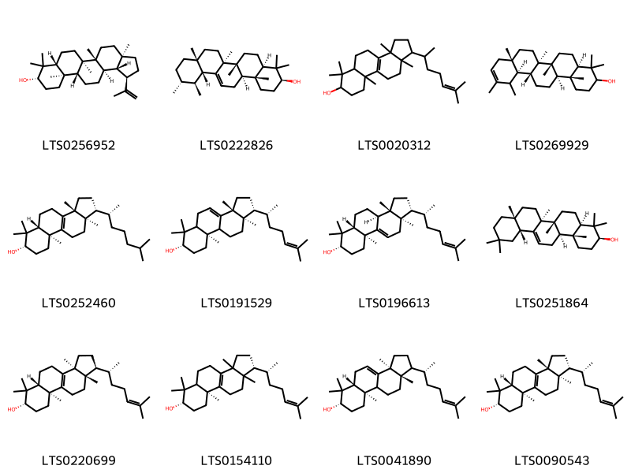
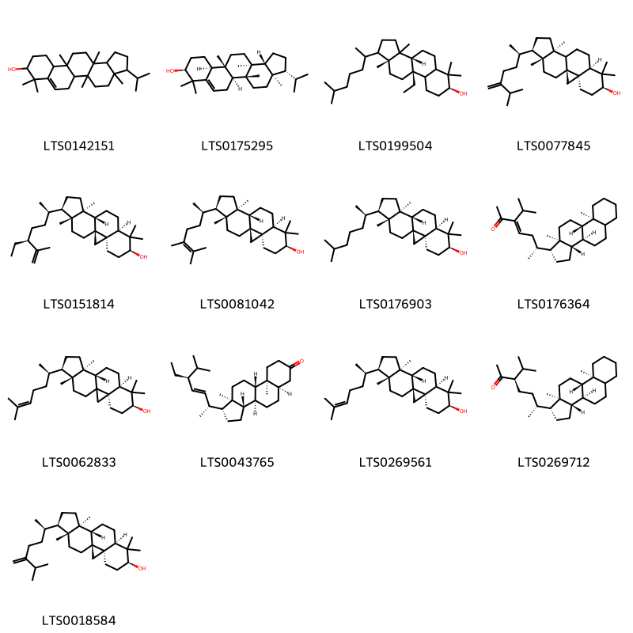

!!! abstract "Tóm tắt"
    Đậu Đen (Hạt)

- Tên khoa học: Vigna unguiculata subsp. unguiculata (L.) Walp.
- Họ: Fabaceae (Họ Đậu)

Mô tả cây
Đậu đen là một loại cây cỏ mọc hằng năm, thân không có lông. Lá cây là lá kép, gồm 3 lá chét mọc so le, với lá chét giữa to và dài hơn hai lá chét bên. Hoa có màu tím nhạt, quả giáp dài, tròn và chứa từ 7 đến 10 hạt có màu đen. Đậu đen có nhiều loại như đậu đen trắng lòng và đậu đen xanh lòng, trong đó đậu đen xanh lòng có nhân màu xanh nhạt.

Phân bố
Đậu đen có nguồn gốc từ các khu vực nhiệt đới và cận nhiệt đới của châu Phi, bao gồm Angola, Benin, Cameroon, Ethiopia, Ghana, Kenya, Mali, Mozambique, Nigeria, Senegal, Sudan, Tanzania, Zambia, Zimbabwe và nhiều khu vực khác. Nó cũng được trồng rộng rãi ở các quốc gia khác như Ấn Độ, Việt Nam, Thái Lan, Cuba, Brazil, và nhiều quốc gia khác.

Kinh nghiệm sử dụng trong dân gian và y học cổ truyền
- Dân gian: Trong y học dân gian, hạt đậu đen thường được dùng để chữa các bệnh về thận, tiêu hóa, giải độc, thanh nhiệt, giảm phù nề, điều hòa huyết áp, và hỗ trợ điều trị tiểu đường.
- Y học cổ truyền: Đậu đen được coi là có tác dụng vào các kinh thận. Tác dụng chủ yếu là trừ phong, thanh thấp nhiệt, lương huyết, giải độc, lợi tiểu, tư âm, bổ thận, sáng mắt và trừ phù thũng do nhiệt độc.
Tác dụng dược lý
- Chống viêm và giảm đau
- Lợi tiểu
- Hỗ trợ tiêu hóa
- Điều hòa huyết áp và giảm cholesterol
- Hỗ trợ điều trị bệnh tiểu đường"
Thành phần hóa học
Hạt đậu đen chứa nhiều thành phần hoạt chất có lợi cho sức khỏe, trong đó nổi bật là:
Anthraquinones: Đây là hợp chất có tác dụng kháng viêm và chống oxy hóa, giúp làm giảm các triệu chứng viêm và hỗ trợ tiêu hóa.
Ngoài ra, đậu đen còn chứa nhiều chất dinh dưỡng như protein, carbohydrate, vitamin và khoáng chất, có tác dụng bồi bổ cơ thể và nâng cao sức khỏe.

## Thông tin về thực vật

### Đặc điểm thực vật

Dược liệu **Đậu Đen (Hạt)** từ bộ phận **nan** từ loài *Vigna cylindrica (L.) Skeels* thuộc họ Fabaceae. Đậu Đen là một loại cỏ mọc hằng năm, toàn thần không có lông. Lá kép gồm 3 lá chét mọc so le, có lá kèm nhỏ, lá chét giữa to và dài hơn lá chét hai bên. Hoa màu tím nhạt. Quả giáp dài, tròn, trong chứa từ 7 đến 10 hạt màu đen.Ngay trong đậu đen, lại có loại đậu đen trắng lòng và đậu đen xanh lòng (Papilionaceae). Đậu đen xanh lòng có nhân màu xanh nhạt 

!!! info "Phân loại thực vật của *Vigna unguiculata*"
    - **Kingdom:** Plantae
    - **Phylum:** Tracheophyta
    - **Order:** Fabales
    - **Family:** Fabaceae
    - **Genus:** Vigna
    - **Species:** *Vigna unguiculata*

*Tài liệu tham khảo:* "Những cây thuốc và vị thuốc Việt Nam" - Đỗ Tất Lợi

 

### Loài thay thế (Nếu có)

### Phân bố trên thế giới
**Từ vườn thực vật KEW: **: Native to:
Angola, Benin, Botswana, Cameroon, Cape Provinces, Cape Verde, Caprivi Strip, Central African Republic, Congo, Eritrea, Ethiopia, Gambia, Ghana, Guinea-Bissau, Gulf of Guinea Is., Ivory Coast, Kenya, KwaZulu-Natal, Malawi, Mali, Mauritania, Mozambique, Namibia, Nigeria, Northern Provinces, Rwanda, Senegal, Sierra Leone, Sudan, Swaziland, Tanzania, Togo, Zambia, Zaïre, Zimbabwe

Introduced into:
Alabama, Andaman Is., Arkansas, Assam, Bangladesh, Bismarck Archipelago, Brazil Southeast, Brazil West-Central, Burkina, Cambodia, Chad, Colombia, Comoros, Cuba, Dominican Republic, East Himalaya, Ecuador, Fiji, Florida, French Guiana, Georgia, Guatemala, Guyana, Haiti, Honduras, Illinois, India, Iraq, Jamaica, Jawa, Kazakhstan, Kirgizstan, Korea, Laccadive Is., Laos, Leeward Is., Louisiana, Madagascar, Marianas, Maryland, Mexico Southwest, Mississippi, Myanmar, Nepal, New Caledonia, New Guinea, North Carolina, North Caucasus, Pakistan, Philippines, Puerto Rico, Queensland, Somalia, South Carolina, Sri Lanka, Suriname, Tadzhikistan, Taiwan, Thailand, Transcaucasus, Turkmenistan, Uganda, Ukraine, Uzbekistan, Vietnam, West Himalaya, Windward Is., Yemen

**Từ CSDL GIBF** nan, Korea (Democratic People’s Republic of), Brazil, Croatia, China, United States of America, Portugal

### Phân bố tại Việt Nam
** "Những cây thuốc và vị thuốc Việt Nam" - Đỗ Tất Lợi**: Nha Trang (Khánh Hòa), Ban Mê Thuật (Đăk Lăk),

**Từ CSDL GIBF**: Không có ghi nhận ở Việt Nam

---

## Thông tin về dược liệu 

### Định danh

!!! info "Thông tin về tên gọi của nan"
    - Dược liệu tiếng Việt: nan
    - Dược liệu tiếng Trung: nan (nan)
    - Dược liệu tiếng Anh: nan
    - Dược liệu latin thông dụng: nan
    - Dược liệu latin kiểu DĐVN: semen vignae cylindricae
    - Dược liệu latin kiểu DĐVN: nan
    - Dược liệu latin kiểu thông tư: nan
    - Bộ phận dùng: nan (nan)

### Mô tả dược liệu 
- **Theo dược điển Việt nam V:** nan

- **Mô tả dược liệu theo thông tư chế biến dược liệu theo phương pháp cổ truyền:** nan

### Chế biến 

- **Chế biến theo dược điển việt nam V**: nan

- **Chế biến theo thông tư:** nan

--- 

## Thành phần hóa học

- Theo tài liệu của GS. Đỗ Tất Lợi:  Tên hoạt chất theo Dược điển Việt Nam: anthraquinones
    
- Theo cơ sở dữ liệu lotus: Từ loài *Vigna unguiculata* đã phân lập và xác định được 26 hoạt chất thuộc về các nhóm Steroids and steroid derivatives, Prenol lipids. 

|    | chemicalTaxonomyClassyfireClass   |   smiles_count |
|---:|:----------------------------------|---------------:|
|  0 | Prenol lipids                     |             12 |
|  1 | Steroids and steroid derivatives  |             13 |

### Nhóm Prenol lipids
<figure markdown="span">
    { width=100% }
    <figcaption>Hình ảnh cấu trúc hóa học của 12 hoạt chất thuộc nhóm Prenol lipids gồm ['lupeol (LTS0256952)', 'amyrin (LTS0222826)', 'lanster (LTS0020312)', '(4ar,6ar,6br,8as,12ar,12br,14ar,14br)-4,4,6a,6b,8a,11,12,14b-octamethyl-2,3,4a,5,6,7,8,9,12,12a,12b,13,14,14a-tetradecahydro-1h-picen-3-ol (LTS0269929)', '24,25-dihydrolanosterol (LTS0252460)', '(1r,3ar,7s,9ar,11ar)-3a,6,6,9a,11a-pentamethyl-1-[(2r)-6-methylhept-5-en-2-yl]-1h,2h,3h,5h,5ah,7h,8h,9h,9bh,10h,11h-cyclopenta[a]phenanthren-7-ol (LTS0191529)', 'parkeol (LTS0196613)', 'β-amyrin (LTS0251864)', 'euphol (LTS0220699)', '(1r,7s,9as)-3a,6,6,9a,11a-pentamethyl-1-[(2r)-6-methylhept-5-en-2-yl]-1h,2h,3h,4h,5h,5ah,7h,8h,9h,10h,11h-cyclopenta[a]phenanthren-7-ol (LTS0154110)', '(3as,5ar,7s,9ar,11as)-3a,6,6,9a,11a-pentamethyl-1-[(2r)-6-methylhept-5-en-2-yl]-1h,2h,3h,5h,5ah,7h,8h,9h,9bh,10h,11h-cyclopenta[a]phenanthren-7-ol (LTS0041890)', 'lanosterol (LTS0090543)'].</figcaption>
</figure>
### Nhóm Steroids and steroid derivatives
<figure markdown="span">
    { width=100% }
    <figcaption>Hình ảnh cấu trúc hóa học của 13 hoạt chất thuộc nhóm Steroids and steroid derivatives gồm ['3-isopropyl-3a,5a,8,8,11b,13a-hexamethyl-1h,2h,3h,4h,5h,5bh,6h,9h,10h,11h,11ah,12h,13h,13bh-cyclopenta[a]chrysen-9-ol (LTS0142151)', 'simiarenol (LTS0175295)', '(3br,7s,9bs,11ar)-9b-ethyl-3a,6,6,11a-tetramethyl-1-(6-methylheptan-2-yl)-dodecahydro-1h-cyclopenta[a]phenanthren-7-ol (LTS0199504)', '24-methylene-cycloartanol (LTS0077845)', '(1s,3r,6s,8r,11s,12s,15r,16r)-15-[(2r,5s)-5-ethyl-6-methylhept-6-en-2-yl]-7,7,12,16-tetramethylpentacyclo[9.7.0.0¹,³.0³,⁸.0¹²,¹⁶]octadecan-6-ol (LTS0151814)', '(1s,3r,6s,8r,11s,12s,15r,16r)-15-[(2r)-5,6-dimethylhept-5-en-2-yl]-7,7,12,16-tetramethylpentacyclo[9.7.0.0¹,³.0³,⁸.0¹²,¹⁶]octadecan-6-ol (LTS0081042)', 'cycloartanol (LTS0176903)', '(6r)-6-[(1r,3as,3br,9as,9bs,11ar)-9a,11a-dimethyl-tetradecahydro-1h-cyclopenta[a]phenanthren-1-yl]-3-isopropylhept-3-en-2-one (LTS0176364)', '(3r,6s,8r,11s,12s,15r,16r)-7,7,12,16-tetramethyl-15-[(2r)-6-methylhept-5-en-2-yl]pentacyclo[9.7.0.0¹,³.0³,⁸.0¹²,¹⁶]octadecan-6-ol (LTS0062833)', 'stigmastenone (LTS0043765)', 'cycloartenol (LTS0269561)', '(3r,6r)-6-[(1r,3as,3br,9as,9bs,11ar)-9a,11a-dimethyl-tetradecahydro-1h-cyclopenta[a]phenanthren-1-yl]-3-isopropylheptan-2-one (LTS0269712)', '24-methylenecycloartanol (LTS0018584)'].</figcaption>
</figure>

---

## Tác dụng dược lý

Theo tài liệu "Những cây thuốc và vị thuốc Việt Nam" - Đỗ Tất Lợi:- Chống viêm và giảm đau
- Lợi tiểu
- Hỗ trợ tiêu hóa
- Điều hòa huyết áp và giảm cholesterol
- Hỗ trợ điều trị bệnh tiểu đường

Theo tài liệu quốc tế: nan

---

## Dược điển Việt Nam V

### Soi bột:
nan
<!-- Hình ảnh soi bột sẽ được tự động chèn vào đây sau -->
### Vi phẫu:
nan
<!-- Hình ảnh vi phẫu sẽ được tự động chèn vào đây sau -->
### Định tính

nan

### Định lượng

nan

### Thông tin khác 
- ** Độ ẩm: ** nan

- ** Bảo quản:** nan
## Dược điển Hồng kong

<!-- PDF sẽ được tự động chèn vào đây sau -->

---

## Y dược học cổ truyền

- **Tên vị thuốc:** nan
- **Tính vị quy kinh:** Cam bình. Qui vào kinh thận.
- **Công năng chủ trị:** Trừ phong, thanh thấp nhiệt, lương huyết, giải độc, lợi tiểu tiện, tư âm, đùng bổ thận, sáng mắt, trừ phù thũng do nhiệt độc, giải độc.
- **Chú ý:** nan
- **Kiêng kỵ:** nan

