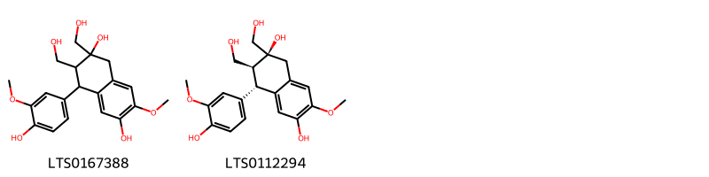
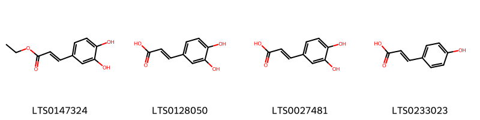
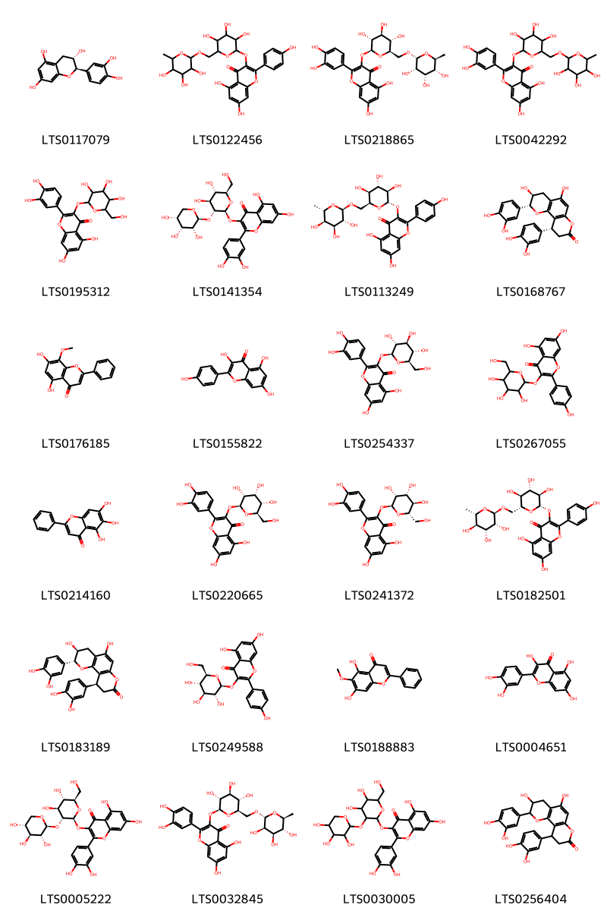
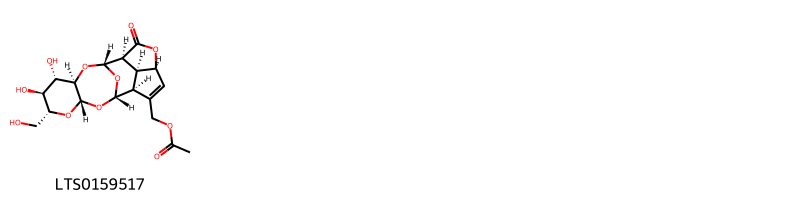
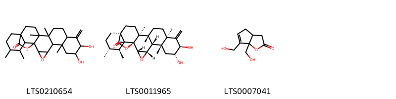
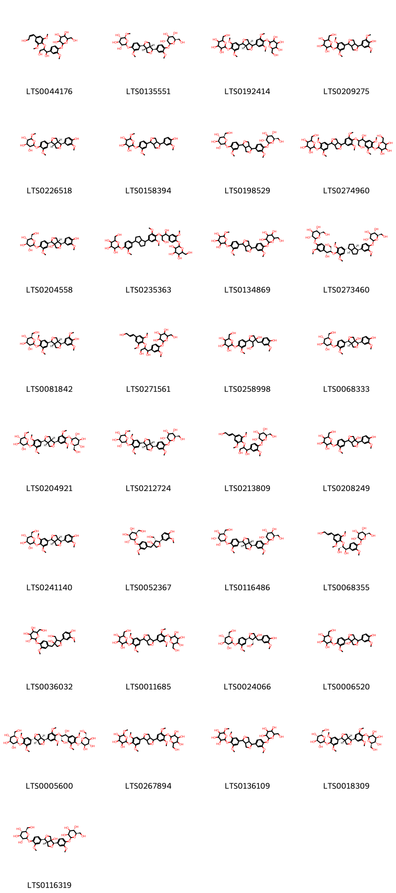
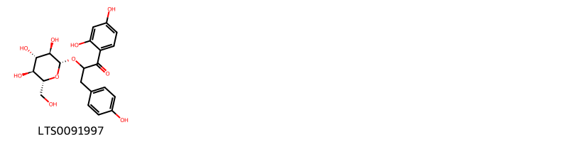
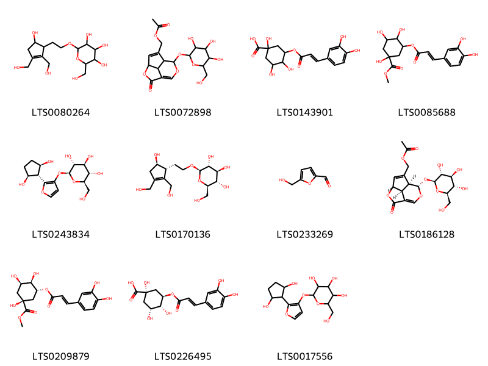

!!! abstract "Tóm tắt"
    Đỗ trọng có tên khoa học là Eucommia ulmoides Oliv. thuộc họ Đỗ trọng (Eucommiaceae). Trên thế giới, cây được phân bố tại Bulgaria, Indiana, Korea, New Jersey, New York, Ohio. Tại Việt Nam, cây được trồng ở Hà Nội và được cả ở những nơi lạnh như Sapa (Lào Cai). Theo tài liệu cổ, đỗ trọng có tác dụng bổ can, thận, mạnh gân cốt, an thai, dùng chữa đau lưng, đi tiểu nhiều, chân gối yếu mềm. Tại Liên Xô cũ, từ năm 1951 đã công nhận đỗ trọng là một vị thuốc chính thức để điều trị bệnh cao huyết áp. Tác dụng dược lý của đỗ trọng với liều vừa phải, có tác dụng kích thích, với liều cao có tác dụng ức chế hệ thống thần kinh trung ương, nhất là vùng vỏ não. Ngoài ra còn có tác dụng hạ huyết áp và làm mạnh sự co bóp của cơ tim. Một số thành phần hóa học của cây đã được phát hiện và xác định cấu trúc như Acubin; Citrusin B; Syringaresinol; Pinoresinol diglucoside; Olivil;…

## Thông tin về thực vật

### Đặc điểm thực vật

Dược liệu **Đỗ Trọng (Vỏ Thân)** từ bộ phận **Vỏ** từ loài *Eucommia ulmoides Oliv.* thuộc họ Eucommiaceae. Đỗ Trọng là một cây to hay nhỏ, có thể cao tới 10m, 20m, luôn luôn xanh tươi. 
Lá mọc so le, hình trứng rộng, đầu lá nhọn, gốc lá tròn, mép lá có răng cưa, khi đứt lá làm 2-3 mảnh sẽ thấy những sợi nhựa trắng như tơ giữa các mảnh lá đó liền nhau, phiến lá rộng 3,5-6,5cm, dài 6-13cm. Cuống lá ngắn 1-1,5cm. 
Hoa đơn tính. Hoa đực, hoa cái khác gốc; không có bao hoa. 
Quả hình thoi dài 3cm, rộng 1cm dẹt, đầu quả xẻ làm 2 thành hình chữ V. 

!!! info "Phân loại thực vật của *Eucommia ulmoides*"
    - **Kingdom:** Plantae
    - **Phylum:** Tracheophyta
    - **Order:** Garryales
    - **Family:** Eucommiaceae
    - **Genus:** Eucommia
    - **Species:** *Eucommia ulmoides*

*Tài liệu tham khảo:* "Những cây thuốc và vị thuốc Việt Nam" - Đỗ Tất Lợi

 

### Loài thay thế (Nếu có)

### Phân bố trên thế giới
**Từ vườn thực vật KEW: **: Bản địa: China North-Central, China South-Central, China Southeast
Di thực: Bulgaria, Indiana, Korea, New Jersey, New York, Ohio

**Từ CSDL GIBF** Poland, Belgium, Korea, Republic of, China, United States of America, Japan, Ukraine, Germany, Russian Federation

### Phân bố tại Việt Nam
** "Những cây thuốc và vị thuốc Việt Nam" - Đỗ Tất Lợi**: Sapa, Hà Nội

**Từ CSDL GIBF**: Không có ghi nhận ở Việt Nam

---

## Thông tin về dược liệu 

### Định danh

!!! info "Thông tin về tên gọi của đỗ trọng"
    - Dược liệu tiếng Việt: đỗ trọng
    - Dược liệu tiếng Trung: 杜仲 (Du Zhong)
    - Dược liệu tiếng Anh: Eucommia Ulmoides
    - Dược liệu latin thông dụng: Cortex EucommiaenCortex Eucommiae
    - Dược liệu latin kiểu DĐVN: cortex eucommiae
    - Dược liệu latin kiểu DĐVN: Cortex Eucommiae
    - Dược liệu latin kiểu thông tư: Cortex Eucommiae
    - Bộ phận dùng: Vỏ (Cortex)

### Mô tả dược liệu 
- **Theo dược điển Việt nam V:** 
Dược liệu là những miếng vỏ phẳng hoặc hai bên mép hơi cong vào, to nhỏ không đều, dày 0,2 cm đến 0,7 cm, màu xám tro. Mặt ngoài sần sùi, có nhiều nếp nhăn dọc và vết tích của cành con. Mặt trong vỏ màu sẫm, trơn, chất giòn, dễ bẻ gãy, mặt bẻ có nhiều sợi màu trắng ánh bạc, có tính đàn hồi như cao su. Vị hơi đắng.

- **Mô tả dược liệu theo thông tư chế biến dược liệu theo phương pháp cổ truyền:** 

### Chế biến 

- **Chế biến theo dược điển việt nam V**: 
Thu hoạch từ tháng 4 đến tháng 6, bóc lấy vỏ, cạo bỏ vỏ thô xếp đống cho đến khi mặt trong của vỏ có màu nâu tía đen thì phơi khô. Bào chế Đỗ trọng thái miếng: Cạo vỏ thô còn sót lại, rửa sạch, thái miếng hoặc sợi còn tơ, phơi khô, dùng sống hoặc chế. Diêm đỗ trọng (Chế muối): Lấy Đồ trọng thái miếng, tẩm nước muối trong 2 h (1 kg Đỗ trọng dùng 30 g muối trong 200 ml nước), sao vàng, đứt tơ là được; hoặc sao đen khi mặt ngoài màu đen sẫm, khi bẻ gãy thấy tính đàn hôi tơ kém so với khi chưa sao. Vị hơi mặn.

- **Chế biến theo thông tư:** 

--- 

## Thành phần hóa học

- Theo tài liệu của GS. Đỗ Tất Lợi:  (1) 
Aucubin; Citrusin B; Syringaresinol; Pinoresinol diglucoside; Eleutheroside; Buddlenol e; (+)-catechol; Nicotiflorin; (+)-Genipin; (-)-medioresinol; rutin; Asperuloside; Geniposide; Isoquercetin; Pinoresinol; (+)-syringaresinol; Kaempherol; Geniposidic acid; Acanthoside b; Olivil; …
(2) 
Dược điển Việt Nam: pinoresinol diglucosid
Dược điển Hongkong: pinoresinol diglucosid
    
- Theo cơ sở dữ liệu lotus: Từ loài *Eucommia ulmoides* đã phân lập và xác định được 141 hoạt chất thuộc về các nhóm Dihydrofurans, Lignan glycosides, Furopyrans, Linear 1,3-diarylpropanoids, Lactones, Organooxygen compounds, Benzofurans, Prenol lipids, Benzene and substituted derivatives, Indoles and derivatives, Furanoid lignans, Phenols, Aryltetralin lignans, Cinnamic acids and derivatives, Flavonoids, 2-arylbenzofuran flavonoids. 

|    | chemicalTaxonomyClassyfireClass     |   smiles_count |
|---:|:------------------------------------|---------------:|
|  0 |                                     |              2 |
|  1 | 2-arylbenzofuran flavonoids         |              6 |
|  2 | Aryltetralin lignans                |              2 |
|  3 | Benzene and substituted derivatives |              2 |
|  4 | Benzofurans                         |              2 |
|  5 | Cinnamic acids and derivatives      |              4 |
|  6 | Dihydrofurans                       |              1 |
|  7 | Flavonoids                          |             24 |
|  8 | Furanoid lignans                    |             13 |
|  9 | Furopyrans                          |              1 |
| 10 | Indoles and derivatives             |              1 |
| 11 | Lactones                            |              3 |
| 12 | Lignan glycosides                   |             33 |
| 13 | Linear 1,3-diarylpropanoids         |              1 |
| 14 | Organooxygen compounds              |             11 |
| 15 | Phenols                             |              2 |
| 16 | Prenol lipids                       |             32 |

### Nhóm 
<figure markdown="span">
    { width=100% }
    <figcaption>Hình ảnh cấu trúc hóa học của 2 hoạt chất thuộc nhóm  gồm ['3-(4-{[1,3-dihydroxy-1-(4-hydroxy-3-methoxyphenyl)propan-2-yl]oxy}-3-methoxyphenyl)prop-2-enal (LTS0160965)', '(2e)-3-(4-{[(1r,2s)-1,3-dihydroxy-1-(4-hydroxy-3-methoxyphenyl)propan-2-yl]oxy}-3-methoxyphenyl)prop-2-enal (LTS0219165)'].</figcaption>
</figure>
### Nhóm 2-arylbenzofuran flavonoids
<figure markdown="span">
    { width=100% }
    <figcaption>Hình ảnh cấu trúc hóa học của 6 hoạt chất thuộc nhóm 2-arylbenzofuran flavonoids gồm ['2-(hydroxymethyl)-6-({3-[3-(hydroxymethyl)-7-methoxy-2-(3-methoxy-4-{[3,4,5-trihydroxy-6-(hydroxymethyl)oxan-2-yl]oxy}phenyl)-2,3-dihydro-1-benzofuran-5-yl]prop-2-en-1-yl}oxy)oxane-3,4,5-triol (LTS0075632)', '4-[(2s,3r)-3-(hydroxymethyl)-5-(3-hydroxypropyl)-7-methoxy-2,3-dihydro-1-benzofuran-2-yl]-2-methoxyphenol (LTS0153479)', '1-[2-(4-hydroxy-3-methoxyphenyl)-3-(hydroxymethyl)-7-methoxy-2,3-dihydro-1-benzofuran-5-yl]propane-1,2,3-triol (LTS0090973)', '(1r,2r)-1-[(2s,3r)-2-(4-hydroxy-3-methoxyphenyl)-3-(hydroxymethyl)-7-methoxy-2,3-dihydro-1-benzofuran-5-yl]propane-1,2,3-triol (LTS0125469)', '4-[3-(hydroxymethyl)-5-(3-hydroxypropyl)-7-methoxy-2,3-dihydro-1-benzofuran-2-yl]-2-methoxyphenol (LTS0259518)', '(2r,3s,4s,5r,6r)-2-(hydroxymethyl)-6-{[(2e)-3-[(2s,3r)-3-(hydroxymethyl)-7-methoxy-2-(3-methoxy-4-{[(2s,3r,4s,5s,6r)-3,4,5-trihydroxy-6-(hydroxymethyl)oxan-2-yl]oxy}phenyl)-2,3-dihydro-1-benzofuran-5-yl]prop-2-en-1-yl]oxy}oxane-3,4,5-triol (LTS0244783)'].</figcaption>
</figure>
### Nhóm Aryltetralin lignans
<figure markdown="span">
    { width=100% }
    <figcaption>Hình ảnh cấu trúc hóa học của 2 hoạt chất thuộc nhóm Aryltetralin lignans gồm ['4-(4-hydroxy-3-methoxyphenyl)-2,3-bis(hydroxymethyl)-7-methoxy-3,4-dihydro-1h-naphthalene-2,6-diol (LTS0167388)', '(2s,3s,4s)-4-(4-hydroxy-3-methoxyphenyl)-2,3-bis(hydroxymethyl)-7-methoxy-3,4-dihydro-1h-naphthalene-2,6-diol (LTS0112294)'].</figcaption>
</figure>
### Nhóm Benzene and substituted derivatives
<figure markdown="span">
    { width=100% }
    <figcaption>Hình ảnh cấu trúc hóa học của 2 hoạt chất thuộc nhóm Benzene and substituted derivatives gồm ['galop (LTS0222857)', '3,4-dihydroxybenzoic acid (LTS0018765)'].</figcaption>
</figure>
### Nhóm Benzofurans
<figure markdown="span">
    { width=100% }
    <figcaption>Hình ảnh cấu trúc hóa học của 2 hoạt chất thuộc nhóm Benzofurans gồm ['loliolide (LTS0254454)', 'loliolide (LTS0119422)'].</figcaption>
</figure>
### Nhóm Cinnamic acids and derivatives
<figure markdown="span">
    { width=100% }
    <figcaption>Hình ảnh cấu trúc hóa học của 4 hoạt chất thuộc nhóm Cinnamic acids and derivatives gồm ['ethyl caffeate (LTS0147324)', '3,4-dihydroxycinnamic acid (LTS0128050)', 'caffeic acid (LTS0027481)', 'hydroxycinnamic acid (LTS0233023)'].</figcaption>
</figure>
### Nhóm Dihydrofurans
<figure markdown="span">
    { width=100% }
    <figcaption>Hình ảnh cấu trúc hóa học của 1 hoạt chất thuộc nhóm Dihydrofurans gồm ['vitamin c (LTS0022555)'].</figcaption>
</figure>
### Nhóm Flavonoids
<figure markdown="span">
    { width=100% }
    <figcaption>Hình ảnh cấu trúc hóa học của 24 hoạt chất thuộc nhóm Flavonoids gồm ['(+)-catechol (LTS0117079)', '5,7-dihydroxy-2-(4-hydroxyphenyl)-3-[(3,4,5-trihydroxy-6-{[(3,4,5-trihydroxy-6-methyloxan-2-yl)oxy]methyl}oxan-2-yl)oxy]chromen-4-one (LTS0122456)', '2-(3,4-dihydroxyphenyl)-5,7-dihydroxy-3-{[(2s,3r,4s,5s,6r)-3,4,5-trihydroxy-6-({[(2r,3s,4s,5r,6s)-3,4,5-trihydroxy-6-methyloxan-2-yl]oxy}methyl)oxan-2-yl]oxy}chromen-4-one (LTS0218865)', 'rutin (LTS0042292)', '2-(3,4-dihydroxyphenyl)-5,7-dihydroxy-3-{[3,4,5-trihydroxy-6-(hydroxymethyl)oxan-2-yl]oxy}chromen-4-one (LTS0195312)', '3-{[(2s,3r,4s,5s,6r)-4,5-dihydroxy-6-(hydroxymethyl)-3-{[(2s,3r,4r,5r)-3,4,5-trihydroxyoxan-2-yl]oxy}oxan-2-yl]oxy}-2-(3,4-dihydroxyphenyl)-5,7-dihydroxychromen-4-one (LTS0141354)', '5,7-dihydroxy-2-(4-hydroxyphenyl)-3-{[(2s,3r,4s,5s,6s)-3,4,5-trihydroxy-6-({[(2r,3r,4s,5r,6s)-3,4,5-trihydroxy-6-methyloxan-2-yl]oxy}methyl)oxan-2-yl]oxy}chromen-4-one (LTS0113249)', '(4r,5s,14r)-4,14-bis(3,4-dihydroxyphenyl)-5,8-dihydroxy-3,11-dioxatricyclo[8.4.0.0²,⁷]tetradeca-1(10),2(7),8-trien-12-one (LTS0168767)', 'wogonin (LTS0176185)', 'kaempherol (LTS0155822)', 'isoquercetin (LTS0254337)', 'trifolin (LTS0267055)', 'baicalein (LTS0214160)', '2-(3,4-dihydroxyphenyl)-5,7-dihydroxy-3-{[(2s,3r,4r,5s,6r)-3,4,5-trihydroxy-6-(hydroxymethyl)oxan-2-yl]oxy}chromen-4-one (LTS0220665)', '2-(3,4-dihydroxyphenyl)-5,7-dihydroxy-3-{[(2s,3r,4r,5r,6s)-3,4,5-trihydroxy-6-(hydroxymethyl)oxan-2-yl]oxy}chromen-4-one (LTS0241372)', 'nictoflorin (LTS0182501)', '(4r,5s,14s)-4,14-bis(3,4-dihydroxyphenyl)-5,8-dihydroxy-3,11-dioxatricyclo[8.4.0.0²,⁷]tetradeca-1(10),2(7),8-trien-12-one (LTS0183189)', 'astragalin (LTS0249588)', 'oroxylin a (LTS0188883)', 'quercetin (LTS0004651)', '3-{[(2s,3r,4s,5s,6r)-4,5-dihydroxy-6-(hydroxymethyl)-3-{[(2s,3r,4s,5r)-3,4,5-trihydroxyoxan-2-yl]oxy}oxan-2-yl]oxy}-2-(3,4-dihydroxyphenyl)-5,7-dihydroxychromen-4-one (LTS0005222)', '3-rutinosyl quercetin (LTS0032845)', '3-{[4,5-dihydroxy-6-(hydroxymethyl)-3-[(3,4,5-trihydroxyoxan-2-yl)oxy]oxan-2-yl]oxy}-2-(3,4-dihydroxyphenyl)-5,7-dihydroxychromen-4-one (LTS0030005)', '4,14-bis(3,4-dihydroxyphenyl)-5,8-dihydroxy-3,11-dioxatricyclo[8.4.0.0²,⁷]tetradeca-1(10),2(7),8-trien-12-one (LTS0256404)'].</figcaption>
</figure>
### Nhóm Furanoid lignans
<figure markdown="span">
    { width=100% }
    <figcaption>Hình ảnh cấu trúc hóa học của 13 hoạt chất thuộc nhóm Furanoid lignans gồm ['syringaresinol (LTS0116280)', 'buddlenol e (LTS0131955)', '(-)-medioresinol (LTS0211003)', 'pinoresinol (LTS0057431)', '(+)-syringaresinol (LTS0158868)', '(1s,2r)-2-{4-[(1s,3ar,4s,6ar)-4-(4-hydroxy-3-methoxyphenyl)-hexahydrofuro[3,4-c]furan-1-yl]-2,6-dimethoxyphenoxy}-1-(4-hydroxy-3-methoxyphenyl)propane-1,3-diol (LTS0138179)', '(1s,3as,4r,6ar)-1,4-bis(4-hydroxy-3-methoxyphenyl)-tetrahydro-1h-furo[3,4-c]furan-3a-ol (LTS0119092)', '4-[4-(4-hydroxy-3-methoxyphenyl)-hexahydrofuro[3,4-c]furan-1-yl]-2,6-dimethoxyphenol (LTS0251212)', '5-(4-hydroxy-3-methoxyphenyl)-3-[(4-hydroxy-3-methoxyphenyl)methyl]-4-(hydroxymethyl)oxolan-3-ol (LTS0230969)', 'olivil (LTS0178537)', '4-[(1s,3ar,4r,6ar)-4-(4-hydroxy-3-methoxyphenyl)-hexahydrofuro[3,4-c]furan-1-yl]-2-methoxyphenol (LTS0014948)', '1,4-bis(4-hydroxy-3-methoxyphenyl)-tetrahydro-1h-furo[3,4-c]furan-3a-ol (LTS0057021)', 'pinoresinol (LTS0011247)'].</figcaption>
</figure>
### Nhóm Furopyrans
<figure markdown="span">
    { width=100% }
    <figcaption>Hình ảnh cấu trúc hóa học của 1 hoạt chất thuộc nhóm Furopyrans gồm ['[(1s,3s,5r,6s,7s,8r,10s,11s,14r,17s,19s)-6,7-dihydroxy-5-(hydroxymethyl)-12-oxo-2,4,9,13,18-pentaoxapentacyclo[8.7.1.1¹¹,¹⁴.0³,⁸.0¹⁷,¹⁹]nonadec-15-en-16-yl]methyl acetate (LTS0159517)'].</figcaption>
</figure>
### Nhóm Indoles and derivatives
<figure markdown="span">
    { width=100% }
    <figcaption>Hình ảnh cấu trúc hóa học của 1 hoạt chất thuộc nhóm Indoles and derivatives gồm ['n-[2-(5-methoxy-1h-indol-3-yl)ethyl]ethanimidic acid (LTS0219322)'].</figcaption>
</figure>
### Nhóm Lactones
<figure markdown="span">
    { width=100% }
    <figcaption>Hình ảnh cấu trúc hóa học của 3 hoạt chất thuộc nhóm Lactones gồm ['8,9-dihydroxy-6,14,15,21,22-pentamethyl-10-methylidene-3,24-dioxaheptacyclo[16.5.2.0¹,¹⁵.0²,⁴.0⁵,¹⁴.0⁶,¹¹.0¹⁸,²³]pentacosan-25-one (LTS0210654)', '(1s,2s,4s,5s,6s,8r,9r,11r,14r,15s,18s,21r,22s,23r)-8,9-dihydroxy-6,14,15,21,22-pentamethyl-10-methylidene-3,24-dioxaheptacyclo[16.5.2.0¹,¹⁵.0²,⁴.0⁵,¹⁴.0⁶,¹¹.0¹⁸,²³]pentacosan-25-one (LTS0011965)', '6,6a-bis(hydroxymethyl)-3h,3ah,4h-cyclopenta[b]furan-2-one (LTS0007041)'].</figcaption>
</figure>
### Nhóm Lignan glycosides
<figure markdown="span">
    { width=100% }
    <figcaption>Hình ảnh cấu trúc hóa học của 33 hoạt chất thuộc nhóm Lignan glycosides gồm ['2-[4-(1,3-dihydroxy-2-{4-[(1z)-3-hydroxyprop-1-en-1-yl]-2,6-dimethoxyphenoxy}propyl)-2-methoxyphenoxy]-6-(hydroxymethyl)oxane-3,4,5-triol (LTS0044176)', '(2r,3r,4s,5s,6s)-2-{4-[(1s,3ar,4s,6ar)-4-(3-methoxy-4-{[(2s,3r,4s,5s,6r)-3,4,5-trihydroxy-6-(hydroxymethyl)oxan-2-yl]oxy}phenyl)-hexahydrofuro[3,4-c]furan-1-yl]-2-methoxyphenoxy}-6-methoxyoxane-3,4,5-triol (LTS0135551)', '2-{4-[(3as,6ar)-4-(3,5-dimethoxy-4-{[3,4,5-trihydroxy-6-(hydroxymethyl)oxan-2-yl]oxy}phenyl)-hexahydrofuro[3,4-c]furan-1-yl]-2,6-dimethoxyphenoxy}-6-(hydroxymethyl)oxane-3,4,5-triol (LTS0192414)', '2-{4-[4-(4-hydroxy-3,5-dimethoxyphenyl)-hexahydrofuro[3,4-c]furan-1-yl]-2,6-dimethoxyphenoxy}-6-(hydroxymethyl)oxane-3,4,5-triol (LTS0209275)', '(2r,3r,4s,5s,6s)-2-{4-[(1s,3ar,4s,6ar)-4-(4-hydroxy-3-methoxyphenyl)-hexahydrofuro[3,4-c]furan-1-yl]-2-methoxyphenoxy}-6-methoxyoxane-3,4,5-triol (LTS0226518)', '2-{4-[4-(4-hydroxy-3-methoxyphenyl)-hexahydrofuro[3,4-c]furan-1-yl]-2-methoxyphenoxy}-6-methoxyoxane-3,4,5-triol (LTS0158394)', '(2r,3s,4s,5r,6s)-2-(hydroxymethyl)-6-{2-methoxy-4-[4-(3-methoxy-4-{[(2s,3r,4s,5s,6r)-3,4,5-trihydroxy-6-(hydroxymethyl)oxan-2-yl]oxy}phenyl)-hexahydrofuro[3,4-c]furan-1-yl]phenoxy}oxane-3,4,5-triol (LTS0198529)', '2-{4-[4-(4-{[1-(3,5-dimethoxy-4-{[3,4,5-trihydroxy-6-(hydroxymethyl)oxan-2-yl]oxy}phenyl)-1,3-dihydroxypropan-2-yl]oxy}-3,5-dimethoxyphenyl)-hexahydrofuro[3,4-c]furan-1-yl]-2,6-dimethoxyphenoxy}-6-(hydroxymethyl)oxane-3,4,5-triol (LTS0274960)', '(2s,3r,4s,5s,6r)-2-{4-[(1r,3ar,4s,6as)-6a-hydroxy-4-(4-hydroxy-3-methoxyphenyl)-tetrahydro-1h-furo[3,4-c]furan-1-yl]-2-methoxyphenoxy}-6-(hydroxymethyl)oxane-3,4,5-triol (LTS0204558)', '2-{4-[4-(4-{[1,3-dihydroxy-1-(3-methoxy-4-{[3,4,5-trihydroxy-6-(hydroxymethyl)oxan-2-yl]oxy}phenyl)propan-2-yl]oxy}-3,5-dimethoxyphenyl)-octahydropentalen-1-yl]-2-methoxyphenoxy}-6-(hydroxymethyl)oxane-3,4,5-triol (LTS0235363)', '2-methoxy-6-{2-methoxy-4-[4-(3-methoxy-4-{[3,4,5-trihydroxy-6-(hydroxymethyl)oxan-2-yl]oxy}phenyl)-hexahydrofuro[3,4-c]furan-1-yl]phenoxy}oxane-3,4,5-triol (LTS0134869)', '(2s,3r,4s,5s,6r)-2-{4-[(1r,2s)-2-{4-[(1r,3ar,4s,6ar)-4-(3-methoxy-4-{[(2s,3r,4s,5s,6r)-3,4,5-trihydroxy-6-(hydroxymethyl)oxan-2-yl]oxy}phenyl)-octahydropentalen-1-yl]-2,6-dimethoxyphenoxy}-1,3-dihydroxypropyl]-2-methoxyphenoxy}-6-(hydroxymethyl)oxane-3,4,5-triol (LTS0273460)', 'acanthoside b (LTS0081842)', '2-(4-{1,3-dihydroxy-2-[4-(3-hydroxyprop-1-en-1-yl)-2,6-dimethoxyphenoxy]propyl}-2-methoxyphenoxy)-6-(hydroxymethyl)oxane-3,4,5-triol (LTS0271561)', '2-(4-{4-hydroxy-4-[(4-hydroxy-3-methoxyphenyl)methyl]-3-(hydroxymethyl)oxolan-2-yl}-2-methoxyphenoxy)-6-(hydroxymethyl)oxane-3,4,5-triol (LTS0258998)', '(2s,3r,4s,5s,6r)-2-{4-[(1s,3as,4r,6ar)-3a-hydroxy-4-(4-hydroxy-3-methoxyphenyl)-tetrahydro-1h-furo[3,4-c]furan-1-yl]-2-methoxyphenoxy}-6-(hydroxymethyl)oxane-3,4,5-triol (LTS0068333)', '(2r,3r,4s,5s,6s)-2-{4-[(1s,3ar,4s,6ar)-4-(3,5-dimethoxy-4-{[(2s,3r,4s,5s,6r)-3,4,5-trihydroxy-6-(hydroxymethyl)oxan-2-yl]oxy}phenyl)-hexahydrofuro[3,4-c]furan-1-yl]-2,6-dimethoxyphenoxy}-6-methoxyoxane-3,4,5-triol (LTS0204921)', '(2r,3r,4s,5s,6s)-2-{4-[(1s,3ar,4s,6ar)-4-(3-methoxy-4-{[(2s,3r,4s,5s,6r)-3,4,5-trihydroxy-6-(hydroxymethyl)oxan-2-yl]oxy}phenyl)-hexahydrofuro[3,4-c]furan-1-yl]-2,6-dimethoxyphenoxy}-6-methoxyoxane-3,4,5-triol (LTS0212724)', '(2s,3r,4s,5s,6r)-2-[4-(1,3-dihydroxy-2-{4-[(1e)-3-hydroxyprop-1-en-1-yl]-2,6-dimethoxyphenoxy}propyl)-2-methoxyphenoxy]-6-(hydroxymethyl)oxane-3,4,5-triol (LTS0213809)', '2-{4-[3a-hydroxy-4-(4-hydroxy-3-methoxyphenyl)-tetrahydro-1h-furo[3,4-c]furan-1-yl]-2-methoxyphenoxy}-6-(hydroxymethyl)oxane-3,4,5-triol (LTS0208249)', 'eucommin a (LTS0241140)', '(2s,3r,4s,5s,6r)-2-(4-{[(3s,4r,5s)-3-hydroxy-5-(4-hydroxy-3-methoxyphenyl)-4-(hydroxymethyl)oxolan-3-yl]methyl}-2-methoxyphenoxy)-6-(hydroxymethyl)oxane-3,4,5-triol (LTS0052367)', '(2s,3r,4r,5r,6r)-2-{4-[(1s,3ar,4s,6ar)-4-(3-methoxy-4-{[(2s,3r,4r,5r,6r)-3,4,5-trihydroxy-6-(hydroxymethyl)oxan-2-yl]oxy}phenyl)-hexahydrofuro[3,4-c]furan-1-yl]-2-methoxyphenoxy}-6-(hydroxymethyl)oxane-3,4,5-triol (LTS0116486)', '(2s,3r,4s,5s,6r)-2-{4-[(1r,2s)-1,3-dihydroxy-2-{4-[(1e)-3-hydroxyprop-1-en-1-yl]-2,6-dimethoxyphenoxy}propyl]-2-methoxyphenoxy}-6-(hydroxymethyl)oxane-3,4,5-triol (LTS0068355)', '2-(4-{[3-hydroxy-5-(4-hydroxy-3-methoxyphenyl)-4-(hydroxymethyl)oxolan-3-yl]methyl}-2-methoxyphenoxy)-6-(hydroxymethyl)oxane-3,4,5-triol (LTS0036032)', '2-{4-[4-(3,5-dimethoxy-4-{[3,4,5-trihydroxy-6-(hydroxymethyl)oxan-2-yl]oxy}phenyl)-hexahydrofuro[3,4-c]furan-1-yl]-2,6-dimethoxyphenoxy}-6-(hydroxymethyl)oxane-3,4,5-triol (LTS0011685)', '(2s,3r,4s,5s,6r)-2-{4-[(2s,3r,4s)-4-hydroxy-4-[(4-hydroxy-3-methoxyphenyl)methyl]-3-(hydroxymethyl)oxolan-2-yl]-2-methoxyphenoxy}-6-(hydroxymethyl)oxane-3,4,5-triol (LTS0024066)', '2-{4-[6a-hydroxy-4-(4-hydroxy-3-methoxyphenyl)-tetrahydro-1h-furo[3,4-c]furan-1-yl]-2-methoxyphenoxy}-6-(hydroxymethyl)oxane-3,4,5-triol (LTS0006520)', '(2s,3r,4s,5s,6r)-2-{4-[(1r,3as,4s,6as)-4-(4-{[(1r,2s)-1-(3,5-dimethoxy-4-{[(2s,3r,4s,5s,6r)-3,4,5-trihydroxy-6-(hydroxymethyl)oxan-2-yl]oxy}phenyl)-1,3-dihydroxypropan-2-yl]oxy}-3,5-dimethoxyphenyl)-hexahydrofuro[3,4-c]furan-1-yl]-2,6-dimethoxyphenoxy}-6-(hydroxymethyl)oxane-3,4,5-triol (LTS0005600)', '2-{4-[4-(3,5-dimethoxy-4-{[3,4,5-trihydroxy-6-(hydroxymethyl)oxan-2-yl]oxy}phenyl)-hexahydrofuro[3,4-c]furan-1-yl]-2,6-dimethoxyphenoxy}-6-methoxyoxane-3,4,5-triol (LTS0267894)', '2-{2,6-dimethoxy-4-[4-(3-methoxy-4-{[3,4,5-trihydroxy-6-(hydroxymethyl)oxan-2-yl]oxy}phenyl)-hexahydrofuro[3,4-c]furan-1-yl]phenoxy}-6-methoxyoxane-3,4,5-triol (LTS0136109)', '(2s,3r,4s,5s,6s)-2-{4-[(1s,3ar,4s,6ar)-4-(3,5-dimethoxy-4-{[(2s,3s,4s,5s,6r)-3,4,5-trihydroxy-6-(hydroxymethyl)oxan-2-yl]oxy}phenyl)-hexahydrofuro[3,4-c]furan-1-yl]-2,6-dimethoxyphenoxy}-6-(hydroxymethyl)oxane-3,4,5-triol (LTS0018309)', '(2s,3r,4s,5s,6r)-2-{4-[(1s,3as,4r,6ar)-3a-hydroxy-4-(3-methoxy-4-{[(2s,3s,4s,5s,6r)-3,4,5-trihydroxy-6-(hydroxymethyl)oxan-2-yl]oxy}phenyl)-tetrahydro-1h-furo[3,4-c]furan-1-yl]-2-methoxyphenoxy}-6-(hydroxymethyl)oxane-3,4,5-triol (LTS0116319)'].</figcaption>
</figure>
### Nhóm Linear 1_3-diarylpropanoids
<figure markdown="span">
    { width=100% }
    <figcaption>Hình ảnh cấu trúc hóa học của Không tìm thấy chú thích hoạt chất thuộc nhóm Linear 1_3-diarylpropanoids gồm Không tìm thấy chú thích.</figcaption>
</figure>
### Nhóm Organooxygen compounds
<figure markdown="span">
    { width=100% }
    <figcaption>Hình ảnh cấu trúc hóa học của 11 hoạt chất thuộc nhóm Organooxygen compounds gồm ['2-{2-[5-hydroxy-2,3-bis(hydroxymethyl)cyclopent-2-en-1-yl]ethoxy}-6-(hydroxymethyl)oxane-3,4,5-triol (LTS0080264)', 'asperuloside (LTS0072898)', '3-{[3-(3,4-dihydroxyphenyl)prop-2-enoyl]oxy}-1,4,5-trihydroxycyclohexane-1-carboxylic acid (LTS0143901)', 'methyl 3-{[3-(3,4-dihydroxyphenyl)prop-2-enoyl]oxy}-1,4,5-trihydroxycyclohexane-1-carboxylate (LTS0085688)', '(2s,3r,4s,5s,6r)-2-({2-[(1s,2r,5s)-2,5-dihydroxycyclopentyl]furan-3-yl}oxy)-6-(hydroxymethyl)oxane-3,4,5-triol (LTS0243834)', '(2r,3r,4s,5s,6r)-2-{2-[(1r,5r)-5-hydroxy-2,3-bis(hydroxymethyl)cyclopent-2-en-1-yl]ethoxy}-6-(hydroxymethyl)oxane-3,4,5-triol (LTS0170136)', 'hydroxymethylfurfural (LTS0233269)', 'asperuloside (LTS0186128)', 'methyl chlorogenate (LTS0209879)', 'chlorogenic acid (LTS0226495)', '2-{[2-(2,5-dihydroxycyclopentyl)furan-3-yl]oxy}-6-(hydroxymethyl)oxane-3,4,5-triol (LTS0017556)'].</figcaption>
</figure>
### Nhóm Phenols
<figure markdown="span">
    { width=100% }
    <figcaption>Hình ảnh cấu trúc hóa học của 2 hoạt chất thuộc nhóm Phenols gồm ['(1r,2r)-1-(4-hydroxy-3-methoxyphenyl)propane-1,2,3-triol (LTS0263325)', 'guaiacylglycerol (LTS0120388)'].</figcaption>
</figure>
### Nhóm Prenol lipids
<figure markdown="span">
    { width=100% }
    <figcaption>Hình ảnh cấu trúc hóa học của 32 hoạt chất thuộc nhóm Prenol lipids gồm ['(2s,3r,4s,5r,6r)-2-{[(1s,4as,5r)-5-hydroxy-7-(hydroxymethyl)-1h,4ah,5h,7ah-cyclopenta[c]pyran-1-yl]oxy}-6-(hydroxymethyl)oxane-3,4,5-triol (LTS0057185)', '(1s,4as,7as)-7-{[(1s,4as,7as)-7-{[(1s,4as,7as)-7-(hydroxymethyl)-1-{[(2s,3r,4s,5s,6r)-3,4,5-trihydroxy-6-(hydroxymethyl)oxan-2-yl]oxy}-1h,4ah,5h,7ah-cyclopenta[c]pyran-4-carbonyloxy]methyl}-1-{[(2s,3r,4s,5s,6r)-3,4,5-trihydroxy-6-(hydroxymethyl)oxan-2-yl]oxy}-1h,4ah,5h,7ah-cyclopenta[c]pyran-4-carbonyloxy]methyl}-1-{[(2s,3r,4s,5s,6r)-3,4,5-trihydroxy-6-(hydroxymethyl)oxan-2-yl]oxy}-1h,4ah,5h,7ah-cyclopenta[c]pyran-4-carboxylic acid (LTS0048031)', 'methyl 1-hydroxy-7-(hydroxymethyl)-1h,4ah,5h,7ah-cyclopenta[c]pyran-4-carboxylate (LTS0072976)', 'geniposide (LTS0099201)', 'aucubin (LTS0183892)', '7-(hydroxymethyl)-1-{[3,4,5-trihydroxy-6-(hydroxymethyl)oxan-2-yl]oxy}-1h,4ah,5h,7ah-cyclopenta[c]pyran-4-carboxylic acid (LTS0040826)', '(1s,4as,7as)-7-{[(1s,4as,7as)-7-{[(1s,4as,7as)-7-{[(1s,4as,7as)-7-(hydroxymethyl)-1-{[(2s,3r,4s,5s,6r)-3,4,5-trihydroxy-6-(hydroxymethyl)oxan-2-yl]oxy}-1h,4ah,5h,7ah-cyclopenta[c]pyran-4-carbonyloxy]methyl}-1-{[(2s,3r,4s,5s,6r)-3,4,5-trihydroxy-6-(hydroxymethyl)oxan-2-yl]oxy}-1h,4ah,5h,7ah-cyclopenta[c]pyran-4-carbonyloxy]methyl}-1-{[(2s,3r,4s,5s,6r)-3,4,5-trihydroxy-6-(hydroxymethyl)oxan-2-yl]oxy}-1h,4ah,5h,7ah-cyclopenta[c]pyran-4-carbonyloxy]methyl}-1-{[(2s,3r,4s,5s,6r)-3,4,5-trihydroxy-6-(hydroxymethyl)oxan-2-yl]oxy}-1h,4ah,5h,7ah-cyclopenta[c]pyran-4-carboxylic acid (LTS0036141)', '7-[(7-{[7-(hydroxymethyl)-1-{[3,4,5-trihydroxy-6-(hydroxymethyl)oxan-2-yl]oxy}-1h,4ah,5h,7ah-cyclopenta[c]pyran-4-carbonyloxy]methyl}-1-{[3,4,5-trihydroxy-6-(hydroxymethyl)oxan-2-yl]oxy}-1h,4ah,5h,7ah-cyclopenta[c]pyran-4-carbonyloxy)methyl]-1-{[3,4,5-trihydroxy-6-(hydroxymethyl)oxan-2-yl]oxy}-1h,4ah,5h,7ah-cyclopenta[c]pyran-4-carboxylic acid (LTS0044892)', '(1s,4as,7as)-7-{[(1s,4as,7as)-7-{[(1s,4as,7as)-7-[(acetyloxy)methyl]-1-{[(2s,3r,4s,5s,6r)-3,4,5-trihydroxy-6-(hydroxymethyl)oxan-2-yl]oxy}-1h,4ah,5h,7ah-cyclopenta[c]pyran-4-carbonyloxy]methyl}-1-{[(2s,3r,4s,5s,6r)-3,4,5-trihydroxy-6-(hydroxymethyl)oxan-2-yl]oxy}-1h,4ah,5h,7ah-cyclopenta[c]pyran-4-carbonyloxy]methyl}-1-{[(2s,3r,4s,5s,6r)-3,4,5-trihydroxy-6-(hydroxymethyl)oxan-2-yl]oxy}-1h,4ah,5h,7ah-cyclopenta[c]pyran-4-carboxylic acid (LTS0196345)', 'methyl 7-(hydroxymethyl)-1-{[3,4,5-trihydroxy-6-(hydroxymethyl)oxan-2-yl]oxy}-1h,4ah,5h,7ah-cyclopenta[c]pyran-4-carboxylate (LTS0134702)', 'scandoside methyl ester (LTS0129231)', '(1s,4as,7as)-7-ethyl-1-{[(2s,3r,4s,5s,6r)-3,4,5-trihydroxy-6-(hydroxymethyl)oxan-2-yl]oxy}-1h,4ah,5h,7ah-cyclopenta[c]pyran-4-carboxylic acid (LTS0094321)', '7-[(acetyloxy)methyl]-5-hydroxy-1-{[3,4,5-trihydroxy-6-(hydroxymethyl)oxan-2-yl]oxy}-1h,4ah,5h,7ah-cyclopenta[c]pyran-4-carboxylic acid (LTS0243332)', '7-[(7-{[7-({7-[(acetyloxy)methyl]-1-{[3,4,5-trihydroxy-6-(hydroxymethyl)oxan-2-yl]oxy}-1h,4ah,5h,7ah-cyclopenta[c]pyran-4-carbonyloxy}methyl)-1-{[3,4,5-trihydroxy-6-(hydroxymethyl)oxan-2-yl]oxy}-1h,4ah,5h,7ah-cyclopenta[c]pyran-4-carbonyloxy]methyl}-1-{[3,4,5-trihydroxy-6-(hydroxymethyl)oxan-2-yl]oxy}-1h,4ah,5h,7ah-cyclopenta[c]pyran-4-carbonyloxy)methyl]-1-{[3,4,5-trihydroxy-6-(hydroxymethyl)oxan-2-yl]oxy}-1h,4ah,5h,7ah-cyclopenta[c]pyran-4-carboxylic acid (LTS0209137)', '2-(2-hydroxyethyl)-3,4-bis(hydroxymethyl)cyclopent-3-en-1-ol (LTS0169331)', 'geniposidic acid (LTS0051067)', '(1s,4as,5r,7as)-5-hydroxy-7-(hydroxymethyl)-1-{[(2s,3r,4s,5r,6r)-3,4,5-trihydroxy-6-(hydroxymethyl)oxan-2-yl]oxy}-1h,4ah,5h,7ah-cyclopenta[c]pyran-4-carboxylic acid (LTS0061411)', '(1s,2s,4s,5r,6s,8r,9r,11r,14r,15s,18s,21r,22s,23r)-8,9-dihydroxy-6,14,15,21,22-pentamethyl-10-methylidene-3,24-dioxaheptacyclo[16.5.2.0¹,¹⁵.0²,⁴.0⁵,¹⁴.0⁶,¹¹.0¹⁸,²³]pentacosan-25-one (LTS0202939)', '7-{[7-({7-[(acetyloxy)methyl]-1-{[3,4,5-trihydroxy-6-(hydroxymethyl)oxan-2-yl]oxy}-1h,4ah,5h,7ah-cyclopenta[c]pyran-4-carbonyloxy}methyl)-1-{[3,4,5-trihydroxy-6-(hydroxymethyl)oxan-2-yl]oxy}-1h,4ah,5h,7ah-cyclopenta[c]pyran-4-carbonyloxy]methyl}-1-{[3,4,5-trihydroxy-6-(hydroxymethyl)oxan-2-yl]oxy}-1h,4ah,5h,7ah-cyclopenta[c]pyran-4-carboxylic acid (LTS0234576)', 'polyprenol (LTS0209244)', '(1s,4as,7as)-7-(hydroxymethyl)-1-{[(2r,3s,4s,5s,6r)-3,4,5-trihydroxy-6-(hydroxymethyl)oxan-2-yl]oxy}-1h,4ah,5h,7ah-cyclopenta[c]pyran-4-carboxylic acid (LTS0033871)', 'methyl (4ar,7as)-7-(hydroxymethyl)-1-{[3,4,5-trihydroxy-6-(hydroxymethyl)oxan-2-yl]oxy}-1h,4ah,5h,7ah-cyclopenta[c]pyran-4-carboxylate (LTS0021217)', '(1r,2r)-2-(2-hydroxyethyl)-3,4-bis(hydroxymethyl)cyclopent-3-en-1-ol (LTS0238131)', '(1s,4as,5s,7as)-7-[(acetyloxy)methyl]-5-hydroxy-1-{[3,4,5-trihydroxy-6-(hydroxymethyl)oxan-2-yl]oxy}-1h,4ah,5h,7ah-cyclopenta[c]pyran-4-carboxylic acid (LTS0247026)', '(1s,4as,7as)-7-{[(1s,4as,7as)-7-{[(1s,4as,7as)-7-{[(1s,4as,7as)-7-[(acetyloxy)methyl]-1-{[(2s,3r,4s,5s,6r)-3,4,5-trihydroxy-6-(hydroxymethyl)oxan-2-yl]oxy}-1h,4ah,5h,7ah-cyclopenta[c]pyran-4-carbonyloxy]methyl}-1-{[(2s,3r,4s,5s,6r)-3,4,5-trihydroxy-6-(hydroxymethyl)oxan-2-yl]oxy}-1h,4ah,5h,7ah-cyclopenta[c]pyran-4-carbonyloxy]methyl}-1-{[(2s,3r,4s,5s,6r)-3,4,5-trihydroxy-6-(hydroxymethyl)oxan-2-yl]oxy}-1h,4ah,5h,7ah-cyclopenta[c]pyran-4-carbonyloxy]methyl}-1-{[(2s,3r,4s,5s,6r)-3,4,5-trihydroxy-6-(hydroxymethyl)oxan-2-yl]oxy}-1h,4ah,5h,7ah-cyclopenta[c]pyran-4-carboxylic acid (LTS0067223)', '(1s,4as,5r,7as)-7-[(acetyloxy)methyl]-5-hydroxy-1-{[(2s,3r,4s,5s,6r)-3,4,5-trihydroxy-6-(hydroxymethyl)oxan-2-yl]oxy}-1h,4ah,5h,7ah-cyclopenta[c]pyran-4-carboxylic acid (LTS0246382)', 'deacetylasperulosidic acid (LTS0052630)', '(1s,4as,5s,7as)-7-[(acetyloxy)methyl]-5-hydroxy-1-{[(2s,3r,4s,5s,6r)-3,4,5-trihydroxy-6-(hydroxymethyl)oxan-2-yl]oxy}-1h,4ah,5h,7ah-cyclopenta[c]pyran-4-carboxylic acid (LTS0017024)', 'aucubin (LTS0010822)', 'genipin (LTS0216206)', '7-({7-[(7-{[7-(hydroxymethyl)-1-{[3,4,5-trihydroxy-6-(hydroxymethyl)oxan-2-yl]oxy}-1h,4ah,5h,7ah-cyclopenta[c]pyran-4-carbonyloxy]methyl}-1-{[3,4,5-trihydroxy-6-(hydroxymethyl)oxan-2-yl]oxy}-1h,4ah,5h,7ah-cyclopenta[c]pyran-4-carbonyloxy)methyl]-1-{[3,4,5-trihydroxy-6-(hydroxymethyl)oxan-2-yl]oxy}-1h,4ah,5h,7ah-cyclopenta[c]pyran-4-carbonyloxy}methyl)-1-{[3,4,5-trihydroxy-6-(hydroxymethyl)oxan-2-yl]oxy}-1h,4ah,5h,7ah-cyclopenta[c]pyran-4-carboxylic acid (LTS0248088)', '(2s,3r,4s,5r,6r)-2-{[(1s,4as,5r,7as)-5-hydroxy-7-(hydroxymethyl)-1h,4ah,5h,7ah-cyclopenta[c]pyran-1-yl]oxy}-6-(hydroxymethyl)oxane-3,4,5-triol (LTS0263696)'].</figcaption>
</figure>

---

## Tác dụng dược lý

Theo tài liệu "Những cây thuốc và vị thuốc Việt Nam" - Đỗ Tất Lợi:- Với liều vừa phải, có tác dụng kích thích, với liều cao có tác dụng ức chế hệ thống thần kinh trung ương, nhất là vùng vỏ não. 
- Hạ huyết áp
- Làm mạnh sự co bóp của cơ tim

Theo tài liệu quốc tế: To tonify the liver and the kidney, to strengthen the tendons and bones, and to prevent miscarrige.

---

## Dược điển Việt Nam V

### Soi bột:

Bột màu nâu xám không mùi, vị hơi đắng. Soi dưới kính hiển vi thấy: Mảnh bần gồm các tế bào hình đa giác, tế bào bần hình đa giác có thành hóa gỗ dày không đều và có nhiều lỗ nhỏ; tế bào bần hình chữ nhật có thành dày lên 3 mặt, mặt còn lại tương đối mỏng, có lỗ trao đổi rõ. Nhiều sợi nhựa dài, mảnh, ngoằn ngoèo, chụm thành từng đám màu trắng đục hoặc kéo dài như sợi dây, có dạng hạt trên bề mặt. Mảnh mô cứng gồm những tế bào màu vàng, dài hoặc hình trái xoan, có khoang hẹp, có ống trao đổi rõ. Các tế bào đá thường tụ lại thành khối, hình gần chữ nhật tới gần tròn, hình chữ nhật kéo dài hoặc hình không đều, thành dày, đôi khi có chứa nhựa.

<!-- Hình ảnh soi bột sẽ được tự động chèn vào đây sau -->
### Vi phẫu:

Mặt cắt ngang dược liệu nhìn dưới kính hiển vi từ ngoài vào trong có: Lớp bần dày, có chỗ bị nứt rách, gồm những tế bào dẹt thành hóa bần, xếp thành vòng đồng tâm và dãy xuyên tâm. Mô mềm vỏ gồm nhiều hàng tế bào, các tế bào phía ngoài thường bị ép dẹt. Mô cứng xếp từng đám rải rác trong mô mềm vỏ, có cả trong libe. Libe cấp 2 dày có những đám sợi. Một số tế bào chứa nhựa nằm rải rác trong mô mềm vỏ, trong libe và trong mô cứng. Tia ruột có khoảng 2 đến 3 hàng tế bào, uốn lượn chạy từ tầng sinh libe-gỗ đến mô mềm vỏ. Trong cùng là tầng sinh libe-gỗ.

<!-- Hình ảnh vi phẫu sẽ được tự động chèn vào đây sau -->
### Định tính

Lấy 1 g bột dược liệu, thêm 10 ml cloroform (TT), ngâm 2 h. Lọc lấy dịch lọc, để bay hơi hết dung môi đến cắn, thêm vào cắn 1 ml ethanol 96 % (TT), để yên khoảng 5 min sẽ thấy xuất hiện mảng có tính đàn hồi. Phương pháp sắc ký lớp mỏng (Phụ lục 5.4). Bản mỏng: Silica gel GF254– Dung môi khai triển: Dicloromethan – methanol – acid formic (3 : 1 : 0,1). Dung dịch thử: Lấy 2,5 g bột dược liệu, thêm 30 ml methanol (TT), siêu âm trong 30 min. Lọc, cất thu hồi dung môi và cô dịch lọc dưới áp suất giảm tới căn. Hòa tan cắn trong 20 ml nước, chuyển toàn bộ dung dịch vào bình chiết và chiết bằng 50 ml dicloromethan (TT). bò lớp dicloromethan và chiết lớp nước với 50 ml n-butanol (TT). Bay hơi dịch chiết butanol tới cắn khô dưới áp suất giảm, hòa tan cắn trong 1 ml methanol (TT) được dung dịch chấm sắc ký. Dung dịch chất đối chiếu: Hòa tan pinoresinol diglucosid chuẩn trong methanol (TT) để được dung dịch có nồng độ 1 mg/ml. Dung dịch dược liệu đối chiếu: Lấy 2,5 g bột đỗ trọng (mẫu chuẩn), tiến hành chiết tương tự như đối với dung dịch thử. Cách tiến hành: Chấm riêng biệt lên bản mỏng 5 pl mỗi dung dịch trên. Triển khai sắc ký đến khi dung môi đi được 3/4 bản mỏng. Lấy bản mỏng ra để khô trong không khí. Phun hỗn hợp acid sulfuric – nước (20 : 80). Sấy bản mỏng ờ 120 °c đến khi các vết hiện rõ. Quan sát dưới ánh sáng thường. Trên sắc ký đồ của dung dịch thử phải có các vết cùng giá trị Rf và màu sắc với các vết thu được trên sắc ký đồ của dung dịch dược liệu đối chiếu hoặc có vết cùng giá trị Rf và màu sắc với vết pinoresinol diglucosid trên sắc ký đồ của dung dịch chất đối chiếu.

### Định lượng

Chất chiết được trong dược liệu Không được ít hơn 11,0 % tính theo dược liệu khô kiệt. Tiến hành theo phương pháp chiết nóng (Phụ lục 12.10). Dùng ethanol 75 % (TT) làm dung môi. Định lượng Phương pháp sắc ký lỏng (Phụ lục 5.3). Pha động: Hỗn hợp gồm nước và acetonitril (TT) được phối hợp theo chương trình dung môi dưới đây. Dung dịch thử: Lấy chính xác khoảng 0,4 g bột dược liệu (qua rây có cỡ mắt rây 0,850 mm), thêm 10 ml ethanol 50 % (TT). Siêu âm trong 30 min. Ly tâm trong 5 min. Lọc lớp dung dịch qua màng lọc 0,45 pm và chuyển dịch lọc vào bình định mức 25 ml. Lặp lại cách chiết như trên một lần nữa. Gộp dịch lọc vào bình định mức và thêm ethanol 50 % (TT) đến vạch, lắc đều, lọc qua màng lọc 0,45 pm. Dung dịch chuẩn: Hòa tan pinoresinol diglucosid chuẩn trong methanol (TT) để được dung dịch có nồng độ chính xác khoảng 1 mg/ml. Từ dung dịch này pha dãy dung dịch chuẩn có nồng độ 1, 10, 50, 100, 200 pg/ml. Điều kiện sắc ký:                                     _ Cột kích thước (25 cm X 4,6 mm) nhồi pha tĩnh c (5 pm). Detcctor quang phổ tử ngoại đặt tại bước sóng 228 nm. Thể tích tiêm: 5 pl. Tốc độ dòng: 1,0 ml/min. Cách tiến hành: Tiến hành sắc ký theo chương trình dung môi như sau: Thời gian       Nước       Acetonitril            Rửa giải    (min)      (%tt/tt)       (%tt/tt)    0-20        90 → 80         10 → 20         Đẳng dòng Kiểm tra tính phù hợp của hệ thống: Tiến hành sắc ký 5 lần đối với dung dịch chuẩn 50 pg/ml. Độ lệch chuẩn tương đối của diện tích pic pinoresinol diglucosid không lớn hơn 5,0 % và độ lệch chuẩn tương đối thời gian lưu của pinoresinol diglucosid không được lớn hơn 2,0 %. So đĩa lý thuyết của cột tính theo pic pinoresinol diglucosid không được nhỏ hơn 50000. Độ phân giải giữa pic của pinoresinol diglucosid với pic gần nhất trên sắc ký đồ dung dịch thử không được nhỏ hơn 1,5. Tiến hành sắc ký với các dung dịch chuẩn đã pha ở trên. Vẽ đường chuẩn biểu diễn sự liên quan giữa diện tích pic pinorcsinol diglucosid và nồng độ các dung dịch tương ứng. Tiến hành sắc ký dung dịch thử. Xác định pic pinoresinol diglucosid trên sắc ký đồ của dung dịch thử bằng cách so sánh thời gian lưu với pic pinoresinol diglucosid trên sắc ký đồ của dung dịch chuẩn. Thời gian lưu của pinoresinol diglucosid trên hai sắc ký đồ khác nhau không được lớn hơn 5,0 %. Tính hàm lượng pinoresinol diglucosid trong dược liệu dựa vào diện tích pic pinoresinol diglucosid trên sắc ký đồ của dung dịch thử, đường chuẩn đã lập và hàm lượng  C32H42O16 trong pinoresinol diglucosid chuẩn. Dược liệu phải chứa không ít hcm 0,10 % pinoresinol diglucosid (C32H42016) tính theo dược liệu khô kiệt.

### Thông tin khác 
- ** Độ ẩm: ** 
Không quá 10,0 % (Phụ lục 9.6, 1 g, 70 °c, 5 h).

- ** Bảo quản:** 
Để nơi khô, thoáng.nn

## Dược điển Hồng kong

<!-- PDF sẽ được tự động chèn vào đây sau -->

---

## Y dược học cổ truyền

- **Tên vị thuốc:** None
- **Tính vị quy kinh:** Cam, ôn. Vào các kinh can, thận.
- **Công năng chủ trị:** Bổ can thận, mạnh gân cốt, an thai, hạ áp.
Chủ trị: Can thận bất túc, đau nhức lưng gối, xương khớp, gân cốt vô lực, di tinh, liệt dương, động thai ra máu, lưu thai chóng mặt, hoa mắt, tăng huyết áp.
- **Chú ý:** 
- **Kiêng kỵ:** 

